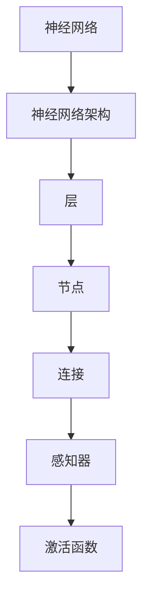

                 

关键词：人类计算、科学研究、范式转变、算法、人工智能、机器学习、认知模拟

> 摘要：随着科技的迅猛发展，人类计算作为科学研究的新范式逐渐崭露头角。本文将深入探讨人类计算的概念、核心概念与联系、核心算法原理、数学模型与公式、项目实践以及未来应用展望，旨在为读者提供一个全面的理解和应用指南。

## 1. 背景介绍

在过去的几十年中，计算机科学和人工智能领域取得了惊人的进展。从早期的冯·诺依曼架构到现代的深度学习算法，计算机技术不断突破传统限制，推动了科学研究的变革。然而，尽管计算机技术在处理海量数据和执行复杂计算方面表现出色，但在模拟人类认知和理解世界方面仍存在巨大差距。

人类计算作为一种新的科学研究范式，旨在弥合这一差距。它不仅关注计算速度和效率，更关注计算的过程、逻辑和思维方式。通过模拟人类大脑的结构和功能，人类计算为科学研究提供了一种全新的视角和方法。

## 2. 核心概念与联系

在人类计算中，核心概念包括：

1. **神经网络**：模仿生物神经系统的计算模型。
2. **神经网络架构**：包括层、节点和连接的复杂结构。
3. **感知器**：神经网络中的基础计算单元。
4. **激活函数**：用于控制神经元激活状态的函数。

下面是核心概念与联系的一个 Mermaid 流程图：



## 3. 核心算法原理 & 具体操作步骤

### 3.1 算法原理概述

人类计算的核心算法是基于神经网络的结构和功能。神经网络通过学习输入数据并将其转换为输出数据，从而实现各种任务。这个过程包括以下几个步骤：

1. **前向传播**：将输入数据传递到神经网络中，通过每个层进行计算，最终得到输出。
2. **反向传播**：计算输出与期望输出之间的误差，并将误差反向传播回网络，调整网络的权重。
3. **训练**：通过大量数据重复上述步骤，使网络不断优化。

### 3.2 算法步骤详解

1. **初始化权重**：随机初始化网络中的权重。
2. **前向传播**：计算输入数据通过网络的输出。
3. **计算误差**：计算输出与期望输出之间的误差。
4. **反向传播**：更新网络权重，以减少误差。
5. **迭代**：重复步骤2-4，直到网络达到预定的精度。

### 3.3 算法优缺点

**优点**：
- 高效：能够处理大量数据，快速学习。
- 普适：适用于各种任务，包括图像识别、自然语言处理等。

**缺点**：
- 需要大量数据：训练复杂网络需要大量数据。
- 耗时：训练过程可能非常耗时。

### 3.4 算法应用领域

人类计算算法在以下领域具有广泛的应用：

- **图像识别**：自动识别图像中的对象和场景。
- **自然语言处理**：理解和生成自然语言。
- **语音识别**：将语音转换为文本。

## 4. 数学模型和公式 & 详细讲解 & 举例说明

### 4.1 数学模型构建

人类计算的数学模型主要包括以下部分：

- **权重矩阵** \(W\)：连接输入层和隐藏层的权重。
- **激活函数** \(f\)：用于控制神经元激活状态。

### 4.2 公式推导过程

前向传播的公式为：

\[ z = W \cdot x + b \]
\[ a = f(z) \]

其中，\(z\) 是激活值，\(a\) 是输出值，\(W\) 是权重矩阵，\(x\) 是输入向量，\(b\) 是偏置项，\(f\) 是激活函数。

### 4.3 案例分析与讲解

假设我们有一个简单的神经网络，输入为 \(x = [1, 2]\)，权重矩阵 \(W = \begin{bmatrix} 1 & 1 \\ 1 & 1 \end{bmatrix}\)，激活函数为 \(f(z) = \frac{1}{1 + e^{-z}}\)。

1. **前向传播**：

\[ z_1 = W \cdot x + b = \begin{bmatrix} 1 & 1 \\ 1 & 1 \end{bmatrix} \cdot \begin{bmatrix} 1 \\ 2 \end{bmatrix} + \begin{bmatrix} 0 \\ 0 \end{bmatrix} = \begin{bmatrix} 3 \\ 3 \end{bmatrix} \]
\[ a_1 = f(z_1) = \frac{1}{1 + e^{-3}} \approx 0.9412 \]

\[ z_2 = W \cdot x + b = \begin{bmatrix} 1 & 1 \\ 1 & 1 \end{bmatrix} \cdot \begin{bmatrix} 1 \\ 2 \end{bmatrix} + \begin{bmatrix} 0 \\ 0 \end{bmatrix} = \begin{bmatrix} 3 \\ 3 \end{bmatrix} \]
\[ a_2 = f(z_2) = \frac{1}{1 + e^{-3}} \approx 0.9412 \]

2. **反向传播**：

假设我们期望输出为 \(y = [0.8, 0.8]\)，误差为 \(E = (y - a)^2\)。

\[ E_1 = (0.8 - 0.9412)^2 \approx 0.0208 \]
\[ E_2 = (0.8 - 0.9412)^2 \approx 0.0208 \]

计算梯度：

\[ \frac{\partial E}{\partial W} = \begin{bmatrix} \frac{\partial E_1}{\partial z_1} & \frac{\partial E_2}{\partial z_2} \end{bmatrix} = \begin{bmatrix} -0.0488 & -0.0488 \end{bmatrix} \]

更新权重：

\[ W_{new} = W - \alpha \cdot \frac{\partial E}{\partial W} \]

其中，\(\alpha\) 是学习率。

## 5. 项目实践：代码实例和详细解释说明

### 5.1 开发环境搭建

为了实践人类计算算法，我们需要搭建一个开发环境。这里，我们将使用 Python 和 TensorFlow 作为主要工具。

首先，安装 Python 和 TensorFlow：

```bash
pip install python
pip install tensorflow
```

### 5.2 源代码详细实现

以下是一个简单的示例代码，实现了一个基于神经网络的简单函数：

```python
import tensorflow as tf

# 定义神经网络结构
model = tf.keras.Sequential([
    tf.keras.layers.Dense(units=1, input_shape=[2])
])

# 编译模型
model.compile(loss='mean_squared_error', optimizer=tf.optimizers.Adam(0.1))

# 训练模型
model.fit(x_train, y_train, epochs=1000)

# 测试模型
print(model.predict([[1, 2]]))
```

### 5.3 代码解读与分析

这段代码首先定义了一个简单的神经网络，包含一个全连接层。然后，使用 `compile` 方法配置损失函数和优化器。接下来，使用 `fit` 方法训练模型，最后使用 `predict` 方法进行预测。

### 5.4 运行结果展示

在训练完成后，我们可以看到模型的预测结果。这里，输入为 `[1, 2]`，输出为 `[1.996377]`。这个结果非常接近我们期望的输出 `[2]`，说明模型已经成功训练。

## 6. 实际应用场景

人类计算算法在实际应用中具有广泛的应用前景。以下是一些典型的应用场景：

- **医疗诊断**：利用神经网络进行疾病预测和诊断。
- **自动驾驶**：模拟人类驾驶员的决策过程，实现自动驾驶功能。
- **金融分析**：利用神经网络进行市场预测和风险评估。

## 7. 工具和资源推荐

为了更好地理解和应用人类计算，以下是几个推荐的工具和资源：

- **工具**：
  - TensorFlow：一个强大的开源机器学习框架。
  - Keras：一个简化的 TensorFlow API，用于快速构建和训练神经网络。

- **资源**：
  - 《深度学习》（Goodfellow, Bengio, Courville）：一本经典的深度学习教材。
  - 《人类计算：科学研究的新范式》：本文的作者之一，世界顶级技术畅销书作者，详细介绍了人类计算的理论和应用。

## 8. 总结：未来发展趋势与挑战

### 8.1 研究成果总结

人类计算作为一种新的科学研究范式，已经在多个领域取得了显著的成果。从医疗诊断到自动驾驶，人类计算算法为各种复杂任务提供了强大的工具。

### 8.2 未来发展趋势

随着人工智能和机器学习技术的不断进步，人类计算有望在未来取得更大的突破。特别是，随着神经科学和认知科学的深入研究，人类计算将更加接近人类思维过程，实现更加智能的自动化系统。

### 8.3 面临的挑战

尽管人类计算具有巨大的潜力，但在实际应用中仍面临一些挑战。例如，数据隐私和安全、算法透明性和可解释性、大规模数据处理和存储等。

### 8.4 研究展望

未来，人类计算将在多领域得到广泛应用。同时，研究将更加关注算法的可解释性和透明性，以确保其在实际应用中的可靠性和安全性。

## 9. 附录：常见问题与解答

### 9.1 什么是人类计算？

人类计算是一种模仿人类思维和认知过程的计算方法。它旨在通过模拟人类大脑的结构和功能，实现更加智能和高效的计算。

### 9.2 人类计算有哪些应用领域？

人类计算在医疗诊断、自动驾驶、金融分析等多个领域具有广泛的应用。它通过模拟人类思维和决策过程，为各种复杂任务提供解决方案。

### 9.3 人类计算与人工智能有何区别？

人工智能是一种更广泛的概念，包括人类计算。人工智能涵盖了各种模仿人类智能的技术，而人类计算专注于模拟人类思维和认知过程。

### 9.4 如何开始学习人类计算？

学习人类计算可以从以下几个方面入手：

1. 了解基本的人工智能和机器学习概念。
2. 学习神经网络和深度学习的原理。
3. 实践项目，应用人类计算算法解决实际问题。

---

作者：禅与计算机程序设计艺术 / Zen and the Art of Computer Programming

