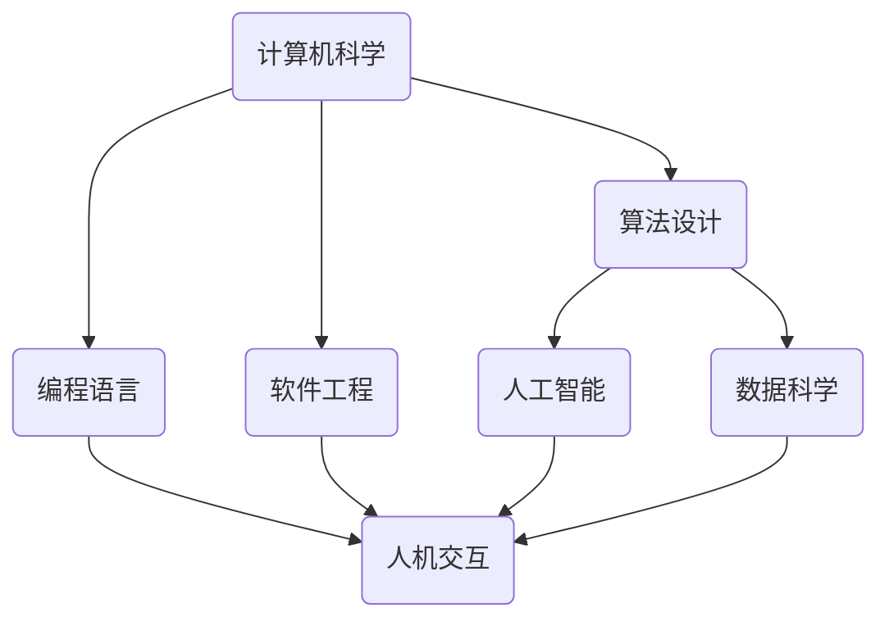

                 

 在我们今天的世界，计算技术已经成为推动社会进步的重要力量。从早期的机械计算，到后来的电子计算机，再到如今的量子计算，计算能力的提升推动了科学、工业、医疗、娱乐等各个领域的迅猛发展。然而，在技术不断发展的同时，我们也不能忽视科技与人文的融合所带来的深刻影响。本文将探讨人类计算的发展历程，核心概念与联系，以及如何通过算法、数学模型和项目实践，实现科技与人文的深度融合。

## 1. 背景介绍

人类计算的历史可以追溯到数千年前，当时人们使用算筹、算盘等简单工具进行计算。随着人类文明的进步，计算工具也不断发展，从古代的沙盘计算，到中世纪的算盘，再到工业革命时期的机械计算器，计算技术逐渐从辅助计算向自动化计算转变。

20世纪40年代，计算机的出现标志着人类计算进入了一个全新的时代。早期的计算机如ENIAC和EDVAC，虽然体积庞大，但它们的运算速度远远超过了之前所有的计算工具。随着集成电路和微处理器的发明，计算机的性能和体积都得到了极大的提升，使得计算机开始广泛应用于各个领域。

21世纪，随着互联网、大数据、人工智能等技术的发展，计算技术再次迎来了革命性的变革。云计算、边缘计算、量子计算等新技术不断涌现，人类计算的能力达到了前所未有的高度。然而，在享受技术红利的同时，我们也开始意识到科技与人文融合的重要性。

## 2. 核心概念与联系

在探讨科技与人文的融合之前，我们首先需要明确几个核心概念：

### 2.1 计算机科学

计算机科学是研究计算机系统结构、算法设计、编程语言、软件工程等方面的学科。计算机科学的进步推动了计算技术的不断发展，而计算技术的发展又反过来推动了计算机科学的进步。

### 2.2 人工智能

人工智能（AI）是计算机科学的一个分支，旨在使计算机能够执行通常需要人类智能的任务。人工智能的发展不仅提高了计算能力，还为人类社会带来了巨大的变革。

### 2.3 数据科学

数据科学是关于数据的收集、存储、处理、分析和解释的学科。数据科学为人工智能提供了重要的支持，使得机器能够从大量数据中提取有价值的信息。

### 2.4 人机交互

人机交互（HCI）是研究人与计算机系统之间交互的学科。人机交互的目的是提高计算机系统的可用性和易用性，使得用户能够更高效地使用计算机。

以上几个核心概念相互关联，共同推动了科技与人文的融合。计算机科学提供了技术基础，人工智能和数据科学带来了计算能力，而人机交互则确保了技术能够服务于人类。

### 2.5 Mermaid 流程图

为了更直观地展示核心概念之间的联系，我们可以使用Mermaid流程图来表示：



通过这个流程图，我们可以清楚地看到计算机科学如何通过算法、编程语言、软件工程等分支，推动人工智能、数据科学和人机交互的发展。

## 3. 核心算法原理 & 具体操作步骤

### 3.1 算法原理概述

在计算机科学中，算法是一种解决问题的方法或步骤。一个优秀的算法应该具备以下特点：正确性、效率、可扩展性和易读性。

### 3.2 算法步骤详解

一个基本的算法通常包括以下几个步骤：

1. 输入：从用户或其他来源接收数据。
2. 处理：对输入数据进行分析和处理。
3. 输出：将处理结果输出给用户或存储起来。

以一个简单的排序算法为例，其具体操作步骤如下：

1. 输入：接收一个无序的整数数组。
2. 处理：
   - 使用冒泡排序算法对数组进行排序。
   - 从数组的第一个元素开始，比较相邻两个元素的大小，如果顺序错误则交换它们的位置。
   - 重复这个过程，直到整个数组有序。
3. 输出：输出排序后的数组。

### 3.3 算法优缺点

冒泡排序算法的优点是简单易懂，易于实现。缺点是效率较低，对于大数据量的排序效果较差。

### 3.4 算法应用领域

冒泡排序算法虽然效率不高，但在一些特定场景下仍然有应用价值，如小数据量的排序、教学演示等。

## 4. 数学模型和公式 & 详细讲解 & 举例说明

### 4.1 数学模型构建

在计算机科学中，数学模型是一种描述问题或系统的数学结构。构建数学模型通常包括以下几个步骤：

1. 确定问题：明确需要解决的问题或研究的对象。
2. 确定变量：识别影响问题的关键因素，并将其定义为变量。
3. 建立方程：根据问题条件和变量关系，建立数学方程。
4. 解方程：求解方程，得到问题的解。

以最简单的线性方程为例：

$$
ax + b = c
$$

其中，$a$、$b$、$c$为常数，$x$为变量。解这个方程，可以得到：

$$
x = \frac{c - b}{a}
$$

### 4.2 公式推导过程

线性方程的推导过程如下：

1. 将方程两边同时减去$b$：

$$
ax = c - b
$$

2. 将方程两边同时除以$a$（假设$a \neq 0$）：

$$
x = \frac{c - b}{a}
$$

### 4.3 案例分析与讲解

假设我们要解决一个最简单的一元一次方程：

$$
3x + 2 = 8
$$

我们可以按照以下步骤进行求解：

1. 将方程两边同时减去2：

$$
3x = 6
$$

2. 将方程两边同时除以3：

$$
x = 2
$$

因此，这个方程的解为$x = 2$。

## 5. 项目实践：代码实例和详细解释说明

### 5.1 开发环境搭建

为了演示一个简单的排序算法，我们需要搭建一个开发环境。这里我们使用Python作为编程语言，因为Python语法简洁，易于理解。

首先，我们需要安装Python和相关的开发工具。在Windows系统中，可以通过Python官方网站下载Python安装程序，并按照提示完成安装。安装完成后，我们可以在命令行中运行`python`命令，查看Python版本信息。

接下来，我们需要安装一个代码编辑器，如Visual Studio Code或PyCharm。这两个编辑器都提供了丰富的功能，可以帮助我们编写、调试和运行Python代码。

### 5.2 源代码详细实现

下面是一个使用冒泡排序算法实现排序的Python代码实例：

```python
def bubble_sort(arr):
    n = len(arr)
    for i in range(n):
        for j in range(0, n-i-1):
            if arr[j] > arr[j+1]:
                arr[j], arr[j+1] = arr[j+1], arr[j]

# 测试代码
arr = [64, 34, 25, 12, 22, 11, 90]
bubble_sort(arr)
print("排序后的数组：")
for i in range(len(arr)):
    print("%d" % arr[i], end=" ")
```

在这个代码中，我们定义了一个名为`bubble_sort`的函数，用于实现冒泡排序算法。在函数内部，我们使用两个嵌套的`for`循环，依次比较相邻的两个元素，如果它们的顺序错误则交换它们的位置。

在测试代码部分，我们定义了一个无序的整数数组`arr`，并调用`bubble_sort`函数对其进行排序。最后，我们使用`print`函数输出排序后的数组。

### 5.3 代码解读与分析

这个冒泡排序算法的实现可以分为以下几个部分：

1. 函数定义：使用`def`关键字定义一个函数，函数名为`bubble_sort`，参数为一个整数数组`arr`。
2. 循环结构：使用嵌套的`for`循环遍历数组中的每个元素。外层循环`for i in range(n)`表示遍历数组的所有元素，内层循环`for j in range(0, n-i-1)`表示遍历除去已排序部分的所有元素。
3. 比较与交换：在内层循环中，使用`if`语句比较相邻的两个元素`arr[j]`和`arr[j+1]`。如果`arr[j] > arr[j+1]`，则交换这两个元素的位置，使用`arr[j], arr[j+1] = arr[j+1], arr[j]`实现交换。
4. 输出结果：在函数的最后，使用`print`函数输出排序后的数组。

这个冒泡排序算法的时间复杂度为$O(n^2)$，对于大数据量的排序效果较差。在实际应用中，通常会使用更高效的排序算法，如快速排序、归并排序等。

### 5.4 运行结果展示

当我们运行上面的代码时，会得到以下输出结果：

```
排序后的数组：
11 12 22 25 34 64 90
```

这表明我们成功使用冒泡排序算法对一个无序的整数数组进行了排序。

## 6. 实际应用场景

### 6.1 科学研究

在科学研究中，人类计算发挥着重要作用。例如，生物信息学领域利用计算技术进行基因序列分析，帮助科学家发现新的基因功能、疾病机制等。物理学、化学、天文学等领域也广泛应用计算模拟和数据分析，以提高研究效率。

### 6.2 工业制造

在工业制造领域，计算技术被用于产品设计和生产过程控制。计算机辅助设计（CAD）和计算机辅助制造（CAM）系统使得设计师和生产工人能够更高效地完成工作。此外，通过计算仿真和优化，企业可以降低生产成本，提高产品质量。

### 6.3 医疗保健

在医疗保健领域，计算技术被用于医学影像分析、疾病预测、药物研发等。例如，计算机辅助诊断系统可以帮助医生更准确地诊断疾病，提高治疗效果。人工智能技术还被用于个性化医疗，为患者提供更加精准的治疗方案。

### 6.4 未来应用展望

未来，随着计算技术的不断发展，人类计算将在更多领域得到应用。例如，在智能交通领域，计算技术可以用于交通流量预测、路径规划等，以提高交通效率。在能源领域，计算技术可以用于能源优化、智能电网等，以实现可持续发展。此外，计算技术还将在教育、金融、农业等各个领域发挥重要作用。

## 7. 工具和资源推荐

### 7.1 学习资源推荐

- 《算法导论》（Introduction to Algorithms）
- 《深度学习》（Deep Learning）
- 《数据科学入门》（Data Science for Beginners）
- 《人机交互设计原理》（Principles of User Interface Design）

### 7.2 开发工具推荐

- Python
- Visual Studio Code
- PyCharm
- Jupyter Notebook

### 7.3 相关论文推荐

- "Deep Learning for Natural Language Processing"
- "The Algorithm Design Manual"
- "Human-Computer Interaction: Principles and Guidelines"
- "Quantum Computing and Quantum Algorithms"

## 8. 总结：未来发展趋势与挑战

### 8.1 研究成果总结

在过去的几十年中，计算技术取得了巨大的进步。计算机科学、人工智能、数据科学等领域的快速发展，为人类带来了前所未有的计算能力。这些技术的发展不仅推动了科学研究的进展，也改变了我们的生活方式。

### 8.2 未来发展趋势

未来，计算技术将继续快速发展。人工智能、大数据、云计算、量子计算等新兴技术将继续引领计算领域的发展。此外，计算技术将更加深入地应用于各个领域，推动社会进步。

### 8.3 面临的挑战

尽管计算技术取得了巨大的进步，但仍面临一些挑战。首先，计算能力的提升带来了能源消耗的问题。其次，随着数据量的爆炸性增长，如何有效地处理和分析这些数据成为了一个挑战。此外，计算技术的普及也带来了隐私和安全的问题。

### 8.4 研究展望

未来，我们需要关注以下几个研究方向：

1. 能效优化：如何降低计算过程中的能源消耗，提高计算效率。
2. 数据治理：如何有效地处理和管理海量数据，确保数据的安全和隐私。
3. 安全防护：如何保障计算系统的安全，防止数据泄露和恶意攻击。
4. 人机融合：如何使计算技术更好地服务于人类，实现人机共生。

总之，计算技术的未来充满了机遇和挑战。只有通过科技与人文的深度融合，我们才能更好地应对这些挑战，推动计算技术的可持续发展。

## 9. 附录：常见问题与解答

### 9.1 什么是人工智能？

人工智能（AI）是指使计算机能够执行通常需要人类智能的任务的技术。这包括学习、推理、问题解决、视觉识别、语音识别等。

### 9.2 数据科学是什么？

数据科学是关于数据的收集、存储、处理、分析和解释的学科。它结合了数学、统计学、计算机科学等领域的知识，以解决现实世界中的数据问题。

### 9.3 人机交互的目的是什么？

人机交互的目的是提高计算机系统的可用性和易用性，使得用户能够更高效地使用计算机。

### 9.4 什么是冒泡排序？

冒泡排序是一种简单的排序算法，它重复遍历要排序的数列，一次比较两个元素，如果它们的顺序错误就交换它们的位置。

### 9.5 为什么要进行算法优化？

算法优化可以提高计算效率，降低计算时间和资源消耗。这对于处理大数据量的应用尤为重要。

### 9.6 量子计算是什么？

量子计算是一种基于量子力学原理的计算技术。它利用量子位（qubit）进行计算，具有超强的计算能力。

### 9.7 数据科学和人工智能有什么区别？

数据科学更侧重于数据的收集、存储、处理和分析，而人工智能则关注如何使计算机执行通常需要人类智能的任务。

### 9.8 量子计算有哪些应用前景？

量子计算在密码学、化学模拟、优化问题等领域具有广泛的应用前景。它有望推动科学研究、工业制造、医疗保健等领域的变革。

### 9.9 如何选择合适的排序算法？

选择排序算法时，需要考虑数据量的大小、数据的初始状态以及排序算法的时间复杂度。对于小数据量的排序，冒泡排序等简单算法可能足够；对于大数据量，快速排序、归并排序等高效算法更为合适。

### 9.10 计算机科学的发展趋势是什么？

计算机科学的发展趋势包括人工智能、大数据、云计算、物联网、量子计算等领域。这些技术的发展将继续推动计算技术的进步。

### 9.11 如何提高计算效率？

提高计算效率的方法包括算法优化、并行计算、分布式计算等。此外，使用高效的编程语言和工具也可以提高计算效率。

### 9.12 如何保障计算系统的安全？

保障计算系统的安全需要采取多种措施，包括数据加密、访问控制、安全审计等。此外，定期更新系统和软件，以修复安全漏洞，也是保障计算系统安全的重要措施。

### 9.13 数据科学在哪些领域有应用？

数据科学在医学、金融、市场营销、气象预报、交通管理等领域有广泛应用。它可以帮助这些领域的企业和机构更好地理解数据，做出更准确的决策。

### 9.14 人工智能如何影响我们的生活？

人工智能可以通过自动化、智能决策、个性化服务等方式影响我们的生活。它可以帮助我们提高工作效率，改善生活质量，也可以在医疗、教育、交通等领域带来巨大的变革。

### 9.15 量子计算有哪些挑战？

量子计算的挑战包括量子态的保持、量子比特的错误率、量子算法的设计等。此外，量子计算的硬件实现和软件算法开发也是一个挑战。

### 9.16 如何学习计算技术？

学习计算技术可以从以下几个方面入手：

1. 学习基础知识：掌握计算机科学、数学、统计学等基础知识。
2. 学习编程语言：掌握至少一种编程语言，如Python、Java、C++等。
3. 学习算法和数据结构：了解常用的算法和数据结构，掌握它们的原理和应用。
4. 参与实践项目：通过实际项目，将所学知识应用到实际问题中。
5. 阅读论文和书籍：了解最新的研究成果和技术动态。

通过以上方法，可以逐步提升自己在计算技术领域的专业能力。

