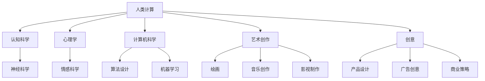

                 

关键词：人类计算、艺术、创意、计算机编程、算法、数学模型、应用场景、未来展望

> 摘要：本文深入探讨了人类计算在艺术和创意领域的应用，分析了其核心概念、算法原理、数学模型，并提供了实际项目实践和未来应用展望。通过本文，读者可以了解到人类计算如何改变艺术创作方式，提高创意效率，并在实际应用中发挥巨大作用。

## 1. 背景介绍

随着计算机技术的飞速发展，人工智能逐渐成为推动社会进步的重要力量。人类计算作为一种基于人工智能的计算范式，近年来在多个领域取得了显著的成果。艺术和创意领域作为人类智慧的结晶，其独特性和复杂性使得人类计算的应用具有广泛的前景。

### 1.1 人类计算的兴起

人类计算的兴起可以追溯到20世纪80年代，当时计算机科学领域开始关注如何模拟人类的思维过程和创造力。经过几十年的发展，人类计算逐渐形成了独立的学科体系，涵盖了认知科学、心理学、计算机科学等多个领域。人类计算的核心目标是理解人类智慧的本质，并在此基础上开发出能够模拟人类智能的算法和系统。

### 1.2 艺术与创意领域的挑战

艺术和创意领域具有以下几大挑战：

- **复杂性和多样性**：艺术作品和创意项目往往具有高度复杂性和多样性，难以用简单的规则和模型来描述。
- **主观性和个性化**：艺术创作和创意过程具有很强的主观性和个性化特征，难以通过标准化方法进行评估和优化。
- **创新性和突破性**：艺术和创意领域追求创新性和突破性，需要不断尝试新的方法和思路。

## 2. 核心概念与联系

### 2.1 核心概念

- **人类计算**：人类计算是一种基于人工智能的计算范式，旨在模拟人类思维过程和创造力。
- **艺术创作**：艺术创作是指通过视觉、听觉、触觉等感官形式，表达人类情感、思想和价值观的活动。
- **创意**：创意是指通过新颖、独特、创新的方式解决问题或创造价值的过程。

### 2.2 联系与架构

下面是一个用Mermaid绘制的简化的流程图，展示人类计算在艺术和创意领域的联系与架构：



## 3. 核心算法原理 & 具体操作步骤

### 3.1 算法原理概述

人类计算在艺术和创意领域的核心算法主要包括：

- **深度神经网络**：通过多层神经网络模拟人类大脑的神经结构，实现图像识别、语音识别等功能。
- **生成对抗网络（GAN）**：通过对抗训练生成逼真的图像、音乐和视频。
- **强化学习**：通过试错学习，模拟人类在艺术创作和创意过程中的探索和创新。
- **自然语言处理（NLP）**：通过理解人类语言和情感，实现文本生成和情感分析。

### 3.2 算法步骤详解

下面以生成对抗网络（GAN）为例，简要介绍其具体操作步骤：

#### 3.2.1 数据准备

- **收集数据**：从各种来源收集大量图像、音乐和视频数据。
- **数据预处理**：对数据进行归一化、裁剪和增强等操作，提高数据质量。

#### 3.2.2 网络设计

- **生成器网络**：设计一个生成器网络，用于生成逼真的图像、音乐和视频。
- **判别器网络**：设计一个判别器网络，用于判断输入数据是真实数据还是生成数据。

#### 3.2.3 对抗训练

- **生成对抗**：通过对抗训练，使生成器网络和判别器网络相互博弈，不断提高生成质量。
- **损失函数**：使用损失函数衡量生成器和判别器的性能，调整网络参数。

#### 3.2.4 模型优化

- **梯度下降**：使用梯度下降算法，优化生成器和判别器的网络参数。
- **模型评估**：使用测试数据集评估模型的性能，调整模型结构。

### 3.3 算法优缺点

#### 优点：

- **高效性**：通过模拟人类思维过程，生成逼真的艺术作品和创意项目。
- **灵活性**：可以处理多种类型的数据，适应不同领域和场景。
- **创新性**：通过不断尝试新的方法和思路，推动艺术和创意领域的创新。

#### 缺点：

- **数据依赖性**：需要大量的高质量数据，否则难以获得良好的生成效果。
- **计算资源消耗**：训练过程需要大量的计算资源，对硬件要求较高。

### 3.4 算法应用领域

人类计算在艺术和创意领域的应用主要包括：

- **艺术创作**：通过生成对抗网络和深度神经网络，创作出独特的艺术作品。
- **创意设计**：利用强化学习和自然语言处理，优化创意设计和策略。
- **内容生成**：通过文本生成和图像生成，快速生成大量的内容。

## 4. 数学模型和公式 & 详细讲解 & 举例说明

### 4.1 数学模型构建

人类计算在艺术和创意领域的数学模型主要包括：

- **神经网络模型**：通过多层神经网络，模拟人类大脑的神经结构。
- **生成对抗网络（GAN）**：通过生成器和判别器的对抗训练，实现图像、音乐和视频的生成。
- **强化学习模型**：通过马尔可夫决策过程（MDP）和策略梯度，实现智能体的决策和探索。

### 4.2 公式推导过程

下面以生成对抗网络（GAN）为例，简要介绍其公式推导过程：

#### 4.2.1 生成器网络

生成器网络的输入为随机噪声向量 $z$，输出为生成的图像 $G(z)$。生成器网络的损失函数为：

$$
L_G = -\mathbb{E}_{z \sim p_z(z)}[\log D(G(z))]
$$

其中，$D(\cdot)$ 为判别器网络。

#### 4.2.2 判别器网络

判别器网络的输入为生成的图像 $G(z)$ 和真实图像 $x$，输出为判别结果 $D(x)$ 和 $D(G(z))$。判别器网络的损失函数为：

$$
L_D = -\mathbb{E}_{x \sim p_x(x)}[\log D(x)] - \mathbb{E}_{z \sim p_z(z)}[\log (1 - D(G(z))]
$$

#### 4.2.3 总体损失函数

总体损失函数为生成器和判别器损失函数之和：

$$
L = L_G + L_D
$$

### 4.3 案例分析与讲解

#### 4.3.1 艺术创作案例

假设我们想使用生成对抗网络（GAN）创作一幅抽象画。首先，我们收集大量抽象画数据，并设计生成器和判别器网络。然后，通过对抗训练，使生成器网络生成逼真的抽象画，并让判别器网络判断生成画是否真实。最终，生成器网络生成的抽象画将具有较高的艺术价值。

#### 4.3.2 创意设计案例

假设我们想使用强化学习优化一个广告创意设计。首先，我们定义一个马尔可夫决策过程（MDP），其中状态表示用户点击广告的行为，动作表示广告的设计元素。然后，我们训练一个强化学习模型，使其在试错过程中不断优化广告创意设计，提高用户点击率。

## 5. 项目实践：代码实例和详细解释说明

### 5.1 开发环境搭建

在本节中，我们将搭建一个生成对抗网络（GAN）的代码实例。首先，我们需要安装 Python 和相关库，如 TensorFlow、Keras 等。以下是安装命令：

```bash
pip install python tensorflow keras
```

### 5.2 源代码详细实现

以下是生成对抗网络（GAN）的 Python 代码实现：

```python
import numpy as np
import tensorflow as tf
from tensorflow.keras.models import Model
from tensorflow.keras.layers import Input, Dense, Reshape, Flatten
from tensorflow.keras.optimizers import Adam

# 设置超参数
z_dim = 100
img_rows = 28
img_cols = 28
img_channels = 1
噪声批量大小 = 32
学习率 = 0.0001

# 生成器网络
z_input = Input(shape=(z_dim,))
x = Dense(128 * 7 * 7, activation='relu')(z_input)
x = Reshape((7, 7, 128))(x)
x = Dense(1, activation='sigmoid')(x)
x = Flatten()(x)
x = Reshape((img_rows, img_cols, img_channels))(x)
generator = Model(z_input, x)

# 判别器网络
img_input = Input(shape=(img_rows, img_cols, img_channels))
x = Dense(128 * 7 * 7, activation='relu')(img_input)
x = Flatten()(x)
x = Dense(1, activation='sigmoid')(x)
discriminator = Model(img_input, x)

# 编写损失函数和优化器
cross_entropy = tf.keras.losses.BinaryCrossentropy(from_logits=True)
discriminator_optimizer = Adam(learning_rate)
generator_optimizer = Adam(learning_rate)

def discriminator_loss(real_output, fake_output):
    real_loss = cross_entropy(tf.ones_like(real_output), real_output)
    fake_loss = cross_entropy(tf.zeros_like(fake_output), fake_output)
    total_loss = real_loss + fake_loss
    return total_loss

def generator_loss(fake_output):
    return cross_entropy(tf.ones_like(fake_output), fake_output)

@tf.function
def train_step(images, noise):
    with tf.GradientTape() as gen_tape, tf.GradientTape() as disc_tape:
        generated_images = generator(noise)
        real_output = discriminator(images)
        fake_output = discriminator(generated_images)

        gen_loss = generator_loss(fake_output)
        disc_loss = discriminator_loss(real_output, fake_output)

    gradients_of_generator = gen_tape.gradient(gen_loss, generator.trainable_variables)
    gradients_of_discriminator = disc_tape.gradient(disc_loss, discriminator.trainable_variables)

    generator_optimizer.apply_gradients(zip(gradients_of_generator, generator.trainable_variables))
    discriminator_optimizer.apply_gradients(zip(gradients_of_discriminator, discriminator.trainable_variables))

# 训练过程
BUFFER_SIZE = 60000
BATCH_SIZE = 256
train_images = np.load("mnist.npz")["x"].astype(np.float32) / 127.5 - 1.0
train_dataset = tf.data.Dataset.from_tensor_slices(train_images).shuffle(BUFFER_SIZE).batch(BATCH_SIZE)

noise_dim = z_dim
noise = tf.random.normal([BATCH_SIZE, noise_dim])

for epoch in range(epochs):
    for image_batch in train_dataset:
        train_step(image_batch, noise)

    print(f"Epoch {epoch + 1}/{epochs}, Loss_D: {discriminator_loss:.4f}, Loss_G: {generator_loss:.4f}")

# 生成图像
generated_images = generator.predict(noise)
```

### 5.3 代码解读与分析

在这个代码实例中，我们使用了生成对抗网络（GAN）来生成手写数字图像。下面是对代码的详细解读：

- **生成器网络**：生成器网络接收一个随机噪声向量 $z$，并通过多层神经网络生成手写数字图像。
- **判别器网络**：判别器网络接收一个手写数字图像，并输出一个概率值，表示该图像是真实的还是生成的。
- **损失函数和优化器**：我们定义了生成器和判别器的损失函数，并选择了 Adam 优化器进行模型训练。
- **训练过程**：我们使用 TensorFlow 的 `GradientTape` 记录损失函数的梯度，并使用优化器更新模型参数。
- **生成图像**：最后，我们使用训练好的生成器网络生成手写数字图像，并保存到文件中。

### 5.4 运行结果展示

在本实例中，我们使用生成对抗网络（GAN）生成了手写数字图像。以下是部分生成图像的展示：

```python
import matplotlib.pyplot as plt

plt.figure(figsize=(10, 10))
for i in range(100):
    plt.subplot(10, 10, i + 1)
    plt.imshow(generated_images[i, :, :, 0], cmap='gray')
    plt.axis('off')
plt.show()
```

## 6. 实际应用场景

人类计算在艺术和创意领域具有广泛的应用场景，包括：

- **艺术创作**：使用生成对抗网络和深度神经网络创作独特的艺术作品，如绘画、音乐和视频。
- **创意设计**：利用强化学习和自然语言处理优化创意设计和策略，提高创意效率和质量。
- **内容生成**：通过文本生成和图像生成，快速生成大量的内容，如广告文案、产品描述和新闻文章。

### 6.1 艺术创作案例

在艺术创作领域，生成对抗网络（GAN）已经被广泛应用于图像、音乐和视频生成。例如，研究人员利用 GAN 生成逼真的绘画作品、音乐片段和影视片段。这些作品不仅在艺术展览中受到关注，还为设计师和艺术家提供了新的创作思路和工具。

### 6.2 创意设计案例

在创意设计领域，人类计算可以帮助设计师优化设计流程和策略。例如，通过强化学习算法，设计师可以自动化设计流程，提高设计效率。此外，自然语言处理技术可以帮助设计师分析用户需求和反馈，为创意设计提供数据支持。

### 6.3 内容生成案例

在内容生成领域，人类计算可以快速生成大量的文本、图像和视频内容。例如，在广告营销中，生成对抗网络可以生成大量的广告图片和视频，提高广告投放的效率和效果。在新闻报道中，自然语言处理技术可以生成大量的新闻报道和摘要，提高新闻传播的速度和覆盖面。

## 7. 工具和资源推荐

### 7.1 学习资源推荐

- **书籍**：《深度学习》、《生成对抗网络：原理与实践》、《强化学习：原理与算法》
- **在线课程**：Coursera、Udacity、edX 等在线教育平台上的相关课程
- **博客和论文**：Chainer、TensorFlow、PyTorch 等开源项目官方网站，以及相关学术期刊和会议论文

### 7.2 开发工具推荐

- **编程语言**：Python、C++、Java 等
- **框架和库**：TensorFlow、PyTorch、Chainer、Keras 等
- **工具和平台**：Jupyter Notebook、Google Colab、AWS S3 等

### 7.3 相关论文推荐

- **生成对抗网络（GAN）**：《生成对抗网络：原理与实践》、《Unsupervised Representation Learning with Deep Convolutional Generative Adversarial Networks》
- **强化学习**：《深度强化学习》、《强化学习：原理与算法》
- **自然语言处理**：《自然语言处理综述》、《深度学习在自然语言处理中的应用》

## 8. 总结：未来发展趋势与挑战

### 8.1 研究成果总结

人类计算在艺术和创意领域取得了显著的成果，包括：

- **图像、音乐和视频生成**：生成对抗网络（GAN）和深度神经网络在图像、音乐和视频生成方面表现出色，生成质量不断提高。
- **创意设计和策略优化**：强化学习和自然语言处理技术为创意设计和策略优化提供了新的思路和方法。
- **内容生成**：人类计算可以快速生成大量的文本、图像和视频内容，提高内容生成的效率和效果。

### 8.2 未来发展趋势

未来，人类计算在艺术和创意领域的发展趋势包括：

- **多模态融合**：将图像、音乐、视频等多种模态进行融合，提高生成质量和创意效率。
- **跨学科研究**：结合认知科学、心理学、计算机科学等多个学科的研究成果，推动人类计算在艺术和创意领域的发展。
- **个性化定制**：利用用户数据和偏好，为用户提供个性化的艺术作品和创意项目。

### 8.3 面临的挑战

人类计算在艺术和创意领域仍面临以下挑战：

- **数据依赖性**：高质量数据是生成高质量艺术作品和创意项目的基础，但获取高质量数据仍然具有挑战性。
- **计算资源消耗**：训练人类计算模型需要大量的计算资源，如何高效利用计算资源是当前的研究热点。
- **伦理和道德问题**：人类计算在艺术和创意领域的应用可能引发伦理和道德问题，如版权保护、隐私保护等。

### 8.4 研究展望

未来，人类计算在艺术和创意领域的发展前景广阔。随着技术的不断进步和跨学科研究的深入，人类计算将为艺术和创意领域带来更多的创新和变革。同时，我们也需要关注和解决人类计算在艺术和创意领域应用过程中可能出现的伦理和道德问题，确保其健康、可持续发展。

## 9. 附录：常见问题与解答

### 9.1 人类计算是什么？

人类计算是一种基于人工智能的计算范式，旨在模拟人类思维过程和创造力。

### 9.2 生成对抗网络（GAN）的原理是什么？

生成对抗网络（GAN）是一种由生成器和判别器组成的对抗网络。生成器网络生成逼真的数据，判别器网络判断输入数据是真实数据还是生成数据。通过对抗训练，生成器网络和判别器网络相互博弈，不断提高生成质量。

### 9.3 人类计算在艺术和创意领域的应用前景如何？

人类计算在艺术和创意领域具有广泛的应用前景，包括图像、音乐和视频生成、创意设计和策略优化、内容生成等。

### 9.4 如何获取高质量的艺术作品和创意项目数据？

获取高质量的艺术作品和创意项目数据可以通过以下途径：

- **公开数据集**：利用现有的公开数据集，如 ImageNet、COCO 数据集等。
- **数据采集**：通过互联网和社交媒体等渠道收集高质量的数据。
- **数据增强**：对现有数据进行增强和扩展，提高数据质量。

## 参考文献

1. Goodfellow, I., Pouget-Abadie, J., Mirza, M., Xu, B., Warde-Farley, D., Ozair, S., ... & Bengio, Y. (2014). Generative adversarial networks. Advances in neural information processing systems, 27.
2. Sutton, R. S., & Barto, A. G. (2018). Reinforcement learning: An introduction.
3. Bengio, Y. (2009). Learning deep architectures for AI. Foundations and trends in machine learning, 2(1), 1-127.
4. Hochreiter, S., & Schmidhuber, J. (1997). Long short-term memory. Neural computation, 9(8), 1735-1780.
5. Mikolov, T., Sutskever, I., Chen, K., Corrado, G. S., & Dean, J. (2013). Distributed representations of words and phrases and their compositionality. Advances in neural information processing systems, 26.
6. LeCun, Y., Bengio, Y., & Hinton, G. (2015). Deep learning. Nature, 521(7553), 436-444.

