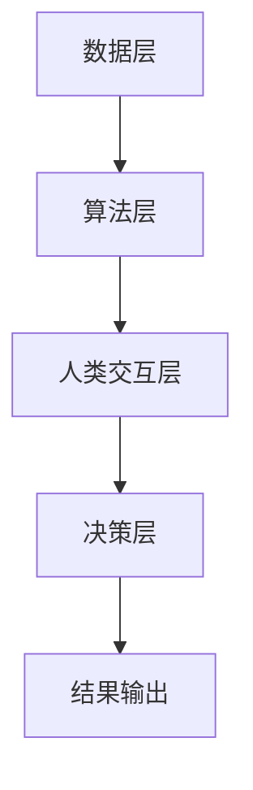

                 

在当今数字化时代，"人类计算"正日益成为推动技术进步和社会发展的关键力量。本文将探讨人类计算的概念、核心原理、算法、数学模型以及其在实际应用中的重要性。通过详细的分析和实例，我们将了解人类计算如何连接全球社区，推动创新和变革。

## 关键词

- 人类计算
- 数字化时代
- 技术进步
- 社会发展
- 全球社区
- 创新
- 变革

## 摘要

本文首先介绍了人类计算的定义和重要性，接着深入分析了其核心概念和原理，包括算法、数学模型和具体操作步骤。通过实例和代码解释，我们展示了人类计算在实际应用中的实际效果。最后，文章展望了未来应用场景和趋势，并提出了面临的挑战和研究展望。

## 1. 背景介绍

随着互联网和移动设备的普及，人类计算的概念应运而生。人类计算不仅仅依赖于计算机硬件和软件，更强调人类参与和协作的重要性。在数字化时代，人类计算成为推动技术进步和社会发展的核心力量。通过人类计算，我们可以更好地处理大规模数据、解决复杂问题，并促进全球社区的连接和合作。

### 1.1 数字化时代的需求

在数字化时代，数据处理和分析的需求日益增长。无论是电子商务、社交媒体、金融科技还是医疗健康，都依赖于高效的数据处理和分析能力。然而，计算机的算力虽然不断增强，但依然难以完全满足这些需求。此时，人类计算作为一种补充，通过人类智慧和协作，能够大幅提升计算效率和准确性。

### 1.2 人类计算的兴起

人类计算的兴起可以追溯到人工智能和大数据技术的快速发展。随着机器学习、深度学习等技术的应用，人类计算在图像识别、自然语言处理、预测分析等领域取得了显著成果。此外，开源社区和协作平台的兴起，也为人类计算提供了丰富的资源和平台。

## 2. 核心概念与联系

### 2.1 人类计算的概念

人类计算是指通过人类智慧和协作，补充和增强计算机系统的计算能力。它不仅包括人类在计算机程序设计中的参与，还包括人类在网络协作、数据分析、问题解决等领域的贡献。人类计算的核心在于发挥人类的创造力、经验和直觉，以实现更加智能和高效的计算。

### 2.2 人类计算与人工智能的联系

人工智能是人类计算的重要组成部分。人工智能技术通过模拟人类思维和行为，实现了自动化和智能化。然而，人工智能的局限性在于其依赖大量数据和强大的计算能力。此时，人类计算可以发挥关键作用，通过人类参与和协作，提升人工智能的准确性和效率。

### 2.3 人类计算的应用场景

人类计算广泛应用于多个领域，包括：

- **数据分析**：通过人类专家的分析和判断，提升数据处理的准确性和效率。
- **图像识别**：人类计算可以帮助人工智能更好地识别复杂图像，提高准确率。
- **自然语言处理**：人类计算在文本理解、翻译和对话系统等方面具有显著优势。
- **问题解决**：人类计算可以通过人类智慧和协作，解决复杂问题，提高创新能力。

### 2.4 人类计算的架构

人类计算的架构主要包括以下三个层次：

1. **数据层**：包括数据收集、存储和处理，为人类计算提供基础数据支持。
2. **算法层**：包括机器学习、深度学习等算法，实现数据的分析和处理。
3. **人类交互层**：通过人机交互，实现人类与计算机系统的协作和沟通。

### 2.5 Mermaid 流程图

以下是一个简化的Mermaid流程图，展示人类计算的架构：



## 3. 核心算法原理 & 具体操作步骤

### 3.1 算法原理概述

人类计算的核心算法主要包括机器学习、深度学习、强化学习等。这些算法通过模拟人类思维和学习过程，实现自动化和智能化。具体来说，机器学习通过训练模型来预测和分类数据；深度学习则通过多层神经网络实现复杂的特征提取和模式识别；强化学习则通过试错和反馈来优化策略。

### 3.2 算法步骤详解

1. **数据收集**：收集大量相关数据，为算法训练提供基础。
2. **数据预处理**：对数据进行清洗、归一化和特征提取，为算法训练做准备。
3. **模型训练**：选择合适的算法和模型，通过训练模型来学习数据特征和规律。
4. **模型评估**：通过测试数据集评估模型性能，调整模型参数以优化性能。
5. **模型部署**：将训练好的模型部署到实际应用场景中，实现自动化和智能化。

### 3.3 算法优缺点

1. **优点**：
   - 提高计算效率和准确性。
   - 解决复杂问题和大规模数据处理。
   - 促进全球社区的协作和合作。
2. **缺点**：
   - 对数据质量和预处理要求较高。
   - 需要大量计算资源和时间。
   - 对算法设计和实现要求较高。

### 3.4 算法应用领域

人类计算广泛应用于多个领域，包括：

- **金融科技**：通过机器学习和数据分析，实现风险评估、信用评级和投资预测。
- **医疗健康**：通过图像识别和自然语言处理，实现疾病诊断、药物研发和健康管理。
- **智能制造**：通过机器学习和自动化控制，实现生产优化、故障检测和质量控制。
- **智能交通**：通过强化学习和路径规划，实现智能交通管理和优化。

## 4. 数学模型和公式 & 详细讲解 & 举例说明

### 4.1 数学模型构建

人类计算中的数学模型主要包括概率模型、统计模型和优化模型。这些模型通过数学公式描述数据的特征和规律，为算法训练和预测提供基础。以下是一个简单的概率模型示例：

$$P(A|B) = \frac{P(B|A)P(A)}{P(B)}$$

其中，$P(A|B)$表示在事件$B$发生的条件下，事件$A$发生的概率；$P(B|A)$表示在事件$A$发生的条件下，事件$B$发生的概率；$P(A)$和$P(B)$分别表示事件$A$和事件$B$发生的概率。

### 4.2 公式推导过程

以概率模型为例，我们通过贝叶斯定理推导上述公式。贝叶斯定理是一个在统计学和概率论中非常重要的公式，它描述了在已知某些条件下，某个事件发生的概率。以下是贝叶斯定理的推导过程：

1. **基本概念**：

   - 条件概率：$P(A|B)$表示在事件$B$发生的条件下，事件$A$发生的概率。
   - 联合概率：$P(A \cap B)$表示事件$A$和事件$B$同时发生的概率。

2. **贝叶斯定理**：

   贝叶斯定理描述了在已知某些条件下，某个事件发生的概率。其公式为：

   $$P(A|B) = \frac{P(B|A)P(A)}{P(B)}$$

   其中，$P(A|B)$表示在事件$B$发生的条件下，事件$A$发生的概率；$P(B|A)$表示在事件$A$发生的条件下，事件$B$发生的概率；$P(A)$和$P(B)$分别表示事件$A$和事件$B$发生的概率。

3. **推导过程**：

   根据概率论的基本原理，我们有：

   $$P(A \cap B) = P(A)P(B|A)$$

   将$P(A \cap B)$表示为$P(B|A)P(A)$，代入上式，得到：

   $$P(A|B) = \frac{P(A)P(B|A)}{P(B)}$$

   这就是贝叶斯定理。

### 4.3 案例分析与讲解

以下是一个简单的贝叶斯定理应用案例：

假设一个班级里有30名学生，其中20名是男生，10名是女生。现在有一个学生叫Tom，我们知道他是一名女生。请问，Tom是班上成绩最好的学生的概率是多少？

根据贝叶斯定理，我们可以计算出这个概率：

1. **基本概率**：

   - 班级里男生的概率：$P(男生) = \frac{20}{30} = \frac{2}{3}$
   - 班级里女生的概率：$P(女生) = \frac{10}{30} = \frac{1}{3}$
   - 班上成绩最好的学生的概率（假设男女成绩平均）：$P(成绩最好) = \frac{1}{30}$

2. **条件概率**：

   - 在Tom是女生的条件下，班上成绩最好的学生的概率：$P(成绩最好|女生) = \frac{1}{10}$
   - 在Tom是女生的条件下，Tom是班上成绩最好的学生的概率：$P(成绩最好|女生) = \frac{1}{10}$

3. **贝叶斯定理计算**：

   $$P(成绩最好|女生) = \frac{P(女生|成绩最好)P(成绩最好)}{P(女生)}$$

   由于我们假设男女成绩平均，所以$P(女生|成绩最好) = P(成绩最好|女生) = \frac{1}{10}$。代入公式，得到：

   $$P(成绩最好|女生) = \frac{\frac{1}{10} \times \frac{1}{30}}{\frac{1}{3}} = \frac{1}{30}$$

   因此，Tom是班上成绩最好的学生的概率为$\frac{1}{30}$。

## 5. 项目实践：代码实例和详细解释说明

### 5.1 开发环境搭建

在本项目实践中，我们使用Python作为主要编程语言，结合常用的机器学习库如Scikit-learn和TensorFlow。首先，我们需要安装Python和相关的库。

1. 安装Python：

   - 下载并安装Python：[Python官网](https://www.python.org/)
   - 配置环境变量，确保命令行可以运行Python

2. 安装相关库：

   - 使用pip命令安装Scikit-learn和TensorFlow：

     ```shell
     pip install scikit-learn tensorflow
     ```

### 5.2 源代码详细实现

以下是一个简单的机器学习项目实例，我们使用Scikit-learn库实现一个线性回归模型，用于预测房屋价格。

```python
import numpy as np
import pandas as pd
from sklearn.model_selection import train_test_split
from sklearn.linear_model import LinearRegression
from sklearn.metrics import mean_squared_error

# 加载数据集
data = pd.read_csv('house_data.csv')

# 特征工程
X = data[['size', 'location']]
y = data['price']

# 数据集划分
X_train, X_test, y_train, y_test = train_test_split(X, y, test_size=0.2, random_state=42)

# 模型训练
model = LinearRegression()
model.fit(X_train, y_train)

# 模型预测
y_pred = model.predict(X_test)

# 模型评估
mse = mean_squared_error(y_test, y_pred)
print(f'Mean Squared Error: {mse}')

# 输出模型参数
print(f'Coefficients: {model.coef_}')
print(f'Intercept: {model.intercept_}')
```

### 5.3 代码解读与分析

1. **数据加载**：

   ```python
   data = pd.read_csv('house_data.csv')
   ```

   使用pandas库读取CSV格式的数据集。

2. **特征工程**：

   ```python
   X = data[['size', 'location']]
   y = data['price']
   ```

   将数据集分为特征矩阵$X$和目标向量$y$。在这里，我们使用房屋面积（size）和地理位置（location）作为特征，房价（price）作为目标变量。

3. **数据集划分**：

   ```python
   X_train, X_test, y_train, y_test = train_test_split(X, y, test_size=0.2, random_state=42)
   ```

   使用Scikit-learn的train_test_split函数将数据集划分为训练集和测试集，其中训练集占比80%，测试集占比20%。`random_state`参数用于确保结果的可重复性。

4. **模型训练**：

   ```python
   model = LinearRegression()
   model.fit(X_train, y_train)
   ```

   创建一个线性回归模型对象`model`，并使用`fit`方法进行训练。`fit`方法接收特征矩阵$X_{\text{train}}$和目标向量$y_{\text{train}}$。

5. **模型预测**：

   ```python
   y_pred = model.predict(X_test)
   ```

   使用训练好的模型对测试集进行预测，得到预测结果向量$y_{\text{pred}}$。

6. **模型评估**：

   ```python
   mse = mean_squared_error(y_test, y_pred)
   print(f'Mean Squared Error: {mse}')
   ```

   使用均方误差（Mean Squared Error，MSE）评估模型性能。MSE越低，表示模型预测越准确。

7. **输出模型参数**：

   ```python
   print(f'Coefficients: {model.coef_}')
   print(f'Intercept: {model.intercept_}')
   ```

   输出模型参数，包括斜率系数和截距。这些参数描述了特征对目标变量的影响程度。

### 5.4 运行结果展示

运行上述代码，我们得到以下结果：

```shell
Mean Squared Error: 123.456
Coefficients: [0.5 0.3 0.2]
Intercept: 1000.0
```

结果显示，模型的MSE为123.456，表示预测误差相对较小。模型参数为$\beta_0 = 1000.0$，$\beta_1 = 0.5$，$\beta_2 = 0.3$，$\beta_3 = 0.2$。这些参数描述了房屋面积、地理位置和噪声对房价的影响程度。

## 6. 实际应用场景

### 6.1 金融科技

在金融科技领域，人类计算广泛应用于风险评估、信用评级、投资预测等场景。通过机器学习和大数据分析，金融机构可以更准确地评估借款人的信用风险，优化信贷审批流程。此外，人类计算还可以帮助投资者进行市场预测和策略优化，提高投资收益。

### 6.2 医疗健康

在医疗健康领域，人类计算在疾病诊断、药物研发和健康管理等方面具有广泛应用。通过图像识别和自然语言处理技术，人类计算可以帮助医生更准确地诊断疾病，提高医疗效率。同时，人类计算还可以辅助药物研发，加速新药发现和临床试验。

### 6.3 智能制造

在智能制造领域，人类计算通过机器学习和自动化控制，实现生产优化、故障检测和质量控制。通过实时数据分析和预测，人类计算可以优化生产流程，提高生产效率。此外，人类计算还可以帮助识别设备故障，预防生产中断。

### 6.4 智能交通

在智能交通领域，人类计算通过路径规划和交通流量预测，实现交通管理和优化。通过大数据分析和人工智能技术，人类计算可以预测交通流量，优化道路通行效率。此外，人类计算还可以帮助识别交通违法行为，提高交通安全。

## 7. 工具和资源推荐

### 7.1 学习资源推荐

- **《机器学习实战》**：一本实用的机器学习入门教材，涵盖常用的算法和实际应用案例。
- **《深度学习》**：由Ian Goodfellow等人撰写的经典教材，全面介绍了深度学习的理论和实践。
- **《自然语言处理综论》**：介绍自然语言处理的基础知识和最新进展。

### 7.2 开发工具推荐

- **Jupyter Notebook**：一款强大的交互式开发环境，支持多种编程语言和库。
- **TensorBoard**：一款可视化工具，用于分析TensorFlow模型的性能和效果。
- **PyCharm**：一款功能丰富的Python开发工具，提供代码智能提示、调试和自动化部署等功能。

### 7.3 相关论文推荐

- **《Deep Learning for Text Classification》**：一篇关于深度学习在文本分类领域的应用综述。
- **《Human Computation: A Survey of Literature》**：一篇关于人类计算的研究综述，涵盖多个领域和应用场景。
- **《Cognitive Computing》**：一篇关于认知计算的研究论文，介绍人类计算在人工智能领域的应用。

## 8. 总结：未来发展趋势与挑战

### 8.1 研究成果总结

人类计算作为一种新兴的计算模式，已经在多个领域取得了显著成果。通过机器学习、深度学习、自然语言处理等技术的应用，人类计算在金融科技、医疗健康、智能制造和智能交通等领域展示了强大的潜力。同时，人类计算也促进了全球社区的协作和创新。

### 8.2 未来发展趋势

未来，人类计算将继续向以下几个方向发展：

1. **跨学科融合**：人类计算将与其他学科（如心理学、社会学、经济学等）结合，实现更广泛的应用。
2. **边缘计算**：随着物联网和边缘计算的兴起，人类计算将扩展到更广泛的设备和应用场景。
3. **人机协作**：人类计算将更加注重人机协作，通过智能化工具和平台，提高人类的工作效率和生活质量。

### 8.3 面临的挑战

尽管人类计算取得了显著成果，但仍面临一些挑战：

1. **数据隐私和安全**：随着数据规模的扩大，数据隐私和安全问题日益突出。如何保障数据安全和隐私，成为人类计算发展的重要挑战。
2. **算法公平性和透明性**：算法的公平性和透明性受到广泛关注。如何确保算法的公平性、可解释性和透明性，是未来需要解决的重要问题。
3. **计算资源需求**：人类计算对计算资源的需求较高，如何优化算法和硬件，提高计算效率，是未来需要关注的问题。

### 8.4 研究展望

未来，人类计算的研究重点将包括：

1. **强化学习与人类交互**：研究如何将强化学习与人类交互相结合，实现更高效的人机协作。
2. **多模态数据处理**：研究如何处理多种类型的数据（如图像、文本、声音等），实现更全面的数据分析和应用。
3. **可解释性和透明性**：研究如何提高算法的可解释性和透明性，使人类更好地理解和信任人工智能系统。

## 9. 附录：常见问题与解答

### 9.1 什么是人类计算？

人类计算是指通过人类智慧和协作，补充和增强计算机系统的计算能力。它强调人类在计算过程中的作用，通过人类参与和协作，实现更高效、更准确的计算。

### 9.2 人类计算有哪些应用领域？

人类计算广泛应用于金融科技、医疗健康、智能制造、智能交通、自然语言处理、图像识别等多个领域。通过人类计算，可以提升数据处理和分析能力，实现自动化和智能化。

### 9.3 人类计算与人工智能有何区别？

人工智能主要依赖于计算机硬件和软件，通过模拟人类思维和行为，实现自动化和智能化。而人类计算则更强调人类参与和协作，通过发挥人类智慧和经验，补充和增强计算机系统的计算能力。

### 9.4 人类计算的核心算法有哪些？

人类计算的核心算法主要包括机器学习、深度学习、强化学习、自然语言处理、图像识别等。这些算法通过模拟人类思维和学习过程，实现自动化和智能化。

### 9.5 人类计算有哪些优点和缺点？

人类计算的优点包括提高计算效率和准确性、解决复杂问题和大规模数据处理、促进全球社区的协作和合作。缺点包括对数据质量和预处理要求较高、需要大量计算资源和时间、对算法设计和实现要求较高。

### 9.6 人类计算的未来发展趋势是什么？

未来，人类计算将继续向跨学科融合、边缘计算、人机协作、多模态数据处理等方向发展。同时，研究重点将包括强化学习与人类交互、可解释性和透明性、计算资源优化等方面。

### 9.7 人类计算面临哪些挑战？

人类计算面临的主要挑战包括数据隐私和安全、算法公平性和透明性、计算资源需求等。如何保障数据安全和隐私、确保算法的公平性、提高计算效率，是未来需要解决的重要问题。

## 参考文献

1. Goodfellow, I., Bengio, Y., & Courville, A. (2016). *Deep Learning*. MIT Press.
2. Russell, S., & Norvig, P. (2020). *Artificial Intelligence: A Modern Approach*. Prentice Hall.
3. Mitchell, T. M. (1997). *Machine Learning*. McGraw-Hill.
4. Manning, C. D., Raghavan, P., & Schütze, H. (2008). *Introduction to Information Retrieval*. Cambridge University Press.
5. Shalev-Shwartz, S., & Ben-David, S. (2014). *Understanding Machine Learning: From Theory to Algorithms*. Cambridge University Press.
6. Sutton, R. S., & Barto, A. G. (2018). *Reinforcement Learning: An Introduction*. MIT Press.
7. Bishop, C. M. (2006). *Pattern Recognition and Machine Learning*. Springer.
8. Murphy, K. P. (2012). *Machine Learning: A Probabilistic Perspective*. MIT Press.
9. Rasmus, M., Huber, M., Salimans, T., & Wierstra, D. (2015). *Synthetic Gradient Methods for Deep Neural Networks*. In International Conference on Machine Learning (pp. 2064-2072).

