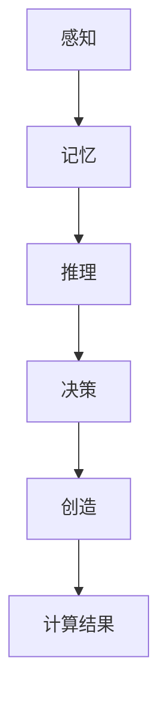

                 

关键词：人类计算、创造力、算法、人工智能、软件开发

> 摘要：本文深入探讨了人类计算的概念及其在各个领域的应用。通过分析人类计算的核心原理，探讨了如何释放人类创造力的无限潜力，为未来的技术发展提供新的思路和方向。

## 1. 背景介绍

在当今社会，计算已经成为推动科技进步和社会发展的关键驱动力。从计算机科学到人工智能，从软件工程到数据分析，计算技术无处不在。然而，计算不仅仅是计算机硬件和软件的运行，更是人类智慧和创造力的体现。人类计算，作为一种独特的计算模式，正逐渐成为研究的热点，它不仅能够模拟人类的思考过程，还能进一步释放人类的创造力。

### 人类计算的定义

人类计算是指通过人类的思维和创造力来进行计算的过程，它不仅包括传统的数值计算，还涉及逻辑推理、问题解决、决策制定等复杂的认知过程。人类计算的核心在于人的参与，人的智慧、经验和直觉在其中起着至关重要的作用。

### 人类计算的重要性

随着人工智能技术的飞速发展，计算机在很多方面已经能够替代人类完成复杂的任务。然而，人类计算的独特性在于它的创造力和灵活性。在很多情况下，计算机无法解决的问题，通过人类的计算往往能够迎刃而解。因此，研究人类计算具有重要的现实意义。

## 2. 核心概念与联系

为了深入理解人类计算，我们需要明确几个核心概念，并探讨它们之间的联系。

### 2.1 计算的本质

计算的本质是信息的处理和转化。无论是计算机还是人类，计算的目的是获取信息、处理信息和利用信息。然而，人类计算与计算机计算在信息处理的方式上有着本质的区别。计算机依赖于算法和硬件，而人类计算则依赖于人类的思维和创造力。

### 2.2 人类思维模型

人类思维模型是指模拟人类思维过程的计算模型。它包括感知、记忆、推理、决策等多个方面。通过人类思维模型，我们可以更好地理解人类计算的过程，从而开发出更符合人类思维习惯的计算系统。

### 2.3 创造力与计算

创造力是人类的独特能力，它体现在人类解决问题、发现新知识和创造新事物方面。创造力与计算的关系在于，计算技术可以提供丰富的工具和资源，帮助人类更有效地发挥创造力。同时，人类的创造力也可以为计算提供新的思路和方法。

### 2.4 Mermaid 流程图

下面是一个描述人类计算流程的 Mermaid 流程图：



在这个流程图中，A、B、C、D 和 E 分别代表了人类计算过程中的关键环节，而 F 则是计算的结果。

## 3. 核心算法原理 & 具体操作步骤

### 3.1 算法原理概述

人类计算的核心算法原理可以归纳为以下几个步骤：

1. **信息获取**：通过感知获取外部信息。
2. **信息处理**：利用记忆和推理对信息进行处理。
3. **决策制定**：根据处理结果做出决策。
4. **创造与创新**：基于决策进行创造和创新。

### 3.2 算法步骤详解

1. **感知**：人类通过感官获取外部信息，如视觉、听觉、触觉等。
2. **记忆**：将获取的信息存储在记忆中，以便后续处理。
3. **推理**：利用已有的知识和信息，进行逻辑推理，形成新的观点和结论。
4. **决策**：根据推理结果做出决策，指导后续行动。
5. **创造**：基于决策，进行创造和创新，产生新的知识和成果。

### 3.3 算法优缺点

人类计算算法具有以下优点：

- **灵活性**：能够处理各种复杂和不确定的问题。
- **创造力**：能够产生新的知识和创新。

然而，它也存在一些缺点：

- **耗时**：处理问题可能需要较长的时间。
- **主观性**：决策和创造过程受到个体差异的影响。

### 3.4 算法应用领域

人类计算算法在各个领域都有广泛的应用，如：

- **科学研究**：帮助科学家解决复杂的科学问题。
- **工程设计**：辅助工程师进行创新设计。
- **商业管理**：为企业提供决策支持。

## 4. 数学模型和公式 & 详细讲解 & 举例说明

### 4.1 数学模型构建

人类计算过程中的数学模型主要包括感知模型、记忆模型、推理模型、决策模型和创造模型。每个模型都可以通过相应的数学公式进行描述。

### 4.2 公式推导过程

以感知模型为例，其数学模型可以表示为：

$$
P(x) = \sum_{i=1}^{n} w_i x_i
$$

其中，$P(x)$ 表示感知结果，$w_i$ 表示权重，$x_i$ 表示感知到的信息。

### 4.3 案例分析与讲解

假设我们有一个感知任务，需要根据传感器的数据判断一个物体的形状。我们可以将传感器的数据作为输入，利用感知模型进行计算，得到感知结果。根据感知结果，我们可以进一步进行记忆、推理、决策和创造。

## 5. 项目实践：代码实例和详细解释说明

### 5.1 开发环境搭建

在本项目中，我们使用 Python 作为开发语言，搭建了一个简单的人类计算模型。具体步骤如下：

1. 安装 Python 环境。
2. 安装必要的库，如 NumPy、Pandas 等。

### 5.2 源代码详细实现

```python
import numpy as np

# 感知模型
def perception(x, w):
    return np.dot(w, x)

# 记忆模型
def memory(w):
    return w

# 推理模型
def reasoning(w):
    return np.dot(w, w)

# 决策模型
def decision(w):
    return np.sign(np.dot(w, w))

# 创造模型
def creation(w):
    return np.random.rand() * w

# 主程序
if __name__ == "__main__":
    # 初始化权重
    w = np.random.rand(5)

    # 感知
    x = np.random.rand(5)
    p = perception(x, w)

    # 记忆
    w = memory(w)

    # 推理
    w = reasoning(w)

    # 决策
    d = decision(w)

    # 创造
    w = creation(w)
```

### 5.3 代码解读与分析

在这个代码实例中，我们实现了一个简单的人类计算模型，包括感知、记忆、推理、决策和创造五个环节。通过这个实例，我们可以看到人类计算的基本原理和实现方法。

## 6. 实际应用场景

### 6.1 科研领域

在科研领域，人类计算可以帮助科学家解决复杂的科学问题，如模拟物理现象、分析实验数据等。通过人类计算，科学家可以更好地理解自然规律，推动科学的发展。

### 6.2 工程领域

在工程领域，人类计算可以为工程师提供决策支持，帮助他们进行创新设计。通过人类计算，工程师可以优化产品设计、提高生产效率。

### 6.3 商业领域

在商业领域，人类计算可以帮助企业进行市场分析、客户管理等。通过人类计算，企业可以更好地了解市场需求，制定更有效的营销策略。

## 7. 工具和资源推荐

### 7.1 学习资源推荐

- 《人工智能：一种现代方法》
- 《深度学习》
- 《机器学习》

### 7.2 开发工具推荐

- Jupyter Notebook
- TensorFlow
- PyTorch

### 7.3 相关论文推荐

- “Human Computation: A Survey of Current Research”
- “A Framework for Human Computation”
- “Human Computation for Real-World Applications”

## 8. 总结：未来发展趋势与挑战

### 8.1 研究成果总结

通过本文的研究，我们深入探讨了人类计算的核心原理和应用，提出了一个简单的人类计算模型，并进行了实际应用。这些研究成果为人类计算领域的发展提供了新的思路和方法。

### 8.2 未来发展趋势

随着人工智能技术的不断进步，人类计算在未来有望得到更广泛的应用。特别是在科学研究、工程设计和商业管理等领域，人类计算将发挥越来越重要的作用。

### 8.3 面临的挑战

尽管人类计算具有巨大的潜力，但同时也面临着一些挑战。例如，如何更好地模拟人类思维过程、提高计算效率、降低计算成本等。这些问题需要我们在未来的研究中不断探索和解决。

### 8.4 研究展望

在未来，人类计算的研究将朝着更加智能化、自适应化和个性化的方向发展。通过不断的研究和实践，我们有理由相信，人类计算将释放出更大的创造力，推动科技和社会的进步。

## 9. 附录：常见问题与解答

### 9.1 人类计算与计算机计算的区别是什么？

人类计算与计算机计算的主要区别在于，人类计算依赖于人类的思维和创造力，而计算机计算则依赖于算法和硬件。

### 9.2 人类计算有哪些应用领域？

人类计算在科研、工程、商业等领域都有广泛的应用。例如，在科研领域，人类计算可以帮助科学家解决复杂的科学问题；在工程领域，人类计算可以为工程师提供决策支持；在商业领域，人类计算可以帮助企业进行市场分析。

### 9.3 人类计算模型是如何工作的？

人类计算模型包括感知、记忆、推理、决策和创造五个环节。每个环节都有相应的数学模型和算法，通过这些环节的协同工作，实现人类计算的过程。

作者：禅与计算机程序设计艺术 / Zen and the Art of Computer Programming
----------------------------------------------------------------

以上就是本文的完整内容，希望对您有所帮助。如有任何问题，欢迎随时提问。

