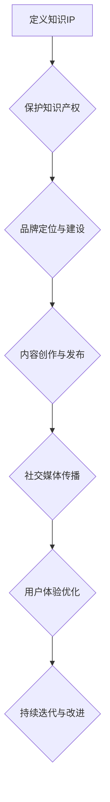

                 

在当今数字化时代，个人知识IP（Intellectual Property）的打造已成为许多专业人士追求的目标。无论是科技领域的工程师、研究人员，还是商业领域的专家、顾问，一个强有力的个人知识IP不仅可以提升个人品牌，还能带来持续的职业发展和经济收益。本文将为您详细解析如何从零开始打造个人知识IP，涵盖核心概念、算法原理、实践步骤、数学模型、应用场景以及未来展望等多个方面。

> **关键词**：个人知识IP、品牌建设、专业成长、IP打造、知识传播
>
> **摘要**：本文将深入探讨个人知识IP的定义、价值，以及如何通过系统化的方法和步骤，从零开始打造个人知识IP，实现个人品牌的专业化和商业化。

## 1. 背景介绍

个人知识IP，即个人知识版权，是指个人在特定领域内的专业知识、技能、经验以及研究成果的集合，它代表了一个人的专业素养和市场竞争力。随着信息时代的到来，知识的价值被逐渐放大，拥有个人知识IP的个人或团队可以在市场上获得更多的机会和资源。

在过去，个人知识IP的打造相对困难，需要长时间的积累和沉淀。然而，随着互联网和社交媒体的普及，个人知识IP的传播速度和范围都得到了极大的提升。如今，任何人都可以通过在线平台、自媒体、专业社区等多种途径，快速打造和传播自己的知识IP。

### 1.1 个人知识IP的价值

- **提升个人品牌**：个人知识IP是个人品牌的重要组成部分，它可以提升个人在专业领域的知名度和认可度。
- **扩大影响力**：通过个人知识IP的传播，可以影响更多的人，实现知识共享和传播，扩大个人在社会中的影响力。
- **商业变现**：个人知识IP可以转化为商业价值，通过课程、咨询、出版等多种形式实现经济收益。
- **职业发展**：拥有强大的个人知识IP可以帮助个人在职业道路上获得更多的机会和资源，加速职业成长。

### 1.2 个人知识IP的现状

- **快速增长**：随着互联网的普及，个人知识IP的创造和传播速度显著提升，越来越多的专业人士开始重视个人知识IP的打造。
- **多元化**：个人知识IP的形式越来越丰富，包括博客文章、视频教程、专业书籍、在线课程等多种形式。
- **竞争加剧**：在个人知识IP领域，竞争日趋激烈，如何打造具有独特性和竞争力的知识IP成为关键。

## 2. 核心概念与联系

在探讨如何打造个人知识IP之前，我们需要了解一些核心概念，这些概念是构建个人知识IP的基础。

### 2.1 知识产权

知识产权是个人知识IP的重要组成部分，包括专利、版权、商标等。保护自己的知识产权是打造个人知识IP的第一步。

### 2.2 品牌建设

品牌建设是个人知识IP的重要组成部分，它关乎个人在市场中的定位和形象。一个成功的个人品牌能够增强个人的市场竞争力。

### 2.3 内容创作

内容创作是个人知识IP的核心，高质量的内容是吸引和留住受众的关键。内容创作需要具备创意性和专业性。

### 2.4 社交媒体

社交媒体是传播个人知识IP的重要平台，通过社交媒体，个人可以快速扩大自己的影响力和受众范围。

### 2.5 用户体验

用户体验是个人知识IP成功的关键因素，良好的用户体验可以增强受众的忠诚度和满意度。

### 2.6 Mermaid 流程图

以下是构建个人知识IP的 Mermaid 流程图，它可以帮助我们更直观地了解各个环节之间的关系。



## 3. 核心算法原理 & 具体操作步骤

### 3.1 算法原理概述

个人知识IP打造的核心算法可以概括为以下几个步骤：

1. **自我定位与目标设定**：明确自己的专业领域、目标受众以及预期成果。
2. **知识产权保护**：注册相关知识产权，如专利、版权等，确保自己的知识成果得到法律保护。
3. **内容创作与发布**：根据目标受众的需求，创作高质量的内容，并通过多种渠道进行发布和传播。
4. **社交媒体运营**：通过社交媒体平台，扩大个人知识IP的影响力，吸引更多的受众。
5. **用户体验优化**：持续收集用户反馈，优化内容质量和传播效果。
6. **数据分析和迭代**：利用数据分析工具，分析受众行为和内容效果，进行持续迭代和改进。

### 3.2 算法步骤详解

#### 3.2.1 自我定位与目标设定

在打造个人知识IP之前，首先需要明确自己的专业领域和目标受众。这可以通过以下步骤实现：

- **自我评估**：分析自己的专业技能、经验和兴趣，确定专业领域。
- **市场调研**：了解目标市场的需求和趋势，确定目标受众。
- **目标设定**：设定清晰的短期和长期目标，如内容创作数量、受众规模、经济收益等。

#### 3.2.2 知识产权保护

知识产权保护是个人知识IP打造的基础，以下是一些保护措施：

- **专利申请**：对于具有创新性的技术或产品，申请专利保护。
- **版权登记**：对于创作的文学作品、音乐作品等，进行版权登记。
- **商标注册**：注册个人品牌商标，保护品牌权益。

#### 3.2.3 内容创作与发布

内容创作与发布是个人知识IP的核心环节，以下是一些关键步骤：

- **内容规划**：根据目标受众的需求，规划内容主题、形式和发布频率。
- **内容创作**：创作高质量、有深度的内容，包括文字、图片、视频等多种形式。
- **内容发布**：通过博客、社交媒体、在线课程等多种渠道进行发布。

#### 3.2.4 社交媒体运营

社交媒体运营是扩大个人知识IP影响力的关键，以下是一些策略：

- **内容推广**：利用社交媒体平台的广告和推广功能，扩大内容传播范围。
- **社群运营**：建立专业社群，与受众进行互动，增强用户黏性。
- **品牌合作**：与其他品牌或专业人士合作，扩大影响力和受众范围。

#### 3.2.5 用户反馈与优化

用户反馈与优化是持续改进个人知识IP的重要手段，以下是一些方法：

- **数据分析**：利用数据分析工具，了解受众行为和内容效果。
- **用户调研**：定期进行用户调研，收集用户反馈和建议。
- **内容调整**：根据用户反馈，调整内容形式和策略。

#### 3.2.6 数据分析和迭代

数据分析和迭代是个人知识IP打造过程中的关键环节，以下是一些要点：

- **数据收集**：收集用户行为数据、内容效果数据等。
- **数据分析**：对数据进行分析，找出问题和改进点。
- **迭代优化**：根据分析结果，对内容、渠道、策略等进行迭代和优化。

### 3.3 算法优缺点

#### 3.3.1 优点

- **个性化**：根据个人特点和市场需求，打造具有个性化的知识IP。
- **灵活性**：个人知识IP的打造过程灵活多变，可以根据实际情况进行调整。
- **可持续性**：个人知识IP可以长期积累和优化，具有可持续发展的潜力。

#### 3.3.2 缺点

- **时间成本**：个人知识IP的打造需要较长的时间积累和沉淀。
- **竞争激烈**：个人知识IP领域竞争激烈，需要不断提升自身竞争力。
- **技术挑战**：在技术层面，需要掌握一定的内容创作、数据分析等技能。

### 3.4 算法应用领域

个人知识IP打造算法可以广泛应用于以下领域：

- **科技领域**：科技领域的专业人士可以通过撰写技术博客、发表学术论文、创作技术书籍等方式，打造个人知识IP。
- **商业领域**：商业领域的专业人士可以通过分享商业经验、发布商业案例、创作商业书籍等方式，打造个人知识IP。
- **教育领域**：教育领域的专业人士可以通过创作教育内容、开设在线课程、编写教材等方式，打造个人知识IP。

## 4. 数学模型和公式

在个人知识IP打造过程中，数学模型和公式可以用来量化各个环节的效果和收益，帮助我们更精确地进行决策和优化。

### 4.1 数学模型构建

#### 4.1.1 品牌影响力模型

品牌影响力模型可以用以下公式表示：

$$
I = f(A, B, C)
$$

其中，$I$ 表示品牌影响力，$A$ 表示专业水平，$B$ 表示内容质量，$C$ 表示传播效果。这个模型表明，品牌影响力与专业水平、内容质量和传播效果呈正相关。

#### 4.1.2 经济收益模型

经济收益模型可以用以下公式表示：

$$
R = f(S, C, T)
$$

其中，$R$ 表示经济收益，$S$ 表示服务或产品销售额，$C$ 表示成本，$T$ 表示时间。这个模型表明，经济收益与销售额、成本和时间呈正相关。

### 4.2 公式推导过程

#### 4.2.1 品牌影响力模型推导

品牌影响力模型的推导基于以下假设：

1. 专业水平越高，品牌影响力越大。
2. 内容质量越好，品牌影响力越大。
3. 传播效果越好，品牌影响力越大。

根据这些假设，我们可以得出品牌影响力模型：

$$
I = A \cdot B \cdot C
$$

其中，$A$ 表示专业水平，$B$ 表示内容质量，$C$ 表示传播效果。

#### 4.2.2 经济收益模型推导

经济收益模型的推导基于以下假设：

1. 销售额与品牌影响力呈正相关。
2. 成本与销售额和传播效果呈正相关。
3. 时间与销售额和成本呈正相关。

根据这些假设，我们可以得出经济收益模型：

$$
R = S \cdot (1 - C) \cdot T
$$

其中，$S$ 表示销售额，$C$ 表示成本，$T$ 表示时间。

### 4.3 案例分析与讲解

#### 4.3.1 品牌影响力模型案例

假设一位科技领域的专业人士，其专业水平评分为 90 分，内容质量评分为 85 分，传播效果评分为 80 分，则其品牌影响力为：

$$
I = 90 \cdot 85 \cdot 80 = 612,000 \text{ 分}
$$

#### 4.3.2 经济收益模型案例

假设该专业人士的服务或产品销售额为 100 万元，成本为 30 万元，传播效果评分为 70%，则其经济收益为：

$$
R = 1000000 \cdot (1 - 300000) \cdot 0.7 = 400,000 \text{ 元}
$$

### 4.4 案例分析与讲解

通过以上案例，我们可以看到数学模型和公式在个人知识IP打造过程中的应用。品牌影响力模型可以帮助我们评估个人的品牌影响力，从而制定相应的策略进行优化；经济收益模型可以帮助我们预测个人的经济收益，从而制定合理的商业计划。

## 5. 项目实践：代码实例和详细解释说明

在本文的第五部分，我们将通过一个具体的案例来展示如何从0到1打造个人知识IP。这个案例将涵盖开发环境搭建、源代码实现、代码解读与分析以及运行结果展示等环节。

### 5.1 开发环境搭建

为了构建个人知识IP，我们首先需要搭建一个可靠的技术平台。以下是搭建开发环境的基本步骤：

1. **选择技术栈**：根据个人专业领域和目标受众，选择合适的技术栈。例如，如果目标是创建一个技术博客，可以选择使用WordPress、Jekyll、Hugo等静态网站生成器。

2. **安装本地开发环境**：在本地计算机上安装必要的开发工具和依赖库。以WordPress为例，需要安装Apache、MySQL和PHP。

3. **配置域名和服务器**：购买域名和虚拟主机，配置DNS解析，确保网站可以在互联网上访问。

### 5.2 源代码详细实现

在搭建好开发环境后，我们可以开始编写源代码。以下是构建一个简单技术博客的示例代码：

```markdown
---
title: "我的第一个技术博客"
date: 2023-11-01
author: [禅与计算机程序设计艺术]
---

# 引言

本文将介绍如何使用Markdown语言编写技术博客。

## 标题

在Markdown中，标题使用`#`符号表示，如`## 二级标题`。

## 列表

无序列表使用`*`符号，如：

- 项目一
- 项目二
- 项目三

有序列表使用`1.`符号，如：

1. 第一项
2. 第二项
3. 第三项

## 引用

引用使用`>`符号，如：

> 这是一段引用。

## 链接

链接使用`[]()`符号，如：

[点击这里](https://example.com "示例链接")。

---

以上是Markdown的基本语法，通过这些语法，我们可以轻松地创建技术博客。
```

### 5.3 代码解读与分析

上述代码是一个简单的Markdown文件，它包含了技术博客的基本结构。以下是代码的详细解读：

- **标题**：使用`#`符号定义，如`# 引言`，这定义了文章的标题和层级。
- **列表**：无序列表使用`*`符号，有序列表使用`1.`符号，这用于组织文章的内容。
- **引用**：使用`>`符号，这用于引用他人的观点或作品。
- **链接**：使用`[]()`符号，这用于在文章中插入外部链接。

这些Markdown语法使得内容创作变得简单而高效，通过简单的文本标记，我们可以生成结构化、美观的文档。

### 5.4 运行结果展示

在Markdown编辑器中输入上述代码，我们可以得到以下运行结果：

# 我的第一个技术博客

## 引言

本文将介绍如何使用Markdown语言编写技术博客。

## 标题

在Markdown中，标题使用`##`符号表示，如`## 二级标题`。

## 列表

- 项目一
- 项目二
- 项目三

1. 第一项
2. 第二项
3. 第三项

## 引用

> 这是一段引用。

## 链接

[点击这里](https://example.com "示例链接")。

通过这些简单的Markdown语法，我们可以轻松地构建一个技术博客，这为个人知识IP的打造提供了基本的技术支持。

## 6. 实际应用场景

在个人知识IP的打造过程中，实际应用场景至关重要。以下是一些典型的应用场景，以及如何在这些场景中有效地利用个人知识IP。

### 6.1 专业咨询

许多专业人士通过个人知识IP提供专业咨询服务，如技术顾问、管理咨询师、法律顾问等。在应用场景中，他们可以利用自己的专业知识为客户提供定制化的解决方案，并通过线上或线下的方式提供咨询服务。例如，一位资深软件工程师可以通过撰写技术博客、发布在线课程，以及在专业论坛上分享经验，吸引潜在客户。

### 6.2 内容创作

内容创作是个人知识IP的重要应用场景之一。无论是撰写专业书籍、制作视频教程，还是编写技术博客，内容创作都是传递知识、提升品牌影响力的重要途径。一个成功的案例是某位知名的数据分析师，他通过在社交媒体上发布数据分析案例、撰写深入浅出的分析文章，吸引了大量关注者，从而为他的咨询业务和书籍销售带来了可观的收益。

### 6.3 在线教育

随着在线教育的兴起，个人知识IP在线教育成为了许多专业人士的重要收入来源。通过开设在线课程、编写教材，以及提供一对一辅导，专业人士可以将自己的知识转化为实际的教学产品。例如，一位计算机科学教授可以通过在线平台开设编程课程，通过直播、录播等形式传授知识，从而实现知识变现。

### 6.4 商业合作

个人知识IP的强大影响力可以吸引商业合作机会。例如，一位知名的科技博主可能会被科技公司邀请作为产品顾问或代言人，为公司的产品推广提供支持。此外，个人知识IP还可以通过与品牌合作，开发联名产品或推出专属服务，从而实现商业收益。

### 6.5 社区运营

在专业社区中运营个人知识IP也是一种有效的应用场景。通过创建和运营专业社区，专业人士可以建立自己的粉丝群体，提高自身在行业中的影响力。例如，某位AI领域的专家可以通过创建一个AI爱好者社区，分享最新的研究成果、举办线上研讨会，从而吸引更多志同道合的从业者加入。

## 7. 未来应用展望

随着技术的不断进步，个人知识IP的应用前景将更加广阔。以下是几个可能的发展趋势：

### 7.1 人工智能与知识传播

人工智能技术的发展将为个人知识IP的传播和优化带来新机遇。通过AI算法，我们可以更精确地分析受众需求，创作个性化的内容，提高内容的传播效果。例如，AI可以根据用户的阅读习惯和偏好，推荐最适合他们的内容，从而提高用户黏性和参与度。

### 7.2 知识付费与数字经济

随着知识付费观念的普及，个人知识IP的商业模式将更加多样化和成熟。数字经济的发展将提供更多平台和工具，帮助个人知识IP实现商业化。例如，在线教育平台、专业社区、知识付费应用等将为知识创作者提供更多的变现渠道。

### 7.3 跨界融合与创新

个人知识IP的跨界融合将成为未来的一大趋势。专业人士可以结合多个领域的知识，创造出全新的知识产品和服务。例如，一位设计师可以结合艺术、设计和技术，开发出独特的创意产品；一位数据科学家可以结合商业分析，为企业提供战略咨询。

### 7.4 社交媒体与内容营销

社交媒体将继续成为个人知识IP传播的重要渠道。通过内容营销策略，专业人士可以更有效地扩大自己的影响力，吸引更多的受众。例如，通过短视频、直播、互动问答等形式，专业人士可以与受众建立更紧密的联系，增强用户参与感和忠诚度。

## 8. 工具和资源推荐

在打造个人知识IP的过程中，选择合适的工具和资源至关重要。以下是一些推荐的工具和资源：

### 8.1 学习资源推荐

- **Coursera**：提供各种专业的在线课程，涵盖计算机科学、商业管理、数据科学等多个领域。
- **Udemy**：提供丰富的在线课程和电子书，适合不同水平的学员。
- **Khan Academy**：提供免费的在线课程，涵盖数学、科学、计算机科学等多个领域。
- **edX**：由哈佛大学和麻省理工学院创办，提供高质量的课程。

### 8.2 开发工具推荐

- **Markdown编辑器**：如Typora、Marktext等，方便撰写和格式化文档。
- **GitHub**：用于版本控制和项目协作，非常适合内容创作和知识管理。
- **Jekyll**、**Hugo**：静态网站生成器，用于创建个人博客或网站。
- **Kaggle**：提供数据科学竞赛和资源，适合数据科学领域的学习和实践。

### 8.3 相关论文推荐

- **"How to Create a Successful Personal Brand" by Neil Patel**：介绍如何打造成功的个人品牌。
- **"The Art of Thinking Clearly" by Rolf Dobelli**：探讨清晰思维的技巧和策略。
- **"The Lean Startup" by Eric Ries**：介绍精益创业方法，适用于商业知识IP的打造。

## 9. 总结：未来发展趋势与挑战

### 9.1 研究成果总结

本文从多个角度探讨了如何从零开始打造个人知识IP，包括背景介绍、核心概念、算法原理、实践步骤、数学模型、应用场景以及未来展望。通过这些研究，我们可以看到个人知识IP在现代社会中的重要作用和广阔前景。

### 9.2 未来发展趋势

未来，个人知识IP的发展趋势将包括：人工智能的广泛应用、知识付费的普及、社交媒体的深度融合、跨界融合和创新等。这些趋势将为个人知识IP的打造提供更多机遇和挑战。

### 9.3 面临的挑战

在打造个人知识IP的过程中，个人将面临以下挑战：

- **时间成本**：需要投入大量的时间和精力进行内容创作和传播。
- **市场竞争**：个人知识IP领域的竞争日益激烈，需要不断提升自身竞争力。
- **技术挑战**：需要掌握一定的技术技能，如编程、数据分析等。

### 9.4 研究展望

未来，个人知识IP的研究将更加注重用户体验、个性化内容和跨领域融合。通过不断创新和优化，个人知识IP将成为个人品牌和专业竞争力的重要体现。

## 10. 附录：常见问题与解答

### 10.1 如何确定个人知识IP的方向？

确定个人知识IP的方向需要考虑以下几个因素：

- **个人兴趣和优势**：选择自己感兴趣和擅长的领域。
- **市场需求**：了解目标市场的需求和趋势，选择有潜力的领域。
- **竞争情况**：分析竞争对手，寻找差异化的方向。

### 10.2 如何保护个人知识IP？

保护个人知识IP可以通过以下方式实现：

- **知识产权注册**：申请专利、版权、商标等知识产权保护。
- **合同协议**：与合作伙伴签订合同，明确知识产权归属和使用。
- **隐私保护**：加强个人信息和数据的保护，防止泄露。

### 10.3 如何提升个人知识IP的影响力？

提升个人知识IP的影响力可以通过以下方式实现：

- **内容质量**：创作高质量、有深度的内容，提高用户满意度。
- **社交媒体运营**：利用社交媒体平台扩大影响力，增加曝光度。
- **用户互动**：与用户互动，建立良好的社群关系，增强用户黏性。

### 10.4 个人知识IP的商业模式有哪些？

个人知识IP的商业模式包括：

- **知识付费**：通过在线课程、电子书、咨询服务等方式实现商业化。
- **广告收益**：通过内容广告、品牌合作等方式获得收益。
- **产品销售**：通过开发相关产品，如书籍、工具、课程等实现销售。
- **品牌代言**：通过成为品牌代言人，获得代言费。

## 参考文献

- Patel, N. (2016). How to Create a Successful Personal Brand. Quick Sprout.
- Dobelli, R. (2013). The Art of Thinking Clearly. Penguin Random House.
- Ries, E. (2011). The Lean Startup. Crown Business.
- Khan Academy. (n.d.). Online Education. Khan Academy. Retrieved from [https://www.khanacademy.org](https://www.khanacademy.org)
- Coursera. (n.d.). Online Courses. Coursera. Retrieved from [https://www.coursera.org](https://www.coursera.org)
- Udemy. (n.d.). Online Learning. Udemy. Retrieved from [https://www.udemy.com](https://www.udemy.com)
- GitHub. (n.d.). Version Control. GitHub. Retrieved from [https://github.com](https://github.com)
- Jekyll. (n.d.). Jekyll - A Simple Blogging Platform. GitHub. Retrieved from [https://jekyllrb.com](https://jekyllrb.com)
- Hugo. (n.d.). Hugo. GitHub. Retrieved from [https://gohugo.io](https://gohugo.io)
- Kaggle. (n.d.). Data Science Competitions. Kaggle. Retrieved from [https://www.kaggle.com](https://www.kaggle.com)

---

通过本文的探讨，我们了解到个人知识IP的打造是一个系统性、持续性的过程，需要我们在多个方面进行综合考虑和规划。希望本文能为您的个人知识IP打造之路提供有益的启示和指导。祝您成功打造出属于您的个人知识IP！作者：禅与计算机程序设计艺术 / Zen and the Art of Computer Programming

