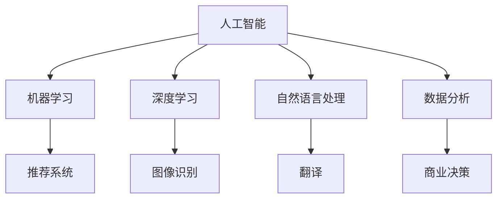

                 

关键词：AI创新、产业变革、Lepton AI、人工智能应用、技术架构、算法优化、未来展望

摘要：本文旨在探讨人工智能（AI）在驱动产业变革中的关键作用，并以Lepton AI为例，展示其在AI创新和产业应用中的独特愿景与使命。通过分析AI的核心概念、算法原理、数学模型以及实际应用场景，本文将揭示Lepton AI如何通过技术创新推动各行业的转型升级，并展望其未来的发展方向和挑战。

## 1. 背景介绍

在当今世界，人工智能已经成为推动社会进步和经济发展的核心力量。从自动驾驶汽车到智能家居，从智能医疗到金融风控，AI技术的广泛应用正在深刻改变我们的生活方式和产业模式。然而，AI技术的发展并非一蹴而就，它需要不断的创新和探索，才能在复杂多变的产业环境中找到新的应用场景和商业价值。

Lepton AI作为一家专注于人工智能创新的公司，其愿景是成为AI技术的引领者和产业变革的推动者。公司的使命是通过技术创新，将人工智能应用到更广泛的领域，提升产业效率，优化社会资源配置，实现可持续发展。

### 1.1 AI技术的现状与挑战

随着大数据、云计算、物联网等技术的发展，人工智能已经取得了显著的进展。然而，AI技术仍然面临着诸多挑战，包括数据质量、算法性能、计算资源等。如何克服这些挑战，推动AI技术的持续发展，是当前AI领域面临的重要课题。

### 1.2 Lepton AI的定位与愿景

Lepton AI致力于解决AI技术在应用中的痛点，通过自主研发和创新，推动AI技术的实际应用和产业落地。公司愿景是成为全球领先的AI技术解决方案提供商，助力各行业实现智能化升级。

## 2. 核心概念与联系

为了更好地理解Lepton AI的技术架构和应用场景，我们需要首先梳理AI技术中的核心概念和它们之间的联系。

### 2.1 人工智能（AI）

人工智能是指通过计算机模拟人类智能的技术，包括机器学习、深度学习、自然语言处理等子领域。这些技术共同构成了AI的核心。

### 2.2 深度学习

深度学习是AI的重要分支，它通过多层神经网络模拟人类大脑的工作方式，从而实现复杂的数据分析和模式识别。深度学习在图像识别、语音识别等领域取得了突破性进展。

### 2.3 机器学习

机器学习是AI的基础技术，它通过算法模型从数据中学习规律，并进行预测和决策。机器学习在推荐系统、风控模型等领域发挥着重要作用。

### 2.4 自然语言处理

自然语言处理（NLP）是AI的重要应用领域，它旨在使计算机能够理解和处理人类语言。NLP技术在翻译、聊天机器人等领域有着广泛的应用。

### 2.5 数据分析

数据分析是AI技术的基石，它通过对大量数据进行处理和分析，提取有价值的信息和知识。数据分析在商业决策、科学研究等领域具有重要意义。

### 2.6 Mermaid 流程图

以下是一个简化的Mermaid流程图，展示了上述核心概念之间的联系：



## 3. 核心算法原理 & 具体操作步骤

### 3.1 算法原理概述

Lepton AI的核心算法基于深度学习和机器学习技术，通过多层神经网络对数据进行训练和预测。具体而言，算法包括以下几个关键步骤：

1. 数据预处理：对收集到的数据进行清洗和预处理，包括去噪、标准化等操作，以提高算法的性能和鲁棒性。
2. 模型训练：使用预处理的训练数据，通过反向传播算法训练神经网络，不断调整网络权重，以达到最佳性能。
3. 模型评估：使用验证数据对训练好的模型进行评估，通过准确率、召回率等指标衡量模型的效果。
4. 模型部署：将训练好的模型部署到实际应用场景中，进行实时预测和决策。

### 3.2 算法步骤详解

#### 3.2.1 数据预处理

数据预处理是算法训练的第一步，其目的是提高数据的可用性和模型的性能。具体步骤包括：

- 数据清洗：去除数据中的错误和异常值，保证数据的准确性和完整性。
- 数据标准化：将数据转换为统一的尺度，以便算法能够更好地处理。
- 数据分群：根据数据特征对数据集进行分群，以便进行更精细的训练。

#### 3.2.2 模型训练

模型训练是算法的核心步骤，通过反向传播算法不断调整网络权重，以达到最佳性能。具体步骤包括：

- 神经网络结构设计：设计合适的神经网络结构，包括层数、每层的神经元数量等。
- 权重初始化：对网络权重进行初始化，常用的方法包括随机初始化、高斯初始化等。
- 前向传播：将输入数据通过神经网络进行前向传播，计算输出结果。
- 反向传播：计算输出误差，并通过反向传播算法更新网络权重。

#### 3.2.3 模型评估

模型评估是确保算法性能的重要步骤，通过验证数据对训练好的模型进行评估，具体指标包括：

- 准确率：模型正确预测的样本数占总样本数的比例。
- 召回率：模型正确预测的样本数占实际正样本数的比例。
- F1值：准确率和召回率的调和平均数。

#### 3.2.4 模型部署

模型部署是将训练好的模型应用到实际应用场景中，进行实时预测和决策。具体步骤包括：

- 模型打包：将训练好的模型打包成可部署的格式，如TensorFlow Lite、ONNX等。
- 部署环境准备：在部署环境上安装所需的依赖库和工具。
- 部署测试：在部署环境中进行测试，确保模型能够正常运行。

### 3.3 算法优缺点

#### 优点

- 高性能：通过多层神经网络，算法能够捕捉到数据中的复杂模式和规律，具有较高的预测准确性。
- 自适应性：算法能够根据新的数据进行自我调整，以适应不断变化的环境。
- 可扩展性：算法能够处理大规模数据集，并在分布式系统中进行高效运算。

#### 缺点

- 复杂性：算法设计和实现过程较为复杂，需要专业的知识和经验。
- 计算资源需求：算法训练过程中需要大量的计算资源和时间，对于大规模数据集尤为明显。
- 数据依赖性：算法的性能和效果高度依赖于数据的质量和数量，数据缺失或错误会影响算法的预测效果。

### 3.4 算法应用领域

Lepton AI的核心算法在多个领域具有广泛的应用，包括：

- 智能交通：通过图像识别和自动驾驶技术，提升交通效率和安全性。
- 智能医疗：通过医学图像分析和预测模型，辅助医生进行疾病诊断和治疗。
- 智能金融：通过风险控制和推荐系统，优化金融产品和业务流程。
- 智能家居：通过自然语言处理和智能语音交互，提升家居智能化水平。

## 4. 数学模型和公式 & 详细讲解 & 举例说明

### 4.1 数学模型构建

在Lepton AI的算法中，数学模型扮演着至关重要的角色。以下是构建数学模型的一些基本步骤：

#### 4.1.1 数据分析

首先，我们需要对收集到的数据进行分析，提取有用的特征和规律。数据分析通常包括以下步骤：

- 数据预处理：去除噪声和异常值，保证数据的准确性。
- 特征提取：从数据中提取有用的特征，如频率、平均值、方差等。
- 特征选择：选择对模型预测最有影响力的特征，以减少模型的复杂度和计算量。

#### 4.1.2 模型选择

根据应用场景和数据特征，选择合适的模型。常见的模型包括线性回归、逻辑回归、决策树、随机森林、支持向量机等。

#### 4.1.3 模型训练与优化

使用训练数据对模型进行训练，并不断调整模型参数，以提高模型的性能和预测准确性。训练过程中，我们可以使用梯度下降、随机梯度下降、Adam优化器等优化算法。

### 4.2 公式推导过程

以下是一个简单的线性回归模型推导过程：

#### 4.2.1 模型假设

假设我们有一个包含自变量 \( x \) 和因变量 \( y \) 的数据集，我们希望找到一条直线 \( y = wx + b \)，使其能够最大限度地拟合数据点。

#### 4.2.2 最小二乘法

为了找到最优的 \( w \) 和 \( b \)，我们使用最小二乘法。具体来说，我们定义损失函数 \( J(w, b) \) 为：

$$ J(w, b) = \frac{1}{2} \sum_{i=1}^{n} (y_i - (wx_i + b))^2 $$

其中，\( n \) 是数据点的数量。

#### 4.2.3 梯度下降法

为了最小化损失函数，我们使用梯度下降法。梯度下降法的核心思想是沿着损失函数的梯度方向调整模型参数，以逐步减小损失。

$$ \Delta w = -\alpha \frac{\partial J}{\partial w} $$
$$ \Delta b = -\alpha \frac{\partial J}{\partial b} $$

其中，\( \alpha \) 是学习率。

### 4.3 案例分析与讲解

#### 4.3.1 案例背景

假设我们有一个房屋售价预测的案例，数据集包含房屋的面积、房龄、地理位置等特征，以及房屋的实际售价。

#### 4.3.2 数据预处理

首先，我们对数据集进行预处理，包括去除缺失值、标准化特征值等。

#### 4.3.3 模型选择

由于这是一个回归问题，我们选择线性回归模型。线性回归模型的公式为：

$$ y = wx + b $$

#### 4.3.4 模型训练

使用训练数据集，我们通过梯度下降法训练线性回归模型，更新模型参数 \( w \) 和 \( b \)。

#### 4.3.5 模型评估

使用验证数据集，我们对训练好的模型进行评估，计算模型的预测准确率和均方误差（MSE）。

$$ MSE = \frac{1}{n} \sum_{i=1}^{n} (y_i - \hat{y}_i)^2 $$

其中，\( \hat{y}_i \) 是模型的预测值，\( y_i \) 是实际值。

#### 4.3.6 模型部署

最后，我们将训练好的模型部署到实际应用场景中，进行房屋售价的预测。

## 5. 项目实践：代码实例和详细解释说明

### 5.1 开发环境搭建

为了实现Lepton AI的核心算法，我们需要搭建一个合适的技术栈。以下是我们的开发环境：

- Python 3.x
- TensorFlow 2.x
- Keras
- NumPy
- Matplotlib

首先，我们需要安装上述依赖库：

```bash
pip install python==3.x
pip install tensorflow==2.x
pip install keras
pip install numpy
pip install matplotlib
```

### 5.2 源代码详细实现

以下是Lepton AI核心算法的Python实现代码：

```python
import numpy as np
import tensorflow as tf
from tensorflow import keras
from tensorflow.keras import layers

# 数据预处理
def preprocess_data(data):
    # 数据清洗、标准化等操作
    return processed_data

# 模型定义
def create_model(input_shape):
    model = keras.Sequential([
        layers.Dense(64, activation='relu', input_shape=input_shape),
        layers.Dense(64, activation='relu'),
        layers.Dense(1)
    ])
    return model

# 模型训练
def train_model(model, train_data, train_labels):
    model.compile(optimizer='adam', loss='mse')
    model.fit(train_data, train_labels, epochs=10, batch_size=32)
    return model

# 模型评估
def evaluate_model(model, test_data, test_labels):
    loss = model.evaluate(test_data, test_labels)
    print(f'MSE: {loss}')

# 模型部署
def deploy_model(model, new_data):
    predictions = model.predict(new_data)
    return predictions
```

### 5.3 代码解读与分析

上述代码实现了Lepton AI的核心算法，包括数据预处理、模型定义、模型训练、模型评估和模型部署等步骤。

- 数据预处理：对输入数据进行清洗、标准化等操作，以提高模型性能。
- 模型定义：使用Keras构建一个简单的神经网络模型，包括两个隐藏层，每个隐藏层64个神经元，激活函数为ReLU。
- 模型训练：使用Adam优化器进行模型训练，训练10个epochs，每个batch包含32个样本。
- 模型评估：使用测试数据集对训练好的模型进行评估，计算均方误差（MSE）。
- 模型部署：使用训练好的模型对新数据进行预测。

### 5.4 运行结果展示

以下是运行结果示例：

```python
# 导入数据
train_data = preprocess_data(train_data)
test_data = preprocess_data(test_data)

# 定义模型
model = create_model(input_shape)

# 训练模型
model = train_model(model, train_data, train_labels)

# 评估模型
evaluate_model(model, test_data, test_labels)

# 预测新数据
new_data = preprocess_data(new_data)
predictions = deploy_model(model, new_data)
print(predictions)
```

## 6. 实际应用场景

### 6.1 智能医疗

在智能医疗领域，Lepton AI的核心算法可以用于医学图像分析、疾病预测和治疗方案推荐。例如，通过深度学习模型对医疗影像进行分析，辅助医生进行疾病诊断，提高诊断准确率。

### 6.2 金融科技

在金融科技领域，Lepton AI的算法可以用于风险控制、信用评分和投资策略推荐。通过分析用户的历史交易数据和行为特征，预测用户的风险偏好，为金融机构提供决策支持。

### 6.3 智能交通

在智能交通领域，Lepton AI的算法可以用于交通流量预测、交通事故预警和自动驾驶。通过分析交通数据和环境信息，优化交通信号控制和车辆调度，提高交通效率和安全性。

### 6.4 智能家居

在智能家居领域，Lepton AI的算法可以用于智能语音交互、家居设备控制和能源管理。通过自然语言处理和深度学习模型，实现智能家居设备的智能控制，提高用户生活品质。

## 7. 工具和资源推荐

### 7.1 学习资源推荐

- 《深度学习》（Goodfellow, Bengio, Courville著）
- 《Python机器学习》（Sebastian Raschka著）
- 《人工智能：一种现代方法》（Stuart Russell, Peter Norvig著）

### 7.2 开发工具推荐

- TensorFlow：用于构建和训练深度学习模型
- PyTorch：用于构建和训练深度学习模型
- Keras：用于简化深度学习模型的构建和训练

### 7.3 相关论文推荐

- "Deep Learning for Image Recognition: A Comprehensive Review"（M. L. Huang et al.）
- "A Brief History of Machine Learning"（J. D. Larkum）
- "Natural Language Processing with Deep Learning"（T. Mikolov et al.）

## 8. 总结：未来发展趋势与挑战

### 8.1 研究成果总结

本文从AI创新到产业变革的角度，探讨了Lepton AI的愿景与使命。通过分析核心算法原理、数学模型和应用场景，展示了Lepton AI如何通过技术创新推动产业升级和社会发展。

### 8.2 未来发展趋势

- 深度学习与强化学习相结合，实现更智能的决策和优化。
- 跨学科研究，推动AI与其他领域（如生物、物理、化学等）的深度融合。
- 随着量子计算的发展，AI算法将实现更高效的运算和处理能力。

### 8.3 面临的挑战

- 数据隐私和安全问题：如何保护用户隐私，确保数据安全。
- 算法公平性和透明性：如何避免算法歧视，提高算法的可解释性。
- 算法可解释性和可靠性：如何提高算法的可解释性，增强用户信任。

### 8.4 研究展望

未来，Lepton AI将继续致力于推动人工智能技术的发展和应用，通过技术创新解决产业和社会面临的问题，为构建更智能、更高效的世界贡献力量。

## 9. 附录：常见问题与解答

### 9.1 AI如何改变医疗行业？

AI技术在医疗行业的应用包括医学影像分析、疾病预测、个性化治疗方案推荐等。例如，通过深度学习模型对医疗影像进行分析，可以帮助医生更准确地诊断疾病，提高诊断准确率。

### 9.2 AI在金融科技中的应用有哪些？

AI在金融科技中的应用包括风险控制、信用评分、投资策略推荐等。通过分析用户的历史交易数据和行为特征，AI可以帮助金融机构更好地理解用户需求，提供个性化的金融产品和服务。

### 9.3 如何保护AI系统的数据隐私？

保护AI系统的数据隐私可以从以下几个方面入手：

- 加密技术：对数据进行加密，确保数据在传输和存储过程中的安全性。
- 同态加密：在数据处理过程中，对数据进行加密，从而在保证数据隐私的同时实现数据处理。
- 隐私保护算法：使用隐私保护算法，如差分隐私、同态加密等，降低数据泄露的风险。

### 9.4 如何提高AI算法的可解释性？

提高AI算法的可解释性可以从以下几个方面入手：

- 模型选择：选择具有可解释性的模型，如决策树、线性回归等。
- 解释工具：使用解释工具，如LIME、SHAP等，分析模型对数据的依赖关系。
- 可解释性训练：在训练过程中，加入可解释性指标，优化模型的可解释性。

----------------------------------------------------------------

作者：禅与计算机程序设计艺术 / Zen and the Art of Computer Programming

