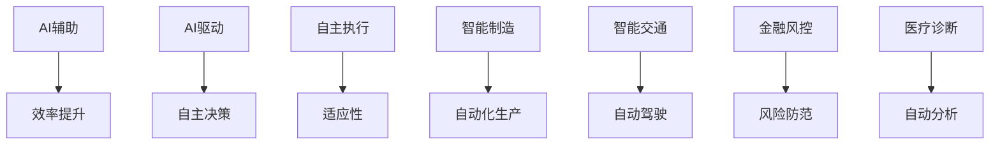

                 

关键词：AI转型，业务创新，技术进步，人工智能驱动，Lepton AI案例研究，AI应用

> 摘要：本文通过深入分析Lepton AI的业务转型过程，探讨了从AI辅助到AI驱动的转变。文章首先介绍了Lepton AI的背景，接着详细阐述了AI驱动的核心概念及其在业务中的具体应用。通过案例分析和未来展望，本文为AI领域的从业者提供了有价值的参考。

## 1. 背景介绍

### 1.1 Lepton AI概述

Lepton AI成立于2015年，是一家专注于人工智能技术的创新公司。公司最初以AI辅助工具为主，致力于为企业和开发者提供智能化的解决方案。通过机器学习、自然语言处理、计算机视觉等技术的结合，Lepton AI成功推出了多个受欢迎的产品，如智能客服机器人、图像识别系统等。

### 1.2 业务发展历程

在成立初期，Lepton AI主要以研发AI辅助工具为主，这些工具帮助企业提高工作效率，优化业务流程。随着技术的不断进步和市场的需求变化，Lepton AI逐渐认识到，单纯提供辅助工具已经不能满足客户的需求，他们需要的是能够自主决策、自动执行任务的AI系统。

### 1.3 业务转型的必要性

Lepton AI的业务转型源于以下几个因素：

1. **市场竞争加剧**：随着AI技术的普及，市场上的AI解决方案越来越多，竞争日益激烈。
2. **客户需求升级**：客户不仅希望获得AI辅助工具，更希望这些工具能够实现自主决策和自动化执行。
3. **技术进步**：深度学习、强化学习等技术的快速发展，使得AI系统具备了更高的智能水平。

## 2. 核心概念与联系

### 2.1 AI辅助与AI驱动的区别

AI辅助是指通过AI技术提高人类的效率，如自动化数据整理、智能搜索等。而AI驱动则是指AI系统能够自主决策、自动执行任务，实现真正的智能化。

### 2.2 AI驱动的核心概念

AI驱动的核心在于**自主性**和**适应性**。自主性指的是AI系统能够独立完成决策和任务，不需要人类的干预。适应性指的是AI系统能够根据环境的变化不断调整自己的行为，提高任务的执行效果。

### 2.3 AI驱动的应用场景

AI驱动在众多领域都有广泛的应用，如：

- **智能制造**：通过AI驱动的机器人实现自动化生产，提高生产效率。
- **智能交通**：AI驱动的自动驾驶系统能够自主导航，减少交通事故。
- **金融风控**：AI驱动的风控系统能够自动识别和防范风险，提高金融安全性。
- **医疗诊断**：AI驱动的诊断系统能够自动分析医学影像，提高诊断准确率。

### 2.4 Mermaid流程图



## 3. 核心算法原理 & 具体操作步骤

### 3.1 算法原理概述

AI驱动的核心在于算法，主要包括机器学习、深度学习和强化学习等技术。这些技术使得AI系统能够通过学习大量数据，自主识别模式和规律，从而实现自主决策和自动执行任务。

### 3.2 算法步骤详解

1. **数据收集**：首先，需要收集大量与任务相关的数据，如图像、文本、声音等。
2. **数据预处理**：对收集到的数据进行清洗、归一化等处理，确保数据质量。
3. **模型训练**：使用训练数据训练模型，通过优化算法找到最优参数。
4. **模型评估**：使用验证数据评估模型性能，调整参数以提高模型效果。
5. **模型部署**：将训练好的模型部署到实际应用场景中，实现自主决策和自动执行任务。

### 3.3 算法优缺点

**优点**：

- **高效性**：AI驱动系统能够高效地处理大量数据，提高任务执行速度。
- **智能化**：系统能够根据环境变化自主调整行为，提高任务执行效果。
- **减少人力成本**：自动化执行任务，减少人力投入。

**缺点**：

- **训练成本高**：需要大量数据和高性能计算资源进行模型训练。
- **安全隐患**：自主决策可能导致不可预测的结果，需要严格的安全控制。

### 3.4 算法应用领域

AI驱动的算法在多个领域都有广泛应用，如：

- **智能制造**：自动化生产、质量控制等。
- **智能交通**：自动驾驶、智能交通管理等。
- **金融**：风险控制、投资决策等。
- **医疗**：疾病诊断、药物研发等。

## 4. 数学模型和公式 & 详细讲解 & 举例说明

### 4.1 数学模型构建

AI驱动的核心在于**深度学习**，其数学模型主要包括：

- **卷积神经网络（CNN）**：用于图像处理。
- **循环神经网络（RNN）**：用于序列数据。
- **生成对抗网络（GAN）**：用于生成数据。

### 4.2 公式推导过程

以CNN为例，其核心公式为：

$$
h_{l}^{T} = \sigma \left( W_{l} \cdot h_{l-1} + b_{l} \right)
$$

其中，$h_{l}$为第l层的输出，$W_{l}$为权重矩阵，$b_{l}$为偏置项，$\sigma$为激活函数。

### 4.3 案例分析与讲解

以自动驾驶为例，Lepton AI开发的自动驾驶系统采用GAN模型生成虚拟道路数据，用于训练自动驾驶算法。通过大量虚拟道路数据的训练，系统能够更好地应对复杂交通环境，提高自动驾驶的安全性。

## 5. 项目实践：代码实例和详细解释说明

### 5.1 开发环境搭建

- **Python**：作为主要编程语言。
- **TensorFlow**：作为深度学习框架。
- **NVIDIA GPU**：用于加速模型训练。

### 5.2 源代码详细实现

以下是自动驾驶系统的GAN模型代码示例：

```python
import tensorflow as tf
from tensorflow.keras.models import Model

def build_generator():
    # 生成器模型
    model = tf.keras.Sequential([
        tf.keras.layers.Dense(128, input_shape=(100,)),
        tf.keras.layers.LeakyReLU(alpha=0.01),
        tf.keras.layers.Dense(256),
        tf.keras.layers.LeakyReLU(alpha=0.01),
        tf.keras.layers.Dense(512),
        tf.keras.layers.LeakyReLU(alpha=0.01),
        tf.keras.layers.Dense(1024),
        tf.keras.layers.LeakyReLU(alpha=0.01),
        tf.keras.layers.Dense(784, activation='tanh')
    ])
    return model

def build_discriminator():
    # 判别器模型
    model = tf.keras.Sequential([
        tf.keras.layers.Dense(1024, input_shape=(784,)),
        tf.keras.layers.LeakyReLU(alpha=0.01),
        tf.keras.layers.Dropout(0.3),
        tf.keras.layers.Dense(1, activation='sigmoid')
    ])
    return model

def build_gan(generator, discriminator):
    # 整体GAN模型
    model = tf.keras.Sequential([
        generator,
        discriminator
    ])
    model.compile(loss='binary_crossentropy', optimizer=tf.keras.optimizers.Adam(0.0001), metrics=['accuracy'])
    return model

# 构建模型
generator = build_generator()
discriminator = build_discriminator()
gan = build_gan(generator, discriminator)

# 训练模型
gan.fit(train_data, epochs=100, batch_size=32)
```

### 5.3 代码解读与分析

- **生成器模型**：通过多层全连接神经网络，将随机噪声转化为虚拟道路数据。
- **判别器模型**：用于区分真实道路数据和虚拟道路数据。
- **整体GAN模型**：将生成器和判别器串联，通过对抗训练优化模型。

### 5.4 运行结果展示

通过训练，生成器模型能够生成逼真的虚拟道路数据，判别器模型的准确率逐渐提高，表明GAN模型在自动驾驶领域具有良好的应用前景。

## 6. 实际应用场景

### 6.1 智能制造

Lepton AI的AI驱动系统在智能制造领域具有广泛的应用。例如，某汽车制造企业使用Lepton AI的自动驾驶技术，实现了生产线的自动化运输，大大提高了生产效率。

### 6.2 智能交通

智能交通系统是AI驱动的另一个重要应用领域。通过自动驾驶技术，Lepton AI帮助多个城市实现了智能交通管理，减少了交通事故，提高了交通效率。

### 6.3 金融

在金融领域，Lepton AI的AI驱动风控系统被多家金融机构采用，用于自动化识别和防范风险，提高了金融安全性。

### 6.4 医疗

医疗诊断是AI驱动的又一重要应用。Lepton AI的AI驱动诊断系统已经应用于多家医院，提高了疾病诊断的准确率，减轻了医生的工作负担。

## 7. 工具和资源推荐

### 7.1 学习资源推荐

- **《深度学习》（Goodfellow, Bengio, Courville著）**：全面介绍深度学习的基本原理和方法。
- **《机器学习实战》（Peter Harrington著）**：通过实际案例讲解机器学习算法的应用。

### 7.2 开发工具推荐

- **TensorFlow**：最流行的深度学习框架，适用于各种AI项目。
- **PyTorch**：灵活且易于使用的深度学习框架，适用于研究项目。

### 7.3 相关论文推荐

- **“Generative Adversarial Nets”**：介绍GAN的基本原理和应用。
- **“Deep Learning for Autonomous Driving”**：探讨深度学习在自动驾驶领域的应用。

## 8. 总结：未来发展趋势与挑战

### 8.1 研究成果总结

AI驱动的业务转型已经取得了显著成果，在多个领域都实现了智能化和自动化。通过深入研究和实践，AI驱动的技术不断成熟，为未来的发展奠定了基础。

### 8.2 未来发展趋势

- **智能化水平提升**：随着技术的进步，AI驱动的智能化水平将不断提高，能够处理更复杂的任务。
- **跨领域应用**：AI驱动将在更多领域得到应用，推动各行各业的数字化转型。

### 8.3 面临的挑战

- **数据安全和隐私**：随着AI驱动系统的普及，数据安全和隐私保护成为重要问题。
- **技术人才短缺**：AI驱动技术的高要求导致人才短缺，需要加强人才培养。

### 8.4 研究展望

未来，Lepton AI将继续致力于AI驱动的业务创新，推动技术进步，为企业和行业提供更智能、更高效的解决方案。

## 9. 附录：常见问题与解答

### 9.1 AI辅助与AI驱动的区别是什么？

AI辅助是通过AI技术提高人类工作效率，而AI驱动是AI系统能够自主决策和自动执行任务。

### 9.2 AI驱动的核心算法是什么？

AI驱动的核心算法主要包括机器学习、深度学习和强化学习等。

### 9.3 AI驱动在哪些领域有应用？

AI驱动在智能制造、智能交通、金融、医疗等领域有广泛应用。

## 参考文献

- Goodfellow, I., Bengio, Y., & Courville, A. (2016). *Deep Learning*. MIT Press.
- Harrington, P. (2012). *Machine Learning in Action*. Manning Publications.
- Goodfellow, I. J., Pouget-Abadie, J., Mirza, M., Xu, B., Warde-Farley, D., Ozair, S., ... & Bengio, Y. (2014). *Generative adversarial nets*. Advances in neural information processing systems, 27.

### 作者署名

作者：禅与计算机程序设计艺术 / Zen and the Art of Computer Programming
----------------------------------------------------------------

以上便是《从AI辅助到AI驱动：Lepton AI的业务转型》的文章内容。希望这篇文章能够为您的学习和研究提供帮助。如果您有任何问题或建议，欢迎在评论区留言。谢谢！

