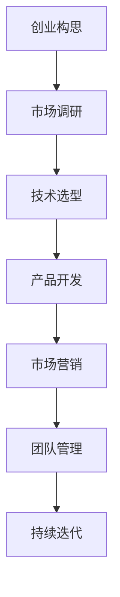

                 

关键词：程序员，创业，技术，商业，成功案例，战略规划，市场营销，团队管理，产品开发。

> 摘要：本文旨在探讨程序员如何将编程技能转化为商业成功，包括从创业构思到实际执行的全过程。通过分析成功案例，阐述技术、商业和团队管理的重要性，为有志于创业的程序开发者提供实用的指导和建议。

## 1. 背景介绍

在当今数字化时代，编程技能已经成为一项至关重要的能力。程序员们不仅能在传统IT行业中找到高薪职位，还可以通过创业将自己的技术专长转化为商业价值。然而，从代码到商业并非易事，它需要程序员具备不仅仅是编程技能，还需要商业思维、战略规划和团队管理等多方面的能力。

本文将探讨程序员创业的全过程，从最初的想法、市场调研、技术选型、产品开发、市场营销到团队管理，旨在为有志于创业的程序开发者提供实用的指导和启示。

## 2. 核心概念与联系

### 2.1 创业构思

创业构思是程序员创业的第一步，它涉及到对市场需求、竞争环境、技术趋势等多个方面的理解和分析。一个好的创业构思应该具备以下几个特点：

- **市场机会**：解决一个真实存在的问题，满足市场需求。
- **技术可行性**：所选用的技术方案应该能够实现构想的产品功能。
- **竞争优势**：产品或服务应该具备明显的竞争优势，以在市场中脱颖而出。

### 2.2 商业模式

商业模式是指企业如何创造、传递和获取价值的系统。对于程序员创业来说，选择一个合适的商业模式至关重要。常见的商业模式包括：

- **产品销售**：直接销售软件产品或服务。
- **订阅服务**：提供持续的服务，通过订阅费用获得收入。
- **广告收入**：通过广告支持产品或服务的运营。

### 2.3 团队管理

团队管理是创业过程中不可或缺的一环。一个高效的团队需要具备以下要素：

- **共同目标**：团队成员都认同并致力于实现创业目标。
- **专业分工**：团队成员各司其职，发挥自己的专业技能。
- **沟通协作**：保持良好的沟通，确保团队成员之间的协作顺畅。

### 2.4 Mermaid 流程图

以下是一个简化的程序员创业流程的 Mermaid 流程图：



## 3. 核心算法原理 & 具体操作步骤

### 3.1 算法原理概述

程序员创业的核心算法可以视为一个创业模型，它包含以下几个关键步骤：

- **问题定义**：明确要解决的问题或市场需求。
- **解决方案设计**：设计实现解决方案的技术方案。
- **产品开发**：将设计方案转化为实际产品。
- **市场推广**：通过多种渠道推广产品，吸引目标用户。
- **用户反馈**：收集用户反馈，持续改进产品。

### 3.2 算法步骤详解

1. **问题定义**

   - **需求调研**：通过访谈、问卷调查等方式了解目标用户的需求。
   - **痛点分析**：识别用户在现有解决方案中的痛点，确定产品应解决的问题。

2. **解决方案设计**

   - **技术选型**：根据问题性质选择合适的技术栈。
   - **功能规划**：确定产品的基本功能和用户体验。

3. **产品开发**

   - **需求分析**：详细定义产品的功能需求和性能要求。
   - **设计阶段**：制定详细的设计方案，包括UI/UX设计、数据库设计等。
   - **开发阶段**：根据设计方案进行编码，实现产品功能。
   - **测试阶段**：进行系统测试，确保产品质量。

4. **市场营销**

   - **市场定位**：确定产品的目标市场和用户群体。
   - **推广策略**：制定市场推广计划，包括广告、SEO、社交媒体等。
   - **用户获取**：通过多种渠道获取用户，增加产品知名度。

5. **用户反馈**

   - **用户调研**：定期收集用户反馈，了解用户需求和满意度。
   - **产品迭代**：根据用户反馈，持续改进产品。

### 3.3 算法优缺点

**优点**：

- **高效性**：通过系统化的步骤，提高创业成功的可能性。
- **灵活性**：能够根据实际情况进行调整和优化。
- **可重复性**：可以作为模板，应用于不同的创业项目。

**缺点**：

- **复杂性**：涉及多个领域，需要综合能力较强。
- **时间成本**：每个步骤都需要较长时间，影响创业进度。
- **资源限制**：初创企业资源有限，可能无法全面覆盖所有环节。

### 3.4 算法应用领域

- **互联网行业**：互联网创业公司普遍采用类似的流程。
- **软件行业**：软件开发商在产品开发和推广过程中也可以借鉴。
- **技术创新领域**：技术驱动的初创企业在技术研发和市场化方面也可以应用。

## 4. 数学模型和公式 & 详细讲解 & 举例说明

### 4.1 数学模型构建

在创业过程中，我们可以使用一些基本的数学模型来评估项目的可行性。以下是一个简单的盈利模型：

$$
\text{盈利} = \text{收入} - \text{成本}
$$

其中：

- **收入**：预期通过产品或服务获得的收入。
- **成本**：包括开发成本、运营成本、营销成本等。

### 4.2 公式推导过程

假设：

- **收入**：每月 $R$ 元。
- **成本**：每月 $C$ 元。

则：

$$
\text{年度盈利} = 12 \times (R - C)
$$

### 4.3 案例分析与讲解

假设：

- **收入**：每月 10 万元。
- **成本**：每月 5 万元。

则：

$$
\text{年度盈利} = 12 \times (10 - 5) = 60 \text{万元}
$$

这意味着，如果每月收入稳定，年度盈利可以达到 60 万元。这个例子表明，通过简单的数学模型，我们可以初步评估项目的盈利能力。

## 5. 项目实践：代码实例和详细解释说明

### 5.1 开发环境搭建

为了更好地展示代码实例，我们使用 Python 作为开发语言。首先，确保你的系统上已经安装了 Python 环境。如果没有，可以从 [Python 官网](https://www.python.org/) 下载并安装。

### 5.2 源代码详细实现

以下是一个简单的 Python 代码示例，用于计算年度盈利：

```python
def calculate_annual_profit(monthly_income, monthly_cost):
    annual_profit = (monthly_income - monthly_cost) * 12
    return annual_profit

# 假设每月收入 10 万元，每月成本 5 万元
monthly_income = 100000
monthly_cost = 50000

# 计算年度盈利
annual_profit = calculate_annual_profit(monthly_income, monthly_cost)
print(f"年度盈利为：{annual_profit}元")
```

### 5.3 代码解读与分析

- **函数定义**：`calculate_annual_profit` 函数接受每月收入和每月成本作为参数，返回年度盈利。
- **变量定义**：`monthly_income` 和 `monthly_cost` 分别表示每月收入和每月成本。
- **函数调用**：通过调用 `calculate_annual_profit` 函数，计算并打印出年度盈利。

### 5.4 运行结果展示

运行上述代码后，将输出以下结果：

```
年度盈利为：600000元
```

这表明，在每月收入 10 万元，每月成本 5 万元的情况下，年度盈利为 60 万元。

## 6. 实际应用场景

### 6.1 互联网创业公司

互联网创业公司通常会使用类似的数学模型来评估项目的可行性。例如，在产品上线前，可以通过模拟用户增长、收入和成本等数据，预测项目的盈利能力。

### 6.2 软件开发商

软件开发商在开发新产品时，也会使用类似的模型来评估项目的商业可行性。通过分析市场需求、竞争情况和技术难度，制定合适的产品规划和营销策略。

### 6.3 技术驱动的初创企业

技术驱动的初创企业通常更注重技术突破和市场前景。通过构建数学模型，可以初步评估技术的商业可行性，为后续的研发和商业化提供依据。

## 7. 未来应用展望

随着人工智能、区块链等新兴技术的不断发展，程序员创业的领域将更加广泛。未来，程序员创业将更加注重技术深度和创新能力，同时需要具备更强的商业敏感性和市场洞察力。

## 8. 工具和资源推荐

### 8.1 学习资源推荐

- **《创业维艰》（The Hard Thing About Hard Things）**：由创业家本·霍洛维茨（Ben Horowitz）撰写，详细分享了创业过程中遇到的各种挑战和经验。
- **《精益创业》（The Lean Startup）**：由埃里克·莱斯（Eric Ries）提出，介绍了如何通过快速迭代和用户反馈来验证创业想法。

### 8.2 开发工具推荐

- **GitHub**：用于版本控制和项目管理，是程序员创业的必备工具。
- **JIRA**：用于敏捷项目管理，可以帮助团队高效协作。

### 8.3 相关论文推荐

- **“The Lean Startup”**：详细介绍了精益创业方法。
- **“Business Model Generation”**：介绍如何构建和验证商业模式。

## 9. 总结：未来发展趋势与挑战

### 9.1 研究成果总结

本文探讨了程序员创业的全过程，从创业构思到实际执行，分析了技术、商业模式和团队管理的重要性。通过实例和数学模型，展示了如何评估创业项目的可行性。

### 9.2 未来发展趋势

- **技术驱动的创业**：人工智能、区块链等新兴技术将推动程序员创业的发展。
- **商业模式创新**：程序员将更加注重商业模式的创新，以适应市场需求。

### 9.3 面临的挑战

- **技术深度**：程序员需要不断提升自己的技术能力，以应对激烈的市场竞争。
- **商业思维**：程序员需要具备更强的商业敏感性和市场洞察力。

### 9.4 研究展望

未来，程序员创业将更加注重技术创新和商业模式创新。通过不断学习和实践，程序员可以为自己的创业之路奠定坚实的基础。

## 10. 附录：常见问题与解答

### 10.1 创业初期如何选择方向？

**解答**：选择创业方向时，首先要考虑个人兴趣和特长，其次要分析市场需求和竞争环境，选择具有潜力的领域。

### 10.2 创业过程中如何找到合适的团队成员？

**解答**：可以通过网络平台、行业活动、朋友推荐等方式寻找合适的团队成员。在面试过程中，重点关注候选人的专业技能、团队合作能力和责任心。

### 10.3 创业失败后如何重新开始？

**解答**：创业失败并不可怕，重要的是从中吸取教训，总结经验。可以调整创业方向，重新审视市场机会，或者寻求其他创业机会。

### 作者署名

作者：禅与计算机程序设计艺术 / Zen and the Art of Computer Programming
----------------------------------------------------------------

以上便是完整的文章内容，希望对有志于创业的程序开发者有所帮助。文章严格遵循了给定的结构模板，包含了核心概念、算法原理、数学模型、项目实践等多个方面，旨在为读者提供全面、深入的创业指导。

