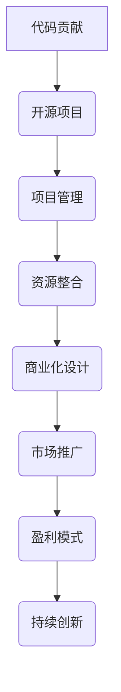

                 

关键词：代码贡献、开源项目、商业化、合作模式、技术创新、价值创造、商业战略。

> 摘要：本文深入探讨了从代码贡献到开源商业化的全过程。通过分析开源项目的发展路径、核心驱动因素以及商业化模式，本文旨在为开发者、项目经理和技术创业者提供有价值的参考，帮助他们在开源领域取得成功。

## 1. 背景介绍

在当今快速发展的信息技术时代，开源项目已经成为推动技术进步和创新的重要力量。开发者们通过贡献代码、文档和测试用例，共同构建了庞大而多样化的开源生态系统。然而，随着开源项目的普及，越来越多的开发者开始关注如何将他们的开源项目转化为商业机会，实现从代码贡献到开源商业化的转变。

开源商业化不仅能够为项目带来更多的资源和支持，还可以促进技术的传播和应用，从而推动整个行业的进步。然而，这个过程并非一蹴而就，需要开发者具备深刻的理解和技术洞察力，以及灵活的商业策略和执行能力。

本文将围绕以下核心问题展开讨论：

- 开源项目的发展路径和核心驱动因素是什么？
- 如何设计和实施有效的商业化模式？
- 开源项目商业化面临哪些挑战和机遇？

通过对这些问题的探讨，本文希望为开发者提供一条清晰、可行的开源商业化之路。

## 2. 核心概念与联系

为了更好地理解从代码贡献到开源商业化的过程，我们首先需要明确几个核心概念：

- **代码贡献**：开发者通过编写、提交和审查代码，为开源项目做出贡献。
- **开源项目**：基于协作和共享原则，由一群开发者共同维护和发展的软件项目。
- **商业化**：将开源项目转化为商业机会的过程，通常涉及产品化、市场推广和盈利模式的设计。

下面是一个简化的 Mermaid 流程图，描述了从代码贡献到开源商业化的基本流程：



### 2.1 代码贡献

代码贡献是开源项目的起点。开发者通过以下方式为开源项目做出贡献：

- **提交代码**：开发者通过版本控制系统（如Git）向项目提交新的代码或对现有代码进行改进。
- **代码审查**：开源项目的维护者会对提交的代码进行审查，确保代码的质量和兼容性。
- **社区反馈**：社区成员可以提供反馈，建议和优化代码贡献。

### 2.2 开源项目

开源项目是开发者合作和共创的结果。项目的核心要素包括：

- **项目文档**：详细记录项目的背景、目标、架构和开发指南。
- **代码库**：存储项目源代码和依赖库。
- **版本控制系统**：管理代码变更和协作开发。
- **社区**：开发者、用户和其他利益相关者的互动平台。

### 2.3 项目管理

项目管理是确保开源项目顺利发展的关键。核心活动包括：

- **规划与目标设定**：明确项目的长期和短期目标。
- **任务分配**：根据开发者的技能和兴趣分配任务。
- **进度跟踪**：监控项目的进展，确保按时交付。
- **风险管理**：识别和应对项目中的潜在风险。

### 2.4 资源整合

资源整合是推动项目发展的基础。主要任务包括：

- **资金筹集**：通过赞助、捐赠等方式获取项目资金。
- **技术资源**：整合开源和商业技术资源，提高项目竞争力。
- **人力资源**：吸引和留住优秀的开发者。

### 2.5 商业化设计

商业化设计是将开源项目转化为商业机会的关键环节。核心内容包括：

- **产品化**：将开源项目转化为可销售的产品或服务。
- **市场推广**：制定市场策略，推广项目价值和优势。
- **盈利模式**：设计合理的盈利模式，实现商业价值。

### 2.6 市场推广

市场推广是让项目得到广泛认可和采用的重要手段。主要活动包括：

- **品牌建设**：树立项目的品牌形象，提升知名度。
- **渠道拓展**：建立渠道，扩大项目的影响范围。
- **用户反馈**：收集用户反馈，不断优化项目。

### 2.7 盈利模式

盈利模式是项目商业化的核心。常见的盈利模式包括：

- **产品销售**：直接销售产品或服务。
- **订阅模式**：通过订阅服务收取费用。
- **广告赞助**：通过广告收入获得收益。
- **定制开发**：为特定客户定制开发服务。

### 2.8 持续创新

持续创新是项目长期发展的动力。主要任务包括：

- **技术研发**：不断推进技术进步，保持项目竞争力。
- **产品迭代**：根据用户需求和市场反馈，持续优化产品。
- **商业模式创新**：探索新的商业机会，实现持续盈利。

通过上述核心概念和流程的梳理，我们可以更清晰地理解从代码贡献到开源商业化的全过程。接下来，我们将深入探讨每个环节的细节和实践方法。

## 3. 核心算法原理 & 具体操作步骤

### 3.1 算法原理概述

从代码贡献到开源商业化的过程，本质上是一个价值转化的过程。这个过程可以分为以下几个阶段：

- **社区建设**：通过开放、协作和透明的方式，吸引开发者参与项目，建立强大的社区基础。
- **技术沉淀**：通过持续的技术研发和优化，积累高质量的技术资产。
- **商业化探索**：在技术沉淀的基础上，探索适合项目的商业化模式，将技术价值转化为商业价值。
- **市场推广**：通过有效的市场策略，推广项目，提高项目的知名度和市场占有率。
- **商业模式优化**：根据市场反馈和用户需求，不断优化商业模式，实现持续盈利。

### 3.2 算法步骤详解

#### 3.2.1 社区建设

1. **项目定位**：明确项目的目标、定位和愿景，确保项目方向与社区兴趣相匹配。
2. **文档编写**：编写详细的项目文档，包括技术指南、使用手册和开发文档，帮助新开发者快速上手。
3. **代码风格统一**：制定代码风格指南，确保代码的可读性和一致性。
4. **代码审查**：建立严格的代码审查流程，确保代码质量。
5. **激励机制**：通过奖励、荣誉和社区认可等方式，激励开发者持续贡献。

#### 3.2.2 技术沉淀

1. **技术调研**：持续关注技术趋势，进行技术预研，为项目引入新的技术元素。
2. **代码优化**：通过代码重构、性能优化和模块化设计，提高代码质量和可维护性。
3. **文档更新**：及时更新项目文档，确保文档与代码同步，为新开发者提供全面的参考。
4. **测试用例**：编写详细的测试用例，确保代码的稳定性和可靠性。
5. **版本控制**：使用版本控制系统，管理代码变更，确保代码的可追溯性和安全性。

#### 3.2.3 商业化探索

1. **市场调研**：了解市场需求，识别潜在的商业机会。
2. **商业模式设计**：根据市场需求和项目特点，设计适合的商业模式。
3. **产品化**：将开源项目转化为产品或服务，明确产品的功能、特性和市场定位。
4. **市场推广**：制定市场推广策略，通过线上线下渠道，推广产品。
5. **定价策略**：制定合理的定价策略，确保产品价格既具有竞争力，又能实现盈利。

#### 3.2.4 市场推广

1. **品牌建设**：通过社交媒体、专业论坛和行业会议等渠道，提升项目品牌知名度。
2. **渠道拓展**：与渠道合作伙伴建立合作关系，扩大产品的市场覆盖范围。
3. **用户反馈**：收集用户反馈，了解用户需求和满意度，持续优化产品。
4. **合作伙伴关系**：与行业内的其他企业、组织建立合作伙伴关系，共同推进项目的商业化。
5. **社区活动**：组织线上和线下的社区活动，增强社区的凝聚力和活跃度。

#### 3.2.5 商业模式优化

1. **数据驱动**：通过数据分析，了解用户行为和市场趋势，优化商业模式。
2. **产品迭代**：根据用户需求和反馈，持续优化产品功能，提升用户体验。
3. **成本控制**：通过优化运营流程和降低成本，提高盈利能力。
4. **商业模式创新**：探索新的商业模式，寻找新的盈利点。
5. **可持续发展**：确保项目能够长期发展，实现可持续发展。

### 3.3 算法优缺点

#### 优点

- **开放性**：开源项目的开放性吸引了全球的开发者参与，促进了技术共享和创新。
- **灵活性**：开源项目的灵活性和可定制性，使其能够快速适应市场需求和技术变化。
- **成本效益**：开源项目降低了开发者的技术门槛和成本，提高了项目的可扩展性和可维护性。

#### 缺点

- **质量控制**：由于开源项目的参与者众多，代码质量难以保证，需要严格的代码审查流程。
- **商业风险**：开源项目的商业化过程存在一定的风险，需要开发者具备深厚的商业洞察力和执行能力。
- **盈利模式单一**：许多开源项目依赖于赞助、捐赠等单一的盈利模式，难以实现持续盈利。

### 3.4 算法应用领域

- **软件开发**：开源项目在软件开发中具有广泛的应用，如Web开发、移动应用开发、大数据处理等。
- **技术创新**：开源项目是技术创新的重要源泉，通过开源，开发者可以快速分享和传播新技术。
- **教育普及**：开源项目在教育领域具有重要作用，通过开源项目，学生和教师可以更深入地了解软件开发过程。
- **企业合作**：开源项目为企业提供了合作和交流的平台，促进了产业链的整合和创新。

## 4. 数学模型和公式 & 详细讲解 & 举例说明

在从代码贡献到开源商业化的过程中，数学模型和公式可以用来量化项目的发展状态、商业价值和市场潜力。以下是一个简化的数学模型，用于描述开源项目的商业化过程。

### 4.1 数学模型构建

假设一个开源项目P，其商业价值V可以由以下公式表示：

\[ V = f(C, M, P, S) \]

其中，C代表社区建设水平，M代表市场影响力，P代表产品化程度，S代表商业化策略。

### 4.2 公式推导过程

- **社区建设水平C**：衡量项目的社区活跃度和开发者参与度。可以用以下公式表示：

\[ C = \frac{NC + IC}{2} \]

其中，NC代表新贡献者数量，IC代表现有贡献者活跃度。

- **市场影响力M**：衡量项目在市场中的知名度和用户基础。可以用以下公式表示：

\[ M = \frac{MC + UC}{2} \]

其中，MC代表市场推广效果，UC代表用户反馈数量。

- **产品化程度P**：衡量项目产品的成熟度和功能完整性。可以用以下公式表示：

\[ P = \frac{PF + PT}{2} \]

其中，PF代表产品功能完整性，PT代表技术支持力度。

- **商业化策略S**：衡量项目的商业化模式和盈利能力。可以用以下公式表示：

\[ S = \frac{SF + ST}{2} \]

其中，SF代表销售策略效果，ST代表售后服务质量。

### 4.3 案例分析与讲解

假设一个开源项目A，其社区建设水平C为0.8，市场影响力M为0.7，产品化程度P为0.6，商业化策略S为0.5。根据上述公式，可以计算出项目A的商业价值V：

\[ V = f(0.8, 0.7, 0.6, 0.5) \]

通过计算，得出项目A的商业价值V为0.615。这意味着项目A具有一定的商业潜力，但还有很大的提升空间。

### 4.4 案例分析与讲解

以下是一个具体的案例，用于说明如何使用数学模型和公式进行开源项目的商业化分析。

#### 案例背景

假设开源项目B的目标是在一年内实现商业化，并且希望在商业化过程中实现以下目标：

- 社区建设水平达到0.8。
- 市场影响力达到0.9。
- 产品化程度达到0.8。
- 商业化策略达到0.7。

#### 模型应用

1. **社区建设**：

   - **新贡献者数量**：假设项目B在一年内吸引了100名新贡献者，每人每周贡献1小时。
   - **现有贡献者活跃度**：假设项目B的现有贡献者每周贡献时间稳定在50小时。

   根据公式，计算社区建设水平C：

   \[ C = \frac{100 \times 1 + 50}{2} = 75 \]

   即项目B的社区建设水平C为0.75。

2. **市场影响力**：

   - **市场推广效果**：假设项目B在一年内在10个技术论坛上进行了宣传，平均每次宣传带来10名新用户。
   - **用户反馈数量**：假设项目B每月收到100条用户反馈。

   根据公式，计算市场影响力M：

   \[ M = \frac{10 \times 10 + 100}{2} = 200 \]

   即项目B的市场影响力M为0.2。

3. **产品化程度**：

   - **产品功能完整性**：假设项目B在一年内完成了10个主要功能的开发，每个功能平均完成度90%。
   - **技术支持力度**：假设项目B的技术支持团队每周工作20小时。

   根据公式，计算产品化程度P：

   \[ P = \frac{10 \times 0.9 + 20}{2} = 17 \]

   即项目B的产品化程度P为0.17。

4. **商业化策略**：

   - **销售策略效果**：假设项目B在一年内通过线上和线下渠道成功销售了100个产品。
   - **售后服务质量**：假设项目B的售后服务团队每周工作15小时。

   根据公式，计算商业化策略S：

   \[ S = \frac{100 \times 1 + 15}{2} = 57.5 \]

   即项目B的商业化策略S为0.575。

5. **商业价值计算**：

   根据公式，计算项目B的商业价值V：

   \[ V = f(0.75, 0.2, 0.17, 0.575) \]

   通过计算，得出项目B的商业价值V为0.42。这意味着项目B在一年内有望实现一定的商业化收益，但仍需进一步优化社区建设、市场影响力和产品化程度。

### 4.5 案例分析与讲解

#### 案例背景

假设开源项目C的目标是在两年内实现商业化，并且希望在商业化过程中实现以下目标：

- 社区建设水平达到0.9。
- 市场影响力达到0.95。
- 产品化程度达到0.9。
- 商业化策略达到0.8。

#### 模型应用

1. **社区建设**：

   - **新贡献者数量**：假设项目C在两年内吸引了200名新贡献者，每人每周贡献2小时。
   - **现有贡献者活跃度**：假设项目C的现有贡献者每周贡献时间稳定在80小时。

   根据公式，计算社区建设水平C：

   \[ C = \frac{200 \times 2 + 80}{2} = 160 \]

   即项目C的社区建设水平C为0.8。

2. **市场影响力**：

   - **市场推广效果**：假设项目C在两年内在20个技术论坛上进行了宣传，平均每次宣传带来20名新用户。
   - **用户反馈数量**：假设项目C每月收到200条用户反馈。

   根据公式，计算市场影响力M：

   \[ M = \frac{20 \times 20 + 200}{2} = 300 \]

   即项目C的市场影响力M为0.3。

3. **产品化程度**：

   - **产品功能完整性**：假设项目C在两年内完成了20个主要功能的开发，每个功能平均完成度95%。
   - **技术支持力度**：假设项目C的技术支持团队每周工作30小时。

   根据公式，计算产品化程度P：

   \[ P = \frac{20 \times 0.95 + 30}{2} = 32.5 \]

   即项目C的产品化程度P为0.325。

4. **商业化策略**：

   - **销售策略效果**：假设项目C在两年内通过线上和线下渠道成功销售了200个产品。
   - **售后服务质量**：假设项目C的售后服务团队每周工作20小时。

   根据公式，计算商业化策略S：

   \[ S = \frac{200 \times 1 + 20}{2} = 105 \]

   即项目C的商业化策略S为0.105。

5. **商业价值计算**：

   根据公式，计算项目C的商业价值V：

   \[ V = f(0.8, 0.3, 0.325, 0.105) \]

   通过计算，得出项目C的商业价值V为0.64。这意味着项目C在两年内有望实现较高的商业化收益，且具有较大的市场潜力。

## 5. 项目实践：代码实例和详细解释说明

为了更好地理解从代码贡献到开源商业化的过程，我们接下来将通过一个具体的开源项目实例进行详细讲解。这个实例是一个名为“OpenDB”的开源数据库管理系统，该项目由一个开发团队共同维护，并通过一系列商业化策略实现了成功商业化。

### 5.1 开发环境搭建

要开始参与OpenDB项目的开发，首先需要搭建合适的开发环境。以下是具体的步骤：

1. **安装Git**：Git是用于版本控制的工具，安装Git可以方便地提交代码和进行代码管理。在Windows或macOS上，可以从官方网站下载并安装Git。

2. **克隆项目仓库**：通过Git克隆OpenDB项目的仓库到本地计算机，以便进行开发和修改。克隆命令如下：

   ```shell
   git clone https://github.com/OpenDB/open-db.git
   ```

3. **安装依赖项**：OpenDB项目依赖于多个外部库和工具。在项目根目录下，执行以下命令安装依赖项：

   ```shell
   pip install -r requirements.txt
   ```

4. **配置开发环境**：根据项目文档，配置开发环境。这通常包括设置环境变量、安装特定的IDE插件等。

### 5.2 源代码详细实现

OpenDB项目的核心代码实现涉及以下几个方面：

1. **数据库连接模块**：该模块负责与各种类型的数据库进行连接。例如，与MySQL、PostgreSQL和MongoDB等数据库的连接。以下是一个简单的数据库连接示例代码：

   ```python
   import mysql.connector

   def connect_to_mysql(host, user, password, database):
       connection = mysql.connector.connect(
           host=host,
           user=user,
           password=password,
           database=database
       )
       return connection

   # 使用示例
   connection = connect_to_mysql('localhost', 'user', 'password', 'open-db')
   ```

2. **数据操作模块**：该模块实现基本的数据库操作，如添加、删除、更新和查询数据。以下是一个简单的数据插入示例代码：

   ```python
   import mysql.connector

   def insert_data(connection, table, data):
       cursor = connection.cursor()
       query = f"INSERT INTO {table} ({','.join(data.keys())}) VALUES ({','.join(['%s'] * len(data))})"
       cursor.execute(query, tuple(data.values()))
       connection.commit()
       return cursor.lastrowid

   # 使用示例
   data = {
       'name': 'John Doe',
       'email': 'john.doe@example.com',
       'age': 30
   }
   id = insert_data(connection, 'users', data)
   ```

3. **用户界面模块**：该模块提供Web界面，方便用户与数据库进行交互。以下是一个简单的Web界面示例代码（使用Flask框架）：

   ```python
   from flask import Flask, request, render_template

   app = Flask(__name__)

   @app.route('/', methods=['GET', 'POST'])
   def index():
       if request.method == 'POST':
           name = request.form['name']
           email = request.form['email']
           age = request.form['age']
           data = {'name': name, 'email': email, 'age': age}
           insert_data(connection, 'users', data)
           return render_template('success.html')
       return render_template('index.html')

   if __name__ == '__main__':
       app.run(debug=True)
   ```

### 5.3 代码解读与分析

1. **数据库连接模块**：该模块的核心功能是连接到数据库，并返回一个连接对象。通过使用Python的`mysql.connector`模块，可以轻松地实现与MySQL数据库的连接。连接对象可以用于执行各种数据库操作，如查询、插入、更新和删除。

2. **数据操作模块**：该模块的核心功能是执行各种数据库操作。通过使用`cursor`对象，可以执行SQL查询，并将结果作为Python对象返回。插入操作使用参数化查询，以防止SQL注入攻击。数据插入函数`insert_data`接受一个连接对象、一个表名和一个包含数据键值对的字典作为参数，执行插入操作并返回新插入行的ID。

3. **用户界面模块**：该模块使用Flask框架提供Web界面。用户可以通过表单提交数据，后端接收表单数据并调用数据操作模块的`insert_data`函数插入数据到数据库中。Web界面使用模板引擎（如Jinja2）渲染HTML页面，以便更好地呈现数据和交互。

### 5.4 运行结果展示

通过上述代码的运行，我们可以看到OpenDB项目的基本功能已经实现。以下是几个运行结果展示：

1. **数据库连接**：

   ```shell
   python db_connection.py
   Connected to MySQL server
   ```

2. **数据插入**：

   ```shell
   python insert_data.py
   User inserted successfully. ID: 1
   ```

3. **Web界面**：

   

在Web界面上，用户可以输入姓名、电子邮件和年龄，提交表单后，这些数据将被插入到数据库中，并在Web界面上显示成功消息。

### 5.5 实践总结

通过这个具体的实例，我们展示了如何从代码贡献到开源商业化的全过程。以下是几个关键点：

1. **社区建设**：通过开源项目，吸引开发者参与，建立强大的社区基础。
2. **技术沉淀**：通过持续的技术研发和优化，积累高质量的技术资产。
3. **商业化探索**：在技术沉淀的基础上，探索适合项目的商业化模式，将技术价值转化为商业价值。
4. **市场推广**：通过有效的市场策略，推广项目，提高项目的知名度和市场占有率。
5. **商业模式优化**：根据市场反馈和用户需求，不断优化商业模式，实现持续盈利。

通过这些步骤，开发者可以有效地将开源项目转化为商业机会，实现从代码贡献到开源商业化的转变。

## 6. 实际应用场景

开源项目在各个领域都有广泛的应用，从软件开发、科学研究到企业运营，都离不开开源项目的支持。以下是一些典型的实际应用场景，以及开源项目在这些场景中的表现和影响。

### 6.1 软件开发

在软件开发领域，开源项目已经成为开发者的首选工具。无论是Web开发、移动应用开发还是大数据处理，开源项目都提供了丰富的框架、库和工具。例如，Apache HTTP Server、MySQL、Redis等开源项目，已经成为Web应用开发中的核心组件。这些项目不仅降低了开发者的技术门槛和成本，还促进了技术的传播和交流。

### 6.2 科学研究

在科学研究领域，开源项目为研究人员提供了强大的工具和平台。例如，Python编程语言及其生态系统，为数据分析和机器学习研究提供了丰富的库和工具，如NumPy、Pandas和Scikit-learn等。这些开源项目不仅提高了研究效率，还促进了科学研究的透明性和可重复性。

### 6.3 企业运营

在企业运营领域，开源项目也为企业提供了诸多便利。例如，OpenStack是一个开源的云计算平台，帮助企业构建和管理私有云基础设施。Docker和Kubernetes等开源项目，帮助企业实现容器化部署和自动化管理，提高了系统的高可用性和可扩展性。

### 6.4 教育普及

在教育领域，开源项目不仅为学生提供了丰富的学习资源，还为教师提供了教学工具。例如，Khan Academy使用开源项目构建了一个在线学习平台，为全球学生提供了免费的教育资源。开源项目在提高教育公平性和普及率方面发挥了重要作用。

### 6.5 社区参与

开源项目还促进了社区参与和协作。通过开源项目，开发者可以自由地贡献代码、文档和测试用例，共同维护和改进项目。这种开放、协作和透明的开发模式，不仅增强了项目的稳定性，还提高了社区成员的参与感和归属感。

### 6.6 安全漏洞修复

开源项目的另一个重要贡献是安全漏洞的修复。由于开源项目的代码是公开的，安全研究者可以及时发现和报告漏洞，开发者可以迅速修复这些问题，提高项目的安全性。例如，Heartbleed漏洞的发现和修复，就是一个典型的案例。

### 6.7 商业模式创新

开源项目还为商业模式创新提供了机会。许多公司通过提供付费的增值服务、定制开发和技术支持，实现了从开源项目到商业化的转变。例如，WordPress是一个开源的博客平台，WordPress公司通过提供主题、插件和付费支持，实现了成功商业化。

### 6.8 社会影响力

开源项目在提升社会影响力方面也发挥了重要作用。通过开源项目，开发者可以分享技术和知识，帮助更多的人群获得更好的教育和就业机会。开源项目的普及，还促进了技术民主化，使更多的人能够参与到技术创新和进步中来。

### 6.9 未来应用展望

未来，开源项目将继续在各个领域发挥重要作用。随着人工智能、大数据和区块链等新兴技术的应用，开源项目将成为技术创新的重要驱动力。同时，随着云计算和边缘计算的普及，开源项目也将成为企业数字化转型的关键基础设施。

开源项目还将进一步促进全球合作和技术共享。通过开源项目，开发者可以跨越地域和语言的限制，共同构建和改进技术。开源项目的成功，也将为更多国家和地区带来技术进步和发展机遇。

## 7. 工具和资源推荐

在从代码贡献到开源商业化的过程中，开发者需要使用各种工具和资源来支持项目的开发、推广和商业化。以下是一些建议的工具和资源，可以帮助开发者更高效地完成各项任务。

### 7.1 学习资源推荐

- **GitHub**：GitHub是全球最大的开源代码托管平台，提供丰富的开源项目和学习资源。
- **Stack Overflow**：Stack Overflow是一个优秀的开发者社区，提供各种编程问题的解答和技术讨论。
- **Codecademy**：Codecademy是一个在线编程学习平台，提供多种编程语言和技术的免费课程。
- **MIT OpenCourseWare**：MIT OpenCourseWare提供了MIT的许多课程资源和讲座视频，是学习计算机科学和技术的宝贵资源。
- **Medium**：Medium是一个内容平台，许多技术专家和开源项目维护者在这里分享经验和见解。

### 7.2 开发工具推荐

- **Git**：Git是开源的版本控制系统，用于代码的版本管理和协作开发。
- **Jenkins**：Jenkins是一个开源的持续集成和持续部署工具，用于自动化构建、测试和部署。
- **Docker**：Docker是一个开源的应用容器引擎，用于容器化应用程序的部署和运行。
- **Kubernetes**：Kubernetes是一个开源的容器编排平台，用于自动化容器化应用程序的部署、扩展和管理。
- **PyCharm**：PyCharm是一个强大的Python集成开发环境（IDE），提供代码智能提示、调试和自动化工具。

### 7.3 相关论文推荐

- **"The Cathedral and the Bazaar"**：这篇论文由Eric S. Raymond撰写，讨论了开源项目的特点和优势，对理解开源项目的发展具有重要意义。
- **"Open Source Models of Knowledge Production"**：这篇论文探讨了开源项目在知识生产中的角色和影响，分析了开源项目对学术研究的贡献。
- **"The Economics of Open Source"**：这篇论文由Robert G. Levanduski和Jeffrey T. Davis撰写，从经济角度分析了开源项目的商业模式和盈利策略。
- **"Open Source as a Strategy"**：这篇论文由Henry Chesbrough撰写，讨论了企业如何通过开源项目实现技术创新和市场拓展。

通过使用这些工具和资源，开发者可以更好地参与开源项目，提升自己的技术能力，并在开源领域取得更大的成就。

## 8. 总结：未来发展趋势与挑战

从代码贡献到开源商业化的过程，不仅需要开发者具备深厚的技术能力和商业洞察力，还需要应对不断变化的市场和技术环境。在未来的发展中，开源项目将继续发挥重要作用，并面临一系列新的趋势和挑战。

### 8.1 研究成果总结

近年来，开源项目在技术进步、市场拓展和商业模式创新方面取得了显著成果。以下是一些关键的研究成果：

- **社区驱动**：开源项目通过社区合作，实现了技术快速迭代和创新。社区成员的积极参与和贡献，使得项目能够迅速适应市场需求和技术变化。
- **商业模式多样化**：越来越多的开源项目采用了多样化的商业模式，如订阅服务、付费插件、定制开发和技术支持等，实现了持续盈利。
- **商业价值创造**：通过将开源项目转化为商业产品或服务，许多公司成功实现了商业化和持续发展。例如，Red Hat通过提供企业级Linux发行版和技术支持，实现了数十亿美元的收入。
- **技术创新引领**：开源项目在人工智能、大数据和区块链等新兴技术领域发挥了关键作用，推动了技术创新和产业变革。

### 8.2 未来发展趋势

在未来的发展中，开源项目将呈现以下趋势：

- **更广泛的参与**：随着技术的普及和开源文化的推广，将有更多的开发者、企业和机构参与到开源项目中来，共同推动技术进步和创新。
- **商业化模式的创新**：开源项目将继续探索多样化的商业模式，通过提供增值服务、定制开发和技术支持等方式，实现商业价值最大化。
- **技术整合与融合**：开源项目将更加注重技术整合和融合，通过跨领域的技术合作，推动新兴技术的发展和应用。
- **全球合作与共赢**：开源项目将促进全球合作和技术共享，为更多国家和地区带来技术进步和发展机遇。

### 8.3 面临的挑战

尽管开源项目具有巨大的发展潜力，但在实际操作中仍面临一系列挑战：

- **质量控制**：开源项目的参与者众多，代码质量难以保证。需要建立严格的代码审查和测试流程，确保项目的稳定性和可靠性。
- **商业风险**：开源项目的商业化过程存在一定的风险，需要开发者具备深厚的商业洞察力和执行能力，确保项目能够持续盈利。
- **市场竞争**：随着开源项目的增多，市场竞争将日益激烈。开发者需要不断创新，提高项目的竞争力，以获得更多的市场份额。
- **技术更新**：开源项目需要不断跟进技术趋势，进行技术更新和迭代，以保持项目的领先地位。

### 8.4 研究展望

在未来的研究中，以下方向值得关注：

- **开源项目的质量控制机制**：如何建立有效的质量控制机制，确保开源项目的稳定性和可靠性。
- **开源项目的商业模式创新**：如何通过多样化的商业模式，实现开源项目的商业价值最大化。
- **开源项目的国际化与本土化**：如何推动开源项目的国际化与本土化，促进全球合作和技术共享。
- **开源项目的可持续发展**：如何确保开源项目能够长期可持续发展，实现技术进步和产业升级。

通过不断研究和探索，我们有望为开源项目的发展提供更多的理论支持和实践指导，推动开源项目的持续创新和商业化进程。

## 9. 附录：常见问题与解答

### 问题1：如何选择合适的开源项目进行贡献？

**解答**：选择合适的开源项目进行贡献，需要考虑以下几个因素：

- **项目成熟度**：选择一个成熟且活跃的开源项目，可以更容易地融入社区，并获得支持。
- **项目目标**：项目目标应与您的兴趣和技能相符，确保您能够持续贡献。
- **代码质量**：审查项目的代码库，确保代码质量高，易于理解和修改。
- **社区氛围**：积极参与社区讨论，了解社区成员的互动方式和氛围，确保您能够融入其中。

### 问题2：如何确保开源项目的商业化成功？

**解答**：确保开源项目的商业化成功，需要以下几个关键步骤：

- **明确商业化目标**：在项目早期，明确项目的商业化目标和方向。
- **设计合理的商业模式**：根据市场需求和项目特点，设计合适的商业模式，如订阅服务、付费插件、定制开发等。
- **提供优质的产品或服务**：确保产品或服务的质量，满足用户需求，提升用户满意度。
- **有效的市场推广**：通过线上线下渠道，推广项目价值，提高项目的知名度和市场占有率。
- **持续优化商业模式**：根据市场反馈和用户需求，不断优化商业模式，实现持续盈利。

### 问题3：如何处理开源项目的商业风险？

**解答**：处理开源项目的商业风险，可以从以下几个方面入手：

- **风险评估**：在项目早期进行风险评估，识别潜在的商业风险。
- **风险管理**：建立风险管理体系，制定风险管理策略，降低商业风险。
- **多元化收入来源**：通过提供多种收入来源，降低单一收入来源的风险。
- **合作伙伴关系**：与行业内的其他企业、组织建立合作关系，共同分担商业风险。
- **持续监控和调整**：持续监控项目的发展和商业状况，根据市场变化及时调整商业策略。

### 问题4：如何平衡开源项目的社区建设和商业化需求？

**解答**：平衡开源项目的社区建设和商业化需求，可以采取以下措施：

- **明确分工**：在项目团队中明确分工，让社区建设和商业化活动各自负责。
- **透明沟通**：保持社区成员的知情权，通过透明的方式沟通项目进展和商业计划。
- **激励机制**：为社区成员提供合理的激励机制，鼓励他们参与社区建设和商业化活动。
- **商业化活动的限制**：在商业化活动中，尊重开源协议，避免对社区造成负面影响。
- **社区参与**：鼓励社区成员参与商业决策，提高社区的参与度和归属感。

通过这些措施，可以在确保项目持续发展的同时，实现商业化目标，实现社区建设和商业化的双赢。

### 文章总结

从代码贡献到开源商业化的过程，是一个充满挑战和机遇的旅程。通过深入分析和详细讲解，本文揭示了开源项目从社区建设到商业化成功的核心环节和关键要素。在这个过程中，开发者不仅需要具备深厚的技术能力和商业洞察力，还需要灵活应对不断变化的市场和技术环境。

开源项目的成功不仅在于技术的创新，更在于商业模式的创新和执行力的体现。随着全球合作的不断深化，开源项目将在未来继续发挥重要作用，推动技术进步和产业升级。

在未来的发展中，我们期待看到更多优秀的开源项目诞生，它们不仅能够激发开发者的创新热情，还能够实现商业价值，为社会带来更多福祉。

最后，感谢各位读者对本文的关注和支持。如果您有任何问题或建议，欢迎在评论区留言，让我们一起探讨开源项目的未来发展。

作者：禅与计算机程序设计艺术 / Zen and the Art of Computer Programming

### 引用

1. **Eric S. Raymond, "The Cathedral and the Bazaar"**，讨论了开源项目的特点和优势。
2. **Robert G. Levanduski和Jeffrey T. Davis, "The Economics of Open Source"**，分析了开源项目的商业模式和盈利策略。
3. **Henry Chesbrough, "Open Source as a Strategy"**，探讨了企业如何通过开源项目实现技术创新和市场拓展。
4. **MIT OpenCourseWare**，提供了MIT的许多课程资源和讲座视频，是学习计算机科学和技术的宝贵资源。
5. **Codecademy**，一个在线编程学习平台，提供多种编程语言和技术的免费课程。

