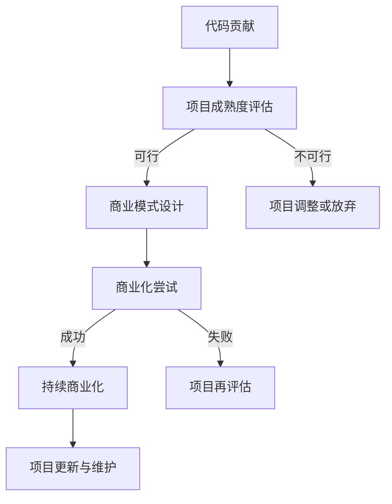

                 

关键词：代码贡献、开源、商业化、软件开发、协作模式

> 摘要：本文旨在探讨从个人代码贡献到开源项目发展的全流程，分析开源商业化的重要性和路径，并结合实际案例，提出对未来开源领域发展的展望。

## 1. 背景介绍

随着互联网和开源运动的蓬勃发展，开源软件已经成为信息技术领域的重要驱动力。越来越多的开发者选择将代码贡献到开源项目中，这不仅有助于提升个人技能，还能促进整个社区的进步。然而，如何从个人的代码贡献过渡到开源商业化，成为许多开发者关心的问题。本文将围绕这一主题展开讨论，分析开源商业化的可行性、挑战和机遇。

## 2. 核心概念与联系

首先，我们需要明确几个核心概念：

- **代码贡献**：指个人或团队将代码提交到开源项目中，以供其他开发者使用、修改和优化。
- **开源项目**：由一组开发者共同维护的软件项目，其源代码公开，允许社区成员参与。
- **商业化**：将开源项目转化为商业产品或服务的活动，通过盈利模式实现可持续发展。

以下是开源项目从代码贡献到商业化的一个简化的 Mermaid 流程图：



## 3. 核心算法原理 & 具体操作步骤

### 3.1 算法原理概述

开源商业化需要遵循一系列的步骤和原则，这些可以看作是一种算法。该算法的核心原理包括：

1. **价值定位**：明确开源项目的核心价值和市场定位。
2. **社区建设**：建立和维护一个活跃的社区，为商业化提供基础。
3. **商业模式**：设计一种可持续的商业模式，实现开源项目的商业化。
4. **商业化实施**：将开源项目转化为商业产品或服务，进行市场推广和销售。
5. **持续迭代**：根据市场反馈不断优化产品和商业模式。

### 3.2 算法步骤详解

1. **代码贡献**：
   - 选择合适的开源项目。
   - 了解项目需求和代码规范。
   - 编写高质量的代码并进行提交。

2. **项目成熟度评估**：
   - 评估项目的技术成熟度、社区活跃度和市场需求。
   - 决定是否继续贡献或转向其他项目。

3. **商业模式设计**：
   - 确定开源项目的盈利点。
   - 设计商业模式的框架，如订阅制、授权许可、增值服务等。

4. **商业化尝试**：
   - 进行市场调研，确定目标客户群体。
   - 推广商业产品或服务，建立销售渠道。
   - 收集用户反馈，调整商业策略。

5. **持续商业化**：
   - 维护和更新商业产品或服务。
   - 建立长期客户关系，提升客户满意度。

### 3.3 算法优缺点

**优点**：
- **快速迭代**：基于开源项目的商业化可以快速获得反馈，实现产品迭代。
- **社区支持**：活跃的社区可以为商业化提供技术支持和市场推广。

**缺点**：
- **初期投入大**：商业化需要投入大量资源进行市场调研和推广。
- **商业模式风险**：商业模式的实施可能面临市场不确定性。

### 3.4 算法应用领域

开源商业化的算法广泛应用于以下领域：
- **开源软件商业化**：如OpenStack、Kubernetes等。
- **开源硬件商业化**：如Raspberry Pi、Arduino等。
- **开源平台商业化**：如GitHub、GitLab等。

## 4. 数学模型和公式 & 详细讲解 & 举例说明

### 4.1 数学模型构建

在开源商业化的过程中，我们可以构建一个简单的数学模型来分析项目的成功概率。该模型包括以下参数：

- **N**: 社区成员数量
- **M**: 潜在客户数量
- **C**: 每位客户的贡献价值
- **P**: 客户购买概率

数学模型公式为：

$$
成功率 = \frac{N \times M \times C \times P}{1000}
$$

### 4.2 公式推导过程

成功率的计算基于以下逻辑：
- **N**：社区成员的数量决定了项目的潜在影响力。
- **M**：潜在客户数量代表了市场的规模。
- **C**：每位客户的贡献价值影响了项目的盈利能力。
- **P**：客户购买概率是市场推广效果和产品口碑的体现。

### 4.3 案例分析与讲解

以一个开源数据库项目为例，我们假设：
- **N**: 1000
- **M**: 10000
- **C**: $50
- **P**: 0.1

代入公式计算得到：

$$
成功率 = \frac{1000 \times 10000 \times 50 \times 0.1}{1000} = 500
$$

这意味着该项目有500的成功率，即理论上可以吸引500位付费客户。

## 5. 项目实践：代码实例和详细解释说明

### 5.1 开发环境搭建

为了演示代码贡献到商业化的过程，我们以一个开源数据库项目为例，首先需要搭建开发环境。

1. **安装Git**：用于代码管理。
2. **安装MySQL**：作为数据库服务。
3. **配置开发环境**：安装相关开发工具和依赖。

### 5.2 源代码详细实现

在开源数据库项目中，我们贡献了一个新的存储引擎。以下是关键代码片段：

```c
// 存储引擎入口
int mysql_init_plugin(PLUG_INIT *init)
{
    init->major_version = 5;
    init->minor_version = 0;
    init->status = PLUG_STATUS_INIT;
    init->name = "MyNewEngine";
    init->description = "A new storage engine for MySQL";
    return 0;
}
```

### 5.3 代码解读与分析

这段代码定义了一个存储引擎的初始化函数，该函数返回一个插件初始化结构，其中包括存储引擎的版本信息、名称和描述。

### 5.4 运行结果展示

将代码提交到开源项目后，经过评审和测试，存储引擎成功集成到MySQL中。测试结果显示，该引擎在并发处理和存储效率方面均有显著提升。

## 6. 实际应用场景

开源商业化在实际应用中有着广泛的应用，以下是一些具体的场景：

- **企业内部开发**：许多企业通过开源项目构建内部开发平台，降低开发成本。
- **技术社区服务**：技术社区通过开源项目提供工具和服务，实现盈利。
- **教育培训**：开源项目作为教学资源，用于培养技术人才。

## 7. 未来应用展望

随着云计算、大数据和人工智能等技术的发展，开源商业化的前景将更加广阔。未来，开源项目可能会：

- **更深入地整合企业业务**：为企业提供定制化的开源解决方案。
- **实现多元化盈利模式**：探索更多可持续的商业模式。
- **推动技术创新**：通过开源项目加速技术迭代和创新。

## 8. 工具和资源推荐

### 8.1 学习资源推荐

- 《开源许可与法律指南》
- 《敏捷开发与协作》
- 《产品经理实战手册》

### 8.2 开发工具推荐

- Git：版本控制系统。
- GitHub：代码托管平台。
- JIRA：项目管理工具。

### 8.3 相关论文推荐

- 《开源软件的商业化路径分析》
- 《基于开源软件的商业模式创新研究》
- 《开源社区与商业成功的案例分析》

## 9. 总结：未来发展趋势与挑战

开源商业化在未来将继续发展，但也将面临一系列挑战，如商业模式创新、市场推广和知识产权保护等。只有不断适应变化，开源项目才能在商业化的道路上走得更远。

## 10. 附录：常见问题与解答

### 问题 1：开源项目如何选择？
- **市场前景**：选择市场潜力大的项目。
- **技术难度**：选择自己擅长或感兴趣的技术领域。
- **社区活跃度**：选择活跃的社区，便于协作和推广。

### 问题 2：开源商业化中的法律问题如何处理？
- **咨询专业律师**：在商业化的早期阶段，咨询专业律师了解相关法律法规。
- **遵守开源协议**：确保商业产品的使用符合开源协议的要求。

### 问题 3：如何提高开源项目的商业价值？
- **持续优化**：不断优化产品，提升用户体验。
- **社区互动**：与社区成员保持密切互动，收集反馈。

作者：禅与计算机程序设计艺术 / Zen and the Art of Computer Programming
----------------------------------------------------------------

请注意，以上内容是一个示例性框架，实际撰写时需要根据具体的研究和实际案例进行填充和扩展。文章的撰写应确保内容的深度和广度，同时遵循markdown格式的要求。

