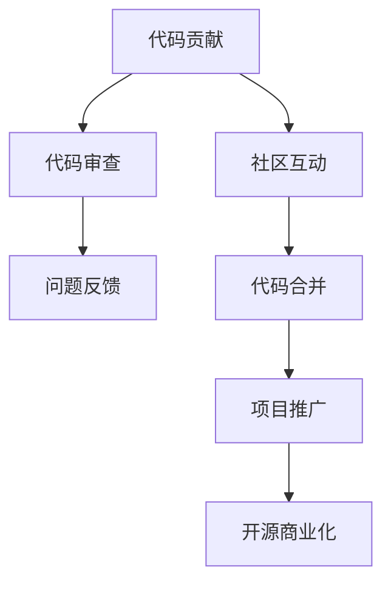

                 

关键词：开源贡献、开源商业化、代码质量、项目推广、商业盈利模式、社区互动

> 摘要：本文从代码贡献的角度出发，探讨了如何将个人或团队开发的代码转化为商业价值，分析了开源商业化的路径、策略和实践。通过剖析成功案例，总结了提升代码质量和项目推广的方法，以及构建可持续盈利模式的经验。

## 1. 背景介绍

随着互联网的飞速发展，开源软件已经成为现代软件开发的重要模式。开源社区为开发者提供了一个自由交流、共同进步的平台，极大地促进了技术的创新和传播。然而，开源项目往往面临着资金短缺、市场推广困难等问题。如何将开源项目转化为商业价值，实现开源的商业化，成为了许多开发者关注的焦点。

开源商业化并不仅仅是指将开源项目打包出售，而是通过提供增值服务、技术支持等方式，为项目注入资金，推动其可持续发展。本文将探讨从代码贡献到开源商业化的全过程，包括代码贡献的意义、开源商业化的路径、项目推广的策略、以及如何构建可持续的盈利模式。

## 2. 核心概念与联系

### 2.1 开源贡献的概念

开源贡献是指开发者将代码、文档、测试用例等贡献给开源项目，使得项目能够不断完善和进步。开源贡献不仅能够提升开发者的技术水平，还可以增强社区影响力，获得更多职业机会。

### 2.2 开源商业化的概念

开源商业化是指通过提供增值服务、技术支持、定制开发等方式，将开源项目转化为商业价值的过程。开源商业化有助于解决开源项目的资金问题，推动项目可持续发展。

### 2.3 代码质量与项目推广的关系

代码质量是开源项目的基石，高质量的代码能够提高项目的可靠性和用户体验，吸引更多的用户和开发者参与。项目推广是开源商业化的重要环节，有效的推广策略能够提升项目的知名度和用户基础，为商业化打下基础。

### 2.4 Mermaid 流程图



## 3. 核心算法原理 & 具体操作步骤

### 3.1 算法原理概述

开源商业化的核心在于找到合适的盈利模式，将开源项目的价值转化为商业收益。以下是几种常见的开源商业化模式：

1. **增值服务**：提供额外的付费服务，如专业支持、定制开发、培训等。
2. **订阅模式**：用户通过订阅项目获取持续更新的功能和技术支持。
3. **赞助模式**：通过用户或企业的捐赠来支持项目的开发和维护。
4. **广告与市场推广**：在开源项目中嵌入广告或进行市场推广活动，获取收益。

### 3.2 算法步骤详解

1. **定位项目价值**：确定项目的核心功能和应用场景，明确项目所能提供的独特价值。
2. **评估市场需求**：通过市场调研和分析，了解目标用户群体的需求，为后续的商业模式设计提供依据。
3. **选择盈利模式**：根据项目特点和市场需求，选择合适的开源商业化模式。
4. **实施商业化策略**：制定具体的商业化计划，包括增值服务的提供、订阅模式的实施、赞助活动的组织等。
5. **持续优化与推广**：根据市场反馈不断优化商业模式和项目功能，通过有效的推广策略提升项目知名度和用户基础。

### 3.3 算法优缺点

**优点**：

1. **降低研发成本**：开源项目可以利用社区的力量，降低项目的研发成本。
2. **提升项目质量**：通过社区互动和代码审查，提高项目的代码质量。
3. **扩大用户基础**：开源项目能够吸引更多的用户和开发者，增加项目的社区影响力。

**缺点**：

1. **资金压力**：开源项目往往面临资金短缺的问题，难以保证项目的可持续发展。
2. **市场推广困难**：开源项目在商业化推广方面可能面临一定的挑战。
3. **知识产权保护**：开源项目可能涉及知识产权保护的问题，需要妥善处理。

### 3.4 算法应用领域

开源商业化适用于各种类型的开源项目，尤其是那些具有广泛应用场景和强大社区基础的项目。以下是一些典型的应用领域：

1. **软件开发**：如开源框架、工具、库等。
2. **数据科学**：如开源数据分析工具、机器学习框架等。
3. **云计算**：如开源云平台、容器技术等。
4. **物联网**：如开源物联网平台、传感器数据处理工具等。

## 4. 数学模型和公式 & 详细讲解 & 举例说明

### 4.1 数学模型构建

开源商业化的数学模型可以描述为：

\[ R = p \times u \times s \]

其中，\( R \) 表示商业收益，\( p \) 表示增值服务的价格，\( u \) 表示用户数量，\( s \) 表示订阅率。

### 4.2 公式推导过程

商业收益 \( R \) 是增值服务价格 \( p \)、用户数量 \( u \) 和订阅率 \( s \) 的乘积。增值服务的价格 \( p \) 通常由市场调研和竞争分析确定。用户数量 \( u \) 可以通过市场推广和社区互动获取。订阅率 \( s \) 取决于项目的价值和用户的满意度。

### 4.3 案例分析与讲解

以一个开源数据库项目为例，该项目的增值服务包括：

- 专业支持：每月100美元
- 定制开发：根据需求报价
- 培训：每周1000美元

通过市场调研，项目团队估计每月有1000个潜在用户，其中50%的用户可能需要专业支持，20%的用户可能需要定制开发，10%的用户可能需要培训服务。

根据上述数据，我们可以计算出项目的潜在商业收益：

\[ R = (100 + x + 1000) \times 1000 \times (0.5 + 0.2 + 0.1) \]

其中，\( x \) 为定制开发服务收入。通过调整定制开发服务的价格和推广策略，可以最大化项目的商业收益。

## 5. 项目实践：代码实例和详细解释说明

### 5.1 开发环境搭建

为了实践开源商业化，我们首先需要搭建一个开源项目。以下是搭建一个简单的开源项目的基本步骤：

1. **选择编程语言和框架**：根据项目需求选择合适的编程语言和框架。
2. **创建代码仓库**：在GitHub或其他开源平台上创建代码仓库，用于存储和管理项目代码。
3. **编写文档**：编写项目文档，包括项目介绍、安装指南、使用说明等。
4. **进行代码审查**：邀请其他开发者参与代码审查，确保代码质量。
5. **发布项目**：将项目代码和文档发布到开源平台，吸引社区关注。

### 5.2 源代码详细实现

以下是一个简单的Python脚本示例，用于实现一个简单的计算器功能：

```python
def add(a, b):
    return a + b

def subtract(a, b):
    return a - b

def multiply(a, b):
    return a * b

def divide(a, b):
    if b != 0:
        return a / b
    else:
        return "Error: Division by zero"

# 主程序
if __name__ == "__main__":
    print("Welcome to the Simple Calculator!")
    a = float(input("Enter first number: "))
    b = float(input("Enter second number: "))
    operation = input("Enter operation (+, -, *, /): ")

    if operation == "+":
        print("Result: ", add(a, b))
    elif operation == "-":
        print("Result: ", subtract(a, b))
    elif operation == "*":
        print("Result: ", multiply(a, b))
    elif operation == "/":
        print("Result: ", divide(a, b))
    else:
        print("Invalid operation!")
```

### 5.3 代码解读与分析

上述代码实现了一个简单的计算器功能，包括加、减、乘、除四种基本运算。代码结构清晰，易于理解和扩展。通过输入用户输入的数值和运算符，程序能够自动计算并输出结果。此外，代码还包含了一个错误处理机制，用于处理除数为零的情况。

### 5.4 运行结果展示

以下是在Python环境中运行上述代码的示例输出：

```
Welcome to the Simple Calculator!
Enter first number: 10
Enter second number: 5
Enter operation (+, -, *, /): /
Result: 2.0
```

## 6. 实际应用场景

开源商业化在许多领域都有着广泛的应用。以下是一些实际应用场景的例子：

1. **软件开发**：许多开源框架和工具都通过提供增值服务实现了商业化。例如，Python Web框架Django通过提供专业支持和定制开发服务，实现了盈利。
2. **数据科学**：开源数据分析工具和机器学习框架，如Scikit-learn和TensorFlow，通过提供付费课程和技术支持，实现了商业价值。
3. **云计算**：开源云平台和容器技术，如OpenStack和Kubernetes，通过提供增值服务和定制开发，为企业提供了强大的云计算解决方案。
4. **物联网**：开源物联网平台和传感器数据处理工具，如MQTT和Node-RED，通过提供专业支持和定制开发，为企业提供了创新的物联网解决方案。

## 7. 未来应用展望

随着开源软件的不断普及和技术的发展，开源商业化将面临更多的机遇和挑战。以下是一些未来应用展望：

1. **市场细分**：随着技术的进步，开源商业化将更加注重市场细分，为不同用户群体提供定制化的解决方案。
2. **社区生态**：建立强大的社区生态，促进开发者、用户和企业的互动，为开源项目注入持续的动力。
3. **增值服务多样化**：提供多样化的增值服务，如付费课程、技术支持、定制开发等，满足不同用户的需求。
4. **技术创新**：紧跟技术发展趋势，不断推出创新的开源项目，扩大项目的市场影响力。

## 8. 工具和资源推荐

### 8.1 学习资源推荐

- 《开源项目管理》
- 《商业模式新生代》
- 《创业维艰》

### 8.2 开发工具推荐

- GitHub：开源代码托管平台
- GitLab：开源项目管理工具
- Jira：敏捷项目管理工具

### 8.3 相关论文推荐

- "The Economics of Open Source Software Development"
- "From Open Source to Open Innovation: Realizing the Potential of Community Innovation"
- "The Business Value of Open Source Software"

## 9. 总结：未来发展趋势与挑战

### 9.1 研究成果总结

开源商业化的研究和实践表明，通过提供增值服务、订阅模式、赞助模式等，开源项目可以实现商业化。同时，开源项目在技术、市场、社区等方面具有较高的竞争力。

### 9.2 未来发展趋势

未来，开源商业化将更加注重市场细分、社区生态建设、增值服务多样化等方面。随着技术的不断进步，开源项目将迎来更多的商业机会。

### 9.3 面临的挑战

开源商业化面临的主要挑战包括资金压力、市场推广困难、知识产权保护等。此外，开源项目还需要不断提升自身的技术实力和社区影响力。

### 9.4 研究展望

未来，开源商业化研究应关注以下几个方面：1）探索更加有效的商业模式；2）提高开源项目的商业运作能力；3）加强开源社区的建设和管理。

## 9. 附录：常见问题与解答

### 9.1 如何评估开源项目的商业化潜力？

评估开源项目的商业化潜力可以从以下几个方面入手：

- **项目质量**：项目的代码质量、文档完备性、社区活跃度等。
- **市场需求**：项目所解决的问题、目标用户群体的需求、市场趋势等。
- **竞争分析**：同类项目的商业化情况、市场占有率、用户基础等。

### 9.2 开源商业化的资金压力如何解决？

解决开源商业化的资金压力可以通过以下几种方式：

- **增值服务**：提供付费增值服务，如专业支持、定制开发、培训等。
- **赞助模式**：通过用户或企业的捐赠来支持项目的开发和维护。
- **外部投资**：寻求风险投资或天使投资，为项目注入资金。

### 9.3 开源项目如何进行市场推广？

开源项目进行市场推广可以从以下几个方面入手：

- **社交媒体**：利用Twitter、LinkedIn、Facebook等社交媒体平台进行宣传。
- **技术社区**：在技术社区如GitHub、Stack Overflow、Reddit等发布项目动态。
- **线下活动**：参加技术会议、研讨会、黑客松等活动，展示项目成果。
- **合作伙伴**：与同类项目或企业建立合作伙伴关系，共同推广。

### 9.4 开源项目的知识产权如何保护？

开源项目的知识产权保护可以从以下几个方面入手：

- **开源协议**：选择合适的开源协议，明确项目的知识产权归属。
- **代码审查**：确保项目代码不存在侵权行为。
- **知识产权登记**：对项目的知识产权进行登记，如专利、商标等。
- **法律咨询**：寻求专业法律咨询，确保项目的知识产权得到充分保护。

