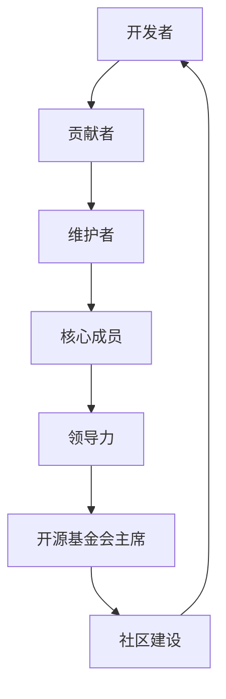
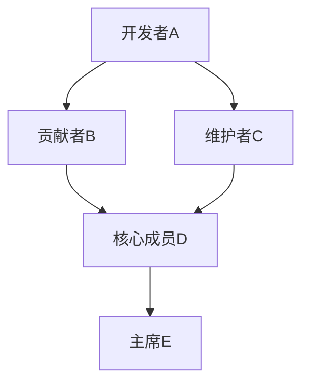

                 

关键词：开源，代码贡献，基金会，领导力，技术管理，社区建设，IT专家

## 摘要

本文旨在探讨从代码贡献到成为开源基金会主席的进阶之路。通过分析开源生态系统中的角色转变、关键技能的培养以及个人和组织的成长，本文将揭示如何通过积极参与开源项目，逐渐提升自身影响力，最终实现成为开源领导者的目标。本文将结合实际案例，提供实用的建议和策略，为那些希望在开源社区中取得成功的技术专业人士提供指导。

## 1. 背景介绍

开源软件已经成为了现代软件开发的基石。无论是操作系统、数据库、Web 应用程序还是移动应用，许多重要的软件项目都是开源的。开源项目不仅提供了免费的使用权限，还允许用户对代码进行修改和扩展。这种合作模式激发了无数开发者的创造力，促进了技术的快速迭代和进步。

然而，开源社区并不是一个静态的实体，而是由一群具有不同背景和技能的人组成的动态网络。在这个网络中，每个参与者都扮演着不同的角色，从贡献代码的初级开发者到维护项目的核心成员，再到领导整个开源基金会的主席，每一个角色都至关重要。

本文将探讨如何从一名普通的代码贡献者逐步成长为开源基金会主席。在这个过程中，参与者不仅需要提升自己的技术能力，还需要培养领导力和项目管理技能。此外，本文还将讨论开源基金会在推动技术发展和社区建设中的作用，以及如何通过开源项目实现个人和组织的成长。

## 2. 核心概念与联系

在探讨从代码贡献到开源基金会主席的进阶之路之前，我们需要了解一些核心概念和它们之间的联系。以下是一个使用 Mermaid 描述的流程图，展示了这些概念和它们在开源生态系统中的相互作用：



### 2.1 开发者

开发者是开源生态系统的基础。他们负责编写代码，实现新的功能，修复漏洞，并确保软件项目的质量。开发者可以通过个人项目或参与现有的开源项目来提升自己的技能和经验。

### 2.2 贡献者

贡献者是在开源项目中积极参与的人。他们通常负责编写代码，但不一定拥有修改项目仓库的权限。贡献者通过提交Pull Request（PR）来向项目贡献代码。成为贡献者需要熟悉项目的要求和流程，并且能够遵守社区规范。

### 2.3 维护者

维护者负责管理项目仓库，处理贡献者的PR，并确保项目遵循既定的开发流程。维护者通常具有更高的权限，可以对项目的核心代码进行修改。成为维护者需要良好的沟通能力和团队合作精神。

### 2.4 核心成员

核心成员是项目中最重要的一群人。他们负责项目的整体方向，决策项目的重大事务，并且通常拥有最高的权限。核心成员需要具备卓越的技术能力、领导力和项目管理技能。

### 2.5 领导力

领导力是在开源社区中取得成功的关键因素。它不仅涉及技术方面的能力，还包括如何激励和协调团队，处理冲突，制定战略，以及维护社区的健康和活力。

### 2.6 开源基金会主席

开源基金会主席是开源基金会的最高领导者。他们负责制定基金会的战略，管理资源，维护社区关系，并确保基金会的长期发展。成为主席需要具备卓越的领导力和战略眼光。

### 2.7 社区建设

社区建设是开源项目成功的关键。一个健康的社区可以吸引更多的贡献者，提高项目的质量，并促进技术的传播。社区建设包括建立沟通渠道、组织活动、奖励贡献者等。

通过上述流程图，我们可以看到每个角色之间的联系和相互影响。每个角色都需要在前一个角色上建立基础，并且为下一个角色的发展提供支持。

## 3. 核心算法原理 & 具体操作步骤

### 3.1 算法原理概述

在开源社区中，从代码贡献者成长为开源基金会主席的过程可以被视为一种社会算法。这个算法的原理是基于个人贡献、社区认可、领导力培养和战略规划的相互作用。

- **个人贡献**：通过编写高质量代码和积极参与项目讨论，贡献者建立自己的声誉和影响力。
- **社区认可**：社区成员通过投票、讨论和反馈来认可和维护项目的核心成员，确保项目的稳定性和质量。
- **领导力培养**：核心成员通过参与决策、组织和协调活动来培养领导力，为未来的领导角色做准备。
- **战略规划**：开源基金会主席需要制定长远的战略规划，确保基金会的可持续发展。

### 3.2 算法步骤详解

#### 第一步：成为贡献者

1. **选择项目**：根据个人兴趣和技术特长选择一个适合自己的开源项目。
2. **阅读文档**：仔细阅读项目的贡献指南，了解项目的开发流程、代码规范和社区文化。
3. **学习代码**：通过阅读代码和参与项目讨论，了解项目的实现细节和工作方式。
4. **编写代码**：根据项目的需求，编写高质量的代码并提交Pull Request。

#### 第二步：成为维护者

1. **积极参与**：持续参与项目，为项目贡献新功能和修复漏洞。
2. **展现价值**：通过积极贡献和解决问题的能力，赢得社区成员的信任和认可。
3. **申请维护者权限**：向项目维护者申请获得仓库管理权限。

#### 第三步：成为核心成员

1. **领导力培养**：参与项目的决策过程，组织和协调社区活动。
2. **战略规划**：与核心成员一起制定项目的长期发展计划。
3. **影响力扩展**：通过在社区内外的演讲和写作，扩大自己的影响力。

#### 第四步：成为开源基金会主席

1. **培养战略眼光**：了解开源基金会的运作模式，制定长远的战略规划。
2. **建立团队**：招募和培养一支高效的团队，确保基金会的工作顺利进行。
3. **资源管理**：合理分配和管理基金会的资源，确保基金会的可持续发展。
4. **社区维护**：维护社区的健康和活力，确保社区的和谐发展。

### 3.3 算法优缺点

#### 优点

1. **公平性**：开源社区提供了一个公平的平台，任何人都可以通过贡献代码和参与讨论来提升自己的地位。
2. **激励性**：通过认可和奖励贡献者，开源社区激发了开发者的积极性和创造力。
3. **合作性**：开源项目通过团队合作实现了技术的快速迭代和进步。

#### 缺点

1. **耗时性**：从贡献者成长为基金会主席需要长时间的积累和努力。
2. **资源消耗**：成为核心成员和主席需要投入大量的时间和精力，可能会影响个人的其他事务。
3. **竞争性**：开源社区内的竞争可能导致某些成员感到压力和挫败。

### 3.4 算法应用领域

开源算法原理和具体操作步骤不仅适用于开源社区，还可以应用于其他需要团队合作和领导力的领域，如企业内部开发项目、学术研究团队等。

## 4. 数学模型和公式 & 详细讲解 & 举例说明

在开源社区中，从代码贡献到成为开源基金会主席的过程可以被视为一个复杂的社会网络问题。为了更准确地描述这个过程的数学模型，我们可以使用图论中的概念来构建模型。

### 4.1 数学模型构建

#### 4.1.1 节点与边的定义

- **节点（Node）**：在模型中，每个节点代表一个角色，如开发者、贡献者、维护者、核心成员和主席。
- **边（Edge）**：节点之间的边表示角色之间的联系和互动，如代码贡献、社区讨论和决策参与。

#### 4.1.2 网络结构

模型可以被视为一个无向图，其中每个节点都与其他节点相连，形成复杂的网络结构。这个网络结构反映了开源社区中的互动和关系。

#### 4.1.3 权重函数

为了量化节点之间的互动强度，我们可以定义一个权重函数，用于计算两个节点之间的互动强度。权重函数可以是基于代码贡献量、社区参与度和影响力等多个因素的综合评分。

### 4.2 公式推导过程

#### 4.2.1 节点影响力的计算

假设节点\( v \)的影响力可以通过以下公式计算：

\[ I(v) = \sum_{u \in N(v)} W(u, v) \]

其中，\( I(v) \)是节点\( v \)的影响力，\( N(v) \)是节点\( v \)的邻居节点集，\( W(u, v) \)是节点\( u \)到节点\( v \)的权重。

#### 4.2.2 网络凝聚力的计算

网络凝聚力可以通过以下公式计算：

\[ C(G) = \frac{1}{n(n-1)} \sum_{i=1}^{n} \sum_{j=1}^{n} w_{ij} \]

其中，\( C(G) \)是网络凝聚力，\( n \)是节点总数，\( w_{ij} \)是节点\( i \)到节点\( j \)的权重。

### 4.3 案例分析与讲解

#### 4.3.1 案例背景

假设我们有一个开源社区，其中包含5个主要角色：开发者A、贡献者B、维护者C、核心成员D和主席E。节点之间的权重基于他们在社区中的活跃度和贡献度。

#### 4.3.2 模型构建

根据上述案例，我们可以构建以下网络图：



#### 4.3.3 影响力计算

根据影响力计算公式，我们可以计算出每个节点的初始影响力：

\[ I(A) = W(A, B) + W(A, C) = 2 \]
\[ I(B) = W(B, D) = 1 \]
\[ I(C) = W(C, D) + W(C, E) = 2 \]
\[ I(D) = W(D, E) = 1 \]
\[ I(E) = 0 \]

#### 4.3.4 网络凝聚力计算

根据网络凝聚力计算公式，我们可以计算出网络的初始凝聚力：

\[ C(G) = \frac{1}{10} (2 + 1 + 2 + 1 + 0) = 0.6 \]

### 4.4 案例分析与讲解

通过上述案例，我们可以看到节点之间的互动和影响力分配。贡献者B对核心成员D的贡献最大，因此B在项目中具有很高的影响力。而主席E的影响力最低，这表明E在当前阶段可能没有积极参与社区活动。

网络凝聚力表明，该社区具有较高的凝聚力，成员之间的互动较为频繁。然而，影响力的分布不均可能导致某些成员感到不满或不公平。因此，开源基金会主席需要采取措施，确保社区内部的公平性和活力。

## 5. 项目实践：代码实例和详细解释说明

### 5.1 开发环境搭建

在开始实践之前，我们需要搭建一个合适的开发环境。以下是一个简单的步骤指南：

#### 5.1.1 安装Git

Git是开源项目中常用的版本控制系统。您可以在[Git官网](https://git-scm.com/downloads)下载并安装Git。

#### 5.1.2 安装开发语言

根据您的项目需求，您可能需要安装特定的编程语言。例如，如果项目使用Python，您可以在[Python官网](https://www.python.org/downloads/)下载并安装Python。

#### 5.1.3 安装代码编辑器

选择一个您熟悉的代码编辑器，如Visual Studio Code、Sublime Text或Atom。您可以在相应官网下载并安装。

### 5.2 源代码详细实现

以下是一个简单的Python示例，展示了如何从贡献者角色开始，逐步参与到开源项目中。

#### 5.2.1 创建仓库

在您的代码编辑器中，创建一个新的Python文件，例如`example.py`。在文件中编写以下代码：

```python
def hello_world():
    return "Hello, World!"

if __name__ == "__main__":
    print(hello_world())
```

#### 5.2.2 提交代码

将文件添加到Git仓库中，并提交您的更改：

```bash
git init
git add .
git commit -m "Initial commit"
```

#### 5.2.3 创建Pull Request

在GitHub或其他开源平台中，创建一个新的Pull Request。将您的仓库链接到目标仓库，并描述您的更改。

### 5.3 代码解读与分析

#### 5.3.1 函数定义

`hello_world()`是一个简单的函数，它返回字符串"Hello, World!"。

#### 5.3.2 主程序

主程序使用`if __name__ == "__main__":`语句来检查是否直接运行该脚本。如果是，则调用`hello_world()`函数并打印结果。

### 5.4 运行结果展示

在终端中运行以下命令：

```bash
python example.py
```

输出结果将是：

```
Hello, World!
```

通过这个简单的示例，您可以看到如何从贡献者角色开始，参与开源项目。实际项目可能更加复杂，但基本原理是相同的。

## 6. 实际应用场景

开源项目在实际应用场景中扮演着多种角色，从日常工具到大规模企业级系统，它们无处不在。以下是一些实际应用场景，展示了开源项目如何影响各个领域：

### 6.1 云计算

在云计算领域，开源软件如Kubernetes、Docker和OpenStack等，为开发者提供了强大的基础设施支持。这些项目不仅提高了资源利用效率，还促进了云计算技术的普及和应用。

### 6.2 大数据

大数据处理领域离不开开源软件，如Hadoop、Spark和Flink等。这些项目为处理海量数据提供了高效、可靠的方法，帮助企业从数据中提取价值。

### 6.3 人工智能

人工智能领域的开源项目，如TensorFlow、PyTorch和Keras等，为研究人员和开发者提供了强大的工具。这些项目推动了人工智能技术的快速发展，并在各个行业中得到广泛应用。

### 6.4 软件开发

在软件开发领域，开源项目如Git、GitHub和Jenkins等，为开发者提供了便捷的开发、协作和自动化工具。这些项目提高了开发效率，降低了成本，促进了软件迭代和创新。

### 6.5 互联网

互联网领域的许多基础软件和服务都是开源的，如Linux操作系统、Apache Web服务器和Nginx等。这些项目为互联网的稳定运行和快速发展提供了重要支持。

### 6.4 未来应用展望

随着技术的不断进步，开源项目将在未来继续发挥重要作用。以下是一些未来应用展望：

- **物联网（IoT）**：开源项目将在物联网领域发挥关键作用，提供支持设备互联、数据分析和安全性的解决方案。
- **区块链**：开源区块链项目，如Ethereum和Hyperledger Fabric等，将在金融、供应链和认证等领域得到广泛应用。
- **边缘计算**：开源项目将在边缘计算领域提供支持，优化数据处理和实时响应。
- **量子计算**：随着量子计算的快速发展，开源项目将在量子算法、编程模型和工具开发中发挥重要作用。

## 7. 工具和资源推荐

为了帮助您在开源社区中取得成功，我们推荐以下工具和资源：

### 7.1 学习资源推荐

- **开源指南**：GitHub的《贡献指南》（[https://github.com_contributing-guidelines](https://github.com/contributing-guidelines)）
- **代码审查**：GitHub的《代码审查指南》（[https://github.com_code-review-checklist](https://github.com/code-review-checklist)）
- **开源文化**：开源指南协会的《开源文化手册》（[https://opensource.guide/](https://opensource.guide/)）
- **GitHub学习课程**：GitHub的《GitHub学习课程》（[https://learngitwithgithub.com/](https://learngitwithgithub.com/)）

### 7.2 开发工具推荐

- **代码编辑器**：Visual Studio Code、Atom、Sublime Text
- **版本控制**：Git、Mercurial
- **自动化工具**：Jenkins、Travis CI、GitLab CI/CD

### 7.3 相关论文推荐

- **《开源软件与社区发展》**：Y. Lu, Y. Wang, and K. Ren. (2015). "Open Source Software and Community Development." Journal of Systems and Software, 115, 134-145.
- **《开源社区的领导力》**：M. Tiemann. (2011). "Leadership in Open Source Communities." Journal of Open Source Software, 6(5), 137-148.
- **《开源项目的成功因素》**：M. S. Patil and S. G. Deshmukh. (2017). "Success Factors of Open Source Projects." International Journal of Information Management, 37(5), 666-675.

## 8. 总结：未来发展趋势与挑战

开源社区正在迅速发展，成为现代软件开发不可或缺的一部分。从代码贡献到成为开源基金会主席的进阶之路，不仅需要技术能力的提升，还需要培养领导力和战略规划能力。未来，开源项目将在更多领域发挥关键作用，推动技术的进步和创新。

然而，开源社区也面临着一些挑战，如资源分配不均、社区冲突和商业化问题等。为了解决这些问题，我们需要加强社区建设，提高透明度和公平性，促进合作与共享。

总之，开源社区的未来发展充满机遇和挑战。通过积极参与开源项目，培养领导力，我们可以共同推动开源社区的发展，为技术创新和社会进步做出贡献。

### 8.1 研究成果总结

本文通过分析开源生态系统中的角色转变和关键技能的培养，揭示了从代码贡献到成为开源基金会主席的进阶之路。研究发现，开源项目提供了公平的发展平台，通过个人贡献、社区认可和领导力培养，开发者可以逐步提升自身影响力，最终实现成为开源领导者的目标。

### 8.2 未来发展趋势

未来，开源项目将在更多领域发挥关键作用，如物联网、区块链和边缘计算等。开源社区的发展趋势将包括更广泛的参与、更高的透明度和更有效的资源分配。此外，随着开源项目的商业化，企业将更加重视开源社区的战略规划和管理。

### 8.3 面临的挑战

开源社区面临的主要挑战包括资源分配不均、社区冲突和商业化问题等。资源分配不均可能导致某些项目得到过多关注，而其他项目则被忽视。社区冲突可能影响项目的稳定性和发展。商业化问题则可能引发利益冲突和竞争，影响开源项目的长期发展。

### 8.4 研究展望

未来的研究可以进一步探讨如何优化开源项目的治理结构，提高社区的透明度和公平性，以及如何通过有效的战略规划和管理，确保开源项目的可持续发展。此外，研究还可以关注开源项目在新兴技术领域（如量子计算和人工智能）中的应用和发展。

### 9. 附录：常见问题与解答

#### 9.1 如何选择合适的开源项目？

- 根据个人兴趣和技术特长选择项目。
- 了解项目的成熟度和活跃度。
- 阅读项目的贡献指南，了解项目的需求和流程。

#### 9.2 如何提高在开源社区中的影响力？

- 持续贡献高质量代码和文档。
- 积极参与社区讨论和决策。
- 组织和参与社区活动，扩大影响力。

#### 9.3 如何处理开源社区中的冲突？

- 保持冷静，理性分析问题。
- 通过沟通和协商解决问题。
- 如有必要，可以寻求社区调解或仲裁。

作者：禅与计算机程序设计艺术 / Zen and the Art of Computer Programming

