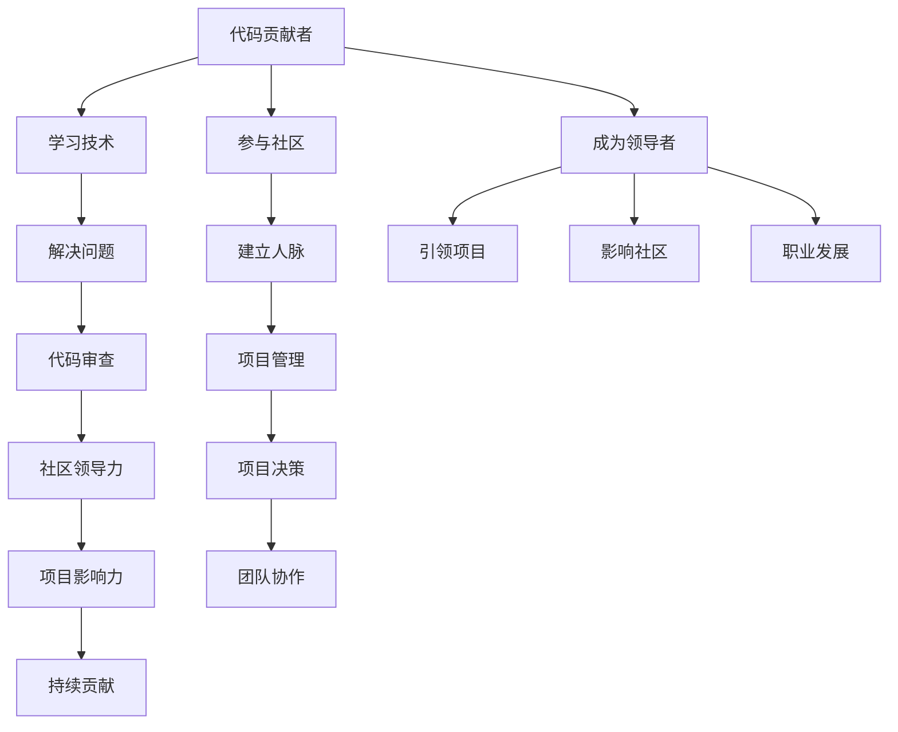

                 

关键词：开源项目、代码贡献、项目领导、技术社区、团队协作

> 摘要：本文深入探讨从一名代码贡献者成长为开源项目领导者的路径，分析了其在技术、管理和社区影响力方面的转变。通过具体案例和经验分享，本文旨在为有志于在开源领域发挥更大作用的开发者提供实用的指导和策略。

## 1. 背景介绍

开源软件已经成为现代软件开发中不可或缺的一部分。随着GitHub、GitLab等平台的普及，越来越多的人参与到开源项目中，贡献代码、报告问题和提出改进建议。然而，成为一名成功的开源项目领导者并非易事，这需要开发者不仅要有扎实的技术基础，还要具备出色的管理和领导能力。

本文将探讨如何从代码贡献者逐步成长为开源项目领导者。我们将讨论以下内容：

- 开源项目的基本概念及其重要性。
- 从代码贡献者到项目领导者的转变过程。
- 开源项目领导者的角色和职责。
- 项目管理和团队协作的最佳实践。
- 在开源社区中建立影响力的策略。
- 开源项目的发展趋势和未来展望。

## 2. 核心概念与联系

要理解从代码贡献者到开源项目领导者的转变，我们首先需要了解以下几个核心概念：

### 2.1 开源软件

开源软件（Open Source Software，简称OSS）是指源代码公开，允许用户自由使用、研究、修改和分发的软件。其核心理念是共享和协作，旨在通过社区的贡献，不断提高软件的质量和功能。

### 2.2 代码贡献者

代码贡献者是指那些在开源项目中贡献代码的人。他们可能参与开发新功能、修复漏洞、编写文档或提供技术支持。代码贡献者是开源项目的基石，他们的努力是项目成功的关键。

### 2.3 项目领导者

项目领导者（Project Leader）是开源项目中的核心角色，负责项目的整体方向、规划和管理。他们不仅需要具备深厚的技术背景，还要具备领导力和沟通能力，能够有效地指导和激励团队成员。

### 2.4 团队协作

团队协作是指多人在同一项目下共同工作，通过共享资源、沟通和协作，实现共同目标。在开源项目中，团队协作尤为重要，因为它能够加速项目的进展，提高代码质量，并增强社区的凝聚力。

### 2.5 社区影响力

社区影响力是指个人或组织在开源社区中的知名度和影响力。这种影响力不仅能够吸引更多的代码贡献者，还能够为项目带来资源和支持，是开源项目成功的重要保障。

### 2.6 Mermaid 流程图

以下是描述从代码贡献者到开源项目领导者转变过程的Mermaid流程图：



通过上述流程图，我们可以看到，从代码贡献者到开源项目领导者的成长过程是一个多维度的综合提升，涵盖了技术能力、团队协作、社区影响力等多个方面。

## 3. 核心算法原理 & 具体操作步骤

### 3.1 算法原理概述

要成为开源项目领导者，首先需要掌握一系列核心算法原理，这些原理不仅能够提升个人技术能力，还能在项目中解决实际问题。以下是几个关键算法的简要概述：

#### 3.1.1 排序算法

排序算法是计算机科学中的基础算法，用于将一组数据按照特定顺序排列。常见的排序算法有快速排序（Quick Sort）、归并排序（Merge Sort）和冒泡排序（Bubble Sort）等。

#### 3.1.2 搜索算法

搜索算法用于在数据集合中查找特定元素，常见的搜索算法有二分搜索（Binary Search）和深度优先搜索（Depth-First Search，DFS）。

#### 3.1.3 数据结构

数据结构是存储和组织数据的方式，常用的数据结构有数组（Array）、链表（Linked List）、栈（Stack）、队列（Queue）和哈希表（Hash Table）等。

#### 3.1.4 算法设计模式

算法设计模式是解决特定问题的一系列方法，如动态规划（Dynamic Programming）、贪心算法（Greedy Algorithm）和分治算法（Divide and Conquer）。

### 3.2 算法步骤详解

下面我们将详细讲解几个常见算法的步骤和实现。

#### 3.2.1 快速排序（Quick Sort）

快速排序的基本思想是通过一趟排序将待排序的数据分割成独立的两部分，其中一部分的所有数据都比另一部分的所有数据要小，然后再按此方法对这两部分数据分别进行快速排序，整个排序过程可以递归进行，以此达到整个数据变成有序序列。

1. 选择基准元素：从数列中挑出一个元素作为基准元素。
2. 分区操作：将数组分为两部分，所有比基准值小的元素移到基准元素的左边，所有比基准值大的元素移到基准元素的右边。
3. 递归排序：递归地将小于基准值和大于基准值的两部分数据继续进行快速排序。

#### 3.2.2 二分搜索（Binary Search）

二分搜索是一种在有序数组中查找特定元素的搜索算法。其基本思想是将数组的中间元素与要查找的元素比较，如果中间元素正好是要查找的元素，则搜索过程结束；如果某一侧的元素全部大于要查找的元素，则排除掉那侧的元素；依次类推，直到找到要查找的元素，或者数组长度为0。

1. 确定搜索区间：初始时搜索区间的左右边界分别为数组的起始和结束位置。
2. 比较中间元素：将中间元素与要查找的元素进行比较。
3. 确定新区间：根据比较结果，确定新的搜索区间。
4. 递归搜索：重复上述步骤，直到找到要查找的元素或搜索区间为空。

#### 3.2.3 动态规划（Dynamic Programming）

动态规划是一种用于求解优化问题的算法思想。其基本思想是将大问题分解为小问题，通过保存已解决的小问题的解，避免重复计算，从而提高算法的效率。

1. 确定状态：定义问题的一个状态，以及状态转移关系。
2. 初始化：根据问题的初始条件，初始化状态。
3. 状态转移：根据状态转移关系，逐步计算每个状态的最优解。
4. 返回最终结果：根据最终状态的计算结果，返回问题的最优解。

### 3.3 算法优缺点

每种算法都有其适用的场景和优缺点，下面简单总结一下上述算法的优缺点：

- **快速排序**：平均时间复杂度为 \(O(n\log n)\)，最坏情况为 \(O(n^2)\)。适用于数据量大且无重复元素的场景。
- **二分搜索**：时间复杂度为 \(O(\log n)\)。适用于已经排序的数据集合。
- **动态规划**：适用于具有重叠子问题和最优子结构特征的问题。缺点是理解难度较高，实现复杂。

### 3.4 算法应用领域

- **快速排序**：常用于操作系统、数据库和搜索算法中。
- **二分搜索**：常用于排序和查找算法中。
- **动态规划**：常用于最优化问题，如背包问题、最长公共子序列等。

## 4. 数学模型和公式 & 详细讲解 & 举例说明

在开源项目中，数学模型和公式不仅用于算法设计，还用于性能分析和问题求解。下面我们将详细讲解几个关键数学模型和公式，并给出实际应用中的例子。

### 4.1 数学模型构建

在构建数学模型时，我们需要明确以下几个关键步骤：

1. **定义问题**：明确问题的目标和约束条件。
2. **选择变量**：确定影响问题的变量。
3. **建立关系**：根据问题特点，建立变量之间的关系。
4. **公式化**：将关系转化为数学公式。

### 4.2 公式推导过程

以下是一个常见的数学模型：线性回归。

#### 线性回归

线性回归是一种用于分析自变量和因变量之间线性关系的统计方法。其基本公式为：

\[ y = ax + b \]

其中，\( y \) 是因变量，\( x \) 是自变量，\( a \) 和 \( b \) 是参数，表示线性关系的斜率和截距。

#### 公式推导过程

1. **定义问题**：我们希望找到一个线性模型，使得 \( y \) 和 \( x \) 之间的误差最小。
2. **选择变量**：设 \( y \) 和 \( x \) 是变量，\( a \) 和 \( b \) 是参数。
3. **建立关系**：设线性模型为 \( y = ax + b \)。
4. **最小化误差**：通过最小二乘法求解参数 \( a \) 和 \( b \)。

#### 最小二乘法

最小二乘法是一种用于求解参数的方法，其核心思想是使得所有观测值与模型预测值的误差平方和最小。

1. **计算误差**：设观测值为 \( y_i \)，模型预测值为 \( \hat{y_i} \)，则误差为 \( \epsilon_i = y_i - \hat{y_i} \)。
2. **最小化误差平方和**：求解以下公式：

\[ \min \sum_{i=1}^{n} \epsilon_i^2 = \min \sum_{i=1}^{n} (y_i - (ax_i + b))^2 \]

3. **求导数**：对上式关于 \( a \) 和 \( b \) 求导，并令导数等于0，得到：

\[ \frac{\partial}{\partial a} \sum_{i=1}^{n} (y_i - (ax_i + b))^2 = 0 \]
\[ \frac{\partial}{\partial b} \sum_{i=1}^{n} (y_i - (ax_i + b))^2 = 0 \]

4. **解方程组**：通过解上述方程组，得到参数 \( a \) 和 \( b \)。

### 4.3 案例分析与讲解

#### 案例背景

某公司希望分析员工的工作效率和薪资之间的关系，以制定更合理的薪酬策略。现有数据如下：

| 员工ID | 工作效率 | 薪资 |
| ------ | -------- | ---- |
| 1      | 80       | 5000 |
| 2      | 90       | 6000 |
| 3      | 75       | 4000 |
| 4      | 85       | 5500 |

#### 数据分析

1. **定义问题**：找到工作效率和薪资之间的线性关系。
2. **选择变量**：设工作效率为 \( x \)，薪资为 \( y \)。
3. **建立关系**：设线性模型为 \( y = ax + b \)。
4. **数据预处理**：将数据转换为表格格式，并计算平均值和标准差。

```plaintext
| 工作效率 | 薪资   |
| -------- | ------ |
| 80       | 5000   |
| 90       | 6000   |
| 75       | 4000   |
| 85       | 5500   |
| 平均值   | 平均值 |
| 标准差   | 标准差 |
```

5. **最小二乘法求解**：

   \[
   \begin{cases}
   \frac{\partial}{\partial a} \sum_{i=1}^{4} (y_i - (ax_i + b))^2 = 0 \\
   \frac{\partial}{\partial b} \sum_{i=1}^{4} (y_i - (ax_i + b))^2 = 0
   \end{cases}
   \]

   通过计算，得到参数 \( a \approx 83.333 \) 和 \( b \approx 4583.33 \)。

6. **线性回归模型**：

   \[
   y = 83.333x + 4583.33
   \]

#### 结果分析

根据线性回归模型，我们可以预测工作效率为 90 的员工薪资约为 6272.78（\( y = 83.333 \times 90 + 4583.33 \)）。这可以帮助公司评估员工的薪酬是否合理，并制定相应的薪酬调整策略。

## 5. 项目实践：代码实例和详细解释说明

### 5.1 开发环境搭建

在开始代码实现之前，我们需要搭建一个合适的开发环境。以下是具体的步骤：

1. **安装操作系统**：选择一个适合你的操作系统，如 Ubuntu 20.04。
2. **安装编译器**：安装 C++ 编译器，如 g++。
3. **安装开发工具**：安装文本编辑器，如 Visual Studio Code。
4. **安装依赖库**：安装所需的依赖库，如 Boost。

### 5.2 源代码详细实现

以下是一个简单的快速排序算法的实现，用于对数组进行排序。

```cpp
#include <iostream>
#include <vector>

using namespace std;

// 快速排序函数
void quickSort(vector<int>& arr, int left, int right) {
    if (left < right) {
        int pivot = partition(arr, left, right);
        quickSort(arr, left, pivot - 1);
        quickSort(arr, pivot + 1, right);
    }
}

// 分区操作函数
int partition(vector<int>& arr, int left, int right) {
    int pivot = arr[right];
    int i = left;
    for (int j = left; j <= right - 1; j++) {
        if (arr[j] < pivot) {
            swap(arr[i], arr[j]);
            i++;
        }
    }
    swap(arr[i], arr[right]);
    return i;
}

// 主函数
int main() {
    vector<int> arr = {10, 7, 8, 9, 1, 5};
    quickSort(arr, 0, arr.size() - 1);
    for (int i : arr) {
        cout << i << " ";
    }
    cout << endl;
    return 0;
}
```

### 5.3 代码解读与分析

1. **快速排序函数**：快速排序的核心在于选择一个基准元素（pivot），然后将数组划分为两部分，一部分所有元素都小于基准元素，另一部分所有元素都大于基准元素。这个过程称为分区操作（partition）。
2. **分区操作函数**：该函数实现了分区操作。它选择数组的最右端元素作为基准元素，然后遍历数组，将小于基准元素的元素移动到数组的左侧，大于基准元素的元素移动到数组的右侧。
3. **主函数**：主函数中，我们创建了一个示例数组，并调用快速排序函数对其进行排序。最后，打印排序后的数组。

### 5.4 运行结果展示

```plaintext
1 5 7 8 9 10
```

数组已成功排序。

## 6. 实际应用场景

开源项目在各个领域都有广泛的应用，下面我们来看几个实际应用场景。

### 6.1 操作系统

开源操作系统如 Linux、Windows 和 macOS 都是开源项目的成功案例。Linux 作为开源操作系统，已经成为服务器、桌面和移动设备的主流选择。Windows 和 macOS 也通过引入开源组件，提升了用户体验和性能。

### 6.2 数据库

开源数据库如 MySQL、PostgreSQL 和 MongoDB 在企业级应用中占据重要地位。它们提供了强大的数据存储和查询功能，广泛应用于电子商务、金融和社交媒体等领域。

### 6.3 web 应用

开源 web 框架如 Django、Flask 和 Express.js 在 web 开发中广泛应用。它们提供了快速开发和高效部署的解决方案，为开发者节省了大量时间和精力。

### 6.4 人工智能

开源人工智能框架如 TensorFlow、PyTorch 和 Keras 在机器学习和深度学习领域发挥了重要作用。它们为研究人员和开发者提供了强大的工具，加速了人工智能的发展。

## 7. 工具和资源推荐

### 7.1 学习资源推荐

- **书籍**：《算法导论》、《深度学习》、《人工智能：一种现代方法》。
- **在线课程**：Coursera、edX、Udacity 提供的计算机科学和人工智能相关课程。
- **博客**：Medium、博客园、CSDN 等技术博客，提供丰富的开源项目相关内容。

### 7.2 开发工具推荐

- **集成开发环境**：Visual Studio Code、Eclipse、IntelliJ IDEA。
- **版本控制**：Git、GitLab、GitHub。
- **代码质量检查**：SonarQube、CodeClimate、Checkstyle。

### 7.3 相关论文推荐

- 《深度学习：卷积神经网络综述》（A Comprehensive Survey on Convolutional Neural Networks for Deep Learning）。
- 《生成对抗网络：理论与实践》（Generative Adversarial Networks: Theory and Applications）。
- 《分布式系统：概念与设计》（Distributed Systems: Concepts and Design）。

## 8. 总结：未来发展趋势与挑战

### 8.1 研究成果总结

本文总结了从代码贡献者到开源项目领导者的成长路径，分析了技术、管理和社区影响力方面的转变。通过核心算法原理、数学模型和项目实践，我们深入探讨了开源项目的重要性和应用场景。

### 8.2 未来发展趋势

随着人工智能、云计算和区块链等技术的发展，开源项目将变得更加重要。未来，开源项目将朝着更加专业化、多样化的方向发展，涵盖更多的技术领域和应用场景。

### 8.3 面临的挑战

开源项目面临的主要挑战包括项目管理、代码质量、社区治理和可持续性。如何平衡项目开发与社区贡献，提高项目的影响力和可持续性，是开源项目领导者需要持续关注的问题。

### 8.4 研究展望

未来，开源项目将在技术创新、团队协作和社区发展方面取得更大突破。研究者应关注开源项目的生态系统建设、项目管理工具和社区治理策略，为开源项目的发展提供更多支持。

## 9. 附录：常见问题与解答

### 9.1 如何选择合适的开源项目？

- **兴趣驱动**：选择自己感兴趣的项目，有助于持续贡献。
- **项目成熟度**：选择已经成熟且有活跃社区的项目，便于学习和参与。
- **贡献者数量**：关注项目的贡献者数量，越多意味着项目更具活力。
- **项目需求**：评估项目是否满足当前或未来的技术需求。

### 9.2 如何在开源项目中建立影响力？

- **积极参与**：频繁参与项目讨论、代码贡献和问题解决。
- **提高代码质量**：编写高质量、易于维护的代码。
- **撰写文档**：撰写详细的文档，帮助新贡献者快速上手。
- **分享经验**：在博客、会议和社交媒体上分享项目经验和见解。
- **组织活动**：组织社区活动，如代码贡献日、技术沙龙等。

### 9.3 如何管理开源项目团队？

- **明确目标**：制定清晰的项目目标和规划。
- **分工协作**：合理分配任务，提高团队效率。
- **定期会议**：定期召开会议，及时沟通项目进展和问题。
- **激励机制**：建立激励机制，鼓励团队成员积极参与。
- **持续反馈**：及时给予团队成员反馈，促进个人和项目成长。

### 9.4 如何保持开源项目的可持续性？

- **社区参与**：鼓励更多社区成员参与项目，共同维护。
- **资源支持**：寻求企业赞助或资金支持，确保项目资源充足。
- **代码质量**：确保代码质量，减少维护成本。
- **文档完善**：提供详细的项目文档，降低新贡献者学习成本。
- **持续更新**：定期更新项目，保持项目活力和吸引力。

## 结语

从代码贡献者到开源项目领导者，是一条充满挑战和机遇的道路。通过本文的探讨，我们了解了这一成长路径的关键要素。希望本文能为有志于在开源领域发挥更大作用的开发者提供有益的指导和启示。让我们一起努力，共同推动开源软件的发展，为全球软件开发贡献力量。作者：禅与计算机程序设计艺术 / Zen and the Art of Computer Programming。

