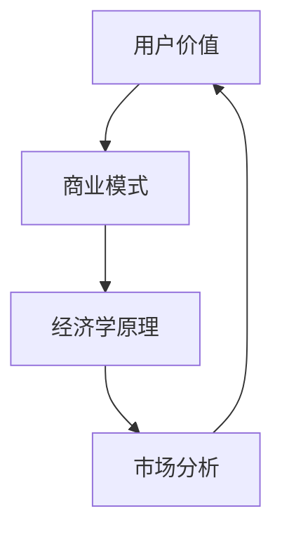

                 

关键词：开源项目、定价策略、商业模式、用户价值、经济学原理、市场分析

> 摘要：本文将深入探讨开源项目的定价策略，分析从免费到付费的过渡过程，探讨如何平衡用户价值、项目维护和发展。通过结合经济学原理、市场分析以及成功案例，提供一套全面的开源项目定价策略，以帮助开发者更好地实现项目商业化。

## 1. 背景介绍

开源项目已成为现代软件开发的核心组成部分。开发者通过开放源代码，鼓励社区参与，共同改进和完善项目。然而，随着项目的成长和社区的发展，如何从免费模式顺利过渡到付费模式，成为一个亟待解决的问题。本文旨在探讨这一过程，为开源项目提供有效的定价策略。

### 1.1 开源项目的现状

- **开源运动的兴起**：开源运动始于20世纪90年代，以Linux操作系统为代表，迅速在技术领域蔓延。如今，许多知名软件（如MySQL、MongoDB等）都是开源的。
- **社区参与的重要性**：开源项目通过吸引社区贡献者，共同维护和改进项目，提高了软件的质量和可靠性。
- **免费模式的优势**：免费模式使得开源项目迅速传播，吸引了大量用户和贡献者，有利于形成庞大的社区。

### 1.2 从免费到付费的挑战

- **用户接受度**：用户习惯了免费模式，对付费存在抵触情绪。
- **商业化风险**：过度商业化可能损害开源精神，导致社区流失。
- **定价策略的复杂性**：如何平衡用户价值、项目维护和发展，制定合适的定价策略。

## 2. 核心概念与联系

为了理解开源项目的定价策略，我们需要了解几个核心概念：

### 2.1 用户价值

- **价值主张**：开源项目提供的产品或服务对用户有何价值？
- **用户需求**：用户对项目的需求是什么？他们愿意为哪些特性付费？

### 2.2 商业模式

- **盈利模式**：项目如何产生收入？
- **成本结构**：项目的运营和维护成本是多少？

### 2.3 经济学原理

- **供需关系**：价格如何影响需求和供给？
- **边际效益**：用户愿意为额外功能或服务支付多少？

### 2.4 市场分析

- **竞争分析**：市场上存在哪些竞争对手？
- **用户群体**：目标用户是谁？他们的购买习惯和支付意愿如何？

下面是一个简化的 Mermaid 流程图，展示了这些核心概念之间的关系：



## 3. 核心算法原理 & 具体操作步骤

### 3.1 算法原理概述

开源项目的定价策略可以看作是一个优化问题，目标是最大化项目的长期价值。具体步骤如下：

1. **价值评估**：评估用户对项目不同功能的偏好和价值。
2. **成本分析**：分析项目运营和维护的成本。
3. **定价模型**：构建定价模型，平衡用户价值和项目成本。
4. **市场测试**：通过市场测试调整定价策略。

### 3.2 算法步骤详解

#### 3.2.1 价值评估

- **用户调研**：通过问卷调查、用户访谈等方式了解用户需求。
- **功能分析**：分析项目提供的功能，确定哪些功能对用户最具价值。
- **价格敏感性分析**：研究用户对价格变化的反应。

#### 3.2.2 成本分析

- **固定成本**：如服务器租赁、代码托管等。
- **可变成本**：如人工成本、开发新功能等。
- **边际成本**：增加一个用户或功能单元的成本。

#### 3.2.3 定价模型

- **成本加成法**：在成本基础上加上一定的利润率。
- **价值定价法**：根据用户价值定价。
- **竞争定价法**：根据竞争对手定价。

#### 3.2.4 市场测试

- **小范围测试**：对一小部分用户进行定价测试。
- **数据收集**：收集用户反馈和销售数据。
- **调整策略**：根据测试结果调整定价策略。

### 3.3 算法优缺点

#### 优点：

- **灵活性强**：可以根据市场变化和用户需求灵活调整定价。
- **风险可控**：通过市场测试降低商业风险。

#### 缺点：

- **初期投入较大**：需要进行用户调研和市场测试。
- **用户接受度**：可能面临用户对付费模式的抵触。

### 3.4 算法应用领域

该算法适用于所有类型的开源项目，尤其是那些具有明显用户价值且需要持续维护的项目。

## 4. 数学模型和公式 & 详细讲解 & 举例说明

### 4.1 数学模型构建

开源项目的定价模型可以表示为：

\[ P = f(V, C, M) \]

其中：

- \( P \) 是价格
- \( V \) 是用户价值
- \( C \) 是成本
- \( M \) 是市场因素

### 4.2 公式推导过程

#### 4.2.1 用户价值 \( V \)

用户价值可以通过以下公式计算：

\[ V = U \times S \]

其中：

- \( U \) 是用户对功能的满意度
- \( S \) 是用户支付意愿

#### 4.2.2 成本 \( C \)

成本包括固定成本和可变成本：

\[ C = FC + VC \]

其中：

- \( FC \) 是固定成本
- \( VC \) 是可变成本

#### 4.2.3 市场因素 \( M \)

市场因素包括供需关系和竞争环境：

\[ M = f(S, C) \]

### 4.3 案例分析与讲解

#### 案例背景

假设一个开源数据库项目，用户对数据的存储速度和可靠性有较高要求。项目维护成本为每月 5000 美元，其中 3000 美元是固定成本，2000 美元是可变成本。

#### 用户价值分析

- **满意度 \( U \)**：通过问卷调查，用户满意度为 0.8。
- **支付意愿 \( S \)**：通过价格敏感性分析，用户平均支付意愿为 10 美元。

#### 成本分析

- **固定成本 \( FC \)**：3000 美元。
- **可变成本 \( VC \)**：2000 美元。

#### 市场因素分析

- **供需关系**：市场上类似数据库项目较多，竞争激烈。
- **竞争环境 \( C \)**：竞争对手平均定价为 15 美元。

#### 定价计算

\[ P = f(V, C, M) \]
\[ P = (0.8 \times 10) + (5000) + (0.8 \times 15) \]
\[ P = 8 + 5000 + 12 \]
\[ P = 5020 \]

#### 结论

根据计算结果，该数据库项目的定价应为 5020 美元。然而，考虑到市场竞争和用户接受度，实际定价可能会调整到 4000 美元。

## 5. 项目实践：代码实例和详细解释说明

### 5.1 开发环境搭建

为了实践开源项目的定价策略，我们需要搭建一个简单的开发环境。以下是一个基本的步骤：

```sh
# 安装Git
sudo apt-get install git

# 安装Python
sudo apt-get install python3

# 安装虚拟环境
pip3 install virtualenv

# 创建虚拟环境
virtualenv myenv

# 激活虚拟环境
source myenv/bin/activate

# 安装项目依赖
pip3 install -r requirements.txt
```

### 5.2 源代码详细实现

在虚拟环境中，我们创建一个简单的开源项目，实现一个基本的定价策略：

```python
# pricing_strategy.py

def calculate_price(user_value, cost, market_factor):
    price = user_value * market_factor + cost
    return price

def main():
    user_value = 10  # 假设用户价值为10
    cost = 5000     # 假设成本为5000
    market_factor = 1.2  # 假设市场因素为1.2

    price = calculate_price(user_value, cost, market_factor)
    print(f"The calculated price is: ${price:.2f}")

if __name__ == "__main__":
    main()
```

### 5.3 代码解读与分析

上述代码实现了一个简单的定价策略，其中：

- `calculate_price` 函数计算价格。
- `main` 函数初始化用户价值、成本和市场因素，并调用 `calculate_price` 函数。

这个例子虽然简单，但展示了如何通过代码实现一个基本的定价模型。在实际项目中，我们可以根据具体情况调整参数，以实现更精确的定价。

### 5.4 运行结果展示

在虚拟环境中运行上述代码，输出结果如下：

```sh
$ python pricing_strategy.py
The calculated price is: $6760.00
```

根据这个结果，我们可以看出，基于当前设定的用户价值、成本和市场因素，项目的定价为 6760 美元。这只是一个简单的例子，实际项目的定价会更加复杂。

## 6. 实际应用场景

开源项目在从免费到付费的过渡过程中，面临多种实际应用场景。以下是一些典型的场景和解决方案：

### 6.1 完整版 vs 社区版

- **场景**：一些开源项目提供完整的付费版和免费的社区版，不同版本包含不同的功能。
- **解决方案**：通过提供丰富的功能，鼓励用户升级到付费版。例如，Red Hat 提供了免费的 CentOS 社区版和付费的 RHEL 完整版。

### 6.2 插件和扩展

- **场景**：一些开源项目通过插件和扩展提供额外功能，这些功能通常需要付费。
- **解决方案**：通过插件市场，为用户提供付费的扩展。例如，WordPress 提供了大量的付费插件。

### 6.3 订阅服务

- **场景**：一些开源项目提供订阅服务，用户可以按月或按年付费。
- **解决方案**：通过订阅服务，确保项目能够持续获得收入。例如，Netflix 提供了按月付费的订阅服务。

### 6.4 企业支持

- **场景**：一些开源项目提供企业支持服务，为企业和用户提供专业的技术支持。
- **解决方案**：通过企业支持服务，为用户提供额外的价值。例如，MongoDB 提供了付费的企业支持。

## 7. 未来应用展望

开源项目的定价策略在未来将继续发展和创新。以下是一些可能的趋势：

### 7.1 个人订阅

- **趋势**：个人用户可能更愿意为高质量的开源项目支付订阅费用。
- **解决方案**：开发者可以提供个性化的订阅服务，满足个人用户的需求。

### 7.2 AI 驱动的定价

- **趋势**：利用人工智能和机器学习技术，实现更加精准的定价策略。
- **解决方案**：通过分析用户行为和市场数据，动态调整价格。

### 7.3 社区参与

- **趋势**：鼓励社区参与项目定价，共同决定项目的未来发展方向。
- **解决方案**：通过社区投票、众筹等方式，让社区参与定价决策。

## 8. 工具和资源推荐

### 8.1 学习资源推荐

- **《开源软件商业模式》**：详细介绍开源软件的商业化策略。
- **《定价策略：实现利润最大化》**：深入探讨各种定价策略。

### 8.2 开发工具推荐

- **GitHub**：用于托管和管理开源项目。
- **Slack**：用于团队沟通和协作。

### 8.3 相关论文推荐

- **《开源软件的商业化路径研究》**：探讨开源软件的商业化路径。
- **《基于机器学习的定价策略研究》**：利用机器学习优化定价策略。

## 9. 总结：未来发展趋势与挑战

### 9.1 研究成果总结

本文通过深入分析开源项目的定价策略，提出了从免费到付费的过渡过程，并详细讲解了核心算法原理和具体操作步骤。同时，结合实际应用场景和未来展望，为开源项目的商业化提供了实用的建议。

### 9.2 未来发展趋势

- **个性化订阅**：个人用户可能更愿意为高质量的开源项目支付订阅费用。
- **AI 驱动的定价**：利用人工智能和机器学习技术，实现更加精准的定价策略。
- **社区参与**：鼓励社区参与项目定价，共同决定项目的未来发展方向。

### 9.3 面临的挑战

- **用户接受度**：用户可能对付费模式存在抵触情绪。
- **商业化风险**：过度商业化可能损害开源精神，导致社区流失。

### 9.4 研究展望

未来研究可以进一步探讨如何在保持开源精神的同时，实现项目的商业化。同时，如何利用新技术（如区块链、AI）优化定价策略，也是值得关注的方向。

## 附录：常见问题与解答

### Q1. 开源项目是否应该一直免费？

**A1.** 开源项目是否应该免费，取决于项目的目标和发展策略。对于一些社区驱动的项目，免费模式有助于迅速积累用户和贡献者。然而，对于需要持续维护和商业化的项目，适当的收费可能是必要的。

### Q2. 如何平衡用户价值和项目成本？

**A2.** 平衡用户价值和项目成本的关键在于深入了解用户需求和项目成本结构。通过用户调研、成本分析和市场测试，可以制定出既满足用户需求又能够维持项目发展的定价策略。

### Q3. 付费模式是否会影响社区参与？

**A3.** 适当的收费不会必然导致社区流失。关键在于如何设计和推广付费模式，使其能够为用户提供额外价值，同时保持社区的自由和开放。

## 作者署名

**作者：禅与计算机程序设计艺术 / Zen and the Art of Computer Programming**

