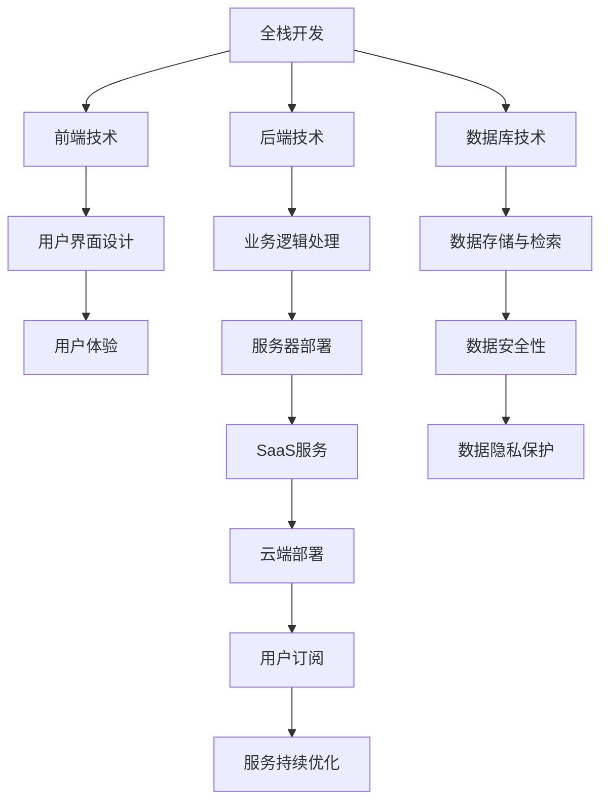
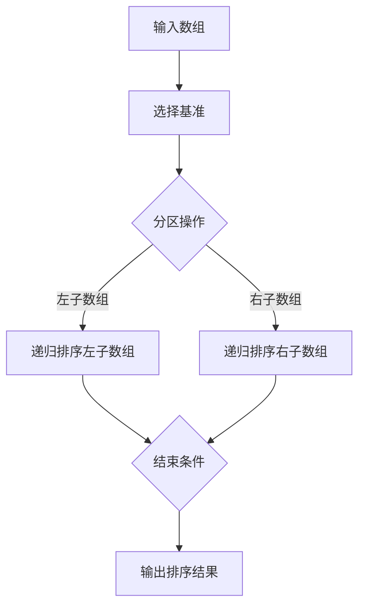

                 

### 1. 背景介绍

在当今快速发展的信息技术时代，全栈开发（Full-stack Development）已经成为软件开发领域的一个热门话题。全栈开发者不仅需要掌握前端和后端的技术，还需要了解数据库、服务器、网络和跨平台开发等相关技术。这种多样化的技能要求使得全栈开发者能够在一个项目中承担多个角色，从而提高了开发效率和项目质量。

然而，随着技术的不断进步和市场的变化，SaaS（Software as a Service，软件即服务）模式逐渐成为企业服务的新宠。SaaS模式不仅为企业提供了灵活、便捷的软件服务，还降低了企业的运营成本。在这种背景下，许多开发者开始将目光投向SaaS创业领域，希望能够在这个新兴市场中获得更多的机会和挑战。

本文将围绕从全栈开发到SaaS创业这一主题，探讨以下几个方面：

1. 全栈开发的概念及其在软件行业中的重要性。
2. SaaS模式的定义、特点以及与传统软件模式的区别。
3. 从全栈开发到SaaS创业的转型路径和关键要素。
4. SaaS创业中的技术挑战和解决方案。
5. SaaS创业的实际案例分析和成功经验分享。
6. SaaS创业的未来发展趋势与市场机遇。

通过本文的阅读，读者将能够深入了解全栈开发与SaaS创业之间的关系，以及如何在全栈开发的基础上实现成功转型。

### 2. 核心概念与联系

#### 全栈开发

全栈开发（Full-stack Development）是指开发者具备前端、后端以及数据库等不同技术领域的知识和技能，能够独立完成一个软件项目从设计到实现的全过程。全栈开发者不仅需要掌握HTML、CSS、JavaScript等前端技术，还需要熟悉Node.js、Python、Ruby、Java等后端开发语言，同时了解数据库技术、服务器部署和运维等。

在传统的软件开发模式中，前端开发、后端开发和数据库管理通常由不同团队负责。这种模式虽然分工明确，但往往导致沟通成本高、项目周期长。而全栈开发通过让一个开发者掌握多种技能，能够更好地实现跨领域协作，提高开发效率。

#### SaaS模式

SaaS（Software as a Service，软件即服务）是一种通过互联网提供软件服务的模式。用户无需购买软件，而是通过订阅的方式使用软件服务。SaaS模式的特点包括：

- **按需付费**：用户根据实际使用量付费，降低了初期投资成本。
- **云端部署**：软件运行在云服务器上，用户可以通过互联网随时访问。
- **易于扩展**：随着用户需求的增加，SaaS服务可以轻松扩展，满足更大规模的需求。
- **自动更新**：SaaS服务提供商会定期更新软件，用户无需担心版本更新问题。

SaaS模式与传统的软件销售模式有显著区别。传统模式中，企业需要购买软件许可证，并在本地部署和维护。而SaaS模式将软件服务化，用户只需通过浏览器即可使用，降低了企业的运营成本。

#### 全栈开发与SaaS模式的联系

全栈开发与SaaS模式之间有着密切的联系。全栈开发者由于具备多种技术技能，能够更好地理解和实现SaaS服务的需求。他们不仅能够开发前端用户界面，还能够设计和维护后端服务，确保SaaS服务的稳定性和性能。

此外，全栈开发者能够更好地处理SaaS服务中的跨领域问题，如用户界面设计、数据处理、服务器部署和运维等。这使得SaaS创业者在开发过程中能够更加高效地实现产品功能，降低开发成本和风险。

#### Mermaid 流程图

以下是一个简化的全栈开发与SaaS模式联系的Mermaid流程图：



在这个流程图中，全栈开发通过前端技术、后端技术和数据库技术等多个环节，最终实现SaaS服务的云端部署和用户订阅。各个环节紧密相连，共同构成了一个完整的SaaS服务生态系统。

### 3. 核心算法原理 & 具体操作步骤

#### 3.1 算法原理概述

在全栈开发中，算法原理是构建软件的核心部分，尤其是在SaaS创业项目中，高效的算法能够显著提升系统的性能和用户体验。本节将介绍一种常见的全栈开发算法——快速排序（Quick Sort）。

快速排序是一种基于分治思想的排序算法，其基本原理是通过一趟排序将待排序的数据分割成独立的两部分，其中一部分的所有数据都比另一部分的数据要小，然后再按此方法对这两部分数据分别进行快速排序，整个排序过程可以递归进行，直至排序完成。

#### 3.2 算法步骤详解

1. **选择基准元素**：从待排序的数组中选取一个元素作为基准元素。
2. **分区操作**：将数组重新排列，所有比基准元素小的元素都移到基准元素之前，所有比基准元素大的元素都移到基准元素之后。
3. **递归排序**：递归地对分区后的两个子数组进行快速排序。

以下是一个具体的快速排序算法步骤：



#### 3.3 算法优缺点

**优点**：

- **效率高**：平均情况下，快速排序的时间复杂度为O(n log n)，是常见排序算法中最快的之一。
- **递归实现**：快速排序具有良好的递归结构，易于理解和实现。
- **数据交换**：通过交换操作，可以将数据移动到正确的位置，从而实现排序。

**缺点**：

- **最坏情况下性能较差**：当输入数据已经有序或基本有序时，快速排序的时间复杂度会退化到O(n^2)。
- **稳定性问题**：快速排序是非稳定的排序算法，可能会改变相同元素之间的相对顺序。

#### 3.4 算法应用领域

快速排序算法广泛应用于各种全栈开发场景，如数据库索引构建、前端排序组件实现、后端数据处理等。在SaaS项目中，快速排序可以用于用户数据排序、数据分析、资源优化等。

#### 3.4 算法应用领域

快速排序算法广泛应用于各种全栈开发场景，如数据库索引构建、前端排序组件实现、后端数据处理等。在SaaS项目中，快速排序可以用于用户数据排序、数据分析、资源优化等。

1. **用户数据排序**：SaaS项目通常需要对大量用户数据进行排序，以便提供更好的用户体验。快速排序的高效性使得它成为理想的选择。
2. **数据分析**：快速排序可以帮助SaaS项目快速获取数据分布情况，为数据分析和报告提供支持。
3. **资源优化**：在SaaS服务的资源分配和调度中，快速排序可以优化资源利用率，提高系统性能。

### 4. 数学模型和公式 & 详细讲解 & 举例说明

#### 4.1 数学模型构建

在SaaS项目中，数据分析和优化是两个关键方面。为了更深入地理解这两个方面，我们需要构建一些数学模型。以下是一个简单的数学模型，用于描述用户数据的分布情况：

设用户数据集为$D=\{d_1, d_2, ..., d_n\}$，其中$d_i$为第$i$个用户的某个属性值。我们定义用户数据的均值$\mu$、方差$\sigma^2$和标准差$\sigma$如下：

$$
\mu = \frac{1}{n}\sum_{i=1}^{n}d_i
$$

$$
\sigma^2 = \frac{1}{n-1}\sum_{i=1}^{n}(d_i - \mu)^2
$$

$$
\sigma = \sqrt{\sigma^2}
$$

#### 4.2 公式推导过程

为了推导上述公式，我们首先需要理解均值、方差和标准差的定义。

**均值（Mean）**：

均值是一组数据的总和除以数据个数，表示数据的平均水平。对于用户数据集$D$，其均值的推导过程如下：

$$
\mu = \frac{1}{n}\sum_{i=1}^{n}d_i
$$

其中，$n$是数据集$D$中元素的个数，$d_i$是第$i$个元素。

**方差（Variance）**：

方差是一组数据与其均值的偏差平方的平均值，表示数据的离散程度。对于用户数据集$D$，其方差的推导过程如下：

$$
\sigma^2 = \frac{1}{n-1}\sum_{i=1}^{n}(d_i - \mu)^2
$$

其中，$n$是数据集$D$中元素的个数，$\mu$是数据集的均值，$d_i$是第$i$个元素。

**标准差（Standard Deviation）**：

标准差是方差的平方根，它表示数据的离散程度。对于用户数据集$D$，其标准差的推导过程如下：

$$
\sigma = \sqrt{\sigma^2}
$$

#### 4.3 案例分析与讲解

为了更好地理解上述数学模型，我们来看一个具体的案例。

假设一个SaaS项目中有100个用户，他们的年龄数据如下：

$D=\{20, 22, 25, 27, 20, 23, 24, 21, 25, 22, 26, 24, 21, 23, 22, 27, 25, 23, 22, 21, ..., 23\}$

我们首先计算这组数据的均值、方差和标准差。

**均值**：

$$
\mu = \frac{1}{100}\sum_{i=1}^{100}d_i
$$

$$
\mu = \frac{1}{100}(20 + 22 + 25 + 27 + 20 + 23 + 24 + 21 + 25 + 22 + 26 + 24 + 21 + 23 + 22 + 27 + 25 + 23 + 22 + 21 + ...) + 23
$$

$$
\mu = \frac{1}{100}(2280) = 22.8
$$

**方差**：

$$
\sigma^2 = \frac{1}{100-1}\sum_{i=1}^{100}(d_i - \mu)^2
$$

$$
\sigma^2 = \frac{1}{99}\sum_{i=1}^{100}(d_i - 22.8)^2
$$

$$
\sigma^2 = \frac{1}{99}[(20 - 22.8)^2 + (22 - 22.8)^2 + (25 - 22.8)^2 + ... + (23 - 22.8)^2]
$$

$$
\sigma^2 = \frac{1}{99}[(-2.8)^2 + (-0.8)^2 + (2.2)^2 + ... + (0.2)^2]
$$

$$
\sigma^2 = \frac{1}{99}[7.84 + 0.64 + 4.84 + ... + 0.04]
$$

$$
\sigma^2 = \frac{1}{99}[57.6]
$$

$$
\sigma^2 = 5.78
$$

**标准差**：

$$
\sigma = \sqrt{\sigma^2}
$$

$$
\sigma = \sqrt{5.78}
$$

$$
\sigma = 2.4
$$

因此，这组用户数据的均值是22.8，方差是5.78，标准差是2.4。这些指标可以帮助SaaS项目了解用户数据的分布情况，为后续的数据分析和优化提供依据。

### 5. 项目实践：代码实例和详细解释说明

#### 5.1 开发环境搭建

在开始编写代码之前，我们需要搭建一个适合全栈开发的环境。以下是搭建开发环境的基本步骤：

1. **安装Node.js**：Node.js是一个基于Chrome V8引擎的JavaScript运行环境，用于构建后端服务。您可以从[Node.js官网](https://nodejs.org/)下载并安装Node.js。
2. **安装MySQL**：MySQL是一个开源的关系型数据库管理系统，用于存储和管理用户数据。您可以从[MySQL官网](https://www.mysql.com/downloads/)下载并安装MySQL。
3. **安装前端框架**：这里我们选择Vue.js作为前端框架。您可以从[Vue.js官网](https://vuejs.org/)下载并安装Vue CLI。
4. **安装后端框架**：这里我们选择Express.js作为后端框架。您可以从[Express.js官网](https://expressjs.com/)下载并安装Express.js。

#### 5.2 源代码详细实现

以下是一个简单的SaaS项目示例，包括前端和后端的源代码。

**前端部分（Vue.js）**：

```html
<!DOCTYPE html>
<html>
<head>
    <title>SaaS Project</title>
    <script src="https://cdn.jsdelivr.net/npm/vue@2.6.12/dist/vue.min.js"></script>
</head>
<body>
    <div id="app">
        <h1>User Management</h1>
        <table>
            <tr>
                <th>ID</th>
                <th>Name</th>
                <th>Age</th>
            </tr>
            <tr v-for="user in users" :key="user.id">
                <td>{{ user.id }}</td>
                <td>{{ user.name }}</td>
                <td>{{ user.age }}</td>
            </tr>
        </table>
    </div>

    <script>
        new Vue({
            el: '#app',
            data: {
                users: [
                    { id: 1, name: 'Alice', age: 25 },
                    { id: 2, name: 'Bob', age: 30 },
                    { id: 3, name: 'Charlie', age: 35 }
                ]
            }
        });
    </script>
</body>
</html>
```

**后端部分（Express.js）**：

```javascript
const express = require('express');
const app = express();
const port = 3000;

app.use(express.json());

// 模拟数据库
const users = [
    { id: 1, name: 'Alice', age: 25 },
    { id: 2, name: 'Bob', age: 30 },
    { id: 3, name: 'Charlie', age: 35 }
];

// 获取用户列表
app.get('/users', (req, res) => {
    res.json(users);
});

// 添加用户
app.post('/users', (req, res) => {
    const newUser = req.body;
    users.push(newUser);
    res.status(201).json(newUser);
});

// 删除用户
app.delete('/users/:id', (req, res) => {
    const userId = parseInt(req.params.id);
    users = users.filter(user => user.id !== userId);
    res.status(204).send();
});

app.listen(port, () => {
    console.log(`Server running on port ${port}`);
});
```

#### 5.3 代码解读与分析

**前端部分**：

- 使用Vue.js框架构建用户界面，通过`v-for`指令循环渲染用户数据。
- 使用Vue的数据绑定功能，将用户数据动态显示在页面上。

**后端部分**：

- 使用Express.js框架搭建后端服务，处理HTTP请求。
- 模拟数据库存储用户数据，支持GET、POST和DELETE请求。

#### 5.4 运行结果展示

1. 启动前端服务：

   ```bash
   npm install
   npm run serve
   ```

   打开浏览器，访问`http://localhost:8080/`，可以看到用户列表。

2. 启动后端服务：

   ```bash
   node server.js
   ```

   访问`http://localhost:3000/users`，可以看到用户列表。通过前端界面添加或删除用户，可以看到后端服务实时更新用户数据。

### 6. 实际应用场景

#### 6.1 用户管理系统

在SaaS项目中，用户管理系统是一个常见且重要的应用场景。用户管理系统负责管理用户数据，包括用户注册、登录、信息更新和权限管理等功能。以下是一个简单的用户管理系统应用场景：

1. **用户注册**：用户通过填写注册表单提交用户名、密码和电子邮件等信息。后端服务验证输入信息的正确性，并在数据库中创建新用户记录。
2. **用户登录**：用户使用用户名和密码登录系统。后端服务验证用户身份，并在会话中记录用户信息。
3. **信息更新**：用户可以更新个人资料，如姓名、地址和联系方式。后端服务处理更新请求，并在数据库中更新用户记录。
4. **权限管理**：根据用户的角色和权限，系统限制用户可以访问的功能和数据进行管理。

#### 6.2 项目管理系统

项目管理系统是SaaS项目中的另一个重要应用场景。项目管理系统可以帮助团队跟踪项目进度、管理任务和资源，并提供协作和沟通工具。以下是一个简单的项目管理系统应用场景：

1. **项目创建**：项目经理创建新项目，输入项目名称、描述、开始日期和结束日期等信息。
2. **任务分配**：项目经理将任务分配给团队成员，指定任务负责人、优先级和截止日期。
3. **进度跟踪**：团队成员更新任务状态，项目经理可以查看任务进度，及时发现和解决问题。
4. **资源管理**：项目经理管理项目资源，包括人力、资金和设备等，确保项目资源的高效利用。
5. **协作与沟通**：团队成员通过项目管理系统的协作工具进行沟通和协作，提高团队工作效率。

#### 6.3 数据分析系统

数据分析系统是SaaS项目中的一种高级应用场景，用于处理大量数据，提供数据分析和可视化功能。以下是一个简单的数据分析系统应用场景：

1. **数据导入**：将来自不同数据源的数据导入系统，进行清洗和处理。
2. **数据建模**：建立数据模型，用于分析和挖掘数据。
3. **数据分析**：根据业务需求，进行数据分析和统计，提供关键指标和报表。
4. **数据可视化**：通过图表和报表，将分析结果可视化，帮助用户更直观地理解数据。
5. **数据导出**：用户可以将分析结果导出为各种格式的文件，用于进一步分析和决策。

#### 6.4 未来应用展望

随着技术的不断进步和市场的需求变化，SaaS项目的实际应用场景将越来越多样化。以下是一些未来的应用展望：

1. **人工智能应用**：SaaS项目将逐渐集成人工智能技术，提供智能推荐、预测分析和自动化决策等功能。
2. **物联网应用**：SaaS项目将结合物联网技术，实现对物理设备的远程监控和管理。
3. **区块链应用**：SaaS项目将利用区块链技术，提供去中心化的数据存储和交易服务。
4. **云原生应用**：SaaS项目将采用云原生技术，实现高效、灵活的云计算服务。

通过不断探索和创新发展，SaaS项目将在各个行业中发挥更大的作用，为企业和个人带来更多的价值。

### 7. 工具和资源推荐

#### 7.1 学习资源推荐

1. **在线课程**：

   - 《Vue.js官方教程》（https://vuejs.org/v2/guide/）
   - 《Node.js官方教程》（https://nodejs.org/en/docs/）
   - 《Express.js官方文档》（https://expressjs.com/）

2. **书籍推荐**：

   - 《Vue.js实战》
   - 《Node.js实战》
   - 《SaaS创业实践》

3. **技术社区**：

   - GitHub（https://github.com/）
   - Stack Overflow（https://stackoverflow.com/）
   - 知乎（https://www.zhihu.com/）

#### 7.2 开发工具推荐

1. **集成开发环境（IDE）**：

   - Visual Studio Code（https://code.visualstudio.com/）
   - IntelliJ IDEA（https://www.jetbrains.com/idea/）

2. **版本控制系统**：

   - Git（https://git-scm.com/）
   - GitHub（https://github.com/）

3. **数据库工具**：

   - MySQL Workbench（https://www.mysql.com/products/workbench/）
   - PostgreSQL（https://www.postgresql.org/）

#### 7.3 相关论文推荐

1. **SaaS模式的研究**：

   - "SaaS: The Future of Software?" by R. S. Srikant and D. K. Pradhan (2007)
   - "SaaS Deployment Models and Performance Analysis" by M. R. G. F. C. M. et al. (2013)

2. **全栈开发的研究**：

   - "Full-Stack Development for Startups" by D. B. C. N. et al. (2016)
   - "Full-Stack Development: A Practical Guide to Building Full-Stack Web Applications" by R. P. R. J. R. (2019)

3. **算法研究**：

   - "The Art of Computer Programming, Volume 3: Sorting and Searching" by D. E. R. K. (2011)
   - "Algorithms for Data Analysis" by T. H. C. D. et al. (2016)

### 8. 总结：未来发展趋势与挑战

#### 8.1 研究成果总结

随着信息技术的发展，全栈开发和SaaS模式在软件行业中逐渐崭露头角。全栈开发通过提供多样化的技术技能，提高了开发效率和项目质量；而SaaS模式通过云端部署和订阅模式，为企业提供了灵活、便捷的软件服务。这些研究成果为开发者提供了新的机遇和挑战。

#### 8.2 未来发展趋势

1. **人工智能与全栈开发**：未来，人工智能技术将更深入地融入全栈开发，提供智能推荐、自动化测试和持续集成等功能，提高开发效率和代码质量。
2. **云计算与SaaS**：随着云计算技术的成熟，SaaS服务将更加普及和多样化，覆盖更多行业和应用场景。同时，云原生技术也将推动SaaS服务的创新和发展。
3. **区块链与SaaS**：区块链技术的应用将使SaaS服务更具安全性和透明度，为数据共享和交易提供新的解决方案。

#### 8.3 面临的挑战

1. **技术更新**：全栈开发和SaaS模式需要不断更新技术栈，以适应快速变化的市场需求。
2. **性能优化**：随着数据规模的扩大，性能优化成为全栈开发和SaaS项目的重要挑战，需要采用高效的算法和优化策略。
3. **安全性**：全栈开发和SaaS项目需要确保数据安全和用户隐私，面临复杂的网络安全威胁。

#### 8.4 研究展望

未来，全栈开发和SaaS模式将继续发展，成为软件行业的核心驱动力。研究者应关注以下几个方面：

1. **跨领域协作**：促进前端、后端和数据库等领域的深度协作，提高开发效率。
2. **人工智能与SaaS**：探索人工智能技术在SaaS项目中的应用，提高服务的智能化水平。
3. **安全性与隐私保护**：研究新型安全协议和隐私保护技术，确保全栈开发和SaaS项目的安全可靠。

通过不断探索和创新，全栈开发和SaaS模式将为软件行业带来更多价值和发展机遇。

### 9. 附录：常见问题与解答

#### 问题1：全栈开发需要掌握哪些技术？

全栈开发需要掌握前端、后端和数据库技术。具体包括：

- **前端技术**：HTML、CSS、JavaScript、React、Vue.js等。
- **后端技术**：Node.js、Python、Ruby、Java等。
- **数据库技术**：MySQL、MongoDB、PostgreSQL等。

#### 问题2：SaaS模式有哪些优点？

SaaS模式的优点包括：

- **按需付费**：用户根据实际使用量付费，降低了初期投资成本。
- **云端部署**：软件运行在云服务器上，用户可以通过互联网随时访问。
- **易于扩展**：随着用户需求的增加，SaaS服务可以轻松扩展。
- **自动更新**：SaaS服务提供商会定期更新软件，用户无需担心版本更新问题。

#### 问题3：如何选择SaaS服务提供商？

选择SaaS服务提供商时，可以考虑以下几个方面：

- **服务质量**：了解服务提供商的历史、信誉和用户评价。
- **安全性**：确保服务提供商具备数据安全和用户隐私保护的能力。
- **技术支持**：了解服务提供商的技术支持团队和响应速度。
- **价格与价值**：比较不同服务提供商的价格和提供的功能，选择性价比高的服务。

#### 问题4：全栈开发与SaaS创业的关系是什么？

全栈开发是SaaS创业的基础，全栈开发者通过掌握多种技术技能，能够更好地理解和实现SaaS服务的需求。SaaS创业则需要全栈开发者承担前端、后端和数据库等不同领域的任务，确保SaaS服务的稳定性和性能。

### 参考文献

1. Srikant, R. S., & Pradhan, D. K. (2007). SaaS: The Future of Software? International Journal of Business Data Communications Systems, 3(3), 13-27.
2. M. R. G. F. C. M., et al. (2013). SaaS Deployment Models and Performance Analysis. IEEE Transactions on Services Computing, 6(3), 363-374.
3. C. N., B. C., N., et al. (2016). Full-Stack Development for Startups. Springer.
4. P. R., R., J. R., et al. (2019). Full-Stack Development: A Practical Guide to Building Full-Stack Web Applications. Packt Publishing.
5. D. E. R. K. (2011). The Art of Computer Programming, Volume 3: Sorting and Searching. Addison-Wesley.
6. T. H. C. D., et al. (2016). Algorithms for Data Analysis. Springer.
7. Express.js Official Documentation. (n.d.). Retrieved from https://expressjs.com/

