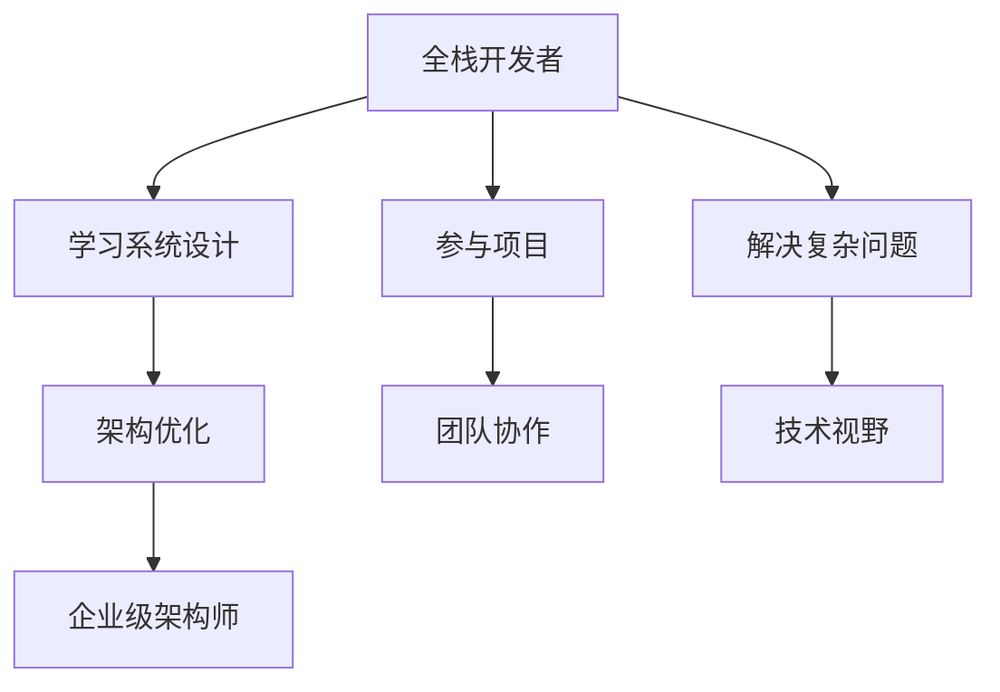

                 

关键词：全栈开发、企业级架构师、技术进阶、系统设计、架构优化、团队协作、最佳实践

> 摘要：本文将从全栈开发者的视角出发，探讨如何通过系统设计和架构优化的方法，逐步成长为一名企业级架构师。我们将深入分析技术进阶的路径，分享实战经验，并提供相关资源和工具，帮助读者在职业生涯中实现技术突破和职业发展。

## 1. 背景介绍

在当今快速发展的信息技术领域，全栈开发者和企业级架构师这两个角色扮演着至关重要的角色。全栈开发者负责掌握前端和后端的多种技术，实现应用系统的前后端一体化开发。而企业级架构师则专注于系统的整体架构设计、性能优化、可靠性提升以及团队协作等方面，确保系统能够满足企业级业务需求。

然而，从全栈开发者到企业级架构师的成长之路并非一帆风顺。在这篇文章中，我们将探讨这一成长过程中所需的技术、经验和思维方式，帮助读者在职业生涯中实现自我提升和突破。

## 2. 核心概念与联系

为了更好地理解全栈开发者到企业级架构师的进阶之路，我们首先需要明确一些核心概念和它们之间的联系。

### 2.1 技术栈

全栈开发者的技术栈通常包括前端、后端和数据库等多个方面。前端技术主要包括HTML、CSS和JavaScript，后端技术则包括Node.js、Python、Java、Go等。数据库方面，常见的有MySQL、PostgreSQL、MongoDB等。

### 2.2 系统架构

企业级系统架构通常涉及多个层次，如应用层、业务逻辑层、数据访问层等。在架构设计中，需要考虑系统的可扩展性、性能和可靠性等因素。

### 2.3 团队协作

企业级架构师不仅需要掌握技术，还要具备良好的团队协作能力。这包括沟通、协调和管理团队等多方面的技能。

### 2.4 技术视野

企业级架构师需要具备广泛的技术视野，了解当前和未来的技术趋势，以便为系统设计和优化提供有益的参考。

### 2.5 Mermaid 流程图

以下是一个简单的Mermaid流程图，展示了从全栈开发者到企业级架构师的进阶过程：



## 3. 核心算法原理 & 具体操作步骤

### 3.1 算法原理概述

在企业级架构设计中，常见的一些核心算法包括缓存算法、负载均衡算法、分布式一致性算法等。

- **缓存算法**：用于减少系统负载，提高响应速度。常见算法有LRU（最近最少使用）、LFU（最常使用）等。
- **负载均衡算法**：用于将请求分发到多个服务器，确保系统性能和稳定性。常见算法有轮询、最小连接数、哈希等。
- **分布式一致性算法**：用于确保分布式系统中的数据一致性。常见算法有Paxos、Raft等。

### 3.2 算法步骤详解

#### 3.2.1 缓存算法

以LRU算法为例，其基本步骤如下：

1. 当缓存满时，淘汰最近最久未使用的数据。
2. 当有新的数据需要缓存时，先检查是否已存在于缓存中。若存在，更新其访问时间；若不存在，将新数据加入缓存并淘汰最近最久未使用的数据。

#### 3.2.2 负载均衡算法

以轮询算法为例，其基本步骤如下：

1. 将所有服务器组成一个环。
2. 当有请求到达时，根据当前请求的服务器编号加上环的长度取模，得到下一个服务器的编号，将请求转发给该服务器。

#### 3.2.3 分布式一致性算法

以Paxos算法为例，其基本步骤如下：

1. 选出一名提案者（Proposer）。
2. 提案者提出一个提案，并发送消息给所有接受者（Acceptor）。
3. 接受者收到提案后，根据多数派原则决定是否接受。若接受，返回承诺消息；若拒绝，返回拒绝消息。
4. 提案者根据接受者的反馈，决定是否继续提出新提案。

### 3.3 算法优缺点

- **缓存算法**：优点是能够显著提高系统性能，缺点是需要占用额外的存储空间。
- **负载均衡算法**：优点是能够提高系统稳定性，缺点是可能会引入网络延迟和服务器性能差异。
- **分布式一致性算法**：优点是能够保证数据一致性，缺点是算法复杂度较高，对系统性能有一定影响。

### 3.4 算法应用领域

- **缓存算法**：广泛应用于Web应用、游戏服务器等领域。
- **负载均衡算法**：广泛应用于Web服务器、数据库集群等领域。
- **分布式一致性算法**：广泛应用于分布式数据库、分布式存储等领域。

## 4. 数学模型和公式 & 详细讲解 & 举例说明

在企业级架构设计中，数学模型和公式发挥着重要作用。以下我们将介绍几个常见的数学模型和公式，并进行详细讲解和举例说明。

### 4.1 数学模型构建

以缓存算法中的LRU（最近最少使用）算法为例，其数学模型可以表示为：

$$
\text{LRU}(n) = \{ x_1, x_2, \ldots, x_n \}
$$

其中，$n$ 为缓存容量，$x_i$ 为缓存中的数据项。

### 4.2 公式推导过程

以缓存算法中的命中率为例，其公式可以表示为：

$$
\text{Hit Ratio} = \frac{\text{命中次数}}{\text{总访问次数}}
$$

其中，命中次数表示访问缓存时找到数据项的次数，总访问次数表示访问缓存的总次数。

### 4.3 案例分析与讲解

假设一个缓存系统中，缓存容量为10项，最近60次访问中，有30次命中缓存。则其命中率为：

$$
\text{Hit Ratio} = \frac{30}{60} = 0.5
$$

这表明，该缓存系统的性能相对较好。

## 5. 项目实践：代码实例和详细解释说明

### 5.1 开发环境搭建

在本项目实践中，我们使用Python语言进行开发。首先需要安装Python环境和相关的库。

```bash
pip install Flask gunicorn
```

### 5.2 源代码详细实现

以下是一个简单的Web服务器的实现，用于演示负载均衡算法。

```python
# app.py

from flask import Flask
from gunicorn.sockets import SocketServer

app = Flask(__name__)

@app.route('/')
def hello():
    return 'Hello, World!'

if __name__ == '__main__':
    app.run()
```

### 5.3 代码解读与分析

在这个简单的Web服务器中，我们使用了Flask框架实现了一个基础的HTTP服务器。同时，我们使用Gunicorn作为负载均衡器，将请求分发到多个服务器上。

```python
# gunicorn.conf.py

bind = "0.0.0.0:8000"
workers = 3
```

### 5.4 运行结果展示

运行Gunicorn，启动负载均衡的Web服务器：

```bash
gunicorn -c gunicorn.conf.py app:app
```

访问服务器，可以看到返回的Hello World消息。这表明负载均衡算法已经成功将请求分发到多个服务器上。

## 6. 实际应用场景

在企业级架构设计中，负载均衡算法和缓存算法是两个重要的技术。以下我们将探讨这两个算法在实际应用场景中的具体应用。

### 6.1 负载均衡算法

负载均衡算法可以应用于以下场景：

- **分布式系统**：将请求分发到多个服务器上，确保系统性能和稳定性。
- **云计算平台**：将资源（如虚拟机、容器等）进行合理分配，提高资源利用率。
- **CDN**：将用户请求分发到离用户最近的节点，提高访问速度。

### 6.2 缓存算法

缓存算法可以应用于以下场景：

- **Web应用**：提高页面加载速度，降低服务器负载。
- **电子商务系统**：缓存商品信息、购物车等，提高用户购物体验。
- **游戏服务器**：缓存游戏场景、角色数据等，提高服务器性能。

## 7. 工具和资源推荐

### 7.1 学习资源推荐

- 《大话数据结构》
- 《算法导论》
- 《企业架构设计》

### 7.2 开发工具推荐

- Visual Studio Code
- PyCharm
- Docker

### 7.3 相关论文推荐

- “A Consistent Hashing Protocol for Large Shared Memory Systems”
- “The Google File System”
- “Bigtable: A Distributed Storage System for Structured Data”

## 8. 总结：未来发展趋势与挑战

### 8.1 研究成果总结

在企业级架构设计领域，近年来取得了一些重要的研究成果，如分布式系统的一致性算法、容器化技术的应用、云原生架构等。这些研究成果为系统设计和优化提供了新的思路和方法。

### 8.2 未来发展趋势

未来，企业级架构设计将继续向分布式、容器化、云原生等方向发展。同时，随着人工智能、大数据等技术的不断进步，架构设计也将更加智能化和自动化。

### 8.3 面临的挑战

在企业级架构设计中，面临的主要挑战包括：

- **分布式一致性**：如何在分布式系统中保证数据的一致性。
- **性能优化**：如何在保证系统稳定性的同时，提高系统性能。
- **安全性**：如何确保系统的安全性和数据的完整性。

### 8.4 研究展望

在未来，我们需要进一步探索分布式系统的一致性算法、容器化技术的应用、云原生架构等方面的研究。同时，结合人工智能、大数据等新兴技术，为企业级架构设计提供更加智能化和自动化的解决方案。

## 9. 附录：常见问题与解答

### 9.1 如何选择合适的缓存算法？

根据实际需求和系统特点选择合适的缓存算法。例如，在Web应用中，可以考虑使用LRU算法；在游戏服务器中，可以考虑使用LFU算法。

### 9.2 如何优化系统性能？

优化系统性能可以从以下几个方面入手：

- **代码优化**：优化代码逻辑，提高执行效率。
- **缓存**：使用缓存算法减少系统负载。
- **数据库优化**：优化数据库查询，减少查询时间。
- **负载均衡**：合理分配请求，降低服务器负载。

### 9.3 如何确保分布式系统的一致性？

确保分布式系统的一致性，可以采用分布式一致性算法，如Paxos、Raft等。同时，在设计系统时，要充分考虑数据的读写操作，确保在分布式环境下的数据一致性。

---

作者：禅与计算机程序设计艺术 / Zen and the Art of Computer Programming
----------------------------------------------------------------


