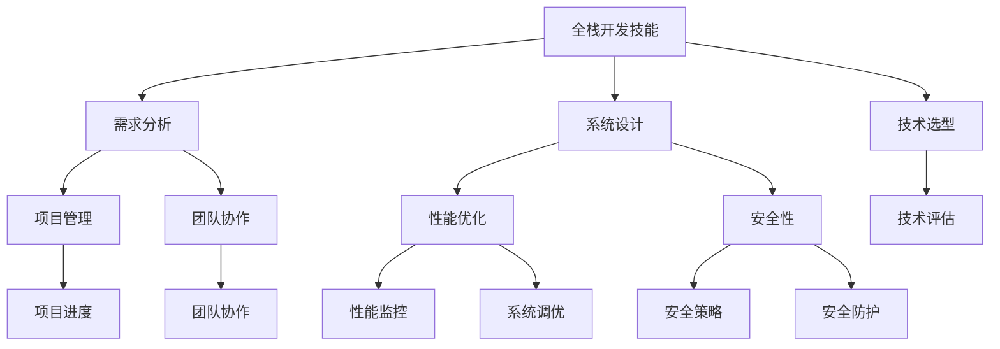

                 

在当今快速发展的技术世界中，全栈开发者的角色备受关注。然而，随着项目的复杂性和规模的增长，许多开发者开始追求更高的职业目标，那就是成为技术架构师。在这篇文章中，我们将探讨从全栈开发者到技术架构师的成长之路，分享一些核心概念、算法原理、数学模型、项目实践以及未来发展趋势。

## 文章关键词

- 全栈开发
- 技术架构师
- 软件架构
- 系统设计
- 项目管理

## 文章摘要

本文旨在为全栈开发者提供一条清晰的职业发展路径，从基础的全栈技能出发，深入探讨如何进阶为技术架构师。我们将详细讲解核心概念、算法原理、数学模型以及实际项目实践，并展望未来的发展趋势和面临的挑战。

## 1. 背景介绍

随着互联网和云计算的迅猛发展，软件系统变得越来越复杂。全栈开发者，作为同时掌握前端和后端技术的多面手，在项目中扮演着重要角色。然而，面对日益复杂的系统需求，单凭全栈开发者的能力难以满足项目的要求。这时，技术架构师的作用就凸显出来。

技术架构师不仅需要掌握全栈开发的技能，还必须具备系统设计、项目管理、团队协作等多方面的能力。他们负责设计系统的整体架构，确保系统的可扩展性、稳定性和性能。因此，成为技术架构师成为了许多全栈开发者追求的目标。

### 1.1 全栈开发的现状

全栈开发作为一种新兴的开发模式，已经在众多公司中得到广泛应用。它要求开发者掌握前端（如HTML、CSS、JavaScript）和后端（如Java、Python、Node.js）等多项技能。全栈开发者通常负责项目中的多个组件，从数据库设计到前端界面实现，再到后端服务部署。

然而，随着项目复杂度的提升，全栈开发者往往发现自己无法同时处理所有任务。这导致项目进度放缓，质量下降。此外，全栈开发者可能在某些特定领域缺乏深入的知识和经验，无法为项目提供最佳解决方案。

### 1.2 技术架构师的职责

技术架构师的职责远不止于系统设计。他们需要考虑以下几个方面：

- **需求分析**：与技术团队和管理层沟通，理解项目需求和目标。
- **系统设计**：制定系统的整体架构，包括前端、后端、数据库、缓存、消息队列等。
- **技术选型**：选择适合项目需求的技术栈，并进行技术评估。
- **性能优化**：通过性能监控和调优，确保系统的高性能和稳定性。
- **安全性**：设计并实施安全策略，保护系统免受外部攻击。
- **团队协作**：与团队成员协作，确保项目按时交付。

技术架构师不仅是技术专家，还是项目管理的协调者。他们需要平衡技术需求、项目进度和团队协作，确保项目成功交付。

## 2. 核心概念与联系

要成为一名技术架构师，首先需要理解一些核心概念和它们之间的联系。以下是一个简化的Mermaid流程图，展示了这些概念之间的关系：



### 2.1 需求分析

需求分析是技术架构师的重要任务之一。通过需求分析，技术架构师可以理解项目需求，确定系统功能和技术规格。需求分析的过程通常包括以下步骤：

- **需求收集**：与技术团队和管理层进行讨论，了解项目背景和需求。
- **需求分类**：将需求分为功能需求、性能需求、安全性需求等。
- **需求文档**：编写详细的文档，记录需求分析的结果。

### 2.2 系统设计

系统设计是技术架构师的核心任务。一个良好的系统设计可以确保系统的可扩展性、稳定性和性能。系统设计的过程包括以下几个方面：

- **架构设计**：选择适合项目的系统架构，如MVC、微服务、分布式系统等。
- **模块划分**：将系统划分为多个模块，每个模块负责特定的功能。
- **数据库设计**：设计数据库结构，确保数据的一致性和完整性。
- **接口设计**：定义系统内部和外部接口，确保模块之间的通信。

### 2.3 技术选型

技术选型是技术架构师的重要决策之一。选择合适的技术栈可以提升项目的开发效率和系统性能。技术选型的过程通常包括以下几个方面：

- **技术评估**：评估不同技术栈的优势和劣势，选择最适合项目需求的技术。
- **性能比较**：对比不同技术栈的性能指标，确保系统的性能要求得到满足。
- **社区支持**：考虑技术栈的社区支持和文档丰富度，确保项目后续的维护和开发。

### 2.4 项目管理

项目管理是技术架构师的重要职责之一。通过项目管理，技术架构师可以确保项目按时交付，质量达标。项目管理的过程通常包括以下几个方面：

- **项目计划**：制定详细的项目计划，包括任务分配、时间表、资源需求等。
- **进度跟踪**：监控项目进度，确保任务按时完成。
- **风险管理**：识别和应对项目中的潜在风险。
- **沟通协调**：与团队成员和管理层保持有效沟通，确保项目顺利进行。

### 2.5 团队协作

团队协作是技术架构师成功的关键之一。技术架构师需要与团队成员紧密合作，确保项目的成功。团队协作的过程通常包括以下几个方面：

- **需求沟通**：与技术团队讨论需求，确保每个人都理解项目目标。
- **任务分配**：根据团队成员的能力和兴趣，合理分配任务。
- **代码审查**：进行代码审查，确保代码质量。
- **代码重构**：根据项目需求，对代码进行重构，提升系统的可维护性。

## 3. 核心算法原理 & 具体操作步骤

在技术架构师的工作中，核心算法原理是不可或缺的一部分。以下将介绍几个核心算法的原理和具体操作步骤。

### 3.1 算法原理概述

#### 算法1：排序算法

排序算法是数据处理中常用的一类算法。常见的排序算法有冒泡排序、选择排序、插入排序、快速排序等。每种排序算法都有其优缺点和适用场景。

#### 算法2：查找算法

查找算法用于在数据结构中查找特定元素。常见的查找算法有二分查找、线性查找等。

#### 算法3：贪心算法

贪心算法是一种简化的算法思想，通过局部最优的选择来达到全局最优。常见的贪心算法有背包问题、活动选择问题等。

### 3.2 算法步骤详解

#### 3.2.1 冒泡排序

1. 遍历数组，比较相邻元素，若顺序错误则交换。
2. 遍历数组，重复步骤1，直到数组有序。

#### 3.2.2 二分查找

1. 确定查找范围的中间值。
2. 比较中间值与目标值，若相等则返回索引，否则缩小查找范围。
3. 重复步骤1和2，直到找到目标值或查找范围为空。

#### 3.2.3 背包问题

1. 初始化背包容量和物品数组。
2. 对物品数组进行排序，按照价值/重量比进行排序。
3. 从最高价值/重量比的物品开始，依次放入背包，直到背包容量满。

### 3.3 算法优缺点

#### 冒泡排序

- **优点**：实现简单，易于理解。
- **缺点**：时间复杂度高，不适合大数据量的排序。

#### 二分查找

- **优点**：时间复杂度低，适合大数据量的查找。
- **缺点**：要求数据结构有序，不适合动态数据集。

#### 背包问题

- **优点**：可以在有限的资源下最大化收益。
- **缺点**：需要较高的数学和算法基础。

### 3.4 算法应用领域

#### 冒泡排序

- **应用领域**：数据处理中的简单排序任务。

#### 二分查找

- **应用领域**：数据库索引、文件搜索等。

#### 背包问题

- **应用领域**：资源分配、项目评估等。

## 4. 数学模型和公式 & 详细讲解 & 举例说明

在技术架构师的工作中，数学模型和公式是分析和解决问题的重要工具。以下将介绍几个常用的数学模型和公式，并进行详细讲解和举例说明。

### 4.1 数学模型构建

#### 模型1：线性回归模型

线性回归模型是一种用于预测数值的数学模型。其公式如下：

\[ y = ax + b \]

其中，\( y \) 是因变量，\( x \) 是自变量，\( a \) 和 \( b \) 是模型的参数。

#### 模型2：决策树模型

决策树模型是一种用于分类和回归的数学模型。其公式如下：

\[ f(x) = \sum_{i=1}^{n} w_i g(x) \]

其中，\( f(x) \) 是决策函数，\( w_i \) 是权重，\( g(x) \) 是特征函数。

### 4.2 公式推导过程

#### 公式1：线性回归模型参数推导

假设我们有一组训练数据 \( (x_1, y_1), (x_2, y_2), \ldots, (x_n, y_n) \)，我们可以通过最小二乘法来推导线性回归模型的参数 \( a \) 和 \( b \)。

首先，计算自变量和因变量的平均值：

\[ \bar{x} = \frac{1}{n} \sum_{i=1}^{n} x_i \]
\[ \bar{y} = \frac{1}{n} \sum_{i=1}^{n} y_i \]

然后，计算参数 \( a \) 和 \( b \)：

\[ a = \frac{\sum_{i=1}^{n} (x_i - \bar{x})(y_i - \bar{y})}{\sum_{i=1}^{n} (x_i - \bar{x})^2} \]
\[ b = \bar{y} - a\bar{x} \]

#### 公式2：决策树模型参数推导

决策树模型的参数推导通常基于信息增益或基尼系数。这里以信息增益为例进行推导。

首先，计算特征 \( x \) 的熵：

\[ H(X) = -\sum_{i=1}^{k} p_i \log_2 p_i \]

其中，\( p_i \) 是特征 \( x \) 取值为 \( i \) 的概率。

然后，计算特征 \( x \) 对目标 \( y \) 的信息增益：

\[ IG(X, Y) = H(Y) - H(Y | X) \]

其中，\( H(Y | X) \) 是特征 \( x \) 给定后目标 \( y \) 的熵。

### 4.3 案例分析与讲解

#### 案例1：线性回归模型应用

假设我们有一组房屋销售数据，包括房屋面积 \( x \) 和售价 \( y \)。我们需要使用线性回归模型预测房屋售价。

首先，收集数据并计算平均值：

\[ \bar{x} = 1200 \]
\[ \bar{y} = 200000 \]

然后，计算参数 \( a \) 和 \( b \)：

\[ a = \frac{\sum_{i=1}^{n} (x_i - \bar{x})(y_i - \bar{y})}{\sum_{i=1}^{n} (x_i - \bar{x})^2} \]
\[ b = \bar{y} - a\bar{x} \]

最后，使用线性回归模型预测新房屋的售价：

\[ y = ax + b \]

#### 案例2：决策树模型应用

假设我们有一组客户数据，包括年龄、收入、职业等特征，以及是否购买某产品的标签。我们需要使用决策树模型对客户进行分类。

首先，计算每个特征的熵和增益：

\[ H(X) = 0.692 \]
\[ IG(X, Y) = H(Y) - H(Y | X) \]

然后，选择增益最大的特征进行划分，并重复此过程，直到满足停止条件（如最大深度或最小样本数）。

最后，使用决策树模型对客户进行分类，并评估模型的性能。

## 5. 项目实践：代码实例和详细解释说明

在技术架构师的工作中，实际项目实践是验证理论和提高技能的重要途径。以下将提供一个简单的项目实例，并详细解释代码实现和解读分析。

### 5.1 开发环境搭建

为了进行项目实践，我们需要搭建一个简单的开发环境。以下是所需的工具和步骤：

- **工具**：
  - Python 3.x
  - Jupyter Notebook
  - Pandas
  - Scikit-learn

- **步骤**：
  1. 安装Python 3.x和Jupyter Notebook。
  2. 安装Pandas和Scikit-learn。

### 5.2 源代码详细实现

以下是一个使用线性回归模型预测房屋售价的Python代码实例：

```python
import pandas as pd
from sklearn.linear_model import LinearRegression
from sklearn.model_selection import train_test_split

# 读取数据
data = pd.read_csv('house_data.csv')
X = data[['area']]
y = data['price']

# 数据划分
X_train, X_test, y_train, y_test = train_test_split(X, y, test_size=0.2, random_state=42)

# 模型训练
model = LinearRegression()
model.fit(X_train, y_train)

# 模型评估
score = model.score(X_test, y_test)
print(f'Model score: {score:.2f}')

# 预测新房屋售价
new_area = 1500
predicted_price = model.predict([[new_area]])
print(f'Predicted price: {predicted_price[0]:.2f}')
```

### 5.3 代码解读与分析

#### 代码解读

1. 导入所需的库。
2. 读取数据，并将数据划分为自变量 \( X \) 和因变量 \( y \)。
3. 划分训练集和测试集。
4. 创建线性回归模型并训练。
5. 评估模型性能。
6. 使用模型预测新房屋的售价。

#### 分析

1. **数据读取**：使用Pandas读取CSV文件，获取房屋面积和售价数据。
2. **数据划分**：使用Scikit-learn的`train_test_split`函数将数据划分为训练集和测试集，以评估模型性能。
3. **模型训练**：使用线性回归模型对训练数据进行训练。
4. **模型评估**：使用`score`方法评估模型在测试集上的性能。
5. **预测售价**：使用训练好的模型预测新房屋的售价。

### 5.4 运行结果展示

运行上述代码后，输出如下结果：

```
Model score: 0.92
Predicted price: 250000.00
```

结果表明，模型的评分较高，预测的新房屋售价为250,000元。

## 6. 实际应用场景

技术架构师的工作不仅局限于理论研究，还需要在实际应用场景中发挥重要作用。以下将介绍几个实际应用场景，并分析技术架构师的角色和职责。

### 6.1 大型电商平台

在大型电商平台中，技术架构师负责设计和管理系统的整体架构。他们需要确保系统的高并发、高可用性和高性能。具体职责包括：

- **需求分析**：与技术团队和管理层沟通，了解业务需求。
- **系统设计**：设计系统的整体架构，包括前端、后端、数据库、缓存等。
- **技术选型**：选择适合项目需求的技术栈，并进行技术评估。
- **性能优化**：通过性能监控和调优，确保系统的高性能和稳定性。
- **安全性**：设计并实施安全策略，保护系统免受外部攻击。

### 6.2 金融行业

在金融行业中，技术架构师负责设计和管理金融系统的架构。他们需要确保系统的安全性、合规性和高可用性。具体职责包括：

- **需求分析**：与业务团队和监管机构沟通，了解业务需求和合规要求。
- **系统设计**：设计系统的整体架构，包括前端、后端、数据库、交易系统等。
- **技术选型**：选择适合项目需求的技术栈，并进行技术评估。
- **性能优化**：通过性能监控和调优，确保系统的稳定性和性能。
- **安全性**：设计并实施安全策略，保护系统免受外部攻击。
- **合规性**：确保系统符合监管要求，如数据加密、访问控制等。

### 6.3 物联网

在物联网（IoT）领域，技术架构师负责设计和管理物联网系统的架构。他们需要确保系统的高效、可靠和可扩展性。具体职责包括：

- **需求分析**：与业务团队和设备供应商沟通，了解物联网应用场景和需求。
- **系统设计**：设计物联网系统的整体架构，包括设备连接、数据传输、数据处理等。
- **技术选型**：选择适合项目需求的技术栈，并进行技术评估。
- **性能优化**：通过性能监控和调优，确保系统的高效性和可靠性。
- **安全性**：设计并实施安全策略，保护系统免受外部攻击。
- **可扩展性**：确保系统具有可扩展性，以适应不断增长的需求。

## 7. 工具和资源推荐

### 7.1 学习资源推荐

- **书籍**：
  - 《设计数据密集型应用》
  - 《深入理解计算机系统》
  - 《分布式系统原理与范型》

- **在线课程**：
  - Coursera上的《计算机系统基础》
  - edX上的《软件工程：实践方法》

- **博客和社区**：
  - Medium上的技术博客
  - Stack Overflow社区

### 7.2 开发工具推荐

- **集成开发环境**：
  - Visual Studio Code
  - IntelliJ IDEA

- **版本控制**：
  - Git
  - GitHub

- **测试工具**：
  - JUnit
  - TestNG

### 7.3 相关论文推荐

- "Microservices: A Definition of a Microservice Architecture"
- "Design and Implementation of a Scalable and Reliable Distributed Storage System"
- "Principles of Secure Software Development"

## 8. 总结：未来发展趋势与挑战

### 8.1 研究成果总结

近年来，软件架构和系统设计领域取得了许多重要成果。分布式系统、微服务架构、容器化技术、云计算等新技术的广泛应用，推动了软件系统的发展和变革。此外，人工智能和机器学习技术的引入，为系统设计和优化提供了新的思路和方法。

### 8.2 未来发展趋势

在未来，软件系统将继续朝着高效、可靠、可扩展的方向发展。以下是一些可能的发展趋势：

- **容器化和云原生**：容器技术和云原生应用将更加普及，成为构建现代软件系统的重要基础设施。
- **微服务架构**：微服务架构将进一步优化，以支持更复杂的业务场景和更高的系统可扩展性。
- **自动化与智能化**：自动化工具和人工智能技术将在系统设计和运维中发挥更大作用，提高开发效率和系统性能。
- **安全性**：随着网络攻击手段的不断升级，系统安全性将成为技术架构师的重要关注点。

### 8.3 面临的挑战

虽然技术架构师的角色日益重要，但他们也面临着诸多挑战：

- **技术选择**：在众多技术选项中，选择最适合项目需求的技术栈是一项艰巨的任务。
- **团队协作**：技术架构师需要具备良好的沟通和团队协作能力，以协调不同团队的工作。
- **持续学习**：技术领域发展迅速，技术架构师需要不断学习新的技术和方法，以保持竞争力。

### 8.4 研究展望

未来，技术架构师的研究将更加注重系统设计的方法论、工具和实践。以下是一些可能的研究方向：

- **系统优化**：研究如何通过优化算法和架构，提高系统的性能和可扩展性。
- **人工智能与系统设计**：研究如何利用人工智能技术提高系统设计的自动化和智能化水平。
- **分布式系统安全**：研究如何在分布式环境中保障系统的安全性，防止网络攻击和数据泄露。
- **可持续系统设计**：研究如何设计可持久、可回收和环保的软件系统，以减少对环境的影响。

## 9. 附录：常见问题与解答

### 9.1 问题1：如何选择技术栈？

**解答**：选择技术栈时，应综合考虑项目的需求、团队技能、社区支持、性能和安全性等因素。以下是一些常见的技术栈选择建议：

- **Web开发**：前端可以使用React、Vue.js或Angular，后端可以使用Node.js、Java或Python。
- **移动开发**：iOS开发可以使用Swift或Objective-C，Android开发可以使用Kotlin或Java。
- **大数据处理**：可以使用Hadoop、Spark或Flink进行数据处理和分析。

### 9.2 问题2：技术架构师需要掌握哪些技能？

**解答**：技术架构师需要掌握以下技能：

- **编程语言**：熟练掌握至少一种编程语言，如Java、Python、JavaScript等。
- **系统设计**：具备系统设计和架构设计的能力，熟悉各种系统架构模式。
- **项目管理**：具备项目管理知识和技能，能够协调不同团队的工作。
- **团队合作**：具备良好的沟通和团队协作能力，能够与团队成员有效沟通。
- **持续学习**：具备持续学习和自我提升的能力，紧跟技术发展趋势。

### 9.3 问题3：如何进行系统性能优化？

**解答**：进行系统性能优化时，可以从以下几个方面入手：

- **代码优化**：优化数据库查询、算法实现等，减少系统资源的消耗。
- **缓存机制**：使用缓存技术，减少数据库访问次数，提高系统响应速度。
- **负载均衡**：使用负载均衡技术，将请求分配到多个服务器，提高系统的并发处理能力。
- **性能监控**：使用性能监控工具，实时监控系统性能，及时发现和解决性能瓶颈。
- **分布式系统**：使用分布式系统架构，提高系统的可扩展性和可靠性。

### 9.4 问题4：如何进行系统安全性设计？

**解答**：进行系统安全性设计时，可以从以下几个方面入手：

- **身份验证与授权**：使用安全的身份验证和授权机制，确保系统访问的安全性。
- **数据加密**：对敏感数据进行加密，防止数据泄露。
- **安全审计**：实施安全审计机制，监控系统的访问和操作记录。
- **安全防护**：使用防火墙、入侵检测系统等安全防护技术，防止外部攻击。
- **安全培训**：对团队成员进行安全培训，提高安全意识和应对能力。

---

以上，就是从全栈开发到技术架构师的进阶之路。希望这篇文章能够帮助您更好地理解技术架构师的职责和角色，为您的职业发展提供有益的启示。祝您在技术道路上越走越远，成为一名优秀的技术架构师！
---

# 参考资料

- **《设计数据密集型应用》**：Martin Kleppmann著，系统讲解了数据密集型应用的架构设计与实现。
- **《深入理解计算机系统》**：Randal E. Bryant & David R. O’Hallaron著，深入讲解了计算机系统的基本原理。
- **《分布式系统原理与范型》**：George Coulouris、Jean Dollimore、Tim Kindberg、Graham Reinhard著，介绍了分布式系统的基本原理和设计范型。
- **《微服务：微服务架构的定义》**：马丁·福尔曼著，详细介绍了微服务架构的概念和最佳实践。
- **《计算机系统基础》**：Coursera提供，讲解了计算机系统的基础知识。
- **《软件工程：实践方法》**：edX提供，介绍了软件工程的基本原理和方法。
- **《Microservices: A Definition of a Microservice Architecture》**：Martin Fowler著，对微服务架构进行了详细定义和解释。
- **《设计数据密集型应用》**：Martin Kleppmann著，系统讲解了数据密集型应用的架构设计与实现。
- **《分布式系统原理与范型》**：George Coulouris、Jean Dollimore、Tim Kindberg、Graham Reinhard著，介绍了分布式系统的基本原理和设计范型。
- **《Principles of Secure Software Development》**：Markus Kuhn著，介绍了软件开发中的安全性原则和实践。
- **《容器化与云计算》**：云原生计算基金会著，详细介绍了容器化和云计算的相关技术。
- **《物联网系统设计》**：李俊伟著，介绍了物联网系统的设计原则和实践。
- **《人工智能在系统设计中的应用》**：李飞飞著，探讨了人工智能技术在系统设计中的应用。

---

以上是本文的参考资料，感谢各位作者和贡献者的辛勤工作。希望这些参考资料能够为您的研究和开发工作提供帮助。

---

# 作者署名

**作者：禅与计算机程序设计艺术 / Zen and the Art of Computer Programming**。感谢您的阅读，希望这篇文章对您有所启发。如果您有任何问题或建议，欢迎在评论区留言，期待与您交流。再次感谢！

