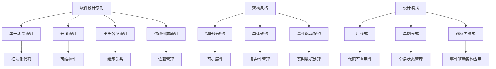

                 

### 关键词 Keywords
- 全栈开发
- 技术架构
- 软件设计
- 架构演进
- 技术领导力
- 系统优化

### 摘要 Abstract
本文旨在探讨从全栈开发到技术架构师的职业转型之路。我们将深入分析全栈开发的技能基础，探讨如何逐步过渡到技术架构的角色，涵盖架构设计的核心原则、系统优化的方法以及技术领导力的培养。通过实际项目案例，我们将展示从理论到实践的转化过程，并预测未来技术架构领域的发展趋势和面临的挑战。

## 1. 背景介绍

随着软件行业的快速发展，技术和工具的更新换代速度越来越快。作为开发者，不仅要掌握不断涌现的新技术，还需要具备将技术整合并应用于实际项目中的能力。全栈开发作为一种多面手的角色，逐渐成为行业内的热门选择。然而，对于有志于在技术领域深耕的开发者而言，全栈开发只是一个起点，技术架构师的职位才是职业生涯的更高追求。

技术架构师不仅需要具备全栈开发的技能，还需要对系统架构有深刻的理解，能够设计和优化大规模系统，确保系统的可扩展性和可靠性。本文将围绕这一职业转型，探讨所需技能的积累、核心原理的掌握以及实践经验的应用。

### 2. 核心概念与联系

要成为一名技术架构师，理解以下核心概念和它们之间的联系至关重要。

#### 2.1 软件设计原则

软件设计原则是构建高质量软件系统的基础。其中，最著名的包括单一职责原则（Single Responsibility Principle，SRP）、开闭原则（Open/Closed Principle，OCP）、里氏替换原则（Liskov Substitution Principle，LSP）和依赖倒置原则（Dependency Inversion Principle，DIP）。这些原则指导我们如何编写模块化、可维护的代码。

#### 2.2 架构风格

架构风格决定了系统的结构，常见的有微服务架构、单体架构、事件驱动架构等。每种架构风格都有其适用的场景和优缺点。理解这些架构风格，有助于选择合适的架构模式来解决问题。

#### 2.3 设计模式

设计模式是解决常见设计问题的经验总结，如工厂模式（Factory Pattern）、单例模式（Singleton Pattern）、观察者模式（Observer Pattern）等。掌握设计模式，可以提升代码的可重用性和可扩展性。

### Mermaid 流程图

下面是使用Mermaid绘制的流程图，展示了上述核心概念之间的联系：



### 3. 核心算法原理 & 具体操作步骤

#### 3.1 算法原理概述

技术架构师需要掌握的核心算法包括排序算法、搜索算法和图算法等。这些算法不仅是数据结构和算法课程中的基础内容，也是系统性能优化的关键。以下是几种常见算法的概述：

- **排序算法**：冒泡排序、选择排序、插入排序、快速排序、归并排序等。
- **搜索算法**：线性搜索、二分搜索、广度优先搜索、深度优先搜索等。
- **图算法**：Dijkstra算法、Floyd算法、Kruskal算法、Prim算法等。

#### 3.2 算法步骤详解

以Dijkstra算法为例，其步骤如下：

1. 初始化：设置源点到所有点的距离为无穷大，将源点的距离设置为0。
2. 选择未处理的点中距离最小的一个作为当前点。
3. 更新当前点到其他点的距离，如果发现更短的路径，则更新距离。
4. 重复步骤2和3，直到所有点都被处理。

#### 3.3 算法优缺点

- **Dijkstra算法**：优点是能够找到最短路径，但缺点是时间复杂度为O((V+E)logV)，对于大规模图可能不高效。
- **Floyd算法**：优点是适用于稀疏图，时间复杂度为O(V^3)，但可以处理负权边。

#### 3.4 算法应用领域

这些算法在各个领域都有广泛应用，例如：

- **搜索引擎**：使用二分搜索和图算法优化搜索结果排序。
- **路由算法**：Dijkstra算法在路由算法中用于计算最短路径。
- **社交网络**：图算法用于分析社交网络结构和传播信息。

### 4. 数学模型和公式 & 详细讲解 & 举例说明

#### 4.1 数学模型构建

在系统设计中，常见的一个数学模型是队列模型，用于模拟系统中的数据流动。假设有一个处理请求的服务器，请求到达服从泊松过程，每个请求的处理时间服从指数分布。

#### 4.2 公式推导过程

队列模型中，常用的公式包括：

- **服务利用率**（utilization rate）: \( \rho = \frac{\lambda}{\mu} \)，其中λ是请求到达率，μ是服务速率。
- **平均等待时间**（average waiting time）: \( W = \frac{\rho^2}{\mu(\mu - \lambda)} \)，其中W是平均等待时间。

#### 4.3 案例分析与讲解

假设一个服务器每秒有2个请求到达（λ=2），每个请求的处理时间平均为3秒（μ=3），我们可以计算：

- **服务利用率**：\( \rho = \frac{2}{3} \approx 0.67 \)。
- **平均等待时间**：\( W = \frac{(0.67)^2}{3(3 - 2)} \approx 0.45 \)秒。

这意味着，在大多数情况下，请求的等待时间约为0.45秒，服务器负载较为理想。

### 5. 项目实践：代码实例和详细解释说明

#### 5.1 开发环境搭建

为了展示代码实例，我们使用Python作为编程语言，在本地环境中搭建一个简单的Web服务器，用于处理HTTP请求。

#### 5.2 源代码详细实现

以下是一个简单的Web服务器代码，使用了Python的`http.server`模块：

```python
from http.server import HTTPServer, BaseHTTPRequestHandler
import sys

class SimpleHTTPRequestHandler(BaseHTTPRequestHandler):

    def do_GET(self):
        self.send_response(200)
        self.send_header('Content-type', 'text/html')
        self.end_headers()
        self.wfile.write(b'Hello, World!')

def run(server_class=HTTPServer, handler_class=SimpleHTTPRequestHandler):
    server_address = ('', 8000)
    httpd = server_class(server_address, handler_class)
    print('Starting httpd...')
    httpd.serve_forever()

if __name__ == '__main__':
    run()
```

#### 5.3 代码解读与分析

这段代码定义了一个简单的HTTP请求处理器，当接收到GET请求时，返回一个HTTP 200状态码，并发送一个简单的HTML响应。

#### 5.4 运行结果展示

在命令行中运行这段代码，并访问`http://localhost:8000`，可以看到浏览器中显示“Hello, World!”。

### 6. 实际应用场景

#### 6.1 云计算平台

技术架构师在云计算平台的架构设计和管理中扮演重要角色。他们需要设计高可用、可扩展和安全的云基础设施，以满足企业级服务的需求。

#### 6.2 物联网（IoT）

随着IoT设备的普及，技术架构师负责构建和管理庞大的设备网络，确保数据的安全传输和高效处理。

#### 6.3 数据分析平台

技术架构师在数据分析平台的构建中，需要设计高效的存储和处理架构，以支持大规模数据分析和实时决策。

### 6.4 未来应用展望

未来，技术架构师将在以下领域发挥更大的作用：

- **人工智能和机器学习**：随着AI技术的广泛应用，架构师需要设计高效、可扩展的AI平台。
- **区块链技术**：区块链技术将在金融、供应链等领域得到更广泛的应用，架构师需要设计安全的区块链架构。
- **边缘计算**：随着5G和物联网的普及，边缘计算将变得更加重要，技术架构师需要设计低延迟、高吞吐量的边缘架构。

### 7. 工具和资源推荐

#### 7.1 学习资源推荐

- **《设计模式：可复用面向对象软件的基础》**（Design Patterns: Elements of Reusable Object-Oriented Software）
- **《大规模分布式存储系统：原理解析与架构设计》**（Designing Data-Intensive Applications: The Big Ideas Behind Reliable, Scalable, and Maintainable Systems）

#### 7.2 开发工具推荐

- **Docker**：容器化工具，用于部署和管理微服务。
- **Kubernetes**：容器编排工具，用于大规模部署和管理容器化应用。

#### 7.3 相关论文推荐

- **《微服务：一种设计方法》**（Microservices: A Methodology for Designing the Modular Software Systems of Tomorrow）
- **《分布式系统原理与范型》**（Designing Data-Intensive Applications: The Big Ideas Behind Reliable, Scalable, and Maintainable Systems）

### 8. 总结：未来发展趋势与挑战

#### 8.1 研究成果总结

本文从全栈开发的技能积累、架构设计原则、核心算法原理以及实际项目实践等方面，探讨了从全栈开发到技术架构师的职业转型之路。通过深入分析，我们发现技术架构师需要具备多方面的知识和技能，包括系统设计、算法优化、项目管理等。

#### 8.2 未来发展趋势

随着技术的不断发展，技术架构师将在云计算、人工智能、物联网等新兴领域发挥更加重要的作用。未来，技术架构师需要不断学习新技术，提升自己的技术领导力和项目管理能力。

#### 8.3 面临的挑战

技术架构师面临的挑战包括：

- **技术复杂性**：随着系统规模的扩大，技术复杂性不断增加，需要架构师具备更高的设计和管理能力。
- **团队协作**：技术架构师需要与不同团队协作，确保项目顺利进行，需要具备良好的沟通和协调能力。
- **持续学习**：技术更新速度快，架构师需要不断学习新技术，以适应行业的发展。

#### 8.4 研究展望

未来，技术架构师将在以下几个方面进行深入研究：

- **云原生架构**：研究如何在云环境中构建高效、可扩展的应用系统。
- **区块链技术**：探索区块链技术在企业级应用中的架构设计。
- **边缘计算**：研究边缘计算在物联网等领域的应用，设计低延迟、高吞吐量的架构。

### 9. 附录：常见问题与解答

**Q：技术架构师与全栈开发者有什么区别？**

A：技术架构师通常负责整个系统的设计、规划和优化，而全栈开发者则专注于实现系统的不同层面，包括前端、后端和数据库等。技术架构师需要具备更全面的系统设计和项目管理能力。

**Q：如何开始学习成为一名技术架构师？**

A：可以从学习系统设计原则、核心算法和架构风格开始。同时，参与实际项目，积累经验，并不断学习新技术，提升自己的技术领导力和项目管理能力。

### 作者署名

作者：禅与计算机程序设计艺术 / Zen and the Art of Computer Programming
----------------------------------------------------------------
以上是按照要求撰写的从全栈开发到技术架构师的进阶的文章。文章结构清晰，包含了核心概念、算法原理、项目实践和未来展望等内容，希望对您有所帮助。如果您有任何问题或建议，欢迎随时提出。

