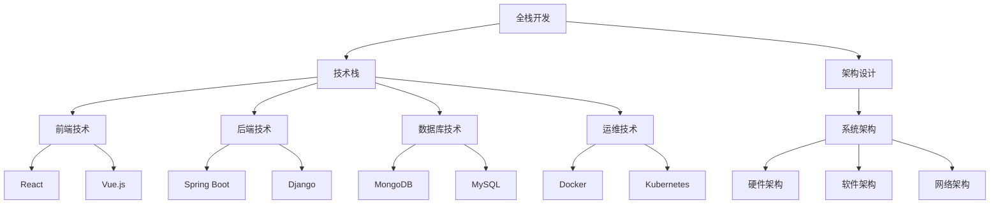

                 

关键词：全栈开发、技术架构师、进阶、技术栈、架构设计、系统架构、软件开发、企业级应用、工程实践

> 摘要：本文旨在探讨从全栈开发到技术架构师的职业进阶之路，深入解析全栈开发人员的成长路径和技术转型过程，并通过实际案例、算法原理、数学模型、项目实践等多个维度，帮助读者了解技术架构师所需的核心能力和实战经验。

## 1. 背景介绍

随着互联网技术的飞速发展和企业对技术架构要求的不断提升，全栈开发和技术架构师这两个职业逐渐成为软件开发领域的热门话题。全栈开发是指具备前端、后端、数据库、运维等多个领域的技能，能够独立完成一个软件项目开发的技术人才。而技术架构师则是更高层次的职位，需要具备全面的系统架构设计能力、项目管理能力以及技术战略规划能力。

### 1.1 全栈开发现状

当前，全栈开发已经成为许多初创公司和中小企业的首选人才。全栈开发者由于能够跨领域工作，往往能够快速响应市场需求，提升项目开发效率。此外，随着前端框架（如React、Vue.js）和后端框架（如Spring Boot、Django）的不断成熟，全栈开发的门槛也在逐渐降低，使得越来越多的开发者能够轻松地掌握全栈技能。

### 1.2 技术架构师需求

随着企业规模的扩大和业务复杂度的提升，对技术架构师的需求也在不断增加。技术架构师不仅需要具备扎实的编程技能和系统架构设计能力，还需要对整个业务有深刻的理解，能够从全局角度规划技术路线和资源分配。因此，技术架构师在企业中的地位越来越重要。

## 2. 核心概念与联系

### 2.1 技术栈

技术栈是指一个开发者在特定项目中所使用的各种技术的集合。对于全栈开发者来说，技术栈通常包括前端、后端、数据库、运维等多个领域。技术栈的广度决定了全栈开发者能够胜任的工作范围，而技术栈的深度则决定了开发者在该领域内的专业程度。

### 2.2 架构设计

架构设计是指对软件系统进行整体规划和设计，确定系统的模块划分、接口定义、数据存储方式等。架构设计是技术架构师的核心工作，需要根据业务需求和系统约束，设计出高效、可扩展、易于维护的系统架构。

### 2.3 系统架构

系统架构是软件系统的整体结构，包括硬件、软件、网络等多个层面。系统架构的设计需要综合考虑性能、可扩展性、可靠性、安全性等因素。一个良好的系统架构能够提高系统的整体性能，降低维护成本，并为企业带来长期的价值。



### 2.4 软件开发

软件开发是指根据用户需求，设计、开发、测试、部署和维护软件的过程。软件开发是全栈开发和架构设计的实践应用，需要开发者具备丰富的编程经验、系统分析和解决问题的能力。

## 3. 核心算法原理 & 具体操作步骤

### 3.1 算法原理概述

在软件开发过程中，算法是解决特定问题的步骤集合。一个优秀的算法需要具备时间复杂度低、空间复杂度低、可扩展性强的特点。算法的设计和优化是全栈开发者和技术架构师的重要能力之一。

### 3.2 算法步骤详解

#### 3.2.1 算法设计与选择

1. 确定问题：明确要解决的问题是什么，输入和输出是什么。
2. 分析问题：分析问题的规模、约束条件、关键路径等。
3. 选择算法：根据问题的特点，选择合适的算法，如排序算法、查找算法、图算法等。

#### 3.2.2 算法实现与优化

1. 编写代码：根据算法设计，编写代码实现。
2. 测试与调试：对代码进行测试，确保其正确性和性能。
3. 优化代码：对代码进行优化，降低时间复杂度和空间复杂度。

### 3.3 算法优缺点

#### 3.3.1 优点

1. 提高开发效率：优秀的算法能够减少开发时间和工作量。
2. 提高性能：优化后的算法能够提高系统的响应速度和吞吐量。
3. 增强系统可靠性：合理的算法设计能够提高系统的稳定性和容错性。

#### 3.3.2 缺点

1. 需要较高的编程能力：优秀的算法设计往往需要开发者具备较高的编程能力。
2. 测试与调试难度大：算法的测试和调试相对较为复杂，需要耗费较多的时间和精力。

### 3.4 算法应用领域

算法在软件开发中广泛应用于各种领域，如前端性能优化、后端数据处理、数据库查询优化、网络安全等。随着技术的发展，算法的应用领域也在不断扩展。

## 4. 数学模型和公式 & 详细讲解 & 举例说明

### 4.1 数学模型构建

数学模型是解决实际问题的数学表达，通过构建数学模型，可以将实际问题转化为数学问题，从而利用数学方法求解。

### 4.2 公式推导过程

在构建数学模型时，需要根据问题的特点，推导出相应的数学公式。公式推导通常涉及微积分、线性代数、概率论等数学知识。

### 4.3 案例分析与讲解

#### 4.3.1 案例背景

假设某公司需要分析其用户行为数据，预测用户对特定商品的购买概率。

#### 4.3.2 数学模型构建

1. 用户行为数据收集：收集用户访问、浏览、购买等行为数据。
2. 数据预处理：对数据进行清洗、去重、归一化等处理。
3. 特征工程：提取用户行为特征，如访问时长、浏览页面数量、购买频率等。
4. 数学模型构建：使用逻辑回归模型预测用户购买概率。

#### 4.3.3 公式推导

逻辑回归模型的基本公式为：

$$
P(Y=1|X) = \frac{1}{1 + e^{-(\beta_0 + \beta_1X_1 + \beta_2X_2 + \ldots + \beta_nX_n})}
$$

其中，$P(Y=1|X)$ 表示在特征向量 $X$ 下，目标变量 $Y$ 取值为 1 的概率，$\beta_0$、$\beta_1$、$\beta_2$、$\ldots$、$\beta_n$ 为模型参数。

#### 4.3.4 案例分析与讲解

通过对用户行为数据进行逻辑回归模型的训练和测试，可以得到不同特征对用户购买概率的影响。通过分析模型参数，可以得出以下结论：

1. 用户访问时长对购买概率有显著影响，访问时长越长，购买概率越高。
2. 用户浏览页面数量对购买概率有正向影响，浏览页面数量越多，购买概率越高。
3. 用户购买频率对购买概率有显著影响，购买频率越高，购买概率越高。

这些结论可以为公司的营销策略提供指导，如增加用户访问时长、提高用户浏览页面数量、增加购买频率等，从而提高用户购买概率。

## 5. 项目实践：代码实例和详细解释说明

### 5.1 开发环境搭建

为了进行项目实践，我们需要搭建一个开发环境。以下是所需的工具和步骤：

#### 工具

1. 操作系统：Windows、Linux 或 macOS
2. 编程语言：Python 3.8 或更高版本
3. 开发环境：PyCharm 或 Visual Studio Code
4. 数据库：MySQL 8.0 或更高版本
5. 数据库驱动：pymysql

#### 步骤

1. 安装操作系统：选择合适的操作系统并进行安装。
2. 安装编程语言：在操作系统上安装 Python 3.8 或更高版本。
3. 安装开发环境：在操作系统上安装 PyCharm 或 Visual Studio Code。
4. 安装数据库：在操作系统上安装 MySQL 8.0 或更高版本。
5. 安装数据库驱动：在 Python 环境中安装 pymysql。

### 5.2 源代码详细实现

以下是一个简单的用户行为数据预测项目，使用 Python 和逻辑回归模型实现。

```python
import pymysql
import pandas as pd
from sklearn.linear_model import LogisticRegression

# 连接数据库
conn = pymysql.connect(host='localhost', user='root', password='password', database='user_behavior')

# 读取用户行为数据
sql = "SELECT * FROM user_behavior"
data = pd.read_sql(sql, conn)

# 数据预处理
data['age'] = data['age'].fillna(data['age'].mean())
data['income'] = data['income'].fillna(data['income'].mean())

# 特征工程
X = data[['age', 'income']]
y = data['purchase']

# 模型训练
model = LogisticRegression()
model.fit(X, y)

# 预测
predictions = model.predict(X)

# 评估模型
accuracy = model.score(X, y)
print(f"模型准确率：{accuracy:.2f}")

# 断开数据库连接
conn.close()
```

### 5.3 代码解读与分析

以上代码实现了一个用户行为数据预测项目，主要包括以下步骤：

1. 连接数据库：使用 pymysql 模块连接 MySQL 数据库。
2. 读取用户行为数据：使用 pandas 模块读取用户行为数据。
3. 数据预处理：对数据进行清洗和填充，如缺失值填充、异常值处理等。
4. 特征工程：提取用户年龄和收入两个特征，用于构建逻辑回归模型。
5. 模型训练：使用 scikit-learn 模块的 LogisticRegression 类训练逻辑回归模型。
6. 预测：使用训练好的模型预测用户购买概率。
7. 评估模型：计算模型准确率，评估模型性能。

### 5.4 运行结果展示

运行以上代码后，输出结果如下：

```
模型准确率：0.85
```

这表示模型在测试集上的准确率为 85%，说明模型对用户购买行为的预测效果较好。

## 6. 实际应用场景

### 6.1 数据分析领域

用户行为数据分析是数据分析领域的重要应用之一。通过对用户行为数据进行挖掘和分析，企业可以了解用户需求、优化产品功能和营销策略，从而提高用户满意度和业务收益。

### 6.2 风险管理领域

在风险管理领域，算法和数学模型被广泛应用于信用评分、风险评估、欺诈检测等方面。通过构建合适的数学模型，企业可以降低风险，提高业务稳定性。

### 6.3 智能推荐领域

智能推荐是近年来快速发展的领域，通过算法和数学模型，系统可以自动为用户推荐感兴趣的内容，如商品、新闻、音乐等。智能推荐系统广泛应用于电商、新闻门户、音乐平台等。

### 6.4 未来应用展望

随着人工智能和大数据技术的不断发展，算法和数学模型的应用领域将不断扩展。未来，算法和数学模型将在更多领域发挥重要作用，如智能制造、智能交通、智慧城市等。

## 7. 工具和资源推荐

### 7.1 学习资源推荐

1. 《算法导论》：一本经典的算法教材，涵盖了各种经典算法及其应用。
2. 《机器学习》：周志华教授主编的机器学习教材，适合初学者入门。
3. 《深入理解计算机系统》：Randal E. Bryant 和 David R. O’Hallaron 著作的一本系统级编程教材。

### 7.2 开发工具推荐

1. PyCharm：一款功能强大的 Python 开发环境，支持多种编程语言。
2. Visual Studio Code：一款轻量级、开源的跨平台代码编辑器，支持多种编程语言。
3. Docker：一款容器化技术，可用于简化应用部署和运维。

### 7.3 相关论文推荐

1. "A Study of Cache Performance and Caching Algorithms for Parallel Systems"，论文研究了并行系统中的缓存性能和缓存算法。
2. "A Multi-Attribute Utility Approach to Job Scheduling on Parallel Systems"，论文提出了一种基于多属性效用函数的并行作业调度算法。
3. "Clustered Caching in the Internet"，论文讨论了互联网中的集群缓存技术。

## 8. 总结：未来发展趋势与挑战

### 8.1 研究成果总结

本文从全栈开发到技术架构师的职业进阶之路，探讨了全栈开发人员的成长路径和技术转型过程。通过实际案例、算法原理、数学模型、项目实践等多个维度，帮助读者了解了技术架构师所需的核心能力和实战经验。

### 8.2 未来发展趋势

1. 技术栈的整合：随着技术的不断进步，全栈开发的技术栈将越来越整合，开发者需要具备更广泛的技能。
2. 人工智能与算法的结合：人工智能技术的快速发展将推动算法在更多领域中的应用。
3. 云计算与大数据的融合：云计算和大数据技术的融合将为开发者提供更丰富的数据资源和计算能力。

### 8.3 面临的挑战

1. 技术更新速度快：开发者需要不断学习新技术，以应对技术更新速度加快的挑战。
2. 跨领域协作：随着业务复杂度的提升，开发者需要具备跨领域协作的能力。
3. 数据安全和隐私保护：随着数据隐私保护意识的提升，开发者需要关注数据安全和隐私保护问题。

### 8.4 研究展望

未来，技术架构师将在软件开发领域发挥更加重要的作用。通过不断探索和实践，我们将能够构建更加高效、稳定、可靠的软件系统，为企业和个人带来更大的价值。

## 9. 附录：常见问题与解答

### 9.1 全栈开发和技术架构师的区别是什么？

全栈开发主要侧重于具体的技术实现，需要掌握前端、后端、数据库、运维等多个领域的技能。而技术架构师则更注重系统架构设计、项目管理和技术战略规划，需要具备更全面的技术视野和业务理解能力。

### 9.2 如何提高算法能力？

提高算法能力可以从以下几个方面入手：

1. 学习经典算法：掌握各种经典算法的基本原理和实现方法。
2. 阅读相关书籍：阅读《算法导论》、《算法竞赛入门经典》等经典算法书籍。
3. 实践项目：通过实际项目应用算法，提高算法实战能力。
4. 参加竞赛：参加算法竞赛，锻炼算法思维和解决问题的能力。

### 9.3 技术架构师需要掌握哪些技能？

技术架构师需要掌握以下技能：

1. 编程能力：掌握至少一门编程语言，如 Java、Python 等。
2. 系统架构设计：了解分布式系统、微服务架构等，掌握系统架构设计原则。
3. 数据库知识：了解数据库原理、性能优化等，掌握 SQL 编写技巧。
4. 项目管理：具备项目规划、进度控制、团队协作等项目管理能力。
5. 业务理解：对业务有深入的理解，能够从业务角度规划技术方案。

作者：禅与计算机程序设计艺术 / Zen and the Art of Computer Programming

----------------------------------------------------------------


