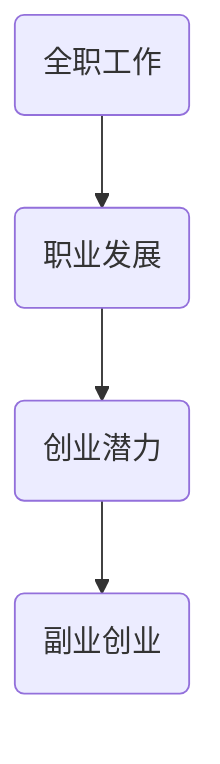

                 

关键词：全职工作、副业创业、职业发展、过渡策略、个人成长

> 摘要：本文旨在为那些想要从全职工作过渡到副业创业的IT专业人士提供实用的指导和建议。通过深入探讨职业发展的路径、创业的挑战与机遇，以及具体的策略和实践，帮助读者更好地规划自己的职业发展，实现从全职工作到副业创业的顺利过渡。

## 1. 背景介绍

在当今快速变化的职场环境中，许多人发现自己对全职工作感到厌倦，渴望拥有更多的自主性和创造力。这种情况下，副业创业成为一种受欢迎的选择。它不仅为个人提供了实现职业梦想的机会，还能够带来额外的收入和职业发展。然而，从全职工作过渡到副业创业并非易事，需要深思熟虑和周密的规划。

本文将探讨以下几个核心问题：

1. **为什么IT专业人士会选择副业创业？**
2. **如何评估自己的创业潜力？**
3. **如何制定副业创业的规划？**
4. **在全职工作中如何为副业做准备？**
5. **如何在时间和资源有限的情况下平衡两者？**
6. **创业初期的关键成功因素是什么？**
7. **如何应对创业过程中的挑战？**

通过解答这些问题，本文希望为那些想要从全职工作过渡到副业创业的IT专业人士提供有价值的参考。

### 2. 核心概念与联系

在讨论从全职工作到副业创业的过渡之前，我们需要明确几个核心概念，并理解它们之间的联系。

#### 2.1 全职工作

全职工作通常是指在一个组织内，每周工作超过30小时的工作安排。这种工作模式为员工提供稳定的收入和职业发展路径，但也可能伴随着工作压力和缺乏自主性。

#### 2.2 副业创业

副业创业是指在保持全职工作的同时，开展自己的业务或项目。这种模式允许个人在追求职业发展的同时，探索创业的机会。副业创业的目的是为了实现自主性和财务自由。

#### 2.3 职业发展

职业发展是指个人在职业生涯中通过学习、成长和积累经验来提升自己的技能和职位。职业发展通常涉及晋升、技能提升和行业转型。

#### 2.4 创业潜力

创业潜力是指个人在创业过程中展现出的能力、特质和机会。它包括创新思维、风险管理能力、市场洞察力和领导力。

这些概念之间的联系在于，全职工作和职业发展提供了稳定的收入和经验积累，而创业潜力则成为了从全职工作过渡到副业创业的关键。

为了更好地理解这些概念，我们可以使用Mermaid流程图来展示它们之间的联系：



### 3. 核心算法原理 & 具体操作步骤

#### 3.1 算法原理概述

从全职工作到副业创业的过渡可以看作是一个多阶段决策过程。以下是这个过程的几个关键步骤：

1. **自我评估**：评估个人兴趣、技能和资源。
2. **市场调研**：研究市场需求和竞争环境。
3. **商业计划**：制定详细的创业计划。
4. **时间管理**：平衡全职工作和副业创业的时间。
5. **资金管理**：确保有足够的资金支持副业。
6. **风险管理**：评估和应对潜在风险。
7. **执行和调整**：执行商业计划，并根据反馈进行调整。

#### 3.2 算法步骤详解

1. **自我评估**

   首先，个人需要评估自己的兴趣、技能和资源。这可以通过以下步骤实现：

   - **兴趣分析**：列出感兴趣的领域和活动。
   - **技能评估**：识别当前拥有的技能和需要学习的技能。
   - **资源梳理**：盘点可用的资源，包括时间、资金和人力。

2. **市场调研**

   接下来，个人需要进行市场调研，以了解市场需求和竞争环境。这可以通过以下步骤实现：

   - **需求分析**：了解潜在客户的需求和痛点。
   - **竞争分析**：研究竞争对手的产品和服务。
   - **市场定位**：确定自己的市场定位和目标客户。

3. **商业计划**

   制定详细的商业计划是过渡到副业创业的关键。商业计划应包括以下内容：

   - **产品/服务描述**：详细描述要提供的产品或服务。
   - **市场策略**：描述如何吸引和保留客户。
   - **运营计划**：描述日常运营和管理流程。
   - **财务计划**：预算和现金流预测。

4. **时间管理**

   在全职工作和副业创业之间平衡时间是一个挑战。以下是一些建议：

   - **时间规划**：制定详细的日程表，包括全职工作和副业时间。
   - **任务优先级**：确定任务的优先级，确保重要任务先完成。
   - **休息和恢复**：确保有足够的休息时间，以维持工作效率。

5. **资金管理**

   资金管理是创业成功的关键。以下是一些建议：

   - **预算编制**：制定详细的预算计划。
   - **资金来源**：确定资金来源，包括自筹资金、贷款或投资者。
   - **现金流管理**：确保有足够的现金流来维持运营。

6. **风险管理**

   评估和应对潜在风险是必要的。以下是一些建议：

   - **风险评估**：识别可能的风险，并评估其影响。
   - **风险应对**：制定应对策略，以减轻风险的影响。
   - **保险**：考虑购买适当的保险来保护自己的业务。

7. **执行和调整**

   执行商业计划，并根据反馈进行调整是成功的关键。以下是一些建议：

   - **执行计划**：按照商业计划执行。
   - **反馈循环**：定期收集反馈，并调整计划。
   - **持续改进**：不断学习和改进，以适应市场变化。

#### 3.3 算法优缺点

这个算法的优点在于提供了一个系统的方法，帮助个人从全职工作顺利过渡到副业创业。它强调自我评估、市场调研、商业计划和风险管理，这些都是创业成功的关键因素。

然而，这个算法也存在一些缺点。首先，它可能需要大量的时间和精力，尤其是在全职工作繁忙的情况下。其次，市场调研和风险评估可能不够准确，导致计划出现问题。最后，执行过程中可能面临各种挑战，如资金不足、时间管理不当等。

#### 3.4 算法应用领域

这个算法适用于所有想要从全职工作过渡到副业创业的IT专业人士。无论是想要开发自己的软件产品，还是提供咨询服务，这个算法都可以提供有用的指导。

## 4. 数学模型和公式 & 详细讲解 & 举例说明

在从全职工作到副业创业的过渡过程中，数学模型和公式可以帮助我们更好地理解和规划这一过程。以下是一个简化的数学模型，用于描述这个过程。

### 4.1 数学模型构建

假设：

- \( T \) 表示全职工作时间。
- \( S \) 表示副业工作时间。
- \( R \) 表示总收入。
- \( C \) 表示总成本。

则数学模型可以表示为：

\[ R = (T \times W) + (S \times S_W) - C \]

其中：

- \( W \) 表示全职工作的工资。
- \( S_W \) 表示副业工作的收入。

### 4.2 公式推导过程

1. **总收入**：总收入由全职工作和副业的收入组成。全职工作的收入为 \( T \times W \)，副业的收入为 \( S \times S_W \)。

2. **总成本**：总成本包括全职工作的成本和副业的成本。全职工作的成本可以忽略不计，因为这是你为了生活而必须承担的。副业的成本包括材料费、运营费、税收等。

3. **净收益**：净收益等于总收入减去总成本。

### 4.3 案例分析与讲解

假设：

- \( T = 40 \) 小时/周（全职工作）。
- \( S = 10 \) 小时/周（副业工作）。
- \( W = 1000 \) 美元/周（全职工作工资）。
- \( S_W = 200 \) 美元/小时（副业收入）。
- \( C = 500 \) 美元/周（副业成本）。

则：

\[ R = (40 \times 1000) + (10 \times 200) - 500 \]
\[ R = 40000 + 2000 - 500 \]
\[ R = 41500 \]

这意味着每周的总收入为41500美元。

现在，让我们考虑一个不同的场景：

- \( T = 40 \) 小时/周（全职工作）。
- \( S = 20 \) 小时/周（副业工作）。
- \( W = 1000 \) 美元/周（全职工作工资）。
- \( S_W = 200 \) 美元/小时（副业收入）。
- \( C = 1000 \) 美元/周（副业成本）。

则：

\[ R = (40 \times 1000) + (20 \times 200) - 1000 \]
\[ R = 40000 + 4000 - 1000 \]
\[ R = 42900 \]

这意味着每周的总收入为42900美元。

通过这个简单的例子，我们可以看到，增加副业工作时间可以显著提高总收入。

## 5. 项目实践：代码实例和详细解释说明

在本节中，我们将通过一个实际的项目实例来展示如何从全职工作过渡到副业创业。这个实例是一个简单的在线购物网站，我们将使用Python和Django框架来开发。

### 5.1 开发环境搭建

首先，我们需要搭建开发环境。以下是所需的软件和工具：

- Python 3.8 或以上版本
- Django 3.2 或以上版本
- MySQL 数据库
- 终端命令行工具

安装步骤：

1. 安装Python和Django：

   ```bash
   pip install python
   pip install django
   ```

2. 安装MySQL数据库：

   下载并安装MySQL数据库（根据操作系统选择相应版本的安装包）。

3. 创建Django项目：

   ```bash
   django-admin startproject my_project
   cd my_project
   ```

4. 创建Django应用：

   ```bash
   python manage.py startapp my_app
   ```

### 5.2 源代码详细实现

接下来，我们将实现一个简单的购物网站，包括用户注册、登录、商品浏览和购物车功能。

1. **用户注册和登录**：

   在 `my_app` 应用的 `views.py` 文件中，实现用户注册和登录的视图函数：

   ```python
   from django.contrib.auth import authenticate, login
   from django.http import HttpResponse
   from .forms import UserRegistrationForm

   def register(request):
       if request.method == 'POST':
           form = UserRegistrationForm(request.POST)
           if form.is_valid():
               user = form.save()
               authenticate(username=user.username, password=form.cleaned_data['password1'])
               login(request, user)
               return HttpResponse('注册成功')
       else:
           form = UserRegistrationForm()
       return render(request, 'register.html', {'form': form})

   def login(request):
       if request.method == 'POST':
           username = request.POST['username']
           password = request.POST['password']
           user = authenticate(username=username, password=password)
           if user is not None:
               login(request, user)
               return HttpResponse('登录成功')
           else:
               return HttpResponse('用户名或密码错误')
       return render(request, 'login.html')
   ```

2. **商品浏览**：

   在 `my_app` 应用的 `models.py` 文件中，定义商品模型：

   ```python
   from django.db import models

   class Product(models.Model):
       name = models.CharField(max_length=100)
       price = models.DecimalField(max_digits=6, decimal_places=2)
       description = models.TextField()

       def __str__(self):
           return self.name
   ```

   在 `my_app` 应用的 `views.py` 文件中，实现商品浏览的视图函数：

   ```python
   from .models import Product
   from django.shortcuts import render

   def product_list(request):
       products = Product.objects.all()
       return render(request, 'product_list.html', {'products': products})
   ```

3. **购物车功能**：

   在 `my_app` 应用的 `models.py` 文件中，定义购物车模型：

   ```python
   from django.contrib.auth.models import User
   from django.db import models

   class Cart(models.Model):
       user = models.ForeignKey(User, on_delete=models.CASCADE)
       products = models.ManyToManyField(Product, through='CartItem')

       def __str__(self):
           return f'购物车 - {self.user.username}'

   class CartItem(models.Model):
       cart = models.ForeignKey(Cart, on_delete=models.CASCADE)
       product = models.ForeignKey(Product, on_delete=models.CASCADE)
       quantity = models.PositiveIntegerField()

       def __str__(self):
           return f'{self.quantity} x {self.product.name}'
   ```

   在 `my_app` 应用的 `views.py` 文件中，实现添加商品到购物车的视图函数：

   ```python
   from .models import Cart, CartItem
   from django.shortcuts import get_object_or_404, redirect

   def add_to_cart(request, product_id):
       product = get_object_or_404(Product, id=product_id)
       cart, created = Cart.objects.get_or_create(user=request.user)
       cart_item, created = CartItem.objects.get_or_create(cart=cart, product=product)
       if not created:
           cart_item.quantity += 1
           cart_item.save()
       return redirect('product_list')
   ```

### 5.3 代码解读与分析

在这个项目中，我们使用了Django框架来简化Web开发的流程。以下是对关键代码的解读：

1. **用户注册和登录**：

   - `UserRegistrationForm` 是一个用于用户注册的表单类，它继承了 `django.forms.ModelForm`。
   - `register` 和 `login` 函数分别用于处理用户注册和登录的逻辑。

2. **商品浏览**：

   - `Product` 模型定义了商品的基本信息。
   - `product_list` 视图函数获取所有商品，并将其传递给模板。

3. **购物车功能**：

   - `Cart` 模型表示用户的购物车，关联到特定的用户。
   - `CartItem` 模型表示购物车中的商品项，关联到特定的购物车和商品。
   - `add_to_cart` 视图函数处理将商品添加到购物车的逻辑。

### 5.4 运行结果展示

在开发环境中运行Django项目后，我们可以通过以下URL访问购物网站：

- 注册页面：`/register/`
- 登录页面：`/login/`
- 商品列表页面：`/products/`
- 添加商品到购物车：`/add_to_cart/<product_id>/`

通过这些URL，用户可以进行注册、登录、浏览商品和添加商品到购物车。

## 6. 实际应用场景

从全职工作到副业创业的过渡在IT领域有广泛的应用场景。以下是一些具体的实际应用场景：

### 6.1 软件开发

许多IT专业人士在全职工作期间，可能会开发自己的软件产品或开源项目。这些项目可以在业余时间进行，并且随着技术的成熟，有可能成为一个成功的商业产品。

### 6.2 咨询服务

拥有丰富经验和专业技能的IT专业人士可以在副业中提供咨询服务，如系统架构设计、性能优化等。这些服务可以为个人带来额外的收入，并提升个人在行业中的知名度。

### 6.3 教育培训

许多IT专业人士通过开设在线课程或编写技术书籍来分享他们的知识和经验。这些活动不仅能够为个人带来经济收益，还可以帮助他们建立个人品牌。

### 6.4 创业孵化

一些IT专业人士可能会选择在副业中孵化新的创业项目。这些项目可能涉及新兴技术，如人工智能、区块链等，为个人提供了创新和成长的机会。

### 6.5 开源贡献

参与开源项目是IT专业人士展示技能和贡献社区的一种方式。这些贡献不仅能够提升个人的技术能力，还可能带来职业机会和认可。

## 7. 工具和资源推荐

### 7.1 学习资源推荐

- **在线课程**：Coursera、Udemy、edX等平台提供了大量与IT和创业相关的课程。
- **技术书籍**：《精益创业》、《创业维艰》、《Python编程：从入门到实践》等。
- **博客和论坛**：Medium、Stack Overflow、GitHub等，这些平台提供了丰富的技术内容和交流机会。

### 7.2 开发工具推荐

- **集成开发环境（IDE）**：PyCharm、Visual Studio Code等。
- **数据库管理工具**：MySQL Workbench、PostgreSQL等。
- **版本控制工具**：Git、GitHub、GitLab等。
- **项目管理工具**：Trello、Asana、Jira等。

### 7.3 相关论文推荐

- **《人工智能：一种现代方法》**：作者 Stuart Russell 和 Peter Norvig，讨论了人工智能的基本概念和最新进展。
- **《区块链：从入门到实战》**：作者 郑泽宇，介绍了区块链的基本原理和应用场景。
- **《深度学习》**：作者 Ian Goodfellow、Yoshua Bengio 和 Aaron Courville，介绍了深度学习的基础知识和应用。

## 8. 总结：未来发展趋势与挑战

从全职工作到副业创业的过渡在IT领域有着广阔的发展前景。随着技术的不断进步和市场的变化，越来越多的IT专业人士选择在保持全职工作的同时，探索副业创业的机会。

### 8.1 研究成果总结

- 副业创业有助于提升个人技能和职业发展。
- 市场调研和商业计划是成功的关键。
- 时间管理和风险管理是过渡过程中的挑战。

### 8.2 未来发展趋势

- 新兴技术的出现将带来更多的创业机会。
- 在线教育和远程工作的普及将促进副业创业的发展。
- 社交媒体和在线平台的兴起为副业创业提供了更广泛的渠道。

### 8.3 面临的挑战

- 平衡全职工作和副业创业的时间和管理挑战。
- 市场竞争和风险管理的挑战。
- 技术不断变化带来的持续学习需求。

### 8.4 研究展望

未来的研究可以关注以下方向：

- 副业创业对职业发展和个人幸福的影响。
- 新兴技术对副业创业模式的影响。
- 时间管理和风险管理的最佳实践。

通过不断探索和实践，IT专业人士可以更好地从全职工作过渡到副业创业，实现职业发展和个人成长。

## 9. 附录：常见问题与解答

### 9.1 如何评估自己的创业潜力？

- **自我评估**：评估自己的兴趣、技能和资源。
- **市场调研**：了解市场需求和竞争环境。
- **风险评估**：评估潜在的风险和挑战。

### 9.2 如何制定商业计划？

- **产品/服务描述**：明确要提供的产品或服务。
- **市场策略**：确定目标市场和营销策略。
- **运营计划**：制定日常运营和管理流程。
- **财务计划**：预算和现金流预测。

### 9.3 如何平衡全职工作和副业创业？

- **时间规划**：制定详细的日程表。
- **任务优先级**：确定任务的优先级。
- **休息和恢复**：确保有足够的休息时间。

### 9.4 创业初期如何应对挑战？

- **执行和调整**：执行商业计划，并根据反馈进行调整。
- **持续学习**：不断提升自己的技能和知识。
- **社区支持**：寻求导师和同行的建议和帮助。

### 9.5 如何管理风险？

- **风险评估**：识别和评估潜在风险。
- **风险应对**：制定应对策略，减轻风险的影响。
- **保险**：购买适当的保险来保护自己的业务。

通过以上问题与解答，希望为那些想要从全职工作过渡到副业创业的IT专业人士提供更具体的指导和帮助。作者：禅与计算机程序设计艺术 / Zen and the Art of Computer Programming。

