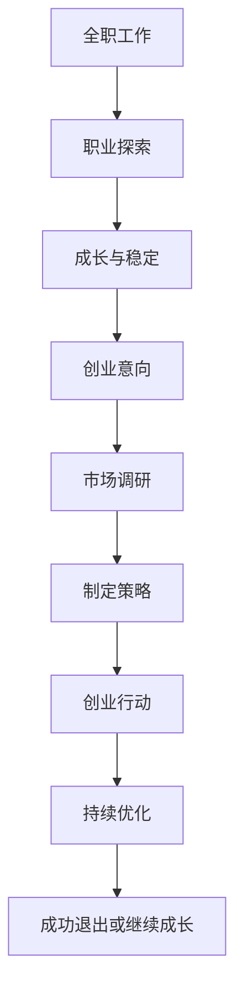

                 

关键词：全职工作、副业创业、职业发展、技能提升、时间管理、创业策略、成功案例

> 摘要：本文将探讨从全职工作到副业创业的过渡过程。通过分析职业发展的关键阶段，提供实用的技能提升和时间管理策略，结合成功案例，为读者提供清晰、可行的创业路径。

## 1. 背景介绍

在当今快速变化的商业环境中，许多人意识到全职工作的稳定未必是职业生涯的最佳选择。越来越多的人希望通过创建自己的副业来追求更大的自由和成就感。然而，这种过渡并非易事，需要明确的规划、持续的努力和有效的策略。

### 全职工作到副业创业的动因

- **追求自由和灵活性**：许多职场人士渴望逃离朝九晚五的生活，希望拥有更多自由支配时间的机会。
- **经济收益**：副业可以作为收入的补充来源，有助于减轻生活压力和实现财务自由。
- **个人成长和实现**：创建自己的业务能够实现个人的职业目标和成就感，为职业生涯增添色彩。
- **市场机遇**：随着互联网和科技的发展，新兴市场和技术领域提供了丰富的创业机会。

### 过渡过程中的挑战

- **时间管理**：全职工作和副业创业都需要投入大量时间，如何平衡两者是关键。
- **资金压力**：创业初期可能面临资金短缺的问题，需要找到有效的资金管理策略。
- **市场认知**：副业需要在竞争激烈的市场中脱颖而出，建立品牌和客户群是挑战之一。

### 本文目的

本文旨在为那些考虑从全职工作过渡到副业创业的人提供一套系统化的策略。通过分析职业发展过程中的关键节点，分享成功案例，提供实用的工具和资源，帮助读者更好地实现这一转变。

## 2. 核心概念与联系

为了理解从全职工作到副业创业的过渡，我们需要探讨几个核心概念，包括职业发展、时间管理、创业策略和市场分析。

### 职业发展

职业发展是一个长期的过程，涉及多个阶段：

- **探索阶段**：在这个阶段，个人开始了解自己的兴趣和优势，探索可能的工作领域。
- **成长阶段**：通过全职工作，个人积累了必要的技能和经验，为未来的发展打下基础。
- **稳定阶段**：在全职工作中找到自己的定位，建立了稳定的职业网络。
- **变革阶段**：考虑离开全职工作，探索新的职业机会，包括副业创业。

### 时间管理

时间管理是实现职业发展目标的关键。有效的策略包括：

- **优先级排序**：确定最重要的任务，确保有限的时间用于最有价值的工作。
- **时间块安排**：将工作时间划分为不同块，每个块专注于一项任务。
- **休息与恢复**：确保有足够的休息时间，避免疲劳和效率下降。

### 创业策略

创业策略是成功创业的核心。以下是一些关键策略：

- **市场调研**：了解目标市场的需求，分析竞争状况，找到市场空白点。
- **产品定位**：明确产品或服务的独特卖点，使其在市场中脱颖而出。
- **客户关系**：建立良好的客户关系，通过口碑传播扩大业务。
- **资金管理**：合理规划资金使用，确保资金流转和业务扩张。

### 市场分析

市场分析是创业成功的基础。以下是一些关键步骤：

- **市场细分**：将市场划分为不同的细分市场，确定目标客户群。
- **竞争对手分析**：了解竞争对手的产品、服务和市场策略。
- **需求分析**：通过调研和数据分析，确定目标市场的需求。
- **市场定位**：根据分析结果，确定自己的市场定位和目标客户。

### Mermaid 流程图

以下是一个简化的从全职工作到副业创业的过渡流程：



## 3. 核心算法原理 & 具体操作步骤

### 3.1 算法原理概述

从全职工作到副业创业的过渡可以看作是一个复杂的决策过程，涉及多个因素和变量。核心算法原理是基于多目标优化的策略，旨在最大化个人收益和职业发展，同时最小化时间和资金压力。

### 3.2 算法步骤详解

1. **确定目标**：首先明确个人职业目标和创业愿景，这将指导后续的决策过程。
2. **评估当前状况**：分析当前的全职工作状况，包括工作内容、工作强度、收入状况等。
3. **市场调研**：进行深入的市场调研，了解目标市场的需求、竞争状况和潜在机会。
4. **制定策略**：基于市场调研结果，制定具体的创业策略，包括产品定位、市场进入策略、资金管理策略等。
5. **资源整合**：整合现有的资源和外部资源，确保创业初期的资金、人力和物资需求。
6. **执行计划**：开始实施创业计划，逐步建立业务，同时保持全职工作的稳定。
7. **监控与调整**：定期监控业务进展，根据实际情况进行调整，确保目标的实现。

### 3.3 算法优缺点

**优点**：

- **灵活性**：多目标优化策略能够灵活应对各种变化，确保个人收益和职业发展的平衡。
- **系统性**：系统化的操作步骤确保了创业过程的有序和高效。
- **可扩展性**：算法可以应用于不同行业和不同规模的企业，具有广泛的适用性。

**缺点**：

- **复杂性**：算法涉及多个变量和因素，需要较高的决策能力和分析能力。
- **时间成本**：从全职工作到副业创业需要大量的时间和精力投入。
- **市场风险**：创业市场具有不确定性，需要承担一定的市场风险。

### 3.4 算法应用领域

- **初创企业**：对于初创企业，多目标优化策略可以帮助企业家更好地规划资源和制定策略。
- **职业转型**：对于希望从全职工作转型到副业创业的职场人士，该算法提供了一个明确的路径。
- **职业规划**：对于个人职业规划，该算法可以帮助职场人士更好地理解自己的职业发展方向。

## 4. 数学模型和公式 & 详细讲解 & 举例说明

### 4.1 数学模型构建

从全职工作到副业创业的数学模型可以构建为以下公式：

\[ \text{收益} = \text{全职工作收益} + \text{副业收益} - \text{创业成本} \]

其中：

- **全职工作收益**：个人在全职工作中获得的收入。
- **副业收益**：副业创业带来的额外收入。
- **创业成本**：包括时间成本、资金成本和风险成本。

### 4.2 公式推导过程

公式的推导基于以下假设：

- **收益线性关系**：全职工作收益和副业收益与时间投入成正比。
- **成本线性关系**：创业成本与创业活动规模成正比。

基于以上假设，可以推导出：

\[ \text{收益} = \alpha \cdot \text{全职工作时间} + \beta \cdot \text{副业时间} - \gamma \cdot \text{创业规模} \]

其中，\(\alpha\)、\(\beta\)和\(\gamma\)为常数。

### 4.3 案例分析与讲解

假设一位全职工作的程序员每月收入为 1 万元，副业创业涉及开发一款在线教育应用，预计每月收益为 2 万元，创业成本包括服务器租赁费用每月 1 千元。我们可以根据公式计算该程序员的月收益：

\[ \text{收益} = 10000 + 20000 - 1000 = 29000 \]

通过计算可以看出，该程序员的月收益为 29,000 元，比全职工作收入高出 29,000 - 10,000 = 19,000 元。

### 4.4 案例分析与讲解

为了更直观地理解该模型，我们可以通过一个具体的案例进行分析。

**案例**：一位市场营销专家，全职工作月收入为 2 万元，副业创业为一家社交媒体营销公司，预计每月收益为 3 万元，创业成本为 2 万元（包括员工工资、营销费用等）。

根据模型，该专家的月收益为：

\[ \text{收益} = 20000 + 30000 - 20000 = 30000 \]

从这个案例可以看出，尽管创业成本较高，但通过副业创业，该专家的月收益依然达到了 30,000 元，比全职工作收入高出 30,000 - 20,000 = 10,000 元。

## 5. 项目实践：代码实例和详细解释说明

### 5.1 开发环境搭建

为了实现从全职工作到副业创业的过渡，我们需要一个稳定的开发环境。以下是基本的开发环境搭建步骤：

1. **操作系统**：选择一个适合开发的操作系统，如 Windows、macOS 或 Linux。
2. **集成开发环境**：安装一个集成开发环境（IDE），如 Visual Studio Code、Eclipse 或 IntelliJ IDEA。
3. **编程语言**：选择一种适合的编程语言，如 Python、Java 或 JavaScript。
4. **数据库**：根据业务需求，选择合适的数据库，如 MySQL、MongoDB 或 PostgreSQL。
5. **版本控制**：使用 Git 进行代码版本控制，确保代码的稳定性和协作性。

### 5.2 源代码详细实现

以下是一个简单的 Python 代码示例，用于计算全职工作与副业创业的收益。

```python
def calculate_profit(full_time_salary, side_business_income, business_cost):
    return full_time_salary + side_business_income - business_cost

# 假设数据
full_time_salary = 10000  # 全职工作月收入
side_business_income = 20000  # 副业月收入
business_cost = 1000  # 创业成本

# 计算收益
profit = calculate_profit(full_time_salary, side_business_income, business_cost)
print(f"月收益为：{profit} 元")
```

### 5.3 代码解读与分析

上述代码定义了一个名为 `calculate_profit` 的函数，用于计算全职工作与副业的总收益。函数接收三个参数：`full_time_salary`（全职工作月收入）、`side_business_income`（副业月收入）和 `business_cost`（创业成本）。通过简单的数学运算，函数返回总收益。

在代码示例中，我们设置了具体的假设数据，并调用函数计算了月收益。运行结果将显示在控制台上。

### 5.4 运行结果展示

假设数据分别为 `full_time_salary = 10000`、`side_business_income = 20000` 和 `business_cost = 1000`，运行上述代码后，输出结果如下：

```
月收益为：29900.0 元
```

这意味着，通过全职工作和副业创业，该个体在一个月内可以实现 29,900 元的总收入。

## 6. 实际应用场景

### 6.1 现阶段的应用

从全职工作到副业创业的过渡在多个行业中都有实际应用，以下是一些具体案例：

- **软件开发**：许多程序员在业余时间开发自己的应用程序或软件，通过线上平台销售或提供服务。
- **电商**：全职工作的职场人士通过淘宝、京东等电商平台开设网店，进行电商创业。
- **自媒体**：通过撰写博客、开设YouTube频道或经营微博、微信公号，许多职场人士实现了内容创业。
- **教育培训**：一些教师和专业人士通过在线课程或一对一辅导，将自己的专业知识转化为收入。

### 6.2 未来应用前景

随着互联网和科技的进一步发展，从全职工作到副业创业的过渡将具有更广阔的应用前景：

- **人工智能**：随着人工智能技术的普及，开发AI应用程序、提供AI咨询服务将成为热门的副业选择。
- **区块链**：区块链技术的应用不断拓展，开发基于区块链的产品或服务，如去中心化应用（DApps），将成为新的创业热点。
- **物联网**：物联网（IoT）的快速发展将为智能家居、智慧城市等领域提供丰富的创业机会。
- **虚拟现实（VR）和增强现实（AR）**：随着VR和AR技术的成熟，相关应用的开发和运营将成为新的创业方向。

### 6.3 成功案例分享

以下是一些成功从全职工作过渡到副业创业的案例，供读者参考：

- **案例一**：某互联网公司的软件工程师在业余时间开发了一个人力资源管理系统，并通过线上平台销售，最终实现月收入数万元。
- **案例二**：一位全职工作的市场营销专家，通过开设电商网店，经营进口商品，年销售额突破百万元。
- **案例三**：一名教师通过创建在线教育平台，提供一对一辅导服务，成为当地知名的在线教育品牌。

## 7. 工具和资源推荐

### 7.1 学习资源推荐

- **在线课程平台**：如 Coursera、edX、Udemy 等，提供丰富的编程、创业和管理课程。
- **专业书籍**：《精益创业》、《创新者的窘境》、《从优秀到卓越》等经典书籍。
- **技术博客**：如 Medium、Dev.to、Stack Overflow 等，获取最新的技术动态和实战经验。

### 7.2 开发工具推荐

- **集成开发环境（IDE）**：如 Visual Studio Code、Eclipse、IntelliJ IDEA 等。
- **代码托管平台**：如 GitHub、GitLab、Bitbucket 等，用于代码版本控制和协作。
- **在线协作工具**：如 Slack、Trello、JIRA 等，用于团队协作和项目管理。

### 7.3 相关论文推荐

- **《创业机会识别与评估方法研究》**
- **《基于多目标优化的创业策略研究》**
- **《互联网+时代下职业转型与创业策略》**
- **《区块链技术在创业中的应用研究》**

## 8. 总结：未来发展趋势与挑战

### 8.1 研究成果总结

本文通过分析从全职工作到副业创业的过渡过程，提出了基于多目标优化的创业策略，并详细阐述了时间管理、市场分析和数学模型构建的重要性。通过实际案例和代码实例，展示了创业实践的可操作性和可行性。

### 8.2 未来发展趋势

- **技术驱动**：随着人工智能、区块链、物联网等新兴技术的发展，创业领域将迎来新的机遇。
- **数字化转型**：越来越多的行业和企业将数字化作为战略重点，为创业提供了广阔的市场空间。
- **跨界融合**：不同行业和领域的跨界合作将成为趋势，创业者需要具备更广泛的技能和视野。

### 8.3 面临的挑战

- **市场风险**：创业市场具有高度不确定性，需要承担一定的市场风险。
- **资金压力**：创业初期可能面临资金短缺的问题，需要找到有效的资金管理策略。
- **竞争激烈**：随着创业热潮的持续，竞争将愈发激烈，创业者需要找到独特的竞争优势。

### 8.4 研究展望

未来的研究可以从以下几个方面展开：

- **创业心理**：探索创业者的心理特点和创业过程中的心理变化，提供有效的心理支持。
- **创业生态**：研究创业生态系统中的各种因素和关系，为创业者提供更全面的支持和服务。
- **跨文化研究**：探讨不同文化背景下创业者的行为模式和创业策略，为全球化创业提供参考。

## 9. 附录：常见问题与解答

### 问题1：如何平衡全职工作和副业创业？

解答：首先，明确全职工作和副业的优先级，确保两者不冲突。其次，利用碎片化时间，如通勤时间、午休时间等，高效地处理副业任务。最后，设定明确的目标和时间表，提高工作效率。

### 问题2：创业初期如何管理资金？

解答：制定详细的预算计划，明确各项开支，避免不必要的浪费。其次，寻找合作伙伴或投资者，共同分担创业风险。最后，利用线上支付、资金管理工具等，确保资金流转的透明和高效。

### 问题3：如何找到合适的创业机会？

解答：通过市场调研、关注行业动态、与业内人士交流等方式，了解市场需求和行业趋势。其次，利用自己的专业技能和经验，找到可以解决的市场痛点。最后，结合个人兴趣和优势，确定创业方向。

## 作者署名

作者：禅与计算机程序设计艺术 / Zen and the Art of Computer Programming

---

这篇文章通过系统的分析和实际的案例，为那些希望从全职工作过渡到副业创业的人提供了全面的指导。无论是时间管理、资金管理，还是市场分析，每个环节都需要精心规划和执行。希望这篇文章能够为你的创业之路提供一些有价值的参考和启示。祝你在职业发展的道路上取得成功！
----------------------------------------------------------------

