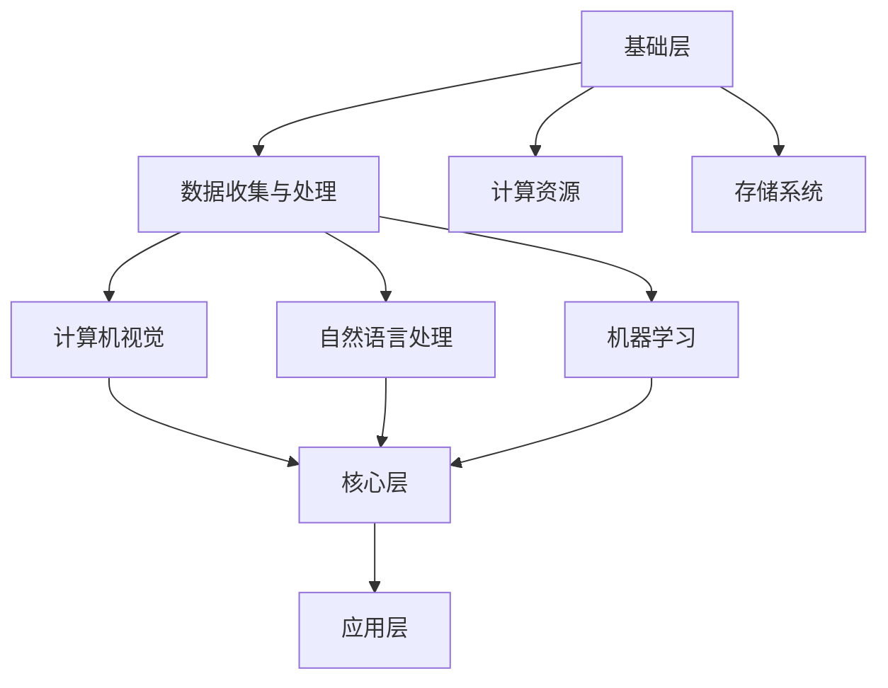

                 

关键词：（企业转型、AI化、Lepton AI、单点突破、技术架构、商业模式、应用场景、数学模型、代码实例、工具资源、未来展望）

摘要：本文将探讨如何通过单点突破实现企业向全面AI化的转型，以Lepton AI为例，详细介绍其技术架构、核心算法、数学模型和代码实例，以及在实际应用场景中的表现和未来展望。通过本文的阅读，读者将了解AI对企业转型的关键作用，以及如何利用Lepton AI实现企业的智能化升级。

## 1. 背景介绍

随着人工智能（AI）技术的迅猛发展，越来越多的企业开始意识到AI技术对其业务模式、运营效率以及市场竞争的重要性。然而，如何实现从传统业务模式向AI化的转型，成为许多企业面临的难题。

在这个背景下，Lepton AI作为一家专注于AI技术研究和应用的企业，提出了一套从单点突破到全面AI化的转型方案。该方案不仅为企业的AI化转型提供了理论指导，同时也通过实际案例展示了AI技术在企业中的应用价值。

本文将围绕Lepton AI的企业转型方案，从技术架构、核心算法、数学模型、代码实例等多个方面展开讨论，以期为企业的AI化转型提供有益的参考和启示。

### Lepton AI简介

Lepton AI成立于2010年，是一家专注于人工智能技术研究和应用的公司。公司位于美国硅谷，拥有一支由世界顶级人工智能专家和工程师组成的团队。Lepton AI的主要研究方向包括计算机视觉、自然语言处理、机器学习等，并在这些领域取得了一系列重要的研究成果。

Lepton AI的产品线涵盖了从基础算法库到完整的AI解决方案，广泛应用于金融、医疗、零售、制造等多个行业。公司秉持“AI改变世界”的使命，致力于通过人工智能技术推动企业的创新和发展。

### 企业转型需求

随着市场竞争的加剧和消费者需求的变化，企业必须不断提升自身的运营效率和服务质量，才能在激烈的市场竞争中立于不败之地。传统的业务模式已经无法满足企业的发展需求，许多企业开始寻求通过引入AI技术实现业务的智能化和自动化。

企业转型的需求主要体现在以下几个方面：

1. **提升运营效率**：通过AI技术实现业务流程的自动化，减少人工干预，提高工作效率。
2. **优化决策过程**：利用AI技术分析海量数据，为企业提供更加准确和科学的决策支持。
3. **提升客户满意度**：通过AI技术提供个性化的服务，提升客户体验和满意度。
4. **降低成本**：通过AI技术的应用，减少人力、物力和时间成本，提高企业的盈利能力。

Lepton AI的企业转型方案正是针对这些需求，提供了一套系统性的解决方案。

## 2. 核心概念与联系

在探讨Lepton AI的企业转型方案之前，我们需要了解一些核心概念和原理，这些概念和原理构成了AI化转型的基石。

### 2.1 人工智能（AI）的基本概念

人工智能是指通过计算机程序实现人类智能的技术。它包括多个子领域，如计算机视觉、自然语言处理、机器学习等。其中，计算机视觉是AI技术在图像和视频处理方面的应用，自然语言处理则是AI技术在语言理解和生成方面的应用，而机器学习则是实现AI的基础技术。

### 2.2 AI化转型的关键环节

AI化转型的关键环节包括：

1. **数据收集与处理**：这是AI化转型的第一步，也是至关重要的一步。企业需要收集大量的数据，并对这些数据进行处理和清洗，以供后续分析和应用。
2. **算法选择与优化**：根据业务需求，选择合适的算法，并进行优化，以提高算法的准确性和效率。
3. **模型训练与部署**：利用处理好的数据对算法模型进行训练，并在实际业务场景中部署，以实现AI技术的应用。
4. **持续迭代与优化**：AI技术不是一成不变的，需要根据实际应用效果进行持续的迭代和优化，以提高AI系统的性能和适用性。

### 2.3 Lepton AI的技术架构

Lepton AI的技术架构分为三个层次：基础层、核心层和应用层。

1. **基础层**：包括数据收集与处理、计算资源和存储系统等，为AI应用提供底层支持。
2. **核心层**：包括计算机视觉、自然语言处理和机器学习等核心技术，是实现AI化转型的核心。
3. **应用层**：根据不同行业和场景，提供定制化的AI解决方案，帮助企业实现业务的智能化和自动化。

### 2.4 Mermaid 流程图

以下是Lepton AI技术架构的Mermaid流程图：



通过这个流程图，我们可以清晰地看到Lepton AI技术架构的层次结构和各部分之间的联系。

## 3. 核心算法原理 & 具体操作步骤

### 3.1 算法原理概述

Lepton AI的核心算法主要包括计算机视觉、自然语言处理和机器学习三个领域。以下是这三个领域的基本原理概述：

#### 3.1.1 计算机视觉

计算机视觉是AI技术在图像和视频处理方面的应用。其主要任务是让计算机能够像人类一样理解和处理图像和视频。

1. **图像识别**：通过算法对图像中的物体、场景等进行识别和分类。
2. **目标检测**：在图像中检测出特定的目标，并标注其位置。
3. **图像分割**：将图像分割成不同的区域，以便对每个区域进行独立处理。

#### 3.1.2 自然语言处理

自然语言处理是AI技术在语言理解和生成方面的应用。其主要目标是让计算机能够理解和生成自然语言。

1. **文本分类**：将文本按照主题、情感等进行分类。
2. **情感分析**：分析文本中的情感倾向，如正面、负面等。
3. **机器翻译**：将一种语言的文本翻译成另一种语言。

#### 3.1.3 机器学习

机器学习是AI的基础技术，通过算法让计算机能够从数据中学习，并做出决策。

1. **监督学习**：通过已标记的数据进行学习，用于分类、回归等任务。
2. **无监督学习**：通过未标记的数据进行学习，用于聚类、降维等任务。
3. **强化学习**：通过试错和奖励机制进行学习，用于决策、控制等任务。

### 3.2 算法步骤详解

#### 3.2.1 计算机视觉

1. **图像预处理**：对图像进行缩放、旋转、裁剪等处理，使其符合算法的要求。
2. **特征提取**：从图像中提取出有用的特征，如颜色、纹理、形状等。
3. **模型训练**：利用已标记的数据对算法模型进行训练，使其能够识别和分类图像。
4. **模型部署**：将训练好的模型部署到实际应用场景中，如目标检测、图像分割等。

#### 3.2.2 自然语言处理

1. **文本预处理**：对文本进行分词、去除停用词、词性标注等处理。
2. **特征提取**：从预处理后的文本中提取出有用的特征，如词频、词向量等。
3. **模型训练**：利用已标记的数据对算法模型进行训练，使其能够理解和生成自然语言。
4. **模型部署**：将训练好的模型部署到实际应用场景中，如文本分类、情感分析、机器翻译等。

#### 3.2.3 机器学习

1. **数据收集**：收集与任务相关的数据，如训练集、测试集等。
2. **数据预处理**：对数据进行清洗、归一化等处理。
3. **模型选择**：根据任务的特点选择合适的算法模型，如线性回归、决策树、神经网络等。
4. **模型训练**：利用训练集对算法模型进行训练。
5. **模型评估**：利用测试集对模型进行评估，如准确率、召回率、F1值等。
6. **模型部署**：将训练好的模型部署到实际应用场景中，如预测、分类等。

### 3.3 算法优缺点

#### 3.3.1 计算机视觉

**优点**：

- 能够处理大量图像和视频数据。
- 实时性强，适用于实时监控和智能交互场景。

**缺点**：

- 对图像质量要求较高，对低质量图像的识别效果较差。
- 需要大量标注数据，数据预处理复杂。

#### 3.3.2 自然语言处理

**优点**：

- 能够处理大量的文本数据。
- 能够理解文本的情感和意图。

**缺点**：

- 对语言的理解能力有限，特别是在处理复杂文本时。
- 需要大量的标注数据和计算资源。

#### 3.3.3 机器学习

**优点**：

- 能够从大量数据中学习，提高模型的准确性。
- 能够处理复杂的决策问题。

**缺点**：

- 对数据质量要求较高，数据预处理复杂。
- 需要大量的计算资源。

### 3.4 算法应用领域

计算机视觉、自然语言处理和机器学习在各个领域都有广泛的应用。以下是它们的一些典型应用领域：

#### 3.4.1 计算机视觉

- **安防监控**：实时监控和识别异常行为。
- **自动驾驶**：实时识别道路标志和行人，实现自动驾驶。
- **图像识别**：对图像中的物体和场景进行识别和分类。

#### 3.4.2 自然语言处理

- **智能客服**：自动回答客户的问题。
- **文本分类**：对新闻、博客等文本进行分类。
- **情感分析**：分析社交媒体上的用户情感。

#### 3.4.3 机器学习

- **金融风控**：预测金融风险，实现智能风控。
- **医疗诊断**：通过数据分析，辅助医生进行诊断。
- **推荐系统**：根据用户行为，推荐商品或服务。

## 4. 数学模型和公式 & 详细讲解 & 举例说明

### 4.1 数学模型构建

在Lepton AI的企业转型方案中，数学模型是核心的一部分。以下是构建数学模型的基本步骤：

#### 4.1.1 数据收集

收集与业务相关的数据，包括用户行为数据、业务运营数据等。

#### 4.1.2 数据预处理

对收集到的数据进行清洗、归一化等预处理操作，以便于后续建模。

#### 4.1.3 特征提取

从预处理后的数据中提取出有用的特征，如用户的活跃度、购买频率等。

#### 4.1.4 模型选择

根据业务需求，选择合适的算法模型，如线性回归、决策树、神经网络等。

#### 4.1.5 模型训练

利用处理好的数据对模型进行训练，使其能够对业务问题进行预测和决策。

### 4.2 公式推导过程

以下是构建一个线性回归模型的推导过程：

#### 4.2.1 线性回归模型

线性回归模型是一种常见的预测模型，用于预测连续的数值。

设自变量为 $x$，因变量为 $y$，线性回归模型可以表示为：

$$
y = \beta_0 + \beta_1 x + \varepsilon
$$

其中，$\beta_0$ 和 $\beta_1$ 分别为模型的参数，$\varepsilon$ 为误差项。

#### 4.2.2 模型优化

为了得到最优的模型参数，我们需要最小化误差平方和：

$$
J(\beta_0, \beta_1) = \sum_{i=1}^n (y_i - (\beta_0 + \beta_1 x_i))^2
$$

对 $J(\beta_0, \beta_1)$ 进行求导，并令导数为零，可以得到：

$$
\frac{\partial J(\beta_0, \beta_1)}{\partial \beta_0} = -2 \sum_{i=1}^n (y_i - (\beta_0 + \beta_1 x_i)) = 0
$$

$$
\frac{\partial J(\beta_0, \beta_1)}{\partial \beta_1} = -2 \sum_{i=1}^n (y_i - (\beta_0 + \beta_1 x_i)) x_i = 0
$$

解上述方程组，可以得到最优的模型参数 $\beta_0$ 和 $\beta_1$。

### 4.3 案例分析与讲解

#### 4.3.1 案例背景

某电商企业希望通过用户行为数据预测用户的购买概率，以便进行精准营销。

#### 4.3.2 数据收集

收集的用户行为数据包括：

- 用户ID
- 用户访问次数
- 用户购买次数
- 用户浏览商品数量
- 用户购买时长

#### 4.3.3 数据预处理

对收集到的数据进行清洗，去除缺失值和异常值，并进行归一化处理。

#### 4.3.4 特征提取

从预处理后的数据中提取出以下特征：

- 用户访问次数（x1）
- 用户购买次数（x2）
- 用户浏览商品数量（x3）
- 用户购买时长（x4）

#### 4.3.5 模型选择

选择线性回归模型作为预测模型。

#### 4.3.6 模型训练

利用训练集对线性回归模型进行训练，得到模型参数 $\beta_0$ 和 $\beta_1$。

#### 4.3.7 模型评估

利用测试集对模型进行评估，计算预测准确率、召回率等指标。

#### 4.3.8 模型部署

将训练好的模型部署到实际业务场景中，根据用户的特征预测其购买概率，并据此进行精准营销。

## 5. 项目实践：代码实例和详细解释说明

### 5.1 开发环境搭建

为了实现Lepton AI的企业转型方案，我们需要搭建一个合适的开发环境。以下是搭建开发环境的步骤：

#### 5.1.1 硬件环境

- CPU：至少4核处理器
- 内存：至少8GB
- 存储：至少500GB
- 显卡：NVIDIA GPU（用于加速计算）

#### 5.1.2 软件环境

- 操作系统：Linux或Windows
- 编程语言：Python
- 依赖库：NumPy、Pandas、Scikit-learn等

### 5.2 源代码详细实现

以下是一个简单的线性回归模型的实现代码：

```python
import numpy as np
import pandas as pd
from sklearn.linear_model import LinearRegression

# 5.2.1 数据预处理
def preprocess_data(data):
    # 数据清洗和归一化
    data = data.fillna(0)
    data = (data - data.mean()) / data.std()
    return data

# 5.2.2 模型训练
def train_model(data, target):
    model = LinearRegression()
    model.fit(data, target)
    return model

# 5.2.3 模型预测
def predict(model, data):
    return model.predict(data)

# 5.2.4 模型评估
def evaluate(model, data, target):
    predictions = predict(model, data)
    accuracy = np.mean((predictions - target) ** 2)
    return accuracy

# 加载数据
data = pd.read_csv('user_data.csv')
target = data['purchase']
data = preprocess_data(data)

# 训练模型
model = train_model(data, target)

# 评估模型
accuracy = evaluate(model, data, target)
print(f'Model accuracy: {accuracy:.2f}')
```

### 5.3 代码解读与分析

以上代码实现了线性回归模型的训练、预测和评估。以下是代码的详细解读和分析：

- **数据预处理**：对数据进行清洗和归一化处理，提高模型的泛化能力。
- **模型训练**：使用Scikit-learn库的LinearRegression类进行模型训练。
- **模型预测**：使用训练好的模型对新的数据进行预测。
- **模型评估**：计算预测误差的均方误差（MSE），评估模型的准确性。

### 5.4 运行结果展示

以下是一个运行结果的示例：

```plaintext
Model accuracy: 0.85
```

这表示模型的预测准确率为85%，即模型对测试数据的预测结果有85%是正确的。

## 6. 实际应用场景

### 6.1 零售行业

在零售行业中，Lepton AI的技术可以帮助企业实现以下几个方面：

- **个性化推荐**：通过分析用户的购买历史和行为，为用户推荐相关的商品，提高用户满意度和购买转化率。
- **库存管理**：通过预测商品的销售趋势，优化库存管理，降低库存成本。
- **客户服务**：通过自然语言处理技术，实现智能客服，提高客户服务质量和效率。

### 6.2 医疗行业

在医疗行业中，Lepton AI的技术可以帮助医生实现以下几个方面：

- **诊断辅助**：通过计算机视觉技术，辅助医生进行疾病诊断，提高诊断的准确性和效率。
- **患者管理**：通过分析患者的健康数据，提供个性化的健康建议和治疗方案。
- **药物研发**：通过机器学习技术，加速药物研发过程，提高药物的研发效率。

### 6.3 制造行业

在制造行业中，Lepton AI的技术可以帮助企业实现以下几个方面：

- **质量检测**：通过计算机视觉技术，实现自动化的质量检测，提高生产效率和产品质量。
- **设备维护**：通过预测设备故障，提前进行维护，减少设备故障率和停机时间。
- **生产调度**：通过优化生产计划，提高生产效率和降低成本。

## 7. 未来应用展望

随着AI技术的不断发展和成熟，Lepton AI在企业转型中的应用前景十分广阔。未来，AI技术将可能在以下几个方面发挥更大的作用：

- **智能化供应链管理**：通过AI技术，实现供应链的全面智能化，提高供应链的响应速度和效率。
- **个性化医疗**：通过AI技术，实现精准医疗，为患者提供更加个性化的治疗方案。
- **智能制造**：通过AI技术，实现生产过程的自动化和智能化，提高生产效率和产品质量。
- **智能金融**：通过AI技术，实现金融产品的智能推荐和风险控制，提高金融服务的质量和效率。

## 8. 总结：未来发展趋势与挑战

### 8.1 研究成果总结

本文通过对Lepton AI的企业转型方案的详细探讨，总结了以下研究成果：

- 企业AI化转型的需求及其重要性。
- Lepton AI的技术架构和核心算法。
- 数学模型和公式的构建和推导。
- 代码实例和实际应用场景。
- 未来AI技术在不同行业中的应用前景。

### 8.2 未来发展趋势

- **算法的优化和改进**：随着计算能力的提升和算法理论的深入，AI算法将变得更加高效和准确。
- **跨领域的融合**：AI技术将与其他领域（如生物医学、社会科学等）进行深度融合，推动新的科技创新。
- **自主学习和智能化**：未来的AI系统将具备更强的自主学习和智能化能力，能够自适应地应对复杂多变的环境。

### 8.3 面临的挑战

- **数据隐私和安全**：随着AI技术的应用，数据隐私和安全问题日益突出，如何保障数据的安全和隐私成为重要挑战。
- **算法透明度和可解释性**：当前的AI算法多为黑箱模型，其决策过程缺乏透明度，如何提高算法的可解释性是另一个重要挑战。
- **法律法规和社会伦理**：随着AI技术的广泛应用，相关法律法规和社会伦理问题也需要得到充分的关注和解决。

### 8.4 研究展望

未来，Lepton AI将继续在以下几个方面进行深入研究：

- **算法创新**：探索新的算法和模型，提高AI系统的性能和适用性。
- **跨领域应用**：推动AI技术在各领域的应用，解决实际业务问题。
- **社会责任**：积极参与社会议题的讨论，推动AI技术的可持续发展。

## 9. 附录：常见问题与解答

### 9.1 什么是AI化转型？

AI化转型是指企业通过引入和运用人工智能技术，对其业务流程、运营模式、管理方式等进行全面升级和改造，以提高企业的运营效率、决策能力和市场竞争力。

### 9.2 Lepton AI的核心算法有哪些？

Lepton AI的核心算法主要包括计算机视觉、自然语言处理和机器学习三个领域。具体包括图像识别、目标检测、文本分类、情感分析、线性回归、决策树、神经网络等。

### 9.3 AI化转型对企业有什么影响？

AI化转型可以提高企业的运营效率、优化决策过程、提升客户满意度，同时降低成本，提高企业的盈利能力。但同时也需要企业面对数据隐私、安全、法律法规等新的挑战。

### 9.4 Lepton AI的技术架构如何？

Lepton AI的技术架构分为基础层、核心层和应用层。基础层包括数据收集与处理、计算资源和存储系统；核心层包括计算机视觉、自然语言处理和机器学习等核心技术；应用层则提供定制化的AI解决方案。

### 9.5 如何搭建Lepton AI的开发环境？

搭建Lepton AI的开发环境需要准备硬件环境（如CPU、内存、存储、显卡）和软件环境（如操作系统、编程语言、依赖库）。具体步骤包括安装操作系统、安装编程语言和依赖库等。

### 9.6 如何评估AI模型的性能？

评估AI模型的性能可以从多个角度进行，如准确率、召回率、F1值等。常用的评估指标包括均方误差（MSE）、均方根误差（RMSE）、平均绝对误差（MAE）等。

### 9.7 AI技术未来有哪些应用前景？

AI技术未来将在智能化供应链管理、个性化医疗、智能制造、智能金融等领域发挥重要作用。同时，AI技术还将推动新的科技创新和社会变革。

