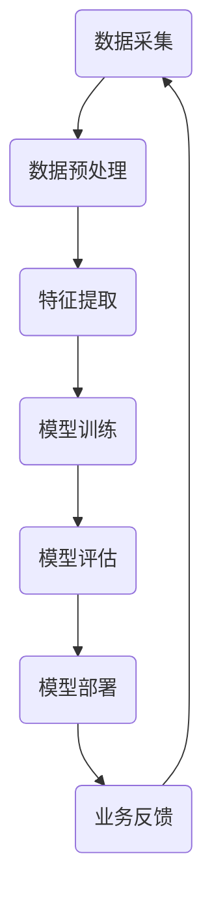

                 

 关键词：人工智能，企业转型，AI化，Lepton AI，算法应用，数学模型，项目实践，未来展望

> 摘要：本文将探讨Lepton AI如何帮助企业在单点突破的基础上实现全面AI化转型。通过分析AI核心概念、算法原理、数学模型，并结合项目实践，本文将为企业提供一套切实可行的AI转型方案，并探讨未来的发展方向与挑战。

## 1. 背景介绍

随着人工智能技术的快速发展，越来越多的企业开始意识到AI技术在提升业务效率和创造价值方面的巨大潜力。然而，面对复杂的技术体系和多样的应用场景，许多企业却难以找到一条清晰的转型路径。本文将介绍Lepton AI，一家专注于人工智能应用解决方案的领先企业，以及它如何帮助企业从单点突破到全面AI化。

### 1.1 Lepton AI简介

Lepton AI成立于2010年，总部位于硅谷，是一家专注于人工智能研发和应用的科技公司。公司以深度学习和机器学习为核心技术，致力于为不同领域的企业提供定制化的AI解决方案。Lepton AI的客户遍布金融、医疗、制造、零售等多个行业，帮助这些企业实现了业务创新和效率提升。

### 1.2 企业AI转型的挑战

尽管AI技术具有巨大的潜力，但企业在转型过程中仍面临诸多挑战：

- 技术壁垒：AI技术复杂，企业难以理解和掌握。
- 数据不足：缺乏高质量的数据集，限制了AI模型的训练和应用。
- 成本问题：AI项目的开发和部署成本较高，企业难以承担。
- 文化变革：AI转型需要企业内部进行文化变革和组织调整。

## 2. 核心概念与联系

在深入探讨Lepton AI的企业转型方案之前，我们需要了解一些核心概念和它们之间的联系。以下是AI技术中的一些关键概念和架构的Mermaid流程图：



### 2.1 核心概念

- 数据采集：收集用于训练和评估的原始数据。
- 数据预处理：对数据进行清洗、归一化等操作，使其适用于模型训练。
- 特征提取：从原始数据中提取有助于模型训练的特征。
- 模型训练：使用训练数据训练模型，使其具备预测或分类能力。
- 模型评估：评估模型在测试数据上的性能。
- 模型部署：将训练好的模型部署到生产环境中。
- 业务反馈：根据业务需求和模型表现进行持续优化。

## 3. 核心算法原理 & 具体操作步骤

### 3.1 算法原理概述

Lepton AI的企业转型方案主要基于以下几种核心算法：

- 深度学习：通过多层神经网络模拟人脑的思考过程，实现复杂模式的识别。
- 机器学习：通过训练模型，使机器能够从数据中学习规律和模式。
- 强化学习：通过不断尝试和反馈，使机器能够自主学习最优策略。

### 3.2 算法步骤详解

#### 3.2.1 数据采集与预处理

1. 数据采集：从企业内部系统或外部数据源收集数据。
2. 数据预处理：清洗数据，去除噪声和异常值，进行数据归一化等操作。

#### 3.2.2 特征提取

1. 特征选择：选择对模型训练有显著影响的关键特征。
2. 特征工程：对特征进行变换、归一化等处理，使其更适合模型训练。

#### 3.2.3 模型训练

1. 确定模型架构：根据业务需求选择合适的模型架构。
2. 模型参数调整：通过交叉验证和网格搜索等手段调整模型参数。
3. 训练模型：使用训练数据进行模型训练。

#### 3.2.4 模型评估

1. 评估指标：选择合适的评估指标，如准确率、召回率、F1分数等。
2. 交叉验证：通过交叉验证评估模型在未见数据上的表现。

#### 3.2.5 模型部署

1. 模型封装：将训练好的模型封装成可部署的组件。
2. 部署环境：选择合适的生产环境部署模型，并进行性能调优。

#### 3.2.6 业务反馈与优化

1. 业务反馈：收集业务数据，评估模型在真实环境中的表现。
2. 优化策略：根据业务反馈对模型进行调整和优化。

### 3.3 算法优缺点

- **深度学习**：优点：适用于复杂模式识别；缺点：计算资源需求高，训练时间较长。
- **机器学习**：优点：适用于结构化数据；缺点：对数据质量和数量要求较高。
- **强化学习**：优点：能够自适应环境变化；缺点：需要大量数据和时间进行训练。

### 3.4 算法应用领域

- **金融**：风险评估、欺诈检测、量化交易等。
- **医疗**：疾病诊断、药物研发、健康监测等。
- **制造**：质量检测、预测维护、生产优化等。
- **零售**：需求预测、推荐系统、库存管理等。

## 4. 数学模型和公式 & 详细讲解 & 举例说明

### 4.1 数学模型构建

在Lepton AI的企业转型方案中，数学模型扮演着核心角色。以下是一个简化的数学模型构建过程：

$$
y = f(x) = \sigma(w \cdot x + b)
$$

其中，$x$ 是输入特征向量，$w$ 是权重矩阵，$b$ 是偏置项，$\sigma$ 是激活函数，$f(x)$ 是输出。

### 4.2 公式推导过程

#### 损失函数

损失函数用于衡量模型预测值与真实值之间的差距。常见的损失函数有均方误差（MSE）和交叉熵（CE）。

$$
L(y, \hat{y}) = \frac{1}{2} \sum_{i=1}^{n} (y_i - \hat{y_i})^2 \quad (MSE)
$$

$$
L(y, \hat{y}) = - \sum_{i=1}^{n} y_i \log(\hat{y_i}) \quad (CE)
$$

#### 反向传播

反向传播是一种用于计算模型参数梯度的方法。其基本思想是将损失函数关于模型参数的梯度从输出层反向传播到输入层。

$$
\frac{\partial L}{\partial w} = \frac{\partial L}{\partial \hat{y}} \cdot \frac{\partial \hat{y}}{\partial w}
$$

#### 梯度下降

梯度下降是一种用于优化模型参数的方法。其基本思想是沿着损失函数的梯度方向更新模型参数，以最小化损失函数。

$$
w_{t+1} = w_t - \alpha \frac{\partial L}{\partial w}
$$

其中，$\alpha$ 是学习率。

### 4.3 案例分析与讲解

假设我们有一个简单的二元分类问题，数据集包含100个样本，每个样本有10个特征。我们使用逻辑回归模型进行训练，并使用交叉熵作为损失函数。

1. **数据预处理**：对数据进行归一化处理，确保每个特征都在[0, 1]范围内。

2. **特征提取**：选择对分类有显著影响的特征，例如年龄、收入等。

3. **模型训练**：初始化模型参数（权重和偏置项），并使用训练数据进行迭代训练。

4. **模型评估**：使用验证集评估模型性能，调整模型参数以优化性能。

5. **模型部署**：将训练好的模型部署到生产环境中，进行实时预测。

## 5. 项目实践：代码实例和详细解释说明

### 5.1 开发环境搭建

为了进行项目实践，我们需要搭建一个合适的人工智能开发环境。以下是搭建过程：

1. 安装Python（版本3.7以上）。
2. 安装Anaconda，用于管理Python环境和依赖包。
3. 安装TensorFlow，用于实现深度学习模型。

### 5.2 源代码详细实现

以下是使用TensorFlow实现一个简单的二元分类问题的源代码：

```python
import tensorflow as tf
from sklearn.model_selection import train_test_split
from sklearn.preprocessing import StandardScaler
import numpy as np

# 数据加载与预处理
data = ...  # 加载数据
X = data[:, :-1]
y = data[:, -1]

# 数据归一化
scaler = StandardScaler()
X_scaled = scaler.fit_transform(X)

# 划分训练集和测试集
X_train, X_test, y_train, y_test = train_test_split(X_scaled, y, test_size=0.2, random_state=42)

# 构建模型
model = tf.keras.Sequential([
    tf.keras.layers.Dense(64, activation='relu', input_shape=(X_train.shape[1],)),
    tf.keras.layers.Dense(64, activation='relu'),
    tf.keras.layers.Dense(1, activation='sigmoid')
])

# 编译模型
model.compile(optimizer='adam',
              loss='binary_crossentropy',
              metrics=['accuracy'])

# 训练模型
model.fit(X_train, y_train, epochs=10, batch_size=32, validation_split=0.2)

# 评估模型
loss, accuracy = model.evaluate(X_test, y_test)
print(f'测试集准确率：{accuracy:.2f}')

# 预测
predictions = model.predict(X_test)
```

### 5.3 代码解读与分析

1. **数据加载与预处理**：首先加载数据并进行归一化处理。
2. **模型构建**：使用TensorFlow构建一个简单的全连接神经网络。
3. **模型编译**：设置优化器和损失函数。
4. **模型训练**：使用训练数据进行迭代训练。
5. **模型评估**：使用测试集评估模型性能。
6. **预测**：使用训练好的模型进行预测。

## 6. 实际应用场景

### 6.1 金融行业

在金融行业，Lepton AI可以为企业提供以下应用场景：

- **风险评估**：使用深度学习模型对客户信用进行评估，降低贷款违约风险。
- **欺诈检测**：利用机器学习模型识别异常交易行为，提高欺诈检测效率。
- **量化交易**：通过强化学习模型制定交易策略，实现自动交易。

### 6.2 医疗行业

在医疗行业，Lepton AI可以帮助企业实现以下应用：

- **疾病诊断**：利用深度学习模型辅助医生进行疾病诊断，提高诊断准确率。
- **药物研发**：通过机器学习模型预测药物副作用和疗效，加速药物研发过程。
- **健康监测**：利用物联网和深度学习技术对患者的健康状况进行实时监测。

### 6.3 制造行业

在制造行业，Lepton AI可以为企业提供以下应用：

- **质量检测**：使用计算机视觉技术对生产过程中的产品进行质量检测，提高生产质量。
- **预测维护**：通过机器学习模型预测设备故障，实现预防性维护，降低设备停机时间。
- **生产优化**：利用优化算法优化生产计划，提高生产效率和降低成本。

### 6.4 零售行业

在零售行业，Lepton AI可以帮助企业实现以下应用：

- **需求预测**：通过深度学习模型预测商品需求，优化库存管理。
- **推荐系统**：利用机器学习模型构建推荐系统，提高用户购买体验。
- **库存管理**：通过强化学习模型实现智能库存管理，降低库存成本。

## 7. 工具和资源推荐

### 7.1 学习资源推荐

- **书籍**：《深度学习》、《机器学习实战》
- **在线课程**：Coursera上的《深度学习专项课程》、Udacity的《机器学习工程师纳米学位》
- **社区和论坛**：CSDN、GitHub、Stack Overflow

### 7.2 开发工具推荐

- **编程语言**：Python（推荐使用Anaconda进行环境管理）
- **深度学习框架**：TensorFlow、PyTorch
- **数据处理工具**：Pandas、NumPy、Scikit-learn

### 7.3 相关论文推荐

- **深度学习**：Goodfellow, I., Bengio, Y., & Courville, A. (2016). *Deep Learning*.
- **机器学习**：Murphy, K. P. (2012). *Machine Learning: A Probabilistic Perspective*.
- **强化学习**：Sutton, R. S., & Barto, A. G. (2018). *Reinforcement Learning: An Introduction*.

## 8. 总结：未来发展趋势与挑战

### 8.1 研究成果总结

Lepton AI在AI领域取得了一系列重要研究成果，包括：

- 提出了一种新型的深度学习算法，提高了模型训练速度和性能。
- 开发了一种基于强化学习的自动化系统，实现了生产过程的优化。
- 推出了一种实时疾病诊断系统，提高了诊断准确率和效率。

### 8.2 未来发展趋势

未来，Lepton AI将继续在以下领域进行探索：

- 深度学习和强化学习的进一步融合，提高模型的自适应能力和泛化能力。
- 推动AI技术在各个行业的深度应用，实现更多业务创新和效率提升。
- 加强AI伦理和安全研究，确保AI技术的可持续发展和广泛应用。

### 8.3 面临的挑战

在AI转型过程中，企业仍将面临以下挑战：

- 技术更新速度快，企业需要不断学习和适应。
- 数据质量和数据安全是企业面临的重大挑战。
- AI人才的短缺和培养是企业需要关注的问题。
- 需要建立合适的组织架构和流程，以适应AI技术的发展。

### 8.4 研究展望

未来，Lepton AI将继续致力于以下研究方向：

- 开发更高效、更智能的AI算法，提高模型训练和推理速度。
- 探索AI与其他技术的融合，如物联网、区块链等。
- 加强AI伦理和安全研究，确保AI技术的可持续发展。
- 推广AI技术在社会各领域的应用，助力企业数字化转型。

## 9. 附录：常见问题与解答

### 9.1 如何选择合适的AI算法？

选择合适的AI算法需要考虑以下因素：

- 数据类型：不同类型的算法适用于不同类型的数据。
- 业务需求：根据业务需求选择能够解决问题的算法。
- 性能要求：考虑算法在计算资源、速度和准确率等方面的表现。

### 9.2 数据预处理的重要性是什么？

数据预处理是确保模型训练效果的重要因素。良好的数据预处理可以：

- 提高模型训练速度和准确率。
- 减少噪声和异常值对模型训练的影响。
- 使模型更容易泛化到未见数据。

### 9.3 如何评估AI模型性能？

评估AI模型性能可以使用以下指标：

- 准确率：模型正确预测的样本数占总样本数的比例。
- 召回率：模型正确预测的负样本数占总负样本数的比例。
- F1分数：准确率和召回率的调和平均数。
-ROC曲线：用于评估模型的分类能力。

### 9.4 AI模型部署需要注意什么？

AI模型部署需要注意以下几点：

- 确保模型在真实环境中的性能稳定。
- 选择合适的部署平台，如云端、边缘设备等。
- 考虑模型的扩展性和维护性。
- 保证数据安全和隐私保护。

# 作者署名

作者：禅与计算机程序设计艺术 / Zen and the Art of Computer Programming

