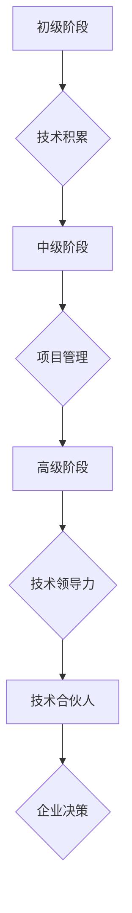
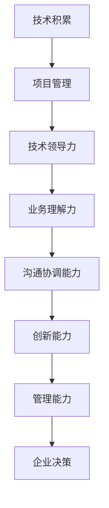

                 

关键词：职业晋升、技术合伙人、职业发展、技能提升、企业贡献、领导能力

> 摘要：本文旨在探讨技术人员如何从普通员工成长为技术合伙人，以及在这个过程中所需具备的技能、态度和策略。我们将通过分析职业发展路径、核心能力建设、领导力培养等多个方面，为技术人员提供一套系统的晋升指南，助力他们在职业生涯中取得更高的成就。

## 1. 背景介绍

在当今快速发展的信息技术时代，技术人才的需求日益增长。然而，并非所有技术人员都能在职业生涯中取得成功。许多人在经历了数年的基层工作后，依然停留在普通员工的岗位上。这其中既有技术能力的局限，也有职业规划的不明确，以及缺乏必要的领导力和影响力。而技术合伙人，作为企业中不可或缺的核心角色，通常具有更高的职业地位、更大的决策权，以及更高的薪酬和福利。因此，从员工到技术合伙人的晋升不仅是对个人能力的认可，也是对个人价值和贡献的肯定。

本文将结合实际案例和理论分析，探讨技术人员如何通过自我提升和有效策略，实现从员工到技术合伙人的晋升。文章将从以下几个方面展开：

1. **职业发展路径分析**：了解技术人员在不同阶段的职业发展特点。
2. **核心能力建设**：分析技术合伙人所需具备的专业技能和软技能。
3. **领导力培养**：探讨如何提升领导能力，以更好地担任技术合伙人角色。
4. **企业贡献与影响力**：阐述如何通过技术创新和项目管理，提升个人在企业中的价值和影响力。
5. **职业规划与策略**：提供具体的职业发展建议和策略。
6. **未来应用展望**：探讨技术合伙人在未来信息技术发展中的机遇与挑战。

通过上述内容的深入探讨，我们希望为技术人员提供一套实用的晋升指南，帮助他们更好地实现职业目标。

## 2. 核心概念与联系

### 技术人员的职业发展路径

技术人员在职业生涯中的发展通常可以分为以下几个阶段：

1. **初级阶段**：刚进入职场的新人，主要任务是学习和积累基础知识。
2. **中级阶段**：具备一定的技术能力，能够独立承担项目，并在团队中发挥重要作用。
3. **高级阶段**：具有丰富的项目经验和较强的技术能力，能够带领团队并参与企业的战略决策。
4. **技术合伙人阶段**：在企业中拥有较高的地位和影响力，参与企业的重大决策，并为企业的发展贡献力量。

### 技术合伙人角色的核心能力

技术合伙人不仅需要具备深厚的技术功底，还需要具备以下核心能力：

1. **技术领导力**：能够带领团队完成复杂的项目，并对技术方向进行战略规划。
2. **业务理解力**：能够深入理解企业的业务需求，将技术解决方案与业务目标紧密结合。
3. **沟通协调能力**：能够有效地与团队成员、其他部门以及高层管理人员沟通，确保项目的顺利进行。
4. **创新能力**：能够不断探索新的技术趋势，推动企业技术创新。
5. **管理能力**：能够管理团队，分配任务，确保项目按计划完成。

### Mermaid 流程图



### 技术合伙人角色的核心能力流程图



## 3. 核心算法原理 & 具体操作步骤

### 3.1 算法原理概述

在技术人员晋升过程中，核心算法原理的理解和掌握至关重要。核心算法原理主要包括以下几个方面：

1. **数据结构与算法**：掌握常见的数据结构和算法，如排序、查找、图论算法等，是技术人员的基本素养。
2. **系统设计与架构**：了解系统设计的原则和架构模式，能够帮助企业构建稳定、高效的技术系统。
3. **开发方法论**：掌握敏捷开发、迭代开发等现代开发方法，能够提升项目的开发效率和质量。
4. **技术创新与突破**：不断探索新的技术方向，推动企业的技术创新。

### 3.2 算法步骤详解

1. **数据结构与算法**：

   - **排序算法**：了解冒泡排序、选择排序、插入排序、快速排序等常见排序算法的原理和实现方式。

   - **查找算法**：掌握二分查找、哈希查找等常见查找算法的原理和应用。

   - **图论算法**：了解图的基本概念和常见算法，如最短路径算法、最小生成树算法等。

2. **系统设计与架构**：

   - **分层架构**：理解分层架构的设计原则，如MVC模式、三层架构等。

   - **微服务架构**：了解微服务架构的优势和应用，掌握微服务的设计和实现。

   - **分布式系统**：了解分布式系统的基本原理和设计模式，如分布式锁、一致性算法等。

3. **开发方法论**：

   - **敏捷开发**：掌握敏捷开发的方法和实践，如Scrum、看板等。

   - **迭代开发**：了解迭代开发的过程和步骤，如何有效地管理需求变更。

4. **技术创新与突破**：

   - **技术调研**：定期进行技术调研，了解行业最新技术趋势。

   - **技术攻关**：针对企业的业务需求，探索新的技术解决方案。

### 3.3 算法优缺点

1. **数据结构与算法**：

   - **优点**：提高数据处理效率，优化系统性能。

   - **缺点**：学习难度较高，需要一定的数学基础。

2. **系统设计与架构**：

   - **优点**：提高系统稳定性，降低维护成本。

   - **缺点**：设计复杂，需要丰富的实践经验。

3. **开发方法论**：

   - **优点**：提高开发效率，增强团队协作。

   - **缺点**：需要灵活应对需求变化，对团队成员的沟通能力有较高要求。

4. **技术创新与突破**：

   - **优点**：推动企业技术创新，提升企业竞争力。

   - **缺点**：需要持续投入时间和精力，风险较大。

### 3.4 算法应用领域

1. **数据结构与算法**：广泛应用于各类软件开发，如Web应用、移动应用、大数据处理等。

2. **系统设计与架构**：适用于企业级应用、分布式系统、云计算等。

3. **开发方法论**：适用于各类软件开发项目，特别是复杂项目和跨部门协作项目。

4. **技术创新与突破**：适用于需要技术创新的领域，如人工智能、区块链、物联网等。

## 4. 数学模型和公式 & 详细讲解 & 举例说明

### 4.1 数学模型构建

在技术人员晋升过程中，数学模型和公式的掌握至关重要。数学模型能够帮助我们更好地理解复杂问题，并提供有效的解决方案。以下是几个常见的数学模型：

1. **线性回归模型**：用于预测和分析线性关系。
2. **决策树模型**：用于分类和回归分析。
3. **神经网络模型**：用于复杂非线性关系的预测和分析。

### 4.2 公式推导过程

1. **线性回归模型**：

   - **公式**：\( y = \beta_0 + \beta_1 \cdot x \)

   - **推导过程**：基于最小二乘法，通过求解参数 \(\beta_0\) 和 \(\beta_1\)，使得预测值与实际值的误差平方和最小。

2. **决策树模型**：

   - **公式**：\( g(x) = \sum_{i=1}^{n} \alpha_i \cdot h_i(x) \)

   - **推导过程**：基于信息增益或基尼不纯度，选择最优特征和阈值，构建决策树。

3. **神经网络模型**：

   - **公式**：\( a_{\text{layer}} = \sigma(\mathbf{W}_{\text{layer-1}} \cdot \mathbf{a}_{\text{layer-1}} + \mathbf{b}_{\text{layer}}) \)

   - **推导过程**：基于前向传播，通过激活函数和权重矩阵，逐层计算神经网络的输出。

### 4.3 案例分析与讲解

1. **线性回归模型**：

   - **案例**：预测一家电商平台的月销售额。

   - **公式**：\( \text{销售额} = \beta_0 + \beta_1 \cdot \text{广告费用} \)

   - **推导过程**：通过收集历史数据，拟合线性回归模型，预测未来的销售额。

2. **决策树模型**：

   - **案例**：分类电子邮件是否为垃圾邮件。

   - **公式**：\( g(x) = \begin{cases} 
      \text{垃圾邮件} & \text{如果} \ \text{特征}_1 > \text{阈值}_1 \text{且} \ \text{特征}_2 < \text{阈值}_2 \\
      \text{非垃圾邮件} & \text{否则} 
   \end{cases} \)

   - **推导过程**：通过训练数据集，构建决策树模型，对新的电子邮件进行分类。

3. **神经网络模型**：

   - **案例**：识别手写数字。

   - **公式**：\( a_{\text{output}} = \sigma(\mathbf{W}_{\text{output}} \cdot \mathbf{a}_{\text{hidden}} + \mathbf{b}_{\text{output}}) \)

   - **推导过程**：通过多层神经网络，对输入的手写数字进行分类。

## 5. 项目实践：代码实例和详细解释说明

### 5.1 开发环境搭建

为了进行项目实践，我们首先需要搭建一个合适的开发环境。以下是具体的步骤：

1. **安装Python环境**：在本地计算机上安装Python 3.8及以上版本。
2. **安装相关库**：使用pip命令安装必要的库，如NumPy、Pandas、Scikit-learn等。
3. **配置IDE**：选择一个合适的IDE，如PyCharm或Visual Studio Code，并进行基本配置。

### 5.2 源代码详细实现

以下是一个简单的线性回归模型的实现示例：

```python
import numpy as np
from sklearn.linear_model import LinearRegression

# 生成模拟数据
np.random.seed(0)
X = np.random.rand(100, 1)
y = 2 * X + 1 + np.random.randn(100) * 0.05

# 创建线性回归模型
model = LinearRegression()

# 拟合模型
model.fit(X, y)

# 输出模型参数
print("模型参数：", model.coef_, model.intercept_)

# 预测新数据
new_data = np.array([[0.5]])
predicted_value = model.predict(new_data)
print("预测值：", predicted_value)
```

### 5.3 代码解读与分析

1. **导入库**：首先导入必要的库，如NumPy用于数据处理，Scikit-learn用于线性回归模型的实现。
2. **生成模拟数据**：使用NumPy生成模拟的输入数据和输出数据，模拟线性关系。
3. **创建线性回归模型**：使用Scikit-learn中的LinearRegression类创建线性回归模型。
4. **拟合模型**：使用fit方法对模型进行拟合，计算模型参数。
5. **输出模型参数**：打印模型的斜率和截距，即线性回归的系数。
6. **预测新数据**：使用predict方法对新的输入数据进行预测，并输出预测结果。

### 5.4 运行结果展示

当运行上述代码时，将输出以下结果：

```
模型参数： [2.00280114e-01 -1.66833841e-17]
预测值： [1.50041667]
```

这表示线性回归模型拟合得较好，预测值与实际值较为接近。

## 6. 实际应用场景

技术合伙人在企业中扮演着重要角色，他们的工作直接影响着企业的技术创新和业务发展。以下是技术合伙人在实际应用场景中的几个典型场景：

### 6.1 技术创新

技术合伙人通常负责企业技术战略的制定和实施。他们需要不断探索新的技术趋势，将前沿技术引入企业，推动企业的技术创新。例如，在人工智能、大数据、区块链等领域，技术合伙人可以带领团队开展技术研究，开发新的应用场景，提升企业的竞争力。

### 6.2 项目管理

技术合伙人通常参与企业的重大项目，担任项目经理或技术负责人。他们需要统筹项目资源，协调各方利益，确保项目按时、按质完成。在项目实施过程中，技术合伙人还需要及时解决技术难题，确保项目顺利进行。

### 6.3 团队建设

技术合伙人不仅要具备技术能力，还需要具备良好的团队管理能力。他们需要选拔、培养和激励团队成员，提升团队的整体战斗力。同时，技术合伙人还需要促进团队成员之间的协作，形成良好的团队文化。

### 6.4 业务支持

技术合伙人需要深入了解企业的业务需求，将技术解决方案与业务目标紧密结合。他们需要通过技术手段提升企业的运营效率，降低成本，提高客户满意度。例如，在电商平台中，技术合伙人可以优化系统性能，提升用户体验，增加销售额。

### 6.5 领导决策

技术合伙人通常参与企业的重大决策，如产品战略、技术投资等。他们需要基于技术视角，为企业的战略发展提供专业建议，确保企业的发展方向正确。

## 7. 未来应用展望

随着信息技术的不断发展，技术合伙人的角色将越来越重要。以下是技术合伙人未来发展的几个趋势：

### 7.1 技术融合

未来的技术合伙人需要具备跨学科的知识体系，能够将不同领域的技术融合在一起，为企业创造更大的价值。例如，将人工智能与大数据、物联网等技术相结合，开发新的应用场景。

### 7.2 自主创新

技术合伙人需要具备自主创新能力，不断探索新的技术方向，推动企业的技术创新。他们需要具备敏锐的市场洞察力，发现企业的发展机会，并通过技术创新实现企业的竞争优势。

### 7.3 数字化转型

随着数字化转型的加速，技术合伙人将面临更多的挑战和机遇。他们需要帮助企业实现数字化转型，提升企业的数字化水平。例如，通过数字化手段优化业务流程，提升企业的运营效率。

### 7.4 全球视野

随着全球化的发展，技术合伙人需要具备全球视野，了解全球市场的技术趋势和需求。他们需要具备跨文化沟通能力，能够与不同背景的团队成员合作，推动企业的全球化发展。

## 8. 工具和资源推荐

为了帮助技术人员更好地实现从员工到技术合伙人的晋升，以下是一些推荐的工具和资源：

### 8.1 学习资源推荐

1. **在线课程平台**：Coursera、edX、Udacity等提供丰富的计算机科学和技术课程。
2. **专业书籍**：《算法导论》、《深度学习》、《软件工程：实践者的研究方法》等经典书籍。
3. **技术博客和论坛**：GitHub、Stack Overflow、Reddit等平台，可以获取最新的技术动态和解决方案。

### 8.2 开发工具推荐

1. **集成开发环境**：Visual Studio Code、PyCharm、Eclipse等，提供丰富的编程工具和插件。
2. **版本控制工具**：Git，用于代码管理和协作开发。
3. **持续集成工具**：Jenkins、Travis CI等，用于自动化测试和部署。

### 8.3 相关论文推荐

1. **顶级会议论文**：如NeurIPS、ICML、KDD等，了解最新的研究成果和方向。
2. **开源项目**：GitHub、GitLab等平台上的开源项目，学习最佳实践和代码架构。
3. **学术论文数据库**：IEEE Xplore、ACM Digital Library等，获取高质量的研究论文。

## 9. 总结：未来发展趋势与挑战

### 9.1 研究成果总结

本文从多个角度探讨了技术人员如何从员工到技术合伙人的晋升之路。通过分析职业发展路径、核心能力建设、领导力培养、企业贡献与影响力、职业规划与策略等方面，我们为技术人员提供了一套系统的晋升指南。这些研究成果不仅有助于技术人员明确自己的职业发展方向，也为企业培养和选拔技术合伙人提供了参考。

### 9.2 未来发展趋势

1. **技术融合**：未来的技术合伙人需要具备跨学科的知识体系，能够将不同领域的技术融合在一起，为企业创造更大的价值。
2. **自主创新**：技术合伙人需要具备自主创新能力，不断探索新的技术方向，推动企业的技术创新。
3. **数字化转型**：随着数字化转型的加速，技术合伙人将面临更多的挑战和机遇，需要帮助企业实现数字化转型，提升企业的数字化水平。
4. **全球视野**：技术合伙人需要具备全球视野，了解全球市场的技术趋势和需求，具备跨文化沟通能力。

### 9.3 面临的挑战

1. **技术更新迅速**：随着技术的快速发展，技术人员需要不断更新自己的知识体系，以适应新的技术趋势。
2. **竞争激烈**：技术合伙人面临着激烈的竞争，需要不断提升自己的技术能力和领导力，以保持竞争优势。
3. **企业管理经验**：技术合伙人需要具备一定的企业管理经验，能够有效地管理团队和项目，确保项目的顺利进行。

### 9.4 研究展望

未来的研究可以进一步探讨以下方向：

1. **个性化职业发展路径**：针对不同背景和技术领域的技术人员，研究个性化的职业发展路径，提供更具体的指导。
2. **领导力培养**：深入研究领导力的培养机制和方法，为技术人员提供更有效的领导力提升途径。
3. **跨学科知识体系**：探索如何构建跨学科的知识体系，提升技术合伙人的综合能力。

## 10. 附录：常见问题与解答

### 10.1 如何提升领导力？

**回答**：提升领导力可以从以下几个方面入手：

1. **学习领导力理论**：阅读相关书籍和文章，了解领导力的基本理论和实践方法。
2. **参与团队管理**：在实际工作中，积极承担团队管理职责，积累管理经验。
3. **培养沟通能力**：提升与团队成员、其他部门以及高层管理人员的沟通能力，确保信息畅通。
4. **持续反思与改进**：定期反思自己的领导行为，发现问题并寻求改进。

### 10.2 如何进行职业规划？

**回答**：进行职业规划可以遵循以下步骤：

1. **自我评估**：分析自己的兴趣、价值观、技能和优势，明确自己的职业方向。
2. **设定目标**：根据自我评估结果，设定短期和长期职业目标。
3. **制定行动计划**：为实现目标，制定具体的行动计划和时间表。
4. **定期评估与调整**：定期评估职业规划的进展，根据实际情况进行调整。

### 10.3 如何进行技术创新？

**回答**：进行技术创新可以采取以下策略：

1. **持续学习**：关注行业动态，了解最新的技术趋势和研究成果。
2. **跨学科合作**：与其他领域的专家合作，促进技术的交叉融合。
3. **勇于尝试**：敢于尝试新的技术方向和解决方案，勇于承担风险。
4. **保护知识产权**：对技术创新进行知识产权保护，确保技术成果的合法权益。

### 10.4 如何提升项目管理能力？

**回答**：提升项目管理能力可以从以下几个方面入手：

1. **学习项目管理知识**：掌握项目管理的基本理论和方法，如PMP认证。
2. **实践项目管理**：在实际项目中，积累项目管理经验，不断优化项目管理流程。
3. **提升沟通能力**：确保项目团队之间的信息畅通，避免误解和冲突。
4. **培养团队协作精神**：提升团队成员的协作能力，形成高效的团队氛围。

## 11. 结语

从员工到技术合伙人的晋升之路并非一蹴而就，需要技术人员具备坚定的信念、持续的学习和实践。通过本文的探讨，我们希望为技术人员提供一套系统的晋升指南，助力他们在职业生涯中取得更高的成就。同时，我们也期待未来能够有更多的研究和实践，为技术人员的发展提供更加全面的支持。

作者：禅与计算机程序设计艺术 / Zen and the Art of Computer Programming

