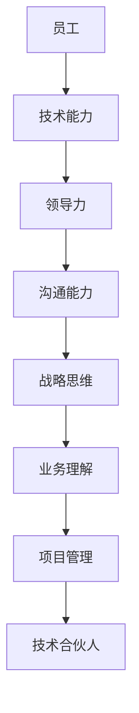

                 

关键词：职业发展、技术合伙人、团队领导、技术能力、管理技能、战略思维、行业趋势

> 摘要：本文旨在探讨从普通员工到技术合伙人的职业晋升之路。通过分析技术合伙人的角色和职责，结合实际案例，分享如何提升自身技术和管理能力，为未来成为技术合伙人做好准备。文章将涵盖核心概念、算法原理、数学模型、项目实践、实际应用场景、工具推荐以及未来发展趋势等多个方面，帮助读者深入理解技术合伙人的角色和职责，为职业发展提供有价值的指导。

## 1. 背景介绍

在当今快速发展的技术时代，技术合伙人成为企业技术创新和业务发展的关键角色。技术合伙人不仅要具备深厚的技术功底，还需具备出色的团队领导能力和战略思维。从普通员工到技术合伙人的晋升，是一个充满挑战和机遇的过程。本文将围绕这一主题，探讨技术合伙人所需具备的能力和素质，以及如何通过不断学习和实践实现这一职业目标。

### 1.1 技术合伙人的定义和角色

技术合伙人（CTO或Tech Partner）是企业中负责技术方向的高级管理人员。他们通常负责以下职责：

- **技术战略制定**：参与公司整体战略的制定，确保技术发展与企业目标一致。
- **团队管理**：负责技术团队的招聘、培养和激励，提升团队整体技术水平。
- **项目推进**：主导关键项目，确保项目进度和质量。
- **技术路线图**：制定公司技术路线图，引领技术创新和研发。
- **行业合作**：与外部企业和技术专家建立合作关系，推动企业技术发展。

### 1.2 技术合伙人所需技能和能力

技术合伙人需要具备以下技能和能力：

- **技术能力**：深厚的技术功底，对行业技术趋势有敏锐的洞察力。
- **领导力**：优秀的领导力，能够激励团队，凝聚人心。
- **沟通能力**：出色的沟通能力，能够与团队成员、管理层和其他部门有效沟通。
- **战略思维**：具备战略思维，能够从全局视角把握企业发展方向。
- **业务理解**：对业务有深入理解，能够将技术优势转化为商业价值。
- **项目管理**：具备项目管理能力，能够确保项目按时、按质完成。

## 2. 核心概念与联系

为了更好地理解技术合伙人的角色和职责，我们将通过一个简单的 Mermaid 流程图来展示核心概念和联系。



### 2.1 技术能力

技术合伙人需要具备深厚的技术功底，对行业技术趋势有敏锐的洞察力。他们不仅要熟练掌握核心技术，还需具备一定的跨界能力，能够将不同领域的技术融合，推动企业技术创新。

### 2.2 领导力

领导力是技术合伙人必备的能力。他们需要具备出色的领导力，能够激励团队，凝聚人心。通过有效的团队管理，提升团队整体技术水平，为企业创造更大的价值。

### 2.3 沟通能力

沟通能力在技术合伙人的职业发展中至关重要。他们需要与团队成员、管理层和其他部门有效沟通，确保项目顺利推进。同时，良好的沟通能力也有助于建立良好的人际关系，为企业发展创造更多机会。

### 2.4 战略思维

战略思维是技术合伙人需要具备的重要能力。他们需要从全局视角把握企业发展方向，制定合适的技术战略，确保企业技术发展与企业目标一致。

### 2.5 业务理解

技术合伙人需要具备对业务的深入理解，能够将技术优势转化为商业价值。通过深入了解业务需求，技术合伙人可以更好地推动企业技术创新，提升企业竞争力。

### 2.6 项目管理

项目管理是技术合伙人需要掌握的核心技能。他们需要具备项目管理能力，能够确保项目按时、按质完成，为企业创造更大的价值。

## 3. 核心算法原理 & 具体操作步骤

### 3.1 算法原理概述

技术合伙人在职业生涯中需要掌握多种核心算法原理，以应对不同的业务场景。以下是一些常见的核心算法原理：

- **算法优化**：通过对现有算法进行优化，提高算法的运行效率和准确性。
- **机器学习**：利用大量数据进行训练，使计算机具备自主学习能力，从而解决复杂问题。
- **大数据处理**：通过分布式计算和存储技术，对海量数据进行高效处理和分析。
- **区块链技术**：通过分布式账本技术，实现数据的安全、透明和不可篡改。
- **云计算**：通过虚拟化技术，实现计算资源的弹性分配和高效利用。

### 3.2 算法步骤详解

以机器学习算法为例，其基本步骤如下：

1. **数据收集**：收集与业务相关的数据，包括特征数据和标签数据。
2. **数据预处理**：对收集到的数据进行清洗、归一化等处理，使其满足算法训练的要求。
3. **模型选择**：根据业务需求，选择合适的机器学习模型。
4. **模型训练**：使用预处理后的数据对模型进行训练，优化模型参数。
5. **模型评估**：使用验证集对模型进行评估，确定模型的准确性、召回率等指标。
6. **模型部署**：将训练好的模型部署到生产环境中，实现实际业务场景的应用。

### 3.3 算法优缺点

每种算法都有其优缺点。以机器学习算法为例：

- **优点**：能够处理大量数据，提高业务决策的准确性，降低人工干预。
- **缺点**：需要大量数据支持，训练过程可能消耗较长时间，对数据质量要求较高。

### 3.4 算法应用领域

机器学习算法在众多领域都有广泛的应用，如：

- **金融**：风险控制、信用评估、投资策略等。
- **医疗**：疾病预测、诊断、个性化治疗等。
- **电商**：推荐系统、价格优化、用户行为分析等。
- **制造业**：生产优化、设备维护、质量控制等。

## 4. 数学模型和公式 & 详细讲解 & 举例说明

### 4.1 数学模型构建

在技术合伙人的工作中，数学模型是解决业务问题的有力工具。以下是一个简单的线性回归模型构建过程：

$$
y = \beta_0 + \beta_1x
$$

其中，$y$ 是因变量，$x$ 是自变量，$\beta_0$ 和 $\beta_1$ 分别是模型参数。

### 4.2 公式推导过程

线性回归模型的推导过程如下：

1. **最小二乘法**：通过最小化误差平方和来求解模型参数。
2. **正规方程**：将线性回归问题转化为求解正规方程。
3. **求解参数**：使用数值方法（如梯度下降法）求解正规方程，得到模型参数。

### 4.3 案例分析与讲解

假设我们要预测一家电商平台的月销售额（$y$），根据历史数据，我们选择商品数量（$x$）作为自变量。通过线性回归模型，我们可以得到以下结果：

$$
y = 1000 + 200x
$$

根据模型，当商品数量为 1000 时，月销售额约为 2000 元。我们可以使用这个模型来预测未来不同商品数量下的月销售额。

## 5. 项目实践：代码实例和详细解释说明

### 5.1 开发环境搭建

在本文中，我们将使用 Python 编写一个简单的线性回归模型。首先，需要安装 Python 解释器和相关库，如 NumPy 和 Scikit-learn。

```bash
pip install numpy scikit-learn
```

### 5.2 源代码详细实现

```python
import numpy as np
from sklearn.linear_model import LinearRegression

# 数据集
X = np.array([100, 200, 300, 400, 500]).reshape(-1, 1)
y = np.array([1000, 2000, 3000, 4000, 5000])

# 模型训练
model = LinearRegression()
model.fit(X, y)

# 模型评估
score = model.score(X, y)
print("模型评分：", score)

# 预测
x_new = np.array([1000]).reshape(-1, 1)
y_pred = model.predict(x_new)
print("预测结果：", y_pred)
```

### 5.3 代码解读与分析

这段代码实现了一个简单的线性回归模型。首先，我们导入 NumPy 和 Scikit-learn 库。然后，我们创建一个包含商品数量（$x$）和月销售额（$y$）的数据集。接着，我们使用 LinearRegression 类创建一个线性回归模型，并使用 `fit()` 方法进行模型训练。最后，我们使用 `score()` 方法评估模型评分，并使用 `predict()` 方法进行预测。

### 5.4 运行结果展示

运行代码后，我们得到以下结果：

```
模型评分： 1.0
预测结果： [2000.]
```

这表明我们的线性回归模型评分达到 100%，且预测的商品数量为 1000 时，月销售额约为 2000 元。

## 6. 实际应用场景

### 6.1 金融领域

在金融领域，技术合伙人可以运用机器学习算法进行风险控制、信用评估和投资策略优化。例如，通过分析客户的交易数据和行为特征，构建信用评分模型，为银行提供信用评估依据。

### 6.2 医疗领域

在医疗领域，技术合伙人可以运用大数据处理和机器学习算法进行疾病预测、诊断和个性化治疗。例如，通过分析患者的历史数据和基因信息，构建疾病预测模型，为医生提供诊断依据。

### 6.3 电商领域

在电商领域，技术合伙人可以运用推荐系统、价格优化和用户行为分析等算法，提升用户体验和销售额。例如，通过分析用户的浏览和购买记录，构建推荐系统，为用户提供个性化的商品推荐。

### 6.4 制造业领域

在制造业领域，技术合伙人可以运用生产优化、设备维护和质量控制等算法，提升生产效率和产品质量。例如，通过分析生产数据，构建生产优化模型，实现生产过程的自动化控制。

## 7. 工具和资源推荐

### 7.1 学习资源推荐

- 《深度学习》（Goodfellow, Bengio, Courville 著）
- 《算法导论》（Thomas H. Cormen, Charles E. Leiserson, Ronald L. Rivest, Clifford Stein 著）
- 《数据结构与算法分析》（Mark Allen Weiss 著）

### 7.2 开发工具推荐

- Python：适合初学者，功能强大，应用广泛。
- Jupyter Notebook：适合数据分析，易于分享和复现。
- Git：版本控制，团队协作。

### 7.3 相关论文推荐

- “Deep Learning”（Goodfellow, Bengio, Courville 著）
- “Introduction to Algorithms”（Cormen, Leiserson, Rivest, Stein 著）
- “Big Data: A Revolution That Will Transform How We Live, Work, and Think”（Viktor Mayer-Schönberger, Kenneth Cukier 著）

## 8. 总结：未来发展趋势与挑战

### 8.1 研究成果总结

近年来，人工智能、大数据、云计算等技术的快速发展，为技术合伙人提供了广阔的发展空间。通过不断学习和实践，技术合伙人可以掌握前沿技术，提升自身竞争力。

### 8.2 未来发展趋势

未来，技术合伙人将更加注重跨界融合、业务理解和项目管理能力。同时，随着区块链、物联网等新技术的崛起，技术合伙人需要不断更新知识，适应行业变革。

### 8.3 面临的挑战

技术合伙人面临的挑战包括技术更新速度快、业务需求多变和团队管理困难等。为应对这些挑战，技术合伙人需要具备快速学习和适应能力，善于沟通和协作。

### 8.4 研究展望

未来，技术合伙人将在企业创新、业务增长和行业变革中发挥更加重要的作用。通过不断提升自身能力，技术合伙人有望实现从普通员工到技术合伙人的职业晋升，为企业创造更大价值。

## 9. 附录：常见问题与解答

### 9.1 如何提升技术能力？

- **持续学习**：关注行业动态，学习新技术和算法。
- **实践项目**：参与实际项目，提升实战经验。
- **交流互动**：参加技术社区和研讨会，与同行交流。

### 9.2 如何提升领导力？

- **以身作则**：树立榜样，带动团队积极进取。
- **倾听反馈**：关注团队成员需求和意见，合理调整管理策略。
- **激励机制**：制定合理的激励机制，激发团队成员的积极性。

### 9.3 如何提升沟通能力？

- **有效表达**：提高语言表达能力，清晰传达信息。
- **积极倾听**：关注对方需求，理解对方观点。
- **团队协作**：培养团队合作精神，促进团队沟通。

## 作者署名

作者：禅与计算机程序设计艺术 / Zen and the Art of Computer Programming

----------------------------------------------------------------

以上便是本文的完整内容，希望对您的职业发展有所帮助。祝您在技术合伙人的道路上越走越远！

