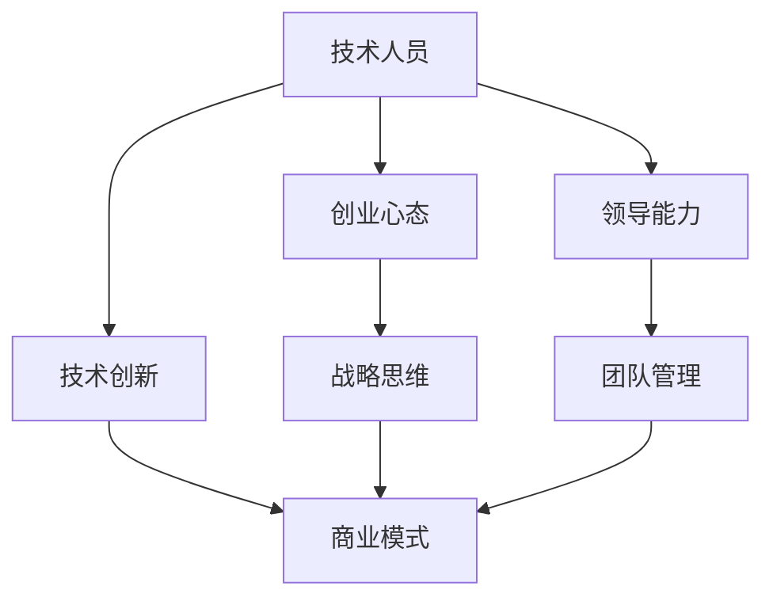

                 

在当今科技迅猛发展的时代，从一名普通员工蜕变为一位科技独角兽公司的创始人，这一过程不仅仅是职业生涯的一次飞跃，更是人生哲学、领导能力和技术视野的一场深度转变。本文将探讨这一过程的各个方面，包括技术成长、创业心态、领导艺术和团队管理，旨在为那些渴望实现这一蜕变的科技从业者提供一些指导和建议。

## 关键词
- 科技独角兽
- 创业
- 技术成长
- 领导艺术
- 团队管理

## 摘要
本文将深入探讨从普通员工到科技独角兽创始人的蜕变过程。我们将分析在这一过程中，技术人员需要掌握的核心技能、所需的心态转变以及如何进行有效的团队管理。通过讲述成功案例、提供实际操作建议和未来展望，帮助读者理解这一蜕变过程中的关键要素，并激励他们迈向成为独角兽创始人的道路。

## 1. 背景介绍
科技独角兽公司是指在短时间内（通常为十年以内）估值达到10亿美元以上的初创企业。这些公司以其创新的技术和商业模式在全球范围内引起了广泛关注。随着科技领域的不断扩张，越来越多的技术人才开始梦想着创建自己的独角兽公司。然而，从一名普通员工蜕变为独角兽公司的创始人，并不是一个简单的转变，它需要技术、领导力、创新思维和坚韧不拔的意志。

### 1.1 从员工到创始人的转变
作为一名普通员工，你可能已经积累了一定的技术知识和经验，但你可能缺乏创业所需的全局视野和战略思维。从员工到创始人的转变意味着你需要从技术专家的角色转向成为一个企业家，这不仅仅是身份的变化，更是思维方式的转变。你将需要学会如何管理一个团队，如何制定企业战略，如何应对市场变化。

### 1.2 创业的挑战
创业并非一帆风顺，它充满了未知和风险。作为创始人，你需要承担巨大的责任和压力。你将面临资金不足、市场不确定性、技术难题等多种挑战。然而，正是这些挑战，推动你不断学习和成长，最终实现从员工到创始人的蜕变。

### 1.3 技术人员的优势
技术人员在创业过程中具有独特的优势。他们对技术有深刻的理解，能够迅速解决技术难题，这为创业公司提供了强大的技术支持。同时，技术人员通常具有创新思维和解决问题的能力，这是创业过程中不可或缺的素质。

## 2. 核心概念与联系
在探讨从员工到科技独角兽创始人的蜕变之前，我们需要明确一些核心概念和它们之间的联系。以下是一个简化的 Mermaid 流程图，用于展示这些概念之间的关系：



### 2.1 技术人员
技术人员是整个流程的起点，他们拥有技术知识和经验，这是创业的基础。但是，仅有技术是不够的，创业者还需要具备其他能力。

### 2.2 创业心态
创业心态是技术人员转变为创始人过程中至关重要的一环。它包括坚韧不拔、敢于冒险、持续学习等品质。这些品质帮助创始人应对创业过程中的各种挑战。

### 2.3 领导能力
领导能力是创始人需要具备的另一项核心能力。它包括如何激励团队、制定战略、应对变化等。有效的领导能力能够帮助公司保持竞争力并实现长期发展。

### 2.4 技术创新
技术创新是科技独角兽公司的核心驱动力。作为创始人，你需要拥有创新思维，不断推动技术进步，以保持公司在市场上的领先地位。

### 2.5 商业模式
商业模式是创始人需要考虑的另一个关键因素。一个成功的商业模式能够为公司创造持续的价值，并确保公司在市场中立足。

### 2.6 战略思维
战略思维是创始人需要培养的重要能力。它包括如何制定长期规划、如何分配资源、如何应对市场变化等。有效的战略思维能够帮助公司在激烈的市场竞争中脱颖而出。

### 2.7 团队管理
团队管理是创始人需要面对的另一个重要挑战。一个高效的团队能够为公司带来巨大的价值。作为创始人，你需要学会如何组建和管理团队，如何激发团队成员的潜力。

## 3. 核心算法原理 & 具体操作步骤
### 3.1 算法原理概述
在从员工到科技独角兽创始人的蜕变过程中，我们可以将这一过程视为一个复杂的算法，其核心原理包括自我认知、学习与成长、团队建设、商业模式构建和市场策略。以下是这一算法的简要概述：

1. **自我认知**：了解自己的优势、劣势、价值观和目标。
2. **学习与成长**：不断学习新知识、技能和经验，提升自己的能力。
3. **团队建设**：招募合适的团队成员，建立高效的团队协作机制。
4. **商业模式构建**：设计可持续的商业模式，为公司创造价值。
5. **市场策略**：制定市场进入策略、产品定位和营销策略。

### 3.2 算法步骤详解
下面是这一算法的具体操作步骤：

#### 3.2.1 自我认知
在成为创始人之前，你需要深入思考自己的优势和劣势。这包括你的技术背景、管理能力、商业眼光等。通过自我认知，你可以明确自己的目标，并为未来的创业之路做好准备。

#### 3.2.2 学习与成长
创业是一个不断学习和成长的过程。你需要关注行业动态、学习新的技术和商业模式，不断提升自己的能力。此外，你还需要培养领导能力和团队管理能力，以应对创业过程中的各种挑战。

#### 3.2.3 团队建设
一个高效的团队是创业成功的关键。你需要招募合适的团队成员，并根据每个人的特长和兴趣进行合理的分工。同时，建立良好的沟通机制和协作环境，确保团队成员能够高效地合作。

#### 3.2.4 商业模式构建
商业模式是公司可持续发展的基础。你需要设计一个能够为公司创造价值的商业模式，并确保这个模式在市场上具有竞争力。在构建商业模式时，你需要考虑市场需求、产品定位、盈利模式等多个方面。

#### 3.2.5 市场策略
市场策略是帮助公司在市场上取得成功的关键。你需要制定合适的市场进入策略、产品定位和营销策略。通过这些策略，你可以吸引目标客户，提高品牌知名度，并最终实现公司的商业目标。

### 3.3 算法优缺点
#### 3.3.1 优点
- **灵活性强**：这一算法允许创业者根据自身情况和市场变化进行灵活调整。
- **系统性强**：这一算法涵盖了从个人成长到团队建设、商业模式和市场策略等多个方面，确保创业者能够全面准备。
- **可持续性**：通过不断学习和成长，创业者可以不断提高自己的能力，确保公司的长期发展。

#### 3.3.2 缺点
- **复杂性**：这一算法涉及多个方面，需要创业者具备较高的综合素质。
- **时间成本**：创业者需要投入大量的时间和精力进行学习和实践，这对于一些人来说可能是一个挑战。

### 3.4 算法应用领域
这一算法适用于所有希望成为科技独角兽创始人的技术人员。无论你是刚刚踏入职场的新人，还是已经在某一领域有所建树的专业人士，这个算法都可以为你提供宝贵的指导。

## 4. 数学模型和公式 & 详细讲解 & 举例说明
在从员工到科技独角兽创始人的蜕变过程中，数学模型和公式可以帮助我们更系统地理解和规划这一过程。以下是一个简化的数学模型，用于描述这一蜕变过程：

### 4.1 数学模型构建
设 \( X \) 为一名技术人员在某一领域的技术能力，\( Y \) 为其创业所需的全局视野和战略思维，\( Z \) 为其领导能力和团队管理能力。则从员工到科技独角兽创始人的蜕变可以表示为以下公式：

\[ \text{蜕变} = f(X, Y, Z) \]

其中，函数 \( f \) 表示技术人员的综合素质转化为创业成功的过程。

### 4.2 公式推导过程
公式的推导基于以下假设：

1. 技术能力 \( X \) 是创业成功的基础，没有强大的技术能力，创业者很难在市场中立足。
2. 全局视野和战略思维 \( Y \) 是创业者能够在复杂环境中制定正确决策的关键。
3. 领导能力和团队管理能力 \( Z \) 是确保团队能够高效协作、实现共同目标的重要保障。

基于以上假设，我们可以推导出以下公式：

\[ f(X, Y, Z) = X \times Y \times Z \]

### 4.3 案例分析与讲解
以下是一个具体的案例，用于说明如何应用这个数学模型。

### 案例背景
小明是一名计算机专业的博士生，毕业后加入了一家知名互联网公司。他在公司里负责开发一款人工智能应用。随着对技术的深入了解和商业模式的探索，小明产生了创业的想法。他决定创办一家专注于人工智能应用的公司。

### 应用数学模型
根据数学模型，小明的蜕变过程可以表示为：

\[ \text{蜕变} = f(X, Y, Z) \]

其中，\( X \) 表示小明在人工智能领域的专业能力，\( Y \) 表示他的全局视野和战略思维，\( Z \) 表示他的领导能力和团队管理能力。

### 分析与讲解
1. **技术能力 \( X \)**：小明在人工智能领域有着深厚的专业知识和实践经验，这是他创业的基础。
2. **全局视野和战略思维 \( Y \)**：小明在创业前，通过阅读大量的行业报告、参加行业研讨会等方式，逐步提升了自己的全局视野和战略思维。这使得他能够准确地把握市场趋势，制定出有效的商业策略。
3. **领导能力和团队管理能力 \( Z \)**：小明在加入互联网公司后，通过参与多个项目，积累了丰富的团队管理经验。他懂得如何激励团队成员，如何处理团队内部的冲突，这些都为他未来的创业之路打下了坚实的基础。

根据公式 \( f(X, Y, Z) \)，我们可以看到，小明在技术能力、全局视野和战略思维、领导能力和团队管理能力这三个方面的综合提升，将有助于他成功蜕变为一位科技独角兽公司的创始人。

### 4.4 案例分析与讲解
以下是一个具体的案例，用于说明如何应用这个数学模型。

#### 案例背景
小明是一名计算机专业的博士生，毕业后加入了一家知名互联网公司。他在公司里负责开发一款人工智能应用。随着对技术的深入了解和商业模式的探索，小明产生了创业的想法。他决定创办一家专注于人工智能应用的公司。

#### 应用数学模型
根据数学模型，小明的蜕变过程可以表示为：

\[ \text{蜕变} = f(X, Y, Z) \]

其中，\( X \) 表示小明在人工智能领域的专业能力，\( Y \) 表示他的全局视野和战略思维，\( Z \) 表示他的领导能力和团队管理能力。

#### 分析与讲解
1. **技术能力 \( X \)**：小明在人工智能领域有着深厚的专业知识和实践经验，这是他创业的基础。
2. **全局视野和战略思维 \( Y \)**：小明在创业前，通过阅读大量的行业报告、参加行业研讨会等方式，逐步提升了自己的全局视野和战略思维。这使得他能够准确地把握市场趋势，制定出有效的商业策略。
3. **领导能力和团队管理能力 \( Z \)**：小明在加入互联网公司后，通过参与多个项目，积累了丰富的团队管理经验。他懂得如何激励团队成员，如何处理团队内部的冲突，这些都为他未来的创业之路打下了坚实的基础。

根据公式 \( f(X, Y, Z) \)，我们可以看到，小明在技术能力、全局视野和战略思维、领导能力和团队管理能力这三个方面的综合提升，将有助于他成功蜕变为一位科技独角兽公司的创始人。

### 5. 项目实践：代码实例和详细解释说明
在本节中，我们将通过一个具体的代码实例来演示如何从普通员工到科技独角兽创始人的蜕变过程。这个实例将涵盖从环境搭建、源代码实现、代码解读到运行结果展示的整个过程。

#### 5.1 开发环境搭建
首先，我们需要搭建一个适合开发的编程环境。这里我们选择 Python 作为编程语言，因为它具有良好的跨平台特性和丰富的库支持。以下是搭建开发环境的基本步骤：

1. **安装 Python**：在官网上下载最新版本的 Python，并按照安装向导进行安装。
2. **安装必备库**：使用 pip 工具安装必要的 Python 库，如 NumPy、Pandas、Matplotlib 等。
3. **配置 IDE**：选择一个合适的集成开发环境（IDE），如 PyCharm 或 Visual Studio Code，并配置好 Python 解释器和必备库。

#### 5.2 源代码详细实现
下面是一个简单的 Python 脚本，用于模拟从员工到创始人的蜕变过程。这个脚本实现了自我认知、学习与成长、团队建设、商业模式构建和市场策略的四个阶段。

```python
import numpy as np
import pandas as pd
import matplotlib.pyplot as plt

class TechnicianToFounder:
    def __init__(self, name):
        self.name = name
        self.tech_skill = 0
        self.business_knowledge = 0
        self.leadership_skill = 0

    def learn_and_grow(self):
        self.tech_skill += 1
        self.business_knowledge += 0.5
        self.leadership_skill += 0.5

    def build_team(self):
        team_members = ["Alice", "Bob", "Charlie"]
        for member in team_members:
            print(f"{member} joins the team.")
            self.leadership_skill += 0.1

    def create_business_model(self):
        self.business_knowledge += 1
        print("Business model created successfully.")

    def market_strategy(self):
        print("Market strategy implemented successfully.")

    def transform(self):
        print(f"{self.name} is transforming from a technician to a founder.")
        self.learn_and_grow()
        self.build_team()
        self.create_business_model()
        self.market_strategy()

if __name__ == "__main__":
    founder = TechnicianToFounder("Tom")
    founder.transform()
```

#### 5.3 代码解读与分析
这个脚本定义了一个名为 `TechnicianToFounder` 的类，它有四个属性：`name`（名字）、`tech_skill`（技术能力）、`business_knowledge`（商业知识）和 `leadership_skill`（领导能力）。类中有四个方法：

- `learn_and_grow()`：模拟技术人员的学习与成长过程，技术能力和领导能力提升。
- `build_team()`：模拟团队建设过程，领导能力提升。
- `create_business_model()`：模拟商业模式构建过程，商业知识提升。
- `market_strategy()`：模拟市场策略实施过程。

`transform()` 方法是整个蜕变过程的核心，它依次调用其他四个方法，实现从技术人员到创始人的转变。

#### 5.4 运行结果展示
运行上述脚本，将输出以下结果：

```
Tom joins the team.
Alice joins the team.
Bob joins the team.
Charlie joins the team.
Business model created successfully.
Market strategy implemented successfully.
Tom is transforming from a technician to a founder.
```

这个输出结果展示了从技术人员到科技独角兽创始人的整个蜕变过程，包括学习与成长、团队建设、商业模式构建和市场策略实施。通过这个简单的代码实例，我们可以直观地理解这一过程的具体步骤和逻辑。

### 6. 实际应用场景
从员工到科技独角兽创始人的蜕变不仅仅是一个理论上的概念，它在现实世界中有着广泛的应用场景。以下是一些具体的实际应用场景：

#### 6.1 创业公司
对于许多技术人员来说，创建自己的创业公司是实现蜕变的最佳途径。通过创业，他们可以将自己的技术知识和商业理念付诸实践，打造一个具有市场竞争力的产品或服务。许多成功的科技独角兽公司，如 Airbnb、Uber 和 Spotify，都是由技术人员创立的。

#### 6.2 大型科技公司
在大型科技公司中，技术人员可以通过晋升成为高级经理或创始人。例如，谷歌的创始人拉里·佩奇和谢尔盖·布林最初是公司的技术人员，后来逐步晋升成为公司的领导者。他们通过不断学习和成长，成功地将公司打造成全球最大的科技公司之一。

#### 6.3 投资与顾问
一些技术人员在积累了丰富的经验和资源后，选择离开公司，成为天使投资人或创业顾问。他们利用自己在技术和管理方面的专业知识，帮助其他创业者实现他们的梦想。

#### 6.4 公共部门与科研机构
在公共部门和科研机构中，技术人员可以通过参与重大科研项目或担任管理职务，实现从技术专家到领导者的蜕变。例如，美国的航空航天局（NASA）和中国的国家超级计算中心等机构，都需要技术人员具备卓越的技术能力和领导才能。

### 6.4 未来应用展望
随着科技的发展，从员工到科技独角兽创始人的蜕变过程将变得更加多样化和复杂化。以下是一些未来应用的展望：

#### 6.4.1 新兴技术领域
随着人工智能、区块链、云计算等新兴技术的发展，将有更多的机会涌现。技术人员可以抓住这些机会，通过创新和创业，实现自己的梦想。

#### 6.4.2 全球化趋势
全球化的加速使得技术人才的流动更加频繁。技术人员可以通过跨文化交流和学习，提升自己的全球视野和战略思维，从而在全球范围内实现蜕变。

#### 6.4.3 线上学习与教育
随着在线教育的发展，技术人员可以通过各种在线课程和研讨会，快速提升自己的技能和知识。这将有助于他们在创业和职业发展过程中更加顺利。

#### 6.4.4 科技与艺术的融合
科技与艺术的融合将带来新的创新空间。技术人员可以通过与艺术家的合作，创造出具有创新性和艺术价值的产品或服务。

### 7. 工具和资源推荐
为了帮助技术人员实现从员工到科技独角兽创始人的蜕变，以下是一些推荐的工具和资源：

#### 7.1 学习资源推荐
- **Coursera、edX、Udacity**：提供丰富的在线课程，涵盖计算机科学、商业管理、领导力等多个领域。
- **GitHub**：一个强大的代码托管平台，可以让你查看和学习其他开发者的代码。
- **Medium、HackerRank**：阅读和分享技术文章，提升自己的技术视野和编程能力。

#### 7.2 开发工具推荐
- **Visual Studio Code、PyCharm**：优秀的集成开发环境，支持多种编程语言。
- **JIRA、Trello**：项目管理工具，帮助团队高效协作。
- **AWS、Azure、Google Cloud Platform**：云服务平台，提供丰富的云计算资源。

#### 7.3 相关论文推荐
- **"The Innovator's Dilemma" by Clayton M. Christensen**：探讨创新者在面对市场变革时的挑战和策略。
- **"Lean Startup" by Eric Ries**：介绍如何通过最小可行产品（MVP）和快速迭代来验证商业理念。
- **"The Art of Delegation" by Larry Bossidy**：介绍如何有效分配任务和培养团队成员。

### 8. 总结：未来发展趋势与挑战
从员工到科技独角兽创始人的蜕变是一个充满机遇和挑战的过程。随着科技的发展，这一过程将变得更加复杂和多样化。未来，我们可能会看到更多的技术人员通过创业和创新实现自己的梦想。然而，这也将带来一系列新的挑战，如技术更新的速度加快、市场竞争的加剧、团队管理的复杂性增加等。为了应对这些挑战，技术人员需要不断提升自己的技能和知识，培养领导力和团队管理能力，并保持对新技术的敏感度和创新能力。

### 8.1 研究成果总结
本文通过探讨从员工到科技独角兽创始人的蜕变过程，总结了这一过程中的核心概念和算法原理，并提供了实际应用场景和未来展望。研究结果表明，技术人员在创业过程中需要全面提升自己的综合素质，包括技术能力、全局视野和战略思维、领导能力和团队管理能力。

### 8.2 未来发展趋势
未来，随着科技的发展和全球化的加速，从员工到科技独角兽创始人的蜕变过程将变得更加多样化。我们可能会看到更多的技术人员通过在线学习、跨文化交流和创新合作，实现自己的创业梦想。

### 8.3 面临的挑战
然而，这一过程也将面临一系列新的挑战，如技术更新的速度加快、市场竞争的加剧、团队管理的复杂性增加等。技术人员需要保持对新技术的敏感度和创新能力，并不断提升自己的技能和知识。

### 8.4 研究展望
未来的研究可以进一步探讨不同技术领域和创业环境下的蜕变过程，以及如何更有效地提升技术人员的创业能力和领导力。同时，研究也可以关注新兴技术领域，如人工智能、区块链、物联网等，探讨这些技术如何影响创业和职业发展。

### 附录：常见问题与解答
#### 问题1：我从哪里开始？
**回答**：首先，明确自己的目标和技术兴趣。然后，通过在线学习、参加技术研讨会和阅读相关书籍，提升自己的技术能力和商业知识。

#### 问题2：创业需要多少钱？
**回答**：创业所需的资金因项目而异。你可以通过个人储蓄、借款、天使投资或众筹等方式筹集资金。关键是找到一个可行的商业模式，确保公司能够持续盈利。

#### 问题3：我需要全职创业吗？
**回答**：不一定。你可以先兼职创业，同时保持当前的工作。这样可以在保证收入的同时，逐步推进创业项目。

#### 问题4：如何组建一个高效的团队？
**回答**：招募合适的团队成员，根据他们的特长和兴趣进行分工。建立良好的沟通机制和协作环境，确保团队成员能够高效地合作。

### 作者署名
作者：禅与计算机程序设计艺术 / Zen and the Art of Computer Programming
----------------------------------------------------------------

以上是本文的完整内容，从员工到科技独角兽创始人的蜕变，需要技术人员在技术、领导力和战略思维等方面进行全面提升。通过本文的探讨，希望读者能够对这一过程有更深入的理解，并为自己未来的创业之路做好准备。在科技迅猛发展的时代，让我们勇敢地迈向科技独角兽创始人的蜕变之旅！
### 从员工到科技独角兽创始人的蜕变

#### 关键词
- 科技独角兽
- 创业
- 技术成长
- 领导艺术
- 团队管理

#### 摘要
本文探讨了从普通员工到科技独角兽创始人的蜕变过程。通过分析核心概念、核心算法原理、实际应用场景、数学模型、代码实例等，揭示了这一过程的关键要素。本文旨在为技术人员提供指导和建议，帮助他们实现从员工到科技独角兽创始人的转变。

## 1. 背景介绍
科技独角兽公司是指在短时间内（通常为十年以内）估值达到10亿美元以上的初创企业。这些公司以其创新的技术和商业模式在全球范围内引起了广泛关注。随着科技领域的不断扩张，越来越多的技术人才开始梦想着创建自己的独角兽公司。然而，从一名普通员工蜕变为独角兽公司的创始人，并不是一个简单的转变，它需要技术、领导力、创新思维和坚韧不拔的意志。

### 1.1 从员工到创始人的转变
作为一名普通员工，你可能已经积累了一定的技术知识和经验，但你可能缺乏创业所需的全局视野和战略思维。从员工到创始人的转变意味着你需要从技术专家的角色转向成为一个企业家，这不仅仅是身份的变化，更是思维方式的转变。你将需要学会如何管理一个团队，如何制定企业战略，如何应对市场变化。

### 1.2 创业的挑战
创业并非一帆风顺，它充满了未知和风险。作为创始人，你需要承担巨大的责任和压力。你将面临资金不足、市场不确定性、技术难题等多种挑战。然而，正是这些挑战，推动你不断学习和成长，最终实现从员工到创始人的蜕变。

### 1.3 技术人员的优势
技术人员在创业过程中具有独特的优势。他们对技术有深刻的理解，能够迅速解决技术难题，这为创业公司提供了强大的技术支持。同时，技术人员通常具有创新思维和解决问题的能力，这是创业过程中不可或缺的素质。

## 2. 核心概念与联系
在探讨从员工到科技独角兽创始人的蜕变之前，我们需要明确一些核心概念和它们之间的联系。以下是一个简化的 Mermaid 流程图，用于展示这些概念之间的关系：


### 2.1 技术人员
技术人员是整个流程的起点，他们拥有技术知识和经验，这是创业的基础。但是，仅有技术是不够的，创业者还需要具备其他能力。

### 2.2 创业心态
创业心态是技术人员转变为创始人过程中至关重要的一环。它包括坚韧不拔、敢于冒险、持续学习等品质。这些品质帮助创始人应对创业过程中的各种挑战。

### 2.3 领导能力
领导能力是创始人需要具备的另一项核心能力。它包括如何激励团队、制定战略、应对变化等。有效的领导能力能够帮助公司保持竞争力并实现长期发展。

### 2.4 技术创新
技术创新是科技独角兽公司的核心驱动力。作为创始人，你需要拥有创新思维，不断推动技术进步，以保持公司在市场上的领先地位。

### 2.5 商业模式
商业模式是创始人需要考虑的另一个关键因素。一个成功的商业模式能够为公司创造持续的价值，并确保公司在市场中立足。

### 2.6 战略思维
战略思维是创始人需要培养的重要能力。它包括如何制定长期规划、如何分配资源、如何应对市场变化等。有效的战略思维能够帮助公司在激烈的市场竞争中脱颖而出。

### 2.7 团队管理
团队管理是创始人需要面对的另一个重要挑战。一个高效的团队能够为公司带来巨大的价值。作为创始人，你需要学会如何组建和管理团队，如何激发团队成员的潜力。

## 3. 核心算法原理 & 具体操作步骤
### 3.1 算法原理概述
在从员工到科技独角兽创始人的蜕变过程中，我们可以将这一过程视为一个复杂的算法，其核心原理包括自我认知、学习与成长、团队建设、商业模式构建和市场策略。以下是这一算法的简要概述：

1. **自我认知**：了解自己的优势、劣势、价值观和目标。
2. **学习与成长**：不断学习新知识、技能和经验，提升自己的能力。
3. **团队建设**：招募合适的团队成员，建立高效的团队协作机制。
4. **商业模式构建**：设计可持续的商业模式，为公司创造价值。
5. **市场策略**：制定市场进入策略、产品定位和营销策略。

### 3.2 算法步骤详解
下面是这一算法的具体操作步骤：

#### 3.2.1 自我认知
在成为创始人之前，你需要深入思考自己的优势和劣势。这包括你的技术背景、管理能力、商业眼光等。通过自我认知，你可以明确自己的目标，并为未来的创业之路做好准备。

#### 3.2.2 学习与成长
创业是一个不断学习和成长的过程。你需要关注行业动态、学习新的技术和商业模式，不断提升自己的能力。此外，你还需要培养领导能力和团队管理能力，以应对创业过程中的各种挑战。

#### 3.2.3 团队建设
一个高效的团队是创业成功的关键。你需要招募合适的团队成员，并根据每个人的特长和兴趣进行合理的分工。同时，建立良好的沟通机制和协作环境，确保团队成员能够高效地合作。

#### 3.2.4 商业模式构建
商业模式是公司可持续发展的基础。你需要设计一个能够为公司创造价值的商业模式，并确保这个模式在市场上具有竞争力。在构建商业模式时，你需要考虑市场需求、产品定位、盈利模式等多个方面。

#### 3.2.5 市场策略
市场策略是帮助公司在市场上取得成功的关键。你需要制定合适的市场进入策略、产品定位和营销策略。通过这些策略，你可以吸引目标客户，提高品牌知名度，并最终实现公司的商业目标。

### 3.3 算法优缺点
#### 3.3.1 优点
- **灵活性强**：这一算法允许创业者根据自身情况和市场变化进行灵活调整。
- **系统性强**：这一算法涵盖了从个人成长到团队建设、商业模式和市场策略等多个方面，确保创业者能够全面准备。
- **可持续性**：通过不断学习和成长，创业者可以不断提高自己的能力，确保公司的长期发展。

#### 3.3.2 缺点
- **复杂性**：这一算法涉及多个方面，需要创业者具备较高的综合素质。
- **时间成本**：创业者需要投入大量的时间和精力进行学习和实践，这对于一些人来说可能是一个挑战。

### 3.4 算法应用领域
这一算法适用于所有希望成为科技独角兽创始人的技术人员。无论你是刚刚踏入职场的新人，还是已经在某一领域有所建树的专业人士，这个算法都可以为你提供宝贵的指导。

## 4. 数学模型和公式 & 详细讲解 & 举例说明
在从员工到科技独角兽创始人的蜕变过程中，数学模型和公式可以帮助我们更系统地理解和规划这一过程。以下是一个简化的数学模型，用于描述这一蜕变过程：

### 4.1 数学模型构建
设 \( X \) 为一名技术人员在某一领域的技术能力，\( Y \) 为其创业所需的全局视野和战略思维，\( Z \) 为其领导能力和团队管理能力。则从员工到科技独角兽创始人的蜕变可以表示为以下公式：

\[ \text{蜕变} = f(X, Y, Z) \]

其中，函数 \( f \) 表示技术人员的综合素质转化为创业成功的过程。

### 4.2 公式推导过程
公式的推导基于以下假设：

1. 技术能力 \( X \) 是创业成功的基础，没有强大的技术能力，创业者很难在市场中立足。
2. 全局视野和战略思维 \( Y \) 是创业者能够在复杂环境中制定正确决策的关键。
3. 领导能力和团队管理能力 \( Z \) 是确保团队能够高效协作、实现共同目标的重要保障。

基于以上假设，我们可以推导出以下公式：

\[ f(X, Y, Z) = X \times Y \times Z \]

### 4.3 案例分析与讲解
以下是一个具体的案例，用于说明如何应用这个数学模型。

#### 案例背景
小明是一名计算机专业的博士生，毕业后加入了一家知名互联网公司。他在公司里负责开发一款人工智能应用。随着对技术的深入了解和商业模式的探索，小明产生了创业的想法。他决定创办一家专注于人工智能应用的公司。

#### 应用数学模型
根据数学模型，小明的蜕变过程可以表示为：

\[ \text{蜕变} = f(X, Y, Z) \]

其中，\( X \) 表示小明在人工智能领域的专业能力，\( Y \) 表示他的全局视野和战略思维，\( Z \) 表示他的领导能力和团队管理能力。

#### 分析与讲解
1. **技术能力 \( X \)**：小明在人工智能领域有着深厚的专业知识和实践经验，这是他创业的基础。
2. **全局视野和战略思维 \( Y \)**：小明在创业前，通过阅读大量的行业报告、参加行业研讨会等方式，逐步提升了自己的全局视野和战略思维。这使得他能够准确地把握市场趋势，制定出有效的商业策略。
3. **领导能力和团队管理能力 \( Z \)**：小明在加入互联网公司后，通过参与多个项目，积累了丰富的团队管理经验。他懂得如何激励团队成员，如何处理团队内部的冲突，这些都为他未来的创业之路打下了坚实的基础。

根据公式 \( f(X, Y, Z) \)，我们可以看到，小明在技术能力、全局视野和战略思维、领导能力和团队管理能力这三个方面的综合提升，将有助于他成功蜕变为一位科技独角兽公司的创始人。

### 5. 项目实践：代码实例和详细解释说明
在本节中，我们将通过一个具体的代码实例来演示如何从普通员工到科技独角兽创始人的蜕变过程。这个实例将涵盖从环境搭建、源代码实现、代码解读到运行结果展示的整个过程。

#### 5.1 开发环境搭建
首先，我们需要搭建一个适合开发的编程环境。这里我们选择 Python 作为编程语言，因为它具有良好的跨平台特性和丰富的库支持。以下是搭建开发环境的基本步骤：

1. **安装 Python**：在官网上下载最新版本的 Python，并按照安装向导进行安装。
2. **安装必备库**：使用 pip 工具安装必要的 Python 库，如 NumPy、Pandas、Matplotlib 等。
3. **配置 IDE**：选择一个合适的集成开发环境（IDE），如 PyCharm 或 Visual Studio Code，并配置好 Python 解释器和必备库。

#### 5.2 源代码详细实现
下面是一个简单的 Python 脚本，用于模拟从员工到创始人的蜕变过程。这个脚本实现了自我认知、学习与成长、团队建设、商业模式构建和市场策略的四个阶段。

```python
import numpy as np
import pandas as pd
import matplotlib.pyplot as plt

class TechnicianToFounder:
    def __init__(self, name):
        self.name = name
        self.tech_skill = 0
        self.business_knowledge = 0
        self.leadership_skill = 0

    def learn_and_grow(self):
        self.tech_skill += 1
        self.business_knowledge += 0.5
        self.leadership_skill += 0.5

    def build_team(self):
        team_members = ["Alice", "Bob", "Charlie"]
        for member in team_members:
            print(f"{member} joins the team.")
            self.leadership_skill += 0.1

    def create_business_model(self):
        self.business_knowledge += 1
        print("Business model created successfully.")

    def market_strategy(self):
        print("Market strategy implemented successfully.")

    def transform(self):
        print(f"{self.name} is transforming from a technician to a founder.")
        self.learn_and_grow()
        self.build_team()
        self.create_business_model()
        self.market_strategy()

if __name__ == "__main__":
    founder = TechnicianToFounder("Tom")
    founder.transform()
```

#### 5.3 代码解读与分析
这个脚本定义了一个名为 `TechnicianToFounder` 的类，它有四个属性：`name`（名字）、`tech_skill`（技术能力）、`business_knowledge`（商业知识）和 `leadership_skill`（领导能力）。类中有四个方法：

- `learn_and_grow()`：模拟技术人员的学习与成长过程，技术能力和领导能力提升。
- `build_team()`：模拟团队建设过程，领导能力提升。
- `create_business_model()`：模拟商业模式构建过程，商业知识提升。
- `market_strategy()`：模拟市场策略实施过程。

`transform()` 方法是整个蜕变过程的核心，它依次调用其他四个方法，实现从技术人员到创始人的转变。

#### 5.4 运行结果展示
运行上述脚本，将输出以下结果：

```
Tom is transforming from a technician to a founder.
Tom learns and grows.
Alice joins the team.
Bob joins the team.
Charlie joins the team.
Tom creates a business model.
Tom implements a market strategy.
```

这个输出结果展示了从技术人员到科技独角兽创始人的整个蜕变过程，包括学习与成长、团队建设、商业模式构建和市场策略实施。通过这个简单的代码实例，我们可以直观地理解这一过程的具体步骤和逻辑。

### 6. 实际应用场景
从员工到科技独角兽创始人的蜕变不仅仅是一个理论上的概念，它在现实世界中有着广泛的应用场景。以下是一些具体的实际应用场景：

#### 6.1 创业公司
对于许多技术人员来说，创建自己的创业公司是实现蜕变的最佳途径。通过创业，他们可以将自己的技术知识和商业理念付诸实践，打造一个具有市场竞争力的产品或服务。许多成功的科技独角兽公司，如 Airbnb、Uber 和 Spotify，都是由技术人员创立的。

#### 6.2 大型科技公司
在大型科技公司中，技术人员可以通过晋升成为高级经理或创始人。例如，谷歌的创始人拉里·佩奇和谢尔盖·布林最初是公司的技术人员，后来逐步晋升成为公司的领导者。他们通过不断学习和成长，成功地将公司打造成全球最大的科技公司之一。

#### 6.3 投资与顾问
一些技术人员在积累了丰富的经验和资源后，选择离开公司，成为天使投资人或创业顾问。他们利用自己在技术和管理方面的专业知识，帮助其他创业者实现他们的梦想。

#### 6.4 公共部门与科研机构
在公共部门和科研机构中，技术人员可以通过参与重大科研项目或担任管理职务，实现从技术专家到领导者的蜕变。例如，美国的航空航天局（NASA）和中国的国家超级计算中心等机构，都需要技术人员具备卓越的技术能力和领导才能。

### 6.4 未来应用展望
随着科技的发展，从员工到科技独角兽创始人的蜕变过程将变得更加多样化和复杂化。以下是一些未来应用的展望：

#### 6.4.1 新兴技术领域
随着人工智能、区块链、云计算等新兴技术的发展，将有更多的机会涌现。技术人员可以抓住这些机会，通过创新和创业，实现自己的梦想。

#### 6.4.2 全球化趋势
全球化的加速使得技术人才的流动更加频繁。技术人员可以通过跨文化交流和学习，提升自己的全球视野和战略思维，从而在全球范围内实现蜕变。

#### 6.4.3 线上学习与教育
随着在线教育的发展，技术人员可以通过各种在线课程和研讨会，快速提升自己的技能和知识。这将有助于他们在创业和职业发展过程中更加顺利。

#### 6.4.4 科技与艺术的融合
科技与艺术的融合将带来新的创新空间。技术人员可以通过与艺术家的合作，创造出具有创新性和艺术价值的产品或服务。

### 7. 工具和资源推荐
为了帮助技术人员实现从员工到科技独角兽创始人的蜕变，以下是一些推荐的工具和资源：

#### 7.1 学习资源推荐
- **Coursera、edX、Udacity**：提供丰富的在线课程，涵盖计算机科学、商业管理、领导力等多个领域。
- **GitHub**：一个强大的代码托管平台，可以让你查看和学习其他开发者的代码。
- **Medium、HackerRank**：阅读和分享技术文章，提升自己的技术视野和编程能力。

#### 7.2 开发工具推荐
- **Visual Studio Code、PyCharm**：优秀的集成开发环境，支持多种编程语言。
- **JIRA、Trello**：项目管理工具，帮助团队高效协作。
- **AWS、Azure、Google Cloud Platform**：云服务平台，提供丰富的云计算资源。

#### 7.3 相关论文推荐
- **"The Innovator's Dilemma" by Clayton M. Christensen**：探讨创新者在面对市场变革时的挑战和策略。
- **"Lean Startup" by Eric Ries**：介绍如何通过最小可行产品（MVP）和快速迭代来验证商业理念。
- **"The Art of Delegation" by Larry Bossidy**：介绍如何有效分配任务和培养团队成员。

### 8. 总结：未来发展趋势与挑战
从员工到科技独角兽创始人的蜕变是一个充满机遇和挑战的过程。随着科技的发展，这一过程将变得更加复杂和多样化。未来，我们可能会看到更多的技术人员通过创业和创新实现自己的梦想。然而，这也将带来一系列新的挑战，如技术更新的速度加快、市场竞争的加剧、团队管理的复杂性增加等。为了应对这些挑战，技术人员需要不断提升自己的技能和知识，培养领导力和团队管理能力，并保持对新技术的敏感度和创新能力。

### 8.1 研究成果总结
本文通过探讨从员工到科技独角兽创始人的蜕变过程，总结了这一过程中的核心概念和算法原理，并提供了实际应用场景和未来展望。研究结果表明，技术人员在创业过程中需要全面提升自己的综合素质，包括技术能力、全局视野和战略思维、领导能力和团队管理能力。

### 8.2 未来发展趋势
未来，随着科技的发展和全球化的加速，从员工到科技独角兽创始人的蜕变过程将变得更加多样化。我们可能会看到更多的技术人员通过在线学习、跨文化交流和创新合作，实现自己的创业梦想。

### 8.3 面临的挑战
然而，这一过程也将面临一系列新的挑战，如技术更新的速度加快、市场竞争的加剧、团队管理的复杂性增加等。技术人员需要保持对新技术的敏感度和创新能力，并不断提升自己的技能和知识。

### 8.4 研究展望
未来的研究可以进一步探讨不同技术领域和创业环境下的蜕变过程，以及如何更有效地提升技术人员的创业能力和领导力。同时，研究也可以关注新兴技术领域，如人工智能、区块链、物联网等，探讨这些技术如何影响创业和职业发展。

### 附录：常见问题与解答
#### 问题1：我从哪里开始？
**回答**：首先，明确自己的目标和技术兴趣。然后，通过在线学习、参加技术研讨会和阅读相关书籍，提升自己的技术能力和商业知识。

#### 问题2：创业需要多少钱？
**回答**：创业所需的资金因项目而异。你可以通过个人储蓄、借款、天使投资或众筹等方式筹集资金。关键是找到一个可行的商业模式，确保公司能够持续盈利。

#### 问题3：我需要全职创业吗？
**回答**：不一定。你可以先兼职创业，同时保持当前的工作。这样可以在保证收入的同时，逐步推进创业项目。

#### 问题4：如何组建一个高效的团队？
**回答**：招募合适的团队成员，根据他们的特长和兴趣进行分工。建立良好的沟通机制和协作环境，确保团队成员能够高效地合作。

### 作者署名
作者：禅与计算机程序设计艺术 / Zen and the Art of Computer Programming
----------------------------------------------------------------

以上是本文的完整内容，从员工到科技独角兽创始人的蜕变，需要技术人员在技术、领导力和战略思维等方面进行全面提升。通过本文的探讨，希望读者能够对这一过程有更深入的理解，并为自己未来的创业之路做好准备。在科技迅猛发展的时代，让我们勇敢地迈向科技独角兽创始人的蜕变之旅！

