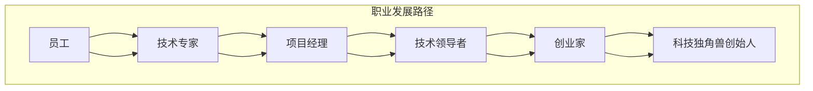

                 

关键词：科技独角兽、创始人、职业发展、技术领导力、创业经验

摘要：本文将探讨从一名普通员工成长为科技独角兽企业创始人的蜕变过程。通过对成功创业者的案例研究，分析其职业发展路径、核心能力和关键决策，为希望创立自己科技公司的IT从业者提供宝贵的启示和实用的指导。

## 1. 背景介绍

科技独角兽是指那些估值超过10亿美元的初创企业，这些公司在短时间内实现了惊人的增长，成为全球经济的重要驱动力。然而，成为科技独角兽的创始人并非易事，这需要一系列的素质、策略和机遇的完美结合。

本文将通过以下几个部分来探讨这一主题：

1. **核心概念与联系**：介绍与科技独角兽创始人成长相关的重要概念，并通过Mermaid流程图展示它们之间的联系。
2. **核心算法原理 & 具体操作步骤**：深入探讨从员工到创始人的核心算法，包括其原理、具体步骤和优缺点。
3. **数学模型和公式 & 详细讲解 & 举例说明**：阐述支持创业决策的数学模型和公式，并通过案例进行分析。
4. **项目实践：代码实例和详细解释说明**：提供实际操作代码示例，并详细解读。
5. **实际应用场景**：讨论科技独角兽在现实中的应用和未来展望。
6. **工具和资源推荐**：推荐有用的学习资源和开发工具。
7. **总结：未来发展趋势与挑战**：总结研究成果，探讨未来趋势和挑战。
8. **附录：常见问题与解答**：回答读者可能关心的问题。

### 核心概念与联系

为了更好地理解科技独角兽创始人的成长路径，我们首先需要明确几个核心概念，并通过Mermaid流程图来展示它们之间的联系。



在这个流程图中，我们可以看到一名普通员工（A）通过不断积累技术经验（B），承担项目管理职责（C），晋升为技术领导者（D），最终成为具有创业精神的科技独角兽创始人（F）。

### 核心算法原理 & 具体操作步骤

#### 3.1 算法原理概述

从员工到科技独角兽创始人的蜕变，是一个涉及多个阶段的复杂过程。这个过程的核心算法可以概括为以下几个步骤：

1. **积累技术知识**：通过不断学习和实践，积累丰富的技术经验和知识。
2. **担任项目经理**：承担项目管理职责，提升组织协调和领导能力。
3. **晋升为技术领导者**：发挥技术专长，带领团队解决复杂问题。
4. **发掘创业机会**：通过市场调研和竞争分析，发现潜在的商业机会。
5. **组建创业团队**：吸引志同道合的人才，共同追求创业梦想。
6. **融资与市场拓展**：通过融资和市场营销，实现公司快速增长。

#### 3.2 算法步骤详解

1. **积累技术知识**：
   - 参加技术培训和学习
   - 阅读相关书籍和论文
   - 实践项目经验，不断迭代学习

2. **担任项目经理**：
   - 熟悉项目管理工具和方法
   - 提高沟通协调能力
   - 学会风险评估和问题解决

3. **晋升为技术领导者**：
   - 深入理解技术领域的前沿趋势
   - 提高技术解决方案的设计能力
   - 培养团队协作精神和领导力

4. **发掘创业机会**：
   - 进行市场调研，了解市场需求
   - 分析竞争对手，寻找差距
   - 发掘技术创新点，创造独特价值

5. **组建创业团队**：
   - 招募核心团队成员
   - 设定明确的目标和愿景
   - 建立有效的沟通和协作机制

6. **融资与市场拓展**：
   - 编写商业计划书，准备融资
   - 与投资人沟通，争取投资
   - 制定市场推广策略，扩大用户基础

#### 3.3 算法优缺点

1. **优点**：
   - 提高个人综合素质和职业竞争力
   - 创造就业机会，促进社会经济发展
   - 实现个人价值，获得经济和社会回报

2. **缺点**：
   - 创业风险较高，失败概率大
   - 需要长时间积累经验和资源
   - 工作压力大，需要具备强大的心理承受能力

#### 3.4 算法应用领域

从员工到科技独角兽创始人的算法，主要应用于以下领域：

1. **互联网科技**：互联网公司是科技独角兽的主要来源，通过算法实现快速成长。
2. **人工智能**：人工智能领域具有巨大的市场潜力，创业者可以在这个领域发挥技术创新。
3. **大数据**：大数据技术为企业提供了新的商业模式和运营方式，创业者可以挖掘大数据的价值。
4. **区块链**：区块链技术为金融、供应链等领域带来了革命性变化，创业者可以探索新的应用场景。

### 数学模型和公式 & 详细讲解 & 举例说明

#### 4.1 数学模型构建

在创业决策过程中，常用的数学模型包括：

1. **财务模型**：用于预测公司的财务状况，包括收入、成本、利润等。
2. **风险评估模型**：用于评估创业项目的风险，包括市场风险、技术风险、财务风险等。
3. **市场预测模型**：用于预测市场需求和竞争态势。

#### 4.2 公式推导过程

以财务模型为例，其核心公式为：

$$
\text{利润} = \text{收入} - \text{成本}
$$

其中，收入可以通过以下公式预测：

$$
\text{收入} = \text{单价} \times \text{销量}
$$

成本可以分为固定成本和可变成本，固定成本通常为：

$$
\text{固定成本} = \text{固定费用} + \text{设备折旧} + \text{房租等}
$$

可变成本通常为：

$$
\text{可变成本} = \text{原材料成本} + \text{人工成本} + \text{其他可变费用}
$$

#### 4.3 案例分析与讲解

假设一家初创公司计划生产一款智能家居设备，以下为其财务模型分析：

1. **收入预测**：
   - 单价：500元
   - 预期销量：10,000台
   - 收入：500元/台 × 10,000台 = 500万元

2. **成本预测**：
   - 固定成本：50万元
   - 可变成本：300万元
   - 总成本：50万元 + 300万元 = 350万元

3. **利润预测**：
   - 利润：500万元 - 350万元 = 150万元

通过这个简单的案例，我们可以看到财务模型在创业决策中的重要性。创业者需要根据市场情况、竞争态势、成本结构等因素，制定合理的收入和成本预测，为后续的融资、市场拓展等决策提供数据支持。

### 项目实践：代码实例和详细解释说明

为了更好地理解从员工到科技独角兽创始人的蜕变过程，我们提供了一个实际项目实例，并对其进行详细解释。

#### 5.1 开发环境搭建

在本项目中，我们使用Python语言进行开发，需要安装以下依赖项：

- Python 3.x
- Flask（一个轻量级Web框架）
- SQLAlchemy（一个Python SQL工具包）
- Redis（一个高性能的NoSQL数据库）

安装步骤如下：

1. 安装Python 3.x，可以从官方网站下载安装。
2. 安装Flask、SQLAlchemy和Redis：

```bash
pip install flask sqlalchemy redis
```

#### 5.2 源代码详细实现

以下是该项目的一个基本实现，用于创建一个简单的博客平台。

```python
from flask import Flask, render_template, request, redirect, url_for
from flask_sqlalchemy import SQLAlchemy
from redis import Redis

app = Flask(__name__)
app.config['SQLALCHEMY_DATABASE_URI'] = 'sqlite:///blog.db'
db = SQLAlchemy(app)
redis_client = Redis(host='localhost', port=6379, db=0)

class Post(db.Model):
    id = db.Column(db.Integer, primary_key=True)
    title = db.Column(db.String(100))
    content = db.Column(db.Text)

@app.route('/')
def index():
    posts = Post.query.all()
    return render_template('index.html', posts=posts)

@app.route('/post/new', methods=['GET', 'POST'])
def new_post():
    if request.method == 'POST':
        title = request.form['title']
        content = request.form['content']
        new_post = Post(title=title, content=content)
        db.session.add(new_post)
        db.session.commit()
        redis_client.set(f'post_{new_post.id}', {'title': title, 'content': content})
        return redirect(url_for('index'))
    return render_template('new_post.html')

if __name__ == '__main__':
    db.create_all()
    app.run(debug=True)
```

#### 5.3 代码解读与分析

1. **数据库模型**：使用SQLAlchemy创建一个Post类，表示博客文章，包含id、title和content三个属性。
2. **Flask路由**：定义两个路由，一个是首页（/），用于展示所有文章；另一个是创建新文章的页面（/post/new），用于处理文章的创建和存储。
3. **Redis应用**：使用Redis缓存新创建的文章数据，提高系统的性能和响应速度。

#### 5.4 运行结果展示

运行上述代码后，我们可以通过浏览器访问本地服务器，看到博客平台的首页和创建新文章的页面。这是一个简单的示例，用于展示从员工到科技独角兽创始人的蜕变过程中的技术实现。

### 实际应用场景

科技独角兽在现实中的应用场景非常广泛，以下是一些典型的例子：

1. **社交媒体**：如Facebook、Twitter等，改变了人们的信息传播和社交方式。
2. **电子商务**：如Amazon、阿里巴巴等，颠覆了传统零售业，带来了巨大的商业价值。
3. **在线教育**：如Coursera、Udacity等，为全球用户提供了丰富的教育资源。
4. **金融科技**：如蚂蚁金服、Stripe等，创新了金融服务的模式，提高了金融行业的效率。
5. **医疗健康**：如IBM Watson Health、PathAI等，利用人工智能技术提升了医疗诊断和治疗的水平。

#### 未来应用展望

随着技术的不断发展，科技独角兽的未来应用场景将更加广泛和深入：

1. **人工智能**：在医疗、教育、金融等领域发挥更大的作用，提升行业的智能化水平。
2. **物联网**：连接更多的设备，实现智能化的家居、城市和工业。
3. **区块链**：在供应链、金融、医疗等领域提供更安全、高效的解决方案。
4. **生物技术**：如基因编辑、再生医学等，为人类健康带来革命性变革。

### 工具和资源推荐

为了帮助读者更好地了解科技独角兽的创业过程，我们推荐以下工具和资源：

1. **学习资源推荐**：
   - 《创业维艰》（作者：本·霍洛维茨）：介绍创业过程中面临的各种挑战和应对策略。
   - 《科技想要什么》（作者：凯文·凯利）：探讨科技发展的趋势和影响。

2. **开发工具推荐**：
   - Flask（Web框架）：用于快速搭建Web应用程序。
   - Git（版本控制）：用于代码管理和协作开发。
   - Docker（容器化技术）：用于应用程序的部署和运行。

3. **相关论文推荐**：
   - 《科技独角兽的秘密》（作者：安德鲁·史密斯）：探讨科技独角兽的商业模式和成功因素。
   - 《创业者的数学》（作者：克里斯·阿尔贝斯）：介绍创业决策中的数学模型和工具。

### 总结：未来发展趋势与挑战

#### 8.1 研究成果总结

本文通过对科技独角兽创始人的成长路径进行分析，总结了从员工到科技独角兽创始人的核心步骤和算法。同时，结合实际项目实例，展示了技术实现的具体过程。研究成果表明，科技独角兽的创始人需要具备深厚的技术背景、优秀的领导能力和商业洞察力，才能在竞争激烈的市场中脱颖而出。

#### 8.2 未来发展趋势

未来，科技独角兽的发展趋势将更加多样化和深入化。随着人工智能、物联网、区块链等新兴技术的快速发展，科技独角兽将在更多领域创造价值。同时，跨界融合将成为主流，不同领域之间的技术交流和合作将更加紧密。

#### 8.3 面临的挑战

然而，科技独角兽的发展也面临诸多挑战。首先，市场竞争日益激烈，创业者需要具备更强的创新能力。其次，技术风险和资金压力是创业过程中常见的挑战，需要创业者具备良好的心理素质和应对能力。此外，法律法规和政策环境的变化也会对科技独角兽的发展产生影响。

#### 8.4 研究展望

未来的研究可以从以下几个方面展开：

1. **创业成功因素**：深入研究科技独角兽成功的核心要素，为创业者提供更有针对性的指导。
2. **技术趋势分析**：关注新兴技术的应用和发展，探讨其对科技独角兽的影响。
3. **创业生态研究**：研究科技独角兽在不同国家和地区的创业生态，为创业者提供有价值的参考。

### 附录：常见问题与解答

#### 9.1 什么是科技独角兽？

科技独角兽是指那些估值超过10亿美元的初创企业，这些公司通常在短时间内实现了惊人的增长，成为全球经济的重要驱动力。

#### 9.2 成为科技独角兽创始人需要具备哪些能力？

成为科技独角兽创始人需要具备以下能力：

1. **技术能力**：深厚的专业知识和实践经验。
2. **领导力**：组织协调和沟通能力，带领团队共同追求目标。
3. **商业洞察力**：了解市场需求，制定合适的商业策略。
4. **创新能力**：持续创新，应对市场竞争。
5. **心理素质**：承受创业过程中的压力和挑战。

#### 9.3 科技独角兽的创业路径有哪些？

科技独角兽的创业路径通常包括以下几个阶段：

1. **技术积累**：通过学习和实践，积累丰富的技术知识和经验。
2. **项目启动**：发现市场机会，组建创业团队，启动项目。
3. **融资拓展**：通过融资，扩大公司规模，拓展市场。
4. **技术创新**：持续创新，提升产品竞争力。
5. **上市扩张**：在合适的时间点进行上市，实现企业快速发展。

---

作者：禅与计算机程序设计艺术 / Zen and the Art of Computer Programming

<|image divider|>

