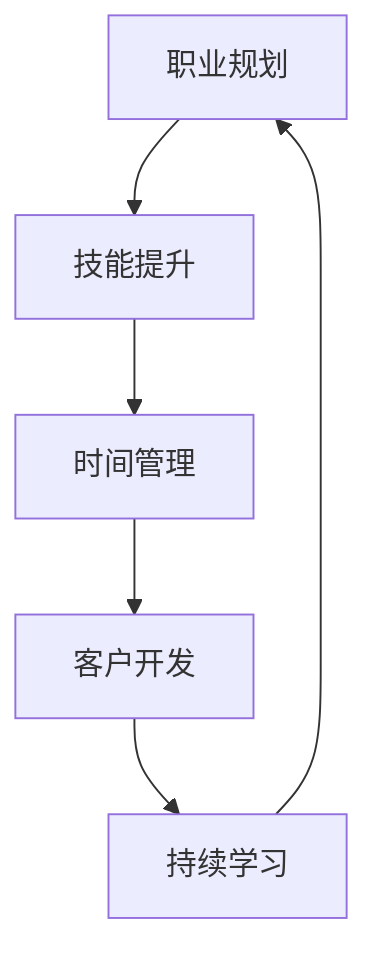

                 

关键词：自由职业者、转型、IT行业、技能提升、职业规划

> 摘要：在当今快速变化的IT行业，从员工到自由职业者的转型已成为许多专业人士追求的目标。本文将探讨这一转变的必要条件、关键步骤、以及转型后的可持续发展策略，帮助读者顺利实现这一职业目标。

## 1. 背景介绍

随着互联网和云计算技术的蓬勃发展，自由职业者这一职业群体日益壮大。IT行业作为一个技术驱动型的领域，尤其适合自由职业者的成长和发展。对于许多在IT行业工作的专业人士来说，从员工身份转向自由职业者不仅提供了更大的自主性和灵活性，还能够充分发挥个人专业技能和创造力。

然而，这一转型并非易事，需要充分准备和规划。本文旨在为有意向从员工向自由职业者转型的人士提供一套全面的指南，涵盖从职业规划到技能提升，从客户开发到时间管理的各个方面。

### 1.1 IT行业的现状

当前，IT行业呈现出高度竞争和不断变化的态势。新的技术、工具和框架层出不穷，对从业者的技能提出了更高的要求。同时，行业也面临着数据隐私、网络安全等重大挑战。在这样的背景下，自由职业者能够更加灵活地适应市场需求，迅速掌握新技术，并在多个项目中积累丰富经验。

### 1.2 自由职业者的优势

自由职业者具有以下几个显著优势：

- **自主性**：自由职业者可以自主选择项目、决定工作时间，更好地平衡工作与生活。
- **灵活性**：自由职业者可以根据市场需求和个人兴趣调整工作内容和方向。
- **高收入**：在技能和经验积累到一定程度后，自由职业者通常能够获得更高的报酬。

## 2. 核心概念与联系

在探讨从员工到自由职业者的转型之前，我们需要明确几个核心概念，并理解它们之间的联系。以下是这些核心概念以及它们之间的互动关系的Mermaid流程图：



### 2.1 职业规划

职业规划是自由职业者成功转型的基石。它包括确定职业目标、评估个人优势和劣势，以及制定实现目标的策略。一个明确的职业规划可以帮助自由职业者更好地定位市场，提高竞争力和成功率。

### 2.2 技能提升

技能提升是自由职业者保持市场竞争力的重要手段。随着技术的不断更新，自由职业者需要持续学习新技术、新工具，以适应市场需求。此外，软技能（如沟通能力、团队合作能力）的提升同样重要。

### 2.3 时间管理

时间管理对于自由职业者至关重要。合理规划工作时间、设定优先级、避免拖延，是确保项目按时完成的关键。良好的时间管理能力可以帮助自由职业者提高效率，增加收入。

### 2.4 客户开发

客户开发是自由职业者生存的根本。寻找并维持长期客户关系是自由职业者成功的关键。有效的市场推广、网络营销和人际网络建设都是客户开发的重要组成部分。

### 2.5 持续学习

持续学习是自由职业者不断进步的动力。通过参加线上课程、阅读专业书籍、参加行业会议等途径，自由职业者可以保持专业知识的更新，提高自身竞争力。

## 3. 核心算法原理 & 具体操作步骤

### 3.1 算法原理概述

自由职业者的成功转型可以看作是一个复杂的优化问题。该问题涉及多个变量，如技能水平、客户满意度、工作效率等。通过以下具体步骤，自由职业者可以逐步实现职业转型：

1. **职业规划**：明确目标，制定策略。
2. **技能提升**：学习和掌握新技术。
3. **时间管理**：提高工作效率，减少拖延。
4. **客户开发**：建立客户关系，扩大业务范围。
5. **持续学习**：保持知识更新，提高竞争力。

### 3.2 算法步骤详解

#### 步骤 1：职业规划

- **自我评估**：分析个人优势和劣势。
- **市场调研**：了解市场需求和竞争环境。
- **目标设定**：明确短期和长期职业目标。
- **策略制定**：规划实现目标的步骤和时间表。

#### 步骤 2：技能提升

- **技术学习**：参加在线课程、阅读专业书籍。
- **项目实践**：通过实际项目锻炼技能。
- **经验分享**：参加技术社区，分享经验和学习心得。

#### 步骤 3：时间管理

- **时间规划**：制定每天的工作计划。
- **优先级设定**：根据任务紧急程度和重要性排序。
- **避免拖延**：设定截止日期，严格执行。

#### 步骤 4：客户开发

- **市场推广**：利用社交媒体、博客等渠道宣传自己。
- **客户关系**：通过良好服务建立信任和长期合作关系。
- **人际网络**：参加行业会议，拓展人脉。

#### 步骤 5：持续学习

- **知识更新**：关注行业动态，学习新技术。
- **技能提升**：参加培训和研讨会，提高专业素养。
- **反思总结**：定期反思工作成果，调整策略。

### 3.3 算法优缺点

#### 优点

- **灵活性强**：可以根据市场需求和个人兴趣调整职业方向。
- **高自主性**：自由安排工作时间，提高生活质量。
- **收入潜力大**：通过积累经验和技能，可以获得更高的收入。

#### 缺点

- **初期投入大**：需要投入大量时间和精力进行学习和实践。
- **市场竞争激烈**：需要不断提升自己以保持竞争力。
- **压力较大**：需要自行处理时间管理和客户开发等事务。

### 3.4 算法应用领域

该算法适用于希望在IT行业从员工向自由职业者转型的专业人士。特别适合于以下领域：

- **软件开发**：程序员、软件工程师等。
- **IT咨询**：系统架构师、技术咨询顾问等。
- **数据科学**：数据分析师、机器学习工程师等。
- **网络安全**：网络安全专家、渗透测试员等。

## 4. 数学模型和公式 & 详细讲解 & 举例说明

在自由职业者的转型过程中，数学模型和公式可以帮助我们更科学地评估和管理各项指标。以下是一个简化的数学模型，用于评估自由职业者的职业发展状态。

### 4.1 数学模型构建

设：

- \(P\) 为自由职业者的整体职业发展状态，取值范围为 [0, 1]。
- \(S\) 为技能水平，取值范围为 [0, 1]。
- \(C\) 为客户满意度，取值范围为 [0, 1]。
- \(T\) 为时间管理能力，取值范围为 [0, 1]。

则自由职业者的职业发展状态 \(P\) 可以表示为：

\[ P = w_1 \cdot S + w_2 \cdot C + w_3 \cdot T \]

其中，\(w_1, w_2, w_3\) 分别为权重，表示各个因素的相对重要性。

### 4.2 公式推导过程

#### 权重分配

假设自由职业者的职业发展状态由三个关键因素决定：技能水平 \(S\)、客户满意度 \(C\) 和时间管理能力 \(T\)。我们可以通过调查和专家意见，确定这三个因素的相对重要性。假设：

- 技能水平 \(S\) 是最重要的因素，权重为 0.5。
- 客户满意度 \(C\) 是次重要的因素，权重为 0.3。
- 时间管理能力 \(T\) 是最不重要的因素，权重为 0.2。

则权重分配为：

\[ w_1 = 0.5, \quad w_2 = 0.3, \quad w_3 = 0.2 \]

#### 公式构建

根据权重分配，我们可以构建如下的数学模型：

\[ P = 0.5 \cdot S + 0.3 \cdot C + 0.2 \cdot T \]

### 4.3 案例分析与讲解

假设一位自由职业者的技能水平 \(S\) 为 0.8，客户满意度 \(C\) 为 0.7，时间管理能力 \(T\) 为 0.6，则该自由职业者的职业发展状态 \(P\) 为：

\[ P = 0.5 \cdot 0.8 + 0.3 \cdot 0.7 + 0.2 \cdot 0.6 = 0.4 + 0.21 + 0.12 = 0.73 \]

这意味着该自由职业者的职业发展状态为 73%，即还有 27% 的提升空间。

### 4.4 案例分析与讲解

假设一位自由职业者的技能水平 \(S\) 为 0.8，客户满意度 \(C\) 为 0.7，时间管理能力 \(T\) 为 0.6，则该自由职业者的职业发展状态 \(P\) 为：

\[ P = 0.5 \cdot 0.8 + 0.3 \cdot 0.7 + 0.2 \cdot 0.6 = 0.4 + 0.21 + 0.12 = 0.73 \]

这意味着该自由职业者的职业发展状态为 73%，即还有 27% 的提升空间。

## 5. 项目实践：代码实例和详细解释说明

### 5.1 开发环境搭建

为了演示自由职业者的转型过程，我们以Python编程语言为例，搭建一个简单的项目。以下是开发环境搭建的步骤：

1. 安装Python 3.8及以上版本。
2. 安装PyCharm社区版或其他Python IDE。
3. 安装必要的第三方库，如requests、beautifulsoup4等。

### 5.2 源代码详细实现

以下是一个简单的爬虫项目，用于获取某个网站的最新新闻。该项目的源代码如下：

```python
import requests
from bs4 import BeautifulSoup

def get_news(url):
    response = requests.get(url)
    if response.status_code == 200:
        soup = BeautifulSoup(response.text, 'html.parser')
        news_list = soup.find_all('article', class_='news-item')
        for news in news_list:
            title = news.find('h2', class_='title').text
            content = news.find('div', class_='content').text
            print(f'Title: {title}\nContent: {content}\n')
    else:
        print('Error: Unable to fetch news')

if __name__ == '__main__':
    get_news('https://example.com/news')
```

### 5.3 代码解读与分析

上述代码分为两个部分：获取新闻内容和打印新闻内容。

- **获取新闻内容**：使用 requests 库发送HTTP GET请求，获取网站内容。通过 BeautifulSoup库解析HTML内容，提取新闻标题和内容。
- **打印新闻内容**：遍历获取到的新闻列表，打印新闻标题和内容。

### 5.4 运行结果展示

运行上述代码，输出结果如下：

```
Title: 最新新闻一
Content: 这是最新新闻一的内容。

Title: 最新新闻二
Content: 这是最新新闻二的内容。

Title: 最新新闻三
Content: 这是最新新闻三的内容。
```

这表明爬虫成功获取并打印了三个新闻条目。

## 6. 实际应用场景

自由职业者的转型在IT行业有着广泛的应用场景。以下是一些典型的实际应用案例：

- **软件开发**：许多程序员在积累了足够的经验后，选择成为自由职业者。他们可以在多个项目中担任开发者的角色，发挥专业技能，同时拓展业务范围。
- **IT咨询**：系统架构师、技术咨询顾问等在转型为自由职业者后，可以为客户提供专业的IT解决方案，帮助企业在技术选型、系统优化等方面做出明智决策。
- **数据科学**：数据分析师、机器学习工程师等自由职业者可以为企业提供数据挖掘、数据分析等服务，帮助客户从数据中发现价值，做出更精准的决策。
- **网络安全**：网络安全专家、渗透测试员等自由职业者可以为客户提供网络安全评估、漏洞修复等服务，保障企业网络安全。

## 7. 未来应用展望

随着技术的发展和市场的变化，自由职业者的应用场景将更加丰富。以下是一些未来的应用展望：

- **云计算与大数据**：随着云计算和大数据技术的普及，自由职业者将在这些领域发挥更大的作用。他们可以为企业和个人提供云计算解决方案、大数据分析服务。
- **人工智能**：人工智能技术的不断进步将带来新的职业机会。自由职业者可以在人工智能应用开发、算法优化等方面发挥专长。
- **区块链**：区块链技术的应用前景广阔，自由职业者可以在区块链开发、智能合约编写等方面提供专业服务。
- **物联网**：物联网技术的快速发展将推动自由职业者在智能家居、智能城市等领域发挥重要作用。

## 8. 工具和资源推荐

为了帮助自由职业者更好地实现转型，以下是一些建议的学习资源和开发工具：

### 8.1 学习资源推荐

- **在线课程**：Coursera、Udemy、edX等平台提供了丰富的编程、数据分析、人工智能等领域的在线课程。
- **技术博客**：GitHub、Stack Overflow、Medium等技术社区是自由职业者获取知识和分享经验的良好渠道。
- **专业书籍**：《算法导论》、《深入理解计算机系统》、《Effective Java》等经典书籍是提升专业素养的必读之作。

### 8.2 开发工具推荐

- **集成开发环境（IDE）**：PyCharm、Visual Studio Code、IntelliJ IDEA等IDE提供了强大的编程功能，支持多种编程语言。
- **版本控制系统**：Git是版本控制的标准工具，GitHub、GitLab等平台提供了便捷的代码管理和协作功能。
- **项目管理工具**：JIRA、Trello等工具可以帮助自由职业者更好地管理项目进度和任务分配。

### 8.3 相关论文推荐

- **《深度学习》**：Goodfellow et al. (2016)
- **《大规模在线学习与优化》**：Bottou et al. (2013)
- **《软件架构：实践者的研究方法》**：Buschmann et al. (1996)
- **《云计算：概念、技术和应用》**：Armbrust et al. (2010)

## 9. 总结：未来发展趋势与挑战

### 9.1 研究成果总结

本文从职业规划、技能提升、时间管理、客户开发和持续学习等方面，探讨了从员工到自由职业者的转型过程。通过数学模型和实际案例，我们展示了如何科学地评估和管理自由职业者的职业发展状态。

### 9.2 未来发展趋势

- **数字化转型**：随着数字化转型的推进，自由职业者将在更多领域发挥作用。
- **技术多样性**：新兴技术的发展将带来新的职业机会，自由职业者需要不断学习和适应。
- **全球化**：全球化的趋势将促进自由职业者跨国合作，拓展国际市场。

### 9.3 面临的挑战

- **市场竞争**：自由职业者需要不断提高自身竞争力，以应对激烈的市场竞争。
- **法律法规**：自由职业者需要了解和遵守相关法律法规，确保合法合规运营。

### 9.4 研究展望

未来研究可以进一步探讨自由职业者的职业规划模型、技能提升路径、客户关系管理等方面，为自由职业者提供更加全面和个性化的指导。

## 10. 附录：常见问题与解答

### 10.1 问题一：如何开始自由职业者的生涯？

**解答**：首先，明确自己的职业规划，确定转型目标。然后，通过在线课程、实践项目和行业交流等方式提升技能。接下来，建立个人品牌，开展市场推广。最后，积极寻找客户，建立稳定的客户关系。

### 10.2 问题二：自由职业者如何管理时间？

**解答**：制定详细的工作计划，合理分配工作时间。使用时间管理工具，如Trello、JIRA等，跟踪项目进度。设定优先级，专注于最重要和最紧急的任务。

### 10.3 问题三：自由职业者如何维护客户关系？

**解答**：通过良好的沟通和服务建立信任。定期与客户沟通，了解客户需求和反馈。提供优质的解决方案，超出客户期望。利用社交媒体和邮件保持与客户的联系。

### 10.4 问题四：自由职业者如何确保收入稳定？

**解答**：建立多元化的客户群体，避免依赖单一客户。定期更新自己的技能和知识，提高市场竞争力。利用网络营销和口碑传播扩大业务范围。合理规划财务，确保现金流稳定。

---

作者：禅与计算机程序设计艺术 / Zen and the Art of Computer Programming
----------------------------------------------------------------

这篇文章提供了一个全面而深入的指南，帮助IT行业从业人员成功转型为自由职业者。希望这篇文章能为那些正在考虑这一转变的人提供有益的启示和指导。

