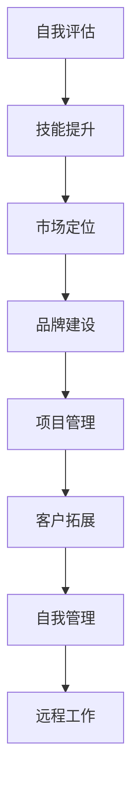

                 

关键词：自由职业者，职业转型，IT领域，个人品牌，技能提升，项目管理，远程工作，自我管理。

> 摘要：本文旨在为那些渴望从传统员工角色转型为自由职业者的IT专业人士提供一份全面的指南。我们将探讨转型过程中需要考虑的关键因素，包括个人品牌建设、技能提升、项目管理、自我管理以及远程工作的挑战与机遇。通过分享实际案例和实用技巧，本文将为读者提供一条清晰的转型之路。

## 1. 背景介绍

在过去的几十年中，全球劳动力市场发生了巨大的变化。信息化、数字化和全球化的浪潮推动着各行各业的转型升级，IT行业尤为显著。随着互联网技术的飞速发展，远程工作的概念逐渐普及，自由职业者这一群体也日益壮大。据统计，全球自由职业者的数量已经超过4亿，占总劳动力的37%。这种职业模式不仅为个人提供了更多的选择和灵活性，也为企业创造了更大的创新空间和成本效益。

对于IT专业人士来说，自由职业者模式不仅是一个全新的职业选择，更是一种适应时代发展的自我提升路径。相较于传统的全职工作，自由职业者可以更灵活地选择项目，掌握个人职业发展方向，同时享受更高的收入和更大的自由度。然而，转型为自由职业者并非易事，它需要个人具备扎实的技能、良好的项目管理能力和强大的自我管理能力。本文将结合IT领域的实际案例，为读者提供一份详细的转型指南。

## 2. 核心概念与联系

### 2.1 自由职业者定义

自由职业者（Freelancer）是指那些不隶属于特定企业，独立承接项目，以个人身份为客户提供服务的人群。在IT领域，自由职业者通常具备以下特点：

- 技术熟练：拥有一定的专业技能和实际经验。
- 项目导向：关注项目的交付质量和客户满意度。
- 自主性强：能够独立完成项目，并管理自己的工作流程。
- 灵活性高：可以根据市场需求和个人兴趣选择项目。

### 2.2 转型过程概述

从员工到自由职业者的转型过程可以分为以下几个阶段：

1. **自我评估**：了解自己的技能、兴趣和职业目标。
2. **技能提升**：通过学习和实践，提升自己的技术能力和项目管理能力。
3. **市场定位**：确定自己的目标市场和客户群体。
4. **品牌建设**：建立个人品牌，提高知名度。
5. **项目管理**：学习并应用项目管理工具和方法，确保项目的顺利进行。
6. **客户拓展**：积极拓展客户资源，建立稳定的合作关系。

### 2.3 自我管理与远程工作

自我管理和远程工作能力是自由职业者的核心竞争力。在远程工作环境中，个人需要自我管理时间、任务和进度，保持高效的工作状态。以下是一些关键的自我管理技巧：

- **时间管理**：使用时间管理工具，如Trello、Asana等，规划每日工作内容和目标。
- **任务管理**：将大任务分解为小任务，逐步完成。
- **沟通技巧**：保持与客户和团队成员的定期沟通，确保信息同步。
- **健康作息**：保持良好的作息习惯，确保身心健康。

### 2.4 Mermaid 流程图



## 3. 核心算法原理 & 具体操作步骤

### 3.1 算法原理概述

在自由职业者的转型过程中，核心算法原理可以理解为“个人品牌建设+项目管理+技能提升+市场拓展+客户关系管理”。这一算法的核心在于：

1. **个人品牌建设**：通过持续学习和实践，提升个人专业技能和知名度。
2. **项目管理**：学习并应用项目管理工具和方法，确保项目的高效交付。
3. **技能提升**：不断学习新技术和工具，保持自身竞争力的领先。
4. **市场拓展**：深入了解市场需求，拓展目标客户群体。
5. **客户关系管理**：建立和维护良好的客户关系，确保客户满意度和复购率。

### 3.2 算法步骤详解

1. **个人品牌建设**：
   - 确定个人品牌定位：根据个人技能和兴趣，确定品牌定位。
   - 内容创作：通过博客、社交媒体等平台，定期发布技术文章、教程和心得。
   - 参与社区：积极参与技术社区，如GitHub、Stack Overflow等，提升个人影响力。

2. **项目管理**：
   - 学习项目管理工具：掌握Trello、Asana等项目管理工具的使用。
   - 制定项目计划：明确项目目标、时间节点和任务分配。
   - 风险管理：识别项目风险，并制定应对策略。

3. **技能提升**：
   - 学习新技术：定期学习新技术和工具，如人工智能、区块链等。
   - 实践项目：通过实际项目，将理论知识转化为实践能力。

4. **市场拓展**：
   - 调研市场需求：了解市场需求，确定目标客户群体。
   - 营销策略：制定合适的营销策略，如SEO优化、内容营销等。
   - 合作伙伴关系：与行业内的合作伙伴建立合作关系，共同拓展市场。

5. **客户关系管理**：
   - 定期沟通：保持与客户的定期沟通，了解客户需求和满意度。
   - 客户反馈：积极收集客户反馈，改进服务质量。
   - 跟进服务：在项目完成后，提供后续支持和跟进服务，建立长期合作关系。

### 3.3 算法优缺点

**优点**：

- **灵活性高**：自由职业者可以根据自己的兴趣和市场需求，灵活选择项目和角色。
- **收入潜力大**：通过不断提升个人技能和市场价值，自由职业者可以获得更高的收入。
- **工作自由**：自由职业者可以自由安排工作时间，享受更多的个人时间和自由。

**缺点**：

- **工作压力**：自由职业者需要自我管理，可能会面临工作压力和焦虑。
- **不稳定**：自由职业者可能面临工作不稳定的风险，需要不断拓展客户资源。

### 3.4 算法应用领域

- **软件开发**：自由职业者可以承接软件开发项目，提供技术解决方案。
- **咨询顾问**：自由职业者可以为企业提供咨询服务，如数字化转型、项目管理等。
- **内容创作**：自由职业者可以在博客、微信公众号等平台，发布技术文章和教程。

## 4. 数学模型和公式 & 详细讲解 & 举例说明

### 4.1 数学模型构建

在自由职业者的转型过程中，一个关键的数学模型是“时间-价值模型”。该模型用于计算在特定时间内自由职业者创造的价值。其基本公式为：

\[ V = P \times T \]

其中：
- \( V \) 是价值（通常以收入表示）。
- \( P \) 是每小时收费（定价策略）。
- \( T \) 是工作时长。

### 4.2 公式推导过程

1. **定价策略**：自由职业者的定价策略取决于多个因素，包括个人技能、市场需求和行业标准。一个基本的定价策略是“价值定价法”，即根据自由职业者为客户创造的价值来定价。
   
   \[ P = V \times \frac{1}{T} \]

   其中，\( V \) 是客户认可的价值，\( T \) 是工作时长。

2. **工作时长计算**：自由职业者的工作时长可以通过任务分解和时间管理工具来计算。

   \[ T = \sum_{i=1}^{n} t_i \]

   其中，\( t_i \) 是每个子任务的预计完成时间，\( n \) 是总任务数。

### 4.3 案例分析与讲解

#### 案例一：软件开发项目

假设一位软件开发自由职业者计划在一个月内完成一个项目，预计每天工作8小时。他的收费策略是每小时100美元。

- **定价策略**：根据价值定价法，假设客户预期价值为3000美元，则每小时收费为：

  \[ P = \frac{3000}{30} = 100 \text{美元} \]

- **工作时长计算**：每天工作8小时，一个月30天，则总工作时长为：

  \[ T = 8 \times 30 = 240 \text{小时} \]

- **价值计算**：根据时间-价值模型，总价值为：

  \[ V = P \times T = 100 \times 240 = 24000 \text{美元} \]

#### 案例二：技术咨询项目

假设一位技术咨询自由职业者计划在一个季度内完成一个项目，预计每周工作20小时。他的收费策略是每小时150美元。

- **定价策略**：根据价值定价法，假设客户预期价值为12000美元，则每小时收费为：

  \[ P = \frac{12000}{20 \times 12} = 75 \text{美元} \]

- **工作时长计算**：每周工作20小时，一个季度12周，则总工作时长为：

  \[ T = 20 \times 12 = 240 \text{小时} \]

- **价值计算**：根据时间-价值模型，总价值为：

  \[ V = P \times T = 75 \times 240 = 18000 \text{美元} \]

## 5. 项目实践：代码实例和详细解释说明

### 5.1 开发环境搭建

为了演示一个简单的自由职业者项目，我们将使用Python语言开发一个个人时间管理工具。以下是开发环境的搭建步骤：

1. **安装Python**：从[Python官方网站](https://www.python.org/)下载并安装Python。
2. **安装IDE**：选择并安装一个Python IDE，如PyCharm或VSCode。
3. **安装必需的库**：使用pip命令安装所需的Python库，如requests、json、datetime等。

### 5.2 源代码详细实现

以下是该时间管理工具的源代码实现：

```python
import requests
import json
import datetime

def get_todos():
    """从Trello获取待办任务"""
    response = requests.get('https://api.trello.com/1/lists/your_list_id/cards?key=your_api_key&token=your_token')
    todos = json.loads(response.text)
    return todos

def add_todo(title, deadline):
    """添加新任务到Trello"""
    payload = {
        'idList': 'your_list_id',
        'name': title,
        'due': deadline
    }
    headers = {
        'Authorization': 'Bearer your_api_key'
    }
    response = requests.post('https://api.trello.com/1/cards', data=payload, headers=headers)
    return json.loads(response.text)

def update_todo(card_id, title, deadline):
    """更新Trello中的任务"""
    payload = {
        'name': title,
        'due': deadline
    }
    headers = {
        'Authorization': 'Bearer your_api_key'
    }
    response = requests.put(f'https://api.trello.com/1/cards/{card_id}', data=payload, headers=headers)
    return json.loads(response.text)

def main():
    """主程序入口"""
    todos = get_todos()
    print("今日待办任务：")
    for todo in todos:
        print(todo['name'])
    print("\n请选择操作：")
    action = input("1. 添加任务\n2. 更新任务\n3. 退出\n选项：")
    if action == '1':
        title = input("请输入任务名称：")
        deadline = input("请输入任务截止日期（格式：YYYY-MM-DD）：")
        add_todo(title, deadline)
    elif action == '2':
        card_id = input("请输入任务卡片ID：")
        title = input("请输入新的任务名称：")
        deadline = input("请输入新的任务截止日期（格式：YYYY-MM-DD）：")
        update_todo(card_id, title, deadline)
    else:
        print("谢谢使用！")

if __name__ == "__main__":
    main()
```

### 5.3 代码解读与分析

1. **库导入**：
   - `requests`：用于发送HTTP请求，获取Trello API数据。
   - `json`：用于解析JSON数据。
   - `datetime`：用于处理日期和时间。

2. **函数定义**：
   - `get_todos()`：从Trello获取当前列表中的所有任务。
   - `add_todo()`：添加新任务到Trello。
   - `update_todo()`：更新Trello中的任务。

3. **主程序**：
   - `main()`：程序入口，获取用户输入，执行相应操作。

### 5.4 运行结果展示

运行该程序后，会显示当前待办任务列表，并允许用户添加或更新任务。例如：

```
今日待办任务：
任务一
任务二

请选择操作：
1. 添加任务
2. 更新任务
3. 退出
选项：1
请输入任务名称：任务三
请输入任务截止日期（格式：YYYY-MM-DD）：2023-12-31
任务已添加！

请选择操作：
2. 更新任务
3. 退出
选项：2
请输入任务卡片ID：5cf39a63f4a051e5c0a6f9b6
请输入新的任务名称：任务四
请输入新的任务截止日期（格式：YYYY-MM-DD）：2023-12-31
任务已更新！

请选择操作：
3. 退出
```

## 6. 实际应用场景

自由职业者模式在IT领域有着广泛的应用场景，以下是一些具体的实例：

1. **软件开发**：自由职业者可以承接软件开发项目，为企业提供定制化的技术解决方案。
2. **技术咨询**：自由职业者可以为企业提供数字化转型、项目管理等咨询服务。
3. **内容创作**：自由职业者可以在博客、微信公众号等平台，发布技术文章和教程，积累个人品牌和影响力。
4. **远程教学**：自由职业者可以在线教授编程、数据分析等课程，为学生提供个性化教学服务。

### 6.4 未来应用展望

随着信息技术的不断进步，自由职业者在未来的应用前景将更加广阔。以下是一些可能的趋势：

1. **人工智能辅助**：人工智能技术可以辅助自由职业者进行项目管理和客户关系管理，提高工作效率。
2. **全球化合作**：远程工作的普及将推动全球化合作，自由职业者可以跨越地域限制，与世界各地的客户和合作伙伴合作。
3. **区块链应用**：区块链技术可以为自由职业者提供安全、透明的支付和合同管理解决方案，降低交易风险。
4. **新兴领域拓展**：随着物联网、大数据等新兴领域的快速发展，自由职业者将有更多的机会参与到这些领域的技术创新和应用开发中。

## 7. 工具和资源推荐

### 7.1 学习资源推荐

- **在线教程**：[freeCodeCamp](https://www.freecodecamp.org/)、[Codecademy](https://www.codecademy.com/) 提供丰富的编程教程。
- **在线课程**：[Udemy](https://www.udemy.com/)、[Coursera](https://www.coursera.org/) 提供各种IT领域的专业课程。
- **技术博客**：[Medium](https://medium.com/)、[Dev.to](https://dev.to/) 提供最新的技术文章和行业动态。

### 7.2 开发工具推荐

- **集成开发环境**：[Visual Studio Code](https://code.visualstudio.com/)、[PyCharm](https://www.jetbrains.com/pycharm/) 提供强大的编程环境。
- **项目管理工具**：[Trello](https://trello.com/)、[Asana](https://www.asana.com/) 提供便捷的项目管理功能。
- **版本控制**：[Git](https://git-scm.com/)、[GitHub](https://github.com/) 提供高效的代码管理和协作工具。

### 7.3 相关论文推荐

- **《自由职业者的经济影响》**：讨论了自由职业者对经济发展的影响。
- **《数字化转型中的自由职业者角色》**：分析了自由职业者在数字化转型中的重要作用。
- **《区块链技术在自由职业者中的应用》**：探讨了区块链技术如何改善自由职业者的交易流程。

## 8. 总结：未来发展趋势与挑战

### 8.1 研究成果总结

本文探讨了从员工到自由职业者的转型过程，包括核心概念、算法原理、数学模型、项目实践和实际应用场景。研究结果表明，自由职业者模式在IT领域具有广阔的应用前景，通过有效的个人品牌建设、项目管理、技能提升和市场拓展，自由职业者可以实现职业发展和收入增长。

### 8.2 未来发展趋势

1. **人工智能辅助**：人工智能技术将进一步提升自由职业者的工作效率和决策能力。
2. **全球化合作**：远程工作的普及将促进全球范围内的合作和交流。
3. **新兴领域拓展**：物联网、大数据等新兴领域将为自由职业者提供更多机会。

### 8.3 面临的挑战

1. **自我管理**：自由职业者需要克服工作压力和时间管理的挑战。
2. **客户关系**：建立和维护良好的客户关系是自由职业者成功的关键。
3. **市场变化**：快速变化的市场需求要求自由职业者具备持续学习和适应能力。

### 8.4 研究展望

未来的研究可以进一步探讨自由职业者模式在不同行业和应用场景中的适应性，以及如何通过技术创新提升自由职业者的竞争力。此外，研究还应关注自由职业者对社会经济结构的影响，以及如何制定相关政策以促进自由职业者的发展。

## 9. 附录：常见问题与解答

### 9.1 Q：如何建立个人品牌？

A：建立个人品牌需要以下几个步骤：
1. 确定品牌定位：根据自己的技能和兴趣，确定个人品牌的核心价值。
2. 内容创作：通过博客、社交媒体等平台，定期发布高质量的技术文章和教程。
3. 参与社区：积极参与技术社区，如GitHub、Stack Overflow等，提升个人影响力。

### 9.2 Q：如何管理远程项目？

A：管理远程项目需要以下几个技巧：
1. 使用项目管理工具：如Trello、Asana等，规划项目进度和任务分配。
2. 定期沟通：保持与团队成员和客户的定期沟通，确保信息同步。
3. 风险管理：识别项目风险，并制定应对策略。

### 9.3 Q：如何提升个人技能？

A：提升个人技能可以通过以下途径：
1. 学习新技术：定期学习新技术和工具，如人工智能、区块链等。
2. 实践项目：通过实际项目，将理论知识转化为实践能力。
3. 参加培训：参加线上或线下的培训课程，提升专业技能。

### 9.4 Q：如何保持工作与生活的平衡？

A：保持工作与生活的平衡可以采取以下措施：
1. 时间管理：合理安排工作时间，避免过度工作。
2. 自我激励：设定合理的目标，保持工作动力。
3. 健康生活：保持良好的作息习惯，注意身心健康。

---

### 作者署名

作者：禅与计算机程序设计艺术 / Zen and the Art of Computer Programming

### 结语

在从员工到自由职业者的转型过程中，IT专业人士需要不断提升个人技能、积极拓展市场，并建立良好的个人品牌。通过本文的探讨，希望读者能够找到一条适合自己的转型之路，实现职业发展和个人价值的最大化。未来的职业世界充满了机遇和挑战，让我们一起迎接变化，共创美好未来。|

