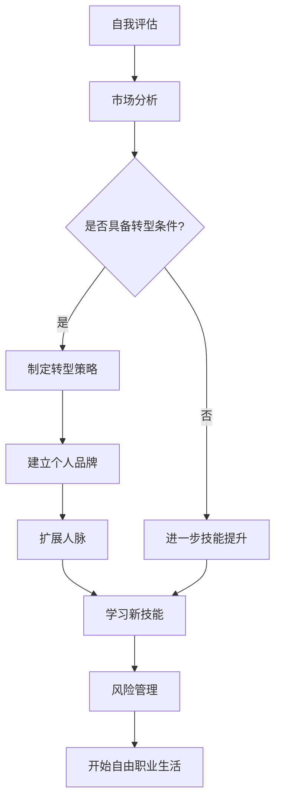

                 

关键词：自由职业者，转型，IT行业，技能提升，独立工作，职业规划

> 摘要：本文将探讨在IT行业从员工到自由职业者的成功转型之路。我们将分析转型的动机、必要的技能和心态调整，并提供一系列实用的策略和资源，帮助读者顺利过渡，迈向独立工作的自由职业生涯。

## 1. 背景介绍

在当今数字化时代，信息技术行业迅速发展，带来了一系列的职业机会。许多IT专业人士发现，传统的全职工作模式不再完全适合他们。一些因素，如灵活的工作时间、更广泛的工作选择以及自主管理的需求，促使越来越多的人考虑转型为自由职业者。

自由职业者的定义非常广泛，包括独立开发者、远程咨询师、自由撰稿人、自由UI/UX设计师等。他们在各种平台上提供服务，不受雇主的直接管理，自主决定工作内容和时间。这种职业选择不仅提供了更高的自由度，还可以带来更高的收入和职业成就感。

然而，转型为自由职业者并非易事，需要充分的准备和策略。本文将详细探讨从员工到自由职业者转型的各个方面，帮助读者实现这一重要转变。

### 1.1 自由职业者的优势

自由职业者具有以下优势：

- **时间灵活性**：自由职业者可以灵活安排工作时间，更好地平衡工作和生活。
- **工作选择**：自由职业者可以选择自己感兴趣的项目，而不是仅仅为了一家公司工作。
- **职业成长**：自由职业者有机会通过不断接受新的项目，学习新的技能，实现职业成长。
- **更高的收入潜力**：优秀的自由职业者可以通过积累声誉和客户，实现比传统员工更高的收入。

### 1.2 自由职业者的挑战

然而，自由职业者也面临着一系列挑战：

- **工作不稳定**：自由职业者的收入可能不稳定，有时会面临找不到新项目的情况。
- **自我管理**：自由职业者需要自我管理时间、任务和财务，这对很多人来说是一个挑战。
- **市场营销**：自由职业者需要自己推广自己，吸引新客户，这需要额外的努力和技能。

## 2. 核心概念与联系

### 2.1 自我评估

在考虑转型之前，自我评估是至关重要的一步。这包括以下几个方面：

- **技能评估**：识别和评估自己的技能和经验，确定哪些技能是自由职业市场上受欢迎的。
- **兴趣与目标**：确定自己对哪些项目或领域感兴趣，以及长期职业目标是什么。
- **职业价值观**：了解自己对于工作环境、工作内容和工作方式的价值观，确保与自由职业生活相符合。

### 2.2 市场分析

在自我评估之后，对自由职业市场进行分析至关重要。这包括：

- **市场需求**：了解当前市场上哪些技能和类型的工作需求量大。
- **竞争分析**：评估自己所在领域的竞争程度，了解竞争对手的优势和劣势。
- **定价策略**：确定合理的收费标准和定价策略，确保能够覆盖成本并保持竞争力。

### 2.3 转型策略

为了成功转型为自由职业者，以下策略是必不可少的：

- **建立个人品牌**：通过建立个人网站、参与社区活动、发布博客和在线课程等方式，提高自己的知名度和专业形象。
- **扩展人脉**：积极参与行业活动、加入专业组织、与同行建立联系，扩大自己的人脉网络。
- **学习新技能**：不断学习新技能和工具，保持自己在市场上的竞争力。
- **风险管理**：制定应对措施，如紧急储蓄、多样化收入来源等，以应对工作不稳定的情况。

### 2.4 Mermaid 流程图

以下是一个简单的Mermaid流程图，展示从员工到自由职业者的转型步骤：



## 3. 核心算法原理 & 具体操作步骤

### 3.1 算法原理概述

自由职业者的成功转型涉及一系列的策略和步骤。核心算法可以概括为以下四个步骤：

1. **自我评估**：评估自身技能和兴趣，明确转型目标和价值观。
2. **市场分析**：了解市场需求和竞争态势，确定适合的项目和定价策略。
3. **制定策略**：建立个人品牌，扩展人脉，学习新技能，并制定风险管理计划。
4. **实施与调整**：开始自由职业生活，不断调整和优化策略。

### 3.2 算法步骤详解

#### 3.2.1 自我评估

- **技能评估**：通过工作经历、项目经验和专业认证，评估自己的技能。
- **兴趣与目标**：思考自己真正热爱的工作内容和长期职业目标。
- **职业价值观**：了解自己对工作环境、内容和方式的偏好。

#### 3.2.2 市场分析

- **市场需求**：研究当前市场上哪些技能和类型的工作需求量大。
- **竞争分析**：分析竞争对手的优势和劣势，了解市场的竞争态势。
- **定价策略**：根据市场需求和竞争情况，制定合理的收费标准和定价策略。

#### 3.2.3 制定策略

- **建立个人品牌**：创建个人网站，发布高质量的内容，展示专业形象。
- **扩展人脉**：参与行业活动，加入专业组织，建立广泛的联系网络。
- **学习新技能**：定期学习新技能和工具，保持市场竞争力。
- **风险管理**：设立紧急储蓄，制定多样化收入来源的计划。

#### 3.2.4 实施与调整

- **开始自由职业生活**：根据制定的策略，开始接受自由职业项目。
- **持续调整**：根据项目反馈和市场变化，不断调整和优化工作策略。

### 3.3 算法优缺点

#### 优点：

- **灵活性**：自由职业者可以根据自己的时间和兴趣安排工作，实现生活与工作的平衡。
- **自主性**：自由职业者可以自主选择项目，发挥个人专长。
- **职业成长**：自由职业者有机会通过不断接受新的项目，学习新的技能，实现职业成长。

#### 缺点：

- **收入不稳定**：自由职业者的收入可能受到项目数量和市场波动的影响。
- **自我管理困难**：自由职业者需要自我管理时间、任务和财务，这对很多人来说是一个挑战。
- **市场竞争激烈**：在自由职业市场中，竞争非常激烈，需要不断学习新技能，保持竞争力。

### 3.4 算法应用领域

自由职业者的转型算法适用于广泛的技术领域，如软件开发、数据分析、网页设计、UI/UX设计、远程咨询等。无论技术背景如何，只要愿意付出努力，都可以通过上述算法实现成功转型。

## 4. 数学模型和公式 & 详细讲解 & 举例说明

### 4.1 数学模型构建

在自由职业者转型过程中，构建一个有效的数学模型可以帮助更好地理解和管理各种因素。以下是一个简单的数学模型：

设：
- \( T \) 为转型所需时间（单位：月）
- \( S \) 为技能水平（0-10，10为最高）
- \( M \) 为市场需求（0-100，100为最高）
- \( C \) 为竞争程度（0-10，10为最高）
- \( B \) 为品牌知名度（0-10，10为最高）
- \( I \) 为初始投资（单位：元）

转型成功的概率 \( P \) 可以表示为：

\[ P = \frac{S \times M \times B}{C + I} \]

### 4.2 公式推导过程

公式的推导基于以下几个假设：

1. 技能水平、市场需求和品牌知名度是决定自由职业者成功的核心因素。
2. 竞争程度和初始投资是转型过程中的不利因素。
3. 这些因素之间的相互作用可以通过乘法和除法表示。

### 4.3 案例分析与讲解

#### 案例背景：

李华是一名经验丰富的软件开发工程师，有5年的工作经验，想转型为自由职业者。

- 技能水平 \( S = 8 \)
- 市场需求 \( M = 90 \)
- 竞争程度 \( C = 6 \)
- 品牌知名度 \( B = 4 \)
- 初始投资 \( I = 5000 \)

代入公式，得到转型成功的概率：

\[ P = \frac{8 \times 90 \times 4}{6 + 5000} \approx 0.062 \]

这意味着李华转型成功的概率约为6.2%。

#### 案例分析：

李华的技能水平和市场需求较高，但品牌知名度和初始投资相对较低，导致转型成功的概率较低。为了提高概率，李华可以：

- 加强品牌建设，提高知名度。
- 扩大人脉，增加市场影响力。
- 减少初始投资，降低风险。

## 5. 项目实践：代码实例和详细解释说明

### 5.1 开发环境搭建

为了实现从员工到自由职业者的转型，我们首先需要搭建一个合适的工作环境。以下是一个简单的步骤：

1. 安装操作系统：推荐使用Linux或Mac OS，因为它们在开发环境中具有更好的性能和兼容性。
2. 安装开发工具：如Visual Studio Code、Git、JDK等。
3. 配置网络环境：确保网络连接稳定，以便于在线学习和交流。

### 5.2 源代码详细实现

以下是一个简单的示例，展示如何使用Python编写一个简单的博客系统。

```python
# blog_system.py

import logging
from flask import Flask, request, render_template

app = Flask(__name__)

@app.route('/')
def home():
    return render_template('home.html')

@app.route('/about')
def about():
    return render_template('about.html')

@app.route('/post', methods=['GET', 'POST'])
def post():
    if request.method == 'POST':
        title = request.form['title']
        content = request.form['content']
        # 存储博客到数据库
        # ...
        return f"Post '{title}' has been published."
    return render_template('post.html')

if __name__ == '__main__':
    app.run(debug=True)
```

### 5.3 代码解读与分析

上述代码是一个简单的Flask应用程序，用于创建、展示和管理博客文章。

- **主程序**：导入必要的库和设置Flask应用。
- **路由**：定义不同的URL路由，如主页、关于页和博客发布页。
- **模板**：使用HTML模板渲染页面，如`home.html`、`about.html`和`post.html`。

### 5.4 运行结果展示

运行上述代码后，将看到一个简单的博客系统，用户可以创建和发布博客文章。

```shell
$ pip install flask
$ python blog_system.py
* Running on http://127.0.0.1:5000/ (Press CTRL+C to quit)
* Restarting with stat
* Debugger is active!
* Debugger PIN: XXXX-XXXX-XXXX
```

在浏览器中访问`http://127.0.0.1:5000/`，将看到博客系统的主页。

## 6. 实际应用场景

### 6.1 软件开发

自由职业者可以提供各种软件开发服务，如Web应用、移动应用和桌面应用开发。他们可以使用多种编程语言和技术栈，如JavaScript、React、Vue、Python、Django等，为客户提供定制化的解决方案。

### 6.2 数据分析

数据分析是自由职业者广泛参与的领域。他们可以为客户提供数据清洗、数据可视化、机器学习模型构建等服务。常用的工具包括Python的Pandas、NumPy、Scikit-learn等。

### 6.3 UI/UX设计

自由职业者可以提供UI/UX设计服务，包括网站、移动应用和软件的用户界面设计。他们可以使用工具如Adobe XD、Sketch、Figma等，为客户创建美观且用户友好的设计。

### 6.4 远程咨询

IT专业人士可以提供远程技术咨询，如系统架构设计、性能优化、安全评估等。他们可以通过在线会议、电子邮件和即时通讯工具与客户沟通，提供专业的咨询服务。

## 7. 工具和资源推荐

### 7.1 学习资源推荐

- **在线课程**：Coursera、edX、Udemy、Pluralsight等平台提供了丰富的IT课程。
- **书籍**：《Python编程：从入门到实践》、《深入理解计算机系统》、《设计模式：可复用面向对象软件的基础》等。
- **博客和社区**：GitHub、Stack Overflow、Medium等，提供了丰富的技术资源和交流平台。

### 7.2 开发工具推荐

- **集成开发环境**：Visual Studio Code、JetBrains家族（如PyCharm、WebStorm）等。
- **版本控制**：Git和GitHub，提供了高效的代码管理和协作工具。
- **云服务**：AWS、Azure、Google Cloud Platform等，提供了强大的云计算和数据库服务。

### 7.3 相关论文推荐

- **《自由职业者的工作满意度及其影响因素研究》**：探讨了自由职业者的工作满意度及其影响因素。
- **《自由职业者的风险管理与对策研究》**：分析了自由职业者面临的风险以及应对策略。

## 8. 总结：未来发展趋势与挑战

### 8.1 研究成果总结

本文探讨了从员工到自由职业者的成功转型之路，分析了转型的动机、必要的技能和心态调整，并提供了一系列实用的策略和资源。研究表明，自由职业者可以通过自我评估、市场分析、制定转型策略和实施与调整，实现成功的转型。

### 8.2 未来发展趋势

随着数字化和远程工作的普及，自由职业者的市场需求将继续增长。未来的自由职业者将更加注重专业技能的提升、个人品牌的建设和市场分析的能力。此外，AI和机器学习技术的进步也将为自由职业者提供更多机会，如自动化工具、智能助手等。

### 8.3 面临的挑战

自由职业者将面临工作不稳定、自我管理困难、市场竞争激烈等挑战。为了应对这些挑战，自由职业者需要不断提升自身技能，建立强大的个人品牌，并制定有效的风险管理计划。

### 8.4 研究展望

未来研究可以进一步探讨自由职业者转型过程中的心理因素、社会支持系统的构建，以及不同行业领域的自由职业者转型策略的差异。此外，如何通过技术手段提高自由职业者的工作效率和生活质量，也是未来研究的重要方向。

## 9. 附录：常见问题与解答

### 9.1 如何平衡自由职业者的工作和生活？

- **时间管理**：制定详细的日程安排，确保工作与生活的时间分隔清晰。
- **设定工作区域**：在家中设定一个专门的工作区域，减少工作与生活的干扰。
- **健康生活**：保持健康的生活习惯，如定时锻炼、合理饮食，以提高工作效率。

### 9.2 如何建立个人品牌？

- **展示专业能力**：通过高质量的博客文章、开源项目和在线课程，展示专业能力。
- **积极参与社区**：参与技术社区的活动和讨论，扩大影响力。
- **社交媒体**：利用LinkedIn、Twitter等社交媒体平台，展示个人形象和专业成果。

### 9.3 如何管理自由职业者的财务？

- **预算规划**：制定详细的预算计划，确保收支平衡。
- **紧急储蓄**：建立紧急储蓄，以应对项目中断或收入减少的情况。
- **税务规划**：了解所在地区的税务规定，合理规划税务，降低税收负担。

### 9.4 如何应对市场竞争激烈？

- **提升技能**：不断学习新技能，保持市场竞争力。
- **差异化服务**：提供独特的服务，以满足特定客户的需求。
- **客户关系管理**：建立良好的客户关系，增加客户粘性。

---

**作者：禅与计算机程序设计艺术 / Zen and the Art of Computer Programming**

