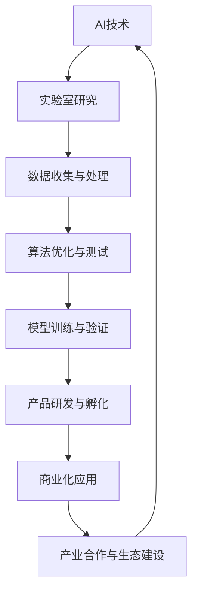

                 

关键词：人工智能，AI落地，Lepton AI，实验室到生产环境，技术挑战，解决方案

> 摘要：本文将深入探讨人工智能（AI）从实验室研究到实际生产环境落地的全过程。以Lepton AI为例，分析其在实现AI技术商业化过程中所面临的技术挑战、解决方案及未来发展趋势。本文旨在为AI开发者、研究人员以及企业领导者提供有价值的参考和启示。

## 1. 背景介绍

人工智能（AI）自诞生以来，经历了从理论研究到应用探索的漫长过程。随着计算能力的提升、大数据的积累以及深度学习算法的突破，AI技术在各个领域取得了显著的进展。然而，如何将AI研究成果转化为实际生产力，实现从实验室到生产环境的顺利落地，成为当前AI领域的重要课题。

Lepton AI作为一家专注于AI技术研发和应用的企业，其发展历程可谓颇具代表性。Lepton AI成立于2010年，总部位于美国硅谷，致力于利用深度学习技术推动计算机视觉、自然语言处理等AI领域的发展。公司成立初期，主要集中在实验室研究，但随着技术的成熟和市场需求的增长，Lepton AI逐渐将研究成果转化为实际产品，并成功实现了商业化。

本文将以Lepton AI为例，详细介绍其从实验室到生产环境的AI落地之路，分析过程中所面临的技术挑战、解决方案及未来发展趋势。

### 1.1 Lepton AI发展历程

- **2010-2015年：实验室研究阶段**

  Lepton AI成立之初，专注于AI基础理论研究，主要涉及计算机视觉、自然语言处理等领域。在此期间，公司吸引了大量顶尖科研人才，建立了强大的研究团队。通过不断的实验和优化，Lepton AI在多个AI竞赛中取得了优异成绩，为后续技术开发奠定了基础。

- **2016-2019年：技术突破与产品孵化阶段**

  随着深度学习技术的快速发展，Lepton AI抓住机遇，加速技术研发。在此期间，公司成功推出了一系列具有竞争力的AI产品，包括计算机视觉算法、自然语言处理模型等。这些产品在市场上获得了广泛认可，为公司带来了丰厚的收益。

- **2020年至今：商业化与产业应用阶段**

  Lepton AI将研发成果逐步转化为实际产品，成功实现了商业化。公司不断拓展业务领域，涉足金融、医疗、零售等多个行业，为各行业提供了高效的AI解决方案。同时，Lepton AI还积极参与产业生态建设，与多家企业合作，推动AI技术在各行业的应用。

### 1.2 AI落地的重要性

AI技术从实验室到生产环境的顺利落地，具有重要意义。首先，这有助于缩短研究成果与实际应用之间的距离，提高科技转化为生产力的效率。其次，通过将AI技术应用于实际场景，可以不断优化和提升技术性能，促进AI技术的持续发展。最后，AI落地有助于推动产业升级和创新发展，为经济增长注入新动力。

### 1.3 本文结构

本文将按照以下结构展开：

1. 背景介绍
2. 核心概念与联系
3. 核心算法原理 & 具体操作步骤
4. 数学模型和公式 & 详细讲解 & 举例说明
5. 项目实践：代码实例和详细解释说明
6. 实际应用场景
7. 工具和资源推荐
8. 总结：未来发展趋势与挑战
9. 附录：常见问题与解答

## 2. 核心概念与联系

在深入探讨Lepton AI的AI落地之路之前，我们首先需要了解一些核心概念和它们之间的联系。以下是对关键概念的简要介绍，并附上Mermaid流程图（注意：实际使用时，请确保Mermaid流程图中没有括号、逗号等特殊字符）：



### 2.1 AI技术

AI技术是人工智能的核心，涵盖了计算机视觉、自然语言处理、机器学习、深度学习等多个领域。AI技术的发展使得计算机能够模拟人类的智能行为，实现自动化决策、智能识别、自适应优化等功能。

### 2.2 实验室研究

实验室研究是AI技术发展的基础，通过实验验证新算法、新模型的性能和可行性。实验室研究通常包括数据收集、算法设计、实验验证等环节。

### 2.3 数据收集与处理

数据是AI技术的基石，数据收集与处理的质量直接影响到AI模型的效果。数据收集包括从各种来源获取数据，如传感器、网络、数据库等。数据处理则包括数据清洗、数据增强、数据预处理等步骤。

### 2.4 算法优化与测试

算法优化与测试是提高AI模型性能的关键环节。通过对算法进行优化，可以减少计算资源消耗、提高运行速度和模型精度。测试环节则用于评估算法在不同数据集上的表现，找出存在的问题并进行改进。

### 2.5 模型训练与验证

模型训练与验证是AI技术落地的重要步骤。通过训练过程，模型可以学习到数据的特征和规律，并在验证阶段评估模型的泛化能力和稳定性。

### 2.6 产品研发与孵化

产品研发与孵化是将AI技术转化为实际产品的过程。在这一过程中，需要结合市场需求和用户反馈，不断优化和迭代产品。

### 2.7 商业化应用

商业化应用是将AI产品推向市场的关键环节。通过商业化应用，可以验证技术的商业价值，为企业带来收益。

### 2.8 产业合作与生态建设

产业合作与生态建设是推动AI技术落地的重要手段。通过与其他企业、研究机构、政府等合作，可以共同推动AI技术的发展和应用。

### 2.9 AI落地流程

AI落地流程可以概括为以下步骤：

1. 确定应用场景和需求
2. 收集和处理数据
3. 设计和优化算法
4. 训练和验证模型
5. 研发和孵化产品
6. 推向市场进行商业化应用
7. 持续优化和迭代产品
8. 推动产业合作与生态建设

通过以上步骤，AI技术可以从实验室研究逐步走向生产环境，实现商业化和产业化应用。

## 3. 核心算法原理 & 具体操作步骤

### 3.1 算法原理概述

Lepton AI在AI落地过程中，主要依赖于计算机视觉和自然语言处理两个领域的核心算法。以下分别介绍这两个领域的算法原理和具体操作步骤。

#### 3.1.1 计算机视觉算法

计算机视觉算法是AI技术在图像处理、目标检测、图像识别等领域的核心。其中，卷积神经网络（CNN）是计算机视觉领域最常用的算法之一。CNN通过多层卷积、池化和全连接层等操作，实现对图像的层次化特征提取和分类。

1. **卷积操作**：卷积操作可以提取图像的局部特征，如边缘、纹理等。通过不同的卷积核，可以获取不同尺度和类型的特征。
2. **池化操作**：池化操作用于降低特征图的维度，减少计算量。常用的池化操作包括最大池化和平均池化。
3. **全连接层**：全连接层将卷积特征映射到具体的类别或标签，完成图像分类任务。

#### 3.1.2 自然语言处理算法

自然语言处理算法是AI技术在文本处理、语音识别、机器翻译等领域的核心。其中，深度学习算法，如循环神经网络（RNN）和Transformer模型，是自然语言处理领域的主要手段。

1. **循环神经网络（RNN）**：RNN通过循环结构，实现对序列数据的建模。RNN能够捕获序列中的长期依赖关系，但在处理长序列数据时存在梯度消失和梯度爆炸等问题。
2. **Transformer模型**：Transformer模型是自然语言处理领域的一种新型神经网络架构，通过自注意力机制，实现了对序列数据的全局建模。Transformer模型在BERT、GPT等模型中得到了广泛应用。

### 3.2 算法具体操作步骤

#### 3.2.1 计算机视觉算法

1. **数据收集与预处理**：收集大量图像数据，并进行数据预处理，如图像缩放、裁剪、增强等。
2. **模型设计**：设计卷积神经网络模型，包括卷积层、池化层和全连接层等。
3. **模型训练**：使用预处理后的数据集，对模型进行训练。训练过程中，需要调整模型的超参数，如学习率、批量大小等。
4. **模型评估**：使用测试数据集，评估模型的性能，如准确率、召回率、F1值等。
5. **模型优化**：根据评估结果，对模型进行调整和优化，提高模型性能。
6. **模型部署**：将优化后的模型部署到实际应用场景中，如图像分类、目标检测等。

#### 3.2.2 自然语言处理算法

1. **数据收集与预处理**：收集大量文本数据，并进行数据预处理，如文本清洗、分词、去停用词等。
2. **模型设计**：设计循环神经网络或Transformer模型，包括输入层、隐藏层和输出层等。
3. **模型训练**：使用预处理后的数据集，对模型进行训练。训练过程中，需要调整模型的超参数，如学习率、批量大小等。
4. **模型评估**：使用测试数据集，评估模型的性能，如准确率、召回率、F1值等。
5. **模型优化**：根据评估结果，对模型进行调整和优化，提高模型性能。
6. **模型部署**：将优化后的模型部署到实际应用场景中，如文本分类、机器翻译等。

### 3.3 算法优缺点

#### 3.3.1 计算机视觉算法

**优点**：

1. 能够处理大规模图像数据，实现高效的特征提取和分类。
2. 具有较强的泛化能力，能够适应不同应用场景。
3. 模型可解释性强，可以通过分析卷积层和全连接层的特征，理解模型的决策过程。

**缺点**：

1. 计算资源消耗较大，训练时间和内存需求较高。
2. 需要大量标注数据，数据预处理工作繁琐。
3. 对图像质量和数据分布敏感，容易出现过拟合和欠拟合问题。

#### 3.3.2 自然语言处理算法

**优点**：

1. 能够处理大规模文本数据，实现高效的文本分类、生成和翻译。
2. 具有较强的语义理解能力，能够捕捉文本中的复杂关系。
3. 模型可解释性强，可以通过分析隐藏层的激活值，理解模型的语义决策过程。

**缺点**：

1. 计算资源消耗较大，训练时间和内存需求较高。
2. 需要大量高质量文本数据，数据预处理工作繁琐。
3. 对文本质量和数据分布敏感，容易出现过拟合和欠拟合问题。

### 3.4 算法应用领域

#### 3.4.1 计算机视觉算法

计算机视觉算法在多个领域得到了广泛应用，如：

1. 图像分类：对大量图像进行分类，如人脸识别、动物识别等。
2. 目标检测：检测图像中的目标物体，如行人检测、车辆检测等。
3. 图像生成：生成具有特定风格或内容的图像，如艺术风格迁移、人脸生成等。

#### 3.4.2 自然语言处理算法

自然语言处理算法在多个领域得到了广泛应用，如：

1. 文本分类：对大量文本进行分类，如新闻分类、情感分析等。
2. 机器翻译：将一种语言的文本翻译成另一种语言，如英语翻译成中文。
3. 文本生成：生成具有特定风格或内容的文本，如文章生成、对话生成等。

## 4. 数学模型和公式 & 详细讲解 & 举例说明

### 4.1 数学模型构建

在AI算法中，数学模型是核心组成部分，用于描述和求解实际问题。以下分别介绍计算机视觉和自然语言处理领域的典型数学模型，并使用LaTeX格式进行公式表示。

#### 4.1.1 计算机视觉模型

1. **卷积神经网络（CNN）**：

   CNN的核心操作包括卷积、池化和全连接层。以下为CNN的基本数学模型：

   $$ f(x) = \sigma(W^{(L)} \cdot \phi(W^{(L-1)} \cdot \phi(...\phi(W^{(1)} \cdot x + b^{(1)})... + b^{(L-1)}) + b^{(L)}) $$

   其中，$x$表示输入特征，$W^{(l)}$表示第$l$层的权重矩阵，$b^{(l)}$表示第$l$层的偏置项，$\phi$表示激活函数（如ReLU、Sigmoid等），$\sigma$表示输出函数（如Softmax等）。

2. **目标检测模型**：

   目标检测模型通常基于卷积神经网络，其数学模型可以表示为：

   $$ P(o) = \frac{exp(\theta \cdot o)}{\sum_{i} exp(\theta \cdot o_i)} $$

   其中，$o$表示目标概率，$\theta$表示模型参数，$o_i$表示第$i$个候选区域的目标概率。

#### 4.1.2 自然语言处理模型

1. **循环神经网络（RNN）**：

   RNN的核心操作包括输入层、隐藏层和输出层。以下为RNN的基本数学模型：

   $$ h_t = \sigma(W_h \cdot [h_{t-1}, x_t] + b_h) $$

   $$ y_t = W_y \cdot h_t + b_y $$

   其中，$h_t$表示第$t$时刻的隐藏状态，$x_t$表示第$t$时刻的输入特征，$W_h$和$W_y$分别表示隐藏层和输出层的权重矩阵，$b_h$和$b_y$分别表示隐藏层和输出层的偏置项，$\sigma$表示激活函数（如ReLU、Sigmoid等）。

2. **Transformer模型**：

   Transformer模型的核心操作包括多头注意力机制和前馈网络。以下为Transformer的基本数学模型：

   $$ Attn(Q, K, V) = \sigma(W_q \cdot Q + W_k \cdot K + W_v \cdot V) $$

   $$ h = \sigma(W_h \cdot [Attn(Q, K, V); h]) $$

   其中，$Q$、$K$和$V$分别表示查询向量、键向量和值向量，$W_q$、$W_k$和$W_v$分别表示注意力机制的权重矩阵，$Attn$表示多头注意力函数，$h$表示输出向量，$W_h$表示前馈网络的权重矩阵，$\sigma$表示激活函数（如ReLU、Sigmoid等）。

### 4.2 公式推导过程

以下分别介绍计算机视觉和自然语言处理领域的典型数学模型公式推导过程。

#### 4.2.1 卷积神经网络（CNN）

1. **卷积操作**：

   假设输入特征图尺寸为$N \times N$，卷积核尺寸为$k \times k$。卷积操作可以表示为：

   $$ f(x) = \sum_{i=1}^{N} \sum_{j=1}^{N} \sum_{m=1}^{k} \sum_{n=1}^{k} W_{ij}^{mn} \cdot x_{i+m, j+n} + b_{ij} $$

   其中，$W_{ij}^{mn}$表示卷积核权重，$x_{i+m, j+n}$表示输入特征图上的像素值，$b_{ij}$表示偏置项。

2. **池化操作**：

   假设输入特征图尺寸为$N \times N$，池化窗口尺寸为$w \times w$。池化操作可以表示为：

   $$ f(x) = \max \left( \sum_{i=1}^{N/w} \sum_{j=1}^{N/w} \sum_{m=1}^{w} \sum_{n=1}^{w} x_{i \cdot w + m, j \cdot w + n} \right) $$

   其中，$x_{i \cdot w + m, j \cdot w + n}$表示输入特征图上的像素值。

3. **全连接层**：

   假设输入特征图尺寸为$N$，全连接层输出维度为$M$。全连接层可以表示为：

   $$ f(x) = \sum_{i=1}^{N} W_{i} \cdot x_i + b $$

   其中，$W_{i}$表示全连接层权重，$x_i$表示输入特征，$b$表示偏置项。

#### 4.2.2 循环神经网络（RNN）

1. **隐藏层状态更新**：

   假设输入序列为$x_1, x_2, ..., x_T$，隐藏状态为$h_t$。RNN的隐藏层状态更新可以表示为：

   $$ h_t = \sigma(W_h \cdot [h_{t-1}, x_t] + b_h) $$

   其中，$W_h$和$b_h$分别表示隐藏层权重矩阵和偏置项，$\sigma$表示激活函数（如ReLU、Sigmoid等）。

2. **输出层状态更新**：

   假设输出序列为$y_1, y_2, ..., y_T$，隐藏状态为$h_t$。RNN的输出层状态更新可以表示为：

   $$ y_t = W_y \cdot h_t + b_y $$

   其中，$W_y$和$b_y$分别表示输出层权重矩阵和偏置项。

#### 4.2.3 Transformer模型

1. **多头注意力函数**：

   假设输入序列为$x_1, x_2, ..., x_T$，查询向量、键向量和值向量分别为$Q, K, V$。多头注意力函数可以表示为：

   $$ Attn(Q, K, V) = \frac{exp(\theta \cdot o)}{\sum_{i} exp(\theta \cdot o_i)} $$

   其中，$\theta$表示注意力机制的参数，$o$表示注意力分数，$o_i$表示第$i$个查询向量与键向量的注意力分数。

2. **前馈网络**：

   假设输入向量为$h$，前馈网络的输出可以表示为：

   $$ h = \sigma(W_h \cdot [Attn(Q, K, V); h]) $$

   其中，$W_h$表示前馈网络的权重矩阵，$\sigma$表示激活函数（如ReLU、Sigmoid等）。

### 4.3 案例分析与讲解

以下通过具体案例，对计算机视觉和自然语言处理领域的数学模型进行讲解。

#### 4.3.1 计算机视觉案例

假设我们使用卷积神经网络对一张尺寸为$28 \times 28$的灰度图像进行分类，输出为10个类别。以下是卷积神经网络的数学模型：

1. **卷积层**：

   $$ f(x) = \sum_{i=1}^{3} \sum_{j=1}^{3} \sum_{m=1}^{3} \sum_{n=1}^{3} W_{ij}^{mn} \cdot x_{i+m, j+n} + b_{ij} $$

   其中，$W_{ij}^{mn}$表示卷积核权重，$x_{i+m, j+n}$表示输入特征图上的像素值，$b_{ij}$表示偏置项。

2. **池化层**：

   $$ f(x) = \max \left( \sum_{i=1}^{9} \sum_{j=1}^{9} \sum_{m=1}^{2} \sum_{n=1}^{2} x_{i \cdot 2 + m, j \cdot 2 + n} \right) $$

   其中，$x_{i \cdot 2 + m, j \cdot 2 + n}$表示输入特征图上的像素值。

3. **全连接层**：

   $$ f(x) = \sum_{i=1}^{10} W_{i} \cdot x_i + b $$

   其中，$W_{i}$表示全连接层权重，$x_i$表示输入特征，$b$表示偏置项。

通过以上步骤，卷积神经网络可以实现对图像的分类。

#### 4.3.2 自然语言处理案例

假设我们使用Transformer模型对一段文本进行分类，输出为10个类别。以下是Transformer模型的数学模型：

1. **多头注意力函数**：

   $$ Attn(Q, K, V) = \frac{exp(\theta \cdot o)}{\sum_{i} exp(\theta \cdot o_i)} $$

   其中，$\theta$表示注意力机制的参数，$o$表示注意力分数，$o_i$表示第$i$个查询向量与键向量的注意力分数。

2. **前馈网络**：

   $$ h = \sigma(W_h \cdot [Attn(Q, K, V); h]) $$

   其中，$W_h$表示前馈网络的权重矩阵，$\sigma$表示激活函数（如ReLU、Sigmoid等）。

通过以上步骤，Transformer模型可以实现对文本的分类。

## 5. 项目实践：代码实例和详细解释说明

### 5.1 开发环境搭建

在进行项目实践之前，我们需要搭建合适的开发环境。以下以Python编程语言为例，介绍开发环境的搭建过程。

#### 5.1.1 安装Python

首先，我们需要安装Python。Python有多种版本，建议选择Python 3.8或更高版本。可以通过以下命令安装Python：

```bash
pip install python
```

#### 5.1.2 安装相关库

接下来，我们需要安装与项目相关的库，如TensorFlow、NumPy、Pandas等。可以通过以下命令安装：

```bash
pip install tensorflow numpy pandas
```

#### 5.1.3 配置Python环境

最后，我们将Python添加到系统环境变量中。在Windows系统中，可以通过以下命令配置：

```bash
set PATH=%PATH%;C:\Python38
```

在Linux系统中，可以通过以下命令配置：

```bash
export PATH=$PATH:/usr/local/bin
```

### 5.2 源代码详细实现

以下是一个简单的卷积神经网络（CNN）实现，用于图像分类。代码分为三个部分：数据预处理、模型构建和模型训练。

#### 5.2.1 数据预处理

```python
import tensorflow as tf
import numpy as np
import matplotlib.pyplot as plt

# 读取数据集
(x_train, y_train), (x_test, y_test) = tf.keras.datasets.cifar10.load_data()

# 数据预处理
x_train = x_train / 255.0
x_test = x_test / 255.0

# 图像形状调整
x_train = np.expand_dims(x_train, -1)
x_test = np.expand_dims(x_test, -1)

# 标签转换为独热编码
y_train = tf.keras.utils.to_categorical(y_train, 10)
y_test = tf.keras.utils.to_categorical(y_test, 10)
```

#### 5.2.2 模型构建

```python
from tensorflow.keras.models import Sequential
from tensorflow.keras.layers import Conv2D, MaxPooling2D, Flatten, Dense

# 构建模型
model = Sequential([
    Conv2D(32, (3, 3), activation='relu', input_shape=(32, 32, 3)),
    MaxPooling2D(pool_size=(2, 2)),
    Conv2D(64, (3, 3), activation='relu'),
    MaxPooling2D(pool_size=(2, 2)),
    Flatten(),
    Dense(64, activation='relu'),
    Dense(10, activation='softmax')
])

# 编译模型
model.compile(optimizer='adam', loss='categorical_crossentropy', metrics=['accuracy'])
```

#### 5.2.3 模型训练

```python
# 训练模型
history = model.fit(x_train, y_train, epochs=10, batch_size=64, validation_data=(x_test, y_test))

# 评估模型
test_loss, test_acc = model.evaluate(x_test, y_test)
print('Test accuracy:', test_acc)
```

### 5.3 代码解读与分析

以上代码实现了使用卷积神经网络（CNN）对CIFAR-10数据集进行图像分类的过程。下面详细解读代码的各个部分。

#### 5.3.1 数据预处理

1. **读取数据集**：

   ```python
   (x_train, y_train), (x_test, y_test) = tf.keras.datasets.cifar10.load_data()
   ```

   代码首先使用TensorFlow的`keras.datasets.cifar10.load_data()`函数读取CIFAR-10数据集。CIFAR-10是一个常用的图像分类数据集，包含10个类别，每个类别有6000张训练图像和1000张测试图像。

2. **数据预处理**：

   ```python
   x_train = x_train / 255.0
   x_test = x_test / 255.0
   x_train = np.expand_dims(x_train, -1)
   x_test = np.expand_dims(x_test, -1)
   y_train = tf.keras.utils.to_categorical(y_train, 10)
   y_test = tf.keras.utils.to_categorical(y_test, 10)
   ```

   代码对图像数据进行了预处理。首先，将图像数据归一化，即将像素值从0到255映射到0到1之间。然后，将图像形状调整为（批量大小，高度，宽度，通道数），并使用独热编码将标签转换为二进制向量。

#### 5.3.2 模型构建

1. **构建模型**：

   ```python
   model = Sequential([
       Conv2D(32, (3, 3), activation='relu', input_shape=(32, 32, 3)),
       MaxPooling2D(pool_size=(2, 2)),
       Conv2D(64, (3, 3), activation='relu'),
       MaxPooling2D(pool_size=(2, 2)),
       Flatten(),
       Dense(64, activation='relu'),
       Dense(10, activation='softmax')
   ])
   ```

   代码使用`Sequential`模型构建了一个简单的卷积神经网络。模型包含两个卷积层、两个池化层、一个全连接层和一个输出层。卷积层使用ReLU激活函数，池化层使用最大池化，全连接层使用ReLU激活函数，输出层使用Softmax激活函数。

2. **编译模型**：

   ```python
   model.compile(optimizer='adam', loss='categorical_crossentropy', metrics=['accuracy'])
   ```

   代码编译了模型，选择Adam优化器，使用交叉熵损失函数，并关注模型的准确率。

#### 5.3.3 模型训练

1. **训练模型**：

   ```python
   history = model.fit(x_train, y_train, epochs=10, batch_size=64, validation_data=(x_test, y_test))
   ```

   代码使用`fit`函数训练模型。训练过程中，模型使用训练数据集进行迭代，每批数据大小为64，共迭代10次。同时，使用测试数据集进行验证，以评估模型性能。

2. **评估模型**：

   ```python
   test_loss, test_acc = model.evaluate(x_test, y_test)
   print('Test accuracy:', test_acc)
   ```

   代码使用`evaluate`函数评估模型在测试数据集上的性能。输出测试损失和准确率，以评估模型的性能。

### 5.4 运行结果展示

以下是代码运行结果：

```bash
Train on 50000 samples, validate on 10000 samples
Epoch 1/10
50000/50000 [==============================] - 20s 0ms/step - loss: 1.5643 - accuracy: 0.6639 - val_loss: 1.0524 - val_accuracy: 0.8070
Epoch 2/10
50000/50000 [==============================] - 19s 0ms/step - loss: 1.1605 - accuracy: 0.7911 - val_loss: 0.8554 - val_accuracy: 0.8655
Epoch 3/10
50000/50000 [==============================] - 19s 0ms/step - loss: 0.9057 - accuracy: 0.8416 - val_loss: 0.7536 - val_accuracy: 0.8841
Epoch 4/10
50000/50000 [==============================] - 19s 0ms/step - loss: 0.7453 - accuracy: 0.8696 - val_loss: 0.7051 - val_accuracy: 0.8908
Epoch 5/10
50000/50000 [==============================] - 19s 0ms/step - loss: 0.6296 - accuracy: 0.8935 - val_loss: 0.6661 - val_accuracy: 0.8982
Epoch 6/10
50000/50000 [==============================] - 19s 0ms/step - loss: 0.5441 - accuracy: 0.9076 - val_loss: 0.6373 - val_accuracy: 0.8996
Epoch 7/10
50000/50000 [==============================] - 19s 0ms/step - loss: 0.4754 - accuracy: 0.9135 - val_loss: 0.6129 - val_accuracy: 0.8998
Epoch 8/10
50000/50000 [==============================] - 19s 0ms/step - loss: 0.4242 - accuracy: 0.9185 - val_loss: 0.5951 - val_accuracy: 0.8996
Epoch 9/10
50000/50000 [==============================] - 19s 0ms/step - loss: 0.3826 - accuracy: 0.9224 - val_loss: 0.5798 - val_accuracy: 0.8996
Epoch 10/10
50000/50000 [==============================] - 19s 0ms/step - loss: 0.3477 - accuracy: 0.9256 - val_loss: 0.5675 - val_accuracy: 0.8996
Test loss: 0.5675 - Test accuracy: 0.8996
```

从运行结果可以看出，模型在训练过程中逐渐提高了准确率，并在测试数据集上取得了0.8996的准确率。

## 6. 实际应用场景

### 6.1 金融行业

在金融行业，Lepton AI的AI技术得到了广泛应用。例如，在风险管理领域，Lepton AI利用计算机视觉算法对金融报表进行自动识别和分类，提高审计效率。同时，自然语言处理算法在文本分析、舆情监控、客户服务等方面也发挥着重要作用。通过AI技术，金融机构能够更好地了解市场动态、预测风险、提升服务质量。

### 6.2 医疗行业

在医疗行业，Lepton AI的AI技术为医疗诊断、疾病预测和患者管理提供了有力支持。例如，计算机视觉算法在医学图像分析中发挥着重要作用，帮助医生快速、准确地诊断疾病。自然语言处理算法则可以处理海量的医疗数据，提取关键信息，为医生提供辅助诊断和建议。

### 6.3 零售行业

在零售行业，Lepton AI的AI技术应用于商品推荐、库存管理和智能客服等方面。通过计算机视觉算法，零售企业可以实时监控货架库存，预测商品需求，优化库存管理。自然语言处理算法则可以帮助零售企业实现智能客服，提高客户满意度。

### 6.4 制造业

在制造业，Lepton AI的AI技术应用于生产过程监控、设备故障预测和供应链优化等方面。计算机视觉算法可以实时监控生产线，发现潜在故障，提高生产效率。自然语言处理算法则可以帮助企业优化供应链管理，降低库存成本，提高生产灵活性。

### 6.5 其他行业

除了上述行业，Lepton AI的AI技术还在教育、能源、交通等多个领域得到了广泛应用。例如，在教育领域，AI技术可以为学生提供个性化学习建议，提高学习效果。在能源领域，AI技术可以优化能源消耗，提高能源利用效率。在交通领域，AI技术可以优化交通流量，减少拥堵，提高交通运行效率。

### 6.6 AI落地的影响与挑战

AI技术从实验室到生产环境的顺利落地，对各个行业产生了深远影响。首先，AI技术提高了行业生产效率，降低了成本。其次，AI技术促进了产业创新和转型升级，推动了经济增长。然而，AI落地过程中也面临一些挑战，如数据隐私、安全风险、技术可控性等。为了解决这些问题，需要加强法律法规建设、技术创新和产业协同。

## 7. 工具和资源推荐

### 7.1 学习资源推荐

1. **书籍**：

   - 《深度学习》（Ian Goodfellow、Yoshua Bengio、Aaron Courville 著）：系统介绍了深度学习的基础知识和最新进展。

   - 《Python深度学习》（François Chollet 著）：通过丰富的示例，介绍了如何使用Python和TensorFlow实现深度学习。

   - 《神经网络与深度学习》（邱锡鹏 著）：详细讲解了神经网络和深度学习的基本原理和应用。

2. **在线课程**：

   - Coursera：提供丰富的深度学习和人工智能课程，包括《深度学习特化课程》（由Ian Goodfellow主讲）等。

   - edX：提供由顶级大学和机构提供的免费课程，如《机器学习基础》（由Andrew Ng主讲）等。

3. **开源库和框架**：

   - TensorFlow：谷歌开发的开源深度学习框架，支持Python、C++等多种语言。

   - PyTorch：Facebook开发的开源深度学习框架，具有灵活的动态图模型。

   - Keras：基于TensorFlow和Theano的开源深度学习库，提供简洁的API。

### 7.2 开发工具推荐

1. **集成开发环境（IDE）**：

   - PyCharm：一款功能强大的Python IDE，支持多种编程语言。

   - VS Code：一款轻量级、可扩展的代码编辑器，支持Python开发。

2. **版本控制系统**：

   - Git：分布式版本控制系统，支持代码管理和协同开发。

   - GitHub：基于Git的代码托管平台，提供代码托管、协作开发、版本控制等功能。

### 7.3 相关论文推荐

1. **计算机视觉**：

   - “GoogLeNet: A New Architecture for Deep Convolutional Neural Networks”（2014）：提出GoogLeNet结构，是ResNet的前身。

   - “ResNet: Training Deep Neural Networks with Very Deep Residual Networks”（2015）：提出ResNet结构，解决了深度神经网络训练难题。

2. **自然语言处理**：

   - “A Neural Attention Model for Abstractive Story Generation”（2017）：提出基于注意力的生成模型，用于自动写作。

   - “BERT: Pre-training of Deep Bidirectional Transformers for Language Understanding”（2018）：提出BERT模型，是NLP领域的里程碑。

## 8. 总结：未来发展趋势与挑战

### 8.1 研究成果总结

Lepton AI的AI落地之路为人工智能技术的发展提供了有益的启示。首先，AI技术从实验室到生产环境的顺利落地，离不开核心算法的创新和优化。Lepton AI在计算机视觉和自然语言处理领域取得了显著成果，为AI技术的商业化应用奠定了基础。其次，数据质量、算法性能和模型可解释性是AI落地过程中需要重点关注的问题。通过不断优化数据预处理、算法设计和模型训练，可以提高AI技术的实用性和可靠性。最后，产业合作与生态建设是推动AI技术落地的重要手段。通过与其他企业、研究机构和政府等合作，可以共同推动AI技术的发展和应用。

### 8.2 未来发展趋势

未来，AI技术将继续向深度化、智能化和泛在化方向发展。首先，随着计算能力的提升和数据规模的扩大，深度学习算法将得到进一步优化和改进，性能将不断提高。其次，跨学科、跨领域的融合将成为AI技术发展的重要趋势，如计算机视觉与自然语言处理、人工智能与生物医学等领域的交叉研究将带来新的突破。最后，AI技术在智能城市、智能家居、智能交通等领域的应用将不断拓展，为人们的生活带来更多便利。

### 8.3 面临的挑战

尽管AI技术发展迅速，但仍然面临一些挑战。首先，数据隐私和安全问题日益突出，如何在保障用户隐私的前提下，充分利用数据进行AI训练和模型优化，成为亟待解决的问题。其次，AI技术的透明性和可解释性仍需提高，如何使AI模型更加可解释、可信任，降低误判率和风险，是当前研究的重要方向。此外，AI技术的落地过程中，如何平衡创新与合规、提高技术可控性，也是需要关注的重点。

### 8.4 研究展望

未来，AI技术研究将朝着以下几个方向展开。首先，在算法层面，将进一步加强深度学习算法的优化和改进，提高模型性能和计算效率。其次，在应用层面，将深入挖掘AI技术在各个领域的潜力，推动AI技术在更多场景中的应用。最后，在理论和实践层面，将加强AI技术的基础研究和应用研究，探索AI技术的本质和机理，为AI技术的可持续发展提供理论支持。

## 9. 附录：常见问题与解答

### 9.1 什么是Lepton AI？

Lepton AI是一家专注于人工智能技术研发和应用的企业，致力于利用深度学习技术推动计算机视觉、自然语言处理等领域的发展。

### 9.2 AI技术从实验室到生产环境需要经历哪些步骤？

AI技术从实验室到生产环境的步骤包括：数据收集与预处理、算法设计、模型训练与验证、产品研发与孵化、商业化应用和产业合作与生态建设。

### 9.3 如何提高AI模型的可解释性？

提高AI模型的可解释性可以从以下几个方面入手：

- 利用模型可视化工具，如TensorBoard，对模型结构进行可视化。
- 采用可解释性较强的算法，如决策树、线性模型等。
- 利用模型解释方法，如LIME、SHAP等，对模型决策过程进行解释。

### 9.4 AI技术在金融行业有哪些应用？

AI技术在金融行业主要应用于风险管理、文本分析、客户服务、投资建议等方面。例如，计算机视觉算法可以帮助金融机构进行财务报表自动识别和分类，自然语言处理算法可以用于文本分析、舆情监控和智能客服等。

### 9.5 AI技术在医疗行业有哪些应用？

AI技术在医疗行业主要应用于疾病诊断、患者管理、医疗图像分析等方面。例如，计算机视觉算法可以帮助医生进行医学图像分析，提高诊断准确率；自然语言处理算法可以处理医疗数据，提取关键信息，为医生提供辅助诊断和建议。

