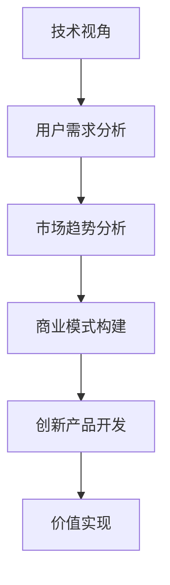
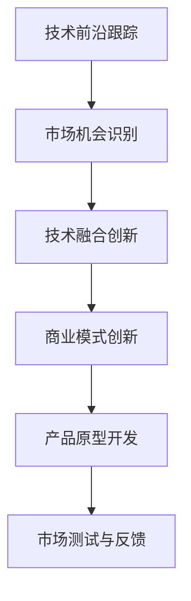
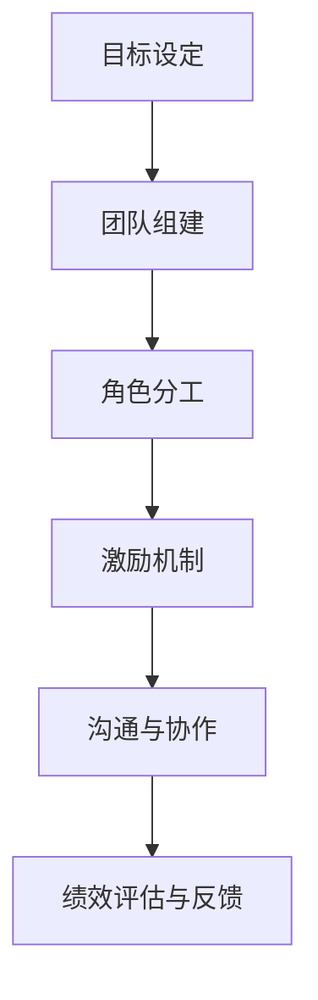
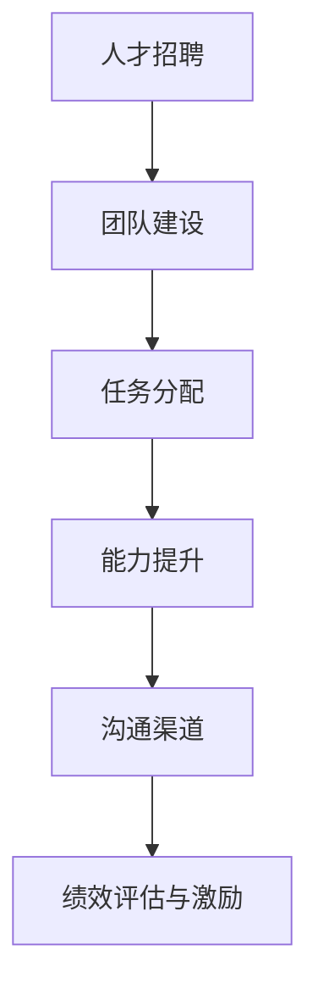

                 

关键词：技术专家，企业家，心态转变，商业战略，创新思维，领导力，团队管理，技术转化，市场洞察

> 摘要：本文将探讨技术专家向企业家心态转变的重要性，分析这一转变背后的核心驱动因素，并提供具体的策略和方法，帮助技术专家更好地实现角色转变，推动科技创新与商业成功的有机结合。

## 1. 背景介绍

在当今数字化时代，技术专家和企业家的角色越来越交织在一起。技术专家，通常是指那些在某一特定技术领域具有深厚专业知识和丰富经验的专业人士。他们擅长解决问题，推动技术创新，但在商业领域，他们往往需要更多的视野和技能，以将技术成果转化为商业价值。另一方面，企业家则是那些能够识别市场机会，组织资源，通过创新的产品或服务创造价值的人。随着技术的迅猛发展，技术专家越来越多地涉足创业领域，而企业家也需要拥有扎实的科技背景，以更好地理解和驾驭技术变革。

然而，技术专家向企业家的心态转变并非易事。他们往往沉浸在技术细节中，追求完美和效率，而在商业领域，他们需要学会从战略的高度看待问题，具备市场洞察力和领导力。本文旨在分析这一转变的必要性和核心要素，并探讨技术专家如何实现这一角色的成功转变。

### 1.1 技术专家与企业家：定义与区别

**技术专家**：
- 技术背景深厚，精通特定技术领域。
- 专注于技术研究和开发，追求技术上的卓越。
- 通常在学术或专业圈子内享有盛誉。
- 关注技术创新、算法优化、系统架构等。

**企业家**：
- 具备商业头脑，擅长市场分析和战略规划。
- 能够识别和抓住市场机会，创造商业价值。
- 组织和领导能力突出，能够动员和激励团队。
- 注重商业模型、营销策略、融资与投资等。

技术专家和企业家的区别主要体现在以下几个方面：

1. **关注点不同**：技术专家更注重技术本身，企业家则更关注市场和社会价值。
2. **角色定位**：技术专家通常是执行者，而企业家则是领导者。
3. **能力要求**：技术专家需要专业技能，企业家则需要综合能力，包括领导力、沟通能力、战略思维等。
4. **成果衡量**：技术专家的成果往往体现在技术突破或创新上，企业家的成果则体现在商业成功和市场份额上。

### 1.2 技术专家向企业家的心态转变

**从技术到商业的视角转换**：
- 技术专家往往关注技术本身的可行性和性能，而企业家则需要考虑市场的需求、竞争对手和商业模式。
- 技术专家需要学会从商业的角度看待技术，理解技术如何转化为商业机会。

**从执行者到领导者的角色转变**：
- 技术专家习惯于独立解决问题，而企业家则需要领导团队，激励和引导团队成员共同实现目标。
- 领导力的培养是技术专家向企业家转变的关键。

**从追求卓越到创造价值的转变**：
- 技术专家追求技术上的卓越，而企业家则追求商业上的成功和价值的最大化。
- 技术专家需要理解商业成功的标准，并调整自己的目标和行为。

**从独立工作到团队合作**：
- 技术专家往往习惯于独立工作，而企业家则需要建立和管理一个高效的团队。
- 团队合作和沟通能力是企业家成功的关键。

### 1.3 文章结构

本文将分为以下几个部分：

- **背景介绍**：介绍技术专家和企业家的定义与区别，以及技术专家向企业家心态转变的重要性。
- **核心概念与联系**：阐述企业家心态的核心概念，包括商业思维、创新意识、领导力和团队管理。
- **核心算法原理 & 具体操作步骤**：提供技术专家向企业家转变的具体步骤和策略。
- **数学模型和公式 & 详细讲解 & 举例说明**：分析技术专家向企业家转变过程中的关键数学模型和公式。
- **项目实践：代码实例和详细解释说明**：通过实际案例展示技术专家向企业家转变的过程。
- **实际应用场景**：探讨企业家心态在现实中的应用场景和未来展望。
- **工具和资源推荐**：推荐学习资源和开发工具。
- **总结：未来发展趋势与挑战**：总结研究成果，展望未来发展趋势和面临的挑战。
- **附录：常见问题与解答**：回答读者可能关心的问题。

## 2. 核心概念与联系

### 2.1 商业思维

商业思维是企业家心态的核心。它不仅仅是关注利润，更重要的是理解市场和用户需求，以及如何通过创新的产品或服务创造价值。对于技术专家而言，商业思维意味着从技术的视角转向市场的视角。

**Mermaid 流程图**：



### 2.2 创新意识

创新意识是企业家的灵魂。它要求企业家不断探索新的技术和商业模式，以保持竞争力。技术专家向企业家转变的过程中，创新意识尤为重要。

**Mermaid 流程图**：



### 2.3 领导力

领导力是企业家的关键能力。它不仅仅是管理团队，更重要的是激励和引导团队成员，共同实现目标。技术专家向企业家转变的过程中，领导力的培养至关重要。

**Mermaid 流程图**：



### 2.4 团队管理

团队管理是企业家的基本功。一个高效的团队是实现商业目标的关键。技术专家向企业家转变的过程中，需要学会如何组建和管理团队。

**Mermaid 流程图**：



## 3. 核心算法原理 & 具体操作步骤

### 3.1 算法原理概述

技术专家向企业家转变的过程可以看作是一个算法，其核心原理在于：

1. **需求分析**：理解市场需求，识别商业机会。
2. **资源整合**：调动内部和外部资源，构建商业模型。
3. **创新能力**：持续探索新技术，推动产品创新。
4. **团队协作**：建立高效的团队，共同实现目标。
5. **市场反馈**：不断调整和优化产品，满足市场需求。

### 3.2 算法步骤详解

**步骤 1：需求分析**

- **市场调研**：通过问卷调查、用户访谈、市场分析等方式，了解用户需求和竞争对手情况。
- **需求识别**：从市场调研中提取关键需求，确定产品方向。

**步骤 2：资源整合**

- **团队组建**：根据需求分析结果，组建一支具有专业技能和互补能力的团队。
- **资源调配**：合理分配资源，确保团队高效运转。

**步骤 3：创新能力**

- **技术调研**：跟踪技术前沿，了解新技术和应用。
- **创新实践**：结合市场需求，进行产品原型开发。

**步骤 4：团队协作**

- **明确目标**：设定清晰的目标和里程碑，确保团队方向一致。
- **沟通协作**：建立有效的沟通机制，确保团队成员之间的信息共享和协作。

**步骤 5：市场反馈**

- **市场测试**：将产品原型推向市场，收集用户反馈。
- **优化调整**：根据市场反馈，调整产品功能和用户体验。

### 3.3 算法优缺点

**优点**：

- **快速响应市场需求**：通过市场调研和反馈机制，产品能够快速调整和优化，满足用户需求。
- **高效团队协作**：通过明确的角色分工和有效的沟通机制，团队能够高效协作，实现目标。
- **持续创新能力**：通过技术调研和创新实践，产品能够不断更新和改进，保持竞争力。

**缺点**：

- **市场风险**：市场需求变化快，产品可能无法及时调整，导致市场风险。
- **资源浪费**：在资源整合和团队组建过程中，可能存在资源浪费和人才错配的问题。
- **创新能力不足**：如果技术专家缺乏创新能力，可能导致产品同质化，无法形成核心竞争力。

### 3.4 算法应用领域

该算法广泛应用于科技创新型企业，特别是在信息技术、生物技术、新能源等领域。通过这一算法，技术专家能够更好地将技术创新转化为商业成功，推动企业快速发展。

## 4. 数学模型和公式 & 详细讲解 & 举例说明

### 4.1 数学模型构建

在技术专家向企业家转变的过程中，数学模型和公式可以用来量化和管理商业决策。以下是一个简单的商业模型构建过程：

**模型构建过程**：

1. **市场需求分析**：
   - **需求函数**：\( D(p, q) = f(p, q) \)
     - \( p \)：产品价格
     - \( q \)：产品数量
     - \( f \)：市场需求函数

2. **成本函数**：
   - **成本函数**：\( C(x) = \sum_{i=1}^{n} c_i \cdot x_i \)
     - \( c_i \)：第 \( i \) 项成本
     - \( x_i \)：第 \( i \) 项成本数量

3. **利润函数**：
   - **利润函数**：\( \Pi(p, q, C) = p \cdot q - C \)

### 4.2 公式推导过程

**利润最大化模型**：

目标：最大化利润 \( \Pi \)

约束条件：
- \( D(p, q) \geq q \)
- \( C(x) \leq B \)（预算限制）

推导过程：

1. **利润函数**：
   \( \Pi(p, q, C) = p \cdot q - C(x) \)

2. **市场需求函数**：
   \( D(p, q) = f(p, q) \)

3. **成本函数**：
   \( C(x) = \sum_{i=1}^{n} c_i \cdot x_i \)

4. **拉格朗日乘数法**：
   构造拉格朗日函数：
   \( L(p, q, C, \lambda) = p \cdot q - C(x) + \lambda (D(p, q) - q) \)

5. **求解临界点**：
   对 \( p \)，\( q \)，\( C \)，\( \lambda \) 求导，并令导数为零，得到：
   \[ \frac{\partial L}{\partial p} = 0 \]
   \[ \frac{\partial L}{\partial q} = 0 \]
   \[ \frac{\partial L}{\partial C} = 0 \]
   \[ \frac{\partial L}{\partial \lambda} = 0 \]

6. **解方程组**：
   根据导数条件，求解 \( p \)，\( q \)，\( C \)，\( \lambda \) 的值。

### 4.3 案例分析与讲解

**案例**：一家科技公司研发了一种新型智能家居设备，市场需求函数为 \( D(p, q) = 1000 - 2p - q \)，成本函数为 \( C(x) = 500 + 3x \)，其中 \( x \) 为生产数量。

**目标**：最大化利润。

**步骤**：

1. **构建利润函数**：
   \( \Pi(p, q, C) = p \cdot q - C(x) \)

2. **构建拉格朗日函数**：
   \( L(p, q, C, \lambda) = p \cdot q - (500 + 3x) + \lambda (1000 - 2p - q - x) \)

3. **求导并解方程组**：
   \[ \frac{\partial L}{\partial p} = q - 2\lambda = 0 \]
   \[ \frac{\partial L}{\partial q} = p - \lambda = 0 \]
   \[ \frac{\partial L}{\partial C} = -3 = 0 \] （无约束条件）
   \[ \frac{\partial L}{\partial \lambda} = 1000 - 2p - q - x = 0 \]

4. **解方程组**：
   \( p = \lambda \)
   \( q = 2\lambda \)
   \( 1000 - 2p - q - x = 0 \)

   代入 \( p = \lambda \)，\( q = 2\lambda \)：
   \( x = 1000 - 4\lambda - 2\lambda = 1000 - 6\lambda \)

5. **求解最优解**：
   根据 \( p = \lambda \)，\( q = 2\lambda \)，可以求得 \( \lambda \) 的值，进而求得 \( p \)，\( q \)，\( x \) 的最优解。

通过这个案例，我们可以看到数学模型在商业决策中的作用。技术专家通过数学模型可以更好地理解市场动态，制定合理的商业策略。

## 5. 项目实践：代码实例和详细解释说明

### 5.1 开发环境搭建

在本节中，我们将搭建一个简单的技术专家向企业家转变的代码实例。为了便于理解和实践，我们选择使用 Python 作为开发语言，并结合一些常用的库，如 Pandas 和 Matplotlib。

**环境搭建步骤**：

1. 安装 Python 3.8 或更高版本。
2. 安装 Pandas 和 Matplotlib：
   ```bash
   pip install pandas matplotlib
   ```

### 5.2 源代码详细实现

下面是一个简单的示例代码，用于模拟技术专家向企业家转变的过程。代码分为以下几个部分：

1. **数据收集与处理**：收集市场需求数据和技术成本数据。
2. **利润计算**：根据市场需求和成本函数计算利润。
3. **可视化分析**：绘制利润曲线，帮助技术专家理解市场动态。

**源代码**：

```python
import pandas as pd
import matplotlib.pyplot as plt

# 模拟市场需求数据
market_data = pd.DataFrame({
    'price': [100, 200, 300, 400],
    'quantity': [500, 400, 300, 200]
})

# 模拟成本数据
cost_data = pd.DataFrame({
    'production_cost': [1000, 1500, 2000, 2500]
})

# 利润函数
def calculate_profit(price, quantity, production_cost):
    revenue = price * quantity
    profit = revenue - production_cost
    return profit

# 计算每个价格点的利润
profits = market_data.apply(lambda row: calculate_profit(row['price'], row['quantity'], cost_data['production_cost'][0]), axis=1)

# 可视化利润曲线
plt.plot(market_data['price'], profits)
plt.xlabel('Product Price')
plt.ylabel('Profit')
plt.title('Profit Analysis for Different Product Prices')
plt.show()
```

### 5.3 代码解读与分析

**代码解读**：

- **数据收集与处理**：
  使用 Pandas 库创建 DataFrame，模拟市场需求和成本数据。

- **利润计算**：
  定义一个函数 `calculate_profit`，根据价格、数量和成本计算利润。

- **可视化分析**：
  使用 Matplotlib 库绘制利润曲线，帮助技术专家分析不同价格点的利润。

**代码分析**：

- **数据收集与处理**：
  通过 DataFrame 结构，方便地存储和操作市场需求和成本数据。

- **利润计算**：
  函数 `calculate_profit` 实现了基本的利润计算，可以扩展为更复杂的利润模型。

- **可视化分析**：
  利用 Matplotlib 绘制利润曲线，直观地展示技术专家向企业家转变过程中的关键数据。

### 5.4 运行结果展示

运行上述代码，将生成一个利润曲线图。图中的曲线展示了在不同价格点下，技术专家可以实现的利润。通过这个图表，技术专家可以直观地看到价格和利润之间的关系，从而做出更合理的商业决策。


## 6. 实际应用场景

企业家心态在技术专家向企业家的转变过程中具有广泛的应用场景。以下是一些实际应用场景和案例分析：

### 6.1 科技创业公司

**案例**：一家初创公司开发了一种基于人工智能的医疗诊断系统。公司的创始人在技术方面非常出色，但在将产品推向市场时遇到了挑战。

**解决方案**：
- **市场调研**：通过问卷调查和用户访谈，了解医生和患者的需求，以及竞争对手的产品特点。
- **创新意识**：结合市场需求，改进诊断算法，提高系统的准确性和用户体验。
- **领导力**：组建跨学科团队，包括技术、医学和市场专家，共同推动项目进展。
- **团队管理**：制定明确的任务和目标，确保团队成员之间的高效协作。

### 6.2 传统行业数字化转型

**案例**：一家制造企业计划通过数字化转型提高生产效率和产品质量。

**解决方案**：
- **商业思维**：分析市场需求，识别数字化解决方案的机会，制定转型战略。
- **创新能力**：引入先进的技术，如物联网、大数据分析等，优化生产流程。
- **领导力**：建立创新团队，推动数字化转型项目，鼓励员工参与创新。
- **团队管理**：建立跨部门协作机制，确保数字化转型的顺利实施。

### 6.3 科技成果转化

**案例**：一家科研机构开发了一种新型材料，但在市场推广过程中遇到了困难。

**解决方案**：
- **市场洞察**：研究市场需求，寻找潜在的合作伙伴和商业机会。
- **创新意识**：结合市场需求，开发具有竞争力的产品和应用方案。
- **领导力**：组建专业的商业团队，推动科技成果的转化和应用。
- **团队管理**：建立有效的沟通和协作机制，确保项目顺利推进。

### 6.4 国际化拓展

**案例**：一家软件公司计划拓展海外市场，但面临文化差异和市场竞争的挑战。

**解决方案**：
- **商业战略**：分析目标市场的特点，制定符合当地市场需求的产品和服务策略。
- **创新思维**：结合本地文化，开发符合当地用户需求的产品。
- **领导力**：组建国际化团队，培养跨文化沟通和协作能力。
- **团队管理**：建立全球协作机制，确保项目的顺利进行。

通过上述案例，我们可以看到企业家心态在技术专家向企业家的转变过程中发挥着重要作用。技术专家通过培养商业思维、创新意识、领导力和团队管理能力，能够更好地将技术创新转化为商业成功。

## 7. 工具和资源推荐

为了帮助技术专家更好地实现向企业家的转变，以下是一些学习资源、开发工具和相关论文的推荐。

### 7.1 学习资源推荐

1. **书籍**：
   - 《精益创业》（The Lean Startup）：作者埃里克·莱斯（Eric Ries）。
   - 《创新者的窘境》（The Innovator's Dilemma）：作者克莱顿·克里斯滕森（Clayton M. Christensen）。
   - 《从优秀到卓越》（Good to Great）：作者吉姆·柯林斯（Jim Collins）。

2. **在线课程**：
   - Coursera 上的“创业基础”（Startup Basics）。
   - edX 上的“商业分析”（Business Analytics）。
   - Udemy 上的“如何成为企业家”（How to Be an Entrepreneur）。

3. **博客与文章**：
   - TechCrunch：提供最新的科技创业动态和案例分析。
   - Harvard Business Review：发布关于商业战略、领导力等方面的深度文章。
   - LinkedIn Pulse：众多企业家和专家分享的经验和见解。

### 7.2 开发工具推荐

1. **项目管理工具**：
   - Trello：简单易用的看板工具，适合团队协作。
   - Asana：功能丰富的任务管理工具，支持多种协作功能。
   - JIRA：强大的敏捷开发和管理工具，适用于大型团队。

2. **数据分析工具**：
   - Tableau：可视化数据分析工具，帮助用户轻松创建交互式报表。
   - Power BI：微软推出的数据分析工具，支持多种数据源。
   - Google Analytics：分析网站和移动应用的流量和用户行为。

3. **市场调研工具**：
   - SurveyMonkey：在线调查工具，方便收集用户反馈。
   - Qualtrics：专业的调研工具，适用于复杂的调查项目。
   - Google Trends：分析关键词和搜索趋势的工具。

### 7.3 相关论文推荐

1. **技术商业转化**：
   - "Technology Commercialization and Entrepreneurship: A Theoretical Analysis" by David K. surfing.
   - "Open Innovation: The New Imperative for Creating and Profiting from Technology" by Henry Chesbrough.

2. **创业融资**：
   - "Venture Capital and the Finance of Innovation" by Josh Lerner.
   - "Entrepreneurial Finance: Strategy, Valuation, and Deal Structuring" by Robert H. Frankel.

3. **领导力与团队管理**：
   - "The Five Dysfunctions of a Team" by Patrick Lencioni.
   - "Leadership: Theory and Practice" by Peter Northouse.

通过这些工具和资源的辅助，技术专家可以更好地掌握商业知识和技能，实现从技术专家到企业家的成功转型。

## 8. 总结：未来发展趋势与挑战

在技术迅速发展的今天，技术专家向企业家的心态转变已成为推动科技创新与商业成功的关键。未来，这一转变将继续向以下几个方向发展：

### 8.1 研究成果总结

通过本文的探讨，我们总结了技术专家向企业家转变的核心要素，包括商业思维、创新意识、领导力和团队管理。同时，我们提供了一系列具体策略和工具，帮助技术专家更好地实现这一转变。

### 8.2 未来发展趋势

1. **跨学科融合**：随着技术的不断进步，技术专家需要拥有更广泛的学科知识，包括商业、法律、市场营销等，以更好地应对复杂的商业环境。
2. **数字化转型**：数字化转型将继续深入各个行业，技术专家需要具备数据分析和数字化转型的能力。
3. **全球化视野**：国际市场的机遇和挑战并存，技术专家需要具备全球视野，适应不同国家和地区的商业环境。

### 8.3 面临的挑战

1. **技术创新速度加快**：技术变革速度加快，技术专家需要不断更新知识，跟上最新技术趋势。
2. **商业不确定性**：市场竞争激烈，技术专家需要具备应对市场变化和风险的能力。
3. **团队管理难度**：组建和管理一个高效的团队是企业家成功的关键，技术专家需要提升团队管理和沟通能力。

### 8.4 研究展望

未来的研究可以进一步探讨技术专家向企业家转变的具体路径和最佳实践，以及如何利用人工智能等新兴技术，提升企业家决策的效率和准确性。此外，研究可以关注不同背景和领域的技术专家如何在不同商业环境中实现成功转型。

## 9. 附录：常见问题与解答

### 问题 1：技术专家如何培养商业思维？

**解答**：培养商业思维可以从以下几个方面入手：

1. **学习商业知识**：阅读相关书籍，如《精益创业》、《创新者的窘境》等，了解商业战略和市场营销的基本原理。
2. **参与商业实践**：参与创业项目或加入初创公司，亲身体验商业决策过程。
3. **交流与合作**：与企业家、市场营销专家等交流，学习他们的经验和见解。
4. **市场调研**：定期进行市场调研，了解用户需求和竞争对手情况。

### 问题 2：技术专家如何提升领导力？

**解答**：提升领导力可以从以下几个方面入手：

1. **学习领导力理论**：阅读相关书籍，如《领导力：理论与实践》等，了解领导力的重要性和方法。
2. **实践领导力**：在项目中担任领导角色，实践领导力的各种技能。
3. **培养团队协作**：建立有效的沟通和协作机制，培养团队成员之间的信任和合作。
4. **自我反思**：定期反思自己的领导行为，从失败和成功中学习。

### 问题 3：技术专家如何组建和管理团队？

**解答**：组建和管理团队可以从以下几个方面入手：

1. **明确目标和角色**：为团队成员设定清晰的目标和角色，确保团队成员职责明确。
2. **提供培训和激励**：为团队成员提供培训和发展机会，激励团队成员积极工作。
3. **建立沟通渠道**：建立有效的沟通渠道，确保团队成员之间的信息畅通。
4. **定期评估和反馈**：定期评估团队成员的表现，提供反馈和建议，帮助他们提升能力。

通过上述策略，技术专家可以更好地组建和管理团队，实现团队的高效协作。

# 作者署名

作者：禅与计算机程序设计艺术 / Zen and the Art of Computer Programming

