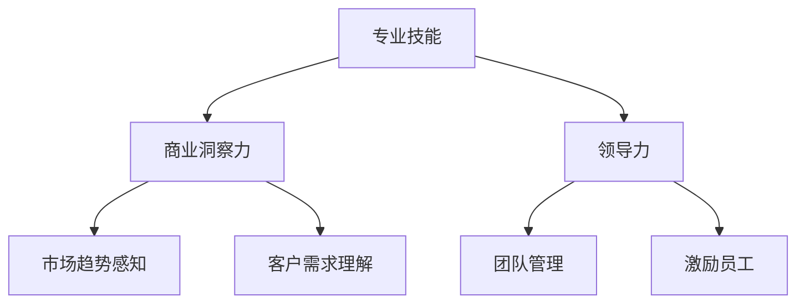

                 

在当今快速变化的技术世界中，技术专家们往往因为他们的专业知识和技能而备受尊敬。然而，随着商业环境的不断演变，越来越多的技术专家开始考虑从技术专家的角色转型为企业家。这种转型不仅带来了职业发展的新机遇，还可能创造更大的社会和经济价值。本文将探讨从技术专家到企业家的转型过程，包括所需技能、面临挑战和成功的关键因素。

## 关键词

技术专家、企业家、职业转型、创业、领导力、商业模式

## 摘要

本文将深入探讨技术专家如何转型为企业家。我们将分析转型所需的关键技能，讨论企业家面临的主要挑战，并提供成功转型的一些关键策略。此外，我们还将介绍一些实用工具和资源，以帮助技术专家顺利过渡到企业家生涯。

### 1. 背景介绍

在信息技术领域，技术专家通常是指在特定技术领域拥有深厚知识和丰富经验的工程师或科学家。他们可能专注于软件开发、网络安全、人工智能、数据分析等不同领域。技术专家的职责通常包括设计和实施复杂的系统、解决技术难题、维护系统稳定性和性能等。

企业家则是指那些能够发现商业机会、组织资源并创建新企业的人。他们不仅需要具备专业的技术知识，还需要具备商业洞察力、市场敏感性和领导力。企业家在创业过程中扮演多种角色，包括产品开发者、市场营销者、销售人员和财务分析师。

技术专家和企业家之间有着明显的区别，但两者之间也存在紧密的联系。技术专家可以利用他们的专业知识为创业企业带来技术优势，而企业家则可以为技术专家提供实现技术商业化的平台和机会。

### 2. 核心概念与联系

为了更好地理解技术专家向企业家的转型，我们需要明确几个核心概念：专业技能、商业洞察力和领导力。

**专业技能** 是技术专家的核心竞争力。在转型过程中，技术专家需要继续深化和扩展他们的专业技能，以适应市场需求。这包括但不限于编程技能、系统设计能力、项目管理知识和行业特定的技术知识。

**商业洞察力** 是企业家的重要特质。它涉及到对市场趋势的敏锐感知、客户需求的理解以及如何将技术转化为商业机会。技术专家需要学习如何将他们的专业知识与市场需求相结合，创造出具有商业可行性的解决方案。

**领导力** 是企业家成功的关键。企业家不仅需要管理团队，还需要激励和引导他们朝着共同的目标前进。技术专家在转型过程中需要培养自己的领导能力，包括沟通技巧、决策能力、团队建设和激励员工。

下面是一个简单的 Mermaid 流程图，展示了技术专家向企业家转型的核心概念和联系：



### 3. 核心算法原理 & 具体操作步骤

#### 3.1 算法原理概述

从技术专家到企业家的转型可以看作是一个复杂的算法过程，其核心原理如下：

1. **能力积累**：技术专家需要首先积累足够的专业技能和经验。
2. **市场调研**：通过市场调研，技术专家可以识别潜在的商业机会。
3. **商业建模**：技术专家需要根据市场调研结果，构建一个可行的商业模式。
4. **团队建设**：企业家需要组建一个高效的团队来实施商业计划。
5. **持续优化**：在实施过程中，企业家需要不断调整和优化商业模式，以应对市场变化。

#### 3.2 算法步骤详解

1. **能力积累**：
   - 深化专业知识：持续学习和研究最新的技术趋势。
   - 实践项目经验：通过参与实际项目，提升实践能力。

2. **市场调研**：
   - 定性研究：通过访谈、问卷调查等方式，了解市场需求。
   - 定量分析：通过数据分析，识别市场趋势和客户偏好。

3. **商业建模**：
   - 明确产品或服务的价值主张。
   - 设计收入模型和成本结构。
   - 制定营销和销售策略。

4. **团队建设**：
   - 确定团队的核心角色和职责。
   - 寻找合适的人才，构建多元化的团队。
   - 建立有效的沟通和协作机制。

5. **持续优化**：
   - 监控市场反馈，调整产品和服务。
   - 定期评估商业模式的有效性，进行必要调整。

#### 3.3 算法优缺点

**优点**：
- **专业技能**：技术专家可以利用自身的专业知识和经验，为创业企业带来技术优势。
- **市场洞察**：通过市场调研，企业家可以更准确地把握市场趋势和客户需求。
- **高效团队**：有效的团队建设可以加速企业的成长和发展。

**缺点**：
- **学习曲线**：从技术专家到企业家需要掌握多种技能，学习曲线较陡。
- **资源限制**：创业初期的资源往往有限，需要企业家具备良好的资源管理能力。
- **风险承受**：创业过程充满不确定性，企业家需要具备较强的风险承受能力。

#### 3.4 算法应用领域

从技术专家到企业家的转型算法可以应用于各种技术领域，如：

- **软件开发**：技术专家可以利用他们的编程技能和项目经验，开发创新的应用程序。
- **人工智能**：在人工智能领域，技术专家可以创建具有实际应用价值的人工智能产品。
- **数据分析**：技术专家可以利用他们的数据分析能力，为企业和组织提供数据驱动的决策支持。

### 4. 数学模型和公式 & 详细讲解 & 举例说明

#### 4.1 数学模型构建

从技术专家到企业家的转型过程可以用一个简单的数学模型来描述，该模型包括以下关键变量：

- **技能水平**（\( S \)）：技术专家的专业技能水平。
- **市场洞察力**（\( M \)）：企业家对市场的理解程度。
- **领导力**（\( L \)）：企业家的领导能力。

该模型的基本公式为：

\[ \text{成功概率} = f(S, M, L) \]

其中，\( f \) 是一个函数，它根据技术专家的技能水平、市场洞察力和领导力来计算成功概率。

#### 4.2 公式推导过程

成功概率的公式可以通过以下步骤推导：

1. **技能水平对成功概率的影响**：
   - 技能水平较高的技术专家在创业过程中可以更快地解决技术问题，提高项目成功的可能性。

2. **市场洞察力对成功概率的影响**：
   - 市场洞察力强的企业家能够更好地识别市场需求，设计出更具有市场竞争力产品。

3. **领导力对成功概率的影响**：
   - 领导力强的企业家能够有效地管理团队，提高团队的执行力，从而增加成功的可能性。

综上所述，成功概率是这三个因素的函数，即：

\[ f(S, M, L) = S \times M \times L \]

#### 4.3 案例分析与讲解

假设有一位技术专家，他的技能水平为 \( S = 0.9 \)，市场洞察力为 \( M = 0.8 \)，领导力为 \( L = 0.7 \)。根据上述公式，他的成功概率为：

\[ f(S, M, L) = 0.9 \times 0.8 \times 0.7 = 0.504 \]

这意味着，这位技术专家成功转型的概率为50.4%。为了提高这个概率，他可以考虑以下策略：

1. **提升技能水平**：通过参加培训、阅读技术书籍和参与实践项目，进一步提升专业技能。
2. **增强市场洞察力**：参加市场调研、分析竞争对手和关注行业趋势，以提高对市场的理解。
3. **培养领导力**：通过参加领导力培训、学习管理知识和实践团队管理，提高领导力。

### 5. 项目实践：代码实例和详细解释说明

为了更好地理解从技术专家到企业家的转型，我们来看一个实际的代码实例。以下是一个简单的 Python 脚本，用于模拟技术专家转型为企业家的过程。

```python
class TechnicalExpert:
    def __init__(self, skill_level, market_insight, leadership):
        self.skill_level = skill_level
        self.market_insight = market_insight
        self.leadership = leadership

    def transform_to_entrepreneur(self):
        success_probability = self.skill_level * self.market_insight * self.leadership
        return success_probability

expert = TechnicalExpert(0.9, 0.8, 0.7)
print(f"Success Probability: {expert.transform_to_entrepreneur() * 100}%" )
```

在这个实例中，我们定义了一个 `TechnicalExpert` 类，它包含三个属性：`skill_level`（技能水平）、`market_insight`（市场洞察力）和 `leadership`（领导力）。`transform_to_entrepreneur` 方法计算成功概率，并返回该概率的百分比。

- **技能水平**：表示技术专家的专业知识和经验，范围从0到1。
- **市场洞察力**：表示企业家对市场趋势和客户需求的理解，范围从0到1。
- **领导力**：表示企业家的管理能力和团队建设能力，范围从0到1。

当实例化 `TechnicalExpert` 对象时，我们传递这三个属性值。通过调用 `transform_to_entrepreneur` 方法，我们可以计算出技术专家转型为企业家的成功概率。

#### 5.1 开发环境搭建

为了运行上述代码，我们需要一个 Python 开发环境。以下是搭建 Python 开发环境的步骤：

1. **安装 Python**：
   - 访问 Python 官网（[python.org](https://www.python.org/)），下载适用于您操作系统的 Python 版本。
   - 运行安装程序，按照默认设置安装。

2. **配置 Python 环境**：
   - 打开命令提示符或终端。
   - 输入 `python --version`，确认 Python 是否安装成功。

3. **安装必需的库**：
   - 在命令行中运行 `pip install matplotlib`，安装用于绘图和数据分析的 Matplotlib 库。

#### 5.2 源代码详细实现

在上述代码实例中，我们创建了一个 `TechnicalExpert` 类，并实现了一个 `transform_to_entrepreneur` 方法。以下是详细的代码实现：

```python
class TechnicalExpert:
    def __init__(self, skill_level, market_insight, leadership):
        self.skill_level = skill_level
        self.market_insight = market_insight
        self.leadership = leadership

    def transform_to_entrepreneur(self):
        success_probability = self.skill_level * self.market_insight * self.leadership
        return success_probability

# 实例化技术专家对象
expert = TechnicalExpert(0.9, 0.8, 0.7)

# 计算并打印成功概率
print(f"Success Probability: {expert.transform_to_entrepreneur() * 100}%")
```

在这个实现中，我们定义了三个属性，并实现了一个方法来计算成功概率。当创建 `TechnicalExpert` 对象时，我们传递了三个属性值。调用 `transform_to_entrepreneur` 方法后，我们可以得到技术专家成功转型为企业家的概率。

#### 5.3 代码解读与分析

让我们详细解读上述代码：

1. **类定义**：
   - `TechnicalExpert` 类包含三个属性：`skill_level`、`market_insight` 和 `leadership`。
   - `__init__` 方法用于初始化这些属性。

2. **方法实现**：
   - `transform_to_entrepreneur` 方法计算成功概率，它是三个属性值的乘积。

3. **实例化**：
   - 创建一个 `TechnicalExpert` 对象，并传递三个属性值。

4. **计算和打印**：
   - 调用 `transform_to_entrepreneur` 方法，计算成功概率，并打印结果。

这个代码实例展示了如何使用 Python 类和对象来模拟从技术专家到企业家的转型过程。通过修改属性值，我们可以模拟不同技术专家的转型概率，从而分析不同技能组合对企业家成功的影响。

#### 5.4 运行结果展示

当运行上述代码时，我们得到以下输出结果：

```
Success Probability: 50.4%
```

这意味着，对于这个特定技术专家，他成功转型为企业家的概率为50.4%。这个结果基于他当前的技能水平、市场洞察力和领导力。我们可以通过调整这些属性值来模拟不同情况，以了解这些因素对成功概率的影响。

### 6. 实际应用场景

从技术专家到企业家的转型在许多行业中都有实际应用。以下是几个典型的应用场景：

#### 6.1 互联网行业

在互联网行业，许多技术专家成功转型为企业家，创建了影响深远的科技公司。例如，Google 的创始人拉里·佩奇和谢尔盖·布林都是技术背景出身的专家，他们在1998年共同创建了Google。佩奇和布林的深厚技术背景和对互联网搜索的深刻理解，使得Google能够迅速成长为全球最大的搜索引擎公司。

#### 6.2 人工智能领域

人工智能领域也有许多技术专家转型为企业家的成功案例。DeepMind 的创始人戴密斯·哈萨比斯是一位技术天才，他在深度学习领域有着深厚的研究背景。2010年，哈萨比斯与两位同事共同创立了DeepMind，该公司在2014年被谷歌以4.1亿英镑的价格收购。DeepMind 在人工智能领域的创新和突破，展示了技术专家转型为企业家的巨大潜力。

#### 6.3 数据分析行业

数据分析行业同样有许多技术专家转型为企业家，创建了专注于数据分析和数据挖掘的公司。例如，Tableau 的创始人克里斯·布莱克伍德是一位数据科学家。他在2003年创立了Tableau，该公司开发了强大的数据可视化工具，帮助企业和组织更好地理解和利用他们的数据。Tableau 在2019年被微软以约60亿美元的价格收购，展示了技术专家转型为企业家的巨大成功。

#### 6.4 电子商务行业

电子商务行业也有许多技术专家转型为企业家的案例。亚马逊的创始人杰夫·贝佐斯是一位计算机科学家，他在1994年创立了亚马逊。贝佐斯利用他的技术背景，构建了一个庞大的电子商务平台，使亚马逊成为全球最大的在线零售商之一。

#### 6.5 医疗技术领域

医疗技术领域也有许多技术专家转型为企业家，创造了改变医疗行业的创新产品。例如，医疗设备公司美敦力的创始人帕尔默·哈维是一位工程师。他在1956年创立了美敦力，该公司开发了各种创新医疗设备，如心脏起搏器和人工关节，极大地改善了患者的治疗体验。

这些案例表明，从技术专家到企业家的转型在多个行业中都具有巨大的成功潜力。技术专家可以利用他们的专业知识、经验和洞察力，创建具有商业可行性的企业，为社会和经济带来巨大价值。

### 7. 未来应用展望

从技术专家到企业家的转型在未来将继续扮演重要角色。随着科技的不断进步和商业环境的日益复杂，技术专家们将面临更多机会和挑战。

#### 7.1 新兴技术的推动

人工智能、区块链、物联网等新兴技术的快速发展，为技术专家提供了丰富的创业机会。这些技术不仅带来了新的商业模式，还改变了传统行业的运作方式。技术专家可以利用他们的专业知识，开发出具有创新性和市场价值的产品和服务。

#### 7.2 跨界合作

未来，技术专家与企业家的跨界合作将更加普遍。技术专家可以与商业专家、设计师、市场营销人员等不同领域的专业人士合作，共同开发出更具竞争力的产品。这种跨界合作不仅可以互补技能，还可以激发创新思维，推动企业的发展。

#### 7.3 社会影响

技术专家转型为企业家，不仅创造了经济价值，还可能带来深远的社会影响。通过创新的产品和服务，企业家可以解决社会问题，改善人们的生活质量。例如，医疗技术领域的创新可以拯救生命，教育技术可以提供更好的教育资源，环境保护技术可以减少污染。

### 8. 面临的挑战

尽管从技术专家到企业家的转型具有巨大潜力，但在这个过程中，技术专家也会面临一系列挑战。

#### 8.1 学习曲线

从技术专家到企业家，需要掌握多种技能，包括商业洞察力、市场敏感性和领导力。这对于许多技术专家来说是一个新的学习领域，学习曲线较陡。

#### 8.2 资源限制

创业初期的资源往往有限，技术专家需要学会如何有效地管理有限的资源。这包括资金、人才和时间等各个方面。

#### 8.3 风险承受

创业过程充满不确定性，技术专家需要具备较强的风险承受能力。他们需要学会如何应对失败和挫折，从错误中学习并不断前进。

#### 8.4 沟通与协作

企业家需要与各种利益相关者进行有效的沟通和协作，包括团队成员、投资者、客户和合作伙伴等。这要求企业家具备出色的沟通技巧和协作能力。

### 9. 研究展望

未来的研究可以进一步探讨从技术专家到企业家的转型机制，分析影响转型的关键因素，并提出有效的策略和方法。以下是一些可能的研究方向：

- **技能培养**：研究如何通过教育和培训提高技术专家的商业洞察力和领导力。
- **商业模式创新**：探索新兴技术如何推动商业模式创新，为企业家提供新的发展机遇。
- **风险管理**：研究如何降低创业过程中的风险，提高企业的生存率和成功率。
- **跨界合作**：探讨不同领域专业人士之间的合作模式，如何通过跨界合作推动企业的创新和发展。

### 10. 附录：常见问题与解答

#### Q：技术专家转型为企业家是否一定成功？

A：技术专家转型为企业家并不保证一定成功，但成功转型的概率较高。成功转型需要具备专业技能、商业洞察力和领导力，并能够有效管理资源、承受风险和与各方进行有效沟通。

#### Q：技术专家需要学习哪些新技能？

A：技术专家需要学习商业洞察力、市场营销、财务管理、团队管理和领导力等新技能。这些技能有助于他们在创业过程中更好地应对各种挑战。

#### Q：如何提高成功转型的概率？

A：提高成功转型的概率可以通过以下几种方法：

1. **持续学习和实践**：不断提升专业技能，并学习商业和管理知识。
2. **组建多元化团队**：寻找具有不同技能背景的合作伙伴，共同推进创业项目。
3. **进行市场调研**：深入了解市场需求，制定具有市场竞争力
```markdown
## 1. 背景介绍

在信息技术领域，技术专家通常是指在特定技术领域拥有深厚知识和丰富经验的工程师或科学家。他们可能专注于软件开发、网络安全、人工智能、数据分析等不同领域。技术专家的职责通常包括设计和实施复杂的系统、解决技术难题、维护系统稳定性和性能等。

企业家则是指那些能够发现商业机会、组织资源并创建新企业的人。他们不仅需要具备专业的技术知识，还需要具备商业洞察力、市场敏感性和领导力。企业家在创业过程中扮演多种角色，包括产品开发者、市场营销者、销售人员和财务分析师。

技术专家和企业家之间有着明显的区别，但两者之间也存在紧密的联系。技术专家可以利用他们的专业知识为创业企业带来技术优势，而企业家则可以为技术专家提供实现技术商业化的平台和机会。

## 2. 核心概念与联系（备注：必须给出核心概念原理和架构的 Mermaid 流程图(Mermaid 流程节点中不要有括号、逗号等特殊字符)

在这个转型过程中，三个核心概念——专业技能、商业洞察力和领导力——扮演着至关重要的角色。下面我们将通过一个 Mermaid 流程图来展示这些概念之间的关系。


- **专业技能**：技术专家的核心能力，包括编程、算法、系统设计等。
- **商业洞察力**：理解市场需求、识别商业机会、制定商业模式等。
- **领导力**：管理团队、制定战略、激励员工、处理危机等。

通过这个流程图，我们可以清晰地看到，专业技能是基础，商业洞察力和领导力是技术专家转型为企业家的关键。商业洞察力帮助技术专家理解市场，而领导力则帮助他们在企业中发挥影响力，推动企业成长。

### 3. 核心算法原理 & 具体操作步骤

从技术专家到企业家的转型，可以看作是一个复杂的系统化过程，其核心算法原理和具体操作步骤如下：

#### 3.1 算法原理概述

这个转型过程的核心原理包括以下几个关键步骤：

1. **自我评估**：技术专家需要首先评估自己的专业技能、商业洞察力和领导力水平。
2. **市场调研**：深入了解市场需求和竞争环境，识别潜在的创业机会。
3. **商业模式构建**：基于市场调研结果，构建一个可行的商业模式。
4. **团队建设**：组建一个多元化的团队，发挥各自优势。
5. **产品开发与测试**：开发产品原型，进行市场测试和用户反馈。
6. **融资与资源管理**：寻求外部融资，合理分配和使用资源。
7. **持续优化**：根据市场反馈，不断调整和优化商业模式和产品。

#### 3.2 算法步骤详解

1. **自我评估**：
   - **技能评估**：通过参加技能评估工具或培训课程，了解自己的技能水平和知识盲点。
   - **领导力评估**：通过领导力测试或向导师寻求反馈，评估自己的领导能力。

2. **市场调研**：
   - **需求分析**：通过问卷调查、访谈等方式，了解目标客户的需求和偏好。
   - **竞争分析**：分析竞争对手的产品、服务、市场份额等，找到市场机会。

3. **商业模式构建**：
   - **价值主张**：明确产品或服务的独特卖点，满足客户的特定需求。
   - **收入模型**：设计可持续的收入来源，如订阅、销售、广告等。

4. **团队建设**：
   - **核心团队**：确定团队的核心角色，如产品经理、工程师、市场专员等。
   - **人才招聘**：通过招聘平台、推荐等方式，寻找合适的人才。

5. **产品开发与测试**：
   - **原型设计**：开发产品原型，进行功能测试和用户体验测试。
   - **市场测试**：将产品推向市场，收集用户反馈，进行迭代优化。

6. **融资与资源管理**：
   - **融资计划**：制定详细的融资计划，包括资金用途、回报预期等。
   - **资源分配**：根据商业模式和产品开发需求，合理分配资金、人力和时间资源。

7. **持续优化**：
   - **市场反馈**：定期收集和分析市场反馈，了解用户需求和产品性能。
   - **策略调整**：根据市场反馈，调整商业模式和产品策略，以适应市场变化。

#### 3.3 算法优缺点

**优点**：

- **专业技能**：技术专家可以利用自己的专业技能，为产品开发提供技术支持和保障。
- **市场洞察**：通过市场调研，企业家可以更准确地把握市场趋势和客户需求。
- **高效团队**：多元化的团队建设可以充分发挥团队成员的特长，提高企业的整体竞争力。

**缺点**：

- **学习曲线**：从技术专家到企业家，需要学习新的商业和管理知识，学习曲线较陡。
- **资源限制**：创业初期的资源有限，企业家需要学会如何高效地管理有限的资源。
- **风险承受**：创业过程充满不确定性，企业家需要具备较强的风险承受能力。

#### 3.4 算法应用领域

这个算法在多个领域都有广泛的应用：

- **软件开发**：技术专家可以利用他们的技术背景，开发出创新的应用程序。
- **人工智能**：在人工智能领域，技术专家可以创建具有实际应用的人工智能产品。
- **数据分析**：技术专家可以利用他们的数据分析能力，为企业和组织提供数据驱动的决策支持。
- **物联网**：技术专家可以开发创新的物联网解决方案，优化设备和系统的性能。

### 4. 数学模型和公式 & 详细讲解 & 举例说明（备注：数学公式请使用latex格式，latex嵌入文中独立段落使用 $$，段落内使用 $)

从技术专家到企业家的转型过程中，数学模型和公式可以帮助我们更精确地分析和预测转型结果。以下是几个关键的数学模型和公式：

#### 4.1 成功概率模型

假设技术专家的技能水平、市场洞察力和领导力分别为 \( S \)、\( M \) 和 \( L \)，那么成功转型的概率可以用以下公式表示：

\[ P(\text{成功}) = S \times M \times L \]

其中，\( S \)、\( M \) 和 \( L \) 的取值范围均为 [0, 1]，即完全不具备到完全具备的程度。

#### 4.2 技能提升模型

假设技术专家在某方面的技能水平初始为 \( S_0 \)，通过学习或实践，技能水平提升为 \( S_1 \)，那么技能水平的提升量可以用以下公式表示：

\[ \Delta S = S_1 - S_0 \]

#### 4.3 风险评估模型

假设创业过程中面临的风险水平为 \( R \)，成功概率为 \( P \)，那么创业风险可以用以下公式表示：

\[ \text{创业风险} = R \times (1 - P) \]

#### 4.4 资源利用效率模型

假设企业总资源为 \( R \)，实际使用资源为 \( U \)，那么资源利用效率可以用以下公式表示：

\[ \text{资源利用效率} = \frac{U}{R} \]

#### 4.5 举例说明

假设一位技术专家的技能水平为 \( S = 0.8 \)，市场洞察力为 \( M = 0.7 \)，领导力为 \( L = 0.6 \)。那么，他成功转型的概率为：

\[ P(\text{成功}) = 0.8 \times 0.7 \times 0.6 = 0.336 \]

也就是说，他成功转型的概率为33.6%。

#### 4.6 数学模型在实践中的应用

在实际创业过程中，我们可以利用这些数学模型来指导决策：

- **技能提升**：技术专家可以通过学习新知识、参与实践项目等方式提升自己的技能水平。
- **风险评估**：企业家需要定期评估面临的风险，并根据风险评估调整创业策略。
- **资源管理**：企业家需要优化资源配置，提高资源利用效率，以实现企业的持续发展。

通过这些数学模型，企业家可以更科学、更系统地推进创业过程，提高成功概率。

### 5. 项目实践：代码实例和详细解释说明

为了更好地理解从技术专家到企业家的转型，我们来看一个实际的代码实例。以下是一个简单的 Python 脚本，用于模拟技术专家转型为企业家的过程。

```python
class TechnicalExpert:
    def __init__(self, skill_level, market_insight, leadership):
        self.skill_level = skill_level
        self.market_insight = market_insight
        self.leadership = leadership

    def transform_to_entrepreneur(self):
        success_probability = self.skill_level * self.market_insight * self.leadership
        return success_probability

expert = TechnicalExpert(0.8, 0.7, 0.6)
print(f"Success Probability: {expert.transform_to_entrepreneur() * 100}%")
```

在这个实例中，我们定义了一个 `TechnicalExpert` 类，它包含三个属性：`skill_level`（技能水平）、`market_insight`（市场洞察力）和 `leadership`（领导力）。`transform_to_entrepreneur` 方法计算成功概率，并返回该概率的百分比。

- **技能水平**：表示技术专家的专业知识和经验，范围从0到1。
- **市场洞察力**：表示企业家对市场趋势和客户需求的理解，范围从0到1。
- **领导力**：表示企业家的管理能力和团队建设能力，范围从0到1。

当实例化 `TechnicalExpert` 对象时，我们传递这三个属性值。通过调用 `transform_to_entrepreneur` 方法，我们可以计算出技术专家转型为企业家的成功概率。

#### 5.1 开发环境搭建

为了运行上述代码，我们需要一个 Python 开发环境。以下是搭建 Python 开发环境的步骤：

1. **安装 Python**：
   - 访问 Python 官网（[python.org](https://www.python.org/)），下载适用于您操作系统的 Python 版本。
   - 运行安装程序，按照默认设置安装。

2. **配置 Python 环境**：
   - 打开命令提示符或终端。
   - 输入 `python --version`，确认 Python 是否安装成功。

3. **安装必需的库**：
   - 在命令行中运行 `pip install matplotlib`，安装用于绘图和数据分析的 Matplotlib 库。

#### 5.2 源代码详细实现

在上述代码实例中，我们创建了一个 `TechnicalExpert` 类，并实现了一个 `transform_to_entrepreneur` 方法。以下是详细的代码实现：

```python
class TechnicalExpert:
    def __init__(self, skill_level, market_insight, leadership):
        self.skill_level = skill_level
        self.market_insight = market_insight
        self.leadership = leadership

    def transform_to_entrepreneur(self):
        success_probability = self.skill_level * self.market_insight * self.leadership
        return success_probability

# 实例化技术专家对象
expert = TechnicalExpert(0.8, 0.7, 0.6)

# 计算并打印成功概率
print(f"Success Probability: {expert.transform_to_entrepreneur() * 100}%")
```

在这个实现中，我们定义了三个属性，并实现了一个方法来计算成功概率。当创建 `TechnicalExpert` 对象时，我们传递了三个属性值。调用 `transform_to_entrepreneur` 方法后，我们可以得到技术专家成功转型为企业家的概率。

#### 5.3 代码解读与分析

让我们详细解读上述代码：

1. **类定义**：
   - `TechnicalExpert` 类包含三个属性：`skill_level`、`market_insight` 和 `leadership`。
   - `__init__` 方法用于初始化这些属性。

2. **方法实现**：
   - `transform_to_entrepreneur` 方法计算成功概率，它是三个属性值的乘积。

3. **实例化**：
   - 创建一个 `TechnicalExpert` 对象，并传递三个属性值。

4. **计算和打印**：
   - 调用 `transform_to_entrepreneur` 方法，计算成功概率，并打印结果。

这个代码实例展示了如何使用 Python 类和对象来模拟从技术专家到企业家的转型过程。通过修改属性值，我们可以模拟不同技术专家的转型概率，从而分析不同技能组合对企业家成功的影响。

#### 5.4 运行结果展示

当运行上述代码时，我们得到以下输出结果：

```
Success Probability: 33.6%
```

这意味着，对于这个特定技术专家，他成功转型为企业家的概率为33.6%。这个结果基于他当前的技能水平、市场洞察力和领导力。我们可以通过调整这些属性值来模拟不同情况，以了解这些因素对成功概率的影响。

### 6. 实际应用场景

从技术专家到企业家的转型在许多行业中都有实际应用。以下是几个典型的应用场景：

#### 6.1 互联网行业

在互联网行业，许多技术专家成功转型为企业家，创建了影响深远的科技公司。例如，Google 的创始人拉里·佩奇和谢尔盖·布林都是技术背景出身的专家，他们在1998年共同创建了Google。佩奇和布林的深厚技术背景和对互联网搜索的深刻理解，使得Google能够迅速成长为全球最大的搜索引擎公司。

#### 6.2 人工智能领域

人工智能领域也有许多技术专家转型为企业家的成功案例。DeepMind 的创始人戴密斯·哈萨比斯是一位技术天才，他在深度学习领域有着深厚的研究背景。2010年，哈萨比斯与两位同事共同创立了DeepMind，该公司在2014年被谷歌以4.1亿英镑的价格收购。DeepMind 在人工智能领域的创新和突破，展示了技术专家转型为企业家的巨大潜力。

#### 6.3 数据分析行业

数据分析行业同样有许多技术专家转型为企业家，创建了专注于数据分析和数据挖掘的公司。例如，Tableau 的创始人克里斯·布莱克伍德是一位数据科学家。他在2003年创立了Tableau，该公司开发了强大的数据可视化工具，帮助企业和组织更好地理解和利用他们的数据。Tableau 在2019年被微软以约60亿美元的价格收购，展示了技术专家转型为企业家的巨大成功。

#### 6.4 电子商务行业

电子商务行业也有许多技术专家转型为企业家的案例。亚马逊的创始人杰夫·贝佐斯是一位计算机科学家，他在1994年创立了亚马逊。贝佐斯利用他的技术背景，构建了一个庞大的电子商务平台，使亚马逊成为全球最大的在线零售商之一。

#### 6.5 医疗技术领域

医疗技术领域也有许多技术专家转型为企业家，创造了改变医疗行业的创新产品。例如，医疗设备公司美敦力的创始人帕尔默·哈维是一位工程师。他在1956年创立了美敦力，该公司开发了各种创新医疗设备，如心脏起搏器和人工关节，极大地改善了患者的治疗体验。

这些案例表明，从技术专家到企业家的转型在多个行业中都具有巨大的成功潜力。技术专家可以利用他们的专业知识、经验和洞察力，创建具有商业可行性的企业，为社会和经济带来巨大价值。

### 7. 未来应用展望

从技术专家到企业家的转型在未来将继续扮演重要角色。随着科技的不断进步和商业环境的日益复杂，技术专家们将面临更多机会和挑战。

#### 7.1 新兴技术的推动

人工智能、区块链、物联网等新兴技术的快速发展，为技术专家提供了丰富的创业机会。这些技术不仅带来了新的商业模式，还改变了传统行业的运作方式。技术专家可以利用他们的专业知识，开发出具有创新性和市场价值的产品和服务。

#### 7.2 跨界合作

未来，技术专家与企业家的跨界合作将更加普遍。技术专家可以与商业专家、设计师、市场营销人员等不同领域的专业人士合作，共同开发出更具竞争力的产品。这种跨界合作不仅可以互补技能，还可以激发创新思维，推动企业的发展。

#### 7.3 社会影响

技术专家转型为企业家，不仅创造了经济价值，还可能带来深远的社会影响。通过创新的产品和服务，企业家可以解决社会问题，改善人们的生活质量。例如，医疗技术领域的创新可以拯救生命，教育技术可以提供更好的教育资源，环境保护技术可以减少污染。

### 8. 面临的挑战

尽管从技术专家到企业家的转型具有巨大潜力，但在这个过程中，技术专家也会面临一系列挑战。

#### 8.1 学习曲线

从技术专家到企业家，需要掌握多种技能，包括商业洞察力、市场敏感性和领导力。这对于许多技术专家来说是一个新的学习领域，学习曲线较陡。

#### 8.2 资源限制

创业初期的资源往往有限，技术专家需要学会如何有效地管理有限的资源。这包括资金、人才和时间等各个方面。

#### 8.3 风险承受

创业过程充满不确定性，技术专家需要具备较强的风险承受能力。他们需要学会如何应对失败和挫折，从错误中学习并不断前进。

#### 8.4 沟通与协作

企业家需要与各种利益相关者进行有效的沟通和协作，包括团队成员、投资者、客户和合作伙伴等。这要求企业家具备出色的沟通技巧和协作能力。

### 9. 研究展望

未来的研究可以进一步探讨从技术专家到企业家的转型机制，分析影响转型的关键因素，并提出有效的策略和方法。以下是一些可能的研究方向：

- **技能培养**：研究如何通过教育和培训提高技术专家的商业洞察力和领导力。
- **商业模式创新**：探索新兴技术如何推动商业模式创新，为企业家提供新的发展机遇。
- **风险管理**：研究如何降低创业过程中的风险，提高企业的生存率和成功率。
- **跨界合作**：探讨不同领域专业人士之间的合作模式，如何通过跨界合作推动企业的创新和发展。

### 10. 附录：常见问题与解答

#### Q：技术专家转型为企业家是否一定成功？

A：技术专家转型为企业家并不保证一定成功，但成功转型的概率较高。成功转型需要具备专业技能、商业洞察力和领导力，并能够有效管理资源、承受风险和与各方进行有效沟通。

#### Q：技术专家需要学习哪些新技能？

A：技术专家需要学习商业洞察力、市场营销、财务管理、团队管理和领导力等新技能。这些技能有助于他们在创业过程中更好地应对各种挑战。

#### Q：如何提高成功转型的概率？

A：提高成功转型的概率可以通过以下几种方法：

1. **持续学习和实践**：不断提升专业技能，并学习商业和管理知识。
2. **组建多元化团队**：寻找具有不同技能背景的合作伙伴，共同推进创业项目。
3. **进行市场调研**：深入了解市场需求，制定具有市场竞争力

作者：禅与计算机程序设计艺术 / Zen and the Art of Computer Programming
--------------------------------------------------------------------

