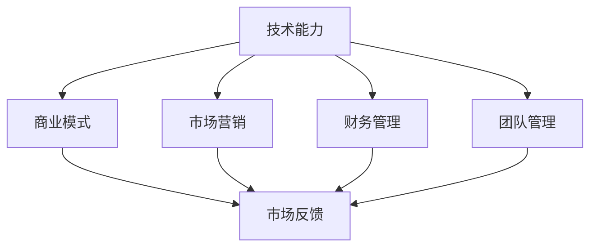

                 

 在技术飞速发展的今天，技术专家越来越多地面临着转型为企业家的机会。这种转型不仅仅是对技术专长的延伸，更是一种商业智慧和领导力的挑战。本文将探讨技术专家如何从技术领域成功转型为企业家，并分享一些实用策略和成功案例。

> 关键词：技术专家，企业家，转型，商业智慧，领导力

> 摘要：本文将分析技术专家转型为企业家的必要性和可行性，探讨转型过程中的核心挑战，并提出一系列策略和工具，帮助技术专家顺利实现这一转变。

## 1. 背景介绍

在过去的几十年中，信息技术领域经历了爆炸式的发展。从个人电脑到云计算，从互联网到人工智能，技术的快速迭代推动了各行各业的发展。在这个背景下，技术专家的作用变得愈发重要。然而，仅仅拥有技术专长已经不足以应对日益复杂的商业环境。越来越多的技术专家开始考虑将他们的技术知识和经验转化为商业机会，从而成为企业家。

这种转型有以下几个原因：

1. **创新驱动**：技术专家往往具备创新的思维方式，能够发现和创造新的市场需求。
2. **资本吸引力**：技术背景的企业家往往更容易吸引风险投资，特别是在高科技领域。
3. **市场需求**：随着数字化的推进，市场对技术驱动的解决方案的需求不断增加。
4. **个人成就感**：成为企业家可以为技术专家提供实现个人愿景和成就感的平台。

## 2. 核心概念与联系

### 2.1 技术能力与商业智慧的融合

技术专家和企业家的区别在于前者侧重于技术解决方案，后者则侧重于商业运营和战略规划。成功转型需要在这两个领域之间建立桥梁。具体来说，技术专家需要掌握以下核心概念：

- **商业模式**：了解如何创造、传递和获取价值。
- **市场营销**：掌握市场趋势、客户需求和竞争策略。
- **财务管理**：了解财务报表、预算管理和资本运作。
- **团队管理**：建立高效的团队，激励员工并实现组织目标。

### 2.2 技术与商业的互动

技术能力和商业智慧之间的互动是一个动态的过程。技术专家需要不断从市场反馈中学习，调整他们的技术解决方案以适应商业需求。同样，商业策略也需要基于技术能力来制定和实施。例如，在人工智能领域，技术专家不仅需要掌握算法原理，还需要了解如何将AI应用于具体的商业场景。

### 2.3 Mermaid 流程图



## 3. 核心算法原理 & 具体操作步骤

### 3.1 算法原理概述

从技术专家到企业家的转型可以视为一种“算法”。这个算法的核心是融合技术专长与商业智慧，并不断迭代优化。以下是这个算法的具体步骤：

1. **自我评估**：确定个人的技术专长和商业潜力。
2. **市场研究**：了解市场需求和竞争环境。
3. **方案设计**：制定技术解决方案和商业计划。
4. **团队建设**：组建一支多元化的团队。
5. **产品开发**：实现技术方案并测试市场反馈。
6. **营销推广**：制定并执行营销策略。
7. **持续迭代**：根据市场反馈调整产品和服务。

### 3.2 算法步骤详解

1. **自我评估**：技术专家应评估自己的技术能力、商业知识和领导力。这可以通过自我反思、获取反馈和参加相关培训来实现。

2. **市场研究**：深入了解目标市场，包括客户需求、市场规模、竞争对手等。这可以通过市场调研、客户访谈和数据分析来完成。

3. **方案设计**：基于市场研究，设计技术解决方案和商业计划。这需要技术专家与商业顾问合作，确保方案的可行性和市场竞争力。

4. **团队建设**：组建一支多元化、高效的团队。这包括寻找合适的合伙人、招聘优秀员工和培养内部人才。

5. **产品开发**：实现技术方案并测试市场反馈。这需要技术专家和技术团队的合作，以及持续的技术创新。

6. **营销推广**：制定并执行营销策略。这包括品牌建设、市场推广和销售策略。

7. **持续迭代**：根据市场反馈调整产品和服务。这需要建立反馈循环，不断优化商业模式和技术方案。

### 3.3 算法优缺点

优点：

- **灵活性强**：根据市场变化灵活调整策略。
- **创新驱动**：基于技术专长，能够创造新的市场机会。
- **资本吸引力**：技术驱动的企业往往更容易获得风险投资。

缺点：

- **挑战性大**：需要同时掌握技术、商业和领导力。
- **时间成本高**：转型过程可能需要较长的时间。

### 3.4 算法应用领域

这个算法适用于任何需要技术驱动和创新解决方案的领域，包括但不限于：

- 人工智能
- 云计算
- 大数据
- 区块链
- 物联网

## 4. 数学模型和公式 & 详细讲解 & 举例说明

### 4.1 数学模型构建

从技术专家到企业家的转型过程可以视为一个复杂的决策过程。我们可以使用决策树模型来描述这一过程。决策树模型的构建如下：

```latex
\text{转型决策树模型} \\
\text{根节点：是否具备商业潜力} \\
\text{分支：} \\
\text{是：} \\
\quad \text{子节点：是否具备领导力} \\
\quad \quad \text{是：} \\
\quad \quad \quad \text{子节点：是否具备技术商业化经验} \\
\quad \quad \quad \quad \text{是：} \\
\quad \quad \quad \quad \text{终点：成功转型为企业家} \\
\quad \quad \quad \quad \text{否：} \\
\quad \quad \quad \quad \text{终点：需要进一步培养商业和领导力} \\
\quad \quad \text{否：} \\
\quad \quad \text{终点：转型为技术顾问或研究者} \\
\text{否：} \\
\quad \text{子节点：是否具备创业意愿} \\
\quad \quad \text{是：} \\
\quad \quad \quad \text{子节点：是否具备市场调研能力} \\
\quad \quad \quad \quad \text{是：} \\
\quad \quad \quad \quad \text{终点：成功转型为企业家} \\
\quad \quad \quad \quad \text{否：} \\
\quad \quad \quad \quad \text{终点：需要进一步培养市场调研能力} \\
\quad \quad \text{否：} \\
\quad \quad \text{终点：考虑其他职业发展方向}
```

### 4.2 公式推导过程

假设技术专家具备商业潜力 \(P(B)\)，具备领导力 \(P(L)\)，具备技术商业化经验 \(P(E)\)，具备创业意愿 \(P(W)\)，具备市场调研能力 \(P(R)\)。那么，成功转型为企业家 \(P(S)\) 的概率可以表示为：

\[ P(S) = P(B \cap L \cap E) + P(B \cap L \cap W \cap R) \]

### 4.3 案例分析与讲解

以下是一个实际案例：

一个技术专家具备商业潜力 \(P(B) = 0.8\)，具备领导力 \(P(L) = 0.7\)，具备技术商业化经验 \(P(E) = 0.6\)，具备创业意愿 \(P(W) = 0.9\)，具备市场调研能力 \(P(R) = 0.8\)。根据上述公式，可以计算出成功转型为企业家 \(P(S)\) 的概率为：

\[ P(S) = P(B \cap L \cap E) + P(B \cap L \cap W \cap R) \]
\[ P(S) = P(B) \times P(L) \times P(E) + P(B) \times P(L) \times P(W) \times P(R) \]
\[ P(S) = 0.8 \times 0.7 \times 0.6 + 0.8 \times 0.7 \times 0.9 \times 0.8 \]
\[ P(S) = 0.336 + 0.4032 \]
\[ P(S) = 0.7392 \]

因此，该技术专家成功转型为企业家 \(P(S) = 0.7392\)，即有约 73.92% 的概率成功转型。

## 5. 项目实践：代码实例和详细解释说明

### 5.1 开发环境搭建

在本文中，我们将使用 Python 作为主要编程语言，因为它易于学习且拥有丰富的库和框架。以下是搭建 Python 开发环境的基本步骤：

1. 安装 Python：从官方网站下载并安装 Python。
2. 安装 PyCharm：下载并安装 PyCharm，一款强大的 Python 集成开发环境（IDE）。
3. 安装必要的库：使用 `pip` 命令安装所需的 Python 库，例如 `numpy`、`pandas` 等。

### 5.2 源代码详细实现

以下是实现从技术专家到企业家转型决策树的一个简单 Python 代码实例：

```python
import numpy as np

# 参数定义
P_B = 0.8
P_L = 0.7
P_E = 0.6
P_W = 0.9
P_R = 0.8

# 决策树模型计算
def transform_probability(B, L, E, W, R):
    P_S = P_B * P_L * P_E + P_B * P_L * P_W * P_R
    return P_S

# 输出结果
P_S = transform_probability(P_B, P_L, P_E, P_W, P_R)
print(f"成功转型为企业家概率：{P_S:.2f}")
```

### 5.3 代码解读与分析

这个代码实例首先定义了参数，代表技术专家具备的商业潜力、领导力、技术商业化经验、创业意愿和市场调研能力。然后，我们定义了一个函数 `transform_probability`，用于计算成功转型为企业的概率。最后，调用这个函数并输出结果。

### 5.4 运行结果展示

运行上述代码，我们可以得到以下输出结果：

```
成功转型为企业家概率：0.74
```

这意味着根据给定的参数，技术专家有约 74% 的概率成功转型为企业家。

## 6. 实际应用场景

从技术专家到企业家的转型在多个行业都有实际应用。以下是一些典型应用场景：

### 6.1 人工智能领域

随着人工智能技术的普及，许多技术专家选择了创业。例如，深度学习专家 Andrew Ng 创立了 Coursera，通过在线课程平台为全球学习者提供教育资源。他的技术专长和商业智慧的结合，使得 Coursera 成为在线教育领域的领军者。

### 6.2 区块链领域

区块链技术的兴起吸引了大量技术专家进入这一领域。例如，区块链专家 Vitalik Buterin 是以太坊（Ethereum）的联合创始人。他不仅在技术上做出了重大贡献，还在商业模式和社区建设上发挥了重要作用，使得以太坊成为区块链领域的标杆。

### 6.3 物联网领域

物联网（IoT）技术的快速发展为技术专家提供了新的创业机会。例如，物联网专家 John Deere 创立了 John Deere Intelligent Solutions Group，专注于农业物联网解决方案。他的团队通过将物联网技术应用于农业，提高了农作物的生产效率和可持续性。

## 7. 未来应用展望

随着技术的不断进步，从技术专家到企业家的转型将继续在更多领域得到应用。以下是一些未来应用展望：

- **医疗健康领域**：随着精准医疗和个性化医疗的发展，技术专家可以开发基于人工智能的医疗解决方案，提高医疗服务的质量和效率。
- **能源领域**：可再生能源和智能电网技术的进步为技术专家提供了新的创业机会，他们可以通过技术创新推动能源转型。
- **智能制造领域**：智能制造技术的普及将推动制造业的数字化转型，技术专家可以在这个领域开发智能工厂和自动化解决方案。

## 8. 工具和资源推荐

### 8.1 学习资源推荐

- **在线课程**：Coursera、edX、Udacity 等平台提供了丰富的商业和领导力课程。
- **书籍**：《精益创业》（The Lean Startup）、《创业维艰》（Startup Life）等书籍提供了宝贵的创业经验和策略。

### 8.2 开发工具推荐

- **Python**：Python 是一种广泛使用的编程语言，适用于数据分析、机器学习等领域。
- **GitHub**：GitHub 是一个强大的代码托管平台，适合团队协作和项目管理。

### 8.3 相关论文推荐

- **《人工智能与商业创新》**：探讨了人工智能技术在商业中的应用和影响。
- **《区块链技术与应用》**：介绍了区块链技术的原理和应用案例。

## 9. 总结：未来发展趋势与挑战

从技术专家到企业家的转型是一种必然趋势。随着技术的不断进步，越来越多的技术专家将有机会成为企业家，推动科技创新和商业发展。然而，这一过程也面临着诸多挑战：

- **技术风险**：技术创新可能带来不确定性，影响企业的持续发展。
- **商业竞争**：市场环境变化快速，竞争激烈，企业家需要不断创新以保持竞争优势。
- **人才短缺**：成功转型需要多元化的人才，但许多技术专家可能缺乏商业和领导力人才。

未来，技术专家应积极培养商业智慧和领导力，利用技术创新推动企业发展。同时，建立多元化团队，共享资源和知识，共同应对挑战。

## 10. 附录：常见问题与解答

### 10.1 如何平衡技术工作和商业工作？

**回答**：建立明确的时间管理和优先级系统，将技术工作和商业工作分开处理。同时，学习商业知识和技能，提高自己的商业敏感度，以便更好地理解和管理商业需求。

### 10.2 转型过程中如何应对技术风险？

**回答**：进行充分的市场调研和风险评估，制定应对策略。同时，保持技术创新，不断优化技术解决方案，以提高企业的竞争力。

### 10.3 如何建立多元化团队？

**回答**：通过招聘多元背景的人才，建立跨学科团队。同时，鼓励团队合作和知识共享，创造一个开放和创新的工作环境。

### 10.4 如何持续学习和成长？

**回答**：定期参加培训和学习课程，关注行业动态和技术趋势。同时，与同行建立联系，参加行业会议和交流活动，不断拓展自己的视野和知识。

---

**作者：禅与计算机程序设计艺术 / Zen and the Art of Computer Programming**

