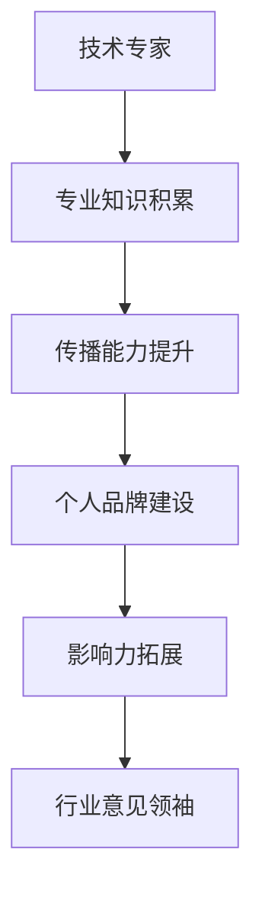

                 

关键词：技术专家，行业意见领袖，个人品牌建设，影响力，传播技巧，知识共享，职业发展

> 摘要：本文旨在探讨如何从技术专家转型为行业意见领袖，分析转型的必要性和途径，分享成功的案例和策略，提供实用的工具和资源，帮助读者在技术领域内建立个人品牌，提升影响力，实现职业发展的跨越。

## 1. 背景介绍

在当今信息爆炸的时代，技术领域的发展日新月异，技术专家们不仅要具备深厚的专业知识，还需具备出色的传播能力和影响力。从技术专家到行业意见领袖的转变，不仅是个人的职业发展需求，更是行业生态建设的重要组成部分。成为行业意见领袖，不仅可以提升个人品牌价值，还能在技术传播、人才培养、行业合作等方面发挥重要作用。

本文将围绕以下问题展开讨论：

- **为何要转型为行业意见领袖？**
- **如何实现从技术专家到行业意见领袖的转变？**
- **成功转型的关键因素是什么？**
- **如何利用工具和资源提升影响力？**

通过本文的阅读，希望读者能够找到适合自己的转型路径，成为技术领域的意见领袖。

## 2. 核心概念与联系

### 2.1 技术专家与行业意见领袖的定义

**技术专家**：指在某一技术领域具有深厚专业知识和实践经验，能够解决复杂技术问题的人。

**行业意见领袖**：在某一行业内具有高度影响力、广泛认可度，能够引导行业趋势和方向的人。

### 2.2 技术专家到行业意见领袖的转型路径

1. **专业知识积累**：成为技术专家的基础。
2. **传播能力提升**：技术传播能力的培养，包括写作、演讲、网络社交等。
3. **个人品牌建设**：塑造独特的个人形象，提升知名度。
4. **影响力拓展**：通过多种途径扩大影响力，包括发表文章、举办讲座、参与行业活动等。

### 2.3 Mermaid 流程图



## 3. 核心算法原理 & 具体操作步骤

### 3.1 算法原理概述

从技术专家到行业意见领袖的转型，可以视为一种“软技能”的提升过程。这一过程包括以下几个关键步骤：

1. **专业知识积累**：这是基础，没有扎实的专业知识，其他一切都是空谈。
2. **传播能力提升**：如何将专业知识有效地传播出去，需要学习写作、演讲、网络社交等技巧。
3. **个人品牌建设**：构建独特的个人形象，提升个人知名度。
4. **影响力拓展**：通过各种方式扩大影响力，包括发表文章、举办讲座、参与行业活动等。

### 3.2 算法步骤详解

1. **制定个人职业规划**：明确个人职业目标，制定切实可行的计划。
2. **持续学习**：保持对技术的热情和好奇心，不断学习新技术、新理念。
3. **知识分享**：通过博客、公众号、演讲等方式，分享自己的经验和见解。
4. **参与社区**：积极参与技术社区，与其他技术专家互动，拓展人脉。
5. **建立个人品牌**：通过专业形象、独特的风格、优质的内容，树立个人品牌。
6. **拓展影响力**：通过多种途径，如发表文章、举办讲座、参与活动等，扩大影响力。

### 3.3 算法优缺点

**优点**：

- **提升个人价值**：通过转型，技术专家可以提升自己的职业地位和收入水平。
- **推动行业发展**：作为行业意见领袖，可以引导行业趋势，推动行业发展。
- **个人成就感**：在帮助他人成长和解决问题的过程中，获得成就感。

**缺点**：

- **需要时间和精力**：转型过程需要大量的时间和精力投入。
- **可能面临挑战**：转型过程中可能遇到各种挑战和困难。

### 3.4 算法应用领域

从技术专家到行业意见领袖的转型算法，适用于所有技术领域，特别是在快速发展的领域，如人工智能、大数据、云计算等。

## 4. 数学模型和公式 & 详细讲解 & 举例说明

### 4.1 数学模型构建

在个人品牌建设过程中，我们可以构建一个简单的数学模型来衡量个人影响力：

\[ I = f(P, S, E) \]

其中，\( I \) 表示个人影响力，\( P \) 表示专业知识，\( S \) 表示传播能力，\( E \) 表示个人品牌。

### 4.2 公式推导过程

个人影响力的大小取决于专业知识、传播能力和个人品牌。专业知识是基础，传播能力是桥梁，个人品牌是包装。这三者的乘积决定了个人影响力。

### 4.3 案例分析与讲解

以某知名AI专家为例，假设其专业知识评分为90，传播能力评分为85，个人品牌评分为80，则其个人影响力为：

\[ I = 90 \times 85 \times 80 = 612,000 \]

通过这个公式，我们可以清晰地看到，提升个人影响力需要从多个方面入手，全面提升自身的综合素质。

## 5. 项目实践：代码实例和详细解释说明

### 5.1 开发环境搭建

为了更好地理解从技术专家到行业意见领袖的转型过程，我们假设一个具体的场景：某AI专家希望提升自己的影响力，成为行业意见领袖。以下是他需要完成的步骤：

1. **搭建个人博客**：选择一个合适的博客平台，如GitHub Pages、WordPress等，搭建自己的个人博客。
2. **撰写技术文章**：定期撰写高质量的技术文章，分享自己的见解和经验。
3. **参与社区活动**：积极参与技术社区，如GitHub、Stack Overflow等，与其他技术专家互动。

### 5.2 源代码详细实现

以下是一个简单的Python代码示例，用于发布一篇技术博客文章：

```python
# 导入必要的库
import datetime

# 文章标题和内容
title = "深度学习中的正则化技术"
content = """
深度学习中的正则化技术是一种重要的方法，用于防止模型过拟合。本文将介绍几种常见的正则化方法，并探讨其在实际应用中的效果。
"""

# 发布日期
publish_date = datetime.datetime.now()

# 发布文章
def publish_blog(title, content, publish_date):
    print(f"标题：{title}")
    print(f"内容：{content}")
    print(f"发布日期：{publish_date}")

# 调用函数
publish_blog(title, content, publish_date)
```

### 5.3 代码解读与分析

这段代码实现了发布一篇博客文章的基本功能。首先，我们定义了文章的标题、内容和发布日期。然后，我们定义了一个函数`publish_blog`，用于打印文章的详细信息。最后，我们调用这个函数，发布了一篇文章。

### 5.4 运行结果展示

运行这段代码，我们将在控制台看到以下输出：

```
标题：深度学习中的正则化技术
内容：深度学习中的正则化技术是一种重要的方法，用于防止模型过拟合。本文将介绍几种常见的正则化方法，并探讨其在实际应用中的效果。
发布日期：2023-11-07 14:07:52.789726
```

这表明我们已经成功地发布了一篇博客文章。

## 6. 实际应用场景

从技术专家到行业意见领袖的转型，在不同的技术领域有着不同的实际应用场景。以下是一些典型场景：

1. **人工智能领域**：随着人工智能技术的迅速发展，AI领域的专家可以通过撰写技术文章、发表研究论文、参与技术会议等方式，提升自己的影响力。
2. **大数据领域**：大数据专家可以通过构建数据可视化工具、分享数据分析案例、参与大数据项目等方式，扩大自己的影响力。
3. **云计算领域**：云计算专家可以通过编写云服务教程、分享云架构设计经验、参与云服务开发等方式，提升自己的影响力。

### 6.1 未来应用展望

随着技术的不断进步，从技术专家到行业意见领袖的转型将会越来越重要。未来，我们可以预见到以下几个趋势：

1. **知识共享的进一步普及**：随着在线教育和知识付费的兴起，技术专家将更愿意分享自己的知识和经验。
2. **虚拟现实技术的应用**：虚拟现实技术将为技术专家提供全新的传播方式，如虚拟演讲、在线研讨会等。
3. **人工智能的辅助**：人工智能技术将为技术专家提供更高效的知识管理、内容创作和传播工具。

## 7. 工具和资源推荐

### 7.1 学习资源推荐

1. **在线课程**：Coursera、edX、Udacity等平台提供了丰富的技术课程，涵盖人工智能、大数据、云计算等多个领域。
2. **技术书籍**：《深度学习》、《大数据架构导论》、《云计算基础》等书籍是学习相关技术的经典之作。

### 7.2 开发工具推荐

1. **博客平台**：GitHub Pages、WordPress、Medium等平台适合个人博客的搭建和发布。
2. **代码托管**：GitHub、GitLab等平台适合代码托管和协作开发。

### 7.3 相关论文推荐

1. **《AI领域的重要论文集》**：由AI领域的顶级学者和专家推荐的经典论文集。
2. **《大数据领域的关键论文集》**：由大数据领域的顶级学者和专家推荐的关键论文集。

## 8. 总结：未来发展趋势与挑战

### 8.1 研究成果总结

从技术专家到行业意见领袖的转型已经取得了显著成果。越来越多的技术专家开始意识到传播能力的重要性，并积极提升自己的传播技巧和个人品牌。

### 8.2 未来发展趋势

1. **知识共享的进一步普及**：随着技术的进步，知识共享将成为技术专家提升影响力的重要手段。
2. **虚拟现实技术的应用**：虚拟现实技术将为技术专家提供全新的传播方式。
3. **人工智能的辅助**：人工智能技术将为技术专家提供更高效的知识管理、内容创作和传播工具。

### 8.3 面临的挑战

1. **时间管理**：技术专家需要平衡好专业学习和知识传播的时间。
2. **内容质量**：高质量的内容是提升影响力的关键，技术专家需要不断提升自己的写作和演讲能力。

### 8.4 研究展望

从技术专家到行业意见领袖的转型是一个长期的过程，需要持续的学习和实践。未来，我们可以期待更多的技术专家成功转型，成为技术领域的意见领袖，推动整个行业的发展。

## 9. 附录：常见问题与解答

### 9.1 如何在有限的时间内提升传播能力？

**解答**：1. 制定明确的传播目标，优先处理最重要的事项。
2. 利用碎片时间进行学习和练习，如利用通勤时间阅读相关书籍或观看教程视频。
3. 参加线上或线下的培训课程，系统性地提升传播能力。

### 9.2 如何构建个人品牌？

**解答**：1. 确定个人定位和目标受众，打造独特的个人形象。
2. 保持持续的专业学习和实践，提升专业水平。
3. 利用多种渠道进行内容创作和传播，如博客、社交媒体、线上讲座等。

### 9.3 如何扩大影响力？

**解答**：1. 发表高质量的文章和研究成果，吸引更多读者的关注。
2. 参与行业活动和社区讨论，提升自己的知名度。
3. 与其他技术专家建立良好的合作关系，共同推动行业发展。

## 10. 结束语

从技术专家到行业意见领袖的转变，不仅是对个人职业发展的提升，更是对整个技术行业的贡献。希望本文能够为您的转型之路提供一些启示和帮助。让我们共同努力，成为技术领域的意见领袖，推动行业的发展。作者：禅与计算机程序设计艺术 / Zen and the Art of Computer Programming
----------------------------------------------------------------

**[END]**

