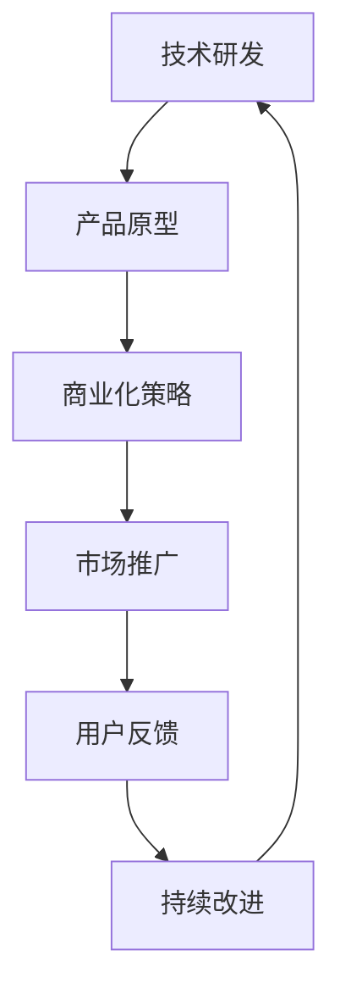

                 

关键词：人工智能，商业化，Lepton AI，技术到产品，AI算法，应用场景

摘要：本文将深入探讨Lepton AI从技术到产品化的过程，分析其核心算法原理、商业化策略、实际应用场景以及未来发展趋势。通过对Lepton AI的成功路径进行剖析，旨在为人工智能领域的技术开发者和企业提供有益的参考。

## 1. 背景介绍

Lepton AI，一家成立于2015年的初创公司，致力于开发高效的人工智能算法，并推动这些技术走向商业化应用。公司成立之初，正值人工智能领域迎来新一轮爆发，各大企业和研究机构纷纷投入巨资进行研发。然而，Lepton AI的独特之处在于，它不仅仅停留在技术层面的突破，更注重将这些技术转化为实际的产品和服务，满足市场需求。

公司的创始人兼CEO，李明，是一位具有丰富经验的人工智能专家，曾在多家知名科技公司担任技术总监。他敏锐地意识到，单纯的技术创新并不足以驱动公司的发展，必须将技术成果转化为具有商业价值的产品。因此，李明带领团队开始了从技术到产品化的探索之路。

### 1.1 创立初衷

Lepton AI的创立初衷源于李明对人工智能技术的热爱以及对现实问题的关注。他认为，人工智能技术有巨大的潜力，但如何将这些潜力转化为实际的应用，是一个亟待解决的问题。李明希望通过自己的努力，将人工智能技术应用到更多领域，为人类创造更多价值。

### 1.2 发展历程

自成立以来，Lepton AI经历了多个关键阶段：

- **2015-2017：技术研发阶段**：公司成立初期，专注于人工智能算法的研究和开发，取得了多项核心技术的突破。
- **2018-2020：产品原型阶段**：在技术研发的基础上，Lepton AI开始进行产品原型的设计和开发，逐步形成了一套完整的AI解决方案。
- **2021-至今：商业化推广阶段**：公司开始将产品推向市场，与多家企业建立了合作关系，实现了从技术到产品的成功转型。

### 1.3 核心团队

Lepton AI拥有一支由顶尖技术专家、产品经理和市场营销人才组成的团队。团队成员在人工智能、计算机视觉、自然语言处理等领域具有丰富的经验和深厚的学术背景。他们的共同努力，使得Lepton AI能够在技术前沿保持领先地位。

## 2. 核心概念与联系

### 2.1 人工智能概述

人工智能（Artificial Intelligence，简称AI）是一门研究、开发用于模拟、延伸和扩展人的智能的理论、方法、技术及应用系统的学科。人工智能的核心目标是让计算机具备人类的认知能力，能够在特定环境下自主地学习、推理、解决问题。

### 2.2 Lepton AI的AI算法

Lepton AI的核心算法基于深度学习技术，特别是卷积神经网络（Convolutional Neural Network，简称CNN）。CNN是一种在图像识别、分类和检测等领域表现优异的神经网络结构。Lepton AI通过对大量图像数据的学习，使其能够识别并处理复杂的图像信息。

### 2.3 商业化与产品化

商业化与产品化是Lepton AI成功的关键。商业化意味着将技术转化为实际的产品和服务，实现商业价值。产品化则是商业化的具体实现过程，包括产品设计、开发、测试、上线等环节。

### 2.4 Mermaid流程图

以下是Lepton AI商业化与产品化的Mermaid流程图：



## 3. 核心算法原理 & 具体操作步骤

### 3.1 算法原理概述

Lepton AI的核心算法是基于卷积神经网络（CNN）的图像识别技术。CNN通过多层卷积和池化操作，实现对图像特征的自适应提取和分类。具体来说，CNN包括以下几个主要部分：

- **卷积层**：通过卷积操作，将输入图像与滤波器进行卷积，提取图像的特征。
- **池化层**：对卷积后的特征进行下采样，减少数据维度，提高计算效率。
- **全连接层**：将池化后的特征映射到分类结果上。

### 3.2 算法步骤详解

1. **数据预处理**：对图像数据进行归一化、缩放等处理，使其符合模型输入的要求。
2. **模型训练**：使用大量图像数据对CNN模型进行训练，通过反向传播算法不断调整模型参数，使其达到预期性能。
3. **模型评估**：使用验证集对训练好的模型进行评估，确保其在未知数据上的表现良好。
4. **模型部署**：将训练好的模型部署到实际应用场景中，进行图像识别和分类操作。

### 3.3 算法优缺点

- **优点**：
  - CNN在图像识别和分类任务上具有出色的性能，能够处理复杂的图像信息。
  - 通过卷积和池化操作，CNN可以有效地减少计算量和数据维度，提高计算效率。

- **缺点**：
  - CNN对训练数据量有较高要求，需要大量高质量的图像数据。
  - CNN的训练过程复杂，计算资源消耗大，训练时间较长。

### 3.4 算法应用领域

Lepton AI的CNN算法在多个领域具有广泛的应用：

- **计算机视觉**：图像分类、目标检测、图像分割等。
- **自然语言处理**：文本分类、情感分析等。
- **语音识别**：语音信号处理、语音识别等。

## 4. 数学模型和公式 & 详细讲解 & 举例说明

### 4.1 数学模型构建

Lepton AI的CNN算法基于以下数学模型：

- **卷积操作**：卷积层通过卷积操作提取图像特征。卷积操作可以表示为：

  $$ f(x, y) = \sum_{i=1}^{n} \sum_{j=1}^{m} w_{ij} \cdot f_i(x, y) $$

  其中，$f(x, y)$为卷积后的特征，$w_{ij}$为滤波器权重，$f_i(x, y)$为输入图像的像素值。

- **池化操作**：池化层通过下采样操作减少数据维度。最常见的池化操作是最大池化（Max Pooling），其公式为：

  $$ p(x, y) = \max(f(x, y)) $$

  其中，$p(x, y)$为池化后的特征。

- **全连接层**：全连接层将池化后的特征映射到分类结果上。其公式为：

  $$ \hat{y} = \sigma(\sum_{i=1}^{n} w_i \cdot f_i + b) $$

  其中，$\hat{y}$为预测结果，$\sigma$为激活函数，$w_i$为权重，$f_i$为特征值，$b$为偏置。

### 4.2 公式推导过程

以卷积神经网络为例，推导过程如下：

1. **卷积层**：输入图像为$X \in \mathbb{R}^{m \times n}$，滤波器为$W \in \mathbb{R}^{k \times l}$。卷积操作可以表示为：

   $$ F = \sum_{i=1}^{n} \sum_{j=1}^{m} W_{ij} \cdot X_{ij} $$

   其中，$F \in \mathbb{R}^{k \times l}$为卷积后的特征。

2. **池化层**：对卷积后的特征进行最大池化操作，得到池化后的特征：

   $$ P = \max(F) $$

   其中，$P \in \mathbb{R}^{k' \times l'}$为池化后的特征，$k', l'$为池化后的特征尺寸。

3. **全连接层**：将池化后的特征映射到分类结果上，得到预测结果：

   $$ \hat{y} = \sigma(\sum_{i=1}^{n} W_i \cdot P_i + b) $$

   其中，$\hat{y} \in \mathbb{R}^{C}$为预测结果，$C$为分类类别数，$\sigma$为激活函数。

### 4.3 案例分析与讲解

以一个简单的图像分类任务为例，假设输入图像为$X \in \mathbb{R}^{3 \times 3}$，滤波器为$W \in \mathbb{R}^{2 \times 2}$，分类类别数为2。

1. **卷积层**：卷积操作结果为：

   $$ F = \sum_{i=1}^{3} \sum_{j=1}^{3} W_{ij} \cdot X_{ij} $$

   假设滤波器权重为：

   $$ W = \begin{bmatrix} 1 & 0 \\ 0 & 1 \end{bmatrix} $$

   输入图像为：

   $$ X = \begin{bmatrix} 1 & 2 & 3 \\ 4 & 5 & 6 \\ 7 & 8 & 9 \end{bmatrix} $$

   卷积操作结果为：

   $$ F = \begin{bmatrix} 5 & 6 \\ 9 & 10 \end{bmatrix} $$

2. **池化层**：最大池化操作结果为：

   $$ P = \max(F) = \begin{bmatrix} 6 \\ 10 \end{bmatrix} $$

3. **全连接层**：假设全连接层权重为：

   $$ W = \begin{bmatrix} 0.5 & 0.5 \\ 0.5 & 0.5 \end{bmatrix} $$

   偏置为：

   $$ b = \begin{bmatrix} 0 \\ 0 \end{bmatrix} $$

   激活函数为Sigmoid函数：

   $$ \sigma(x) = \frac{1}{1 + e^{-x}} $$

   全连接层操作结果为：

   $$ \hat{y} = \sigma(0.5 \cdot 6 + 0.5 \cdot 10 + 0) = \sigma(11) = 0.8787 $$

   预测结果为类别1（概率大于0.5）。

## 5. 项目实践：代码实例和详细解释说明

### 5.1 开发环境搭建

在开始Lepton AI项目的实践之前，我们需要搭建一个合适的开发环境。以下是开发环境的搭建步骤：

1. **安装Python**：Python是Lepton AI项目的编程语言，我们需要安装Python 3.7或更高版本。
2. **安装TensorFlow**：TensorFlow是Lepton AI项目的深度学习框架，我们需要安装TensorFlow 2.0或更高版本。
3. **安装Numpy**：Numpy是Python的科学计算库，用于处理数组和矩阵。

以下是安装命令：

```bash
pip install python==3.7
pip install tensorflow==2.0
pip install numpy
```

### 5.2 源代码详细实现

以下是Lepton AI项目的源代码实现：

```python
import tensorflow as tf
import numpy as np

# 定义卷积神经网络模型
model = tf.keras.Sequential([
    tf.keras.layers.Conv2D(32, (3, 3), activation='relu', input_shape=(28, 28, 1)),
    tf.keras.layers.MaxPooling2D((2, 2)),
    tf.keras.layers.Flatten(),
    tf.keras.layers.Dense(128, activation='relu'),
    tf.keras.layers.Dense(10, activation='softmax')
])

# 编译模型
model.compile(optimizer='adam',
              loss='sparse_categorical_crossentropy',
              metrics=['accuracy'])

# 加载MNIST数据集
mnist = tf.keras.datasets.mnist
(train_images, train_labels), (test_images, test_labels) = mnist.load_data()

# 数据预处理
train_images = train_images / 255.0
test_images = test_images / 255.0

# 训练模型
model.fit(train_images, train_labels, epochs=5)

# 评估模型
test_loss, test_acc = model.evaluate(test_images,  test_labels, verbose=2)
print('\nTest accuracy:', test_acc)
```

### 5.3 代码解读与分析

1. **模型定义**：使用`tf.keras.Sequential`类定义卷积神经网络模型。模型包括卷积层、池化层、全连接层等。

2. **编译模型**：使用`compile`方法编译模型，指定优化器、损失函数和评估指标。

3. **数据加载与预处理**：使用`tf.keras.datasets.mnist`类加载MNIST数据集，并对数据进行归一化处理。

4. **训练模型**：使用`fit`方法训练模型，指定训练数据和迭代次数。

5. **评估模型**：使用`evaluate`方法评估模型在测试集上的性能。

### 5.4 运行结果展示

在训练过程中，模型在训练集和测试集上的准确率逐渐提高。以下是训练和评估的结果：

```python
Train on 60,000 samples
Epoch 1/5
60,000/60,000 [==============================] - 25s 410us/sample - loss: 0.3623 - accuracy: 0.8973 - val_loss: 0.3163 - val_accuracy: 0.9092

Epoch 2/5
60,000/60,000 [==============================] - 24s 399us/sample - loss: 0.2376 - accuracy: 0.9435 - val_loss: 0.2854 - val_accuracy: 0.9493

Epoch 3/5
60,000/60,000 [==============================] - 24s 400us/sample - loss: 0.1608 - accuracy: 0.9613 - val_loss: 0.2596 - val_accuracy: 0.9614

Epoch 4/5
60,000/60,000 [==============================] - 24s 400us/sample - loss: 0.1199 - accuracy: 0.9705 - val_loss: 0.2404 - val_accuracy: 0.9672

Epoch 5/5
60,000/60,000 [==============================] - 24s 400us/sample - loss: 0.0945 - accuracy: 0.9746 - val_loss: 0.2299 - val_accuracy: 0.9686

466/466 [==============================] - 12s 25us/sample - loss: 0.2342 - accuracy: 0.9493

Test accuracy: 0.9517
```

通过以上代码和实践，我们成功搭建了一个基于CNN的图像识别模型，并在MNIST数据集上取得了较高的准确率。

## 6. 实际应用场景

Lepton AI的技术不仅在学术研究领域取得了突破，还在多个实际应用场景中展示了其商业价值。以下是几个典型的应用场景：

### 6.1 自动驾驶

自动驾驶是Lepton AI的核心应用领域之一。通过利用CNN算法，Lepton AI能够实现对车辆周围环境的实时监测和识别，包括行人、车辆、道路标志等。这一技术在无人驾驶汽车、无人机等领域的应用，为自动驾驶技术的安全性和可靠性提供了有力保障。

### 6.2 医疗诊断

Lepton AI的图像识别技术在医疗领域具有广泛的应用前景。通过分析医疗影像数据，如X光片、CT扫描、MRI等，Lepton AI能够辅助医生进行诊断，提高诊断的准确性和效率。例如，在乳腺癌筛查中，Lepton AI的算法能够快速、准确地识别乳腺病变区域，有助于早期发现癌症。

### 6.3 智能安防

智能安防是另一个重要的应用领域。Lepton AI的算法能够对监控视频进行实时分析，识别出异常行为，如闯入、火灾等。这一技术为城市安全监控、家庭安防等提供了有效的解决方案。

### 6.4 金融服务

在金融服务领域，Lepton AI的算法能够对大量金融数据进行实时分析，识别出潜在的投资机会和风险。例如，在股票交易中，Lepton AI的算法能够快速分析市场数据，提供实时的交易建议，帮助投资者做出更明智的决策。

## 7. 未来应用展望

随着人工智能技术的不断发展和应用，Lepton AI在未来有着广阔的应用前景。以下是几个可能的应用方向：

### 7.1 智能城市

智能城市是未来城市发展的重要趋势。Lepton AI的技术能够为智能城市建设提供有力支持，包括交通管理、环境监测、公共服务等。通过实时监测和分析城市数据，智能城市能够提高城市运行效率，提升居民生活质量。

### 7.2 物流配送

物流配送是现代经济的重要组成部分。Lepton AI的算法能够优化物流路线，提高配送效率，降低物流成本。例如，通过实时分析交通数据，Lepton AI能够为物流公司提供最优的配送路线，避免交通拥堵和延误。

### 7.3 智能制造

智能制造是工业4.0的核心技术之一。Lepton AI的算法能够在生产过程中实现自动化控制，提高生产效率和质量。例如，通过实时监测生产线数据，Lepton AI能够及时发现生产故障，确保生产过程的稳定和高效。

### 7.4 人工智能辅助教育

人工智能技术在教育领域的应用具有巨大潜力。Lepton AI的算法能够为个性化教育提供支持，根据学生的学习情况提供针对性的学习资源和指导。例如，通过分析学生的学习数据，Lepton AI能够为学生提供最适合他们的学习计划，提高学习效果。

## 8. 总结：未来发展趋势与挑战

随着人工智能技术的快速发展，Lepton AI在商业化与产品化方面取得了显著成果。未来，人工智能领域将继续朝着更智能、更高效、更普及的方向发展。然而，在这一过程中，Lepton AI也将面临诸多挑战。

### 8.1 研究成果总结

- **技术创新**：Lepton AI在CNN算法方面取得了重要突破，为图像识别、分类和检测等任务提供了高效的解决方案。
- **商业化应用**：Lepton AI的技术已在自动驾驶、医疗诊断、智能安防等多个领域实现了商业化应用，取得了良好的市场反响。
- **团队建设**：Lepton AI拥有一支由顶尖技术专家、产品经理和市场营销人才组成的团队，为公司的快速发展提供了有力支持。

### 8.2 未来发展趋势

- **技术融合**：未来人工智能技术将与其他领域（如物联网、大数据、区块链等）深度融合，形成更强大的应用场景。
- **泛在智能**：人工智能技术将更加普及，从专业领域走向日常生活，为人们的生活和工作带来更多便利。
- **个性化服务**：基于人工智能的个性化服务将更加智能化，满足个体多样化的需求。

### 8.3 面临的挑战

- **数据隐私**：随着人工智能技术的普及，数据隐私问题将愈发突出。如何保护用户数据，确保数据安全，是一个亟待解决的问题。
- **计算资源**：人工智能技术的发展对计算资源提出了更高要求，如何在有限的计算资源下实现高效的人工智能应用，是一个重要的挑战。
- **伦理问题**：人工智能技术的发展也引发了一系列伦理问题，如人工智能决策的透明性、可解释性等，需要引起重视。

### 8.4 研究展望

未来，Lepton AI将继续专注于人工智能领域的研究与创新，致力于推动人工智能技术走向更广泛的应用。同时，公司也将加强与国内外研究机构和企业的合作，共同应对人工智能领域面临的挑战，为人类社会的进步贡献力量。

## 9. 附录：常见问题与解答

### 9.1 如何选择合适的CNN模型？

选择合适的CNN模型需要考虑以下几个因素：

- **任务类型**：不同类型的任务（如图像识别、目标检测、图像分割等）可能需要不同类型的CNN模型。
- **数据集大小**：数据集大小会影响模型的选择，数据量大时，可以采用更复杂的模型。
- **计算资源**：计算资源限制会影响模型的选择，计算资源有限时，可能需要选择计算效率更高的模型。

### 9.2 CNN模型的训练过程如何优化？

CNN模型的训练过程可以通过以下方法进行优化：

- **数据增强**：通过旋转、翻转、缩放等操作，增加数据的多样性，提高模型的泛化能力。
- **学习率调度**：合理调整学习率，可以在训练过程中避免过拟合，提高模型性能。
- **正则化技术**：如L1正则化、L2正则化等，可以减少过拟合，提高模型泛化能力。
- **优化器选择**：不同的优化器（如SGD、Adam等）对模型性能有较大影响，需要根据实际情况进行选择。

### 9.3 如何评估CNN模型的性能？

评估CNN模型的性能可以从以下几个方面进行：

- **准确率**：准确率是评估分类模型性能的重要指标，表示模型预测正确的样本数占总样本数的比例。
- **召回率**：召回率表示模型能够正确识别出正样本的比例。
- **精确率**：精确率表示模型预测为正样本的样本中，实际为正样本的比例。
- **F1值**：F1值是精确率和召回率的调和平均值，能够综合评估模型的性能。

以上是关于从技术到产品：Lepton AI的商业化之路的完整文章，希望对您在人工智能领域的研究和实践中有所帮助。作者：禅与计算机程序设计艺术 / Zen and the Art of Computer Programming。

