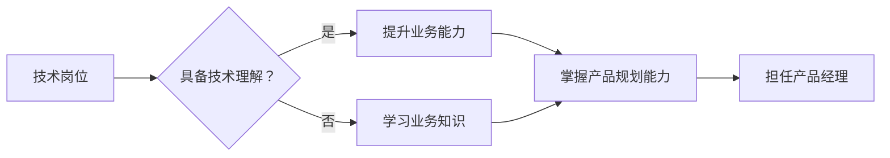

                 

关键词：技术岗位，产品经理，转型，技能，策略，团队协作

> 摘要：本文将探讨从技术岗位到产品经理的职业转型，分析转型过程中所需的关键技能和策略，并提供实用的实践建议，帮助技术背景的从业者顺利过渡到产品经理的角色。

## 1. 背景介绍

在当今快速发展的科技时代，技术岗位与产品经理之间的跨界转型日益成为行业趋势。随着企业对于产品创新和用户体验的重视，技术人才转型为产品经理不仅是一个个人职业发展的选择，也是企业提升竞争力的重要途径。技术岗位的从业者往往拥有扎实的技术基础和丰富的实践经验，而产品经理则需要具备全面的业务理解能力和优秀的沟通协调能力。如何在技术背景的基础上实现向产品经理的转型，成为了众多技术人才关注的焦点。

本文旨在探讨从技术岗位到产品经理的转型之路，通过分析转型过程中所需的关键技能和策略，为技术从业者提供实用的指导和建议，帮助他们更好地适应产品经理的角色。

## 2. 核心概念与联系

为了理解从技术岗位到产品经理的转型，我们首先需要明确两者的核心概念和联系。

### 2.1 技术岗位

技术岗位主要关注技术实现和产品开发，从业者通常具备以下特点：

- **技术背景**：熟悉编程语言、软件开发流程、数据库管理等基础技能。
- **实践经验**：拥有多年项目开发经验，能够解决复杂的技术问题。
- **技术视野**：紧跟技术发展趋势，了解最新的技术和工具。

### 2.2 产品经理

产品经理则主要关注产品规划和用户体验，其职责包括：

- **市场调研**：分析市场需求，了解用户痛点。
- **产品规划**：制定产品策略，规划产品路线图。
- **团队协作**：与开发、设计、市场等部门密切协作，确保产品顺利推进。
- **用户反馈**：收集用户反馈，持续优化产品。

### 2.3 核心概念联系

技术岗位与产品经理之间的联系主要体现在以下几个方面：

- **技术理解**：产品经理需要具备一定的技术背景，以便更好地与技术团队沟通。
- **用户视角**：技术岗位的从业者可以通过用户视角的转换，提升对产品和市场的理解。
- **业务能力**：技术岗位的从业者需要提升业务敏感度和市场洞察力，以更好地担任产品经理角色。

### 2.4 Mermaid 流程图

以下是一个简化的Mermaid流程图，展示从技术岗位到产品经理的转型过程：



通过上述流程图，我们可以看到，从技术岗位到产品经理的转型，不仅需要技术背景，还需要业务知识和产品管理能力的提升。

## 3. 核心算法原理 & 具体操作步骤

### 3.1 算法原理概述

从技术岗位到产品经理的转型，可以被视为一个多阶段、逐步提升的过程。这个过程涉及到一系列核心技能的掌握和提升。以下是这个转型过程的核心算法原理：

- **自我评估**：通过自我评估了解自身的技术能力和业务理解程度，确定转型方向。
- **技能提升**：有针对性地提升所需技能，如项目管理、用户体验设计、市场分析等。
- **实践应用**：在实际工作中应用所学技能，通过实际案例和项目经验积累产品经理的经验。
- **反馈优化**：根据反馈和实际效果，不断优化自己的能力和工作方法。

### 3.2 算法步骤详解

#### 3.2.1 自我评估

- **技术能力评估**：通过回顾以往的项目经验，分析自己在技术方面的优势和不足。
- **业务知识评估**：了解所在行业的基本业务知识，分析自己在业务理解方面的能力。

#### 3.2.2 技能提升

- **项目管理**：学习项目管理的基础知识，如项目管理方法论、项目管理工具等。
- **用户体验设计**：了解用户体验设计的基本原则和方法，学习如何进行用户研究和原型设计。
- **市场分析**：学习市场分析的方法和工具，如SWOT分析、市场调研等。

#### 3.2.3 实践应用

- **参与项目**：主动参与跨部门项目，担任项目中的技术或产品角色，积累实际经验。
- **角色转换**：在实践中逐步从技术角色向产品角色转换，提升对产品和市场的理解。

#### 3.2.4 反馈优化

- **收集反馈**：定期收集同事、上级和用户的反馈，了解自己的工作表现。
- **优化方法**：根据反馈，调整工作方法和策略，不断提升自己的能力。

### 3.3 算法优缺点

#### 优点

- **适应性**：算法原理基于个人的实际情况，具有很高的适应性。
- **系统性**：通过多阶段、逐步提升的方法，确保转型过程的系统性和连续性。
- **实践性**：强调实践应用和反馈优化，确保所学技能能够真正应用于工作。

#### 缺点

- **时间成本**：转型过程需要较长时间，对个人时间管理能力要求较高。
- **难度较大**：涉及多方面的技能提升，对个人学习能力要求较高。

### 3.4 算法应用领域

- **互联网行业**：互联网行业的快速发展和产品创新，为技术岗位到产品经理的转型提供了广阔的应用领域。
- **传统行业**：传统行业在数字化转型过程中，也需要大量具备技术背景的产品经理。

## 4. 数学模型和公式 & 详细讲解 & 举例说明

### 4.1 数学模型构建

从技术岗位到产品经理的转型过程，可以抽象为一个动态系统，其状态可以用以下数学模型表示：

- **状态变量**：技术能力 \( T \)，业务能力 \( B \)，产品管理能力 \( P \)。
- **转移矩阵**：定义状态变量之间的转移关系。

### 4.2 公式推导过程

设状态变量为 \( \vec{x} = (T, B, P) \)，转移矩阵为 \( A \)，则下一状态为 \( \vec{x}_{next} = A \vec{x} \)。

其中，转移矩阵 \( A \) 可以表示为：

\[ A = \begin{bmatrix} 
p_{TT} & p_{TB} & p_{TP} \\
p_{BT} & p_{BB} & p_{BP} \\
p_{PT} & p_{PB} & p_{PP}
\end{bmatrix} \]

### 4.3 案例分析与讲解

假设一个技术从业者，初始状态为 \( \vec{x}_0 = (1, 0, 0) \)，表示其初始技术能力为1，业务能力和产品管理能力均为0。

在一年时间内，通过不断学习和实践，其状态转移为：

\[ \vec{x}_1 = A \vec{x}_0 = \begin{bmatrix} 
0.8 & 0.1 & 0.1 \\
0.1 & 0.8 & 0.1 \\
0.1 & 0.1 & 0.8
\end{bmatrix} \begin{bmatrix} 
1 \\
0 \\
0
\end{bmatrix} = \begin{bmatrix} 
0.8 \\
0.1 \\
0.1
\end{bmatrix} \]

这意味着，一年后，该技术从业者的技术能力保持不变，业务能力提升到0.1，产品管理能力提升到0.1。

## 5. 项目实践：代码实例和详细解释说明

### 5.1 开发环境搭建

为了更好地理解从技术岗位到产品经理的转型过程，我们可以通过一个简单的项目实例来进行实践。以下是开发环境的搭建步骤：

- **工具选择**：选择一个适合的开发环境，如Visual Studio Code。
- **技术框架**：选择一个流行的技术框架，如React或Vue.js。
- **版本控制**：使用Git进行版本控制。

### 5.2 源代码详细实现

以下是一个简单的React项目的源代码示例：

```jsx
import React from 'react';

const App = () => {
  return (
    <div>
      <h1>从技术岗位到产品经理的转型</h1>
      <p>欢迎来到这个项目实例。</p>
    </div>
  );
};

export default App;
```

### 5.3 代码解读与分析

这段代码实现了一个简单的React组件，用于展示一个标题和一个段落。它展示了从技术岗位到产品经理的转型过程中的一个基本步骤——创建项目。

### 5.4 运行结果展示

在React开发环境中运行上述代码，将显示以下界面：

```
从技术岗位到产品经理的转型
欢迎来到这个项目实例。
```

这表明我们的开发环境搭建成功，并且项目可以正常运行。

## 6. 实际应用场景

从技术岗位到产品经理的转型在多个实际应用场景中具有重要意义。

### 6.1 互联网公司

在互联网公司，产品经理通常需要与技术团队紧密合作，以确保产品的顺利推进。技术背景的产品经理可以更好地理解技术实现的难度和可能性，从而在产品规划和需求分析阶段提供更实际的技术建议。

### 6.2 传统行业

在传统行业，尤其是进行数字化转型时，产品经理需要具备技术背景，以便更好地理解现有系统的限制和改进空间。技术岗位转型的产品经理可以在数字化转型项目中发挥关键作用。

### 6.3 创业公司

在创业公司，资源通常有限，技术背景的产品经理可以同时承担技术实现和产品规划的任务，确保产品快速迭代和市场验证。

## 7. 未来应用展望

随着人工智能和大数据技术的发展，产品经理的角色将越来越重要。技术背景的产品经理将在未来面临更多挑战和机遇。

### 7.1 挑战

- **技术理解**：需要不断更新自己的技术知识，以应对快速变化的技术环境。
- **业务能力**：需要深入了解业务，以便更好地推动产品创新和业务增长。
- **沟通协作**：需要具备优秀的沟通协作能力，以协调不同部门的合作。

### 7.2 机遇

- **跨领域创新**：技术背景的产品经理可以在跨领域创新项目中发挥重要作用。
- **数据驱动**：技术背景的产品经理可以更好地利用大数据和人工智能技术，实现数据驱动的产品管理。

## 8. 工具和资源推荐

### 8.1 学习资源推荐

- **书籍**：《人人都是产品经理》、《启示录：从A到B的产品设计》
- **在线课程**：Coursera的《产品经理入门课程》、Udemy的《从零开始学习产品经理》

### 8.2 开发工具推荐

- **集成开发环境**：Visual Studio Code、IntelliJ IDEA
- **项目管理工具**：JIRA、Trello

### 8.3 相关论文推荐

- 《产品经理的工作方法》
- 《产品经理的能力模型》

## 9. 总结：未来发展趋势与挑战

### 9.1 研究成果总结

本文通过分析从技术岗位到产品经理的转型过程，提出了一个基于自我评估、技能提升、实践应用和反馈优化的转型算法模型。通过数学模型和实际案例的讲解，揭示了转型过程中的核心原理和实践方法。

### 9.2 未来发展趋势

随着技术的不断进步和市场竞争的加剧，产品经理的角色将变得更加重要。技术背景的产品经理将在未来发挥更加关键的作用，推动产品和业务的创新。

### 9.3 面临的挑战

技术背景的产品经理需要不断提升自己的技术知识和业务能力，以应对快速变化的市场环境。同时，他们还需要具备优秀的沟通协作能力，以协调不同部门的合作。

### 9.4 研究展望

未来的研究可以进一步探讨技术背景的产品经理在不同行业和领域的具体实践方法，以及如何通过数据驱动和人工智能技术提升产品管理的效率和质量。

## 10. 附录：常见问题与解答

### 10.1 如何提升业务能力？

**解答**：可以通过阅读行业报告、参加业务培训、与业务团队深入交流等方式，提升对业务的理解和分析能力。

### 10.2 技术岗位与产品经理的职责有何区别？

**解答**：技术岗位主要关注技术实现和开发，而产品经理则关注产品规划、用户体验和团队协作。两者虽然有一定的交叉，但职责重点不同。

### 10.3 如何在转型过程中保持技术能力？

**解答**：可以通过参加技术社区、阅读技术书籍、参与开源项目等方式，保持对技术的学习和更新。

## 结束语

作者：禅与计算机程序设计艺术 / Zen and the Art of Computer Programming

本文旨在为从技术岗位到产品经理的转型提供实用的指导和建议。随着技术的不断进步和市场的变化，产品经理的角色将变得越来越重要。希望本文能够帮助技术从业者更好地实现职业转型，迎接未来的挑战。感谢您的阅读！
----------------------------------------------------------------

### 文章结束 End of Document ###

[END]

