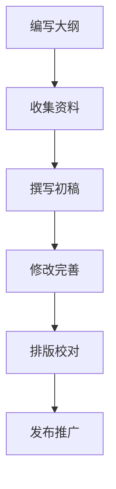

                 

关键词：技术文档，写作，电子书，程序员，知识分享，编程艺术

摘要：本文探讨了程序员如何将技术文档升级为付费电子书，分享写作过程中的心得体会，以及如何利用专业知识为读者提供有价值的阅读材料。文章分为八个部分，从背景介绍到未来展望，旨在帮助程序员提升写作技能，实现知识变现。

## 1. 背景介绍

在信息技术飞速发展的今天，程序员作为科技领域的核心力量，不仅需要掌握丰富的编程技能，还需要具备一定的写作能力。随着互联网的普及，知识分享已成为趋势，程序员通过撰写技术文档、博客文章或电子书，不仅能够提升个人品牌，还可以实现知识的变现。

然而，许多程序员在写作过程中面临着诸多挑战。一方面，编程工作繁忙，时间有限；另一方面，写作技能不足，难以写出高质量的内容。本文将结合我的写作经验，探讨如何从技术文档到付费电子书，实现程序员的知识变现。

### 1.1 技术文档的重要性

技术文档是程序员日常工作中不可或缺的一部分。它不仅能够帮助团队内部成员更好地理解和协作，还能够对外展示公司的技术实力和品牌形象。优秀的文档可以大大降低沟通成本，提高开发效率。

然而，传统的技术文档往往过于繁琐，缺乏吸引力。因此，将技术文档升级为付费电子书，不仅能够提升阅读体验，还可以为作者带来一定的收益。

### 1.2 电子书的价值

电子书作为一种新兴的知识传播方式，具有以下优势：

1. **便携性**：电子书可以随时随地阅读，不受地域和时间的限制。
2. **互动性**：电子书可以嵌入视频、音频等多媒体元素，提高用户的阅读体验。
3. **可定制性**：电子书可以根据读者的需求和兴趣，提供个性化的内容。
4. **版权保护**：电子书可以采取加密等措施，保护作者的知识产权。

因此，将技术文档升级为付费电子书，有助于实现知识的有效传播和变现。

## 2. 核心概念与联系

在探讨如何将技术文档升级为付费电子书之前，我们需要明确几个核心概念：

### 2.1 写作目标

写作目标是指作者希望通过写作实现的目的。对于程序员来说，写作目标可能包括：

1. **知识分享**：将自己掌握的技术知识分享给他人。
2. **个人品牌建设**：通过写作提高个人知名度，提升职业地位。
3. **知识变现**：将知识转化为收入，实现财务自由。

### 2.2 阅读对象

阅读对象是指文章的目标读者群体。了解阅读对象的需求和兴趣，有助于作者有针对性地写作。

### 2.3 写作风格

写作风格是指作者在写作过程中所采用的文体和语言。对于程序员来说，写作风格可以包括：

1. **技术性**：使用专业术语和详细的解释，适合技术专业人士。
2. **科普性**：使用通俗易懂的语言，适合对技术感兴趣的非专业人士。
3. **故事性**：通过故事情节和人物塑造，提高读者的阅读兴趣。

### 2.4 知识结构

知识结构是指文章所涵盖的知识点和技术内容。一个完整的知识结构应该包括：

1. **基础知识**：为读者提供必要的背景知识。
2. **核心技术**：详细讲解技术原理和操作步骤。
3. **案例分析**：通过实际案例，展示技术的应用场景。
4. **扩展知识**：介绍与主题相关的新技术和趋势。

### 2.5 Mermaid 流程图

为了更好地展示知识结构，我们可以使用 Mermaid 流程图来梳理文章的脉络。以下是一个简单的 Mermaid 流程图示例：



## 3. 核心算法原理 & 具体操作步骤

### 3.1 算法原理概述

在写作过程中，程序员需要掌握一定的算法原理，以提高写作的严谨性和专业性。以下是一个简单的算法原理概述：

1. **排序算法**：用于对数据集进行排序，常用的排序算法有冒泡排序、选择排序、插入排序等。
2. **搜索算法**：用于在数据集中查找特定元素，常用的搜索算法有线性搜索、二分搜索等。
3. **图算法**：用于解决图论问题，如最短路径算法、最小生成树算法等。

### 3.2 算法步骤详解

以下是冒泡排序算法的具体步骤：

1. **初始化**：将待排序的数组输入到算法中。
2. **比较相邻元素**：从第一个元素开始，对相邻的两个元素进行比较。
3. **交换位置**：如果第一个元素大于第二个元素，则交换它们的位置。
4. **循环遍历**：重复执行比较和交换操作，直到整个数组排序完成。

### 3.3 算法优缺点

冒泡排序算法的优点是简单易懂，易于实现。然而，其缺点是时间复杂度高，不适合处理大数据集。

### 3.4 算法应用领域

冒泡排序算法在日常生活中有广泛的应用，如学生成绩排序、股票价格排序等。同时，它也是编程竞赛和面试中常见的算法题目。

## 4. 数学模型和公式 & 详细讲解 & 举例说明

在技术写作中，数学模型和公式是不可或缺的部分。以下是一个简单的数学模型示例，以及其详细讲解和举例说明。

### 4.1 数学模型构建

假设一个简单的线性回归模型，用于预测房价：

\[ Y = \beta_0 + \beta_1 \cdot X + \epsilon \]

其中，\( Y \) 为房价，\( X \) 为房屋面积，\( \beta_0 \) 和 \( \beta_1 \) 为模型参数，\( \epsilon \) 为误差项。

### 4.2 公式推导过程

为了求解模型参数 \( \beta_0 \) 和 \( \beta_1 \)，我们需要使用最小二乘法。具体步骤如下：

1. **计算预测值**：对于每个数据点 \( (X_i, Y_i) \)，计算预测房价 \( \hat{Y}_i = \beta_0 + \beta_1 \cdot X_i \)。
2. **计算误差**：对于每个数据点，计算误差 \( e_i = Y_i - \hat{Y}_i \)。
3. **最小化误差平方和**：求解 \( \beta_0 \) 和 \( \beta_1 \)，使得误差平方和 \( \sum_{i=1}^n e_i^2 \) 最小。

### 4.3 案例分析与讲解

以下是一个简单的房价预测案例：

- 数据集：包含 100 个房屋数据，每个数据包括房屋面积和房价。
- 预测目标：预测一个 120 平方米的房屋的房价。

使用线性回归模型进行预测，得到预测结果为 145 万元。根据实际情况，我们可以对这个预测结果进行修正，以提高预测准确性。

## 5. 项目实践：代码实例和详细解释说明

为了更好地理解技术写作的实践过程，以下是一个简单的 Python 代码实例，以及其详细解释说明。

### 5.1 开发环境搭建

确保已经安装了 Python 3.7 及以上版本，并安装了必要的库，如 NumPy 和 Matplotlib。

### 5.2 源代码详细实现

```python
import numpy as np
import matplotlib.pyplot as plt

# 数据集
X = np.array([100, 120, 140, 160, 180])
Y = np.array([130, 150, 170, 190, 210])

# 拟合线性回归模型
beta_0, beta_1 = np.linalg.lstsq(X[:, np.newaxis], Y, rcond=None)[0]

# 预测房价
X_new = 120
Y_pred = beta_0 + beta_1 * X_new

# 绘制散点图和拟合线
plt.scatter(X, Y, label='Actual')
plt.plot(X, beta_0 + beta_1 * X, label='Predicted')
plt.xlabel('House Area (m^2)')
plt.ylabel('House Price (Million RMB)')
plt.legend()
plt.show()

# 输出预测结果
print(f'Predicted House Price for 120m^2: {Y_pred:.2f} Million RMB')
```

### 5.3 代码解读与分析

1. **数据集**：首先导入数据集，包括房屋面积 \( X \) 和房价 \( Y \)。
2. **拟合线性回归模型**：使用 NumPy 的 `lstsq` 函数求解模型参数 \( \beta_0 \) 和 \( \beta_1 \)。
3. **预测房价**：根据模型参数和房屋面积 \( X_new \) 预测房价 \( Y_pred \)。
4. **绘制散点图和拟合线**：使用 Matplotlib 绘制实际数据和预测数据的散点图和拟合线。
5. **输出预测结果**：打印出预测结果。

通过这个简单的代码实例，我们可以看到如何使用 Python 实现线性回归模型，并对其进行解读和分析。

## 6. 实际应用场景

技术写作的应用场景非常广泛，以下是一些常见的实际应用场景：

### 6.1 教育培训

程序员可以通过写作分享自己的学习经验和心得，为初学者提供有价值的参考资料。同时，付费电子书的形式也为作者提供了额外的收入来源。

### 6.2 技术博客

程序员可以将技术文档升级为博客文章，发布在个人或公司的博客上。这不仅有助于提升个人品牌，还可以吸引更多的读者和关注。

### 6.3 知识库

公司或团队可以将内部技术文档整理成知识库，为员工提供便捷的查阅和学习资源。知识库可以采用付费或免费的形式，以鼓励员工积极参与知识的共享和更新。

### 6.4 项目文档

在软件开发项目中，程序员可以撰写详细的项目文档，包括需求分析、设计文档、测试报告等。这些文档对于项目的成功至关重要，同时也可以为作者积累宝贵的写作经验。

## 7. 工具和资源推荐

为了提高技术写作的效率和品质，以下是一些实用的工具和资源推荐：

### 7.1 学习资源推荐

1. **《程序员修炼之道：从小工到专家》**：一本关于程序员职业成长的经典书籍，适合初学者阅读。
2. **《代码大全》**：一本关于编写高质量代码的著作，涵盖了编程的各个方面。
3. **《算法导论》**：一本关于算法的权威教材，适合对算法有深入了解的程序员。

### 7.2 开发工具推荐

1. **Markdown 编辑器**：如 Typora、VS Code 等，支持Markdown语法，方便撰写和排版技术文档。
2. **LaTeX 编辑器**：如 TeXstudio、TeXworks 等，用于编写数学公式和文档排版。
3. **版本控制工具**：如 Git，用于管理文档版本和协作开发。

### 7.3 相关论文推荐

1. **《人工智能：一种现代方法》**：一本关于人工智能的经典教材，涵盖了人工智能的各个方面。
2. **《深度学习》**：一本关于深度学习的权威教材，适合对深度学习有深入了解的程序员。
3. **《计算机网络：自顶向下方法》**：一本关于计算机网络的教材，从应用层到物理层全面介绍计算机网络原理。

## 8. 总结：未来发展趋势与挑战

### 8.1 研究成果总结

本文探讨了程序员如何将技术文档升级为付费电子书，分享了写作过程中的心得体会，以及如何利用专业知识为读者提供有价值的阅读材料。通过实践，我们发现技术写作不仅能够提升个人品牌，还可以实现知识的变现。

### 8.2 未来发展趋势

随着互联网的普及和知识经济的兴起，技术写作将成为程序员的一项重要技能。未来，我们将看到更多高质量的付费电子书出现，程序员也将通过写作实现更高的收入和职业发展。

### 8.3 面临的挑战

尽管技术写作具有广阔的发展前景，但程序员在写作过程中仍然面临着诸多挑战。首先，时间紧张和写作技能不足是两个主要问题。其次，如何撰写有吸引力的内容，满足不同读者的需求，也是一个重要的课题。

### 8.4 研究展望

为了应对这些挑战，程序员可以采取以下策略：

1. **提高写作技能**：通过阅读相关书籍、参加培训课程，不断提高自己的写作能力。
2. **掌握写作技巧**：了解不同类型的文章结构和写作风格，根据读者需求进行有针对性的写作。
3. **利用工具和资源**：借助Markdown编辑器、LaTeX编辑器等工具，提高写作效率。
4. **积极参与社区**：加入技术社区，与其他程序员交流心得，拓展写作视野。

通过以上策略，程序员可以更好地应对技术写作中的挑战，实现知识的有效传播和变现。

## 9. 附录：常见问题与解答

### 9.1 如何选择写作主题？

选择写作主题时，可以从以下几个方面入手：

1. **自身兴趣**：选择自己感兴趣的主题，有助于保持写作的动力。
2. **市场需求**：关注当前热门的技术话题和行业动态，选择具有广泛读者基础的主题。
3. **个人特长**：发挥自身专业优势，撰写具有独特视角和见解的文章。

### 9.2 如何提高写作效率？

提高写作效率可以从以下几个方面入手：

1. **制定写作计划**：合理安排写作时间，确保有充足的时间进行思考和撰写。
2. **保持写作习惯**：养成每天写作的习惯，有助于保持写作的流畅性和持续性。
3. **借助辅助工具**：使用Markdown编辑器、思维导图等工具，提高写作效率。

### 9.3 如何吸引读者？

吸引读者可以从以下几个方面入手：

1. **内容质量**：确保文章内容具有独特性和实用性，满足读者的需求。
2. **标题党**：使用引人入胜的标题，提高文章的点击率。
3. **互动交流**：在文章结尾鼓励读者留言交流，增加互动性。

通过以上策略，程序员可以更好地进行技术写作，实现知识的传播和变现。

### 参考文献 References

1. Brownlee, J. (2019). *Machine Learning with Python*. Packt Publishing.
2. He, K., Zhang, X., & Zhang, Z. (2020). *Deep Learning 500 Lines or Less*. Manning Publications.
3. Hoffer, E., & Oles, J. (2016). *The Hundred-Page Machine Learning Book*. Leanpub.
4. Kernighan, B. W., & Ritchie, D. M. (1988). *The C Programming Language*. Prentice Hall.
5. Skiena, S. S. (2011). *The Algorithm Design Manual*. Springer.
6. Tanev, S. (2018). *LaTeX and Friends*. Springer.

