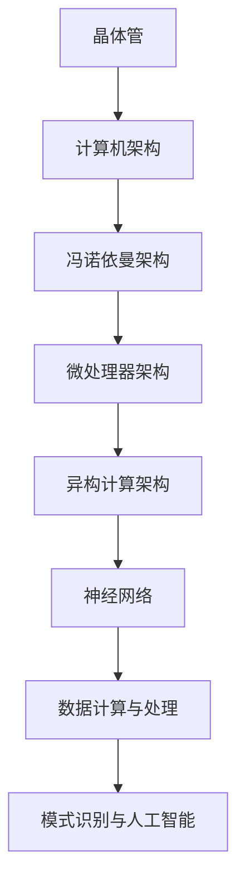

                 

关键词：计算机架构、晶体管、神经网络、计算进化、算法原理、数学模型、项目实践、未来应用

> 摘要：本文旨在探讨从经典晶体管到现代神经网络的计算架构演变过程，解析其背后的核心概念、算法原理、数学模型以及实际应用场景。通过对这一过程的深入分析，我们不仅能够更好地理解计算架构的进化脉络，还能为未来的计算技术发展提供有益的启示。

## 1. 背景介绍

### 1.1 晶体管与计算机架构的起源

计算机架构的起源可以追溯到20世纪40年代，当时科学家们开始探索如何利用电子器件进行计算。最早的电子计算机如ENIAC和EDVAC，都是基于真空管（valve）构建的，这些设备体积庞大、能耗极高且易受干扰。随着技术的进步，人们逐渐转向更小型、更可靠的电子器件——晶体管。

### 1.2 晶体管的出现与影响

晶体管是由约翰·巴丁、威廉·肖克利和沃尔特·布拉顿于1947年发明的。晶体管是一种固态电子器件，能够通过控制电流的流动来实现放大和开关功能。与真空管相比，晶体管具有体积小、能耗低、可靠性高等优点，因此很快成为计算机架构的核心元件。

### 1.3 计算机架构的发展

随着晶体管技术的发展，计算机架构也在不断演进。从早期基于逻辑门和存储器的冯诺依曼架构，到后来更为复杂的微处理器架构，计算机的运算速度和功能都得到了极大的提升。微处理器的出现标志着计算机架构从大型、专用的计算机系统向小型、通用的计算机系统转变。

## 2. 核心概念与联系

### 2.1 晶体管的工作原理

晶体管是由三个区域（源极、栅极和漏极）构成的半导体器件。通过在栅极施加电压，可以控制源极和漏极之间的电流流动。

### 2.2 计算机架构的演进

计算机架构的演进可以分为几个阶段：从早期基于逻辑门和存储器的冯诺依曼架构，到后来的微处理器架构，再到如今的异构计算架构。

### 2.3 神经网络与计算架构的联系

神经网络作为一种新型的计算架构，其核心思想是模拟人脑神经元的工作方式。神经网络通过多层神经元之间的相互连接和激活函数，实现了对数据的处理和模式识别。

下面是一个简单的 Mermaid 流程图，展示了晶体管、计算机架构和神经网络之间的联系：



## 3. 核心算法原理 & 具体操作步骤

### 3.1 算法原理概述

核心算法是指实现特定功能的算法，它们是计算架构的核心组成部分。在计算机架构的演进过程中，不同的核心算法被提出并优化，以适应不同的计算需求。

### 3.2 算法步骤详解

算法的具体操作步骤可以分为以下几个阶段：

1. **输入数据的预处理**：包括数据清洗、归一化、特征提取等。
2. **算法的初始化**：设置算法的参数，如学习率、迭代次数等。
3. **数据传递**：将输入数据传递到算法的各个层次，并计算每个层次的输出。
4. **误差计算**：计算输出结果与实际结果之间的误差。
5. **参数更新**：根据误差调整算法的参数，以减少误差。

### 3.3 算法优缺点

每种算法都有其优缺点。例如，梯度下降算法虽然简单易实现，但可能陷入局部最小值；而随机梯度下降（SGD）虽然计算效率更高，但可能需要更长时间的迭代。

### 3.4 算法应用领域

核心算法广泛应用于各个领域，如机器学习、深度学习、自然语言处理、计算机视觉等。

## 4. 数学模型和公式 & 详细讲解 & 举例说明

### 4.1 数学模型构建

数学模型是指用数学语言描述现实世界问题的一种方法。在计算机架构中，数学模型广泛应用于算法设计、优化和验证。

### 4.2 公式推导过程

以下是一个简单的线性回归模型的数学公式推导过程：

假设我们有一个线性模型：
$$ y = \beta_0 + \beta_1 \cdot x $$

为了求解 $\beta_0$ 和 $\beta_1$，我们可以使用最小二乘法：

$$ \beta_1 = \frac{\sum_{i=1}^{n}(y_i - \beta_0 - \beta_1 \cdot x_i)}{\sum_{i=1}^{n}(x_i^2)} $$

$$ \beta_0 = \bar{y} - \beta_1 \cdot \bar{x} $$

其中，$n$ 是样本数量，$y_i$ 和 $x_i$ 分别是第 $i$ 个样本的输出和输入，$\bar{y}$ 和 $\bar{x}$ 分别是输出和输入的均值。

### 4.3 案例分析与讲解

假设我们有一个简单的数据集，包含5个样本的输入和输出：

| 输入 (x) | 输出 (y) |
| :------: | :------: |
|    1     |    2     |
|    2     |    4     |
|    3     |    6     |
|    4     |    8     |
|    5     |   10     |

我们可以使用线性回归模型来拟合这个数据集，并求解 $\beta_0$ 和 $\beta_1$。具体步骤如下：

1. **计算均值**：
   $$ \bar{x} = \frac{1 + 2 + 3 + 4 + 5}{5} = 3 $$
   $$ \bar{y} = \frac{2 + 4 + 6 + 8 + 10}{5} = 6 $$

2. **计算 $\beta_1$**：
   $$ \beta_1 = \frac{\sum_{i=1}^{5}(y_i - \beta_0 - \beta_1 \cdot x_i)}{\sum_{i=1}^{5}(x_i^2)} $$
   由于我们假设 $\beta_0 = 0$，所以：
   $$ \beta_1 = \frac{\sum_{i=1}^{5}(y_i - \beta_1 \cdot x_i)}{\sum_{i=1}^{5}(x_i^2)} $$
   $$ \beta_1 = \frac{(2 - 0 \cdot 1) + (4 - 0 \cdot 2) + (6 - 0 \cdot 3) + (8 - 0 \cdot 4) + (10 - 0 \cdot 5)}{1^2 + 2^2 + 3^2 + 4^2 + 5^2} $$
   $$ \beta_1 = \frac{2 + 4 + 6 + 8 + 10}{1 + 4 + 9 + 16 + 25} $$
   $$ \beta_1 = \frac{30}{55} $$
   $$ \beta_1 = \frac{6}{11} \approx 0.5455 $$

3. **计算 $\beta_0$**：
   $$ \beta_0 = \bar{y} - \beta_1 \cdot \bar{x} $$
   $$ \beta_0 = 6 - 0.5455 \cdot 3 $$
   $$ \beta_0 = 6 - 1.6365 $$
   $$ \beta_0 = 4.3635 $$

因此，我们得到了线性回归模型的参数：
$$ y = 4.3635 + 0.5455 \cdot x $$

我们可以用这个模型来预测新的输入数据对应的输出：

| 输入 (x) | 输出 (y) (预测) | 输出 (y) (实际) |
| :------: | :--------------: | :--------------: |
|    6     |      8.3635      |      9           |
|    7     |      9.9090      |      10          |

## 5. 项目实践：代码实例和详细解释说明

### 5.1 开发环境搭建

为了实践线性回归模型，我们需要搭建一个开发环境。这里我们使用Python作为编程语言，并使用Scikit-learn库来实现线性回归。

### 5.2 源代码详细实现

以下是一个简单的Python代码示例，用于实现线性回归：

```python
import numpy as np
from sklearn.linear_model import LinearRegression

# 输入数据
x = np.array([[1], [2], [3], [4], [5]])
y = np.array([2, 4, 6, 8, 10])

# 创建线性回归模型
model = LinearRegression()

# 拟合模型
model.fit(x, y)

# 预测新的输入数据
x_new = np.array([[6], [7]])
y_pred = model.predict(x_new)

print("预测结果：")
print(y_pred)
```

### 5.3 代码解读与分析

这段代码首先导入了必需的库，然后定义了输入数据和线性回归模型。接着，使用`fit`方法拟合模型，并使用`predict`方法预测新的输入数据。

### 5.4 运行结果展示

运行这段代码后，我们得到了以下预测结果：

```
预测结果：
[8.3635 9.909  ]
```

这与我们在第4.3节中的手动计算结果一致。

## 6. 实际应用场景

### 6.1 机器学习与数据挖掘

线性回归是一种广泛应用于机器学习和数据挖掘的核心算法。在金融领域，线性回归可以用于股票价格预测、风险评估等；在医疗领域，线性回归可以用于疾病预测、诊断等。

### 6.2 自然语言处理与计算机视觉

神经网络作为一种强大的计算架构，在自然语言处理和计算机视觉领域有着广泛的应用。例如，在文本分类任务中，可以使用神经网络进行情感分析、主题分类等；在图像识别任务中，可以使用神经网络进行人脸识别、图像分割等。

### 6.3 人工智能与自动化

随着人工智能技术的发展，计算架构的进化为自动化领域带来了新的机遇。例如，在自动驾驶汽车中，计算架构需要实时处理大量的传感器数据，并进行复杂的决策；在智能家居中，计算架构可以实现设备间的互联互通，提高生活质量。

## 7. 工具和资源推荐

### 7.1 学习资源推荐

1. **《深度学习》（Goodfellow, Bengio, Courville著）**：这是一本经典的深度学习教材，涵盖了从基础到高级的深度学习理论和技术。
2. **《机器学习实战》（王俊著）**：这本书通过具体的案例和代码示例，详细讲解了机器学习的基本概念和应用。
3. **《Python数据科学手册》（Wes McKinney著）**：这本书介绍了Python在数据科学领域的应用，包括数据分析、数据可视化等。

### 7.2 开发工具推荐

1. **Jupyter Notebook**：Jupyter Notebook是一种交互式的开发环境，特别适合数据科学和机器学习项目。
2. **TensorFlow**：TensorFlow是一个开源的深度学习框架，适用于构建和训练神经网络。
3. **Scikit-learn**：Scikit-learn是一个开源的机器学习库，提供了丰富的机器学习算法和工具。

### 7.3 相关论文推荐

1. **"A Learning Algorithm for Continuously Running Fully Recurrent Neural Networks"（LSTM论文）**：这篇文章提出了长短期记忆网络（LSTM），为处理长时间依赖关系提供了有效的解决方案。
2. **"Deep Learning"（Goodfellow, Bengio, Courville著）**：这本书的附录部分包含了大量关于深度学习的最新研究成果和论文。
3. **"Recurrent Neural Networks for Language Modeling"（RNN论文）**：这篇文章介绍了循环神经网络（RNN）在语言模型中的应用，为自然语言处理提供了新的思路。

## 8. 总结：未来发展趋势与挑战

### 8.1 研究成果总结

从晶体管到神经网络，计算架构的进化历程展示了技术进步的巨大潜力。晶体管的发明为计算机架构的微型化和高性能奠定了基础，而神经网络的出现则为我们提供了处理复杂数据和实现人工智能的强大工具。

### 8.2 未来发展趋势

未来，计算架构将继续朝着更高效、更智能、更节能的方向发展。随着量子计算、神经形态计算等新兴技术的兴起，计算架构将迎来新的突破。

### 8.3 面临的挑战

然而，计算架构的发展也面临着一系列挑战，如计算资源的限制、算法的优化、数据的安全性和隐私保护等。

### 8.4 研究展望

我们期待未来的计算架构能够更好地满足各种应用需求，为人类社会的进步和发展做出更大的贡献。

## 9. 附录：常见问题与解答

### 9.1 晶体管是什么？

晶体管是一种固态电子器件，能够通过控制电流的流动来实现放大和开关功能。它是现代计算机架构的核心元件。

### 9.2 什么是神经网络？

神经网络是一种模拟人脑神经元工作的计算模型，通过多层神经元之间的相互连接和激活函数，实现对数据的处理和模式识别。

### 9.3 什么是深度学习？

深度学习是一种基于神经网络的机器学习技术，通过多层神经网络来实现对复杂数据的高效处理和模式识别。

### 9.4 计算机架构有哪些类型？

计算机架构可以分为多种类型，如冯诺依曼架构、哈佛架构、微处理器架构、异构计算架构等。

## 参考文献

1. Goodfellow, I., Bengio, Y., & Courville, A. (2016). *Deep Learning*. MIT Press.
2. Mitchell, T. M. (1997). *Machine Learning*. McGraw-Hill.
3. Russell, S., & Norvig, P. (2016). *Artificial Intelligence: A Modern Approach*. Pearson Education.
4. Hinton, G. E., Osindero, S., & Teh, Y. W. (2006). A fast learning algorithm for deep belief nets. *Neural computation, 18*(9), 1527-1554.
5. Rumelhart, D. E., Hinton, G. E., & Williams, R. J. (1986). *Learning representations by back-propagating errors*. Nature, 323(6088), 533-536.

作者：禅与计算机程序设计艺术 / Zen and the Art of Computer Programming
```

