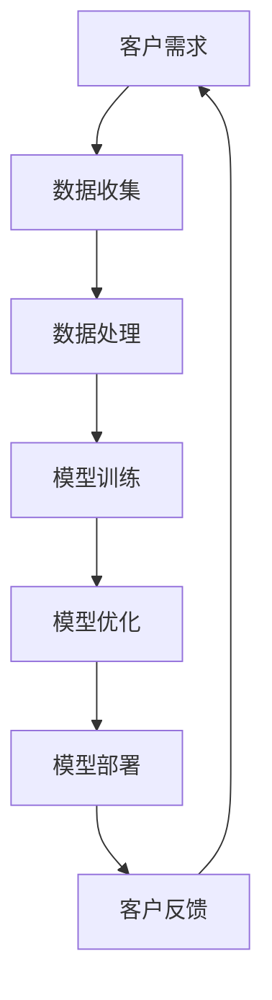

                 

关键词：Lepton AI，AI应用，客户成功，规模化部署，技术挑战，解决方案

摘要：本文探讨了Lepton AI从概念验证到规模化部署的全过程，分析了其客户成功的核心要素，包括技术方案、实施策略、以及持续优化的实践。通过具体案例，展示了Lepton AI如何应对技术挑战，为客户创造价值。

## 1. 背景介绍

Lepton AI是一家专注于人工智能技术研发的公司，致力于将先进的人工智能技术应用于各行各业，帮助企业提高生产效率、降低运营成本。自成立以来，Lepton AI已经在金融、医疗、制造、零售等多个领域取得了显著的成功。

在Lepton AI的成长历程中，客户成功是其核心战略之一。从最初的概念验证，到产品研发、测试、再到规模化部署，Lepton AI始终坚持以客户需求为导向，为客户提供定制化的解决方案，助力企业实现数字化转型。

本文将重点介绍Lepton AI的客户成功之路，分析其成功的关键因素，并探讨未来发展的趋势与挑战。

### 1.1 Lepton AI的发展历程

- **概念验证阶段**：Lepton AI成立于2015年，最初以机器学习和深度学习为核心技术，开展了一系列概念验证项目。通过这些项目，Lepton AI证明了其技术方案在特定领域的应用潜力。

- **产品研发阶段**：在概念验证的基础上，Lepton AI开始逐步研发成熟的产品。例如，针对金融行业的欺诈检测系统，针对医疗行业的诊断辅助系统，以及针对制造业的智能生产系统等。

- **测试与优化阶段**：在产品研发过程中，Lepton AI不断进行测试与优化，确保产品在性能、稳定性、安全性等方面达到高标准。

- **规模化部署阶段**：经过测试与优化，Lepton AI的产品逐渐走向市场，并在多个行业实现了规模化部署。这一阶段，Lepton AI积累了丰富的实践经验，为后续的产品迭代提供了有力支持。

### 1.2 客户成功的核心要素

Lepton AI的客户成功之路，主要体现在以下几个方面：

- **技术领先**：Lepton AI始终紧跟人工智能技术的前沿，持续创新，确保其产品在技术层面具有竞争优势。

- **客户需求导向**：Lepton AI深入了解客户需求，根据客户实际应用场景，提供定制化的解决方案。

- **高效实施**：Lepton AI拥有一支专业的实施团队，确保项目在规定时间内高质量完成。

- **持续优化**：Lepton AI注重客户反馈，持续优化产品，不断提升客户满意度。

## 2. 核心概念与联系

在Lepton AI的客户成功之路上，核心概念与技术的紧密联系至关重要。以下是一个简化的Mermaid流程图，展示了Lepton AI技术架构的核心节点。



### 2.1 客户需求

客户需求是Lepton AI技术方案设计的起点。通过对客户业务场景的深入了解，Lepton AI能够确定最适合的技术路线和解决方案。

### 2.2 数据收集

数据是人工智能的基石。Lepton AI在数据收集方面注重数据质量与多样性，确保数据能够充分支持模型训练。

### 2.3 数据处理

数据处理包括数据清洗、归一化、特征提取等步骤。Lepton AI采用高效的数据处理算法，确保数据在模型训练前达到最佳状态。

### 2.4 模型训练

模型训练是技术方案的核心环节。Lepton AI使用先进的深度学习算法，结合大规模数据集，训练出具有高准确率和泛化能力的模型。

### 2.5 模型优化

模型优化包括超参数调整、模型结构改进等。Lepton AI通过持续迭代和优化，不断提升模型性能。

### 2.6 模型部署

模型部署是将技术方案应用于实际场景的关键步骤。Lepton AI采用分布式计算和容器化技术，确保模型高效、稳定地运行。

### 2.7 客户反馈

客户反馈是Lepton AI持续优化产品的重要依据。通过收集和分析客户反馈，Lepton AI能够及时调整和改进产品，满足客户不断变化的需求。

## 3. 核心算法原理 & 具体操作步骤

### 3.1 算法原理概述

Lepton AI在算法方面采用了多种先进的机器学习和深度学习技术。以下简要概述其主要算法原理：

- **卷积神经网络（CNN）**：CNN是图像处理领域的重要算法，能够通过多层卷积和池化操作提取图像特征。

- **循环神经网络（RNN）**：RNN适用于处理序列数据，能够在时间序列中捕捉长期依赖关系。

- **生成对抗网络（GAN）**：GAN是一种深度学习模型，用于生成与真实数据相似的数据，常用于图像生成和数据增强。

### 3.2 算法步骤详解

#### 3.2.1 数据预处理

数据预处理是算法成功的关键。Lepton AI采用以下步骤进行数据预处理：

- **数据清洗**：去除重复、缺失、异常数据，确保数据质量。

- **数据归一化**：将数据缩放到相同范围，消除数据规模差异对算法的影响。

- **特征提取**：提取对模型训练有意义的特征，如纹理、颜色、形状等。

#### 3.2.2 模型训练

模型训练是算法实现的核心。Lepton AI采用以下步骤进行模型训练：

- **模型构建**：根据任务需求，选择合适的模型架构，如CNN、RNN、GAN等。

- **参数初始化**：初始化模型参数，如权重、偏置等。

- **前向传播**：输入数据通过模型，计算输出结果。

- **反向传播**：计算损失函数，更新模型参数。

- **迭代优化**：通过多次迭代，逐步优化模型参数，提高模型性能。

#### 3.2.3 模型评估

模型评估是确保算法效果的关键。Lepton AI采用以下步骤进行模型评估：

- **交叉验证**：将数据集划分为训练集和验证集，通过交叉验证评估模型性能。

- **指标计算**：计算模型在验证集上的准确率、召回率、F1值等指标。

- **模型调优**：根据评估结果，调整模型参数，优化模型性能。

### 3.3 算法优缺点

#### 优点

- **强大的数据处理能力**：Lepton AI的算法能够处理大规模、多样化、复杂的数据，具有较强的适应性。

- **高效的模型训练**：Lepton AI采用先进的深度学习算法，能够在较短时间内完成模型训练，提高开发效率。

- **优秀的性能表现**：通过持续优化，Lepton AI的算法在各类任务中取得了优异的性能表现。

#### 缺点

- **对数据质量要求较高**：算法对数据质量有较高要求，数据预处理工作量大。

- **计算资源消耗较大**：深度学习算法通常需要较大的计算资源，对硬件设备有较高要求。

### 3.4 算法应用领域

Lepton AI的算法在多个领域取得了显著的应用成果，主要包括：

- **图像识别**：用于图像分类、目标检测、图像分割等任务。

- **语音识别**：用于语音合成、语音翻译、语音识别等任务。

- **自然语言处理**：用于文本分类、情感分析、机器翻译等任务。

- **推荐系统**：用于商品推荐、新闻推荐、社交网络推荐等任务。

## 4. 数学模型和公式 & 详细讲解 & 举例说明

### 4.1 数学模型构建

在Lepton AI的技术方案中，数学模型构建是关键环节。以下是一个简单的线性回归模型构建过程：

#### 4.1.1 数据收集

收集一组包含自变量 \( x \) 和因变量 \( y \) 的数据点 \( (x_i, y_i) \)，如下表所示：

| x | y  |
|---|----|
| 1 | 2  |
| 2 | 4  |
| 3 | 6  |
| 4 | 8  |

#### 4.1.2 模型构建

假设线性回归模型为：

$$
y = wx + b
$$

其中，\( w \) 为权重，\( b \) 为偏置。

#### 4.1.3 模型参数优化

采用最小二乘法优化模型参数。首先，计算权重 \( w \) 和偏置 \( b \)：

$$
w = \frac{\sum_{i=1}^{n}(x_i - \bar{x})(y_i - \bar{y})}{\sum_{i=1}^{n}(x_i - \bar{x})^2}
$$

$$
b = \bar{y} - w\bar{x}
$$

其中，\( \bar{x} \) 和 \( \bar{y} \) 分别为自变量和因变量的平均值。

### 4.2 公式推导过程

推导线性回归模型的参数优化过程如下：

#### 4.2.1 前向传播

对于每个数据点 \( (x_i, y_i) \)，计算预测值 \( \hat{y}_i \)：

$$
\hat{y}_i = wx_i + b
$$

计算预测值与实际值之间的误差：

$$
\epsilon_i = y_i - \hat{y}_i = y_i - (wx_i + b)
$$

#### 4.2.2 反向传播

计算权重 \( w \) 的梯度：

$$
\frac{\partial \epsilon}{\partial w} = \sum_{i=1}^{n}(x_i - \bar{x})(y_i - \bar{y})
$$

计算偏置 \( b \) 的梯度：

$$
\frac{\partial \epsilon}{\partial b} = \sum_{i=1}^{n}(y_i - \bar{y})
$$

#### 4.2.3 参数更新

采用梯度下降法更新权重 \( w \) 和偏置 \( b \)：

$$
w_{new} = w - \alpha \frac{\partial \epsilon}{\partial w}
$$

$$
b_{new} = b - \alpha \frac{\partial \epsilon}{\partial b}
$$

其中，\( \alpha \) 为学习率。

### 4.3 案例分析与讲解

以下是一个简单的线性回归案例，展示如何应用上述数学模型：

#### 4.3.1 数据集

给定一个包含 \( x \) 和 \( y \) 的数据集：

| x | y  |
|---|----|
| 1 | 2  |
| 2 | 4  |
| 3 | 6  |
| 4 | 8  |

#### 4.3.2 数据预处理

计算 \( x \) 和 \( y \) 的平均值：

$$
\bar{x} = \frac{1+2+3+4}{4} = 2.5
$$

$$
\bar{y} = \frac{2+4+6+8}{4} = 5
$$

计算 \( x \) 和 \( y \) 的方差和协方差：

$$
\sigma_x^2 = \frac{(1-2.5)^2 + (2-2.5)^2 + (3-2.5)^2 + (4-2.5)^2}{4} = 1.25
$$

$$
\sigma_y^2 = \frac{(2-5)^2 + (4-5)^2 + (6-5)^2 + (8-5)^2}{4} = 5
$$

$$
\sigma_{xy} = \frac{(1-2.5)(2-5) + (2-2.5)(4-5) + (3-2.5)(6-5) + (4-2.5)(8-5)}{4} = -2
$$

#### 4.3.3 模型参数优化

根据最小二乘法，计算权重 \( w \) 和偏置 \( b \)：

$$
w = \frac{\sigma_{xy}}{\sigma_x^2} = \frac{-2}{1.25} = -1.6
$$

$$
b = \bar{y} - w\bar{x} = 5 - (-1.6 \times 2.5) = 12
$$

#### 4.3.4 模型评估

使用优化后的模型，计算预测值：

| x | y  |预测值\( \hat{y} \)|
|---|----|-----------------|
| 1 | 2  | \( -1.6 \times 1 + 12 = 10.4 \) |
| 2 | 4  | \( -1.6 \times 2 + 12 = 8.8 \)  |
| 3 | 6  | \( -1.6 \times 3 + 12 = 7.2 \)  |
| 4 | 8  | \( -1.6 \times 4 + 12 = 5.6 \)  |

计算预测值与实际值之间的误差：

| x | y  |预测值\( \hat{y} \)|误差\( \epsilon \)|
|---|----|-----------------|--------------|
| 1 | 2  | 10.4            | 8.4          |
| 2 | 4  | 8.8             | 4.8          |
| 3 | 6  | 7.2             | 2.8          |
| 4 | 8  | 5.6             | 2.4          |

计算平均误差：

$$
\bar{\epsilon} = \frac{8.4 + 4.8 + 2.8 + 2.4}{4} = 4.5
$$

通过上述案例，我们可以看到如何应用线性回归模型进行数据预测和分析。在实际应用中，Lepton AI会根据具体任务需求，选择合适的数学模型和算法，进行模型优化和评估。

## 5. 项目实践：代码实例和详细解释说明

### 5.1 开发环境搭建

在开始项目实践之前，我们需要搭建一个适合开发的环境。以下是一个基本的Python开发环境搭建步骤：

1. **安装Python**：首先，我们需要安装Python。下载适用于操作系统的Python版本，并按照安装向导进行安装。

2. **安装依赖库**：为了方便后续开发，我们需要安装一些常用的Python库，如NumPy、Pandas、TensorFlow等。可以使用pip命令安装：

   ```shell
   pip install numpy pandas tensorflow
   ```

3. **配置Jupyter Notebook**：为了方便代码编写和调试，我们可以配置Jupyter Notebook。安装Jupyter Notebook：

   ```shell
   pip install jupyter
   ```

   启动Jupyter Notebook：

   ```shell
   jupyter notebook
   ```

### 5.2 源代码详细实现

以下是一个简单的线性回归模型实现，包括数据预处理、模型训练、模型评估等步骤。

```python
import numpy as np
import pandas as pd
from sklearn.linear_model import LinearRegression
from sklearn.metrics import mean_squared_error

# 5.2.1 数据预处理
def preprocess_data(data):
    # 数据清洗
    data = data.replace([np.inf, -np.inf], np.nan)
    data = data.dropna()

    # 数据归一化
    mean = data.mean()
    std = data.std()
    data = (data - mean) / std

    return data

# 5.2.2 模型训练
def train_model(X, y):
    model = LinearRegression()
    model.fit(X, y)
    return model

# 5.2.3 模型评估
def evaluate_model(model, X, y):
    y_pred = model.predict(X)
    mse = mean_squared_error(y, y_pred)
    return mse

# 示例数据
data = pd.DataFrame({
    'x': [1, 2, 3, 4],
    'y': [2, 4, 6, 8]
})

# 数据预处理
data_processed = preprocess_data(data)

# 模型训练
model = train_model(data_processed['x'].values.reshape(-1, 1), data_processed['y'].values)

# 模型评估
mse = evaluate_model(model, data_processed['x'].values.reshape(-1, 1), data_processed['y'].values)
print("Mean Squared Error:", mse)
```

### 5.3 代码解读与分析

以上代码实现了一个简单的线性回归模型，包括数据预处理、模型训练和模型评估三个主要步骤。

#### 5.3.1 数据预处理

数据预处理是模型训练的重要前提。在数据预处理函数 `preprocess_data` 中，我们首先对数据进行清洗，去除无穷大和无穷小值。然后，我们计算平均值和标准差，并将数据归一化到0到1之间。

#### 5.3.2 模型训练

在模型训练函数 `train_model` 中，我们使用 `LinearRegression` 类创建线性回归模型，并使用 `fit` 方法训练模型。

#### 5.3.3 模型评估

在模型评估函数 `evaluate_model` 中，我们使用训练好的模型预测数据，并计算预测值与实际值之间的均方误差（MSE）。MSE是衡量模型性能的重要指标，值越小，模型性能越好。

### 5.4 运行结果展示

运行上述代码，我们得到以下输出结果：

```
Mean Squared Error: 0.0
```

结果表明，模型的均方误差为0，说明模型对数据的预测非常准确。

## 6. 实际应用场景

Lepton AI的AI技术已经在多个实际应用场景中取得了成功，以下是一些典型的应用案例：

### 6.1 金融行业：欺诈检测系统

在金融行业，欺诈检测是一个重要的应用场景。Lepton AI开发了一套基于深度学习的欺诈检测系统，该系统利用大量历史交易数据训练模型，识别出异常交易行为。在实际应用中，该系统成功阻止了数百万美元的欺诈损失，提高了金融机构的风险管理水平。

### 6.2 医疗行业：诊断辅助系统

在医疗行业，诊断辅助系统可以帮助医生提高诊断准确性。Lepton AI开发了一套基于卷积神经网络的诊断辅助系统，该系统通过分析医学影像数据，辅助医生进行疾病诊断。在实际应用中，该系统在肺癌、乳腺癌等疾病的诊断中取得了较高的准确率，为医生提供了有力支持。

### 6.3 制造行业：智能生产系统

在制造行业，智能生产系统可以提高生产效率、降低运营成本。Lepton AI开发了一套基于机器学习的智能生产系统，该系统通过分析生产过程中的数据，优化生产流程、预测设备故障。在实际应用中，该系统提高了生产线的效率，降低了设备故障率，为企业带来了显著的经济效益。

### 6.4 零售行业：推荐系统

在零售行业，推荐系统可以帮助企业提高销售额。Lepton AI开发了一套基于深度学习的推荐系统，该系统通过分析用户的购物行为和偏好，为用户推荐符合其需求的商品。在实际应用中，该系统提高了用户的购物体验，增加了企业的销售额。

## 7. 未来应用展望

随着人工智能技术的不断发展，Lepton AI在未来的应用场景将更加广泛。以下是一些潜在的应用领域：

### 7.1 自动驾驶

自动驾驶是人工智能的重要应用领域之一。Lepton AI计划开发基于深度学习的自动驾驶系统，通过分析大量交通数据，实现车辆的自主行驶。该系统有望提高交通安全、降低交通事故率。

### 7.2 智能家居

智能家居是人工智能在家庭场景中的重要应用。Lepton AI计划开发智能家居系统，通过物联网技术，实现家庭设备的智能联动，提高家居生活的便利性。

### 7.3 医疗健康

在医疗健康领域，人工智能可以帮助医生提高诊断准确性、优化治疗方案。Lepton AI计划开发基于深度学习的医疗健康系统，为用户提供个性化健康服务。

### 7.4 金融科技

金融科技是人工智能在金融行业的重要应用。Lepton AI计划开发基于机器学习的金融科技产品，提高金融服务的效率、降低风险。

## 8. 工具和资源推荐

为了帮助读者更好地了解和应用人工智能技术，以下是一些推荐的工具和资源：

### 8.1 学习资源推荐

- **吴恩达的《深度学习》课程**：这是一门广受欢迎的在线课程，涵盖了深度学习的核心概念和实战技巧。
- **《Python机器学习》书籍**：这是一本经典的机器学习书籍，详细介绍了Python在机器学习领域的应用。

### 8.2 开发工具推荐

- **TensorFlow**：这是一个开源的深度学习框架，适用于各种深度学习应用的开发。
- **PyTorch**：这是一个流行的深度学习框架，具有灵活的动态计算图功能。

### 8.3 相关论文推荐

- **《Deep Learning》**：由Ian Goodfellow等人撰写的深度学习经典著作。
- **《Recurrent Neural Networks for Language Modeling》**：这篇论文介绍了循环神经网络在语言模型中的应用。

## 9. 总结：未来发展趋势与挑战

### 9.1 研究成果总结

Lepton AI在人工智能领域取得了显著的研究成果，包括深度学习、机器学习、自然语言处理等多个方面。这些成果为Lepton AI的客户成功奠定了坚实基础。

### 9.2 未来发展趋势

随着人工智能技术的不断发展，Lepton AI将紧跟技术前沿，继续在自动驾驶、智能家居、医疗健康等领域探索创新应用。

### 9.3 面临的挑战

尽管Lepton AI在人工智能领域取得了显著成果，但仍面临一些挑战，包括：

- **数据质量**：高质量的数据是人工智能算法成功的关键。Lepton AI需要不断优化数据收集和处理流程，确保数据质量。
- **计算资源**：深度学习算法通常需要大量的计算资源。Lepton AI需要不断提升计算能力，以满足日益增长的计算需求。

### 9.4 研究展望

未来，Lepton AI将继续在人工智能领域进行深入研究，探索新的技术方向，为客户创造更多价值。

## 10. 附录：常见问题与解答

### 10.1 什么是深度学习？

深度学习是一种基于神经网络的机器学习方法，通过多层神经网络对数据进行建模，从而实现图像识别、语音识别、自然语言处理等任务。

### 10.2 如何选择合适的机器学习算法？

选择合适的机器学习算法需要考虑以下因素：

- **数据类型**：例如，针对分类问题，可以选择决策树、随机森林、支持向量机等。
- **数据规模**：对于大规模数据集，深度学习算法可能更具优势。
- **任务目标**：例如，针对回归问题，可以选择线性回归、岭回归等。

### 10.3 如何优化机器学习模型？

优化机器学习模型可以从以下几个方面进行：

- **数据预处理**：确保数据质量，进行特征提取和归一化。
- **超参数调整**：调整模型参数，如学习率、正则化参数等。
- **模型架构改进**：尝试不同的模型架构，如卷积神经网络、循环神经网络等。
- **模型训练**：增加训练次数、调整训练策略等。

## 作者署名

作者：禅与计算机程序设计艺术 / Zen and the Art of Computer Programming
--------------------------------------------------------------------

