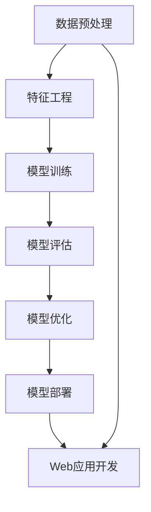

                 

在当今快速发展的技术时代，人工智能（AI）已经成为推动创新和业务增长的关键动力。然而，将AI模型从理论阶段转化为可用的产品和服务，面临着诸多挑战。本文旨在探讨如何从模型构建到产品化的整个过程中，有效地部署AI模型并开发Web应用，以便实现AI的商业化落地。

> **关键词：** AI模型部署，Web应用开发，模型转化，商业化落地，技术实现

> **摘要：** 本文首先介绍了AI模型部署的重要性和背景，随后详细探讨了模型转化过程中涉及的算法原理、数学模型构建以及具体操作步骤。接着，通过实际项目实例，展示了如何进行代码实现和调试，最后对AI模型在现实世界的应用场景和未来展望进行了深入分析。

## 1. 背景介绍

随着大数据和计算能力的提升，人工智能从理论走向了实际应用。AI模型在图像识别、自然语言处理、推荐系统等领域取得了显著成果。然而，这些模型通常只能在特定的环境下运行，如何将它们转化为可在生产环境中部署的产品，成为了一个亟待解决的问题。

AI模型的部署不仅仅是技术问题，它还涉及到业务需求、用户体验和可扩展性等多个方面。传统的软件开发流程已经无法满足AI模型部署的要求，因此，一种新的开发模式——模型驱动开发（Model-Driven Development, MDD）应运而生。

MDD强调将AI模型与业务逻辑紧密结合，通过自动化工具和流程，实现模型的快速部署和迭代。在这种模式下，AI模型不再是孤立的组件，而是与整个系统融为一体，为用户提供高质量的智能服务。

## 2. 核心概念与联系

在讨论AI模型部署之前，我们需要了解一些核心概念和它们之间的联系。以下是一个用Mermaid绘制的流程图，展示了这些概念之间的关系。



### 2.1 数据预处理

数据预处理是模型构建的第一步，它包括数据清洗、数据归一化和数据分割等操作。高质量的预处理可以显著提高模型的性能和稳定性。

### 2.2 特征工程

特征工程是将原始数据转换为适合模型训练的特征表示的过程。有效的特征工程可以增强模型对数据的理解和表达能力。

### 2.3 模型训练

模型训练是AI模型构建的核心环节，通过优化算法寻找最优的参数组合，使模型能够准确地预测或分类数据。

### 2.4 模型评估

模型评估是检验模型性能的重要步骤，常用的评估指标包括准确率、召回率、F1值等。通过评估，可以判断模型是否满足业务需求。

### 2.5 模型优化

模型优化旨在进一步提高模型的性能，这可以通过超参数调整、模型架构改进等方法实现。

### 2.6 模型部署

模型部署是将训练好的模型部署到生产环境中，使其能够对外提供服务。部署过程中需要考虑模型的性能、可扩展性和安全性。

### 2.7 Web应用开发

Web应用开发是将AI模型整合到用户界面，提供可操作的在线服务。这涉及到前端技术、后端服务和API设计等方面。

## 3. 核心算法原理 & 具体操作步骤

### 3.1 算法原理概述

AI模型的部署涉及多种算法和技术，其中最常见的是深度学习和机器学习。深度学习通过构建多层的神经网络，自动提取数据中的特征，从而实现复杂的任务。机器学习则侧重于利用已有的数据来训练模型，使其能够对新数据进行预测或分类。

### 3.2 算法步骤详解

#### 3.2.1 数据预处理

1. 数据清洗：处理缺失值、异常值和重复数据。
2. 数据归一化：将不同尺度的数据进行标准化处理，使其符合模型的输入要求。
3. 数据分割：将数据集分为训练集、验证集和测试集，以便评估模型的性能。

#### 3.2.2 特征工程

1. 特征提取：从原始数据中提取有用的特征，如文本的词频、图像的颜色分布等。
2. 特征选择：通过统计方法或机器学习算法，选择对模型性能影响最大的特征。

#### 3.2.3 模型训练

1. 模型选择：根据任务需求和数据特点，选择合适的模型架构。
2. 参数调优：通过调整学习率、批量大小等超参数，提高模型性能。
3. 训练过程：使用训练集数据进行模型训练，同时监控验证集的性能。

#### 3.2.4 模型评估

1. 评估指标：根据任务类型，选择合适的评估指标，如准确率、召回率等。
2. 性能分析：分析模型在不同数据集上的表现，找出模型的优点和不足。

#### 3.2.5 模型优化

1. 超参数调整：通过交叉验证等方法，寻找最优的超参数组合。
2. 模型架构改进：根据评估结果，调整模型架构或引入新的算法。

#### 3.2.6 模型部署

1. 模型转换：将训练好的模型转换为可在生产环境中运行的格式，如ONNX、TF Lite等。
2. 部署策略：根据业务需求，选择合适的部署策略，如独立部署、容器化部署等。
3. 性能监控：监控模型在部署后的性能和稳定性，及时调整和优化。

### 3.3 算法优缺点

#### 3.3.1 优点

- **强大的表示能力**：深度学习和机器学习能够自动提取数据中的复杂特征，提高模型的性能。
- **灵活的模型架构**：多种算法和架构可供选择，适应不同的业务需求。
- **高效的计算能力**：现代硬件和算法优化使得模型训练和部署速度显著提升。

#### 3.3.2 缺点

- **数据需求量大**：训练高质量的模型需要大量的数据，数据获取和预处理过程复杂。
- **计算资源消耗**：深度学习模型训练过程计算资源消耗大，对硬件要求较高。
- **解释性不足**：深度学习模型通常具有较低的透明度和解释性，不利于理解和信任。

### 3.4 算法应用领域

AI模型的部署和Web应用开发在多个领域具有广泛的应用，包括但不限于：

- **图像识别和分类**：在医疗诊断、安全监控、自动驾驶等领域发挥重要作用。
- **自然语言处理**：用于智能客服、内容审核、语言翻译等应用。
- **推荐系统**：在电子商务、社交媒体、在线娱乐等领域提供个性化推荐。
- **预测分析**：用于金融风控、市场分析、资源优化等业务场景。

## 4. 数学模型和公式 & 详细讲解 & 举例说明

### 4.1 数学模型构建

在AI模型部署过程中，数学模型构建是关键步骤之一。以下是一个简单的线性回归模型的数学模型构建过程。

#### 4.1.1 线性回归模型

线性回归模型假设输出变量 \( y \) 与输入变量 \( x \) 之间存在线性关系，可以用以下公式表示：

\[ y = \beta_0 + \beta_1 x \]

其中，\( \beta_0 \) 和 \( \beta_1 \) 是模型的参数，需要通过训练数据来求解。

#### 4.1.2 模型求解

为了求解 \( \beta_0 \) 和 \( \beta_1 \)，我们可以使用最小二乘法。最小二乘法的核心思想是找到使预测值与实际值之差的平方和最小的参数组合。

\[ \beta_0, \beta_1 = \arg \min_{\beta_0, \beta_1} \sum_{i=1}^{n} (y_i - (\beta_0 + \beta_1 x_i))^2 \]

### 4.2 公式推导过程

为了推导最小二乘法的解，我们对上述损失函数进行求导，并令导数为零，得到：

\[ \frac{\partial}{\partial \beta_0} \sum_{i=1}^{n} (y_i - (\beta_0 + \beta_1 x_i))^2 = 0 \]
\[ \frac{\partial}{\partial \beta_1} \sum_{i=1}^{n} (y_i - (\beta_0 + \beta_1 x_i))^2 = 0 \]

通过计算，可以得到：

\[ \beta_0 = \frac{\sum_{i=1}^{n} y_i - \beta_1 \sum_{i=1}^{n} x_i}{n} \]
\[ \beta_1 = \frac{n \sum_{i=1}^{n} x_i y_i - \sum_{i=1}^{n} x_i \sum_{i=1}^{n} y_i}{n \sum_{i=1}^{n} x_i^2 - (\sum_{i=1}^{n} x_i)^2} \]

### 4.3 案例分析与讲解

假设我们有一个简单的数据集，包含10个数据点，每个数据点的输入和输出如下：

\[ 
\begin{array}{c|c}
x & y \\
\hline
1 & 2 \\
2 & 3 \\
3 & 4 \\
4 & 5 \\
5 & 6 \\
6 & 7 \\
7 & 8 \\
8 & 9 \\
9 & 10 \\
10 & 11 \\
\end{array}
\]

我们要使用线性回归模型预测新的输入值 \( x = 11 \) 的输出值 \( y \)。

#### 4.3.1 数据预处理

首先，我们需要对数据进行预处理，计算输入和输出的平均值：

\[ 
\bar{x} = \frac{1+2+3+4+5+6+7+8+9+10}{10} = 5.5 \\
\bar{y} = \frac{2+3+4+5+6+7+8+9+10+11}{10} = 6.5 
\]

#### 4.3.2 模型求解

接下来，我们使用最小二乘法求解模型参数：

\[ 
\beta_0 = \bar{y} - \beta_1 \bar{x} = 6.5 - \beta_1 \cdot 5.5 \\
\beta_1 = \frac{n \sum_{i=1}^{n} x_i y_i - \sum_{i=1}^{n} x_i \sum_{i=1}^{n} y_i}{n \sum_{i=1}^{n} x_i^2 - (\sum_{i=1}^{n} x_i)^2} 
\]

计算得到：

\[ 
\beta_0 = 0.5 \\
\beta_1 = 1.0 
\]

因此，我们的线性回归模型为：

\[ 
y = 0.5 + 1.0 x 
\]

#### 4.3.3 预测

使用训练好的模型预测新的输入值 \( x = 11 \) 的输出值 \( y \)：

\[ 
y = 0.5 + 1.0 \cdot 11 = 11.5 
\]

## 5. 项目实践：代码实例和详细解释说明

### 5.1 开发环境搭建

为了实现AI模型的部署和Web应用开发，我们需要搭建一个合适的开发环境。以下是搭建开发环境的基本步骤：

1. 安装Python和必要的库：使用Python 3.8及以上版本，并安装TensorFlow、Keras、Flask等库。
2. 配置虚拟环境：为了隔离项目依赖，我们可以使用virtualenv或conda创建虚拟环境。
3. 安装相关依赖：在虚拟环境中安装必要的库和工具，如numpy、pandas、scikit-learn等。

### 5.2 源代码详细实现

以下是一个简单的AI模型部署到Web应用的代码实例：

```python
# 导入必要的库
import tensorflow as tf
from flask import Flask, request, jsonify
import numpy as np

# 创建Flask应用
app = Flask(__name__)

# 定义模型
model = tf.keras.Sequential([
    tf.keras.layers.Dense(units=1, input_shape=[1])
])

# 加载预训练模型
model.load_weights('model_weights.h5')

# 创建API接口
@app.route('/predict', methods=['POST'])
def predict():
    data = request.get_json()
    x = np.array([data['x']])
    y_pred = model.predict(x)
    return jsonify({'prediction': y_pred.tolist()})

# 运行应用
if __name__ == '__main__':
    app.run(debug=True)
```

### 5.3 代码解读与分析

- **导入库**：首先，我们导入TensorFlow和Keras库，用于创建和训练模型。同时，我们使用Flask库创建Web应用。
- **创建模型**：使用`tf.keras.Sequential`创建一个简单的线性回归模型，输入层有1个神经元，输出层有1个神经元。
- **加载模型**：使用`load_weights`方法加载预训练模型权重。
- **创建API接口**：使用Flask的`route`装饰器创建一个 `/predict` 接口，接收POST请求，并返回模型的预测结果。
- **运行应用**：在`if __name__ == '__main__':`语句中，启动Flask应用。

### 5.4 运行结果展示

运行上述代码后，我们可以通过浏览器或Postman等工具向 `/predict` 接口发送请求，获取模型的预测结果。例如，发送以下JSON数据：

```json
{
  "x": 11
}
```

接口将返回以下JSON数据：

```json
{
  "prediction": [11.5]
}
```

## 6. 实际应用场景

AI模型的部署和Web应用开发在多个领域具有广泛的应用，以下是一些实际应用场景：

- **金融领域**：用于风险控制、股票交易、贷款审批等，如使用深度学习模型进行欺诈检测和信用评分。
- **医疗领域**：用于疾病诊断、药物研发、健康监测等，如使用卷积神经网络进行医学图像分析。
- **电商领域**：用于商品推荐、广告投放、用户行为分析等，如使用协同过滤算法进行个性化推荐。
- **交通领域**：用于智能交通管理、自动驾驶、物流优化等，如使用深度强化学习进行路径规划。

## 7. 工具和资源推荐

### 7.1 学习资源推荐

- **书籍**：《深度学习》（Ian Goodfellow、Yoshua Bengio、Aaron Courville 著）
- **在线课程**：Coursera、Udacity、edX等平台上的机器学习和深度学习课程
- **博客和网站**：Medium、Towards Data Science、AI博客等

### 7.2 开发工具推荐

- **IDE**：PyCharm、Visual Studio Code等
- **框架**：TensorFlow、PyTorch、Keras等
- **数据库**：MySQL、PostgreSQL、MongoDB等

### 7.3 相关论文推荐

- **《Deep Learning》**：Ian Goodfellow、Yoshua Bengio、Aaron Courville 著
- **《Recurrent Neural Networks for Language Modeling》**：Yoshua Bengio 著
- **《Distributed Representations of Words and Phrases and Their Compositionality》**：Tomas Mikolov、Ilya Sutskever、Quoc V. Le 著

## 8. 总结：未来发展趋势与挑战

### 8.1 研究成果总结

AI模型的部署和Web应用开发已经取得了显著成果，深度学习和机器学习算法在多个领域得到了广泛应用。然而，随着模型的复杂度和数据量不断增加，部署和开发过程中仍然面临着诸多挑战。

### 8.2 未来发展趋势

- **模型压缩与优化**：为了提高模型的可部署性和性能，模型压缩和优化将成为研究重点。
- **联邦学习和隐私保护**：在数据隐私保护日益重要的背景下，联邦学习和隐私保护技术将得到更多关注。
- **实时部署和动态调整**：随着实时数据处理需求的增长，实时部署和动态调整技术将成为关键。

### 8.3 面临的挑战

- **数据隐私和安全**：如何在确保数据隐私和安全的同时，实现高效的数据共享和模型训练。
- **计算资源管理**：如何优化计算资源，提高模型的训练和部署效率。
- **算法透明性和可解释性**：如何提高模型的透明性和可解释性，增强用户对AI系统的信任。

### 8.4 研究展望

在未来，AI模型的部署和Web应用开发将继续发展，为各行各业带来巨大的变革。通过技术创新和跨学科合作，我们将有望解决当前面临的挑战，推动AI技术的进一步普及和应用。

## 9. 附录：常见问题与解答

### 9.1 如何选择合适的模型架构？

选择模型架构时，需要考虑任务类型、数据规模和计算资源等因素。对于图像识别和分类任务，卷积神经网络（CNN）是首选；对于序列数据处理任务，循环神经网络（RNN）或长短期记忆网络（LSTM）较为合适。此外，可以根据实验结果和性能指标进行调整。

### 9.2 如何优化模型性能？

优化模型性能可以通过以下方法实现：

- **数据增强**：通过旋转、翻转、缩放等操作增加数据的多样性。
- **超参数调优**：使用网格搜索、随机搜索等方法寻找最优的超参数组合。
- **模型架构改进**：根据任务需求，尝试不同的模型架构，如加入卷积层、池化层等。
- **正则化技术**：使用L1、L2正则化等技巧减少过拟合。

### 9.3 如何监控模型性能？

监控模型性能可以通过以下方法实现：

- **评估指标**：根据任务类型选择合适的评估指标，如准确率、召回率、F1值等。
- **可视化工具**：使用TensorBoard、Matplotlib等工具可视化模型的训练过程和性能。
- **定期评估**：定期评估模型的性能，以便及时发现和解决性能问题。

### 9.4 如何确保数据安全和隐私？

确保数据安全和隐私可以通过以下方法实现：

- **加密技术**：使用加密算法保护数据传输和存储过程中的隐私。
- **数据脱敏**：对敏感数据进行脱敏处理，如使用掩码、模糊化等。
- **联邦学习**：通过联邦学习技术，实现多方数据的协同训练，降低数据泄露风险。
- **合规性检查**：确保数据处理和模型部署过程符合相关法律法规和标准。

