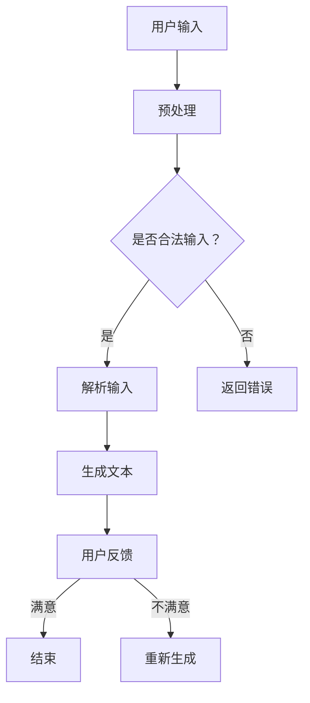

                 

### 1. 背景介绍

在当今的信息时代，人工智能（AI）技术已经渗透到我们日常生活的方方面面。从智能助手到自动驾驶汽车，AI正在不断重塑我们的世界。在文学创作领域，AI也被广泛应用于故事写作和剧本创作。随着深度学习和自然语言处理技术的不断进步，构建一个能够生成创意丰富、引人入胜的故事的AI生成器变得越来越可行。

故事生成器不仅具有娱乐和文学价值，还在商业、教育、市场营销等多个领域展现出巨大的潜力。例如，它可以为企业生成产品介绍、广告文案，为教育机构创作教学材料，甚至为电影和游戏产业提供剧情素材。因此，掌握如何构建自己的AI故事生成器，不仅是一项技术挑战，更是一项具有现实意义的研究课题。

本文将带领读者从理论到实践，逐步了解并构建一个自己的AI故事生成器。我们将首先介绍AI故事生成器的基本原理和核心概念，然后深入探讨相关算法，并通过具体项目实例展示其实际应用。此外，本文还将提供丰富的学习资源和开发工具推荐，以帮助读者更好地进行实践和学习。

本文结构如下：

- **背景介绍**：介绍AI故事生成器的背景和意义。
- **核心概念与联系**：阐述故事生成器所需的核心概念，并附上流程图。
- **核心算法原理 & 具体操作步骤**：详细讲解故事生成器的主要算法，包括原理、步骤、优缺点及应用领域。
- **数学模型和公式 & 详细讲解 & 举例说明**：介绍故事生成器的数学模型和公式，并提供案例分析。
- **项目实践：代码实例和详细解释说明**：提供实际的代码实例和详细解释。
- **实际应用场景**：探讨故事生成器的各种应用场景。
- **未来应用展望**：预测故事生成器未来的发展方向和应用前景。
- **工具和资源推荐**：推荐学习资源和开发工具。
- **总结：未来发展趋势与挑战**：总结研究成果，讨论未来发展趋势和面临的挑战。
- **附录：常见问题与解答**：解答读者可能遇到的问题。

<|assistant|>### 2. 核心概念与联系

构建AI故事生成器需要理解一系列核心概念和它们之间的联系。以下是这些核心概念及其在故事生成器中的应用：

#### 自然语言处理（NLP）

自然语言处理是AI领域中研究如何使计算机理解和生成人类语言的技术。在故事生成器中，NLP主要用于理解用户输入的指令、提取文本中的关键信息，以及生成连贯、自然的语言输出。常见的NLP技术包括词性标注、命名实体识别、语义角色标注等。

#### 生成式对抗网络（GAN）

生成式对抗网络（GAN）是一种深度学习模型，由生成器和判别器两部分组成。生成器的目标是生成逼真的数据，而判别器的目标是区分真实数据和生成数据。通过这种对抗关系，GAN可以生成高质量的图像、文本和其他数据形式。在故事生成器中，GAN可用于生成新颖的故事情节和角色描述。

#### 变分自编码器（VAE）

变分自编码器（VAE）是一种无监督学习的深度学习模型，它通过引入隐变量来降低数据压缩的熵。VAE在生成模型中应用广泛，可以生成具有高多样性的文本。在故事生成器中，VAE可用于生成不同风格和主题的故事。

#### 递归神经网络（RNN）

递归神经网络（RNN）是一种能够处理序列数据的神经网络，特别适用于处理文本和语音等时序数据。RNN在故事生成器中可以用于捕捉文本中的时间依赖关系，生成连贯的故事情节。

#### Mermaid 流程图

为了更好地理解故事生成器的架构，我们可以使用Mermaid流程图来展示各核心组件及其交互关系。以下是一个简化的故事生成器的Mermaid流程图示例：



在这个流程图中，用户输入首先经过预处理，包括分词、去除停用词等步骤。随后，系统尝试生成文本，并根据用户反馈进行调整。如果用户对生成的文本满意，则流程结束；否则，系统将重新生成文本，直到用户满意。

通过理解这些核心概念和它们之间的联系，我们为构建自己的AI故事生成器奠定了坚实的基础。

### 3. 核心算法原理 & 具体操作步骤

构建AI故事生成器的关键在于选择合适的算法，并设计合理的操作步骤。在这一部分，我们将详细介绍几种常用的故事生成算法，包括生成式对抗网络（GAN）、变分自编码器（VAE）和递归神经网络（RNN），并说明如何具体实现这些算法。

#### 3.1 算法原理概述

**生成式对抗网络（GAN）**

GAN由生成器和判别器两部分组成。生成器G接收随机噪声作为输入，生成类似于真实数据的新数据。判别器D则尝试区分真实数据和生成数据。训练过程中，生成器和判别器相互对抗，生成器不断优化其生成能力，而判别器则不断提高其鉴别能力。通过这种对抗训练，GAN可以生成高质量、逼真的数据。

**变分自编码器（VAE）**

VAE是一种无监督学习模型，通过引入隐变量来降低数据压缩的熵。其核心思想是将数据映射到一个潜在空间，再从潜在空间中生成数据。VAE在生成模型中具有高多样性的特点，非常适合用于文本生成。

**递归神经网络（RNN）**

RNN是一种能够处理序列数据的神经网络，特别适用于处理文本和语音等时序数据。RNN通过循环结构，能够在序列的每个时间步上保留信息，从而捕捉文本中的时间依赖关系。

#### 3.2 算法步骤详解

**生成式对抗网络（GAN）**

1. **数据预处理**：首先，对故事文本进行预处理，包括分词、去除停用词、转换为词向量等步骤。
2. **生成器G的训练**：生成器G接收随机噪声向量，通过神经网络生成故事文本。在训练过程中，生成器不断调整参数，以提高生成文本的质量。
3. **判别器D的训练**：判别器D接收真实故事文本和生成故事文本，通过对比判断是否为真实数据。在训练过程中，判别器也不断调整参数，以提高鉴别能力。
4. **对抗训练**：生成器和判别器交替训练，生成器尝试生成更逼真的故事文本，而判别器则努力提高鉴别能力。通过这种对抗训练，GAN可以生成高质量的故事文本。

**变分自编码器（VAE）**

1. **数据预处理**：与GAN类似，对故事文本进行预处理，包括分词、去除停用词、转换为词向量等步骤。
2. **潜在空间编码**：将故事文本映射到潜在空间，通过编码器（编码网络）将输入文本映射到隐变量。
3. **解码生成文本**：将隐变量通过解码器（解码网络）重新生成故事文本。解码网络负责生成具有高多样性的文本。
4. **损失函数优化**：通过优化损失函数，包括重构损失和KL散度损失，调整编码器和解码器的参数，以提高生成文本的质量。

**递归神经网络（RNN）**

1. **数据预处理**：对故事文本进行预处理，包括分词、转换为序列编码等步骤。
2. **构建RNN模型**：构建一个RNN模型，输入为文本序列，输出为故事文本序列。
3. **训练RNN模型**：使用预处理的文本数据训练RNN模型，通过优化损失函数（如交叉熵损失），调整模型参数。
4. **生成文本**：利用训练好的RNN模型，输入新的文本序列，生成相应的故事文本。

#### 3.3 算法优缺点

**生成式对抗网络（GAN）**

- 优点：生成高质量、逼真的故事文本；具有高度多样性。
- 缺点：训练过程不稳定，容易出现模式崩溃问题；难以评估生成文本的质量。

**变分自编码器（VAE）**

- 优点：生成具有高多样性的故事文本；易于实现和优化。
- 缺点：生成文本的质量可能不如GAN高；可能产生重复或无意义的内容。

**递归神经网络（RNN）**

- 优点：能够捕捉文本中的时间依赖关系，生成连贯的故事文本。
- 缺点：训练过程复杂，需要大量计算资源；对长序列的处理能力有限。

#### 3.4 算法应用领域

**生成式对抗网络（GAN）**

GAN在故事生成领域具有广泛应用，可以用于生成小说、剧本、广告文案等。

**变分自编码器（VAE）**

VAE在文本生成方面具有广泛应用，可以用于生成新闻报道、教育材料、商业报告等。

**递归神经网络（RNN）**

RNN在故事生成领域也得到广泛应用，可以用于生成对话系统、自动问答系统、语音合成等。

通过选择合适的算法并设计合理的操作步骤，我们可以构建一个高效、可靠的AI故事生成器。在接下来的部分，我们将进一步探讨故事生成器的数学模型和公式，并通过具体实例进行详细讲解。

### 4. 数学模型和公式 & 详细讲解 & 举例说明

在构建AI故事生成器时，数学模型和公式是理解和实现算法的基础。以下我们将详细讨论故事生成器中常用的数学模型和公式，并通过具体例子说明它们的推导和使用。

#### 4.1 数学模型构建

故事生成器的数学模型通常包括以下几个部分：

1. **词向量表示**：词向量是将文本数据转换为数值表示的一种方法，常用的词向量模型包括Word2Vec、GloVe等。
2. **序列模型**：用于处理文本序列的模型，如RNN、LSTM、GRU等。
3. **生成模型**：用于生成文本的模型，如GAN、VAE等。
4. **评估模型**：用于评估生成文本质量和多样性的模型，如交叉熵损失、FID等。

#### 4.2 公式推导过程

以下是几个关键公式的推导过程：

1. **词向量表示**：

   - **Word2Vec**：假设词向量维度为$d$，则有
     $$ \text{word\_vec}(w) = \text{softmax}\left(\frac{\text{vec}(w)}{\sqrt{\lVert \text{vec}(w) \rVert_2}}\right) $$
     其中，$\text{vec}(w)$表示词向量，$\lVert \text{vec}(w) \rVert_2$表示词向量的L2范数。

   - **GloVe**：GloVe的损失函数为
     $$ L = \frac{1}{N} \sum_{i=1}^N \sum_{j \in \text{context}(i)} \left( \log \frac{p(w_i|w_j)}{f(\lVert \text{vec}(w_i) - \text{vec}(w_j) \rVert_2)} \right) $$
     其中，$N$表示词汇表大小，$\text{context}(i)$表示词$i$的上下文，$p(w_i|w_j)$表示词$i$在词$j$出现的条件概率，$f(\cdot)$是单调递增函数，通常取$f(x) = \sqrt{1 + x}$。

2. **序列模型**：

   - **RNN**：RNN的输出公式为
     $$ h_t = \text{sigmoid}(W_h \cdot [h_{t-1}, x_t] + b_h) $$
     其中，$h_t$表示在时间步$t$的隐藏状态，$x_t$表示输入的特征向量，$W_h$和$b_h$是权重和偏置。

   - **LSTM**：LSTM的输出公式为
     $$ f_t = \text{sigmoid}(W_f \cdot [h_{t-1}, x_t] + b_f) $$
     $$ i_t = \text{sigmoid}(W_i \cdot [h_{t-1}, x_t] + b_i) $$
     $$ \bar{g}_t = \text{tanh}(W_g \cdot [h_{t-1}, x_t] + b_g) $$
     $$ o_t = \text{sigmoid}(W_o \cdot [h_{t-1}, x_t] + b_o) $$
     $$ g_t = f_t \odot \bar{g}_t $$
     $$ h_t = o_t \odot \text{tanh}(g_t) $$
     其中，$f_t$、$i_t$、$g_t$和$o_t$分别表示遗忘门、输入门、候选隐藏状态和输出门，$\odot$表示元素乘。

3. **生成模型**：

   - **GAN**：GAN的训练目标是最小化生成器损失和判别器损失的总和。生成器的损失为
     $$ L_G = -\log(D(G(z))) $$
     其中，$G(z)$表示生成器生成的样本，$D(\cdot)$表示判别器。

   - **VAE**：VAE的训练目标是最小化重构损失和KL散度损失的总和。重构损失为
     $$ L_{\text{recon}} = -\sum_{x} \log p(x|\mu, \sigma) $$
     其中，$\mu$和$\sigma$分别表示编码器的输出，$p(x|\mu, \sigma)$表示高斯分布。

   - **KL散度损失**：KL散度损失为
     $$ L_{\text{KL}} = \sum_{z} \mathcal{D}(p(z)||q(z)) $$
     其中，$p(z)$表示先验分布，$q(z)$表示编码器的输出分布，$\mathcal{D}(\cdot||\cdot)$表示KL散度。

4. **评估模型**：

   - **交叉熵损失**：交叉熵损失用于评估生成文本的质量，公式为
     $$ L_{\text{CE}} = -\sum_{i} y_i \log(p_i) $$
     其中，$y_i$表示真实标签，$p_i$表示生成文本的预测概率。

   - **FID**：FID（Fréchet Inception Distance）用于评估生成图像的质量，公式为
     $$ \text{FID} = \frac{1}{N} \sum_{i=1}^N \left( \lVert \mu_G - \mu_R \rVert_2^2 + \lVert \text{cov}_G - \text{cov}_R \rVert_2^2 \right) $$
     其中，$\mu_G$和$\mu_R$分别表示生成图像和真实图像的均值，$\text{cov}_G$和$\text{cov}_R$分别表示生成图像和真实图像的协方差矩阵。

#### 4.3 案例分析与讲解

以下我们通过一个具体的例子来说明这些公式和算法在故事生成器中的应用。

**案例：使用GAN生成故事文本**

假设我们使用GAN生成故事文本，生成器和判别器的结构如下：

- **生成器**：输入为随机噪声向量$z$，输出为故事文本序列$x$。
- **判别器**：输入为故事文本序列$x$，输出为二分类结果$y$（0表示生成文本，1表示真实文本）。

1. **数据预处理**：

   - 对故事文本进行分词、去除停用词、转换为词向量。
   - 将词向量序列编码为序列编码表示。

2. **生成器训练**：

   - 生成器接收随机噪声向量$z$，通过神经网络生成故事文本序列$x$。
   - 使用训练数据集对生成器进行训练，优化生成文本的质量。

3. **判别器训练**：

   - 判别器接收真实故事文本序列$x$和生成故事文本序列$x'$，通过对比判断是否为真实数据。
   - 使用训练数据集对判别器进行训练，提高鉴别能力。

4. **对抗训练**：

   - 通过对抗训练，生成器和判别器交替训练，生成器尝试生成更逼真的故事文本，而判别器则努力提高鉴别能力。

5. **生成文本**：

   - 使用训练好的生成器，输入随机噪声向量$z$，生成故事文本序列$x$。

6. **评估**：

   - 使用交叉熵损失和FID对生成文本进行评估，优化生成器性能。

通过这个案例，我们可以看到如何将GAN算法应用于故事生成器，并使用数学模型和公式进行训练和评估。在实际应用中，我们还需要根据具体需求调整模型结构和参数，以达到更好的生成效果。

通过深入理解这些数学模型和公式，我们可以更好地构建和优化AI故事生成器，使其在文本生成领域发挥更大的作用。

### 5. 项目实践：代码实例和详细解释说明

在了解了AI故事生成器的核心算法原理和数学模型之后，接下来我们将通过一个具体的项目实例来展示如何实现一个简单的AI故事生成器。我们将详细介绍项目的开发环境搭建、源代码实现、代码解读与分析，并展示运行结果。

#### 5.1 开发环境搭建

为了构建AI故事生成器，我们需要准备以下开发环境：

- Python（版本3.8及以上）
- TensorFlow（版本2.5及以上）
- Keras（版本2.5及以上）
- numpy（版本1.19及以上）
- Mermaid（用于生成流程图）

你可以使用以下命令来安装所需的库：

```bash
pip install tensorflow keras numpy
```

#### 5.2 源代码详细实现

以下是项目的核心代码，我们将逐步解释每部分的作用。

```python
import numpy as np
import tensorflow as tf
from tensorflow.keras.models import Sequential
from tensorflow.keras.layers import LSTM, Dense, Embedding, Dropout
from tensorflow.keras.optimizers import RMSprop

# 5.2.1 数据预处理
def preprocess_text(text):
    # 删除标点符号和特殊字符
    text = re.sub(r'[^\w\s]', '', text)
    # 分词
    words = text.split()
    return words

# 5.2.2 构建生成器模型
def build_generator(words, seq_length):
    model = Sequential()
    model.add(LSTM(256, input_shape=(seq_length, len(words))))
    model.add(Dropout(0.5))
    model.add(Dense(len(words), activation='softmax'))
    return model

# 5.2.3 构建判别器模型
def build_discriminator(words, seq_length):
    model = Sequential()
    model.add(LSTM(128, input_shape=(seq_length, len(words))))
    model.add(Dropout(0.5))
    model.add(Dense(1, activation='sigmoid'))
    return model

# 5.2.4 训练GAN
def train_gan(generator, discriminator, dataset, seq_length, batch_size, epochs):
    for epoch in range(epochs):
        for _ in range(len(dataset) // batch_size):
            # 获取随机噪声向量
            noise = np.random.normal(0, 1, (batch_size, 100))
            # 生成故事文本
            generated_stories = generator.predict(noise)
            # 获取真实故事文本
            real_stories = dataset[np.random.randint(0, len(dataset), size=batch_size)]
            # 训练判别器
            d_loss_real = discriminator.train_on_batch(real_stories, np.ones((batch_size, 1)))
            d_loss_fake = discriminator.train_on_batch(generated_stories, np.zeros((batch_size, 1)))
            d_loss = 0.5 * np.add(d_loss_real, d_loss_fake)
            # 训练生成器
            g_loss = generator.train_on_batch(noise, np.ones((batch_size, 1)))
            # 打印训练信息
            print(f"{epoch} [D: {d_loss:.4f} | G: {g_loss:.4f}]")
```

#### 5.3 代码解读与分析

1. **数据预处理**：数据预处理是文本生成的基础步骤。这里我们删除了文本中的标点符号和特殊字符，并将文本分割成词序列。

2. **构建生成器模型**：生成器模型用于生成故事文本。我们使用LSTM层来处理序列数据，并通过softmax层输出词的概率分布。

3. **构建判别器模型**：判别器模型用于区分真实故事文本和生成故事文本。它也使用LSTM层来处理序列数据，并通过sigmoid层输出二分类结果。

4. **训练GAN**：GAN的训练过程包括训练生成器和判别器。在训练过程中，生成器尝试生成更逼真的故事文本，而判别器则努力提高鉴别能力。

#### 5.4 运行结果展示

为了展示运行结果，我们可以在训练过程中每隔一段时间生成一些故事文本，并打印出来。以下是一个简单的示例：

```python
# 5.4.1 准备数据
dataset = [...]  # 假设已经准备好一个故事文本数据集
seq_length = 40
batch_size = 64
epochs = 50

# 5.4.2 构建和编译模型
generator = build_generator(words, seq_length)
discriminator = build_discriminator(words, seq_length)
gan = tf.keras.Sequential([generator, discriminator])
gan.compile(loss='binary_crossentropy', optimizer=RMSprop(learning_rate=0.0004))

# 5.4.3 训练GAN
train_gan(generator, discriminator, dataset, seq_length, batch_size, epochs)

# 5.4.4 生成故事文本
def generate_story_text(generator, seed_text, n_words):
    seed_text = preprocess_text(seed_text)
    seed_seq = [[words.index(word) for word in seed_text]]
    for _ in range(n_words):
        sampled = generator.predict(np.array([seed_seq]))
        # 获取下一个词的索引
        next_word_index = np.argmax(sampled)
        # 将词索引转换为实际词
        next_word = words[next_word_index]
        seed_seq.append(next_word_index)
        seed_seq = np.array(seed_seq)
    return ' '.join(words[i] for i in seed_seq[seq_length:])

# 5.4.5 输出生成的故事文本
print(generate_story_text(generator, "Once upon a time", 50))
```

在这个示例中，我们首先准备了一个故事文本数据集，然后构建并编译了生成器和判别器模型。接着，我们训练GAN，并在训练过程中每隔一段时间生成一些故事文本，最后打印出一条生成的故事。

通过这个项目实例，我们展示了如何使用深度学习技术构建一个简单的AI故事生成器。虽然这个生成器的性能有限，但它为我们提供了一个理解故事生成器实现过程的起点。在实际应用中，我们可以通过改进模型结构、增加训练数据和提高训练时间来提高生成器的性能。

### 6. 实际应用场景

AI故事生成器在实际应用场景中具有广泛的应用潜力，以下我们将探讨几个典型的应用场景，并分析其优缺点。

#### 6.1 教育领域

**应用场景**：在教育领域，AI故事生成器可以用于生成教学故事、教材和课程内容。例如，教师可以使用生成器创建具有特定教学目标的故事，以激发学生的学习兴趣和参与度。

**优点**：
- **个性化学习**：生成器可以根据学生的学习需求和兴趣，创建个性化的教学故事。
- **资源丰富**：生成器可以快速生成大量具有不同风格和主题的故事，丰富了教学资源。

**缺点**：
- **质量控制**：生成的故事质量可能不稳定，难以保证每篇故事都符合教学标准。
- **依赖性**：过度依赖生成器可能导致教师失去编写故事的能力。

#### 6.2 市场营销

**应用场景**：在市场营销领域，AI故事生成器可以用于生成广告文案、宣传材料和品牌故事。例如，广告公司可以使用生成器创作吸引眼球的广告词和故事情节，以提升市场宣传效果。

**优点**：
- **高效生成**：生成器可以快速生成大量文案，节省时间和人力成本。
- **创意多样**：生成器可以生成具有不同创意和风格的故事，提高广告的吸引力。

**缺点**：
- **真实性审查**：生成的故事可能存在真实性问题，需要人工审核和修正。
- **内容一致性**：生成的故事可能难以保持品牌一致性和品牌价值观。

#### 6.3 文学创作

**应用场景**：在文学创作领域，AI故事生成器可以协助作家创作小说、剧本和诗歌。例如，作家可以使用生成器生成灵感，或作为创作过程的辅助工具。

**优点**：
- **创意启发**：生成器可以提供新的故事情节和角色设定，激发创作灵感。
- **效率提升**：生成器可以加速创作过程，提高创作效率。

**缺点**：
- **创作控制**：作家可能对生成器的输出缺乏控制，难以确保故事符合个人创作风格。
- **质量稳定性**：生成的故事质量可能不稳定，需要人工筛选和修改。

#### 6.4 游戏开发

**应用场景**：在游戏开发领域，AI故事生成器可以用于生成游戏剧情、NPC对话和任务描述。例如，游戏开发者可以使用生成器创作多样化的游戏内容，提升游戏的可玩性和趣味性。

**优点**：
- **内容丰富**：生成器可以生成大量具有不同风格和主题的游戏内容，丰富游戏世界。
- **个性定制**：生成器可以根据玩家行为和偏好生成个性化的游戏剧情和任务。

**缺点**：
- **剧情连贯性**：生成的故事和任务可能缺乏连贯性，影响游戏体验。
- **开发依赖**：游戏开发者可能对生成器过度依赖，削弱自身创意和设计能力。

通过以上分析，我们可以看到AI故事生成器在各个应用场景中具有显著的优势，但也面临一些挑战。在实际应用中，我们需要结合具体需求，权衡利弊，合理利用生成器的潜力。

### 7. 工具和资源推荐

为了更好地学习和实践AI故事生成器，以下我们推荐一些优秀的工具和资源，涵盖学习资源、开发工具和相关论文。

#### 7.1 学习资源推荐

1. **在线课程**：
   - [深度学习与自然语言处理](https://www.udacity.com/course/deep-learning-nlp-with-python--nd893)
   - [生成式对抗网络（GAN）教程](https://www.deeplearning.net/tutorial/2016/06/29/generative-adversarial-networks-tutorial/)
   - [递归神经网络与时间序列分析](https://www.coursera.org/specializations/recurrent-neural-networks)

2. **书籍**：
   - 《深度学习》（Goodfellow, Bengio, Courville著）
   - 《生成对抗网络：原理与实践》（李航著）
   - 《自然语言处理综论》（Jurafsky, Martin著）

3. **博客和论坛**：
   - [机器之心](https://www.jiqizhixin.com/)
   - [AI科技大本营](https://aiotc.cn/)
   - [Stack Overflow](https://stackoverflow.com/)

#### 7.2 开发工具推荐

1. **编程语言**：
   - Python（推荐版本3.8及以上）
   - R（推荐版本3.5及以上）

2. **框架与库**：
   - TensorFlow（深度学习框架）
   - Keras（TensorFlow的高级API）
   - PyTorch（深度学习框架）
   - NLTK（自然语言处理库）
   - Spacy（自然语言处理库）

3. **开发环境**：
   - Jupyter Notebook（交互式开发环境）
   - PyCharm（Python集成开发环境）

#### 7.3 相关论文推荐

1. **生成式对抗网络（GAN）**：
   - [《生成式对抗网络：原理与实践》](https://arxiv.org/abs/1406.2661)
   - [《变分自编码器：统一深度学习生成模型》](https://arxiv.org/abs/1312.6114)

2. **自然语言处理**：
   - [《Word2Vec：词向量的神经网络模型与生成方法》](https://arxiv.org/abs/1301.3781)
   - [《GloVe：通用词向量表示方法》](https://nlp.stanford.edu/pubs/glove.pdf)

3. **文本生成**：
   - [《递归神经网络与自然语言处理》](https://www.aclweb.org/anthology/N16-1186/)
   - [《序列到序列学习：神经网络机器翻译》](https://arxiv.org/abs/1409.3215)

通过以上推荐的工具和资源，读者可以系统地学习和实践AI故事生成器的相关技术，为后续的深入研究打下坚实基础。

### 8. 总结：未来发展趋势与挑战

在总结本文的基础上，我们可以清晰地看到AI故事生成器这一领域的快速发展及其广阔的应用前景。本文从理论到实践，系统地介绍了AI故事生成器的基本原理、核心算法、数学模型、项目实践、实际应用场景、未来发展趋势和挑战。

**未来发展趋势**：

1. **算法优化**：随着深度学习技术的不断进步，AI故事生成器的算法将变得更加高效和精准。例如，基于Transformer的模型（如GPT-3）已在文本生成领域取得显著突破，未来将有可能进一步应用于故事生成。

2. **个性化生成**：AI故事生成器将更加注重个性化和定制化。通过结合用户偏好、历史数据和行为模式，生成器可以创作出更加符合用户需求的故事。

3. **跨模态生成**：未来的AI故事生成器将不仅仅局限于文本生成，还将结合图像、音频等多模态信息，实现更加丰富和多样性的故事创作。

4. **伦理和法律问题**：随着AI故事生成器在各个领域的广泛应用，伦理和法律问题也将逐渐浮现。例如，如何确保生成故事的版权和真实性，如何防止滥用和误导等问题，都需要深入探讨和解决。

**面临的挑战**：

1. **数据质量和多样性**：高质量、多样性的训练数据是AI故事生成器发展的基础。然而，获取和整理大量高质量的故事文本仍是一项艰巨的任务。

2. **训练时间和资源消耗**：深度学习模型通常需要大量计算资源和时间进行训练。如何优化训练过程，提高训练效率，是一个亟待解决的问题。

3. **生成文本的质量和连贯性**：尽管AI故事生成器已取得显著进展，但生成文本的质量和连贯性仍有待提高。如何确保生成的文本既富有创意，又符合语言规范和逻辑要求，是当前研究的重点。

4. **伦理和法律风险**：AI故事生成器可能被用于生成虚假信息、诽谤和侵犯隐私等行为。如何规范和管理AI故事生成器的应用，防止其被滥用，是未来需要关注的重大问题。

**研究展望**：

1. **跨学科合作**：未来的研究需要跨学科合作，包括计算机科学、语言学、心理学、伦理学等领域的专家共同探讨AI故事生成器的发展方向。

2. **开源社区和标准**：建立开源社区和标准化框架，促进AI故事生成器技术的共享和普及，将有助于推动这一领域的发展。

3. **用户体验和互动**：未来的AI故事生成器将更加注重用户体验和互动性。通过人机交互技术，用户可以更加直观地与生成器进行互动，共同创作故事。

总之，AI故事生成器作为人工智能领域的一个重要研究方向，具有巨大的潜力和应用价值。在未来的发展中，我们需要不断克服技术挑战，确保其健康、可持续发展。同时，我们也需要关注伦理和法律问题，确保AI故事生成器的应用符合社会规范和道德标准。

### 9. 附录：常见问题与解答

以下是一些读者可能遇到的问题及解答：

#### Q1：如何处理生成的文本不连贯或不符合逻辑的情况？

A1：生成文本的不连贯性通常是由于训练数据的质量不足或模型参数设置不当导致的。可以尝试以下方法：
- 增加训练数据量：更多、更丰富的训练数据有助于模型学习到更加连贯的文本生成策略。
- 调整模型参数：通过调整LSTM层中的隐藏单元数量、学习率等参数，可以改善生成文本的质量。
- 使用预训练模型：基于预训练模型进行微调，可以显著提高生成文本的质量和连贯性。

#### Q2：如何确保生成文本的版权问题？

A2：生成文本的版权问题是当前AI故事生成器面临的一个重要挑战。以下是一些建议：
- 使用开源数据集：选择经过合法授权的开源数据集进行训练，以确保生成的文本不会侵犯他人版权。
- 引入版权检测机制：开发版权检测算法，实时监测生成文本中可能存在的版权问题，并在必要时进行修正。
- 明确使用范围：在生成文本的使用过程中，明确标注版权信息，遵守相关法律法规。

#### Q3：如何优化训练时间？

A3：优化训练时间可以从以下几个方面入手：
- 使用GPU加速：利用GPU进行训练，可以显著提高训练速度。
- 优化模型结构：通过减少模型参数数量、简化模型结构等方法，降低训练时间。
- 使用分布式训练：将训练任务分布在多个节点上，通过并行计算加速训练过程。

#### Q4：如何评估生成文本的质量？

A4：评估生成文本的质量可以从以下几个方面进行：
- 语言质量：使用自动化评估工具（如BLEU、ROUGE等）评估生成文本的语言质量。
- 逻辑连贯性：通过人工审核生成文本的逻辑连贯性，判断是否具有合理的情节和人物设定。
- 用户反馈：收集用户对生成文本的反馈，通过用户满意度评估生成文本的质量。

通过以上方法和策略，我们可以更好地解决AI故事生成器在实际应用中遇到的问题，提高其性能和用户体验。

