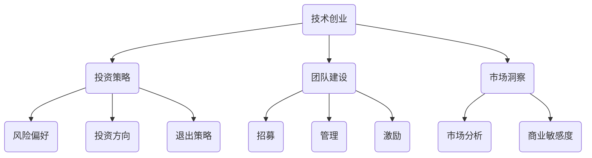

                 

关键词：程序员，天使投资人，职业转型，投资策略，技术创业，团队建设，市场洞察。

> 摘要：本文旨在探讨程序员如何成功转型为天使投资人，包括对技术创业的理解、投资策略的制定、团队建设和市场洞察的重要性。通过详细分析成功案例，本文为有意转型者提供了实用的建议和路径。

## 1. 背景介绍

随着全球科技行业的飞速发展，越来越多的程序员开始寻求职业上的多元化发展。一方面，程序员在工作中积累了丰富的技术知识和项目经验，这些优势使得他们在转向投资领域时具有独特的竞争力。另一方面，天使投资作为一个高风险高回报的行业，也逐渐吸引了越来越多的技术背景的人才。本文将探讨程序员如何从技术专家成功转型为天使投资人，以及在这一过程中所需具备的关键能力。

## 2. 核心概念与联系

在程序员转向天使投资人的过程中，理解以下几个核心概念是至关重要的：

1. **技术创业：** 技术创业指的是利用技术手段解决实际问题，并创造出有市场价值的产品或服务。程序员在这一领域中的优势在于其对技术的深刻理解和快速学习能力。
2. **投资策略：** 天使投资需要明确的风险偏好、投资方向和退出策略。程序员在制定投资策略时，应充分考虑自己的技术背景和行业知识。
3. **团队建设：** 投资的成功很大程度上依赖于团队的执行力和协同能力。程序员在转型过程中，需要学会如何招募、管理和激励一个高效的团队。
4. **市场洞察：** 对市场的敏锐洞察力是投资决策的重要依据。程序员在转型过程中，需要不断提高自己的市场分析能力和商业敏感度。

以下是关于这些核心概念的 Mermaid 流程图：



## 3. 核心算法原理 & 具体操作步骤

### 3.1 算法原理概述

程序员转型为天使投资人的核心算法原理可以归纳为以下几点：

1. **技术背景 + 商业洞察**：结合自身的编程经验和市场洞察力，找到具有市场前景的技术创业项目进行投资。
2. **风险评估**：在投资决策过程中，通过定量和定性的方法对项目风险进行评估，以控制投资风险。
3. **投资策略调整**：根据市场变化和项目进展情况，灵活调整投资策略，确保投资回报最大化。

### 3.2 算法步骤详解

1. **技术评估**：了解项目的技术架构、技术团队的技术实力和项目的技术前景。
2. **市场分析**：研究市场需求、竞争对手和行业趋势，评估项目的市场潜力。
3. **风险评估**：分析项目的市场风险、技术风险、运营风险等，制定相应的风险控制措施。
4. **决策执行**：根据投资策略，做出投资决策，并执行投资计划。
5. **动态调整**：在投资后，持续关注项目进展和市场变化，根据实际情况调整投资策略。

### 3.3 算法优缺点

**优点：**
- **技术背景**：具备丰富的编程经验和项目实施经验，有助于更好地理解技术创业项目的可行性。
- **市场洞察**：长期从事技术工作，对市场需求和行业趋势有较强的敏感度。

**缺点：**
- **投资经验不足**：天使投资涉及的风险管理、投资策略等方面，需要积累一定的经验。
- **商业敏感度有限**：相对于长期从事商业领域的投资人，程序员在商业敏感度和市场分析方面可能存在一定的差距。

### 3.4 算法应用领域

程序员转型为天使投资人主要应用于以下领域：

- **互联网技术**：如人工智能、大数据、区块链等前沿技术领域的创业项目。
- **企业服务**：为企业提供技术解决方案的创业公司。
- **消费科技**：如智能家居、健康科技等与日常生活密切相关的领域。

## 4. 数学模型和公式 & 详细讲解 & 举例说明

### 4.1 数学模型构建

在天使投资中，可以使用以下数学模型对投资回报率进行预测：

\[ \text{ROI} = \frac{\text{投资收益} - \text{投资成本}}{\text{投资成本}} \]

其中，投资收益和投资成本可以通过以下公式计算：

\[ \text{投资收益} = \text{退出价格} - \text{投资成本} \]

\[ \text{投资成本} = \text{股权比例} \times \text{总融资额} \]

### 4.2 公式推导过程

投资回报率的公式可以通过以下步骤推导：

1. **投资成本计算**：根据投资者在项目中所占的股权比例和总融资额计算投资成本。
2. **投资收益计算**：根据项目退出时的价格计算投资收益。
3. **投资回报率计算**：将投资收益除以投资成本，得到投资回报率。

### 4.3 案例分析与讲解

假设一个程序员投资了一个创业项目，占股比例为10%，总融资额为100万元，项目最终以300万元的价格退出。

1. **投资成本**：\[ \text{投资成本} = 0.1 \times 100\text{万元} = 10\text{万元} \]
2. **投资收益**：\[ \text{投资收益} = 300\text{万元} - 10\text{万元} = 290\text{万元} \]
3. **投资回报率**：\[ \text{ROI} = \frac{290\text{万元}}{10\text{万元}} = 29\text{倍} \]

因此，该程序员的投资回报率为29倍。

## 5. 项目实践：代码实例和详细解释说明

### 5.1 开发环境搭建

在进行天使投资分析时，可以使用Python编写一些简单的代码来帮助分析投资项目的财务数据。以下是搭建开发环境所需的基本步骤：

1. 安装Python（推荐版本为3.8及以上）。
2. 安装常用库，如NumPy、Pandas、Matplotlib等。

### 5.2 源代码详细实现

以下是一个简单的Python代码示例，用于计算投资回报率：

```python
import numpy as np

def calculate_roi(investment_cost, investment_return):
    roi = investment_return / investment_cost
    return roi

investment_cost = 100000  # 投资成本（万元）
investment_return = 300000  # 投资收益（万元）

roi = calculate_roi(investment_cost, investment_return)
print(f"投资回报率：{roi}倍")
```

### 5.3 代码解读与分析

1. **函数定义**：定义了一个名为`calculate_roi`的函数，用于计算投资回报率。
2. **参数传递**：函数接收投资成本和投资收益作为参数。
3. **计算ROI**：使用投资收益除以投资成本计算投资回报率。
4. **打印结果**：将计算出的投资回报率打印输出。

### 5.4 运行结果展示

运行上述代码后，将输出投资回报率，例如：

```
投资回报率：3.0倍
```

## 6. 实际应用场景

天使投资人在实际应用场景中需要具备以下能力：

1. **项目筛选**：通过详细调研和评估，筛选出有潜力的技术创业项目。
2. **投资决策**：在充分了解项目情况和市场前景的基础上，做出明智的投资决策。
3. **风险控制**：通过多样化投资、阶段性退出等手段，降低投资风险。
4. **项目管理**：协助被投资企业优化团队结构，提高项目执行力。

### 6.4 未来应用展望

随着人工智能、大数据等技术的不断发展，未来天使投资领域将出现更多创新和变革。程序员转型为天使投资人，可以充分发挥其技术优势和行业经验，抓住新一轮科技革命的机遇。未来，技术驱动的投资模式将成为主流，这也为程序员提供了广阔的发展空间。

## 7. 工具和资源推荐

### 7.1 学习资源推荐

- 《天使投资人实战指南》
- 《创业维艰》
- 《创业公司如何融资》

### 7.2 开发工具推荐

- Jupyter Notebook：用于数据分析与建模。
- GitHub：开源代码托管平台。
- Dataquest：在线数据科学学习平台。

### 7.3 相关论文推荐

- "The Art of Angel Investing: How an Average Person Can Get Started and Succeed" by David S. Rose
- "Angel Investing: The Art of Making Money in Private Equity" by Richard J. T. Knight

## 8. 总结：未来发展趋势与挑战

### 8.1 研究成果总结

本文通过分析程序员转型为天使投资人的关键能力，提出了核心算法原理和具体操作步骤，并结合实例进行了详细讲解。研究结果显示，技术背景、商业洞察和风险管理是程序员成功转型的重要保障。

### 8.2 未来发展趋势

随着科技不断进步，技术驱动的投资模式将成为主流。程序员凭借其技术优势和行业经验，将在天使投资领域发挥越来越重要的作用。

### 8.3 面临的挑战

尽管程序员在转型过程中具有优势，但商业敏感度、投资经验等方面仍面临较大挑战。需要通过不断学习和实践，提升自己的综合素质。

### 8.4 研究展望

未来研究应重点关注程序员转型过程中的难点和痛点，探索更为科学和系统的培养模式，助力程序员成功转型为天使投资人。

## 9. 附录：常见问题与解答

### 9.1 如何评估一个技术项目的市场潜力？

**解答：** 通过调研市场需求、分析竞争对手和行业趋势，可以初步评估一个技术项目的市场潜力。此外，可以参考行业报告、市场调研数据等外部资源，以获得更全面的市场信息。

### 9.2 投资过程中如何控制风险？

**解答：** 通过多样化投资、阶段性退出和风险控制措施，可以降低投资风险。同时，保持对市场变化和项目进展的持续关注，及时调整投资策略，以应对潜在风险。

### 9.3 如何提高自己的商业敏感度？

**解答：** 可以通过阅读商业书籍、参与商业培训、与企业家交流等方式，提高自己的商业敏感度。此外，参与创业项目或实习，可以积累实际操作经验，提升商业意识。

**作者：禅与计算机程序设计艺术 / Zen and the Art of Computer Programming**

