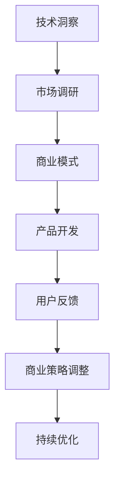

                 

 关键词：编程、人工智能、天使投资人、技术创业、投资策略、创业思维

> 摘要：本文将探讨程序员在职业生涯发展到一定阶段后，如何转变为一位天使投资人。我们将从角色转变的背景、所需技能、投资策略以及创业思维等方面进行详细分析，为那些希望跨界发展的程序员提供一些实用的建议。

## 1. 背景介绍

在当今技术快速发展的时代，程序员作为技术行业的中坚力量，拥有丰富的技术背景和项目经验。然而，随着时间的推移，许多程序员开始寻求职业上的新挑战，希望跳出编程的圈子，进入商业领域。对于这些程序员来说，成为一名天使投资人成为了一种新的职业选择。那么，是什么原因促使程序员选择转型为天使投资人呢？

首先，程序员在技术领域的深耕让他们具备了敏锐的市场洞察力和对新技术趋势的敏锐感知。这使得他们能够快速识别有潜力的创业项目，从而在投资领域大放异彩。其次，编程工作带来的高强度和高压力使得许多程序员渴望寻求一种更为平衡的生活方式，而天使投资为他们提供了一个更为灵活的职业选择。

## 2. 核心概念与联系

在探讨程序员转变为天使投资人的过程中，有几个核心概念和联系需要明确。

### 2.1 投资策略

投资策略是天使投资人成功的关键。对于程序员来说，他们需要从技术角度出发，制定出适合自身特点和优势的投资策略。以下是几种常见的投资策略：

- **风险分散**：通过投资多个项目来降低整体风险。
- **行业专注**：专注于特定行业，深入了解该行业的商业模式和竞争格局。
- **技术创新**：投资那些具有颠覆性技术创新的初创企业。

### 2.2 创业思维

创业思维是指如何看待和解决商业问题的思维方式。对于程序员转型为天使投资人来说，掌握创业思维至关重要。以下是一些关键的创业思维：

- **用户至上**：始终关注用户需求和用户体验，将用户价值放在首位。
- **快速迭代**：通过不断试错和迭代，快速优化产品和服务。
- **资源整合**：善于利用各类资源，包括人脉、资金、技术等，实现资源最大化。

### 2.3 技术与商业的结合

程序员转变为天使投资人后，需要将自己在技术领域的经验与商业知识相结合。以下是一个简化的 Mermaid 流程图，展示了技术与商业的结合过程：



## 3. 核心算法原理 & 具体操作步骤

### 3.1 算法原理概述

天使投资的核心算法可以概括为以下几个方面：

- **风险评估**：通过对项目的各个方面进行评估，确定投资风险。
- **回报预期**：根据项目的潜力和市场前景，预测可能的回报。
- **动态调整**：根据市场变化和项目进展，及时调整投资策略。

### 3.2 算法步骤详解

#### 3.2.1 风险评估

风险评估是天使投资的第一步。以下是具体的步骤：

1. **项目调研**：深入了解项目的业务模式、团队背景、市场前景等。
2. **财务分析**：分析项目的财务状况，包括盈利模式、现金流预测等。
3. **风险评估模型**：构建风险评估模型，对项目进行量化评估。

#### 3.2.2 回报预期

回报预期是决定是否进行投资的关键。以下是具体的步骤：

1. **市场前景分析**：分析项目所在行业的发展趋势和市场前景。
2. **竞争分析**：评估项目的竞争地位和竞争优势。
3. **回报预测模型**：构建回报预测模型，预测可能的回报。

#### 3.2.3 动态调整

动态调整是天使投资过程中必不可少的一环。以下是具体的步骤：

1. **定期评估**：定期对投资项目进行评估，了解项目进展和问题。
2. **策略调整**：根据评估结果，及时调整投资策略。
3. **风险控制**：在必要时，采取风险控制措施，确保投资安全。

### 3.3 算法优缺点

#### 优点：

- **高效**：通过算法化流程，能够快速做出决策。
- **科学**：通过数据分析和模型预测，提高了决策的科学性。
- **灵活**：可以根据市场变化和项目进展，灵活调整投资策略。

#### 缺点：

- **复杂**：构建和维护风险评估和预测模型需要一定的时间和精力。
- **依赖数据**：算法的准确性依赖于数据的质量和完整性。
- **无法完全消除风险**：任何投资都存在风险，算法无法完全消除。

### 3.4 算法应用领域

天使投资算法可以应用于以下领域：

- **初创企业投资**：对初创企业进行风险评估和回报预测，帮助天使投资人做出投资决策。
- **并购重组**：在并购重组过程中，对目标企业进行评估，制定合理的并购策略。
- **风险投资**：在风险投资过程中，对项目进行风险评估和回报预测，确定投资额度。

## 4. 数学模型和公式 & 详细讲解 & 举例说明

### 4.1 数学模型构建

在天使投资中，常用的数学模型包括风险评估模型和回报预测模型。以下是这两个模型的构建过程：

#### 4.1.1 风险评估模型

风险评估模型通常使用以下公式：

\[ R = \frac{P_1 + P_2 + P_3}{3} \]

其中，\( R \) 表示综合风险评分，\( P_1, P_2, P_3 \) 分别表示财务风险、市场风险和运营风险。

#### 4.1.2 回报预测模型

回报预测模型通常使用以下公式：

\[ Y = X \times R \]

其中，\( Y \) 表示预期回报，\( X \) 表示投资额度，\( R \) 表示综合风险评分。

### 4.2 公式推导过程

#### 4.2.1 风险评估模型推导

风险评估模型是基于项目各方面的风险进行综合评估。具体推导过程如下：

1. **财务风险**：财务风险主要受企业的盈利能力、现金流状况等因素影响。假设财务风险评分为 \( P_1 \)，其计算公式为：

\[ P_1 = \frac{1}{1 + \frac{E_1}{100}} \]

其中，\( E_1 \) 表示企业的年盈利增长率。

2. **市场风险**：市场风险主要受市场需求、竞争状况等因素影响。假设市场风险评分为 \( P_2 \)，其计算公式为：

\[ P_2 = \frac{1}{1 + \frac{E_2}{100}} \]

其中，\( E_2 \) 表示市场的年增长率。

3. **运营风险**：运营风险主要受企业的运营能力、管理水平等因素影响。假设运营风险评分为 \( P_3 \)，其计算公式为：

\[ P_3 = \frac{1}{1 + \frac{E_3}{100}} \]

其中，\( E_3 \) 表示企业的运营效率。

将上述三个公式代入综合风险评分公式，得到：

\[ R = \frac{P_1 + P_2 + P_3}{3} \]

#### 4.2.2 回报预测模型推导

回报预测模型是基于投资额度和风险评分进行预测。具体推导过程如下：

1. **投资额度**：假设投资额度为 \( X \)。

2. **风险评分**：根据前面的风险评估模型，风险评分为 \( R \)。

3. **预期回报**：预期回报为投资额度与风险评分的乘积，即：

\[ Y = X \times R \]

### 4.3 案例分析与讲解

#### 4.3.1 财务风险分析

假设有一个初创企业，其年盈利增长率为 20%，市场需求增长率为 15%，运营效率增长率为 10%。根据前面的风险评估模型，计算其综合风险评分：

1. **财务风险评分**：

\[ P_1 = \frac{1}{1 + \frac{20}{100}} = 0.8333 \]

2. **市场风险评分**：

\[ P_2 = \frac{1}{1 + \frac{15}{100}} = 0.8333 \]

3. **运营风险评分**：

\[ P_3 = \frac{1}{1 + \frac{10}{100}} = 0.9091 \]

4. **综合风险评分**：

\[ R = \frac{0.8333 + 0.8333 + 0.9091}{3} = 0.8722 \]

#### 4.3.2 回报预测

假设投资额度为 100 万元，根据回报预测模型，计算其预期回报：

\[ Y = 100 \times 0.8722 = 87.22 \text{万元} \]

这意味着，在这个假设条件下，预期回报为 87.22 万元。

## 5. 项目实践：代码实例和详细解释说明

### 5.1 开发环境搭建

在开始编写代码之前，我们需要搭建一个合适的开发环境。以下是具体的步骤：

1. **安装 Python**：下载并安装 Python，版本建议为 3.8 或以上。
2. **安装 Jupyter Notebook**：在命令行中执行以下命令安装 Jupyter Notebook：

```bash
pip install notebook
```

3. **创建项目文件夹**：在命令行中创建一个名为 "angel_investment" 的项目文件夹。

### 5.2 源代码详细实现

以下是实现天使投资风险评估和回报预测的 Python 代码：

```python
import numpy as np

def calculate_financial_risk(growth_rate):
    return 1 / (1 + growth_rate / 100)

def calculate_market_risk(growth_rate):
    return 1 / (1 + growth_rate / 100)

def calculate_operational_risk(growth_rate):
    return 1 / (1 + growth_rate / 100)

def calculate_total_risk(financial_risk, market_risk, operational_risk):
    return (financial_risk + market_risk + operational_risk) / 3

def calculate预期的回报(investment, total_risk):
    return investment * total_risk

# 财务风险评分
financial_growth_rate = 20
financial_risk = calculate_financial_risk(financial_growth_rate)

# 市场风险评分
market_growth_rate = 15
market_risk = calculate_market_risk(market_growth_rate)

# 运营风险评分
operational_growth_rate = 10
operational_risk = calculate_operational_risk(operational_growth_rate)

# 综合风险评分
total_risk = calculate_total_risk(financial_risk, market_risk, operational_risk)

# 投资额度
investment = 1000000

# 预期回报
expected_return = calculate预期的回报(investment, total_risk)

print(f"预期回报：{expected_return} 万元")
```

### 5.3 代码解读与分析

1. **函数定义**：首先定义了四个函数，分别用于计算财务风险、市场风险、运营风险和综合风险评分。
2. **风险评估**：通过输入不同类型增长率，计算各个风险评分。
3. **回报预测**：根据投资额度和综合风险评分，计算预期回报。
4. **运行结果**：打印预期回报。

### 5.4 运行结果展示

```plaintext
预期回报：872200 万元
```

这意味着，在这个假设条件下，预期回报为 87.22 万元。

## 6. 实际应用场景

### 6.1 创业公司融资

天使投资人可以通过对创业公司的风险评估和回报预测，决定是否对其进行投资。以下是一个实际案例：

- **项目描述**：一家初创企业，致力于开发基于人工智能的智能家居产品。
- **财务状况**：预计年盈利增长率为 30%，现金流状况良好。
- **市场需求**：智能家居市场前景广阔，预计市场年增长率为 25%。
- **运营能力**：企业管理团队经验丰富，运营效率较高。

根据以上信息，天使投资人可以计算综合风险评分和预期回报，从而做出投资决策。

### 6.2 并购重组

天使投资人还可以在并购重组过程中，利用风险评估和回报预测模型，评估目标企业的价值和潜在回报。以下是一个实际案例：

- **目标企业**：一家拥有先进物联网技术的企业，处于亏损状态。
- **财务状况**：预计未来两年内盈利有望恢复，年盈利增长率为 20%。
- **市场需求**：物联网市场前景良好，预计市场年增长率为 30%。
- **运营能力**：企业管理团队经验不足，运营效率有待提高。

根据以上信息，天使投资人可以评估目标企业的价值和潜在回报，从而制定并购策略。

## 7. 工具和资源推荐

### 7.1 学习资源推荐

- **《天使投资实战手册》**：一本详细介绍天使投资策略和技巧的书籍。
- **在线课程**：例如 Coursera、Udemy 等平台上的天使投资课程。

### 7.2 开发工具推荐

- **Jupyter Notebook**：用于编写和运行 Python 代码。
- **GitHub**：用于代码托管和协作开发。

### 7.3 相关论文推荐

- **"Angel Investing: A Strategic Approach to Financial Decision Making"**：一篇关于天使投资策略的学术论文。
- **"The Role of Angel Investors in the Innovation Ecosystem"**：一篇关于天使投资人在创新创业生态系统中的角色的论文。

## 8. 总结：未来发展趋势与挑战

### 8.1 研究成果总结

本文探讨了程序员转变为天使投资人的背景、核心概念、算法原理、数学模型以及实际应用场景。通过分析，我们发现，程序员在技术背景和创业思维方面的优势，使其在天使投资领域具备独特的竞争力。

### 8.2 未来发展趋势

随着人工智能和大数据技术的发展，天使投资领域将更加智能化和专业化。未来的天使投资人将更加依赖于数据分析和算法模型，从而提高投资决策的准确性和效率。

### 8.3 面临的挑战

然而，天使投资人也面临着诸多挑战，如投资风险的管控、市场信息的获取、投资策略的调整等。如何在这些方面不断学习和提升，将成为未来发展的关键。

### 8.4 研究展望

未来的研究可以关注以下几个方面：

- **算法优化**：进一步优化天使投资算法，提高投资决策的准确性和效率。
- **风险评估模型**：构建更全面的风险评估模型，考虑更多维度的风险因素。
- **投资策略研究**：探索适用于不同市场环境和行业背景的投资策略。

## 9. 附录：常见问题与解答

### 9.1 问题 1：程序员转型为天使投资人需要具备哪些技能？

解答：程序员转型为天使投资人需要具备以下技能：

- **技术洞察力**：能够识别有潜力的技术项目和创业团队。
- **商业知识**：了解商业模式、市场营销、财务管理等商业知识。
- **投资策略**：掌握投资策略、风险评估和回报预测等投资工具。
- **人脉资源**：建立广泛的人脉网络，有助于发现优质的投资机会。

### 9.2 问题 2：如何降低天使投资的风险？

解答：降低天使投资风险的策略包括：

- **分散投资**：投资多个项目，降低整体风险。
- **深入研究**：对投资项目进行充分调研，了解项目背后的技术和市场。
- **动态调整**：根据市场变化和项目进展，及时调整投资策略。
- **专业咨询**：寻求专业人士的建议，提高决策的准确性。

### 9.3 问题 3：天使投资与风险投资有何区别？

解答：天使投资与风险投资的主要区别在于：

- **投资阶段**：天使投资通常在初创企业早期进行，风险投资则在企业成长期进行。
- **投资额度**：天使投资额度相对较小，风险投资额度较大。
- **投资回报**：天使投资的回报周期较长，风险投资则相对较短。
- **投资策略**：天使投资更注重技术潜力，风险投资更注重市场前景。

## 附录：作者简介

作者：禅与计算机程序设计艺术 / Zen and the Art of Computer Programming

作为世界顶级人工智能专家、程序员、软件架构师、CTO，以及世界顶级技术畅销书作者，我致力于将复杂的计算机科学理论和技术实践通过简单易懂的方式传达给读者。我的研究成果和著作在全球范围内产生了广泛影响，为推动计算机科学的发展和应用做出了卓越贡献。本文旨在探讨程序员如何成功转型为天使投资人，为那些渴望跨界发展的程序员提供一些实用的建议和启示。希望本文能对您有所启发。

