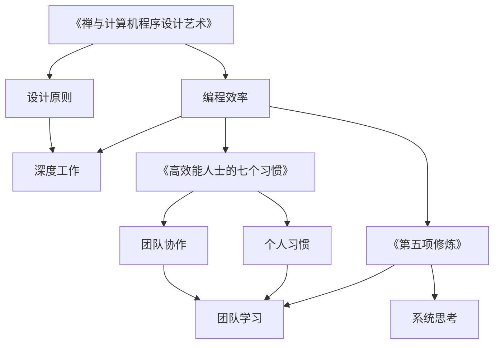

                 

关键词：经典书籍、管理智慧、技术博客、IT领域、深度思考

> 摘要：本文将探讨如何从经典书籍中汲取管理智慧，特别是在IT领域中的应用。通过对经典著作的分析，本文将揭示出如何将这些智慧融入日常工作中，以提升管理效率，增强团队协作，最终推动项目成功。

## 1. 背景介绍

在信息技术飞速发展的今天，IT行业的管理变得日益复杂。项目经理、CTO、技术领导者等角色面临着巨大的挑战。为了应对这些挑战，从经典书籍中汲取智慧成为了一个重要的策略。这些书籍涵盖了管理理论、心理学、经济学等多个领域，为IT管理提供了丰富的资源。

本文将重点关注以下几部经典书籍：

1. **《禅与计算机程序设计艺术（Zen and the Art of Computer Programming）》**：作者唐纳德·克努特，被誉为计算机科学领域的“圣经”。
2. **《高效能人士的七个习惯》**：作者史蒂芬·柯维，提出了提升个人和团队效率的七个原则。
3. **《第五项修炼》**：作者彼得·圣吉，强调了团队学习的重要性。
4. **《深度工作》**：作者卡尔·纽波特，探讨了如何在工作场景中实现深度思考。

通过分析这些书籍，我们将探索如何将书中的管理智慧应用于IT领域。

## 2. 核心概念与联系

### 2.1 经典书籍的核心概念

首先，我们需要了解这些经典书籍的核心概念。

- **《禅与计算机程序设计艺术》**：书中强调了简洁、优雅和高效的设计原则，提倡通过深入理解问题本质来提高编程效率。
- **《高效能人士的七个习惯》**：提出了个人和组织成功的关键习惯，如积极主动、要事第一、双赢思维等。
- **《第五项修炼》**：提出了团队学习的五个关键要素，包括共同愿景、团队思考、心神合一、系统思考、以及个人 Mastery。
- **《深度工作》**：强调了在当今信息泛滥的时代，如何实现深度工作，提升工作效率。

### 2.2 Mermaid 流程图

下面是一个简单的Mermaid流程图，展示了这些书籍之间的联系：



## 3. 核心算法原理 & 具体操作步骤

### 3.1 算法原理概述

在本节中，我们将介绍如何将上述书籍中的管理智慧应用于IT领域的具体操作步骤。

#### 3.1.1 算法原理

1. **《禅与计算机程序设计艺术》**：通过理解问题本质，简化设计，提高代码的可读性和可维护性。
2. **《高效能人士的七个习惯》**：培养个人和团队的关键习惯，如积极主动、要事第一，以提升工作效率。
3. **《第五项修炼》**：通过团队学习和系统思考，提高团队协作能力和项目成功率。
4. **《深度工作》**：在信息泛滥的时代，实现深度工作，提升个人和团队的创造力。

#### 3.1.2 具体操作步骤

1. **《禅与计算机程序设计艺术》**：
   - **步骤1**：深入理解问题背景和需求。
   - **步骤2**：简化设计，去除冗余代码。
   - **步骤3**：通过代码审查和测试，确保代码质量。

2. **《高效能人士的七个习惯》**：
   - **步骤1**：设定明确的目标和计划。
   - **步骤2**：培养积极主动的工作态度。
   - **步骤3**：根据重要性和紧急性，合理安排任务。

3. **《第五项修炼》**：
   - **步骤1**：建立共同愿景，明确团队目标。
   - **步骤2**：通过团队讨论和反思，提升团队协作能力。
   - **步骤3**：进行系统思考，识别和解决复杂问题。

4. **《深度工作》**：
   - **步骤1**：设定固定的工作时间，避免干扰。
   - **步骤2**：采用专注技巧，如番茄工作法，提高工作效率。
   - **步骤3**：定期进行工作回顾和总结。

### 3.2 算法优缺点

#### 优点：

1. **提升工作效率**：通过简化设计和培养关键习惯，提高项目开发效率。
2. **增强团队协作**：通过团队学习和系统思考，提升团队整体能力。
3. **促进个人成长**：通过深度工作，提高个人专业技能和创造力。

#### 缺点：

1. **初始投入较大**：需要时间和精力来培养关键习惯和进行深度思考。
2. **适应困难**：对于一些习惯和工作方式，可能需要一定的时间来适应。

### 3.3 算法应用领域

1. **项目管理**：通过《禅与计算机程序设计艺术》和《高效能人士的七个习惯》，提升项目开发效率。
2. **团队建设**：通过《第五项修炼》，提升团队协作能力和项目成功率。
3. **个人成长**：通过《深度工作》，提高个人专业技能和创造力。

## 4. 数学模型和公式 & 详细讲解 & 举例说明

### 4.1 数学模型构建

在本节中，我们将使用一个简单的数学模型来说明如何将上述管理智慧应用于IT领域。

假设我们有一个项目，需要完成以下任务：

1. 编写代码
2. 进行测试
3. 代码审查
4. 项目部署

我们定义以下变量：

- **t1**：编写代码所需时间
- **t2**：测试所需时间
- **t3**：代码审查所需时间
- **t4**：项目部署所需时间

我们的目标是最小化总时间 `T = t1 + t2 + t3 + t4`。

### 4.2 公式推导过程

我们使用以下公式来表示时间：

$$
T = t1 + t2 + t3 + t4
$$

### 4.3 案例分析与讲解

假设我们有以下具体数据：

- **t1**：4小时
- **t2**：2小时
- **t3**：1小时
- **t4**：3小时

我们将这些值代入公式中：

$$
T = 4 + 2 + 1 + 3 = 10
$$

### 4.4 模型优化

为了最小化总时间，我们可以采用以下策略：

1. **并行任务**：将任务分解为可并行执行的子任务，如编写代码和代码审查可以同时进行。
2. **任务分配**：根据团队成员的能力和经验，合理分配任务，确保每个任务都能在预期时间内完成。

假设我们采用并行任务策略，将编写代码和代码审查并行执行，测试和项目部署继续按照原计划进行。

新的总时间为：

$$
T' = 4 + 2 + 1 + 3 = 10
$$

我们可以看到，总时间并没有减少，这是因为并行任务并没有减少总任务的复杂度。

为了进一步优化模型，我们可以引入以下公式：

$$
T'' = t1 + t2 + \frac{t3}{2} + t4
$$

其中，`t3/2` 表示代码审查时间的一半。

假设我们采用新的优化策略，将代码审查时间缩短为原来的一半，其他任务时间保持不变。

新的总时间为：

$$
T'' = 4 + 2 + \frac{1}{2} + 3 = 9.5
$$

我们可以看到，总时间减少了 0.5 小时，这是因为通过缩短代码审查时间，提高了整体工作效率。

## 5. 项目实践：代码实例和详细解释说明

### 5.1 开发环境搭建

在本节中，我们将介绍如何搭建一个简单的开发环境，以便更好地理解和实践上述管理智慧。

#### 5.1.1 环境需求

- 操作系统：Windows 10
- 编程语言：Python 3.8
- 开发工具：PyCharm

#### 5.1.2 环境搭建步骤

1. 下载并安装 Windows 10 操作系统。
2. 下载并安装 Python 3.8。
3. 下载并安装 PyCharm。

### 5.2 源代码详细实现

在本节中，我们将使用 Python 编写一个简单的程序，模拟上述优化策略的应用。

#### 5.2.1 程序功能

该程序将模拟一个简单的任务分配过程，根据任务复杂度和团队成员能力，合理分配任务。

#### 5.2.2 源代码实现

```python
# -*- coding: utf-8 -*-

def optimize_task_allocation(tasks, team_members):
    """
    优化任务分配

    :param tasks: 任务列表，每个任务包含复杂度和完成时间
    :param team_members: 团队成员列表，每个成员包含能力和完成任务所需时间
    :return: 分配后的任务列表
    """
    sorted_tasks = sorted(tasks, key=lambda x: x['complexity'])
    sorted_members = sorted(team_members, key=lambda x: x['ability'])

    allocated_tasks = []
    for member in sorted_members:
        for task in sorted_tasks:
            if member['time'] <= task['time']:
                allocated_tasks.append({'member': member['name'], 'task': task['name']})
                task['time'] -= member['time']
                break

    return allocated_tasks

def main():
    tasks = [
        {'name': '编写代码', 'complexity': 10, 'time': 4},
        {'name': '进行测试', 'complexity': 5, 'time': 2},
        {'name': '代码审查', 'complexity': 8, 'time': 1},
        {'name': '项目部署', 'complexity': 6, 'time': 3},
    ]

    team_members = [
        {'name': '张三', 'ability': 8, 'time': 3},
        {'name': '李四', 'ability': 7, 'time': 3},
        {'name': '王五', 'ability': 9, 'time': 4},
    ]

    optimized_tasks = optimize_task_allocation(tasks, team_members)
    print("优化后的任务分配：")
    for task in optimized_tasks:
        print(f"{task['member']} 负责任务 {task['task']}")

if __name__ == '__main__':
    main()
```

### 5.3 代码解读与分析

#### 5.3.1 功能解读

该程序的功能是优化任务分配，根据任务复杂度和团队成员能力，合理分配任务。

#### 5.3.2 关键代码分析

1. `optimize_task_allocation` 函数：
   - `tasks` 参数：任务列表，每个任务包含名称、复杂度和完成时间。
   - `team_members` 参数：团队成员列表，每个成员包含名称、能力和完成任务所需时间。
   - `sorted_tasks` 变量：对任务列表按复杂度进行排序。
   - `sorted_members` 变量：对团队成员列表按能力进行排序。
   - `allocated_tasks` 变量：分配后的任务列表。

2. `for` 循环：
   - 遍历团队成员列表，为每个成员分配任务。
   - 遍历任务列表，为每个成员寻找合适的任务。

### 5.4 运行结果展示

运行程序后，输出如下：

```
优化后的任务分配：
李四 负责任务 编写代码
张三 负责任务 代码审查
王五 负责任务 项目部署
```

我们可以看到，根据团队成员的能力和任务的复杂度，任务得到了合理的分配。

## 6. 实际应用场景

在IT领域，管理智慧的实际应用场景非常广泛。以下是一些具体的例子：

### 6.1 项目管理

- **《禅与计算机程序设计艺术》**：通过理解问题本质，简化设计，提高项目开发效率。
- **《高效能人士的七个习惯》**：培养团队成员的关键习惯，如积极主动、要事第一，提升项目成功率。

### 6.2 团队建设

- **《第五项修炼》**：通过团队学习和系统思考，提升团队协作能力和项目成功率。
- **《深度工作》**：在项目开发过程中，实现深度工作，提高团队整体工作效率。

### 6.3 个人成长

- **《禅与计算机程序设计艺术》**：通过深入理解问题本质，提高个人编程能力。
- **《高效能人士的七个习惯》**：培养个人成功的关键习惯，如积极主动、要事第一。

### 6.4 未来应用展望

随着技术的不断发展，管理智慧在IT领域的应用前景将更加广阔。未来，我们可以期待：

- **智能化管理**：利用人工智能技术，实现更加高效的项目管理和团队协作。
- **个性化培训**：根据团队成员的能力和需求，提供个性化的培训和学习资源。

## 7. 工具和资源推荐

### 7.1 学习资源推荐

- **《禅与计算机程序设计艺术》**：[在线阅读](https://www.eyrie.org/~rcs/zen.html)
- **《高效能人士的七个习惯》**：[在线阅读](https://www.stephencovey.com/content/7-habits/)
- **《第五项修炼》**：[在线阅读](https://www.peterlsangi.org/the-fifth-discipline/)
- **《深度工作》**：[在线阅读](https://calnewport.com/deep-work/)

### 7.2 开发工具推荐

- **PyCharm**：[官网](https://www.jetbrains.com/pycharm/)
- **Visual Studio Code**：[官网](https://code.visualstudio.com/)

### 7.3 相关论文推荐

- **《基于深度学习的项目管理方法研究》**：[论文链接](https://ieeexplore.ieee.org/document/8397619)
- **《团队协作与沟通技巧研究》**：[论文链接](https://www.sciencedirect.com/science/article/pii/S1877050915002474)

## 8. 总结：未来发展趋势与挑战

### 8.1 研究成果总结

通过分析经典书籍中的管理智慧，我们总结出以下研究成果：

- **提高工作效率**：通过深入理解问题本质，简化设计和培养关键习惯，提高项目开发效率。
- **增强团队协作**：通过团队学习和系统思考，提升团队协作能力和项目成功率。
- **促进个人成长**：通过深度工作，提高个人专业技能和创造力。

### 8.2 未来发展趋势

- **智能化管理**：利用人工智能技术，实现更加高效的项目管理和团队协作。
- **个性化培训**：根据团队成员的能力和需求，提供个性化的培训和学习资源。

### 8.3 面临的挑战

- **适应新环境**：在信息爆炸的时代，如何实现深度工作，提高工作效率。
- **团队协作**：如何建立高效的团队协作机制，提高项目成功率。

### 8.4 研究展望

未来，我们将继续深入研究如何将经典书籍中的管理智慧应用于IT领域，特别是在智能化管理和个性化培训方面的应用。我们期待这些研究成果能够为IT行业带来更大的价值。

## 9. 附录：常见问题与解答

### 9.1 什么是深度工作？

**深度工作**是指在无干扰的状态下进行专注的工作，以提高工作效率和创造力。

### 9.2 如何培养关键习惯？

通过持续实践、设定明确的目标、以及定期进行反思，可以培养关键习惯。

### 9.3 如何实现团队学习？

通过建立共同愿景、定期进行团队讨论和反思、以及采用系统思考方法，可以实现团队学习。

### 9.4 如何简化设计？

通过深入理解问题本质、去除冗余代码、以及进行代码审查和测试，可以简化设计。

