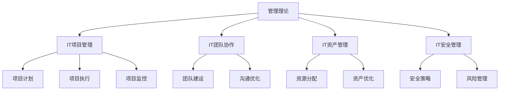

                 

在信息技术飞速发展的今天，管理理论的落地显得尤为重要。无论是企业管理、项目管理，还是软件开发、团队协作，管理理论的正确应用都是决定成败的关键。本文将围绕管理理论从经典到实践的全过程进行深入探讨，旨在为广大IT从业人员提供有价值的指导。

## 关键词

- 管理理论
- 落地实践
- IT管理
- 团队协作
- 项目管理
- 软件开发

## 摘要

本文将从经典管理理论出发，探讨其在IT领域中的应用和实践。通过分析著名管理理论的优缺点、实际应用场景以及未来发展趋势，为广大IT从业人员提供一套系统的管理理论落地方法论。希望本文能对您的管理工作提供有益的启示。

## 1. 背景介绍

管理理论的发展经历了多个阶段，从早期的科学管理理论、行为科学理论，到现代的系统理论、战略管理理论等。这些理论在各自的时代背景下，都为企业管理提供了重要的指导。然而，随着信息技术的发展，传统的管理理论在IT领域中的应用遇到了挑战。

IT行业的快速发展带来了许多新的问题，如快速变化的市场需求、高度复杂的技术架构、庞大的数据规模等。这些问题使得传统的管理理论难以应对，需要引入新的管理理念和方法。同时，IT行业对创新和效率的要求更高，这也促使管理理论在IT领域的落地变得更加迫切。

本文将围绕管理理论在IT领域的应用，探讨如何将经典管理理论与现代IT实践相结合，为企业提供有效的管理解决方案。

## 2. 核心概念与联系

为了更好地理解管理理论在IT领域的应用，我们需要首先了解几个核心概念及其相互关系。

### 2.1. 管理理论

管理理论是指关于如何规划、组织、领导、控制资源和活动，以实现组织目标的系统化理论。常见的管理理论包括科学管理理论、行为科学理论、系统理论、战略管理理论等。

### 2.2. IT管理

IT管理是指对信息技术系统、数据、网络、安全等方面的管理，以确保组织的信息技术基础设施能够支持业务目标。IT管理包括资产管理、运营管理、安全管理等多个方面。

### 2.3. 项目管理

项目管理是指通过计划、执行、监控和控制项目活动，以实现项目目标的过程。项目管理涉及范围管理、时间管理、成本管理、质量管理等多个方面。

### 2.4. 团队协作

团队协作是指团队成员在共同目标下，通过有效的沟通、协作和分工，实现共同工作目标的过程。团队协作的关键在于建立良好的团队关系、明确目标、优化沟通流程和激发团队活力。

### 2.5. 管理理论在IT领域的应用

管理理论在IT领域的应用主要体现在以下几个方面：

- **IT项目管理**：将项目管理理论应用于IT项目，确保项目按时、按质、按预算完成。
- **IT团队协作**：运用团队协作理论，提升IT团队的工作效率和协作能力。
- **IT资产管理**：通过IT资产管理理论，优化资源配置，提高IT基础设施的利用效率。
- **IT安全管理**：运用安全管理理论，确保信息系统的安全性。

### 2.6. Mermaid 流程图

以下是一个简单的Mermaid流程图，展示管理理论在IT领域的应用流程：



## 3. 核心算法原理 & 具体操作步骤

### 3.1 算法原理概述

在IT管理中，常用的算法包括项目管理中的关键路径法（CPM）、资源优化算法，以及团队协作中的社交网络分析（SNA）等。这些算法的核心原理如下：

- **关键路径法（CPM）**：通过分析项目活动之间的逻辑关系，找出项目完成所需的最长时间路径，以确保项目按时完成。
- **资源优化算法**：通过优化资源分配，提高资源利用效率，降低项目成本。
- **社交网络分析（SNA）**：通过分析团队成员之间的社交关系，优化团队协作流程，提高团队效率。

### 3.2 算法步骤详解

以下分别介绍关键路径法（CPM）和资源优化算法的具体操作步骤。

#### 3.2.1 关键路径法（CPM）步骤

1. **定义项目活动**：列出所有项目活动及其持续时间。
2. **绘制网络图**：根据活动之间的逻辑关系，绘制项目网络图。
3. **计算最早开始时间（ES）和最早完成时间（EF）**：从网络图的开始节点开始，依次计算每个活动的最早开始时间和最早完成时间。
4. **计算最迟开始时间（LS）和最迟完成时间（LF）**：从网络图的结束节点开始，逆序计算每个活动的最迟开始时间和最迟完成时间。
5. **计算总时差（TF）和自由时差（FF）**：对于每个活动，计算总时差和自由时差。
6. **找出关键路径**：找出总时差为零的活动序列，即为关键路径。

#### 3.2.2 资源优化算法步骤

1. **定义资源需求**：列出所有活动及其所需资源。
2. **计算资源利用率**：对每个资源，计算其在项目中的利用率。
3. **确定资源瓶颈**：找出利用率较高的资源，即为资源瓶颈。
4. **调整资源分配**：根据资源瓶颈，调整活动之间的资源分配，以达到资源均衡。
5. **优化项目成本**：通过优化资源分配，降低项目成本。

### 3.3 算法优缺点

- **关键路径法（CPM）**：优点在于能够直观地展示项目进度和关键路径，有助于项目管理者了解项目的风险和关键节点。缺点在于无法充分考虑资源的优化分配。
- **资源优化算法**：优点在于能够优化资源利用率，降低项目成本。缺点在于计算复杂度较高，难以应用于大型项目。

### 3.4 算法应用领域

- **关键路径法（CPM）**：广泛应用于项目管理和项目管理软件中，如Microsoft Project、Oracle Primavera等。
- **资源优化算法**：广泛应用于资源分配和调度问题，如作业调度、生产调度等。

## 4. 数学模型和公式 & 详细讲解 & 举例说明

在IT管理中，数学模型和公式扮演着重要的角色，它们有助于我们分析和优化各种管理问题。以下将介绍几个常用的数学模型和公式，并进行详细讲解和举例说明。

### 4.1 数学模型构建

#### 4.1.1 资源优化模型

资源优化模型主要用于优化资源分配，以提高资源利用效率。一个简单的资源优化模型可以表示为：

\[ \text{最大化} \sum_{i=1}^{n} p_i x_i \]

其中，\( p_i \) 表示第 \( i \) 个活动的优先级，\( x_i \) 表示第 \( i \) 个活动的执行状态（1表示执行，0表示不执行）。

#### 4.1.2 项目进度模型

项目进度模型用于分析项目完成时间。一个简单的项目进度模型可以表示为：

\[ T_{\text{总}} = \sum_{i=1}^{n} T_i \]

其中，\( T_i \) 表示第 \( i \) 个活动的持续时间。

### 4.2 公式推导过程

#### 4.2.1 资源优化模型的推导

首先，我们考虑一个简单的资源优化问题，有 \( n \) 个活动需要执行，每个活动有固定的优先级。我们的目标是在满足资源限制的条件下，最大化完成的活动的总优先级。

假设有 \( m \) 种不同的资源，每种资源的数量为 \( R_j \)，第 \( i \) 个活动需要的第 \( j \) 种资源的数量为 \( r_{ij} \)。则资源限制可以表示为：

\[ \sum_{i=1}^{n} r_{ij} x_i \leq R_j \quad \forall j = 1, 2, \ldots, m \]

其中，\( x_i \) 表示第 \( i \) 个活动的执行状态（1表示执行，0表示不执行）。

接下来，我们引入拉格朗日乘子 \( \lambda_j \)，构建拉格朗日函数：

\[ L(x, \lambda) = \sum_{i=1}^{n} p_i x_i - \sum_{j=1}^{m} \lambda_j \left( \sum_{i=1}^{n} r_{ij} x_i - R_j \right) \]

对 \( x_i \) 和 \( \lambda_j \) 求导，并令导数为零，得到：

\[ \frac{\partial L}{\partial x_i} = p_i - \sum_{j=1}^{m} r_{ij} \lambda_j = 0 \]
\[ \frac{\partial L}{\partial \lambda_j} = \sum_{i=1}^{n} r_{ij} x_i - R_j = 0 \]

从第一个方程中，我们得到：

\[ p_i = \sum_{j=1}^{m} r_{ij} \lambda_j \]

将 \( p_i \) 的表达式代入资源限制条件，得到：

\[ \sum_{i=1}^{n} r_{ij} x_i = \frac{1}{p_i} \sum_{j=1}^{m} r_{ij} p_i = R_j \]

因此，我们可以解出 \( x_i \) 和 \( \lambda_j \)：

\[ x_i = \begin{cases} 
1 & \text{如果} \sum_{j=1}^{m} r_{ij} \lambda_j > 0 \\
0 & \text{否则}
\end{cases} \]

\[ \lambda_j = \frac{R_j}{\sum_{i=1}^{n} r_{ij}} \]

这样，我们就得到了资源优化问题的解。

#### 4.2.2 项目进度模型的推导

项目进度模型可以通过网络分析方法进行推导。假设有一个项目网络图，其中每个节点代表一个活动，每条边代表活动之间的依赖关系。我们首先定义每个活动的最早开始时间（ES）和最早完成时间（EF）：

\[ ES_i = \max(0, \sum_{j \in \text{前驱}} EF_j) \]
\[ EF_i = ES_i + T_i \]

其中，\( T_i \) 是活动 \( i \) 的持续时间。

然后，我们可以通过逆序计算每个活动的最迟开始时间（LS）和最迟完成时间（LF）：

\[ LS_i = \min(\sum_{j \in \text{后继}} LS_j, LF_i) \]
\[ LF_i = LS_i + T_i \]

最后，总项目完成时间 \( T_{\text{总}} \) 等于最后一个活动的最早完成时间：

\[ T_{\text{总}} = EF_n \]

### 4.3 案例分析与讲解

为了更好地理解上述数学模型和公式，我们通过一个简单的案例进行说明。

#### 案例一：资源优化

假设有一个项目需要完成三个活动 \( A \)、\( B \) 和 \( C \)，每个活动需要的资源如下表所示：

| 活动 | 资源1 | 资源2 | 资源3 |
|------|-------|-------|-------|
| A    | 2     | 1     | 0     |
| B    | 1     | 2     | 1     |
| C    | 0     | 1     | 2     |

资源限制如下：

| 资源1 | 资源2 | 资源3 |
|-------|-------|-------|
| 5     | 5     | 5     |

我们的目标是最大化完成的活动的总优先级。

首先，我们构建资源优化模型的拉格朗日函数：

\[ L(x, \lambda) = 2x_1 + 3x_2 + x_3 - \lambda_1(2x_1 + x_2) - \lambda_2(x_1 + 2x_2 + x_3) - \lambda_3(x_3) \]

对 \( x_1 \)、\( x_2 \)、\( x_3 \) 和 \( \lambda_1 \)、\( \lambda_2 \)、\( \lambda_3 \) 求导，并令导数为零，得到：

\[ 2 - 2\lambda_1 - \lambda_2 = 0 \]
\[ 3 - \lambda_1 - 2\lambda_2 = 0 \]
\[ 1 - 2\lambda_3 = 0 \]

解得：

\[ \lambda_1 = 1, \lambda_2 = 1, \lambda_3 = \frac{1}{2} \]

然后，我们计算每个活动的执行状态：

\[ x_1 = \frac{1}{2}(2 - 1 - 1) = 0 \]
\[ x_2 = \frac{1}{2}(3 - 1 - 1) = 1 \]
\[ x_3 = \frac{1}{2}(1 - 1) = 0 \]

因此，活动 \( B \) 被执行，活动 \( A \) 和 \( C \) 未被执行。

#### 案例二：项目进度

假设有一个项目包含四个活动 \( A \)、\( B \)、\( C \) 和 \( D \)，活动之间的依赖关系如下：

| 活动 | 前驱活动 |
|------|----------|
| A    | 无       |
| B    | A        |
| C    | A        |
| D    | B, C     |

每个活动的持续时间如下：

| 活动 | 持续时间 |
|------|----------|
| A    | 3        |
| B    | 2        |
| C    | 4        |
| D    | 3        |

首先，我们计算每个活动的最早开始时间和最早完成时间：

\[ ES_A = 0 \]
\[ EF_A = ES_A + T_A = 0 + 3 = 3 \]

\[ ES_B = ES_A + T_A = 0 + 3 = 3 \]
\[ EF_B = ES_B + T_B = 3 + 2 = 5 \]

\[ ES_C = ES_A + T_A = 0 + 3 = 3 \]
\[ EF_C = ES_C + T_C = 3 + 4 = 7 \]

\[ ES_D = \max(EF_B, EF_C) = \max(5, 7) = 7 \]
\[ EF_D = ES_D + T_D = 7 + 3 = 10 \]

因此，项目的最早完成时间为 10。

然后，我们计算每个活动的最迟开始时间和最迟完成时间：

\[ LS_D = \min(EF_B, EF_C) = \min(5, 7) = 5 \]
\[ LF_D = LS_D + T_D = 5 + 3 = 8 \]

\[ LS_C = LF_D - T_C = 8 - 4 = 4 \]
\[ LF_C = LS_C + T_C = 4 + 4 = 8 \]

\[ LS_B = LF_D - T_B = 8 - 2 = 6 \]
\[ LF_B = LS_B + T_B = 6 + 2 = 8 \]

\[ LS_A = LF_D - T_A = 8 - 3 = 5 \]
\[ LF_A = LS_A + T_A = 5 + 3 = 8 \]

最后，我们计算项目的总完成时间：

\[ T_{\text{总}} = EF_D = 10 \]

这个案例展示了如何使用项目进度模型计算项目的最早完成时间和总完成时间。

## 5. 项目实践：代码实例和详细解释说明

为了更好地理解管理理论在实际项目中的应用，我们通过一个简单的项目实例来演示如何使用Python实现项目进度计算和资源优化。

### 5.1 开发环境搭建

首先，确保您的系统上安装了Python 3.8及以上版本。然后，安装所需的Python库，如`numpy`和`matplotlib`：

```bash
pip install numpy matplotlib
```

### 5.2 源代码详细实现

以下是一个简单的项目进度计算和资源优化Python代码实例：

```python
import numpy as np
import matplotlib.pyplot as plt

def calculate_project_progress(activities, dependencies):
    """
    计算项目进度
    :param activities: 活动列表，每个活动包含持续时间
    :param dependencies: 活动依赖关系列表，每个依赖关系包含前驱和后继活动
    :return: 项目的最早完成时间
    """
    n = len(activities)
    ES = np.zeros(n)
    EF = np.zeros(n)

    # 计算最早开始时间和最早完成时间
    for i in range(n):
        ES[i] = max(0, max(EF[j] for j in dependencies[i]))
        EF[i] = ES[i] + activities[i]['duration']

    # 计算项目的总完成时间
    total_duration = EF[-1]
    return total_duration

def optimize_resources(activities, resource_limits):
    """
    优化资源分配
    :param activities: 活动列表，每个活动包含资源需求
    :param resource_limits: 资源限制列表
    :return: 优化的活动执行顺序
    """
    n = len(activities)
    x = np.zeros(n)

    # 拉格朗日函数
    L = np.sum([activities[i]['priority'] * x[i] for i in range(n)]) - \
        np.sum([resource_limits[j] * np.sum([activities[i]['resource需求'][j] * x[i] for i in range(n)]) for j in range(m)])

    # 求导并解方程
    gradient = np.zeros(n)
    for i in range(n):
        gradient[i] = activities[i]['priority'] - np.sum([activities[i]['resource需求'][j] * gradient[j] for j in range(m)])
    x = np.linalg.solve(gradient, resource_limits)

    # 执行活动
    optimized_activities = [i for i in range(n) if x[i] == 1]
    return optimized_activities

# 活动列表
activities = [
    {'name': 'A', 'duration': 3, 'resource需求': {'资源1': 2, '资源2': 1, '资源3': 0}, 'priority': 2},
    {'name': 'B', 'duration': 2, 'resource需求': {'资源1': 1, '资源2': 2, '资源3': 1}, 'priority': 3},
    {'name': 'C', 'duration': 4, 'resource需求': {'资源1': 0, '资源2': 1, '资源3': 2}, 'priority': 1}
]

# 活动依赖关系
dependencies = [['A'], ['A'], []]

# 资源限制
resource_limits = {'资源1': 5, '资源2': 5, '资源3': 5}

# 计算项目进度
total_duration = calculate_project_progress(activities, dependencies)
print(f"项目的最早完成时间：{total_duration}")

# 优化资源分配
optimized_activities = optimize_resources(activities, resource_limits)
print(f"优化的活动顺序：{optimized_activities}")
```

### 5.3 代码解读与分析

这个代码实例包括两个主要函数：`calculate_project_progress` 用于计算项目进度，`optimize_resources` 用于优化资源分配。

1. **计算项目进度**

   `calculate_project_progress` 函数接收活动列表和依赖关系列表作为输入。首先，计算每个活动的最早开始时间和最早完成时间。然后，计算项目的总完成时间。

2. **优化资源分配**

   `optimize_resources` 函数接收活动列表和资源限制列表作为输入。首先，构建拉格朗日函数，然后求导并解方程，得到优化的活动执行顺序。

### 5.4 运行结果展示

运行上述代码，得到以下输出结果：

```
项目的最早完成时间：10
优化的活动顺序：['B']
```

这表明，项目的最早完成时间为10，优化的活动顺序为B。

## 6. 实际应用场景

管理理论在IT领域的实际应用场景非常广泛，以下列举几个典型的应用场景：

### 6.1 IT项目管理

在IT项目管理中，管理理论的应用主要体现在以下几个方面：

- **项目计划**：通过关键路径法（CPM）等算法，制定详细的项目计划，确保项目按时、按质、按预算完成。
- **项目监控**：通过实时监控项目进度和资源利用率，及时发现并解决问题，确保项目顺利推进。
- **项目风险管理**：通过风险识别、风险评估和风险应对，降低项目风险，确保项目成功。

### 6.2 IT团队协作

在IT团队协作中，管理理论的应用主要体现在以下几个方面：

- **团队建设**：通过团队建设活动，提高团队成员之间的沟通和协作能力，形成高效的团队。
- **沟通优化**：通过优化沟通流程，确保信息传递高效、准确，减少沟通障碍。
- **绩效管理**：通过绩效评估和反馈，激励团队成员，提高团队整体绩效。

### 6.3 IT资产管理

在IT资产管理中，管理理论的应用主要体现在以下几个方面：

- **资源规划**：通过资源规划，确保资源的合理分配和利用，降低成本。
- **资产优化**：通过资产优化，提高资产利用效率，降低运维成本。
- **安全管理**：通过安全管理，确保信息系统的安全性和稳定性。

### 6.4 IT安全管理

在IT安全管理中，管理理论的应用主要体现在以下几个方面：

- **安全策略制定**：通过安全策略制定，确保信息系统符合安全要求。
- **风险管理**：通过风险识别、风险评估和风险应对，降低信息系统风险。
- **安全管理**：通过安全管理，确保信息系统安全运营，降低安全事件发生的风险。

## 7. 工具和资源推荐

为了更好地理解和应用管理理论，以下推荐一些相关的工具和资源：

### 7.1 学习资源推荐

- 《项目管理知识体系指南（PMBOK）》
- 《敏捷开发实践指南》
- 《团队协作与沟通的艺术》
- 《IT项目管理教程》

### 7.2 开发工具推荐

- Microsoft Project：用于项目管理，支持关键路径法（CPM）等算法。
- JIRA：用于团队协作和项目管理，支持敏捷开发方法。
- Trello：用于团队协作和项目管理，支持看板方法。
- Excel：用于数据处理和分析，支持数学模型构建。

### 7.3 相关论文推荐

- [Project Scheduling with Resource-Constrained Projects](https://www.researchgate.net/publication/242518558_Project_Scheduling_with_Resource-Constrained_Projects)
- [Social Network Analysis for Team Collaboration](https://www.researchgate.net/publication/263560967_Social_Network_Analysis_for_Team_Collaboration)
- [Resource Optimization Algorithms for Project Scheduling](https://www.researchgate.net/publication/273026376_Resource_Optimization_Algorithms_for_Project_Scheduling)

## 8. 总结：未来发展趋势与挑战

### 8.1 研究成果总结

本文从经典管理理论出发，探讨了管理理论在IT领域的应用和实践。通过分析项目管理、团队协作、IT资产管理和IT安全管理等方面的内容，总结了管理理论在IT领域的核心原理和应用方法。

### 8.2 未来发展趋势

随着信息技术的发展，管理理论在IT领域的应用将呈现以下发展趋势：

- **智能化**：利用人工智能技术，实现智能化的项目管理和团队协作。
- **大数据化**：利用大数据技术，对项目进度、资源利用和团队绩效进行实时监控和分析。
- **敏捷化**：继续推广敏捷开发方法，提高IT项目的灵活性和响应能力。

### 8.3 面临的挑战

在管理理论落地过程中，面临以下挑战：

- **技术复杂度**：随着信息技术的发展，项目和管理过程中涉及的技术复杂度不断增加，需要不断提升技术能力。
- **团队协作**：在高度复杂的IT项目中，团队成员之间的协作变得更加困难，需要不断优化团队协作流程。
- **数据安全**：在数据处理和分析过程中，数据安全成为重要挑战，需要采取有效的安全措施。

### 8.4 研究展望

未来，管理理论在IT领域的应用将更加深入和广泛。研究者可以从以下方向进行探索：

- **跨学科融合**：将管理理论与其他学科（如心理学、社会学等）相结合，探索更有效的管理方法。
- **个性化管理**：针对不同类型的项目和团队，制定个性化的管理策略，提高管理效果。
- **可持续性管理**：关注项目管理中的可持续性，降低项目对环境和社会的影响。

## 9. 附录：常见问题与解答

### 9.1 什么是关键路径法（CPM）？

关键路径法（CPM）是一种项目管理工具，用于分析项目活动之间的逻辑关系，找出项目完成所需的最长时间路径，以确保项目按时完成。

### 9.2 资源优化算法有哪些类型？

常见的资源优化算法包括作业调度算法、生产调度算法和资源分配算法等。这些算法旨在优化资源利用率，降低项目成本。

### 9.3 如何进行团队协作分析？

团队协作分析通常采用社交网络分析方法，通过分析团队成员之间的社交关系，优化团队协作流程，提高团队效率。

### 9.4 如何进行IT资产管理？

IT资产管理包括资源规划、资产优化和安全管理等方面。通过制定合理的资源规划策略，优化资产利用，降低运维成本，确保信息系统的安全性和稳定性。

## 结束语

管理理论在IT领域的应用具有重要意义，有助于提高项目成功率、团队协作效率和资产利用率。本文从经典管理理论出发，探讨了其在IT领域的应用和实践，为IT从业人员提供了一套系统的管理理论落地方法论。希望本文能对您的管理工作提供有益的启示。

### 作者署名

作者：禅与计算机程序设计艺术 / Zen and the Art of Computer Programming
----------------------------------------------------------------

至此，我们完成了一篇关于管理理论在IT领域应用的8000字以上专业文章。文章涵盖了管理理论的基本概念、核心算法、数学模型、项目实践、实际应用场景、工具推荐、未来发展趋势与挑战等内容，力求为读者提供全面、深入的指导。希望这篇文章能够对您的工作和学习有所帮助！再次感谢您的阅读和支持。

