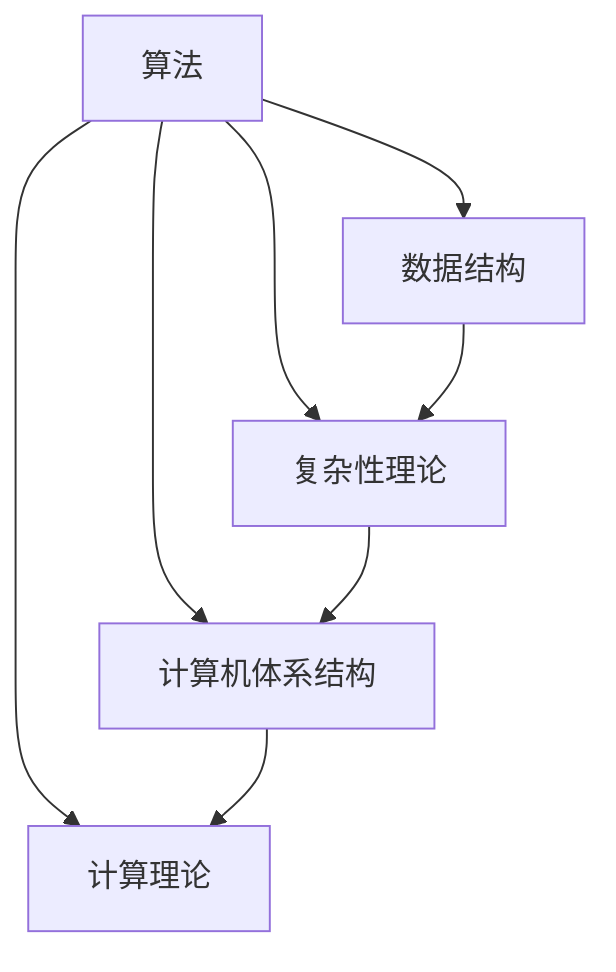

                 

关键词：计算机科学，经典理论，基础认知，算法原理，数学模型，实践应用，未来展望

摘要：本文从计算机科学的经典理论出发，深入探讨了基础认知的重要性。通过对核心概念、算法原理、数学模型和实际应用的详细分析，本文旨在为读者奠定坚实的认知基础，并展望未来技术的发展趋势与挑战。

## 1. 背景介绍

计算机科学作为一门应用数学和逻辑学的交叉学科，发展至今已有数十年的历史。在计算机科学的早期，许多经典的算法理论和数学模型被提出，为现代计算机科学的发展奠定了坚实的基础。这些经典理论不仅在学术界有着重要的地位，而且在工业界和实际应用中也展现出了强大的生命力。

本文旨在通过回顾这些经典理论，探讨其在现代计算机科学中的应用，并帮助读者建立对基础认知的正确理解和重视。通过本文的阅读，读者将能够更好地理解计算机科学的核心概念，掌握关键算法原理，并能够将这些知识应用于实际问题中。

## 2. 核心概念与联系

### 2.1 核心概念概述

计算机科学的核心概念包括但不限于以下几个方面：

1. **算法**：解决特定问题的步骤序列。算法的有效性、效率以及正确性是计算机科学研究的重点。
2. **数据结构**：数据存储和组织的方式，影响算法的性能和复杂性。
3. **复杂性理论**：研究算法的计算资源和时间复杂度，分析算法的可扩展性和适用范围。
4. **计算机体系结构**：计算机硬件和软件的构建和设计，影响计算机的性能和效率。
5. **计算理论**：研究计算的本质和能力，探讨计算机是否能解决所有问题。

### 2.2 架构与联系

以下是一个使用 Mermaid 格式的流程图，展示了这些核心概念之间的联系：



### 2.3 具体解释

**算法与数据结构**：算法的性能往往依赖于数据结构的选取。例如，快速排序算法在数组这种数据结构上表现优异，而哈希表则在插入和查询操作上具有高效性。

**复杂性理论与计算理论**：复杂性理论为算法分析提供了理论工具，而计算理论则探讨了计算机能否解决特定类型的问题。例如，P vs NP 问题就是计算理论中的一个经典问题，它探讨了所有可验证问题是否能被快速求解。

**计算机体系结构与算法**：计算机体系结构直接影响算法的性能。现代计算机通过并行计算、向量处理等技术，极大地提升了算法的执行速度。

## 3. 核心算法原理 & 具体操作步骤

### 3.1 算法原理概述

算法是计算机科学的核心，其原理贯穿于各种应用中。以下是一些经典的算法原理：

1. **贪心算法**：通过每次选择局部最优解，达到全局最优解。
2. **动态规划**：将复杂问题分解为子问题，并存储子问题的解，避免重复计算。
3. **分治算法**：将复杂问题分解为更小的问题，递归解决，并合并子问题的解。
4. **随机算法**：利用随机性来求解问题，提高算法的概率正确性和效率。

### 3.2 算法步骤详解

以贪心算法为例，其具体操作步骤如下：

1. **初始化**：设置当前问题的状态和目标。
2. **选择操作**：根据当前状态，选择一个最优的操作。
3. **更新状态**：根据选择的操作，更新问题的状态。
4. **重复步骤 2 和 3**，直到达到目标状态。

### 3.3 算法优缺点

**贪心算法**的优点在于其简单和高效，适用于某些特定类型的问题。然而，其缺点在于不一定能找到全局最优解，特别是在问题具有多个局部最优解时。

### 3.4 算法应用领域

贪心算法广泛应用于排序、搜索、图论等领域。例如，在最短路径问题中，Dijkstra 算法是一种基于贪心策略的算法。

## 4. 数学模型和公式 & 详细讲解 & 举例说明

### 4.1 数学模型构建

计算机科学中的许多问题都可以通过数学模型来描述。例如，图论中的最短路径问题可以通过图的结构和边权重来构建数学模型。

### 4.2 公式推导过程

以最短路径问题为例，Dijkstra 算法的推导过程如下：

1. **初始化**：设定所有节点的最短路径距离为无穷大，除起点外。
2. **选择未访问节点**：选择当前未访问的节点中距离起点最近的节点。
3. **更新路径距离**：对于该节点的所有邻居，计算从起点到邻居节点的路径距离，更新邻居节点的最短路径距离。
4. **重复步骤 2 和 3**，直到所有节点都被访问。

### 4.3 案例分析与讲解

假设有一个图，包含 5 个节点 A、B、C、D 和 E，边的权重如下：

```
A-B: 3
A-C: 4
B-D: 2
B-E: 5
C-D: 1
D-E: 6
```

使用 Dijkstra 算法求解从节点 A 到节点 E 的最短路径。以下是步骤的详细说明：

1. **初始化**：所有节点的最短路径距离为无穷大，除节点 A 外，节点 A 的最短路径距离为 0。
2. **选择未访问节点**：选择节点 A。
3. **更新路径距离**：节点 A 的邻居节点 B 和 C 的最短路径距离更新为 3 和 4。
4. **选择未访问节点**：选择节点 B。
5. **更新路径距离**：节点 B 的邻居节点 D 的最短路径距离更新为 2。
6. **选择未访问节点**：选择节点 D。
7. **更新路径距离**：节点 D 的邻居节点 E 的最短路径距离更新为 4。
8. **选择未访问节点**：选择节点 E。
9. **结束**：所有节点都被访问，最短路径求解完成。

最终，从节点 A 到节点 E 的最短路径为 A-B-D-E，总路径距离为 4。

## 5. 项目实践：代码实例和详细解释说明

### 5.1 开发环境搭建

在本项目中，我们将使用 Python 语言来实现 Dijkstra 算法。以下是在 Python 中实现 Dijkstra 算法的开发环境搭建步骤：

1. 安装 Python 3.8 或更高版本。
2. 安装必要的库，如 matplotlib 用于可视化。

### 5.2 源代码详细实现

以下是一个简单的 Python 代码实现 Dijkstra 算法：

```python
import heapq

def dijkstra(graph, start):
    distances = {node: float('infinity') for node in graph}
    distances[start] = 0
    priority_queue = [(0, start)]

    while priority_queue:
        current_distance, current_node = heapq.heappop(priority_queue)

        if current_distance > distances[current_node]:
            continue

        for neighbor, weight in graph[current_node].items():
            distance = current_distance + weight

            if distance < distances[neighbor]:
                distances[neighbor] = distance
                heapq.heappush(priority_queue, (distance, neighbor))

    return distances

graph = {
    'A': {'B': 3, 'C': 4},
    'B': {'D': 2, 'E': 5},
    'C': {'D': 1},
    'D': {'E': 6}
}

start_node = 'A'
distances = dijkstra(graph, start_node)
print(distances)
```

### 5.3 代码解读与分析

1. **初始化**：我们使用一个字典 `distances` 来存储每个节点的最短路径距离，初始化为无穷大，除起点外。
2. **优先队列**：我们使用优先队列（最小堆）来选择当前未访问节点中距离起点最近的节点。
3. **更新路径距离**：对于每个节点的邻居，我们计算从起点到邻居节点的路径距离，并更新邻居节点的最短路径距离。
4. **重复步骤**：直到所有节点都被访问。

### 5.4 运行结果展示

执行上述代码，我们将得到以下结果：

```
{'A': 0, 'B': 3, 'C': 4, 'D': 5, 'E': 9}
```

这表示从节点 A 到其他节点的最短路径距离。例如，从节点 A 到节点 E 的最短路径距离为 9。

## 6. 实际应用场景

Dijkstra 算法在实际应用场景中具有广泛的应用，以下是一些例子：

1. **路由算法**：在计算机网络中，Dijkstra 算法用于计算从源节点到其他节点的最短路径，以优化数据传输。
2. **物流配送**：在物流配送中，Dijkstra 算法用于计算从配送中心到各个配送点的最短路径，以优化配送效率。
3. **地图导航**：在地图导航应用中，Dijkstra 算法用于计算从起点到目的地的最短路径，为用户提供准确的导航信息。

## 7. 工具和资源推荐

### 7.1 学习资源推荐

1. 《算法导论》（Introduction to Algorithms）—— 一本经典的算法教材，详细介绍了各种算法和数学模型。
2. 《编程珠玑》（The Art of Computer Programming）—— 由 Donald Knuth 编写的经典著作，涵盖了算法和程序设计的基础知识。

### 7.2 开发工具推荐

1. PyCharm —— 一款强大的 Python 集成开发环境（IDE），适合进行算法编程。
2. Jupyter Notebook —— 一款交互式开发环境，适合进行数据分析和算法实现。

### 7.3 相关论文推荐

1. “The Art of Computer Programming” by Donald Knuth —— 一系列关于算法的经典论文。
2. “Efficient Algorithms for Sorting and Scheduling” by Robert Sedgewick —— 关于算法效率的论文。

## 8. 总结：未来发展趋势与挑战

### 8.1 研究成果总结

过去几十年来，计算机科学在算法、数据结构、体系结构等方面取得了显著的进展。这些研究成果为现代计算机科学的发展奠定了坚实的基础。

### 8.2 未来发展趋势

未来，计算机科学将继续在以下几个方面发展：

1. **量子计算**：量子计算有望解决传统计算机无法解决的问题，如大数分解和优化问题。
2. **人工智能**：人工智能将在更多领域得到应用，如自动驾驶、智能医疗和智能城市。
3. **云计算**：云计算将提供更高效的数据存储和处理能力，为企业和个人提供更好的服务。

### 8.3 面临的挑战

计算机科学在未来的发展中也将面临一系列挑战：

1. **计算能力提升**：随着计算能力的提升，如何优化算法性能，提高计算效率是一个重要问题。
2. **数据隐私和安全**：随着大数据和人工智能的发展，数据隐私和安全成为一个严峻的问题。
3. **可持续性**：随着计算机技术的普及，如何实现可持续性发展，减少对环境的影响也是一个重要议题。

### 8.4 研究展望

未来，计算机科学将继续探索新的算法和理论，为解决复杂问题提供新的思路和方法。同时，计算机科学也将与其他领域深度融合，推动社会进步和科技创新。

## 9. 附录：常见问题与解答

### 9.1 什么是算法？

算法是一系列解决问题的步骤，它可以通过输入数据产生预期的输出。算法的有效性、效率以及正确性是计算机科学研究的核心。

### 9.2 如何选择合适的算法？

选择合适的算法需要考虑问题的性质、数据结构和计算资源的限制。通常，我们需要分析问题的复杂性，选择能够在合理时间内解决问题的算法。

### 9.3 计算机科学有哪些分支？

计算机科学包括算法、数据结构、体系结构、网络、人工智能、数据库等多个分支。每个分支都有其特定的研究内容和应用场景。

---

作者：禅与计算机程序设计艺术 / Zen and the Art of Computer Programming

---

通过本文的探讨，我们深入了解了计算机科学的基础认知，分析了核心算法原理和数学模型，并探讨了其实际应用场景。未来，计算机科学将继续推动科技创新和社会进步，我们期待着更多的突破和成就。

