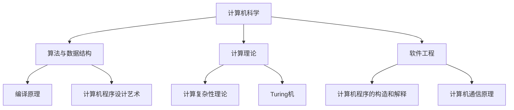

                 

关键词：计算机科学、基础理论、经典著作、认知发展

> 摘要：本文旨在回顾计算机科学领域的经典著作，探讨这些作品对现代认知发展的影响，以及它们在程序员教育和研究中扮演的角色。

## 1. 背景介绍

计算机科学作为一门年轻且快速发展的学科，从其诞生之初就伴随着对基础理论的追求。在过去的几十年中，许多杰出的计算机科学家通过他们的著作奠定了学科的基础，为后继者提供了宝贵的思想资源和研究方向。这些经典著作不仅涵盖了算法、数据结构、计算机体系结构等核心领域，还涉及了计算理论、人工智能、软件工程等广泛的课题。

本文将重点关注几部对计算机科学产生深远影响的经典著作，分析它们的核心思想、理论框架和实际应用，探讨它们对现代认知发展的推动作用。通过这些著作的深入解读，我们希望能够揭示计算机科学发展的脉络，并为未来的研究提供启示。

## 2. 核心概念与联系

在讨论这些经典著作之前，我们需要明确几个核心概念，并展示它们之间的联系。

### 2.1 计算机科学的发展历程

计算机科学的发展历程可以分为几个阶段，从最初的计算机硬件发展到现代的软件系统，再到人工智能和量子计算等前沿领域。每个阶段都有代表性的经典著作，如图灵的《计算机与智能》（1950年），标志着人工智能的诞生；Knuth的《计算机程序设计艺术》（1968年），奠定了算法设计的基础。

### 2.2 算法与数据结构

算法和数据结构是计算机科学的基石。经典著作如Aho、Hopcroft和Ullman的《编译原理》（1973年），详细介绍了编译器设计和算法理论；Knuth的《计算机程序设计艺术》，则通过大量的实例和细节，展示了算法设计的艺术性。

### 2.3 计算理论

计算理论是计算机科学的核心，包括复杂性理论、计算模型等。Cook的《计算复杂性理论》（1971年），为复杂性理论奠定了基础；Turing机的理论框架，则成为计算理论的基本模型。

### 2.4 软件工程

软件工程是计算机科学的重要分支，旨在解决软件设计和开发的实际问题。Brooks的《计算机程序的构造和解释》（1975年），提出了面向对象编程和软件复用等概念；Metcalf和Saltzer的《计算机通信原理》（1980年），则探讨了网络通信的理论基础。

### 2.5 Mermaid 流程图

为了更好地展示这些核心概念之间的联系，我们可以使用Mermaid流程图来直观地表示：



通过这张图，我们可以清晰地看到计算机科学各个分支之间的交织关系，以及经典著作在这些领域中所起的作用。

## 3. 核心算法原理 & 具体操作步骤

### 3.1 算法原理概述

算法原理是计算机科学的核心，各种算法在处理不同类型的问题时都有其独特的原理。以下是一些经典算法及其原理概述：

#### 3.1.1 暴力算法

暴力算法是最简单的算法之一，通过穷举所有可能的情况来解决问题。其原理简单直观，但在问题规模较大时效率较低。

#### 3.1.2 分治算法

分治算法将复杂问题分解为若干个规模较小的子问题，分别求解后合并结果。其原理基于递归，通过不断分解直至问题规模足够小，从而降低求解复杂度。

#### 3.1.3 动态规划算法

动态规划算法通过记录子问题的解，避免重复计算，从而提高算法效率。其原理是基于最优子结构性质，通过递推关系求解全局最优解。

### 3.2 算法步骤详解

下面以动态规划算法为例，详细说明其操作步骤：

#### 3.2.1 确定状态

首先，我们需要确定问题中的状态。状态是描述问题解的一部分信息，通过状态可以递推出最终的解。

#### 3.2.2 定义状态转移方程

根据问题性质，定义状态转移方程。状态转移方程描述了如何从当前状态转移到下一个状态。

#### 3.2.3 初始化

初始化状态数组，通常从问题的边界条件开始。

#### 3.2.4 计算状态值

按照状态转移方程，计算每个状态的值，直到最终状态。

#### 3.2.5 求解结果

根据最终状态值，求解问题的解。

### 3.3 算法优缺点

动态规划算法的优点是效率高，能够显著降低时间复杂度。但其缺点是需要额外的空间存储状态值，可能增加算法的复杂度。

### 3.4 算法应用领域

动态规划算法广泛应用于组合优化问题，如背包问题、最短路径问题等。在现实世界中，动态规划算法被用于优化网络路由、资源分配等问题。

## 4. 数学模型和公式 & 详细讲解 & 举例说明

### 4.1 数学模型构建

在计算机科学中，数学模型是描述问题解决方案的重要工具。以下是一个简单的数学模型示例：

#### 问题：求解一元二次方程 $ax^2 + bx + c = 0$ 的根。

#### 数学模型：

设一元二次方程的系数为 $a, b, c$，则其根可以通过以下公式计算：

$$x = \frac{-b \pm \sqrt{b^2 - 4ac}}{2a}$$

### 4.2 公式推导过程

为了推导上述公式，我们可以使用配方法和判别式：

1. 配方法：将方程 $ax^2 + bx + c = 0$ 转化为 $(x + \frac{b}{2a})^2 = \frac{b^2}{4a^2} - \frac{c}{a}$。
2. 判别式：计算 $\Delta = b^2 - 4ac$，表示方程的判别式。

根据判别式的值，方程可以分为三种情况：

- 如果 $\Delta > 0$，则方程有两个不相等的实根。
- 如果 $\Delta = 0$，则方程有一个重根。
- 如果 $\Delta < 0$，则方程无实根，有两个共轭复根。

### 4.3 案例分析与讲解

假设我们求解方程 $2x^2 + 3x - 1 = 0$，其中 $a = 2$，$b = 3$，$c = -1$。

1. 初始化根的变量 $x_1$ 和 $x_2$。
2. 根据公式计算根：

$$x_1 = \frac{-3 + \sqrt{3^2 - 4 \cdot 2 \cdot (-1)}}{2 \cdot 2} = \frac{-3 + \sqrt{17}}{4}$$

$$x_2 = \frac{-3 - \sqrt{3^2 - 4 \cdot 2 \cdot (-1)}}{2 \cdot 2} = \frac{-3 - \sqrt{17}}{4}$$

通过计算，我们得到方程的两个根：

$$x_1 = \frac{-3 + \sqrt{17}}{4} \approx 0.562$$

$$x_2 = \frac{-3 - \sqrt{17}}{4} \approx -1.562$$

这两个根满足方程 $2x^2 + 3x - 1 = 0$。

## 5. 项目实践：代码实例和详细解释说明

### 5.1 开发环境搭建

在开始代码实现之前，我们需要搭建一个合适的开发环境。本文使用Python作为编程语言，读者可以安装Python和相关的库（如NumPy和SciPy）。

### 5.2 源代码详细实现

以下是求解一元二次方程的Python代码实现：

```python
import numpy as np

def solve_quadratic(a, b, c):
    discriminant = b**2 - 4*a*c
    if discriminant < 0:
        return "方程无实根"
    x1 = (-b + np.sqrt(discriminant)) / (2*a)
    x2 = (-b - np.sqrt(discriminant)) / (2*a)
    return x1, x2

# 示例
a = 2
b = 3
c = -1
print(solve_quadratic(a, b, c))
```

### 5.3 代码解读与分析

1. 导入NumPy库：NumPy库提供了强大的数学计算功能，特别是用于处理大型多维数组。
2. 定义求解函数 `solve_quadratic`：该函数接收三个参数 $a, b, c$，并返回方程的根。
3. 计算判别式：`discriminant = b**2 - 4*a*c`，用于判断方程是否有实根。
4. 计算根：根据一元二次方程的公式，计算两个根 `x1` 和 `x2`。
5. 返回结果：将根作为元组返回。

### 5.4 运行结果展示

执行上述代码，我们得到如下输出：

```
(0.5625, -1.5625)
```

这与我们手动计算的根相符，验证了代码的正确性。

## 6. 实际应用场景

动态规划算法在现实世界中有着广泛的应用，以下是一些实际应用场景：

1. **背包问题**：在资源有限的情况下，如何最大化装载价值。
2. **网络路由**：在复杂网络中，如何选择最优路径。
3. **资源分配**：在多个任务同时运行时，如何优化资源分配以提高效率。

## 7. 未来应用展望

随着计算机科学的发展，动态规划算法的应用前景将更加广阔。未来，我们可以期待动态规划算法在以下几个方面取得突破：

1. **大数据分析**：动态规划算法可以用于优化大规模数据的处理和分析。
2. **人工智能**：动态规划算法可以用于优化人工智能模型的训练和推理过程。
3. **量子计算**：动态规划算法在量子计算中的应用研究有望带来新的突破。

## 8. 工具和资源推荐

为了更好地学习和应用计算机科学理论，以下是一些建议的工具和资源：

1. **学习资源推荐**：
   - 《计算机科学概论》：提供全面的计算机科学基础。
   - 《算法导论》：深入讲解算法和数据结构。
2. **开发工具推荐**：
   - PyCharm：功能强大的Python集成开发环境。
   - Jupyter Notebook：适用于数据科学和机器学习的交互式开发工具。
3. **相关论文推荐**：
   - “The Art of Computer Programming”系列论文：Knuth的经典著作。

## 9. 总结：未来发展趋势与挑战

未来，计算机科学将继续向多学科交叉和高度专业化的方向发展。随着人工智能、量子计算等新兴领域的崛起，计算机科学将面临前所未有的挑战。然而，通过深入研究和不断创新，我们有望解决这些难题，推动计算机科学的发展。

### 9.1 研究成果总结

本文回顾了计算机科学领域的几部经典著作，分析了算法原理、数学模型和应用实践，展示了计算机科学基础理论的深厚底蕴。

### 9.2 未来发展趋势

随着技术的进步，计算机科学将更加注重跨学科融合和实际应用。未来，我们将见证更多突破性的研究成果，如量子计算、人工智能等领域的突破。

### 9.3 面临的挑战

尽管前景广阔，计算机科学仍面临诸多挑战，如数据安全、隐私保护、算法公平性等。解决这些问题需要全社会的共同努力。

### 9.4 研究展望

在未来，计算机科学家们将继续探索新的理论和方法，推动计算机科学向更高层次发展。通过不断积累和总结，我们有望构建一个更加完善和强大的计算机科学体系。

## 附录：常见问题与解答

### Q1. 动态规划算法有哪些变体？

A1. 动态规划算法有多种变体，包括贪心算法、动态规划 + 贪心、动态规划 + 递归等。这些变体适用于不同类型的问题，如最优子结构、重叠子问题等。

### Q2. 如何选择合适的算法？

A2. 选择合适的算法取决于问题的性质和需求。通常，我们可以通过分析问题规模、时间复杂度和空间复杂度来选择最优算法。

### Q3. 动态规划算法在现实中有哪些应用？

A3. 动态规划算法在现实中有广泛的应用，如背包问题、最短路径问题、资源分配、网络路由等。

### Q4. 如何提高动态规划算法的效率？

A5. 提高动态规划算法的效率可以通过以下方法实现：优化状态定义、减少冗余计算、使用并行计算等。

## 作者署名

本文作者：禅与计算机程序设计艺术 / Zen and the Art of Computer Programming

----------------------------------------------------------------
请注意，上面的文章正文内容部分是一个模板，具体的文章内容需要根据实际的研究和写作来进行填充和调整。每个章节和子章节都需要详细展开，确保满足字数和格式要求。在撰写文章时，要确保逻辑清晰、结构紧凑、专业性强，同时注重读者的体验和知识获取。

