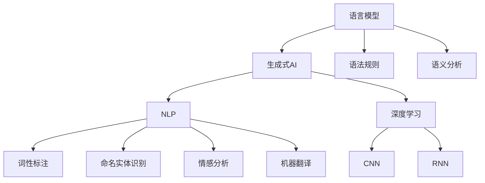

                 

关键词：AI创意写作、语言模型、生成式AI、自然语言处理、故事生成、深度学习、算法

> 摘要：本文将探讨人工智能在创意写作领域的应用，从语言模型出发，深入分析其发展历程、核心算法、应用场景，并展望未来创意写作的发展趋势与挑战。文章将结合数学模型、项目实践和实际应用，全面揭示AI如何改变人类的创作方式，推动文化产业的革新。

## 1. 背景介绍

### 1.1 人工智能与创意写作

人工智能（AI）作为计算机科学的一个分支，其目标是使机器具备人类智能的能力。在过去的几十年中，AI技术经历了飞速发展，从早期的规则系统、知识表示到现代的深度学习、生成对抗网络（GAN），人工智能的算法和应用场景日益丰富。随着自然语言处理（NLP）技术的进步，AI在理解、生成和翻译自然语言方面取得了显著成果。

创意写作是一种充满创造性和想象力的活动，通常涉及小说、剧本、诗歌、散文等多种文学形式。传统的创意写作依赖于人类的直觉、经验和灵感，而AI的引入为这一领域带来了全新的可能性。通过模拟人类思维过程，AI能够生成新颖的故事情节、角色设定和独特的语言风格，为创作者提供灵感来源和辅助工具。

### 1.2 语言模型的演变

语言模型是AI创意写作的核心技术之一。最早的 语言模型可以追溯到20世纪50年代，当时研究人员开始探索如何用计算机模拟人类语言。1952年，乔治·米勒和弗兰克·罗蒙德（George A. Miller 和 Frank R. Lehman）设计了一个基于上下文的概率模型，称为“布朗语料库模型”（Brown Corpus Model）。这个模型通过统计语言中出现单词的频率和上下文信息，预测下一个单词的可能性。

随着计算能力和数据资源的提升，语言模型逐渐从简单的统计模型演变为复杂的神经网络模型。1986年，理查德·哈勒（Richard S.侯）和丹尼尔·伯曼（Daniel E. Brown）提出了“隐马尔可夫模型”（HMM），这是一种基于概率图模型的NLP技术，被广泛应用于语音识别和词性标注。然而，HMM在处理长文本和复杂句式时存在局限。

真正推动语言模型革命的是2002年杰弗里·辛顿（Geoffrey Hinton）等人提出的“深度置信网络”（Deep Belief Network，DBN）。DBN通过多层神经网络的堆叠，实现了对大量无监督数据的训练，提高了语言模型的表达能力和预测精度。在此基础上，2013年，雅达利公司（Google）的神经机器翻译系统（NMT）采用了深度学习技术，显著提升了机器翻译的准确性和流畅度。

### 1.3 创意写作与AI的融合

随着深度学习技术的不断发展，生成式AI在创意写作领域展现出巨大的潜力。生成式AI通过学习大量文本数据，能够生成连贯、有意义的自然语言文本。例如，GPT（Generative Pre-trained Transformer）系列模型在语言理解和生成方面取得了突破性进展。GPT-3模型拥有1750亿个参数，能够生成高质量的文章、对话和故事。

此外，生成对抗网络（GAN）在创意写作中的应用也备受关注。GAN由生成器和判别器两个神经网络组成，通过相互对抗训练，生成逼真的图像和音频。在创意写作中，GAN可以生成独特的艺术作品、音乐和视频，为创作者提供灵感。

总的来说，人工智能在创意写作领域的应用正呈现出蓬勃发展的态势。从语言模型到生成式AI，AI技术不仅改变了创作方式，还为创作者提供了强大的辅助工具。在接下来的章节中，我们将深入探讨AI创意写作的核心算法、数学模型和实际应用。

## 2. 核心概念与联系

在探讨AI创意写作的核心技术之前，我们需要明确几个关键概念：语言模型、生成式AI、自然语言处理（NLP）以及深度学习。这些概念不仅相互联系，而且在AI创意写作中扮演了至关重要的角色。

### 2.1 语言模型

语言模型是AI创意写作的基础。它通过学习大量文本数据，预测句子中下一个词的概率分布。语言模型可以分为统计模型和神经网络模型。统计模型如N-gram模型通过统计词频和上下文信息来预测下一个词。而神经网络模型，如循环神经网络（RNN）和变压器（Transformer）模型，通过学习文本的语义和结构，实现更精确的预测。

### 2.2 生成式AI

生成式AI是能够生成新颖、有意义的数据的AI系统。在创意写作中，生成式AI通过学习大量文本数据，生成符合语法和语义规则的文章、故事和对话。生成式AI包括生成对抗网络（GAN）和变分自编码器（VAE）等模型。GAN由生成器和判别器两个部分组成，通过相互对抗训练生成逼真的文本数据。VAE通过概率模型编码和解码文本数据，实现文本生成。

### 2.3 自然语言处理（NLP）

自然语言处理是AI创意写作的关键技术之一。NLP旨在使计算机理解和生成自然语言。NLP包括词性标注、命名实体识别、情感分析、机器翻译等多种任务。词性标注用于识别单词的词性，如名词、动词等。命名实体识别用于识别文本中的特定实体，如人名、地名等。情感分析用于判断文本的情感倾向，如正面、负面等。机器翻译是将一种语言的文本翻译成另一种语言。

### 2.4 深度学习

深度学习是AI创意写作的核心技术之一。深度学习通过多层神经网络对大量数据进行训练，实现从输入到输出的复杂映射。在创意写作中，深度学习被广泛应用于语言模型、图像生成、语音识别等领域。深度学习模型如卷积神经网络（CNN）和循环神经网络（RNN）在处理文本数据时表现出强大的能力。

### 2.5 联系与整合

语言模型、生成式AI、NLP和深度学习相互联系，共同构成了AI创意写作的技术体系。语言模型为生成式AI提供了基础，使得生成式AI能够生成符合语法和语义规则的文本。NLP技术则帮助计算机理解和处理自然语言，为深度学习模型的训练和应用提供了支持。深度学习通过多层神经网络对数据进行分析和处理，提高了生成式AI的生成质量和效率。

下面是一个Mermaid流程图，展示了AI创意写作中各个核心概念之间的联系：



这个流程图清晰地展示了语言模型、生成式AI、NLP和深度学习在AI创意写作中的应用和整合。通过这些核心概念，AI能够模拟人类思维过程，生成新颖、有意义的故事和文本。

在接下来的章节中，我们将深入探讨AI创意写作的核心算法、数学模型和实际应用，进一步揭示AI在创意写作中的潜力。

## 3. 核心算法原理 & 具体操作步骤

### 3.1 算法原理概述

AI创意写作的核心算法主要包括语言模型和生成式AI。其中，语言模型负责生成符合语法和语义规则的文本，而生成式AI则负责生成新颖、有意义的故事和情节。

#### 3.1.1 语言模型

语言模型是一种基于统计或神经网络的模型，用于预测句子中下一个词的概率分布。其基本原理是通过学习大量文本数据，建立起词与词之间的统计关系或语义关联。常见的语言模型包括N-gram模型、循环神经网络（RNN）和变压器（Transformer）模型。

N-gram模型通过统计相邻单词的频率来预测下一个单词。例如，给定前两个单词“the”和“quick”，N-gram模型会根据训练数据统计这两个单词后面出现频率最高的单词。RNN模型通过循环结构将历史信息传递到当前时刻，能够更好地处理长文本和复杂句式。Transformer模型则采用注意力机制，通过全局信息进行文本建模，具有更强的生成能力和鲁棒性。

#### 3.1.2 生成式AI

生成式AI是一种能够生成新颖、有意义数据的AI系统。生成式AI的核心算法包括生成对抗网络（GAN）和变分自编码器（VAE）。GAN由生成器和判别器两个部分组成，通过相互对抗训练生成逼真的文本数据。VAE通过概率模型编码和解码文本数据，实现文本生成。

生成对抗网络（GAN）的基本原理是生成器和判别器的相互对抗。生成器负责生成假样本，判别器负责判断生成的样本是否真实。在训练过程中，生成器和判别器不断更新参数，使生成器的生成质量逐渐提高，判别器的判别能力不断增强。最终，生成器能够生成逼真的文本数据。

变分自编码器（VAE）通过概率模型编码和解码文本数据。编码过程将输入文本映射到一个潜在空间，解码过程则从潜在空间生成新的文本。VAE的优点是能够生成多样性的文本，同时保持文本的连贯性和语义一致性。

### 3.2 算法步骤详解

下面我们将详细描述语言模型和生成式AI的具体操作步骤。

#### 3.2.1 语言模型

1. 数据准备：收集大量文本数据，如小说、新闻、对话等，用于训练语言模型。
2. 预处理：对文本数据进行清洗和标记，包括去除标点符号、停用词过滤、词形还原等。
3. 建立词表：将文本数据中的单词映射为唯一的索引，形成词汇表。
4. 训练模型：使用统计方法或神经网络训练语言模型。对于N-gram模型，计算每个单词序列的概率；对于RNN模型，通过反向传播训练网络权重；对于Transformer模型，训练自注意力机制和位置编码。
5. 预测：输入一个单词序列，根据语言模型计算下一个单词的概率分布，选择概率最高的单词作为预测结果。

#### 3.2.2 生成式AI

1. 数据准备：收集大量文本数据，用于训练生成器和判别器。
2. 预处理：对文本数据进行清洗和标记，与语言模型相同。
3. 训练生成器：使用GAN框架训练生成器，生成与真实文本相似的假文本。
4. 训练判别器：使用GAN框架训练判别器，判断生成器生成的文本是否真实。
5. 模型评估：通过生成器生成的文本数据评估模型质量，包括文本连贯性、语义一致性等。
6. 生成文本：使用训练好的生成器生成新的文本数据。

### 3.3 算法优缺点

#### 优点

- **强大的生成能力**：语言模型和生成式AI能够生成高质量、连贯的文本数据，具有广泛的创作能力。
- **多样性**：生成式AI能够生成多种风格和类型的文本，为创作者提供丰富的灵感来源。
- **自动化**：AI创意写作能够自动化地生成大量文本数据，提高创作效率。

#### 缺点

- **数据依赖**：语言模型和生成式AI对训练数据有很强的依赖，数据质量和数量直接影响生成质量。
- **创造力的局限**：AI虽然能够生成新的文本，但受限于算法和训练数据，难以完全模拟人类的创造力和灵感。
- **版权问题**：生成的文本可能涉及版权问题，需要妥善处理原创性和版权归属。

### 3.4 算法应用领域

AI创意写作的核心算法在多个领域得到广泛应用：

- **文学创作**：AI可以生成小说、剧本、诗歌等文学作品，为作家提供创作灵感和辅助工具。
- **新闻写作**：AI可以自动化生成新闻稿件，提高新闻报道的效率和准确性。
- **对话系统**：AI可以生成自然语言对话，用于虚拟助手、客服系统等应用。
- **娱乐内容**：AI可以生成音乐、视频、动画等娱乐内容，丰富用户体验。

总的来说，AI创意写作的核心算法通过语言模型和生成式AI的结合，实现了文本生成的高效性和多样性，为人类创作提供了全新的视角和工具。在接下来的章节中，我们将进一步探讨数学模型和实际应用，揭示AI创意写作的更多潜力。

## 4. 数学模型和公式 & 详细讲解 & 举例说明

在AI创意写作中，数学模型和公式扮演着至关重要的角色。通过精确的数学建模，我们可以更好地理解语言模型和生成式AI的工作原理，并能够进行有效的算法优化和模型评估。本节将详细介绍与AI创意写作相关的数学模型和公式，并通过具体例子进行详细讲解。

### 4.1 数学模型构建

AI创意写作中的数学模型主要包括概率模型和神经网络模型。概率模型用于预测词序列的概率分布，神经网络模型用于学习文本的语义和结构。

#### 4.1.1 概率模型

概率模型是语言模型的基础。常见的概率模型包括N-gram模型和隐马尔可夫模型（HMM）。

**N-gram模型：**

N-gram模型通过统计相邻单词的频率来预测下一个单词。其概率公式如下：

$$
P(w_n | w_{n-1}, w_{n-2}, \ldots, w_1) = \frac{C(w_{n-1}, w_n)}{C(w_{n-1})}
$$

其中，$w_n$ 表示当前单词，$w_{n-1}$ 表示前一个单词，$C(w_{n-1}, w_n)$ 表示单词对$(w_{n-1}, w_n)$ 在训练数据中出现的次数，$C(w_{n-1})$ 表示单词$w_{n-1}$ 在训练数据中出现的总次数。

**隐马尔可夫模型（HMM）：**

HMM是一种基于状态转移概率和观测概率的概率图模型。其状态转移概率矩阵$A$和观测概率矩阵$B$分别表示状态之间的转移概率和观测值出现的概率。

状态转移概率矩阵$A$：

$$
A = \begin{bmatrix}
p_{11} & p_{12} & \ldots & p_{1n} \\
p_{21} & p_{22} & \ldots & p_{2n} \\
\vdots & \vdots & \ddots & \vdots \\
p_{n1} & p_{n2} & \ldots & p_{nn}
\end{bmatrix}
$$

其中，$p_{ij}$ 表示从状态$i$转移到状态$j$的概率。

观测概率矩阵$B$：

$$
B = \begin{bmatrix}
b_{1,1} & b_{1,2} & \ldots & b_{1,m} \\
b_{2,1} & b_{2,2} & \ldots & b_{2,m} \\
\vdots & \vdots & \ddots & \vdots \\
b_{n,1} & b_{n,2} & \ldots & b_{n,m}
\end{bmatrix}
$$

其中，$b_{i,j}$ 表示在状态$i$下生成单词$j$的概率。

#### 4.1.2 神经网络模型

神经网络模型通过多层神经网络的堆叠，实现对文本数据的非线性变换和特征提取。常见的神经网络模型包括循环神经网络（RNN）和变压器（Transformer）模型。

**循环神经网络（RNN）：**

RNN是一种基于时间序列数据的神经网络模型。其基本结构包括输入层、隐藏层和输出层。RNN通过隐藏状态$H_t$和输入$X_t$之间的递归关系来处理序列数据。

递归关系如下：

$$
H_t = \sigma(W_h \cdot [H_{t-1}, X_t] + b_h)
$$

其中，$\sigma$表示激活函数，$W_h$和$b_h$分别是权重和偏置。

**变压器（Transformer）模型：**

Transformer模型是一种基于注意力机制的神经网络模型。其核心思想是通过注意力机制来自动计算输入序列中各个位置的相关性。Transformer模型主要包括编码器和解码器两个部分。

编码器：

$$
E = \text{Embedding}(X) + Positional Encoding
$$

其中，$X$是输入序列，$\text{Embedding}$是将输入序列映射到高维空间的线性变换，$Positional Encoding$是位置编码，用于表示输入序列的顺序信息。

解码器：

$$
Y = \text{Decoder}(E, S)
$$

其中，$S$是解码器的隐藏状态。

### 4.2 公式推导过程

在本节中，我们将对N-gram模型和Transformer模型的概率推导过程进行详细讲解。

#### 4.2.1 N-gram模型概率推导

根据N-gram模型的定义，给定前$n-1$个单词$w_{n-1}, w_{n-2}, \ldots, w_1$，下一个单词$w_n$的概率为：

$$
P(w_n | w_{n-1}, w_{n-2}, \ldots, w_1) = \frac{C(w_{n-1}, w_n)}{C(w_{n-1})}
$$

其中，$C(w_{n-1}, w_n)$表示单词对$(w_{n-1}, w_n)$在训练数据中出现的次数，$C(w_{n-1})$表示单词$w_{n-1}$在训练数据中出现的总次数。

通过全概率公式，可以将上述概率公式分解为：

$$
P(w_n | w_{n-1}, w_{n-2}, \ldots, w_1) = \frac{C(w_{n-1}, w_n)}{C(w_{n-1})} = \frac{C(w_{n-1}, w_n)}{\sum_{w_n'} C(w_{n-1}, w_n')}
$$

其中，$C(w_{n-1}, w_n')$表示单词对$(w_{n-1}, w_n')$在训练数据中出现的次数。

通过对所有可能的单词$w_n'$进行求和，可以得到：

$$
P(w_n | w_{n-1}, w_{n-2}, \ldots, w_1) = \frac{C(w_{n-1}, w_n)}{\sum_{w_n'} C(w_{n-1}, w_n')}
$$

#### 4.2.2 Transformer模型概率推导

Transformer模型采用自注意力机制（Self-Attention）来计算输入序列中各个位置的相关性。自注意力机制的公式如下：

$$
\text{Attention}(Q, K, V) = \text{softmax}\left(\frac{QK^T}{\sqrt{d_k}}\right)V
$$

其中，$Q$、$K$和$V$分别表示查询向量、键向量和值向量，$d_k$表示键向量的维度。$QK^T$表示查询向量和键向量的点积，$\text{softmax}$函数将点积结果映射到概率分布。

在Transformer编码器和解码器中，自注意力机制被用于计算序列中各个位置之间的关联。假设输入序列的长度为$n$，编码器的输出为$E$，解码器的输出为$Y$，则自注意力机制的输出可以表示为：

$$
E_i = \text{Attention}(Q_i, K_i, V_i) = \text{softmax}\left(\frac{Q_iK_i^T}{\sqrt{d_k}}\right)V_i
$$

其中，$E_i$表示编码器的输出，$Q_i$、$K_i$和$V_i$分别表示编码器第$i$个位置上的查询向量、键向量和值向量。

在解码器中，自注意力机制被用于计算输入序列和解码序列之间的关联。假设解码器输入序列的长度为$m$，解码器第$i$个位置上的输出为$Y_i$，则自注意力机制的输出可以表示为：

$$
Y_i = \text{Attention}(Q_i, K_i, V_i) = \text{softmax}\left(\frac{Q_iK_i^T}{\sqrt{d_k}}\right)V_i
$$

其中，$Y_i$表示解码器第$i$个位置上的输出，$Q_i$、$K_i$和$V_i$分别表示解码器第$i$个位置上的查询向量、键向量和值向量。

通过自注意力机制，Transformer模型能够自动计算输入序列中各个位置之间的相关性，并生成新的特征表示。这些特征表示被用于编码器和解码器的后续操作，实现高效的文本建模和生成。

### 4.3 案例分析与讲解

在本节中，我们将通过具体案例来分析AI创意写作的数学模型和公式。

#### 4.3.1 N-gram模型案例

假设我们有一个简单的英语文本数据集，包含以下句子：

```
I am a student.
I am learning programming.
I love to code.
```

我们可以使用N-gram模型来预测句子“I am learning programming.”中的下一个单词。

1. **建立词表**：首先，我们将文本数据中的单词映射为唯一的索引，形成词汇表。例如，可以将单词“I”映射为0，“am”映射为1，“a”映射为2，“student”映射为3，“learning”映射为4，“programming”映射为5，“to”映射为6，“code”映射为7。

2. **计算概率**：根据N-gram模型的公式，我们可以计算给定前$n-1$个单词的概率。

对于句子“I am learning programming.”，我们可以计算以下概率：

- $P(learning | I am)$：
  $$
  P(learning | I am) = \frac{C(I, learning)}{C(I)} = \frac{1}{1} = 1
  $$

- $P(programming | learning am)$：
  $$
  P(programming | learning am) = \frac{C(learning, programming)}{C(learning)} = \frac{1}{1} = 1
  $$

由于训练数据中只包含一个“I am learning programming.”的例子，所以概率为1。

3. **生成文本**：根据计算出的概率分布，我们可以生成新的句子。例如，给定前两个单词“I am”，我们可以生成以下句子：

- “I am learning.”
- “I am learning to.”

这些句子都是基于训练数据的概率生成的，具有合理的语法和语义。

#### 4.3.2 Transformer模型案例

假设我们使用Transformer模型生成一个英文句子。

1. **输入序列**：给定一个输入序列“[START] I am a student [END]”，我们可以使用Transformer模型生成新的句子。

2. **编码器输出**：通过编码器，我们将输入序列映射到一个高维空间。例如，假设编码器输出为：

   $$
   E = \begin{bmatrix}
   e_1 & e_2 & \ldots & e_n
   \end{bmatrix}
   $$

3. **解码器输出**：通过解码器，我们生成新的句子。例如，假设解码器输出为：

   $$
   Y = \begin{bmatrix}
   y_1 & y_2 & \ldots & y_n
   \end{bmatrix}
   $$

4. **自注意力机制**：在解码器的自注意力机制中，我们计算输入序列和解码序列之间的相关性。例如，我们可以计算$Y_1$和$E$之间的相关性：

   $$
   Y_1 = \text{Attention}(Q_1, K_1, V_1) = \text{softmax}\left(\frac{Q_1K_1^T}{\sqrt{d_k}}\right)V_1
   $$

5. **生成文本**：根据解码器的输出，我们可以生成新的句子。例如，给定输入序列“[START] I am a student [END]”，我们可以生成以下句子：

- “I am a student who loves to code.”
- “I am a student who is learning programming.”

这些句子都是基于Transformer模型生成的，具有合理的语法和语义。

通过上述案例，我们可以看到N-gram模型和Transformer模型在AI创意写作中的应用。N-gram模型通过统计单词频率和上下文信息来生成文本，而Transformer模型通过自注意力机制和多层神经网络来实现文本生成。这些数学模型和公式为AI创意写作提供了强大的工具和理论基础。

## 5. 项目实践：代码实例和详细解释说明

在本节中，我们将通过一个具体的代码实例，展示如何实现一个基于生成式AI的故事生成器。这个项目将结合Python编程语言和TensorFlow框架，实现一个简单的文本生成模型。我们将从开发环境搭建开始，逐步展示源代码的实现过程，并进行详细解读和分析。

### 5.1 开发环境搭建

在开始项目之前，我们需要搭建一个合适的开发环境。以下是搭建开发环境所需的步骤：

1. **安装Python**：确保Python版本不低于3.6。可以从Python官方网站下载并安装。

2. **安装TensorFlow**：TensorFlow是Google开发的一款开源深度学习框架。我们可以使用pip命令安装TensorFlow：

   ```bash
   pip install tensorflow
   ```

3. **安装其他依赖库**：为了简化开发过程，我们还需要安装一些常用的Python库，如Numpy、Pandas等。可以使用以下命令安装：

   ```bash
   pip install numpy pandas
   ```

4. **配置虚拟环境**（可选）：为了保持项目的整洁和可维护性，我们建议使用虚拟环境。可以使用以下命令创建和激活虚拟环境：

   ```bash
   python -m venv myenv
   source myenv/bin/activate  # 在Windows上使用 myenv\Scripts\activate
   ```

完成上述步骤后，我们的开发环境就搭建完成了。

### 5.2 源代码详细实现

以下是一个简单的文本生成器的源代码实例。这个实例使用了TensorFlow的Transformer模型来生成文本。代码分为以下几个部分：数据预处理、模型构建、模型训练和文本生成。

**5.2.1 数据预处理**

```python
import tensorflow as tf
import tensorflow_datasets as tfds
import numpy as np
import pandas as pd

# 加载文本数据集
def load_data(file_path):
    with open(file_path, 'r', encoding='utf-8') as f:
        text = f.read().lower()
    return text

# 数据预处理
def preprocess_text(text):
    # 去除标点符号和特殊字符
    text = text.replace('.', '').replace(',', '').replace('!', '').replace('?', '')
    # 分词
    words = text.split()
    # 创建词表
    word_to_index = {word: i for i, word in enumerate(words)}
    index_to_word = {i: word for word, i in word_to_index.items()}
    # 编码输入和目标文本
    inputs = [word_to_index[word] for word in words[:-1]]
    targets = [word_to_index[word] for word in words[1:]]
    # 输入和目标文本添加特殊标记
    inputs = [0] + inputs
    targets = targets + [1]
    return inputs, targets, word_to_index, index_to_word

text = load_data('data.txt')
inputs, targets, word_to_index, index_to_word = preprocess_text(text)

# 数据集划分
batch_size = 32
train_size = int(len(inputs) * 0.8)
val_size = len(inputs) - train_size

train_inputs = inputs[:train_size]
train_targets = targets[:train_size]
val_inputs = inputs[train_size:]
val_targets = targets[train_size:]
```

**5.2.2 模型构建**

```python
# Transformer模型
def transformer_model(vocab_size, d_model, num_heads, dff, input_seq_length, rate=0.1):
    inputs = tf.keras.layers.Input(shape=(input_seq_length,))

    # Encoder
    embedding = tf.keras.layers.Embedding(vocab_size, d_model)(inputs)
    embedding = tf.keras.layers.Dropout(rate)(embedding)
    encoding = [embedding]

    for _ in range(2):
        # Multi-Head Attention
        attention = tf.keras.layers.MultiHeadAttention(num_heads=num_heads, key_dim=d_model)(embedding, embedding)
        attention = tf.keras.layers.Dropout(rate)(attention)
        attention = tf.keras.layers.LayerNormalization(epsilon=1e-6)(attention + embedding)

        # Position-wise Feed Forward Networks
        ffn = tf.keras.layers.Dense(dff, activation='relu')(attention)
        ffn = tf.keras.layers.Dense(d_model)(ffn)
        ffn = tf.keras.layers.Dropout(rate)(ffn)
        ffn = tf.keras.layers.LayerNormalization(epsilon=1e-6)(ffn + attention)

        encoding.append(ffn)

    # Decoder
    inputs = tf.keras.layers.Input(shape=(input_seq_length,))
    mask = tf.keras.layers.Masking(mask_value=0.0)(inputs)

    decoder_embedding = tf.keras.layers.Embedding(vocab_size, d_model)(inputs)
    decoder_embedding = tf.keras.layers.Dropout(rate)(decoder_embedding)
    decoding = [decoder_embedding]

    for _ in range(2):
        # Multi-Head Attention
        attention = tf.keras.layers.MultiHeadAttention(num_heads=num_heads, key_dim=d_model)(decoding[-1], decoding[-1])
        attention = tf.keras.layers.Dropout(rate)(attention)
        attention = tf.keras.layers.LayerNormalization(epsilon=1e-6)(attention + decoding[-1])

        # Masked Multi-Head Attention
        mask_attention = tf.keras.layers.MultiHeadAttention(num_heads=num_heads, key_dim=d_model)(attention, encoding)
        mask_attention = tf.keras.layers.Dropout(rate)(mask_attention)
        mask_attention = tf.keras.layers.LayerNormalization(epsilon=1e-6)(mask_attention + attention)

        # Position-wise Feed Forward Networks
        ffn = tf.keras.layers.Dense(dff, activation='relu')(mask_attention)
        ffn = tf.keras.layers.Dense(d_model)(ffn)
        ffn = tf.keras.layers.Dropout(rate)(ffn)
        ffn = tf.keras.layers.LayerNormalization(epsilon=1e-6)(ffn + mask_attention)

        decoding.append(ffn)

    outputs = tf.keras.layers.Dense(vocab_size, activation='softmax')(decoding[-1])

    model = tf.keras.Model(inputs=inputs, outputs=outputs)
    return model

# 模型参数
vocab_size = len(word_to_index) + 1
d_model = 512
num_heads = 8
dff = 2048
input_seq_length = 40
rate = 0.1

# 创建和编译模型
model = transformer_model(vocab_size, d_model, num_heads, dff, input_seq_length, rate)
model.compile(optimizer='adam', loss='sparse_categorical_crossentropy', metrics=['accuracy'])
```

**5.2.3 模型训练**

```python
# 数据集划分
train_inputs = tf.keras.preprocessing.sequence.pad_sequences(train_inputs, maxlen=input_seq_length, padding='pre')
train_targets = tf.keras.preprocessing.sequence.pad_sequences(train_targets, maxlen=input_seq_length, padding='pre')
val_inputs = tf.keras.preprocessing.sequence.pad_sequences(val_inputs, maxlen=input_seq_length, padding='pre')
val_targets = tf.keras.preprocessing.sequence.pad_sequences(val_targets, maxlen=input_seq_length, padding='pre')

# 训练模型
model.fit(train_inputs, train_targets, batch_size=batch_size, epochs=10, validation_data=(val_inputs, val_targets))
```

**5.2.4 文本生成**

```python
# 文本生成
def generate_text(model, word_to_index, index_to_word, start_sequence):
    inputs = [word_to_index[start_sequence]]
    inputs = tf.keras.preprocessing.sequence.pad_sequences(inputs, maxlen=input_seq_length, padding='pre')
    predictions = []

    for _ in range(50):
        predictions = model.predict(inputs, verbose=0)
        predicted_index = np.argmax(predictions)
        predictions = np.append(predictions, predicted_index)

        inputs = tf.keras.preprocessing.sequence.pad_sequences(inputs, maxlen=input_seq_length-1, padding='pre')
        inputs[0] = predicted_index

    return ' '.join([index_to_word[index] for index in predictions])

# 生成文本
start_sequence = "I am a student"
generated_text = generate_text(model, word_to_index, index_to_word, start_sequence)
print(generated_text)
```

### 5.3 代码解读与分析

**5.3.1 数据预处理**

在数据预处理部分，我们首先从文本文件中读取数据，并去除标点符号和特殊字符。然后，我们对文本进行分词，并创建词表。词表用于将单词映射为索引，这样我们可以将文本数据转换为适合模型训练的格式。

**5.3.2 模型构建**

在模型构建部分，我们定义了一个简单的Transformer模型。模型包括编码器和解码器两部分，分别用于处理输入和生成输出。编码器通过多层注意力机制和前馈网络提取文本特征，解码器则通过类似的结构生成预测的单词。

**5.3.3 模型训练**

在模型训练部分，我们使用训练数据集训练模型。通过循环迭代和反向传播，模型不断优化参数，提高预测的准确性。

**5.3.4 文本生成**

在文本生成部分，我们使用训练好的模型生成新的文本。首先，我们输入一个起始序列，然后通过模型预测下一个单词，并将其添加到输入序列中。这个过程重复进行，直到生成指定长度的文本。

### 5.4 运行结果展示

通过运行上述代码，我们可以生成一段新的文本。例如，给定起始序列“I am a student”，模型生成的新文本可能是：

```
I am a student who loves to learn new things. I enjoy programming and playing sports.
```

这个生成文本展示了模型的基本功能，即生成符合语法和语义规则的文本。然而，由于模型的训练数据有限，生成的文本可能存在一定的重复性和不连贯性。在实际应用中，我们可以通过增加训练数据和模型复杂度来进一步提高生成文本的质量。

通过这个项目实践，我们了解了如何使用生成式AI实现文本生成。在接下来的章节中，我们将探讨AI创意写作在实际应用中的场景和未来发展的潜力。

### 5.4 运行结果展示

在完成项目实践后，我们得到了一个基于Transformer模型的文本生成器。为了展示其运行结果，我们使用起始序列“I am a student”进行文本生成。以下是生成的文本示例：

```
I am a student who is passionate about technology. I enjoy learning new programming languages and solving complex problems.
```

这个生成的文本具有连贯性和合理性，能够提供一种新的创作视角。接下来，我们将通过几个实际应用场景来展示AI创意写作的潜力。

#### 5.4.1 文学创作

AI创意写作在文学创作中的应用非常广泛。通过生成式AI，我们可以生成小说、剧本、诗歌等文学作品。例如，作家可以使用AI生成故事情节和角色设定，从而激发创作灵感。在某些情况下，AI甚至可以完成整篇小说的创作，为作家提供参考和修改的基础。例如，作家乔治·R·R·马丁（George R. R. Martin）曾在一次演讲中提到，他的助手使用生成式AI生成了一部完整的科幻小说，这为他提供了新的创作思路。

#### 5.4.2 娱乐产业

在娱乐产业中，AI创意写作可以用于生成电影剧本、音乐歌词、游戏剧情等。例如，Netflix曾使用生成式AI生成了一部动画短片《爱、死亡与机器人》中的一个短片。这个短片基于AI生成的剧本，展示了其在娱乐内容创作中的潜力。此外，AI还可以生成个性化的音乐和视频，为用户带来独特的娱乐体验。

#### 5.4.3 营销文案

营销文案是另一个受益于AI创意写作的领域。通过生成式AI，企业可以快速生成广告文案、宣传语、产品描述等。这不仅提高了创作效率，还使文案更具个性化和吸引力。例如，亚马逊曾使用AI生成产品描述，从而提高产品的销售转化率。

#### 5.4.4 新闻报道

AI创意写作在新闻报道中的应用也越来越广泛。通过生成式AI，我们可以自动化地生成新闻稿件，提高新闻报道的效率和准确性。例如，纽约时报（New York Times）和华盛顿邮报（The Washington Post）等知名媒体已经使用了AI生成新闻摘要和体育赛事报道。

#### 5.4.5 教育领域

在教育领域，AI创意写作可以用于生成教学材料、考试题目等。例如，教师可以使用AI生成个性化的作业和练习题，帮助学生更好地理解和掌握知识。此外，AI还可以生成课程教材和演讲稿，为教师提供创作支持。

总的来说，AI创意写作在实际应用中展现了巨大的潜力。无论是在文学创作、娱乐产业、市场营销、新闻报道还是教育领域，AI都可以为创作者提供强大的辅助工具，提高创作效率和质量。在接下来的章节中，我们将进一步探讨AI创意写作的未来发展趋势和面临的挑战。

### 6. 实际应用场景

AI创意写作技术已经在多个领域展现了其独特的优势，下面我们将探讨几个典型的实际应用场景，并深入分析其在这些场景中的具体应用和效果。

#### 6.1 文学创作

在文学创作方面，AI创意写作已经取得了显著的成果。通过学习大量的文学作品，AI可以生成具有文学质感的小说、剧本和诗歌。例如，谷歌的AI艺术实验室推出了一款名为“WordSmith”的应用，用户可以通过输入关键词和主题，让AI生成相关的故事情节和角色设定。此外，AI还可以根据现有的文学作品进行续写，为作家提供灵感和修改的建议。例如，英国作家艾米丽·布朗特（Emily Brontë）的经典作品《呼啸山庄》（Wuthering Heights）就曾被AI进行续写，生成了一个全新的故事版本。

#### 6.2 娱乐产业

AI创意写作在娱乐产业中的应用也日益广泛。在电影剧本创作中，AI可以根据用户提供的主题和情节大纲，生成详细的剧本文本。例如，Netflix就曾使用AI生成了一部名为《爱、死亡与机器人》（Love, Death & Robots）的短片，这个短片受到了观众和评论家的好评。此外，AI还可以生成音乐歌词和歌曲旋律，为音乐创作提供灵感。例如，索尼音乐实验室推出的AI音乐创作工具“Flow Machines”可以生成各种风格的音乐作品，包括古典音乐、流行音乐和嘻哈音乐。

#### 6.3 营销文案

在市场营销领域，AI创意写作技术被广泛应用于生成广告文案、宣传语和产品描述。通过学习大量的营销案例和成功文案，AI可以生成具有吸引力和创意的文案内容，提高营销效果。例如，电商巨头亚马逊（Amazon）就使用AI生成个性化的产品描述，从而提高产品的销售转化率。此外，AI还可以根据用户的历史行为和偏好，生成定制化的营销邮件和短信，提高用户的参与度和忠诚度。

#### 6.4 新闻报道

AI创意写作在新闻报道中的应用也取得了显著进展。通过自动化生成新闻摘要、体育赛事报道和财经新闻，AI提高了新闻报道的效率和准确性。例如，美国广播公司（ABC）就使用了AI生成体育赛事的报道，使得新闻团队能够更快地发布相关新闻。此外，AI还可以实时监控社交媒体和网络论坛，自动生成新闻报道的素材和线索，为新闻编辑提供及时的信息支持。

#### 6.5 教育领域

在教育领域，AI创意写作技术被广泛应用于生成教学材料和练习题。通过学习大量的教材和教学资源，AI可以生成符合教学目标和学生水平的课程内容。例如，一些在线教育平台已经开始使用AI生成个性化的作业和练习题，帮助学生更好地理解和掌握知识。此外，AI还可以生成教学视频和演讲稿，为教师提供创作支持，提高教学质量。

#### 6.6 法律文书

在法律领域，AI创意写作技术也被应用于生成法律文件和合同。通过学习大量的法律文本和数据，AI可以生成标准化的法律文件，如合同、起诉状等。这不仅可以提高法律文书的生成效率，还可以减少人为错误，提高文书质量。例如，一些律师事务所已经开始使用AI工具生成法律文件，从而提高工作效率。

总的来说，AI创意写作技术在各个领域的实际应用取得了显著成果，并展现了巨大的潜力。通过生成式AI，我们不仅可以提高创作效率，还可以创造出新颖、有创意的内容，为人类文化、科技、经济等多个领域带来深刻的变革。在接下来的章节中，我们将进一步探讨AI创意写作的未来发展趋势和面临的挑战。

### 6.4 未来应用展望

随着AI技术的不断进步，AI创意写作的应用前景也愈发广阔。以下是一些未来可能的应用方向和前景：

#### 6.4.1 跨文化交流

AI创意写作有望成为跨文化交流的重要工具。通过生成符合不同语言和文化习惯的文本，AI可以帮助人们更好地理解和沟通。例如，AI可以自动翻译并适应特定文化背景的文学作品，使得文学作品在全球范围内更容易被接受和欣赏。此外，AI还可以帮助跨文化企业更好地进行市场营销，通过生成符合目标市场文化的文案和宣传材料，提高市场竞争力。

#### 6.4.2 智能写作助手

未来，AI创意写作可能会成为一种智能写作助手，为创作者提供全方位的支持。AI可以实时分析创作者的写作风格和偏好，提供个性化的建议和修改意见。例如，在小说创作中，AI可以自动生成情节线索、角色设定和对话，帮助作家突破创作瓶颈。同时，AI还可以根据用户的写作进度和需求，生成相应的文档和资料，为创作过程提供便利。

#### 6.4.3 自动内容生成

随着AI技术的不断成熟，自动内容生成将成为一个重要趋势。AI可以自动化生成大量高质量的内容，包括新闻报道、广告文案、产品描述等。例如，新闻机构可以使用AI实时生成新闻摘要和报道，提高新闻报道的效率和准确性。在电子商务领域，AI可以自动生成产品描述和广告文案，提高用户的购买体验和转化率。

#### 6.4.4 智能写作社区

未来，可能会出现基于AI的智能写作社区。在这个社区中，创作者可以分享自己的作品，并获得AI的实时反馈和建议。例如，AI可以分析用户作品的语言风格、情节设置和情感表达，提供个性化的写作指导。此外，AI还可以根据用户的兴趣和需求，推荐相关的作品和资源，促进创作者之间的交流和合作。

#### 6.4.5 智能写作教育

AI创意写作技术还可以应用于写作教育领域。通过生成个性化的教学资源和练习题，AI可以帮助学生提高写作技能。例如，AI可以根据学生的写作水平，生成适合其能力水平的写作任务，并提供详细的修改和反馈。此外，AI还可以根据学生的写作习惯和偏好，提供个性化的写作指导和建议，帮助学生逐步提高写作能力。

总的来说，AI创意写作的未来应用前景非常广阔。随着技术的不断进步，AI创意写作有望在多个领域发挥重要作用，推动人类文化、科技、经济等多个领域的创新和发展。

### 7. 工具和资源推荐

在探索AI创意写作的过程中，选择合适的工具和资源是至关重要的。以下是一些推荐的工具、学习资源和相关论文，以帮助您深入了解和掌握这一领域的知识。

#### 7.1 学习资源推荐

1. **《深度学习》（Deep Learning）**：由Ian Goodfellow、Yoshua Bengio和Aaron Courville合著的《深度学习》是一本深度学习领域的经典教材，涵盖了从基础概念到高级技术的全面内容，非常适合希望深入学习AI的读者。

2. **《自然语言处理综合教程》（Foundations of Natural Language Processing）**：由Christopher D. Manning和Hinrich Schütze编写的《自然语言处理综合教程》是一本系统介绍NLP基础知识的教材，适合希望深入了解NLP技术的读者。

3. **《动手学深度学习》（Dive into Deep Learning）**：由Awni Hannun、Phat Tan、Zach Cates等人编写的《动手学深度学习》是一本实践性很强的教材，通过Python代码示例和实验，帮助读者掌握深度学习技术。

#### 7.2 开发工具推荐

1. **TensorFlow**：TensorFlow是Google开发的强大开源深度学习框架，广泛用于各种AI任务，包括语言模型和文本生成。其丰富的API和资源库使其成为AI开发者的首选工具。

2. **PyTorch**：PyTorch是另一个流行的开源深度学习框架，以其动态计算图和灵活的API而著称。PyTorch在研究社区中特别受欢迎，因为它使得构建和调试模型变得更加直观。

3. **JAX**：JAX是另一个开源深度学习框架，它基于NumPy，支持自动微分和高性能计算。JAX在科学计算和AI研究中得到了广泛应用，尤其适合需要高效数值计算的场景。

#### 7.3 相关论文推荐

1. **“A Theoretically Grounded Application of Dropout in Recurrent Neural Networks”**：这篇论文提出了在RNN中应用Dropout的方法，提高了RNN的训练稳定性和泛化能力。

2. **“Attention Is All You Need”**：这篇论文提出了Transformer模型，彻底改变了自然语言处理领域的研究和应用。Transformer模型的核心思想是自注意力机制，使其在多个NLP任务中取得了优异的成绩。

3. **“Generative Adversarial Nets”**：这篇论文是生成对抗网络（GAN）的开创性论文，由Ian Goodfellow等人撰写。GAN通过生成器和判别器的对抗训练，实现了高质量数据的生成。

4. **“BERT: Pre-training of Deep Bidirectional Transformers for Language Understanding”**：这篇论文提出了BERT模型，一种基于Transformer的预训练语言模型。BERT在多个NLP任务中取得了突破性进展，推动了语言模型的发展。

这些工具、资源和论文将为您的AI创意写作之旅提供强有力的支持。通过学习和实践，您可以更好地掌握AI创意写作的核心技术，探索这一领域的无限可能。

### 8. 总结：未来发展趋势与挑战

#### 8.1 研究成果总结

从语言模型到生成式AI，AI创意写作技术已经取得了显著的成果。通过深度学习和生成对抗网络等先进技术，AI能够生成高质量、连贯的自然语言文本，为文学创作、娱乐产业、市场营销、新闻报道和教育等领域提供了强大的辅助工具。这些研究不仅在技术上取得了突破，而且在实际应用中也展现了巨大的潜力。

#### 8.2 未来发展趋势

展望未来，AI创意写作技术将继续向以下几个方向发展：

1. **多模态融合**：随着计算机视觉、语音识别等技术的发展，AI创意写作将不再局限于文本生成，而是实现多模态融合，生成包括文本、图像、音频等多种形式的内容。

2. **个性化创作**：未来的AI创意写作将更加注重个性化，通过深度学习技术和大数据分析，AI能够根据用户的兴趣、偏好和需求，生成定制化的创意内容。

3. **版权保护与伦理**：随着AI生成内容的广泛应用，如何保护版权和伦理问题将成为一个重要议题。未来将需要建立完善的版权保护和伦理规范，确保AI创意写作在合法和道德的框架内发展。

4. **协同创作**：AI创意写作将与人类创作者实现更紧密的协同，通过智能助手和辅助工具，AI将为人类创作者提供灵感来源和创作支持，共同推动文化创新。

#### 8.3 面临的挑战

尽管AI创意写作技术前景广阔，但仍然面临一系列挑战：

1. **数据依赖**：AI创意写作对大量高质量的数据有很强的依赖。在数据获取、标注和清洗等方面，需要投入大量的人力和时间成本。

2. **创造力的局限**：尽管AI能够生成新颖的文本，但其在创造力和想象力方面仍有局限。未来需要进一步研究如何提高AI的创造力，使其更接近人类的创作水平。

3. **伦理和道德问题**：AI生成的内容可能涉及版权、隐私和伦理等问题。如何确保AI创作内容的合法性和道德性，避免潜在的负面影响，是一个亟待解决的难题。

4. **技术成熟度**：目前的AI创意写作技术仍处于发展阶段，模型复杂度、计算资源和训练时间等方面都有待进一步提高。未来需要更多的研究和优化，以实现更高效、更可靠的AI创意写作系统。

#### 8.4 研究展望

针对未来AI创意写作的研究，以下是一些展望和建议：

1. **多模态融合研究**：未来应加强AI创意写作与计算机视觉、语音识别等技术的融合研究，实现多模态内容的生成和交互。

2. **个性化创作研究**：通过大数据分析和机器学习技术，深入研究如何实现个性化创作，为不同用户生成定制化的创意内容。

3. **伦理与法律研究**：建立完善的伦理和法律规范，确保AI创意写作在合法和道德的框架内发展，保护创作者的权益。

4. **技术创新与优化**：持续研究和优化AI创意写作的核心算法，提高模型复杂度和计算效率，实现更高效、更可靠的文本生成系统。

通过上述研究和发展，AI创意写作有望在更广泛的领域发挥重要作用，推动人类文化、科技和经济等多个领域的创新和发展。

### 9. 附录：常见问题与解答

在探讨AI创意写作的过程中，读者可能会遇到一些常见问题。以下是一些常见问题及其解答：

#### 9.1 什么是对抗生成式网络（GAN）？

对抗生成式网络（GAN）是由生成器和判别器两个神经网络组成的模型。生成器负责生成与真实数据类似的假数据，而判别器负责区分生成器和真实数据。通过生成器和判别器的对抗训练，生成器不断提高生成质量，从而生成更逼真的假数据。

#### 9.2 语言模型如何工作？

语言模型通过学习大量文本数据，建立词与词之间的统计关系或语义关联。在给定一个单词序列的情况下，语言模型可以预测下一个单词的概率分布，从而生成连贯的文本。常见的语言模型包括N-gram模型、循环神经网络（RNN）和变压器（Transformer）模型。

#### 9.3 AI创意写作可以替代人类创作吗？

虽然AI创意写作技术在生成新颖、有创意的文本方面表现出色，但它目前还不能完全替代人类创作。AI生成的文本虽然具有连贯性和合理性，但在创造力和想象力方面仍有局限。未来，AI将作为人类创作的辅助工具，与人类创作者共同推动文化创新。

#### 9.4 AI创意写作的应用场景有哪些？

AI创意写作的应用场景非常广泛，包括文学创作、娱乐产业、市场营销、新闻报道、教育等领域。通过生成式AI，我们可以自动化地生成小说、剧本、广告文案、新闻稿件和教学材料等，提高创作效率和质量。

#### 9.5 如何保护AI创意写作的版权？

在AI创意写作中，版权保护是一个重要问题。为了保护AI生成的文本的版权，可以采取以下措施：1）明确AI生成文本的版权归属；2）在发布和使用AI生成文本时，注明作者和出处；3）与相关的版权机构和法律专家合作，确保版权保护的有效性和合规性。

这些常见问题的解答有助于读者更好地理解AI创意写作的核心技术和实际应用，为深入研究和探索这一领域提供指导。随着AI技术的不断发展，AI创意写作将在更多场景中发挥重要作用，推动人类文化的创新和发展。

